# Database and Systems Paper Notes

> Combined reading notes for all 17 papers. Study aids, not substitutes for the papers; check claims and benchmark numbers against the linked sources.

## Contents

- [Amazon Aurora: Design Considerations for High Throughput Cloud-Native Relational Databases](#paper-amazon-aurora-design-considerations-for-high-throughput-cloud-native-relational-databases)
- [ClickHouse: Lightning Fast Analytics for Everyone](#paper-clickhouse-lightning-fast-analytics-for-everyone)
- [CockroachDB: The Resilient Geo-Distributed SQL Database](#paper-cockroachdb-the-resilient-geo-distributed-sql-database)
- [Dash: Scalable Hashing on Persistent Memory](#paper-dash-scalable-hashing-on-persistent-memory)
- [Apache Arrow DataFusion: A Fast, Embeddable, Modular Analytic Query Engine](#paper-apache-arrow-datafusion-a-fast-embeddable-modular-analytic-query-engine)
- [Amazon DynamoDB: A Scalable, Predictably Performant, and Fully Managed NoSQL Database Service](#paper-amazon-dynamodb-a-scalable-predictably-performant-and-fully-managed-nosql-database-service)
- [FASTER: A Concurrent Key-Value Store with In-Place Updates](#paper-faster-a-concurrent-key-value-store-with-in-place-updates)
- [FoundationDB Record Layer: A Multi-Tenant Structured Datastore](#paper-foundationdb-record-layer-a-multi-tenant-structured-datastore)
- [Kora: A Cloud-Native Event Streaming Platform for Kafka](#paper-kora-a-cloud-native-event-streaming-platform-for-kafka)
- [Masstree: Cache Craftiness for Fast Multicore Key-Value Storage](#paper-masstree-cache-craftiness-for-fast-multicore-key-value-storage)
- [MICA: A Holistic Approach to Fast In-Memory Key-Value Storage](#paper-mica-a-holistic-approach-to-fast-in-memory-key-value-storage)
- [Beyond Legacy NoSQL: 7 Design Principles Behind ScyllaDB](#paper-beyond-legacy-nosql-7-design-principles-behind-scylladb)
- [Silo: Speedy Transactions in Multicore In-Memory Databases](#paper-silo-speedy-transactions-in-multicore-in-memory-databases)
- [Ursa: A Lakehouse-Native Data Streaming Engine for Kafka](#paper-ursa-a-lakehouse-native-data-streaming-engine-for-kafka)
- [Velox: Meta's Unified Execution Engine](#paper-velox-metas-unified-execution-engine)
- [VLL: A Lock Manager Redesign for Main Memory Database Systems](#paper-vll-a-lock-manager-redesign-for-main-memory-database-systems)
- [vLLM: Efficient Memory Management for Large Language Model Serving with PagedAttention](#paper-vllm-efficient-memory-management-for-large-language-model-serving-with-pagedattention)

---

## Paper: Amazon Aurora: Design Considerations for High Throughput Cloud-Native Relational Databases

# Amazon Aurora: Design Considerations for High Throughput Cloud-Native Relational Databases

> SIGMOD 2017 Industrial Track — structured reading notes

Full paper content: [Markdown conversion](../original/aurora-sigmod-2017.md)

## Paper information

- **Authors:** Alexandre Verbitski, Anurag Gupta, Debanjan Saha, Murali Brahmadesam, Kamal
  Gupta, Raman Mittal, Sailesh Krishnamurthy, Sandor Maurice, Tengiz Kharatishvili, Xiaofeng Bao
- **Affiliation:** Amazon Web Services
- **Venue:** SIGMOD 2017, Chicago, IL, USA, pages 1041–1052
- **DOI:** [10.1145/3035918.3056101](https://doi.org/10.1145/3035918.3056101)
- **Keywords:** databases, distributed systems, log processing, quorum models, replication,
  recovery, performance, OLTP

## One-sentence summary

Aurora moves the "lower quarter" of a MySQL/InnoDB kernel — redo logging, durable storage,
crash recovery, and backup — into a multi-tenant scale-out storage service, so that the only
data crossing the network is the redo log, which cuts network IOPS by roughly an order of
magnitude and makes recovery, backup, and replication nearly free side effects.

## Problem

Once compute and storage are decoupled in the cloud, the bottleneck is no longer the disk. I/Os
spread across a large multi-tenant fleet, so no individual disk or node is hot. The bottleneck
moves to **the network between the database tier and the storage tier**, measured in both
packets per second (PPS) and bandwidth. Three effects make this worse:

1. **Write amplification.** A performant database issues writes to the storage fleet in
   parallel; replication multiplies them further.
2. **Outlier domination.** The slowest storage node, disk, or network path determines response
   time (the "tail at scale" effect).
3. **Synchronous stalls.** Buffer-cache misses block the reading thread; a miss may also force
   eviction and flush of a dirty page. Checkpointing and dirty-page writing reduce the penalty
   but cause their own stalls, context switches, and contention.

Transaction commits add another source of interference. Multi-phase protocols such as 2PC are
intolerant of failure and high-latency, which is a bad fit for a cloud-scale system with a
continual "background noise" of hard and soft failures.

### What a mirrored MySQL actually writes

The paper's baseline is an active-standby MySQL across two AZs, each on EBS with an AZ-local
mirror. Per user write, the engine must write:

- the redo log,
- the binary (statement) log archived to S3 for point-in-time restore,
- the modified data pages,
- a second temporary copy of the data page (the **double-write buffer**, to prevent torn pages),
- the metadata (FRM) files.

The I/O flow is: (1,2) write to primary EBS, which mirrors AZ-locally and acknowledges when
both are done; (3) synchronous block-level mirroring to the standby instance; (4,5) write to
standby EBS and its mirror. Steps 1, 3, and 5 are **sequential and synchronous**, so latency is
additive and jitter is amplified. From a distributed-systems view this is effectively a **4/4
write quorum** — maximally vulnerable to any single slow or failed participant.

## Durability at scale

### Why 2/3 quorums are inadequate

Standard quorum rules (Gifford): with `V` votes, a read quorum `Vr` and write quorum `Vw` must
satisfy `Vr + Vw > V` (reads intersect the latest write) and `Vw > V/2` (writes are aware of the
most recent write). The common configuration is `V = 3`, `Vw = 2`, `Vr = 2`, one replica per AZ.

The flaw: individual node/disk failures are *uncorrelated* across AZs, but an **AZ failure is a
correlated failure of every node in that AZ**. In a large fleet there is always some background
noise of failures under repair. If AZ C is lost while a replica in AZ A or B is concurrently
failed, two of three copies are gone and the system cannot tell whether the survivor is current.
Quorums must therefore tolerate an AZ failure *plus* concurrent background failures.

### Aurora's 6-way quorum

Design point: tolerate (a) losing an entire AZ **and one additional node** (AZ+1) without losing
data, and (b) losing an entire AZ without losing write availability.

| Parameter | Value |
| --- | --- |
| Replicas (V) | 6, across 3 AZs, 2 per AZ |
| Write quorum (Vw) | 4/6 |
| Read quorum (Vr) | 3/6 |

- Lose an AZ + 1 node (3 nodes) → still have read availability.
- Lose any 2 nodes (including a whole AZ) → still have write availability.
- Retaining read quorum is what allows rebuilding write quorum by adding replica copies.

### Segmented storage: attacking MTTR, not MTTF

Sufficient durability requires the probability of an uncorrelated double fault within the repair
window to be low. Past a point you cannot reduce MTTF, so Aurora reduces **MTTR**:

- The volume is partitioned into fixed-size **segments**, currently **10 GB**.
- Each segment is replicated 6 ways into a **Protection Group (PG)**: six 10 GB segments, two
  in each of three AZs.
- A storage volume is a concatenated set of PGs, allocated as the volume grows; volumes scale
  to **64 TB** unreplicated.
- Storage nodes are EC2 VMs with attached SSDs.

A 10 GB segment repairs in **~10 seconds** on a 10 Gbps link. Losing quorum requires two
independent failures within the same 10-second window *plus* an AZ failure not containing
either — sufficiently unlikely at the observed failure rates.

### Operational payoff

A system resilient to long failures is automatically resilient to short ones, which converts
availability engineering into routine operations:

- **Heat management:** mark a segment on a hot disk/node bad; quorum repair migrates it to a
  colder node.
- **OS and security patching:** just a brief unavailability event for that storage node.
- **Software upgrades:** rolled out one AZ at a time, never more than one PG member at once —
  enabling agile, rapid deployment of the storage fleet.

## The log is the database

### Offloading redo processing

In Aurora, **the only writes that cross the network are redo log records**. No pages are ever
written from the database tier — not for background writes, not for checkpointing, not for
cache eviction. The log applicator is pushed down to the storage tier, which generates pages in
the background or on demand.

Key framing: *the log is the database*, and materialized pages are merely a **cache of log
applications**. Background materialization is optional for correctness. Note the contrast with
checkpointing:

| | Governed by |
| --- | --- |
| Traditional checkpointing | Length of the **entire** redo log chain |
| Aurora page materialization | Length of the chain **for that one page** |

Only pages with long modification chains need rematerialization.

### Write flow

The primary writes log records to storage and streams the same log records plus metadata
updates to read replicas. Fully ordered log records are **batched by common destination** (a
logical segment, i.e. a PG) and delivered to all 6 replicas; the engine waits for **4 of 6**
acknowledgements before considering the records durable (*hardened*). Replicas use the redo
records to update their own buffer caches.

### Measured network savings

SysBench write-only, 100 GB data set, 30 minutes, r3.8xlarge:

| Configuration | Transactions | IOs/Transaction |
| --- | ---: | ---: |
| Mirrored MySQL | 780,000 | 7.4 |
| Aurora with replicas | 27,378,000 | 0.95 |

Aurora sustained **35× more transactions** with **7.7× fewer I/Os per transaction** at the
database node — despite 6× replication amplification, and without counting EBS chain replication
or MySQL's cross-AZ writes. Each storage node sees unamplified writes (it is one of six copies),
so the storage tier processes **46× fewer I/Os**.

### Storage node work: only two steps are foreground

Per storage node, the activities are:

1. Receive log record, add to an in-memory queue.
2. **Persist record on disk and acknowledge.**
3. Organize records and identify gaps (some batches may be lost).
4. Gossip with PG peers to fill gaps.
5. Coalesce log records into new data pages.
6. Periodically stage log and new pages to S3.
7. Periodically garbage collect old versions.
8. Periodically validate page CRCs.

Only steps **1 and 2** are in the foreground latency path. Everything else is asynchronous.

The design tenet is to minimize foreground write latency and trade CPU for disk. Because peak
foreground demand exceeds average, there is ample slack for background work. Critically,
background processing has **negative correlation** with foreground load in Aurora (e.g. GC only
runs when not busy, unless the disk nears capacity), versus **positive correlation** in a
traditional database where checkpointing and page flushing intensify exactly when load is high.
If a backlog builds, foreground activity is throttled. Because segments are placed with high
entropy across nodes, one throttled node simply looks slow and is absorbed by the 4/6 quorum.

## The log marches forward: consistency without 2PC

### LSNs and the consistency points

Every log record carries a monotonically increasing **LSN** allocated by the database. Instead
of 2PC, Aurora maintains and continually advances points of consistency and durability as
storage acknowledgements arrive.

| Term | Meaning |
| --- | --- |
| **LSN** | Log Sequence Number, monotonically increasing, allocated by the database |
| **SCL** — Segment Complete LSN | Greatest LSN below which a segment has received **all** PG log records |
| **VCL** — Volume Complete LSN | Highest LSN for which storage can guarantee availability of all prior records |
| **CPL** — Consistency Point LSN | A log record the database tags as a legal truncation point |
| **VDL** — Volume Durable LSN | Highest CPL ≤ VCL; everything above VDL is truncated on recovery |
| **LAL** — LSN Allocation Limit | Max distance (currently **10 million**) LSN allocation may run ahead of VDL |
| **PGMRPL** — PG Min Read Point LSN | Low-water mark below which a PG's log records are unnecessary |

**Completeness ≠ durability.** If storage has complete data through LSN 1007 but the database
declared CPLs only at 900, 1000, and 1100, truncation happens at 1000. The volume is *complete*
to 1007 but only *durable* to 1000.

CPLs come from InnoDB's mini-transaction structure:

1. Each database transaction is split into ordered **mini-transactions (MTRs)** that must be
   applied atomically.
2. Each MTR is multiple contiguous log records.
3. The **final log record of an MTR is a CPL**.

A client with no need for this distinction can simply mark every record as a CPL.

### Gap filling via backlinks

Each segment of a PG sees only the subset of log records affecting its pages. Each log record
carries a **backlink** to the previous record for that PG. Following backlinks establishes the
SCL, and storage nodes gossip SCLs with each other to find and exchange missing records. This
replaces a chatty recovery protocol with continuous background repair.

### Writes

As acknowledgements establish write quorum for each batch, the database advances VDL. LSN
allocation is constrained to `LSN ≤ VDL + LAL`, which prevents the database from running too far
ahead of storage and provides **back-pressure** that throttles incoming writes when storage or
network cannot keep up.

### Commits

Commits are fully **asynchronous**. The thread handling a commit records the transaction's
*commit LSN* on a waiting list and moves on to other work. The WAL-equivalent rule is: **a
commit completes if and only if VDL ≥ the transaction's commit LSN.** As VDL advances, a
dedicated thread acknowledges the qualifying waiters. Worker threads never pause for commit.

### Reads

- Pages come from the buffer cache; a miss triggers a storage read.
- Aurora never writes pages on eviction, but preserves the invariant that a cached page is
  always the latest version: **a page may only be evicted if its page LSN ≥ VDL.** This ensures
  (a) all changes in the page are hardened in the log, and (b) on a miss, requesting the page as
  of the current VDL yields the latest durable version.
- **No read quorum is needed in normal operation.** The database sets a *read-point* = VDL at
  request time, and since it tracks each segment's SCL, it knows which single segment is
  complete with respect to that read point and reads directly from it.
- The database computes a per-PG **Minimum Read Point LSN**, gossiping with read replicas to get
  the cluster-wide **PGMRPL**. Storage nodes use PGMRPL to coalesce older log records into
  materialized pages and safely garbage collect them.

Concurrency control runs entirely in the engine, exactly as if pages and undo segments were on
local disk.

### Replicas

- One writer + up to **15 read replicas** mount the same shared storage volume, so replicas add
  **no storage cost and no extra disk writes**.
- The writer's log stream is sent to replicas as well as storage. A replica applies a record if
  the page is in its buffer cache and discards it otherwise.
- Two rules: (a) only records with **LSN ≤ VDL** are applied; (b) records of a single MTR are
  applied **atomically** so the replica sees a consistent view.
- Replicas consume asynchronously; the writer acknowledges commits independently. Typical lag is
  **≤ 20 ms**.

### Recovery

Traditional ARIES-style recovery replays the redo log from the last checkpoint while the
database is offline; shrinking the checkpoint interval trades foreground interference for
recovery time. Aurora needs no such trade-off, because **the same log applicator runs
continuously, in parallel, in the background on storage nodes**.

On restart, before the database may access the volume, the storage service performs its own
recovery focused on presenting a uniform view of storage:

1. For each PG, contact a **read quorum** of segments — enough to guarantee discovery of any
   data that could have reached write quorum.
2. Recalculate VDL.
3. Generate a **truncation range** annulling every record above the new VDL, up to an end LSN
   provably at least as high as any outstanding record (provable because the database allocates
   LSNs and bounds allocation by VDL + 10 million).
4. Truncation ranges are **versioned with epoch numbers** and written durably, so an interrupted
   and restarted recovery has no ambiguity.

**Undo recovery** (unwinding in-flight transactions) still belongs to the engine, but happens
**while the database is online**, after the in-flight list is rebuilt from undo segments.

Reported result: recovery generally **under 10 seconds**, even after crashing at over 100,000
write statements per second.

## Putting it together

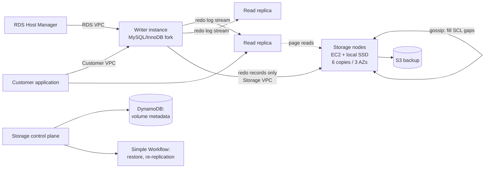

- **Engine:** a fork of community MySQL/InnoDB, diverging primarily in how InnoDB reads and
  writes to disk. Redo records for each MTR are batched, **sharded by PG**, and written to
  storage; the last record of each MTR is tagged as a consistency point.
- **Isolation:** exactly the same levels as community MySQL in the writer — the standard ANSI
  levels plus snapshot isolation / consistent reads. Read replicas receive continuous
  transaction start/commit information and use it to support snapshot isolation for local
  read-only transactions. Concurrency control never touches the storage service, which simply
  presents a view logically identical to local InnoDB storage.
- **Control plane:** Amazon RDS, including a **Host Manager (HM)** agent on the instance that
  monitors cluster health and decides on failover or instance replacement.
- **Network isolation:** three VPCs — **customer VPC** (application ↔ engine), **RDS VPC**
  (engine ↔ control plane), **storage VPC** (engine ↔ storage).
- **Storage control plane:** DynamoDB for cluster/volume configuration, volume metadata, and S3
  backup descriptions; Amazon Simple Workflow Service for long-running operations such as volume
  restore or re-replication after a node failure.

## Evaluation

Baseline: MySQL on instances with an EBS volume at **30K provisioned IOPS**; unless stated,
r3.8xlarge (32 vCPU, 244 GB RAM, Intel Xeon E5-2670 v2 Ivy Bridge), buffer cache 170 GB. Aurora
is based on the MySQL 5.6 code base. GA since July 2015.

### Scaling with instance size

SysBench read-only and write-only, 1 GB (250 tables), across r3.large → r3.8xlarge (each size
has half the vCPUs and memory of the next). Aurora's performance **doubles with each instance
size**. At r3.8xlarge: **121,000 writes/sec and 600,000 reads/sec**, ~5× MySQL 5.7 (which tops
out at 125,000 writes/sec and 20,000 reads/sec as reported in the paper's text).

### Throughput with varying data size (SysBench write-only, writes/sec)

| DB size | Aurora | MySQL |
| --- | ---: | ---: |
| 1 GB | 107,000 | 8,400 |
| 10 GB | 107,000 | 2,400 |
| 100 GB | 101,000 | 1,500 |
| 1 TB | 41,000 | 1,200 |

Up to **67× faster** at 100 GB; still **34× faster** at 1 TB with an out-of-cache working set.

### Scaling with user connections (SysBench OLTP, writes/sec)

| Connections | Aurora | MySQL |
| --- | ---: | ---: |
| 50 | 40,000 | 10,000 |
| 500 | 71,000 | 21,000 |
| 5,000 | 110,000 | 13,000 |

MySQL peaks near 500 connections and then **degrades sharply**; Aurora keeps scaling.

### Replica lag (SysBench write-only, milliseconds)

| Writes/sec | Aurora | MySQL |
| --- | ---: | ---: |
| 1,000 | 2.62 | < 1,000 |
| 2,000 | 3.42 | 1,000 |
| 5,000 | 3.94 | 60,000 |
| 10,000 | 5.38 | 300,000 |

Lag is measured as time until a committed transaction is visible on the replica.

### Hot row contention (Percona TPC-C variant, tpmC)

| Connections / size / warehouses | Aurora | MySQL 5.6 | MySQL 5.7 |
| --- | ---: | ---: | ---: |
| 500 / 10 GB / 100 | 73,955 | 6,093 | 25,289 |
| 5,000 / 10 GB / 100 | 42,181 | 1,671 | 2,592 |
| 500 / 100 GB / 1,000 | 70,663 | 3,231 | 11,868 |
| 5,000 / 100 GB / 1,000 | 30,221 | 5,575 | 13,005 |

*(The original table's column layout is ambiguous in the text conversion; the paper states
Aurora sustains 2.3×–16.3× the throughput of MySQL 5.7 across these points.)*

### Customer-reported results

- **Internet gaming company** (r3.4xlarge): average web transaction response time improved from
  **15 ms to 5.5 ms** (3×).
- **Education technology company:** before migration, P95 latencies of 40–80 ms versus P50 of
  ~1 ms — classic outlier behavior. After migration, P95 approximated P50 for both SELECT and
  per-record INSERT.
- **Replica lag at the same company:** spiked to **12 minutes** on MySQL, impacting application
  correctness so the replica was only usable as a standby. On Aurora, max lag across 4 replicas
  **never exceeded 20 ms**, letting them serve real traffic from replicas.

## Lessons learned (what cloud customers actually demand)

- **Multi-tenancy and consolidation.** SaaS customers who cannot change their application use
  schema-per-tenant consolidation (some have 50,000+ of their own customers), producing instances
  with **over 150,000 tables** — pressure on the dictionary cache and other metadata components.
  They need high throughput with many connections, pay-as-you-use storage provisioning, and low
  jitter so one tenant's spike does not harm others.
- **Highly concurrent auto-scaling workloads.** Traffic spikes (one customer had a national TV
  appearance) require handling many concurrent connections; several customers run at **over
  8,000 connections per second**.
- **Schema evolution.** ORM-driven frameworks like Rails generate frequent "DB migrations" —
  DBAs report "a few dozen migrations a week" — and MySQL implements most changes with a full
  table copy. Aurora implements online DDL that (a) **versions schemas per page** and decodes
  pages on demand using their schema history, and (b) **lazily upgrades pages** with a
  modify-on-write primitive.
- **Availability and software upgrades.** Even 30 seconds of planned downtime every ~6 weeks is
  unacceptable to many customers. **Zero-Downtime Patching (ZDP)** finds an instant with no
  active transactions, spools application state to local ephemeral storage, patches the engine,
  and reloads the state — in-flight connections and user sessions survive, unaware the engine
  changed.

## Positioning against related work

- **Decoupling storage from compute.** Deuteronomy (Transaction Component / Data Component over
  LLAMA), Sinfonia, Hyder, and Yesquel all split the kernel. **Aurora decouples at a lower
  level:** query processing, transactions, concurrency, buffer cache, and access methods stay in
  the engine; only logging, storage, and recovery become a scale-out service.
- **Distributed systems.** Aurora sidesteps the HAT impossibility results (serializability,
  snapshot isolation, and repeatable read are not highly-available-transaction compliant) by a
  **simplifying assumption: at any time a single writer generates log updates with LSNs from one
  ordered domain.** Contrast with Spanner, which achieves external consistency at global scale
  but relies on 2PC and 2PL for read/write transactions.
- **Log-structured storage.** Like Deuteronomy/LLAMA/Bw-Tree, Aurora writes deltas rather than
  whole pages and uses **pure redo logging** with a highest-stable-LSN commit rule.
- **Recovery.** Unlike Deuteronomy — which avoids redo recovery by delaying transactions so only
  committed updates reach durable storage, at the cost of constraining transaction size — Aurora
  keeps undo in the engine and distributes redo application across the fleet.

## Limitations and questions

- **Single writer.** The clean asynchronous consensus depends on one writer allocating LSNs from
  a single ordered domain. Multi-writer is outside this paper's design.
- **Undo is still centralized.** Only redo is offloaded; undo recovery and concurrency control
  remain in the engine, so long-running in-flight transactions still matter at failover.
- **The storage service is purpose-built and proprietary.** The reported gains are inseparable
  from AWS's AZ structure, EC2/EBS/S3/DynamoDB substrate, and internal failure statistics.
- **Benchmarks are vendor-authored.** Aurora is compared against community MySQL on EBS, which
  the authors also operate; the MySQL configuration choices (30K provisioned IOPS, buffer cache
  sizing) materially affect the ratios.
- **MTTR argument depends on fleet-specific failure rates.** "Two failures in a 10-second
  window plus an AZ failure" is unlikely at Amazon's observed rates; the same reasoning does not
  automatically transfer to a smaller or differently structured fleet.
- **Read replica staleness is real but small.** Replicas apply only up to VDL and lag ~20 ms;
  applications needing read-your-writes must account for this.

## Practical design checklist

Aurora's approach fits when:

- the workload is OLTP with a single writer and read-heavy scale-out needs;
- network I/O, not disk, is the binding constraint;
- recovery time and checkpoint interference are operational pain points;
- durability must survive correlated (whole-AZ) failures, not just independent node loss.

The approach is less applicable when:

- multiple concurrent writers are required;
- the storage layer cannot be co-designed with the engine (the log applicator must understand
  page formats);
- the deployment lacks the fleet scale that makes segment-level repair fast and quorum entropy
  effective.

## Takeaways

1. **Write only the log over the network.** Pages are derivable; log records are not. This is
   the single highest-leverage decision in the design.
2. **Make replication cheap enough to over-replicate.** Saving network bytes funds 6-way
   replication and parallel requests that hide jitter.
3. **Design quorums against correlated failure domains, not just node counts.** 4/6 across 3 AZs
   beats 2/3 because it survives an AZ loss plus background noise.
4. **Reduce MTTR instead of chasing MTTF.** Small (10 GB) segments make repair a 10-second
   operation, which shrinks the double-fault vulnerability window.
5. **Replace synchronous consensus with monotone progress points.** VCL/VDL/SCL advancing on
   acknowledgements, plus peer gossip to fill gaps, achieves the same guarantee as 2PC without
   its latency or failure intolerance.
6. **Separate completeness from durability.** CPLs let the storage system truncate only at
   points the engine declares atomic, which is what makes MTR semantics survive a crash.
7. **Push background work into the anti-correlated slack.** Aurora's GC and coalescing back off
   when foreground load is high — the opposite of checkpointing's behavior.
8. **A resilient design is an operational tool.** Once quorum repair is routine, heat management,
   patching, and rolling upgrades all become the same mechanism.

## Citation

```bibtex
@inproceedings{verbitski2017aurora,
  author = {Alexandre Verbitski and Anurag Gupta and Debanjan Saha and Murali Brahmadesam and
            Kamal Gupta and Raman Mittal and Sailesh Krishnamurthy and Sandor Maurice and
            Tengiz Kharatishvili and Xiaofeng Bao},
  title = {Amazon Aurora: Design Considerations for High Throughput Cloud-Native Relational
           Databases},
  booktitle = {Proceedings of the 2017 ACM International Conference on Management of Data
               (SIGMOD '17)},
  pages = {1041--1052},
  year = {2017},
  doi = {10.1145/3035918.3056101}
}
```

---

## Paper: ClickHouse: Lightning Fast Analytics for Everyone

# ClickHouse: Lightning Fast Analytics for Everyone

> VLDB 2024 — structured reading notes

Full paper content: [Markdown conversion](../original/clickhouse-vldb-2024.md)

## Paper information

- **Authors:** Robert Schulze, Tom Schreiber, Ilya Yatsishin, Ryadh Dahimene, Alexey Milovidov
- **Affiliation:** ClickHouse Inc.
- **Venue:** Proceedings of the VLDB Endowment, Volume 17, Number 12, 2024, pages 3731–3744
- **DOI:** [10.14778/3685800.3685802](https://doi.org/10.14778/3685800.3685802)
- **History:** started 2009 as a filter/aggregation operator for web-scale log data; open sourced
  2016

## One-sentence summary

ClickHouse is a columnar OLAP database built as a single dependency-free C++ binary that pairs
an LSM-inspired but flat "parts" storage layer — where background merges also *transform* data
(replace, aggregate, age out) — with a vectorized, optionally LLVM-compiled execution engine and
extremely aggressive pruning, so that petabyte-scale tables answer queries in real time.

## The five challenges it targets

1. **Huge data sets with high ingestion rates.** Needs efficient indexing, compression, and
   scale-out (single servers cap at a few dozen TB), plus the ability to continuously
   "deprioritize" (aggregate, archive) historical data without slowing concurrent reporting.
2. **Many simultaneous queries with low-latency expectations.** Ad-hoc queries need good
   optimization; recurring queries invite adapting the physical layout. Resource access (CPU,
   memory, disk and network I/O) must be prioritizable across many concurrent queries.
3. **Diverse landscapes of data stores, locations, and formats.** Must read and write external
   data in essentially any system or format.
4. **Convenient query language with performance introspection.** An expressive SQL dialect with
   nested types and rich function libraries, plus tooling to introspect system and query
   performance.
5. **Industry-grade robustness and versatile deployment.** Replication against node failure; run
   on anything from an old laptop to a big server; deployed as a **native binary** to avoid JVM
   garbage-collection overhead and enable bare-metal SIMD.

## Architecture

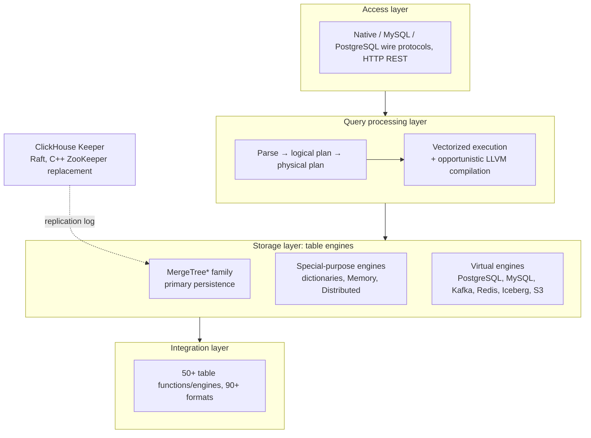

Orthogonal components handle threading, caching, role-based access control, backups, and
continuous monitoring. Query languages: a feature-rich SQL dialect, PRQL, or Kusto's KQL.

### Table engine categories

| Category | Purpose | Examples |
| --- | --- | --- |
| **MergeTree\*** | Primary persistence format; LSM-inspired sorted parts merged in the background; variants differ in *how* the merge combines rows | MergeTree, ReplacingMergeTree, AggregatingMergeTree, ReplicatedMergeTree\* |
| **Special-purpose** | Speed up or distribute execution | **Dictionaries** (in-memory key-value caches of a periodically re-executed query — big latency win where staleness is tolerable), Memory engine for temp tables, **Distributed** engine for transparent sharding |
| **Virtual** | Bidirectional exchange with external systems | PostgreSQL, MySQL, Kafka, RabbitMQ, Redis, Iceberg, Delta Lake, Hudi, S3, GCS |

### Sharding and replication

- **Sharding** partitions a table by a sharding expression into mutually independent tables
  typically on different nodes. Clients may address shards directly or use the **Distributed**
  engine for a global view. Purpose: exceed single-node capacity (a few dozen TB) and balance
  read/write load.
- **Replication** is orthogonal: each MergeTree\* engine has a **ReplicatedMergeTree\***
  counterpart using **multi-master coordination over Raft**, implemented by **Keeper** — a
  drop-in ZooKeeper replacement written in C++.

### Deployment modes

| Mode | Description |
| --- | --- |
| **On-premise** | Single server or multi-node cluster with sharding/replication (the paper's focus) |
| **Cloud** | ClickHouse Cloud, a fully managed autoscaling DBaaS (architecture deferred to a follow-up paper) |
| **Standalone** | CLI utility for analyzing/transforming files — a SQL alternative to `cat`/`grep`, no configuration, single server only |
| **In-process (chDB)** | DuckDB-inspired embedding into a host process (Jupyter + Pandas), passing source and result data without copying since they share an address space |

## Storage layer

### On-disk format

- A table is a collection of **immutable parts**. Every INSERT creates a part. Parts are
  **self-contained**: they carry all metadata needed to interpret their contents, with no
  central catalog lookup.
- A background merge job combines smaller parts into larger ones until a configurable size cap
  (**150 GB** by default). Because parts are sorted by primary key, merging is **k-way merge
  sort**. Source parts are marked inactive and deleted once their reference count reaches zero.
- **Critical divergence from classic LSM trees:** ClickHouse treats **all parts as equal**
  instead of arranging them in levels. Merges are not confined to a level. This also forgoes the
  implicit chronological ordering of parts, which is why updates and deletes cannot use
  tombstones (see below). ClickHouse also **writes inserts directly to disk** rather than through
  a write-ahead log.

**Insert modes:**

| Mode | Behavior |
| --- | --- |
| **Synchronous** | Each INSERT creates a part; clients are encouraged to batch (e.g. 20,000 rows) to keep merge overhead low |
| **Asynchronous** | The server buffers rows from multiple INSERTs into the same table and creates a part only when the buffer exceeds a threshold or a timeout expires — for observability workloads with thousands of agents sending tiny payloads |

**Physical layout hierarchy:**

| Unit | Size | Role |
| --- | --- | --- |
| **Part** | directory, one file per column (small parts < 10 MB store columns consecutively in one file for spatial locality) | Unit of insert, merge, mutation |
| **Granule** | **8192 rows** | Smallest indivisible unit processed by scan and index-lookup operators |
| **Block** | configurable byte size, **1 MB** default; variable number of granules | Unit of I/O and compression |

- Blocks are compressed (default **LZ4**; specialized codecs like **Gorilla** or **FPC** for
  floating-point). Codecs **chain**: e.g. delta coding to remove logical redundancy, then
  heavyweight compression, then AES encryption.
- To keep random granule access fast despite compression, each column stores a mapping from
  granule id → (offset of its compressed block in the column file, offset of the granule within
  the uncompressed block).
- **Wrapper types:** `LowCardinality(T)` dictionary-encodes values to integer ids;
  `Nullable(T)` adds an internal null bitmap.
- Tables can be **range, hash, or round-robin partitioned** by arbitrary expressions. Min/max of
  the partitioning expression is stored per partition to enable partition pruning. Optional
  advanced statistics (**HyperLogLog**, **t-digest**) give cardinality estimates.

### Three data pruning techniques

**1. Primary key index (sparse, locally clustered).** Primary key columns determine the sort
order *within each part*. Per part, ClickHouse stores a mapping from the primary key values of
**each granule's first row** to the granule id — so the index is sparse and typically fits fully
in memory: **1,000 entries index 8.1 million rows**. Equality and range predicates are answered
by binary search instead of a sequential scan. The local sort order is also exploited for merges
and for plan optimization (removing sort operators, enabling sort-based aggregation).

**2. Projections.** Alternative versions of the table containing the same rows sorted by a
*different* primary key. They accelerate filters on non-primary-key columns at the cost of
insert, merge, and space overhead. By default they are populated **lazily** from newly inserted
parts only, unless materialized in full. The optimizer chooses main table vs. projection by
estimated I/O cost, and falls back to the main table part where no projection exists.

**3. Skipping indices.** Lightweight metadata over groups of consecutive granules (configurable
granularity), on arbitrary index expressions:

| Type | Stores | Best for | Limitation |
| --- | --- | --- | --- |
| **Min-max** | min and max of the index expression per block | Locally clustered data with small absolute ranges (loosely sorted) | — |
| **Set** | a configurable number of unique values per block | Small local cardinality ("clumped together" values) | — |
| **Bloom filter** | row, token, or n-gram bloom filters with configurable false-positive rate | Text search | **Cannot** serve range or negative predicates |

### Merge-time data transformation

Merges are not just compaction — they are the mechanism for continuously reducing historical
data volume without touching INSERT performance. The trade-off is that a table can transiently
contain unwanted (outdated, non-aggregated) values; specifying `FINAL` in a SELECT applies the
transformation at query time instead.

- **Replacing merges** keep only the most recent version of a tuple, judged by the containing
  part's creation timestamp (or an explicit *version column*). Tuples are equivalent if their
  primary key values match. Used as a merge-time update mechanism, or as an alternative to
  insert-time deduplication.
- **Aggregating merges** collapse rows with equal primary key values into an aggregated row.
  Non-key columns must hold **partial aggregation states** (e.g. sum + count for `avg()`), which
  merges combine pairwise. Mostly used with **materialized views**: unlike other databases,
  ClickHouse never periodically refreshes a view from the whole source table — the view is
  updated **incrementally** with the transformation query's result whenever a new part is
  inserted into the source. `-State` suffixed aggregate functions produce partial states;
  `-Merge` consolidates them at read time.
- **TTL merges** provide data aging and, unlike the others, process **one part at a time**. A
  rule pairs a *trigger* (an expression producing a timestamp per row, compared against merge
  time) with an *action*. Although the trigger is row-granular, in practice checking that **all**
  rows satisfy the condition and acting on the whole part proved sufficient. Actions:
  1. move the part to another volume (cheaper/slower storage),
  2. re-compress the part with a heavier codec,
  3. delete the part,
  4. roll up — aggregate rows by a grouping key.

```sql
CREATE TABLE tab(ts DateTime, msg String)
ENGINE MergeTree PRIMARY KEY ts
TTL (ts + INTERVAL 1 WEEK) TO VOLUME 's3'
```

### Updates and deletes

The engine favors append-only workloads, but two mechanisms exist, **neither of which blocks
parallel inserts**:

| Mechanism | How | Cost |
| --- | --- | --- |
| **Mutations** | Rewrite all parts of a table in place. Deliberately **non-atomic** (parallel SELECTs may see mutated and non-mutated parts) so the table/column does not temporarily double in size. Guarantees the data is physically changed when done. | Expensive — delete mutations rewrite *all columns in all parts* |
| **Lightweight deletes** | Update an internal bitmap column; SELECTs get an added filter on the bitmap. Rows are physically removed only by a later regular merge, at an unspecified time. | Much faster than mutations when there are many columns, at the cost of slower SELECTs |

Updates and deletes on the same table are expected to be rare and are serialized to avoid
logical conflicts.

### Idempotent inserts

The classic problem: after a connection timeout, the client cannot tell whether its data was
inserted. Traditional solutions re-send and rely on primary key/unique constraints backed by
per-tuple index structures (B-trees, radix trees, hash tables) — whose space and update overhead
is prohibitive at ClickHouse's data sizes and ingest rates.

ClickHouse instead exploits the fact that **each insert eventually creates a part**: the server
keeps hashes of the **last N inserted parts (e.g. N = 100)** and ignores re-inserts of a known
hash. Hashes live locally for non-replicated tables and in Keeper for replicated ones. Clients
can supply an explicit **insert token** acting as the part hash for finer control. Hashing new
rows costs something; storing and comparing the hashes is negligible.

### Data replication

Replication is defined over **table states** = the set of parts plus table metadata (column
names, types). Three operations advance a state:

1. **Inserts** add a part.
2. **Merges** add a part and delete existing parts.
3. **Mutations and DDL** add/delete parts and/or change metadata.

Operations execute locally on one node and are recorded as state transitions in a global
**replication log** maintained by a Keeper ensemble (typically three processes) over Raft. All
nodes start at the same log position and replay the log **asynchronously**, so replicated tables
are **eventually consistent** — nodes may temporarily serve older states. Most operations can
alternatively run synchronously until a quorum (majority or all) adopts the new state.

Three synchronization optimizations:

1. **New nodes do not replay from scratch** — they copy the state of the node that wrote the
   last log entry.
2. **Merges may be replayed locally or fetched** as a result part from another node —
   configurable, trading CPU against network I/O. Cross-datacenter replication typically prefers
   local merges to minimize cost.
3. **Mutually independent log entries replay in parallel** (e.g. fetches of consecutively
   inserted parts, or operations on different tables).

### ACID compliance (deliberately partial)

ClickHouse avoids latching wherever possible. Each query runs against a **snapshot of all parts
in all involved tables** taken at query start, so parts created by concurrent INSERTs or merges
never participate; reference counts on processed parts prevent modification or removal for the
query's duration. Formally this is **snapshot isolation via an MVCC variant over versioned
parts**.

Consequences, stated plainly by the authors:

- Statements are **generally not ACID-compliant**, except in the rare case where concurrent
  writes at snapshot time each affect only a single part.
- Newly inserted parts are **not fsync'd by default**, letting the kernel batch writes — trading
  atomicity for throughput, on the basis that write-heavy decision-making use cases tolerate a
  small risk of losing recent data in a power outage.

## Query processing layer

Parallelism happens at three granularities: **data elements** (SIMD), **data chunks** (threads
on one node), and **table shards** (nodes).

### SIMD parallelization

Hot code is compiled into multiple **compute kernels** — e.g. a non-vectorized kernel, an
auto-vectorized AVX2 kernel, and a hand-written AVX-512 kernel. The fastest available is chosen
at runtime via `cpuid`. Minimum requirement is SSE 4.2, so ClickHouse runs on 15-year-old
hardware while still exploiting modern CPUs.

### Multi-core parallelization

The physical operator plan is unfolded at compile time into independent **execution lanes**,
based on a configurable max worker-thread count (default: number of cores) and source table
size. Lanes decompose data into non-overlapping ranges and are **merged as late as possible**.

Worked example (an OLAP query grouping page impressions by region and sorting by average
latency):

1. **Stage 1:** three disjoint source ranges are filtered simultaneously. A **Repartition**
   exchange operator dynamically routes chunks into stage 2 to keep threads evenly loaded — lanes
   become imbalanced when scanned ranges have very different selectivities.
2. **Stage 2:** surviving rows are grouped by `RegionID`. **Aggregate** operators maintain local
   groups holding partial aggregation states (per-group sum and count for `avg()`). A
   **GroupStateMerge** operator merges them into a global result; it is a **pipeline breaker**,
   so stage 3 cannot begin until aggregation completes.
3. **Stage 3:** a **Distribute** exchange operator splits result groups into three equal disjoint
   partitions, then sorting proceeds in three steps — **ChunkSort** (sort individual chunks),
   **StreamSort** (maintain a local sorted result, 2-way merging incoming sorted chunks),
   **MergeSort** (k-way merge of local results).

**Operators are state machines** connected by input/output ports with three states:

| State | Transition |
| --- | --- |
| `need-chunk` → `ready` | A chunk is placed in the input port |
| `ready` → `done` | Operator processes input, generates output chunk |
| `done` → `need-chunk` | Output chunk removed from the output port |

The first and third transitions between two connected operators happen as one combined step.
Source operators only have `ready`/`done`; sink operators only `need-chunk`/`done`.

Worker threads continuously traverse the plan performing transitions. The plan carries **hints
that the same thread should process consecutive operators in a lane**, keeping CPU caches hot.
Parallelism is both **horizontal** (concurrent Aggregate operators within a stage) and
**vertical** (Filter and Aggregate in the same lane running simultaneously across stages not
separated by a pipeline breaker). The degree of parallelism can change **mid-query** between one
and the query's maximum, to avoid over/undersubscription as queries start and finish.

Two runtime adaptations: operators can **create and connect new operators** (mainly to switch to
external aggregation/sort/join algorithms rather than cancel a query that exceeds a memory
threshold), and can **request that worker threads move to an asynchronous queue** while waiting
for remote data.

**Versus morsel-driven parallelism:** similar in that lanes run on different cores/NUMA sockets,
threads can steal work, and there is no central scheduler (threads pick tasks by traversing the
plan). Different in that ClickHouse **bakes the maximum degree of parallelism into the plan** and
uses **much larger ranges** than the typical ~100,000-row morsel. This can stall when lane filter
runtimes differ vastly, but liberal use of exchange operators like `Repartition` keeps
imbalances from accumulating across stages.

### Multi-node parallelization

The **initiator node** (the one receiving the query) pushes as much work as possible to shard
nodes. Remote nodes may:

1. stream raw source columns to the initiator,
2. filter and send only surviving rows,
3. execute filter + aggregation and send local groups with partial aggregation states, or
4. run the entire query including filter, aggregation, and sorting.

### Holistic performance optimizations

**Query optimization.** On the semantic representation from the AST: constant folding
(`concat(lower('a'),upper('b'))` → `'aB'`), scalar extraction from aggregates (`sum(a*2)` →
`2 * sum(a)`), common subexpression elimination, disjunction-to-IN-list rewriting (`x=c OR x=d`
→ `x IN (c,d)`). On the logical plan: filter pushdown, reordering function evaluation versus
sorting by estimated cost. On the physical plan, exploiting table-engine specifics: if `ORDER BY`
columns form a **prefix of the primary key**, data is read in disk order and sort operators are
removed; if grouping columns form a prefix, **sort aggregation** replaces hash aggregation —
significantly less memory-intensive, and each aggregate value can be passed downstream as soon
as its run completes.

**Query compilation (LLVM).** Adjacent operators are fused — `a * b + c + 1` becomes one operator
instead of three. Also used for evaluating multiple aggregate functions at once (`GROUP BY`) and
for multi-key sorting. Benefits: fewer virtual calls, data kept in registers/caches, easier
branch prediction, plus compiler-grade logical and peephole optimizations and access to the
fastest locally available instructions. Compilation triggers only after the same expression has
been executed more than a configurable number of times across queries; compiled operators are
**cached and reused**.

**Primary key index evaluation.** Used when a subset of the CNF filter clauses forms a prefix of
the primary key columns. The index is analyzed left-to-right over lexicographically sorted key
ranges, evaluating clauses with **ternary logic** — all true, all false, or mixed; mixed ranges
are split into sub-ranges and analyzed recursively. Two function-aware optimizations:

- **Monotonicity traits.** Functions declare monotonicity (e.g. `toDayOfMonth(date)` is piecewise
  monotonic within a month), letting the optimizer infer that a function yields sorted output on
  sorted key ranges.
- **Preimage computation.** Comparisons against function results are rewritten as comparisons on
  the raw key: `toYear(k) = 2024` becomes `k >= 2024-01-01 && k < 2025-01-01`.

**Data skipping at runtime.** Filters on different columns are evaluated **sequentially in order
of descending estimated selectivity** (heuristics plus optional column statistics); only chunks
containing at least one matching row are passed to the next predicate, so the data volume and
computation shrink from predicate to predicate. Applied **only when at least one highly selective
predicate exists** — otherwise latency would be worse than evaluating all predicates in parallel.
(This technique is credited with the significant benchmark improvement in August 2022.)

**Hash tables.** Over **30 hash table types** as of March 2024, instantiated from a generic
template with hash function, allocator, cell type, and resize policy as variation points; the
fastest is selected per operator based on grouping-column data type, estimated cardinality, and
other factors. Specific optimizations:

- two-level layout with **256 sub-tables** keyed on the first byte of the hash, for huge key sets;
- **string hash tables** with four sub-tables and different hash functions per string length;
- **lookup tables** using the key directly as bucket index (no hashing) when there are few keys;
- **values with embedded hashes** for faster collision resolution when comparison is expensive
  (strings, ASTs);
- **size prediction from runtime statistics** to avoid resizes;
- allocating multiple small hash tables with the same lifecycle on a **single memory slab**;
- **instant clearing for reuse** via per-map and per-cell version counters;
- `__builtin_prefetch` to speed value retrieval after hashing.

**Joins.** ClickHouse originally supported joins only rudimentarily, so many use cases used
denormalized tables. Today it offers all SQL join types (inner, left/right/full outer, cross,
as-of) and multiple algorithms: hash join (naïve and grace), sort-merge join, and index join for
engines with fast key-value lookup (usually dictionaries).

The parallel hash join uses the **non-blocking, shared-partition algorithm** of Blanas et al.:
the build phase is split into lanes over disjoint source ranges, and instead of one global hash
table, a **partitioned** hash table is used. Worker threads compute `hash mod partitions` to pick
the target partition for each build row; access to partitions is synchronized via **Gather**
exchange operators. The probe phase locates partitions the same way. The extra two hash
computations per tuple buy a large reduction in latch contention during build.

### Workload isolation

Three mechanisms let users bind queries into workload classes with bounded shared-resource use:

- **Concurrency control:** worker threads per query are adjusted dynamically as a specified ratio
  of available cores, preventing thread oversubscription under high concurrency.
- **Memory limits:** allocation byte sizes are tracked at server, user, and query level.
  **Memory overcommit** lets a query use free memory beyond its guarantee while still assuring
  other queries' limits. Aggregation, sort, and join memory can be capped individually, causing
  fallback to external algorithms.
- **I/O scheduling:** local and remote disk access limited per workload class by maximum
  bandwidth, in-flight requests, and policy (FIFO, SFC).

## Integration layer

**Push-based** integration (ETL tools moving data into the database) is more versatile and common
but adds architectural footprint and a scalability bottleneck. ClickHouse emphasizes
**pull-based** integration — the database connects out — which enables joins between local and
remote data and shortens time to insight. The idea is not new (SQL/MED foreign data wrappers,
standardized 2001, in PostgreSQL since 2011), but ClickHouse claims the most built-in options of
any analytical database as of March 2024: **50+ integration table functions and engines**
covering ODBC, MySQL, PostgreSQL, SQLite, Kafka, Hive, MongoDB, Redis, S3/GCP/Azure object
stores, and data lakes.

| Access type | Mechanism | Behavior |
| --- | --- | --- |
| **Temporary** | Integration **table functions** in a `FROM` clause; `INSERT INTO TABLE FUNCTION` to write out | Ad-hoc exploration |
| **Persisted** | Integration **table engines** — a remote source presented as a persistent local table (custom schema or schema inference) | **Passive:** forward queries to the remote system and populate a local proxy table. **Active:** periodically pull, or subscribe to remote changes (e.g. PostgreSQL logical replication), keeping a full local copy |
| **Persisted** | Integration **database engines** — map all tables of a remote schema into ClickHouse | Generally requires a relational remote store; limited DDL support |
| **Persisted** | **Dictionaries** populated by arbitrary queries against nearly any source | Always active — pulled at constant intervals |

**Data formats:** 90+ formats besides the native one, including CSV, JSON, Parquet, Avro, ORC,
Arrow, and Protobuf, each usable as input, output, or both. Analytics-oriented formats such as
Parquet are integrated with query processing — the optimizer exploits embedded statistics and
filters are evaluated directly on compressed data.

**Compatibility interfaces:** besides its native binary protocol and HTTP, ClickHouse speaks the
MySQL and PostgreSQL wire protocols, enabling access from proprietary BI tools without native
connectors.

## Performance introspection

All tools are exposed through a uniform **system tables** interface:

- **Server and query metrics** — active part count, network throughput, cache hit rates; per
  query, blocks read and index usage. Computed synchronously on request or asynchronously at
  configurable intervals.
- **Sampling profiler** over server thread callstacks, exportable to flamegraph visualizers.
- **OpenTelemetry integration** — generate spans at configurable granularity for all query
  processing steps, and collect/analyze spans from other systems.
- **EXPLAIN** for AST, logical and physical plans, and execution-time behavior.

## Evaluation

### ClickBench (denormalized tables — the historical primary use case)

- 43 queries over a table of **100 million anonymized page hits** from one of the web's largest
  analytics platforms, simulating ad-hoc and periodic clickstream/traffic reporting; exercises
  sequential and index scan access paths and routinely exposes CPU-, I/O-, and memory-bound
  operators.
- Hardware: single-node AWS EC2 **c6a.4xlarge** (16 vCPU, 32 GB RAM, 5000 IOPS / 1000 MiB/s
  disk). Comparable sizes for **Redshift ra3.4xlarge** (12 vCPU, 96 GB) and **Snowflake warehouse
  size S** (2×8 vCPU, 2×16 GB).
- Physical design tuned only lightly — primary keys specified, but no per-column compression
  tuning, projections, or skipping indexes; Linux page cache flushed before each cold run; no
  database or OS knob tuning.
- Scoring: per query, the fastest runtime across databases is the baseline; relative runtime is
  `(t_q + 10 ms) / (t_baseline + 10 ms)`; a database's total is the **geometric mean** of its
  per-query ratios.
- **Result:** the research system **Umbra** achieves the best overall hot runtime; **ClickHouse
  outperforms all other production-grade databases** for both hot and cold runtimes (compared
  against MySQL, PostgreSQL, Druid, Redshift, Pinot, Snowflake). *(The per-system numeric values
  in Figure 10 are garbled in the text conversion; consult the PDF or the live dashboard at
  benchmark.clickhouse.com for exact figures.)*

### VersionsBench (regression tracking over time)

Run once per month on each new release to detect performance-degrading code changes. It combines
four benchmarks: **ClickBench**, **15 MgBench queries**, **13 queries on a denormalized Star
Schema Benchmark fact table with 600 million rows**, and **4 queries on NYC Taxi Rides with 3.4
billion rows**. Runtimes are normalized by a geometric mean weighted by each query's ratio to its
minimum runtime across all versions.

Across **77 versions from March 2018 to March 2024**, performance improved by **1.72×**.
Performance deteriorated temporarily in some periods, but LTS releases were generally comparable
to or better than the previous LTS. The large jump in **August 2022** came from the
column-by-column (selectivity-ordered) filter evaluation technique.

### TPC-H (normalized tables — an emerging use case)

- Scale factor 100, single-node AWS EC2 **c6i.16xlarge** (64 vCPU, 128 GB RAM, 5000 IOPS /
  1000 MiB/s disk), fastest of five runs, using the parallel hash join. Reference measurements on
  **Snowflake warehouse size L** (8×8 vCPU, 8×16 GB).
- **Eleven queries excluded:** Q2, Q4, Q13, Q17, Q20–Q22 use **correlated subqueries** unsupported
  as of ClickHouse v24.6; Q7–Q9 and Q19 need **join reordering and join predicate pushdown**,
  both missing as of v24.6, to reach viable runtimes.
- Of the remaining 11 queries, **5 were faster in ClickHouse and 6 in Snowflake**. Automatic
  subquery decorrelation and better optimizer support for joins were planned for 2024.

## Positioning against related work

- **Druid and Pinot** are the closest in goals — real-time analytics with high ingestion, tables
  split into horizontal segments. Differences: ClickHouse **continuously merges** parts and can
  reduce data volume via merge-time transformation, whereas Druid/Pinot parts stay **immutable
  forever**; Druid and Pinot need **specialized node types** to create, mutate, and search tables,
  whereas ClickHouse uses a **single monolithic binary** for everything.
- **Snowflake** — shared-disk cloud warehouse; micro-partitions resemble parts, and optional
  clustered indexes resemble primary keys. But Snowflake persists **hybrid PAX pages** while
  ClickHouse is **strictly columnar**.
- **Photon and Velox** — embeddable execution kernels fed query plans, over Parquet and Arrow
  respectively. They do not optimize plans (Velox does basic expression optimization) but use
  runtime adaptivity such as switching kernels by data characteristics; ClickHouse's runtime
  adaptivity is operator creation (switching to external algorithms under memory pressure). The
  Photon paper argues code-generating designs are harder to develop and debug than interpreted
  vectorized ones; Velox's experimental codegen builds and links a shared library from generated
  C++, while ClickHouse talks directly to **LLVM's on-request compilation API**.
- **DuckDB** — also embeddable, but adds query optimization and **serializable transactions**
  (Hyper's MVCC scheme), targeting OLAP mixed with occasional OLTP, hence the **DataBlocks**
  format with lightweight compression (order-preserving dictionaries, frame-of-reference).
  ClickHouse instead assumes append-only workloads, uses **heavyweight compression** (LZ4) on the
  assumption that users prune aggressively and that I/O dwarfs decompression cost, and offers only
  **snapshot isolation**.

## Limitations and questions

- **Not ACID.** Snapshot isolation only, no user transactions (planned), and no fsync on insert by
  default — an explicit durability/throughput trade that not every workload can accept.
- **Eventually consistent replication** by default; strong consistency requires opting into
  synchronous quorum operations.
- **Merge-time transformation is best-effort.** Between merges a table can hold outdated or
  un-aggregated rows; correctness-sensitive readers must pay for `FINAL`.
- **Join and optimizer maturity.** As of v24.6, no correlated subquery support, no join
  reordering, no join predicate pushdown — which is why 11 of 22 TPC-H queries were excluded.
  The design's historical answer to joins was denormalization.
- **Updates and deletes are second-class.** Mutations rewrite everything and are deliberately
  non-atomic; lightweight deletes trade SELECT speed and defer physical removal indefinitely.
- **Vendor-authored benchmarks.** ClickBench is defined and hosted by ClickHouse Inc., though
  results are contributed independently and the data set and queries are public.
- **Parallelism is planned, not adaptive.** Baking the max degree of parallelism into the plan
  with large ranges can stall when lane runtimes diverge — the authors acknowledge this and
  mitigate with exchange operators rather than smaller morsels.

## Practical design checklist

ClickHouse fits when:

- workloads are append-heavy with rare updates/deletes;
- queries filter and aggregate over wide denormalized tables;
- ingestion is continuous and high-rate, and historical data can be aggregated or aged out;
- sub-second latency matters more than transactional guarantees;
- integration with many external stores and formats is required.

Look elsewhere when:

- you need serializable transactions, or ACID guarantees per statement;
- the workload is join-heavy over a normalized star/snowflake schema requiring a mature
  cost-based join optimizer;
- frequent point updates/deletes dominate;
- strict read-your-writes consistency across replicas is required without synchronous quorums.

## Takeaways

1. **Make the background merge do useful work.** Compaction is unavoidable in an LSM-shaped
   store; ClickHouse turns it into the aggregation, deduplication, re-compression, and tiering
   mechanism, so data reduction costs nothing extra on the insert path.
2. **Flat parts beat leveled LSM for analytics** — merges are unconstrained by level, at the cost
   of losing chronological ordering (hence no tombstones, hence mutations and bitmap deletes).
3. **Sparse indexes are enough when data is sorted.** Indexing one key per 8192-row granule keeps
   the index in memory (1,000 entries for 8.1M rows) and turns range predicates into binary
   search.
4. **Layer pruning: primary key → projections → skipping indices → runtime selectivity
   ordering.** Each layer catches what the previous cannot, and none require indexing every tuple.
5. **Idempotency can be cheap if you pick the right unit.** Hashing the last 100 *parts* replaces
   a per-tuple uniqueness index entirely.
6. **Specialize aggressively where it is measurable.** 30+ hash table variants, multiple SIMD
   kernels chosen by `cpuid`, and JIT compilation triggered only after repeated execution.
7. **State the consistency trade explicitly.** Not fsync-ing inserts and shipping only snapshot
   isolation are choices matched to the target workload, documented rather than hidden.
8. **Pull-based integration keeps the architecture small.** Connecting the database outward
   avoids an entire ETL tier and enables local-remote joins.

## Citation

```bibtex
@article{schulze2024clickhouse,
  author = {Robert Schulze and Tom Schreiber and Ilya Yatsishin and Ryadh Dahimene and
            Alexey Milovidov},
  title = {ClickHouse - Lightning Fast Analytics for Everyone},
  journal = {Proceedings of the VLDB Endowment},
  volume = {17},
  number = {12},
  pages = {3731--3744},
  year = {2024},
  doi = {10.14778/3685800.3685802}
}
```

---

## Paper: CockroachDB: The Resilient Geo-Distributed SQL Database

# CockroachDB: The Resilient Geo-Distributed SQL Database

> SIGMOD 2020 Industrial Track — structured reading notes

Full paper content: [Markdown conversion](../original/cockroachdb-sigmod-2020.md)

## Paper information

- **Authors:** Rebecca Taft, Irfan Sharif, Andrei Matei, Nathan VanBenschoten, Jordan Lewis,
  Tobias Grieger, Kai Niemi, Andy Woods, Anne Birzin, Raphael Poss, Paul Bardea, Amruta Ranade,
  Ben Darnell, Bram Gruneir, Justin Jaffray, Lucy Zhang, Peter Mattis
- **Affiliation:** Cockroach Labs, Inc.
- **Venue:** SIGMOD 2020, Portland, OR, USA, pages 1493–1509 (17 pages)
- **DOI:** [10.1145/3318464.3386134](https://doi.org/10.1145/3318464.3386134)
- **License:** source-available under a Business Source License that converts to Apache 2.0 after
  three years; source on GitHub

## One-sentence summary

CockroachDB (CRDB) delivers serializable, geo-distributed SQL on commodity hardware by combining
Raft-replicated ~64 MiB Ranges, hybrid-logical clocks with an uncertainty interval instead of
Spanner's commit-wait, and an optimistic MVCC transaction protocol whose *read refresh* mechanism
lets a transaction move its timestamp forward without losing serializability.

## Problem

A global company with users in Europe, Australia, and a fast-growing US base needs all of the
following at once:

- **Regulatory domiciling** — GDPR requires European personal data to stay in the EU.
- **Locality for latency** — data should reside near the users who access it most, and follow
  them when they travel (within regulatory limits).
- **"Always on"** — survive a full regional failure.
- **SQL with serializable transactions** — to avoid anomalies and simplify application code.

Legacy DBMSs cannot do this; systems with reduced isolation permit anomalies that can surface as
security vulnerabilities. CRDB's philosophy is to **eliminate the anomalies rather than expect
developers to handle them**.

Three headline features address these requirements:

1. **Fault tolerance and high availability** — at least three replicas of every partition across
   diverse geographic zones, with automatic recovery.
2. **Geo-distributed partitioning and replica placement** — horizontally scalable with automatic
   capacity growth and data migration, default heuristics for placement, plus fine-grained user
   control for performance tuning or data domiciling.
3. **High-performance transactions** — serializable isolation **with no specialized hardware**;
   standard NTP-class clock synchronization suffices, so CRDB runs on off-the-shelf servers in
   any public or private cloud. CRDB is also **cloud-neutral**: one cluster can span arbitrary
   public and private clouds, mitigating vendor lock-in.

## Architecture

Shared-nothing: every node does both storage and computation; clients can connect to any node.
Within a node the design is layered:

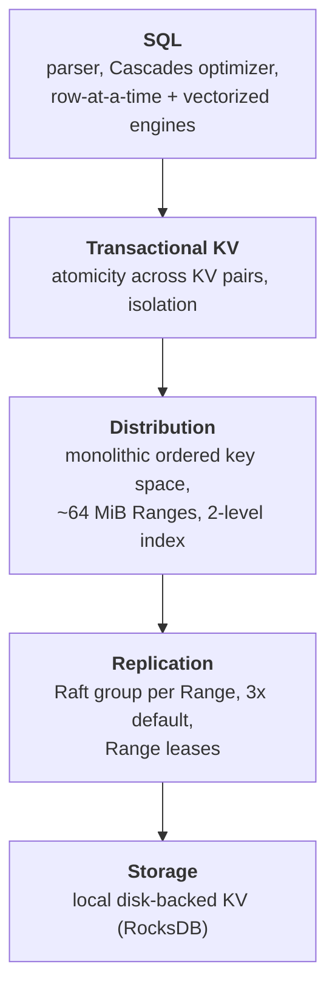

| Layer | Responsibility | Notes |
| --- | --- | --- |
| **SQL** | User interface: parser, optimizer, execution | Generally unaware of partitioning — the layers below present a single monolithic KV store (deliberately broken for distributed execution) |
| **Transactional KV** | Atomicity of multi-key changes; isolation guarantees | The heart of the paper |
| **Distribution** | One logical key space, ordered by key, covering system and user data | **Range-partitioned into ~64 MiB contiguous chunks ("Ranges")**; ordering maintained in a two-level index inside system Ranges, aggressively cached |
| **Replication** | Durability via consensus | Each Range replicated 3 ways by default on distinct nodes |
| **Storage** | Local KV store with efficient writes and range scans | RocksDB, treated as a black box in the paper |

**Why ~64 MiB?** Small enough to move quickly between nodes, large enough to hold a contiguous
set of data likely accessed together. Ranges start empty, grow, **split** when too large,
**merge** when too small, and also **split based on load** to relieve CPU hotspots.

### Replication using Raft

- Replicas of a Range form a **Raft group** — one long-lived leader plus followers. The unit of
  replication is a **command**: a sequence of low-level edits to the storage engine. Raft
  maintains a consistent ordered log; each replica applies commands as Raft commits them.
- **Range-level leases:** a single replica (usually the Raft leader) is the **leaseholder** — the
  only replica allowed to serve authoritative up-to-date reads or propose writes. Because all
  writes go through it, **reads bypass Raft round trips without sacrificing consistency**.
- **Liveness:** user-Range leases are tied to node liveness; nodes heartbeat a special record in
  a system Range every **4.5 seconds**. System Ranges use expiration-based leases renewed every
  **9 seconds**. A replica that detects a dead leaseholder tries to acquire the lease.
- **Lease acquisition piggybacks on Raft** — the acquiring replica commits a special lease
  acquisition log entry, and the request includes a copy of the lease it believed valid, so that
  leases cannot overlap in time. **Lease disjointness is essential to CRDB's isolation
  guarantees.**

### Membership changes and rebalancing

Node addition, removal, and temporary or permanent failure are all treated the same way: load is
redistributed.

- **Short-term failures:** Raft continues as long as a majority of replicas survive, electing a
  new leader if needed. A returning replica catches up either by (1) a full Range snapshot or
  (2) the missing Raft log entries — chosen based on how many writes it missed.
- **Long-term failures:** CRDB automatically creates new replicas of under-replicated Ranges
  from the surviving ones. Node liveness data and cluster metrics driving these decisions
  propagate via a **peer-to-peer gossip protocol**.

### Replica placement

- **Manual:** nodes are configured with attributes describing capability (hardware, RAM, disk
  type) and locality (country, region, AZ). Table schemas carry placement constraints and
  preferences; e.g. a `region` column can define the table's partitioning and map partitions to
  geographic regions.
- **Automatic:** CRDB spreads replicas across failure domains (disk, rack, datacenter, region)
  within the specified constraints, and uses heuristics to balance load and disk utilization.

### Data placement policies

| Policy | Reads | Writes | Survives | Cost |
| --- | --- | --- | --- | --- |
| **Geo-Partitioned Replicas** | Fast intra-region | Fast intra-region | AZ failure only — region failure makes that region's data unavailable | Best latency; also the primary tool for **data domiciling** |
| **Geo-Partitioned Leaseholders** | Fast intra-region (leaseholder pinned to access region) | Slower cross-region | **Regional failure** | Cross-region write latency |
| **Duplicated Indexes** | Fast local reads from a per-region index copy, each with a locally pinned leaseholder | Slower cross-region, higher write amplification | Regional failure | Best for infrequently updated data, or data that cannot be tied to a geography |

## Transactions

CRDB uses an MVCC variant to provide **serializable isolation**; transactions can span the whole
key space.

### The coordinator

A SQL transaction starts at the **gateway node** for the connection, which acts as the
**transaction coordinator**. Applications typically connect to a geographically close gateway.

```text
Algorithm 1 — Transaction Coordinator
 1  inflightOps ← ∅ ; txnTimestamp ← now()
 2  for op ← KV operation from SQL layer
 3      op.ts ← txnTimestamp
 4      if op.commit
 5          op.deps ← inflightOps                       # commit depends on everything
 6      else
 7          op.deps ← { x ∈ inflightOps | x.key = op.key }   # only same-key deps
 8      inflightOps ← (inflightOps − op.deps) ∪ { op }
 9      resp ← SendToLeaseholder(op)
10      if resp.ts > op.ts                              # a reader pushed us forward
11          if op.key unchanged over (txnTimestamp, resp.ts]
12              txnTimestamp ← resp.ts                  # read refresh succeeded
13          else
14              return transaction failed
15      send resp to SQL layer
16      if op.commit
17          asynchronously notify leaseholder to commit
```

SQL requires a response to each operation before the next is issued, so the coordinator uses two
optimizations to avoid stalling on replication. **Together they let many multi-statement SQL
transactions complete with the latency of just one round of replication.**

**Write Pipelining.** A non-committing operation executes immediately if it does not overlap an
earlier in-flight operation, so operations on different keys pipeline. An operation depending on
an earlier in-flight operation must wait for that operation to replicate — a **pipeline stall**.

**Parallel Commits.** Naïvely, committing requires knowing all writes have replicated — at least
two sequential rounds of consensus. Instead a **staging** transaction status makes the true
status *conditional on whether all writes have been replicated*. The coordinator replicates the
staging status **in parallel** with the outstanding writes; if both succeed it immediately
acknowledges the commit to SQL, and only afterwards asynchronously records the status as
explicitly committed (a performance optimization).

- **Formally verified in TLA+:** atomicity (every staging transaction eventually becomes
  explicitly committed or aborted regardless of coordinator failure, with no client told
  otherwise) and durability (committed transactions stay committed). Verification code is on
  GitHub.
- **Measured:** microbenchmark on three servers across three regions, single-row writes to a
  ten-column table with a varying number of secondary indexes. Parallel Commits improves
  throughput by **up to 72%** and reduces p50 latency by **up to 47%** when the table has one or
  more secondary indexes (index updates require multi-Range transactions). Latency profiles stay
  constant even as transactions require cross-Range coordination.

### The leaseholder

```text
Algorithm 2 — Leaseholder.Handle(op)
 1  verify lease
 2  wait for latches on keys of {op} ∪ op.deps          # mutual exclusion
 3  verify writes in op.deps are replicated
 4  if op is not read-only
 5      push op.ts past highest read timestamp for op.key
 6  command, response ← evaluate op                     # compute changes, don't apply
 7  response.ts ← op.ts
 8  if not op.commit: send response to coordinator      # respond before replication
 9  if op is not read-only: replicate and apply command
10  release latches
11  if op.commit: send response to coordinator
```

Note the separation of **evaluation** (determine what storage modifications are needed, producing
a low-level command plus a client response) from **application** (each replica applies the
command after consensus). This ordering matters — see the version-upgrade lesson below.

### Atomicity: write intents and the transaction record

- All writes are provisional until commit. A **write intent** is a regular MVCC KV pair preceded
  by metadata pointing to a **transaction record**.
- The transaction record is a unique key per transaction holding its disposition —
  **pending, staging, committed, aborted** — durably stored in the **same Range as the
  transaction's first write**. It atomically changes the visibility of all intents at once.
- For long-running transactions the coordinator periodically **heartbeats** the record in
  `pending` to assure contenders it is still progressing.

Reader behavior on encountering an intent:

| Transaction record state | Reader action |
| --- | --- |
| **committed** | Treat the intent as a regular value; delete the intent metadata |
| **aborted** | Ignore the intent; clean it up |
| **pending** | Block, waiting for finalization. If the coordinator node failed, contenders eventually see the record expire and mark it aborted |
| **staging** | The transaction is either committed or aborted but the reader cannot tell. The reader tries to **abort it by preventing one of its writes from replicating**; if all writes already replicated, the transaction *is* committed and the record is updated to say so |

### Concurrency control

Each transaction reads and writes at its commit timestamp, producing a total order — a
serializable execution. Conflicts may force the commit timestamp forward, after which the
transaction usually tries to prove its prior reads remain valid (read refresh) and continues.

| Conflict | Resolution |
| --- | --- |
| **Write-read** | A read hitting an uncommitted intent with a **lower** timestamp waits (via in-memory queues) for the writer to finalize. An intent with a **higher** timestamp is ignored — no waiting |
| **Read-write** | A write at `t_a` cannot proceed if the key was already read at `t_b ≥ t_a`; the writer must **advance its commit timestamp past `t_b`** |
| **Write-write** | Hitting an uncommitted intent with a lower timestamp → wait. Hitting a committed value with a higher timestamp → advance past it. Different intent orderings across transactions can **deadlock**, resolved by a distributed deadlock-detection algorithm that aborts one transaction in the cycle |

### Read refreshes

To keep serializability when the commit timestamp advances from `t_a` to `t_b`, the **read
timestamp must advance too** — which is legal only if nothing the transaction read at `t_a`
changed in `(t_a, t_b]`.

- CRDB tracks the transaction's **read set** (up to a memory budget). A **read refresh** request
  re-scans the read set and checks whether any MVCC value falls in the interval.
- This is equivalent to detecting the **rw-antidependencies** PostgreSQL tracks for SSI, and like
  PostgreSQL it permits **false positives** (aborting when not strictly necessary) to avoid
  maintaining a full dependency graph.
- If the refresh fails, the transaction restarts. If no results have reached the client, CRDB
  retries **internally**; otherwise the client is told to discard results and restart. A
  restarted transaction is more likely to succeed because CRDB **defers the restart** so the
  original attempt can first place write intents (acting as write locks) on its intended keys.
- Read refreshes are also used when a scan hits an **uncertain value** (see clock section) — a
  successful refresh lets the value be returned.

### Follower reads

Non-leaseholder replicas can serve read-only queries sufficiently far in the past, via the
`AS OF SYSTEM TIME` modifier. Two safety conditions for a follower read at timestamp `T`:

1. The **leaseholder must no longer accept writes at timestamps `T' ≤ T`**.
2. The follower must have **applied the prefix of the Raft log** affecting the MVCC snapshot
   at `T`.

Mechanism: each leaseholder tracks incoming request timestamps and periodically emits a **closed
timestamp** — the timestamp below which no further writes will be accepted. Closed timestamps,
together with the Raft log indexes at that moment, are exchanged periodically between replicas;
followers use this state to decide whether they can serve a read. **For efficiency, closed
timestamps and log indexes are generated at node level, not Range level.**

Every node records its latency to every other node. A read at a sufficiently old timestamp
(closed timestamps typically trail current time by **~2 seconds**) is forwarded to the *closest*
node holding a replica.

## Clock synchronization

No specialized hardware — NTP or Amazon Time Sync Service suffices.

### Hybrid-logical clocks (HLC)

Each node keeps an HLC combining a coarsely-synchronized physical clock with a Lamport logical
component. The maximum allowable offset between HLC physical components defaults to a
conservative **500 ms**. Three properties matter:

1. **Causality tracking.** HLC timestamps ride on every message; receiving a message forwards the
   local clock. This enforces the **lease disjointness invariant** (as in Spanner): each Range's
   lease intervals are pairwise disjoint. On *cooperative* lease handoff this comes from the
   causality transfer through the HLC; on *non-cooperative* acquisition it comes from a **delay
   equal to the maximum clock offset** between lease intervals.
2. **Strict monotonicity** within and across process restarts on a node. Across restarts this is
   enforced by **waiting out the maximum clock offset at startup** before serving requests, so
   two causally dependent transactions from the same node get timestamps reflecting their real
   ordering.
3. **Self-stabilization.** Because nodes forward their HLC on message receipt, sufficient
   intra-cluster communication makes HLCs converge even when physical clocks diverge. No strong
   guarantee, but it masks synchronization errors in practice.

### Uncertainty intervals

**Consistency level:** under normal conditions CRDB provides **single-key linearizability** for
reads and writes — every operation on a given key appears atomic and totally ordered consistently
with real time, so **stale reads are impossible** while clocks stay within max offset.

**CRDB does not provide strict serializability:** transactions touching *disjoint* key sets are
not guaranteed to be ordered by real time. The authors argue this is unproblematic unless clients
have an external low-latency communication channel that affects DBMS activity.

Mechanism: a transaction gets a provisional `commit_ts` from its coordinator's HLC and an
**uncertainty interval `[commit_ts, commit_ts + max_offset]`**.

- Values **below** `commit_ts`: read normally; writes overwrite at a higher timestamp.
- Values **above** `commit_ts` but **inside** the uncertainty interval: the transaction performs
  an **uncertainty restart**, moving `commit_ts` above the uncertain value while **keeping the
  upper bound of the uncertainty interval fixed**.

This effectively treats every value in the uncertainty window as a past write, so per-key
operation order matches real-time order — the needed property, without a globally synchronized
clock.

### Behavior under clock skew beyond the bound

**Isolation survives arbitrary skew; linearizability does not.**

Raft has no clock dependency, so single-Range ordering stays linearizable. The risk comes from
leases letting reads bypass Raft: under enough skew, two nodes could both believe they hold a
Range's lease. Two safeguards:

1. **Leases carry start and end timestamps.** A leaseholder cannot serve reads for MVCC
   timestamps above its lease interval, nor writes for timestamps outside it. Combined with lease
   disjointness, an incoming leaseholder cannot serve a write that invalidates a read served by
   the outgoing one.
2. **Every Raft log write carries the sequence number of the lease it was proposed under**, and
   is rejected if that does not match the currently active lease on application. Since lease
   changes are themselves Raft log entries, only one leaseholder can ever mutate a Range — even
   if several believe they hold a valid lease. This prevents an outgoing leaseholder from
   invalidating an incoming one's read or write.

What *can* break: if two causally dependent transactions go through different gateways whose
clocks are skewed beyond `max_offset`, the second may get a `commit_ts` more than `max_offset`
below the first's timestamp, putting the first transaction's writes **outside** its uncertainty
interval — producing a **stale read**, a single-key linearizability violation.

Mitigation: nodes periodically measure their offset against others; **any node exceeding 80% of
the configured maximum offset relative to a majority of peers self-terminates.**

## SQL layer

CRDB supports much of the PostgreSQL dialect of ANSI SQL plus geo-distribution extensions.

### Data model

Every table and index lives in one or more Ranges. All user data lives in ordered indexes, one
designated **primary** (keyed on the primary key, other columns in the value; a primary key is
auto-generated if unspecified). Secondary indexes are keyed on the index key and store the
primary key columns plus any additional stored columns. **Hash indexes** distribute load across
Ranges to avoid hotspots.

### Query optimizer

A **Cascades-style optimizer with over 200 transformation rules**.

- **Optgen**, a DSL for transformations, compiles to Go (all of CRDB except the storage layer is
  Go). A rule pairs a match pattern with a logically equivalent replace pattern:

  ```text
  [EliminateNot, Normalize]
  (Not (Not $input: *)) => $input
  ```

  Relational rules are more complex and may call arbitrary Go methods. **Normalization**
  (rewrite) rules replace the source expression; **Exploration** rules (join reordering,
  algorithm selection) keep both so the optimizer can cost them. Per Cascades, normalization and
  exploration are interleaved in a unified search, and generated code minimizes allocation for an
  operator until all applicable normalization rules have run.
- **Distribution-aware rules.** Partitioning information can be used to infer extra filters and
  enable more selective index scans. With `idx(region, id)` on a table partitioned into `east`
  and `west`, `SELECT * FROM t WHERE id = 5` is rewritten to
  `SELECT * FROM t WHERE id = 5 AND (region = 'east' OR region = 'west')`, enabling the index.
  Similar to Oracle's index skip scan, except **filters are derived statically from the schema
  rather than from histograms**.
- **Cost model includes data distribution:** each index replica is costed by its proximity to the
  query's gateway node, minimizing cross-region shuffling (this is what makes the Duplicated
  Indexes policy pay off).

### Planning and execution

Two modes: **gateway-only** (the planning node does all SQL processing) and **distributed** (other
nodes participate; at the time of writing, **read-only queries only**). Because the Distribution
layer presents a single key space, SQL operators behave identically in either mode.

The distribute/don't-distribute decision is a heuristic on estimated network bytes — small-row
queries stay on the gateway. Physical planning turns the optimizer's plan into a **DAG of
physical SQL operators**, splitting logical scans into one **TableReader per node holding a
scanned Range**, then scheduling the remaining operators on those same nodes to push filters,
joins, and aggregations as close to the data as possible. (`EXPLAIN(distsql)` renders this plan.)

Example: a distributed hash join across the primary indexes of tables `a` and `b` on 3 nodes,
where node 2 holds `b`'s Ranges and `a`'s Ranges split between nodes 1 and 3 — scanned data is
hash-shuffled to all scanning nodes, joined by node-local hash joins, and returned to the gateway
which unions the results.

| Engine | Model | Coverage |
| --- | --- | --- |
| **Row-at-a-time** | Volcano iterator, one row at a time | **Every** supported SQL feature — joins, aggregations, sorts, window functions |
| **Vectorized** | MonetDB/X100-inspired, column-oriented batches | A **subset** of queries |

Vectorized details: data is transposed row→column as it is read from the KV layer and column→row
before returning to the user, with minimal overhead. Operators are **monomorphized on all
supported SQL data types** to kill interpreter overhead — implemented via **templated code
generation**, since Go lacks generics with specialization. All vectorized operators handle a
**selection vector** (a tightly packed array of surviving row indices) so filtering never
physically removes data; complex operators like merge joins generate separate inner loops for the
selection-vector-present and absent cases. Result: **over two orders of magnitude speedup for
individual operators, and up to 4× on TPC-H queries**.

### Schema changes

CRDB follows **F1's protocol**: decompose each schema change into a sequence of incremental
changes so tables stay online (serving reads and writes) and nodes can transition asynchronously.
Adding a secondary index needs **two intermediate schema versions** to guarantee the index is
being updated by writes cluster-wide before it becomes readable. The invariant that **at most two
successive schema versions are in use at any time** keeps the database consistent throughout.

## Evaluation

Unless noted, CRDB v19.2.2.

### Vertical and horizontal scalability

Two Sysbench OLTP benchmarks (embarrassingly parallel). **Throughput per vCPU stays nearly
constant** for both reads and writes as vCPUs increase.

- *Vertical:* three-node clusters on c5d.large → c5d.9xlarge (2, 4, 8, 16, 36 vCPUs).
- *Horizontal:* c5d.9xlarge instances, cluster size 3 → 48 nodes.
- All clusters span three AZs in us-east-1; each point averages three runs; 4 tables per node,
  1,000,000 rows per table (~38 GB on the 48-node cluster).

### Scalability with cross-node coordination

TPC-C with a variable percentage of **remote warehouses** in New Order transactions, and varying
replication factor, on n1-standard-4 GCP machines (4 vCPUs). Largest runs: 10,000 warehouses =
800 GB.

- Replication overhead reduces throughput by up to **48% (3 replicas)** or **57% (5 replicas)**.
- Distributed transactions reduce throughput by up to a further **46%**.
- **Despite these overheads, all workloads scale linearly with cluster size.**

### TPC-C scale and the Aurora comparison

CRDB v19.2.0 runs TPC-C at 1,000, 10,000, and 100,000 warehouses — **100,000 warehouses = 50
billion rows and 8 TB** — at near-maximum efficiency, fully compliant with the spec (wait times,
foreign keys). By contrast, **single-master Amazon Aurora achieves only 7.3% efficiency at 10,000
warehouses**; AWS had published no TPC-C numbers for multi-master Aurora.

### Multi-region availability under failure

TPC-C 1,000 on 9 n1-standard-4 GCP machines across three US regions, with per-region workload
generators, while inducing an AZ failure/recovery then a region-wide failure/recovery. Tables and
indexes partitioned by warehouse; for the duplicated-indexes policy the read-only `items` table
is replicated to every region.

- **All four policies tolerate AZ failure**; the slight degradation comes from the remaining AZs
  being overloaded.
- **Only geo-partitioned leaseholders tolerates a region-wide failure**, sustaining higher
  throughput during it — but paying **higher p90 latency during stable operation and recovery**
  than the geo-partitioned replicas variants. Its slower recovery is the primary region catching
  up on missed writes.
- Degradation during region failure is attributable either to blocked remote-warehouse
  transactions or to clients crossing region boundaries to issue queries.
- **Under stable conditions, duplicated indexes gives the lowest p90 latencies.**

### Versus Cloud Spanner (YCSB A–F)

Spanner is a managed service and does not disclose hardware, so CRDB is run at 4, 8, and 16 vCPUs
per node; for reference, three n2-standard-8 GCP VMs with local storage cost within **0.2%** of a
one-"node" Spanner instance (three replicas). All replicas span three AZs in one region.

- **CRDB shows significantly higher throughput on most YCSB workloads**; both systems scale
  horizontally.
- **Exception: Workload A** (update-heavy, zipfian keys) — CRDB scales poorly due to the high
  contention profile. (The authors expected significant improvement from optional read locking in
  the 20.1 release.)
- Under light load, **CRDB shows significantly lower latency at all percentiles**, attributed in
  part to **Spanner's commit-wait**. Heavy-load latency is noisy but trends the same.

### Case studies

- **US telecom virtual customer support agent.** Session metadata for a 24/7 virtual agent. Chose
  CRDB for strong consistency, regional failure tolerance, and geo-distributed performance.
  Deployed as a **hybrid cluster spanning their own datacenter and AWS regions** — enabled by
  CRDB's hybrid deployment support. Chose **geo-partitioned leaseholders**: writes cross regions
  to reach quorum, reads stay local.
- **Online gaming company, 30–40 million financial transactions per day.** Core users in Europe
  and Australia, growing US base; strict compliance, consistency, performance, and availability
  requirements; needed isolated failure domains and user data pinned to localities.

## Lessons learned

### Raft made live

- **Reducing the chatter.** A large deployment may run **hundreds of thousands of consensus
  groups** (one per Range), making Raft heartbeats expensive. Two changes: **coalesce heartbeats
  into one message per node** (saving per-RPC overhead), and **pause Raft groups with no recent
  write activity**.
- **Joint Consensus.** Default Raft membership change allows only one addition or removal at a
  time. In a three-region deployment constrained to one replica per region, rebalancing then
  requires either temporarily dropping to two replicas or growing to four with two in one
  region — **both intermediate configurations lose availability under a single region outage**.
  Joint Consensus keeps an intermediate configuration requiring a quorum of **both** the old and
  new majorities, so unavailability requires one of the two majorities to fail. The authors found
  it **"not significantly more complex" than the default and recommend all production-grade Raft
  systems use it.**

### Removal of snapshot isolation

CRDB originally offered `SNAPSHOT` and `SERIALIZABLE`, defaulting to serializable because
developers should not have to reason about write skew and the weaker level's performance
advantage was small in their implementation. They expected removing the write-skew check would
suffice for snapshot isolation, but: **the only safe way to enforce strong consistency under
snapshot isolation is pessimistic locking** (`FOR SHARE`, `FOR UPDATE`). Guaranteeing strong
consistency across *mixed* isolation levels would then require pessimistic locking for **all**
row updates, including in serializable transactions. Rather than pessimize the common path, they
made `SNAPSHOT` an **alias for `SERIALIZABLE`**.

### PostgreSQL compatibility

Adopting the PostgreSQL dialect and wire protocol captured the client-driver ecosystem and
boosted adoption. But CRDB differs in ways requiring client-side intervention — clients must
**perform transaction retries after MVCC conflicts** and **configure result paging**. Reusing
PostgreSQL drivers as-is means teaching developers to deploy CRDB-specific code at a higher level
in *every* application: "a recurring source of friction which we had not anticipated." They were
therefore considering gradually introducing **CRDB-specific client drivers**.

### Pitfalls of version upgrades

Upgrades are a rolling restart into the new binary, so mixed-version clusters are unavoidable.
Early CRDB replicated the **request** received via the KV API and evaluated it locally on each
peer: (1) propose to Raft on the leaseholder, (2) evaluate on each replica, (3) apply on each
replica. Any code change in (2) or (3) could make replicas of different versions **diverge**,
violating the requirement that a Range's replicas hold identical data. The fix: **move evaluation
first and propose the *effect* of an evaluated request rather than the request itself.**

### Follow the workload

A mechanism to automatically move leaseholders closer to the users accessing the data, designed
for shifting access localities — **rarely used in practice**. Manual replica placement controls
proved sufficient for most operators. The authors' conclusion: **adaptive techniques are hard to
get right in a general-purpose system, being either too aggressive or too slow; operators favor
predictable performance, and the unpredictability hindered adoption.**

## Positioning against related work

- **Spanner** achieves strict serializability by taking read locks in all read-write transactions
  and **waiting out the clock uncertainty window on every commit**. CRDB uses pessimistic write
  locks but is otherwise **optimistic**, using read refresh to push the commit timestamp past
  conflicting writes inside the uncertainty window. This gives serializable isolation at **lower
  latency than Spanner for low-contention workloads**, at the cost of **more retries under high
  contention** (motivating future pessimistic read locks). Crucially, **Spanner's protocol is
  only practical with specialized hardware** bounding uncertainty to a few milliseconds; CRDB's
  works in any cloud.
- **Calvin, FaunaDB, SLOG** give strict serializability but their deterministic execution needs
  read/write sets up front, so they **cannot support conversational SQL**.
- **H-Store, VoltDB** — main-memory, serializable, optimized for partitionable workloads, but
  poor on cross-partition transactions (single-threaded distributed transaction processing).
  **L-Store, G-Store** commit everything locally but must relocate data on the fly when it is not
  colocated.
- **Commit latency:** like much recent geo-distributed work, CRDB commits in one cross-datacenter
  round trip in the common case. Unlike systems requiring global consensus or a single master
  region for ordering multi-partition transactions, **CRDB needs consensus only from the
  partitions actually written**.
- **Data placement:** prior work minimizes latency or cost under SLOs; CRDB instead **gives users
  explicit policy control**. Versus **Slicer** (range-partitions *hashed* keys), CRDB
  range-partitions the **original** keys — better range-scan locality, more hotspot exposure,
  mitigated by optional hash partitioning. Like Slicer, it splits, merges, and moves Ranges to
  balance load.
- **Other commercial systems:** Aurora replicates by writing the redo log to shared storage,
  keeps six replicas across three AZs, but (until recently) a single failure could make writes
  temporarily unavailable and it runs **only on AWS**. **F1** inspired CRDB's distributed
  execution and online schema change infrastructure but is Google-internal. **TiDB** targets HTAP
  over the MySQL wire protocol; **NuoDB** scales storage independently from transactions and
  caching — but neither is optimized for geo-distribution and both **support only snapshot
  isolation**. **FoundationDB** provides strictly serializable KV, with the Record Layer adding a
  SQL subset.

## Limitations and questions

- **Not strictly serializable.** Transactions on disjoint key sets may be ordered inconsistently
  with real time; only single-key linearizability is guaranteed, and only within clock bounds.
- **Stale reads under extreme clock skew.** Isolation survives, but linearizability between
  causally dependent transactions through differently-skewed gateways does not. The 80%-offset
  self-termination rule reduces but does not eliminate the risk.
- **Optimistic protocol punishes contention.** YCSB Workload A exposed this directly; the
  answer — pessimistic read locks — was still future work at publication.
- **Distributed execution is read-only** at the time of writing; write-heavy queries are confined
  to the gateway.
- **Vectorized engine covers only a subset** of SQL; the row-at-a-time engine remains the
  complete implementation.
- **PostgreSQL compatibility is partial by construction**, and the retry/paging differences leak
  into every application.
- **Vendor-authored benchmarks**, including the Aurora efficiency figure and the Spanner
  comparison against an undisclosed hardware configuration.

## Practical design checklist

CRDB fits when:

- you need serializable SQL across regions on commodity/cloud hardware with no TrueTime-class
  clock;
- data domiciling or per-region latency control is a hard requirement;
- surviving whole-region failure matters and you can pay cross-region write latency;
- contention is low to moderate and transactions are conversational.

Look elsewhere when:

- you need strict serializability (external consistency) across disjoint keys;
- workloads are highly contended on a small hot key set;
- the workload is analytic rather than OLTP;
- you need full PostgreSQL semantics without client-side retry handling.

## Takeaways

1. **Range-level leases turn consensus into a read-path optimization.** Because all writes flow
   through one leaseholder, reads skip Raft entirely — and lease *disjointness* becomes the
   invariant everything else rests on.
2. **Uncertainty intervals are the cheap alternative to commit-wait.** Rather than waiting out
   clock uncertainty on every commit, treat values inside the window as past writes and restart
   only when one is actually encountered.
3. **Read refresh makes optimistic timestamps viable.** Advancing a transaction's timestamp is
   safe if you can prove the read set is unchanged — equivalent to SSI's rw-antidependency
   tracking, and cheaper with deliberate false positives.
4. **Overlap the commit with the writes.** A conditional "staging" status collapses two rounds of
   consensus into one, worth up to 72% throughput on index-heavy writes.
5. **Verify the tricky protocol.** Parallel Commits was proven in TLA+ for atomicity and
   durability under coordinator failure — the kind of protocol where testing is not enough.
6. **Propose effects, not requests.** Replicating evaluated commands instead of raw requests is
   what makes mixed-version rolling upgrades safe.
7. **Isolation should degrade gracefully under clock skew, and say so.** Lease intervals plus
   lease-sequence checks on every Raft write preserve serializability even when the clock
   assumption is violated; linearizability is the thing that breaks, and the paper says exactly
   when.
8. **Operators prefer predictable to optimal.** "Follow the workload" was technically sound and
   commercially unused — manual placement policies won because their behavior is legible.

## Citation

```bibtex
@inproceedings{taft2020cockroachdb,
  author = {Rebecca Taft and Irfan Sharif and Andrei Matei and Nathan VanBenschoten and
            Jordan Lewis and Tobias Grieger and Kai Niemi and Andy Woods and Anne Birzin and
            Raphael Poss and Paul Bardea and Amruta Ranade and Ben Darnell and Bram Gruneir and
            Justin Jaffray and Lucy Zhang and Peter Mattis},
  title = {CockroachDB: The Resilient Geo-Distributed SQL Database},
  booktitle = {Proceedings of the 2020 ACM SIGMOD International Conference on Management of
               Data (SIGMOD '20)},
  pages = {1493--1509},
  year = {2020},
  doi = {10.1145/3318464.3386134}
}
```

---

## Paper: Dash: Scalable Hashing on Persistent Memory

# Dash: Scalable Hashing on Persistent Memory

> VLDB 2020 — structured reading notes

Full paper content: [Markdown conversion](../original/dash-vldb-2020.md)

## Paper information

- **Authors:** Baotong Lu, Xiangpeng Hao, Tianzheng Wang, Eric Lo
- **Affiliations:** The Chinese University of Hong Kong; Simon Fraser University
- **Venue:** Proceedings of the VLDB Endowment, Volume 13, Number 8, 2020, pages 1147–1161
- **DOI:** [10.14778/3389133.3389134](https://doi.org/10.14778/3389133.3389134)
- **Code:** https://github.com/baotonglu/dash

## One-sentence summary

Dash is a set of composable techniques — fingerprinting, optimistic bucket-level locking,
balanced insert + displacement + stashing, and lazy version-based recovery — that together let
extendible and linear hashing run on *real* Intel Optane DCPMM with near-linear scalability,
>90% load factor, and a constant **57 ms** recovery time regardless of data size.

## Problem: hashing on PM is not what prior work assumed

A generation of PM hash tables was designed on **DRAM emulation**, before real hardware shipped.
Their focus was minimizing cacheline flushes and PM writes. On real Optane DCPMM the authors
find two state-of-the-art designs (**CCEH** and **level hashing**) **fail to scale for inserts —
and fail to scale even for read-only searches** as core count grows to 24.

The root cause is DCPMM's limited bandwidth, **~3–14× lower than DRAM**. Even with all six
channels populated, excessive PM accesses saturate the system. Three specific problems:

### 1. Excessive PM reads (the overlooked half)

Prior work optimized writes, often **buying write reductions with more reads**. But at the
device level PM reads are faster than writes, while **end-to-end** the reverse holds:

- **Writes** commit once data reaches the **ADR domain** at the memory controller (write buffers
  + write pending queue, persistent across power failure) — they never wait for the media.
- **Reads** almost always touch the actual media, because hash tables are inherently random and
  the data is rarely cache-resident.

Existence checks during record probing are the dominant source: to determine whether a key
exists, one or several buckets must be scanned, incurring cache misses and PM reads on every
key comparison.

### 2. Heavyweight concurrency control

Bucket-level locking is standard, but **acquiring and releasing a read lock is itself a PM
write**, pushing bandwidth toward the limit even for read-only workloads. Lock-free designs avoid
this but are notoriously hard to get right — more so on PM where safe persistence is added.

Neither probing nor locking prevents scaling on DRAM. On PM both exhaust bandwidth.

### 3. Missing functionality traded away for performance

- **Load factor.** Indexes can occupy >50% of memory capacity, so records-stored / capacity
  matters. Prior designs use large segments to shrink the directory (fewer cache misses), but a
  segment must split when *any* bucket in it fills — causing **pre-mature splits** and *more* PM
  accesses.
- **Variable-length keys** are ubiquitous but rarely discussed.
- **Instant recovery** — PM's signature advantage — is usually omitted; recovery requires a
  linear metadata scan whose cost scales with data size.
- **PM programming issues** (especially allocation) are handled ad hoc, hurting scalability and
  adoptability.

### DCPMM performance characteristics worth memorizing

| Property | Value |
| --- | --- |
| Capacity | 128/256/512 GB per DIMM, cheaper than DRAM |
| Modes | **Memory** (DRAM as hardware-managed cache, volatile) and **AppDirect** (explicit DRAM/PM, real persistence) — Dash uses AppDirect |
| Read latency | ~300 ns, ~4× DRAM |
| Sequential / random **read** bandwidth vs DRAM | ~3× / ~8× slower |
| Sequential / random **write** bandwidth vs DRAM | ~11× / ~14× slower |
| Small random stores | Severely limited and **non-scalable** — exactly the hash table access pattern |
| Atomicity | 8-byte atomic writes; internally 256-byte blocks (an internal parameter software should not hardcode) |
| Persistence instructions | `CLFLUSH`, `CLFLUSHOPT` (both evict the line), `CLWB` (does not evict — better performance); fences required against reordering |

## Background: the two dynamic hashing schemes

### Extendible hashing

- A **directory** indexes buckets so they can be added/removed at runtime. The **global depth**
  is the number of hash bits used to index the directory, which has at most 2^global_depth
  entries. Each bucket also has a **local depth**.
- On a full bucket, split it into two and redistribute keys. **The directory always grows by
  doubling.**
- The depths decide whether doubling is needed: splitting a bucket whose **local depth = global
  depth** forces a directory doubling; if **local depth < global depth**, there are already
  2^(global−local) directory entries pointing at that bucket, and one can be repointed to the new
  bucket instead.

### Linear hashing

- Also a directory of buckets, but the bucket to split is chosen **linearly**: a `Next` pointer
  designates the next bucket to split and advances after each split. **The split bucket is not
  necessarily the full one** — a full bucket instead chains **overflow buckets** until its turn
  comes.
- Addressing uses a family of hash functions `h_1 … h_n` where `h_n` covers twice the range of
  `h_{n−1}`: already-split buckets use `h_n`, unsplit buckets use `h_{n−1}`. After a full
  **round**, capacity doubles and `Next` resets.
- When to split is typically driven by keeping the load factor bounded.

### CCEH and the segmentation trade-off

CCEH groups buckets into **segments**; each directory entry points to a segment whose internal
buckets are indexed by extra hash bits. A smaller directory is more likely to be fully cached,
reducing PM access — but **splits now happen at segment granularity**, triggered as soon as *any*
bucket in the segment fills, even if the rest have free slots. Linear probing partially
compensates (CCEH probes at most four cachelines), but at the cost of more cache misses; the
evaluation shows linear probing alone cannot deliver high load factor.

Failure atomicity for a split is a three-step process: (1) allocate a new segment in PM,
(2) rehash records into it, (3) register it in the directory and update local depth. **CCEH
addressed only step 3**, leaving a crash during steps 1–2 able to **permanently leak PM**.

## Design principles

- **Avoid both unnecessary PM reads and writes.** Probing affects every operation, not just
  search.
- **Lightweight concurrency.** Scale on multicore with persistence, without PM writes for reads,
  and ideally easy to implement correctly.
- **Full functionality.** Near-instant recovery, variable-length keys, and high space utilization
  are non-negotiable.

## Dash for extendible hashing (Dash-EH)

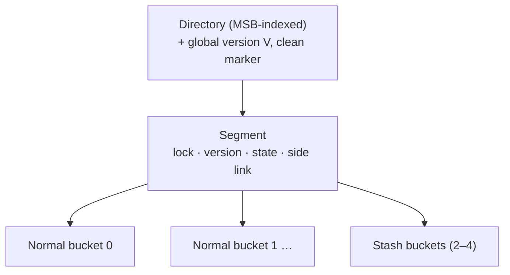

### Bucket layout (256 bytes = the DCPMM block size)

| Bytes | Contents |
| --- | --- |
| 0–31 | **Metadata** |
| 32–255 | **14 record slots × 16 bytes** — first 8 bytes key (or pointer if > 8 bytes), last 8 bytes opaque payload (inline value or pointer) |

The 32-byte metadata contains:

- **4-byte version lock** for optimistic concurrency.
- **4-bit `counter`** — records stored in the bucket.
- **`allocation` bitmap** — one bit per slot, marks valid records.
- **`membership` bitmap** — marks records that were *not* originally hashed here (placed by
  balanced insert or displacement); used to accelerate displacement.
- **18 fingerprints** — 14 for the bucket's own slots, **4 reserved for overflow records** living
  in stash buckets but originally hashed here.
- **4-bit `overflow fingerprint` bitmap**, an **`overflow bit`**, a **2-bit `stash bucket index`
  per overflow record**, an **`overflow membership` bitmap**, and an **`overflow count`**.

### Fingerprinting

A **fingerprint is a one-byte hash of the key** (the least significant byte of the key's hash).
Probing first scans the compact fingerprint area and only touches slots whose fingerprint
matches; **no match means the key is definitely absent**. SIMD instructions accelerate the scan.

Why it matters:

- **Negative search and insert uniqueness checks** become nearly free — they never touch keys.
- It lets Dash use **large (256-byte) buckets** to tolerate more collisions and raise load factor
  without paying in cache misses — the opposite of prior designs that shrink buckets to 1–2
  cachelines and sacrifice load factor.
- For **variable-length keys** (stored as pointers), it removes most pointer dereferences; the
  amortized number of key loads for a positive search is **one**.

### Bucket load balancing (the load-factor story)

The insight: segments split prematurely because **a key maps to exactly one bucket**. Dash uses
three escalating techniques, in order.

**1. Balanced insert.** For `hash(key) = b`, probe **both bucket `b` and `b+1`** and insert into
the **less full** one. At most two buckets are touched. Compared with linear probing (which may
walk `b … b+n`), this bounds PM reads and needs no tuning of probe distance.

**2. Displacement.** If both `b` and `b+1` are full, try to move an existing record to make room:

- First look in `b+1` for a record whose `hash(key) = b+1` and move it to `b+2` (legal because
  `b+2` is that record's own probing bucket) if `b+2` has a free slot.
- Otherwise look in `b` for a record with `hash(key) = b−1` and move it to `b−1`.

The **`membership` bitmap makes this cheap**: a set bit means the record was not originally
hashed here. Scanning the bitmap picks a movable record **without examining any actual keys** —
especially valuable for pointer-stored variable-length keys.

**3. Stashing.** As a last resort before splitting, the record goes into one of a tunable number
of **stash buckets** per segment (same layout as normal buckets). The danger is that negative
searches and insert uniqueness checks would then have to probe every stash bucket. Dash prevents
that by **keeping the metadata in the normal bucket and only the record in the stash**: the
overflow record's fingerprint goes into one of the four reserved overflow fingerprint slots, the
overflow bitmap and 2-bit stash index record where it lives, and the `overflow membership` bitmap
says whether the fingerprint belongs to this bucket or its probing partner. Only when no overflow
fingerprint slot is available does `overflow count` become positive — and only then must a prober
scan the stash area.

**Measured effect:** 2–4 stash buckets per segment push load factor **over 90%** without
significant overhead.

```text
Algorithm 1 — Dash-EH insert
  h = hash(key); retry:
    [target_seg] = get_segment(h)
    [target_bucket, probing_bucket] = target_seg.bk(h)
    lock target_bucket and probing_bucket
    [verify_seg] = get_segment(h)                  # re-read directory
    if verify_seg ≠ target_seg: unlock; goto retry
    if key exists in either bucket or the stash: return KeyExists
    if target or probing bucket not full:
        insert into whichever has the lower count   # balanced insert
    else:
        bucket = displace(target_bucket, probing_bucket)
        if bucket ≠ NULL: bucket.insert(...)
        elif stash_bucket.insert(...): target.overflow = true; set overflow FP + bitmap
        else: split_segment(h); goto retry
    unlock; return Inserted
```

### Optimistic concurrency

The lock word is **one lock bit + a version number** (distinct from the per-segment recovery
version).

- **Writers** acquire bucket-level locks by CAS-ing the lock bit on the target and probing
  buckets. On release they **reset the bit and increment the version in a single atomic write**.
- **Readers take no locks at all** (hence no PM writes). A reader snapshots the lock word, waits
  if the lock bit is set, reads the bucket, then **re-reads the lock word and retries if the
  version changed**.
- Lock-free reads require that a segment be deallocated (on merge) only after no reader is or
  will be using it — handled by **epoch-based reclamation**.
- **No segment-level locks.** SMOs lock all buckets in the segment instead. Directory
  doubling/halving takes the directory lock; ordinary directory updates (repointing an entry) do
  not, because isolation is guaranteed at bucket level. Probing threads therefore **re-read the
  directory to verify they entered the right segment**, aborting and retrying on mismatch.

### Record operations and crash consistency

**Insert (bucket level).**

1. Write the record into a free slot and **persist it first** (`CLWB` + fence).
2. Set the fingerprint, then update `allocation` bitmap, `membership` bitmap, and `counter` —
   **all in one word, one atomic store**.
3. One `CLWB` + fence persists all metadata (same cacheline, no x86 reordering).

The record becomes visible exactly when its allocation bit is persisted; a crash before that
makes it invalid. **This is what lets Dash avoid logging for inserts.**

**Displacement** is insert-into-new-bucket followed by clearing the allocation bit in the old
one — no data movement. A crash in between leaves the record **in both buckets**, requiring
duplicate detection at recovery (amortized, see below).

**Overflow metadata is deliberately not crash-consistent.** It cannot be updated atomically with
the 8-byte write, and it is only an optimization — records remain findable without it — so Dash
skips persisting it and rebuilds it lazily during recovery.

**Search** checks bucket `b`, then `b+1` (each with a version re-check after `bucket::search`
returns), then decides about the stash: if `overflow_count == 0`, only a matching overflow
fingerprint sends it to the stash; if `overflow_count > 0`, the stash must be scanned.

**Delete** resets the allocation bit, decrements the counter, and persists. Deleting from a stash
bucket additionally clears the corresponding overflow fingerprint in the originating bucket, or
decrements that bucket's overflow counter if no fingerprint was recorded.

### Structural modification operations

Split of segment `S`: (1) allocate new segment `N`, (2) rehash and redistribute, (3) attach `N`
to the directory and set local depths.

- **Segments are chained by side links** to the right neighbor, and each carries a **`state`**
  variable (0 = not in an SMO, `SPLITTING`, `NEW`) — this is what makes a crashed split
  recoverable.
- **Dash-EH indexes the directory by the MSBs of the hash**, not the LSBs of textbook extendible
  hashing. LSB addressing was a disk-era optimization (double the directory by copying and
  appending to the file); on PM you must allocate and persist a contiguous double-sized directory
  anyway, so the benefit vanishes. MSB addressing additionally **co-locates directory entries
  pointing at the same segment**, reducing cacheline flushes during splits.
- Procedure: mark `S` as `SPLITTING`; allocate `N` (via **PMDK**, which guarantees the block is
  owned by either Dash or the allocator after a crash — **no permanent leak**), store its address
  in `S`'s side link, give `N` `S`'s old side link and local depth + 1, mark `N` as `NEW`;
  redistribute records (deleting from `S` after inserting into `N`); then update the directory
  entry and `S`'s local depth in an **atomic PMDK transaction**.
- **Rehashing need not be atomic** — recovery redoes it with a uniqueness check.
- Notably, Dash **can afford logging-based PMDK transactions** precisely because bucket load
  balancing makes splits rare; systems with frequent premature splits avoid logging for
  performance and pay in complexity.

### Instant recovery

State: a **global version number `V`**, a **`clean` marker**, and a **per-segment version
number**.

- **Clean shutdown:** set `clean = true` and persist. On restart, if `clean` is true, set it
  false and start serving.
- **Crash:** on restart `clean` is false, so **increment `V` by one** and start serving.

Either way, "recovery" is **reading one byte and possibly writing one byte** — constant work,
independent of data size.

The real work is **amortized over segment accesses**: on touching a segment whose version ≠ `V`,
a thread first repairs the segment, then sets its version to `V` so future accesses skip the
pass. A **segment-level lock used only for recovery** serializes concurrent repairers, and is
acquired only when the version mismatches. One-byte version numbers can wrap; on wrap-around `V`
resets to zero and all segment versions are set to one (crashes are rare enough that this is
acceptable).

**Repairing a segment has four steps:**

1. **Clear bucket locks** — some may have been held at crash time.
2. **Remove duplicate records** left by an interrupted displacement — detected by comparing
   fingerprints in neighboring buckets, so real key comparison happens only on a fingerprint
   match.
3. **Rebuild overflow metadata** from the stash bucket contents (it was never persisted).
4. **Continue the ongoing SMO:** if the segment is `SPLITTING`, follow the side link; if the
   neighbor is `NEW`, restart rehash/redistribution and finish the split; otherwise **reset
   `state`, effectively rolling the split back**.

## Dash for linear hashing (Dash-LH)

Same building blocks (balanced insert, displacement, fingerprinting, optimistic concurrency),
with three linear-hashing-specific decisions:

- **Stash buckets replace overflow chains.** Classic linear hashing chains overflow buckets per
  bucket, and long chains mean pointer chasing and cache misses — a severe penalty on PM.
  Dash-LH keeps a fixed number of stash buckets per segment (e.g. 2) **plus a linked list of
  stash buckets**, and **triggers a segment split whenever a stash bucket has to be allocated**.
  The larger split unit (segment) and larger chaining unit (stash bucket rather than individual
  record) shorten chains dramatically.
- **Hybrid expansion.** Pure *double expansion* (each new segment doubles the table's buckets)
  makes the directory tiny — often L1-resident — but **halves the load factor on every
  allocation**. Dash-LH instead expands by several fixed-size segments first, a count called the
  **`stride`**, before triggering a doubling. A directory entry points to an *array* of segments:
  with stride 4, the first four entries point to 1-segment arrays, the next four to 2-segment
  arrays, and so on. With 16 KB segments and stride 4, a **directory under 1 KB indexes TB-scale
  data**.
- **Parallel splits.** Splits are naturally serialized by the `Next` pointer. Following **LHlf**,
  expansion only **atomically advances `Next`**; the actual split is performed later by whichever
  thread next accesses a segment marked as needing a split — so **multiple splits proceed in
  parallel**. Before advancing `Next`, the thread checks whether the new segment array exists and
  allocates it if not, which makes **PM allocator performance directly visible in throughput**.
  `N` (number of base-table buckets, 32-bit) and `Next` (32-bit) live in **one 64-bit word** so
  they update atomically.

## Evaluation

### Setup

- Intel Xeon Gold 6252 @ 2.1 GHz, **24 cores / 48 hyperthreads**, 35.75 MB L3.
- **768 GB Optane DCPMM** (6 × 128 GB, all six channels) in AppDirect mode + 192 GB DRAM.
- Arch Linux kernel 5.5.3, PMDK 1.7, GCC 9.2, threads pinned to physical cores.
- **Parameters:** level hashing 128-byte buckets; CCEH 16 KB segments, 64-byte buckets, probe
  length 4; **Dash-EH/LH 256-byte buckets, 16 KB segments, 2 stash buckets, 4 overflow
  fingerprint slots per bucket**; Dash-LH stride 8, first segment array 64 segments.
- **Workload:** preload 10 M records, then 190 M inserts, then 190 M positive search / negative
  search / delete on the 200 M-record table. Hash function is GCC's `std::_Hash_bytes` (Murmur).
  Uniform random keys; Zipfian skew was also tested and performed *better* (higher cache hit
  ratio, and contention is rare because hash values are still uniform).
- Fixed-length: 8-byte keys and values. Variable-length: pointers to 16-byte keys, 8-byte values.

### Implementation fixes made to the baselines (a contribution in itself)

- **Crash consistency:** found and fixed a bug in CCEH where **power failure during a segment
  split leaks PM**, using a PMDK transaction. Adapted CCEH and level hashing to PMDK
  reader-writer locks that auto-unlock on recovery.
- **Persistent pointers:** CCEH and level hashing assume 8-byte pointers (a DRAM-emulation
  assumption); real PM systems sometimes need 16-byte pointers, which break layouts and atomic
  instructions. The authors extended PMDK to **map PM at the same virtual address range across
  runs** (`MAP_FIXED_NOREPLACE` plus `mmap_min_addr`) so 8-byte pointers stay valid.
- **Garbage collection:** CCEH's open-source implementation lets threads read the directory
  without any lock, permitting **access to freed memory** after doubling/halving; fixed with the
  same epoch-based reclamation Dash uses.

### Single-thread performance

| Operation | Dash-EH vs CCEH / level hashing (fixed keys) | vs CCEH / level hashing (variable keys) |
| --- | --- | --- |
| Positive search | 1.9× / 2.6× | 2× / 5× |
| Negative search | 2.4× / 4.4× | **5× / 15×** |
| Insert | ≈ CCEH, ~2.5× level hashing | 2.0× / 3.7× |
| Delete | 1.2× / 1.9× | 1.2× / 2.9× |

Dash-LH performs similarly to Dash-EH because they share building blocks. On inserts CCEH pays
one fewer cacheline flush, but Dash's load balancing reduces splits enough to compensate — and
CCEH's lack of an allocation bitmap forces it to **reserve a sentinel value (e.g. `0`) to mark
empty slots**, a restriction imposed on the application that Dash avoids via metadata. Level
hashing suffers from more PM reads, frequent lock/unlock, and **full-table rehashing**.

### Scalability (24 threads, mixed workload = 20% insert / 80% search, 60 M preload)

- **Search: near-linear scalability for Dash-EH/LH.** CCEH falls behind because pessimistic
  locking writes to PM even for read-only work. Level hashing uses similar locking but **lock
  striping** keeps the locks cache-resident, so despite worse single-thread performance it
  matches CCEH under concurrency.
- **Insert:** neither Dash variant scales linearly (inserts are inherently random PM writes), but
  Dash is the most scalable — **up to 1.3× CCEH and 8.9× level hashing**. Level hashing is worst
  because full-table rehashing is slow on PM and blocks concurrent operations.
- **Delete** at 24 threads improves over single-thread by **8.4× (Dash-EH), 9.8× (Dash-LH),
  6.1× (CCEH), 14.7× (level hashing)**.
- **Mixed workload at 24 threads: Dash outperforms CCEH by 2.7× and level hashing by 9.0×.**

### Ablations

**Fingerprinting** (24 threads, insert / positive search / negative search / delete):

| Keys | Speedup from fingerprinting |
| --- | --- |
| Fixed-length | 1.04× / 1.19× / **1.72×** / 1.02× |
| Variable-length | 1.88× / 3.13× / **7.04×** / 1.52× |

**Overflow metadata** (24 threads, 2 stash buckets): **1.07× / 1.29× / 1.70× / 1.16×** over no
metadata. More importantly, adding stash buckets **drops search performance ~25% without** the
metadata, while **with** it performance stays flat, because negative searches early-stop.

**Load factor of a single segment**, added technique by technique:

| Design | Behavior as segment size grows 1 KB → 128 KB |
| --- | --- |
| Bucketized (plain segmentation) | 80% at 1 KB, degrading to ~40% at 128 KB |
| + one bucket probing | +~20% at 128 KB |
| + balanced insert and displacement | another +~20% |
| + stashing | **close to 100% for 1–16 KB segments** |

Overall Dash achieves **more than twice** the load factor of vanilla segmentation with large
segments.

**Load factor over an insert sequence:** CCEH oscillates between **35% and 43%**, because it
probes only four cachelines before splitting — short probing causes premature splits, long
probing costs performance. Dash-EH/LH with **2 stash buckets reach ~80%**; **Dash-EH with 4 stash
buckets reaches 90%**, matching level hashing. Dips in the curve mark splits/rehashing.

**Concurrency control:** replacing Dash-EH's optimistic locking with reader-writer spinlocks
**destroys scalability** on search workloads because of the PM writes needed to manipulate read
locks. Repeating the identical experiment **on DRAM shows both scaling fine** — a finding that
emulation-based studies structurally could not surface.

### Recovery time (ms) versus indexed records

| Hash table | 40 M | 80 M | 160 M | 320 M | 640 M | 1280 M |
| --- | ---: | ---: | ---: | ---: | ---: | ---: |
| **Dash-EH** | 57 | 57 | 57 | 57 | 57 | 57 |
| **Dash-LH** | 57 | 57 | 57 | 57 | 57 | 57 |
| **CCEH** | 113 | 165 | 262 | 463 | 870 | **1673** |
| **Level hashing** | 53 | 53 | 53 | 53 | 53 | (53)* |

\* At 1280 M records level hashing needs an allocation larger than PMDK's maximum (15.998 GB);
its recovery is still constant work (opening the PM pool), so 53 ms is expected to hold.

**CCEH's recovery is linear in data size** because it scans the entire directory on restart.

**Cost of lazy recovery at runtime:** after killing a 40 M-record table mid-insert and restarting
with a positive-search workload, throughput starts low (0.1–0.3 Mops/s single-threaded, 0.6
Mops/s at 24 threads) and **returns to normal in 0.2 s at 24 threads versus 0.9 s single-
threaded** — more threads help because they repair different segments in parallel.

### Impact of PM software infrastructure

Comparing PMDK against a custom pre-faulting allocator on kernels 5.2.11 and 5.5.3:

- **Dash-EH is insensitive** to allocator performance — its allocation size is a fixed, modest
  16 KB segment.
- **Dash-LH collapsed to ~25% of its 5.5.3 throughput on kernel 5.2.11.** Cause: a kernel bug
  making large PM allocations fall back to **4 KB pages instead of PMDK's default 2 MB huge
  pages**, producing many more page faults and scheduler activity. Linear hashing is hit hardest
  because multiple threads contend for PM allocation during splits, and slow allocation blocks
  concurrent requests.
- The same page-fault storm made **CCEH's recovery ~10× slower** at 160 M records on the older
  kernel.

The conclusion the authors draw: **PM programming support is immature and evolving; designs must
be tested against both the userspace allocator and OS support**, not just the data structure.

## Positioning against related work

- **Cuckoo hashing** achieves high memory efficiency by displacement across two hash functions,
  evicting a random record when both buckets are full. **MemC3** adds single-writer/multi-reader
  optimistic concurrency with version counters and a global lock, plus a **tagging** technique
  very similar to fingerprinting; **FASTER** stores the tag in the unused high-order 16 bits of
  each pointer; **libcuckoo** extends MemC3 to multiple writers. The problem on PM: consecutive
  cuckoo displacements cause many memory writes. Dash bounds probing and uses optimistic locking
  instead.
- **Static PM hashing.** **PFHT** (two-level, one displacement allowed, linked-list stash),
  **path hashing** (stash as an inverted complete binary tree), **level hashing** (two-level,
  search bounded to four buckets; on resize the bottom level is rehashed to 4× the top level and
  the old top becomes the new bottom). Dash also uses stashes, but **most searches touch only two
  buckets** thanks to overflow metadata.
- **Dynamic PM hashing.** **CCEH** avoids full-table rehashing but its four-cacheline probe bound
  yields low load factor and frequent splits, and its recovery requires a directory scan.
  **NVC-hashmap** is lock-free over split-ordered lists — fewer PM writes, but hard to implement
  and cache-miss-prone.
- **Range indexes.** PM B+-trees and tries reduce writes with unsorted leaves (at the cost of
  linear scans). **FP-tree** introduced fingerprints in leaf nodes — the technique Dash borrows.
  Some designs place inner nodes in **DRAM** for speed, but that **forfeits instant recovery**
  since the DRAM part must be rebuilt; the same trade-off appears in hash tables that put the
  directory in DRAM. **Because bucket load balancing lets Dash use large segments, it can keep
  the directory in PM and avoid the trade-off entirely.**
- **PM programming.** PMDK is the dominant library; the shared solution to permanent leaks is an
  **allocate-activate** protocol so a crashed allocation is owned by either the application or
  the allocator. At OS level, DAX file systems (ext4, XFS, and PM-specific designs) allow
  pointer-based access bypassing caches.

## Limitations and questions

- **Hardware-specific.** Every quantitative conclusion is tied to first-generation Optane DCPMM
  — a product line since discontinued. The *methodology* (measure end-to-end read cost, don't
  trust emulation) generalizes; the constants do not.
- **Overflow metadata is intentionally not crash-consistent**, so every crashed segment pays a
  rebuild on first touch. This is cheap but not free, and the recovery-time table measures only
  time-to-first-request, not time-to-steady-state (measured separately: 0.2–0.9 s).
- **Displacement can leave duplicates** across a crash; correctness depends on recovery's
  duplicate detection running before those buckets are trusted.
- **Insert scalability is still sublinear** — inherent to random PM writes; Dash reduces but does
  not eliminate the wall.
- **Load factor versus segment size remains a tuning problem**: stashing keeps 1–16 KB segments
  near 100%, but larger segments still degrade.
- **PM allocator is on the critical path for Dash-LH**, making performance sensitive to library
  and kernel versions outside the design's control.
- **Only two dynamic schemes evaluated** (extendible and linear hashing); applicability to other
  schemes is claimed but deferred.

## Practical design checklist

The Dash techniques transfer to any index on a medium with **asymmetric, bandwidth-limited,
random-access-hostile** characteristics:

- Use a **compact summary (fingerprint/tag) co-located with the slot array** so negative lookups
  never touch keys or follow pointers.
- Use **optimistic version-validated reads** so read-mostly workloads issue **zero writes** to
  the persistent medium.
- Prefer **bounded multi-bucket placement (balanced insert + displacement + stash)** over
  unbounded linear probing: better load factor with a hard cap on accesses.
- Make recovery **constant-work at startup and lazy per-unit at runtime**, using a global version
  counter compared against per-unit versions.
- Persist **data before metadata**, and pack the metadata that makes a record visible into a
  single atomic word — this eliminates logging on the common path.
- Reserve logging/transactions for **rare** operations (splits), which is only affordable if the
  design makes them rare.
- **Never leak the medium:** use an allocate-activate allocator so a crash mid-allocation leaves
  ownership unambiguous.

## Takeaways

1. **Emulation lies.** Two published, peer-reviewed PM hash tables failed to scale on real
   hardware — including on read-only workloads. Measure the real device.
2. **Reads can be the expensive direction.** Writes retire into the ADR domain; reads hit the
   media. Optimizing writes alone is optimizing half the problem.
3. **Read locks are writes.** On a bandwidth-limited persistent medium, pessimistic locking taxes
   read-only workloads; optimistic version validation removes the tax without lock-free
   complexity.
4. **A one-byte hash is a remarkably good filter.** Fingerprints deliver up to 7× on negative
   search with variable-length keys and simultaneously *permit* larger buckets, which is what
   makes high load factor affordable.
5. **Load factor and performance are not opposed if you bound the search.** Balanced insert,
   displacement, and stashing more than double the load factor of plain segmentation while
   touching at most two buckets plus metadata.
6. **Make recovery a constant, and amortize the rest.** Bumping one global version and repairing
   segments on first touch turns recovery time from O(data) into O(1) — 57 ms at any size versus
   CCEH's 1.67 s at 1.28 B records.
7. **Rare operations may be expensive.** Because load balancing makes splits rare, Dash can
   afford logging-based PMDK transactions and the simplicity they buy.
8. **The systems stack below you is part of your design.** A kernel huge-page regression cost
   Dash-LH 75% of its throughput; PM data structure work must be validated against allocator and
   OS versions.

## Citation

```bibtex
@article{lu2020dash,
  author = {Baotong Lu and Xiangpeng Hao and Tianzheng Wang and Eric Lo},
  title = {Dash: Scalable Hashing on Persistent Memory},
  journal = {Proceedings of the VLDB Endowment},
  volume = {13},
  number = {8},
  pages = {1147--1161},
  year = {2020},
  doi = {10.14778/3389133.3389134}
}
```

---

## Paper: Apache Arrow DataFusion: A Fast, Embeddable, Modular Analytic Query Engine

# Apache Arrow DataFusion: A Fast, Embeddable, Modular Analytic Query Engine

> SIGMOD 2024 Industrial Track — structured reading notes

Full paper content: [Markdown conversion](../original/datafusion-sigmod-2024.md)

## Paper information

- **Authors:** Andrew Lamb (InfluxData), Yijie Shen (Space and Time), Daniël Heres (Coralogix),
  Jayjeet Chakraborty (InfluxData), Mehmet Ozan Kabak (Synnada), Chao Sun (Apple), Liang-Chi
  Hsieh (Apple)
- **Venue:** SIGMOD 2024, Santiago, Chile, 14 pages
- **DOI:** [10.1145/3626246.3653368](https://doi.org/10.1145/3626246.3653368)
- **Governance:** Apache Software Foundation project; at writing, **4,600+ pull requests from
  300+ contributors**

## One-sentence summary

DataFusion is an embeddable OLAP query engine written in Rust with Apache Arrow as its in-memory
model and extension points at every layer, and it demonstrates empirically that a **modular,
open-standards engine can match a tightly integrated one (DuckDB)** — the gap being engineering
investment, not architecture.

## Problem and thesis

High-performance analytic engines have traditionally been **tightly integrated** — Vertica,
Spark, DuckDB — because optimizing the interfaces between file format, in-memory layout, and
processing engine was necessary for peak performance. Building such systems is expensive and
needs substantial commercial or research funding.

DataFusion's claim: the community now knows where to draw subsystem boundaries (file format,
catalog, language front-end, execution engine), so an end-to-end system can be **assembled from
reusable open components**. Its competitive performance is the evidence that a modern OLAP engine
**need not** have a tight-knit architecture; its existence as a permissively licensed Apache
project is the evidence that an **open governance model** can create and sustain this level of
technology.

Five contributions, in the paper's own framing:

1. describe the foundational ecosystem powering DataFusion;
2. describe the kinds of systems built on it;
3. describe its architecture, feature set, and optimizations — quantifying the breadth required
   of a modern analytic engine;
4. define the extension APIs, i.e. **the key module boundaries of an analytic stack**;
5. evaluate performance against a state-of-the-art integrated engine.

## Foundational ecosystem

DataFusion is possible only because of three lower-level technologies; without them the authors
doubt they could have built it with their modest resources. A side benefit is that systems built
on DataFusion **share files and in-memory streams with the wider ecosystem without format
conversion**.

### Apache Arrow

Arrow "simply standardizes industrial best practices for representing data in memory using
cache-efficient columnar layouts" — validity/null representation, endianness, variable-length
byte and character data, lists, nested structures. The insight: it likely does not matter whether
NULL is a 0 or 1 in the bitmask, **but it matters enormously that everyone agrees**. Originally an
interchange format, Arrow has grown compute-focused features (`StringView`) and high-performance
compute kernels, so users skip re-implementing well-understood but time-consuming machinery.

### Apache Parquet

Column-oriented file format from the Hadoop ecosystem, inspired by academic columnar storage
work. Provides compression and encoding schemes, structured types via **record shredding**,
embedded self-describing schema, **zone-map-like index structures**, and **Bloom filters**.

Contrast with Arrow: **Arrow optimizes fast random access and in-memory processing; Parquet
optimizes space-efficient storage.** Parquet's structure enables advanced projection and filter
pushdown including **late materialization** applied directly on files, yielding performance
competitive with specialized formats.

### Rust

Low-level yet memory-safe, C-like performance, an ownership model that mitigates memory and
thread-safety hazards. Crucially for an *embeddable* engine: **no language runtime, C ABI
compatible**. Zero-cost abstractions, performance-centric libraries, good docs and diagnostics —
and unlike C/C++ build systems, **Cargo makes adding DataFusion to a project a single
configuration line**.

## Use cases

Projects using DataFusion "spend most of their time innovating value-adding features rather than
replicating existing analytic engine technologies":

1. **Tailored database systems** — time-series databases (InfluxDB 3.0, Coralogix) and streaming
   SQL platforms (Synnada, Arroyo).
2. **Execution runtimes for other front-ends** — Apache Spark, the Vega visualization language,
   the InfluxQL query language.
3. **SQL analysis tools** — dask-sql, SDF — using the SQL parser, planner, and plan
   representation to *analyze* queries.
4. **Table formats** — the Rust implementations of Delta Lake and Lance — using DataFusion
   expressions and plans to fetch and decode remote data, implement predicate-based delete
   tombstones, push predicates into specialized secondary indexes, and compact files while
   retaining sort orders.

All inherit Arrow-native behavior and integrate with Python via pyarrow. Lance, for example,
exposes APIs where user Python functions operate on `RecordBatch`es **directly, without
conversion**.

### Accelerating Apache Spark

Spark's JVM implementation carries well-known overheads, but its design permits replacing **just
the execution engine** (as Velox and Photon do). Several Spark native runtimes use DataFusion —
including **Blaze** — keeping Spark's front-end, parsing, analysis, and optimization intact while
converting execution plans into DataFusion `ExecutionPlan`s executed through JNI, with
**zero-copy data exchange via Arrow**. Where Spark's semantics diverge from DataFusion's (e.g.
decimal operations that deviate from ANSI SQL), the extension APIs let projects override
expressions and operators.

## The deconstructed database argument

The trend is away from monolithic "one size fits all" systems toward "fit for purpose"
specialized ones — feasible at scale only when they can be assembled from reusable high-quality
components (the **Deconstructed Database**).

Two cited failures of reuse:

- **pandas / data science tooling.** The community innovated genuinely new APIs (DataFrame vs.
  SQL) and a different deployment model (local files vs. networked servers), but initially
  performed poorly because it lacked query planning/optimization and parallel vectorized
  execution. *Apache Arrow was born out of the desire to bring these database techniques to the
  data science ecosystem.*
- **MapReduce/Hadoop.** Database researchers pointed out technical inferiority, but the absence
  of open, standard, reusable components made re-implementation of similar low-level analytical
  techniques inevitable.

### The LLVM parallel

| Stage | Compilers | Databases |
| --- | --- | --- |
| **Tightly integrated** | Hardware-specific compilers shipped as part of IBM System/390, Solaris, AIX, HP-UX | Oracle, SQL Server, DB2 — directly managing storage hardware, connections, SQL functions, execution, and on-disk/in-memory formats |
| **Open source, internally integrated** | gcc — cross-platform, widely adopted | MySQL, PostgreSQL |
| **Open source and modular** | Rust, Swift, Zig, Julia all share **LLVM** | InfluxDB 3.0, GreptimeDB, Coralogix all share **DataFusion** |

Just as LLVM let language authors focus on language-specific features while reusing IRs, standard
optimizations, code generation, and auto-vectorization, DataFusion lets database designers build
domain-specific features instead of re-implementing SQL front-ends, plan representations,
optimizations, storage formats, and operators.

## Architecture

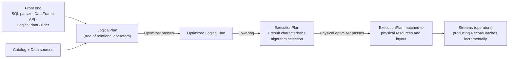

Every stage is an extension point.

### Catalog and data sources

- **Catalog** supplies metadata: which tables exist, columns and types, statistics, storage
  details. DataFusion ships a simple in-memory catalog and a **Hive-like partitioned
  file/directory catalog**, but acknowledges no general-purpose catalog suits everyone — most
  systems supply their own (e.g. reading a Hive metastore directly).
- **Five built-in `TableProvider`s** — Parquet, Avro, JSON, CSV, Arrow IPC — all implemented via
  **the same API any custom source would use**. The Parquet reader uses Arrow-Rust and features
  predicate pushdown, late materialization, Bloom filters, and nested types. CSV and JSON readers
  infer schema; the JSON reader fully supports structs and lists.

### Front ends

- **Data types** come straight from Arrow: integers and floats of various widths, fixed-precision
  decimals, variable-length character and binary strings, dates, times, timestamps, intervals,
  durations, nested structs and lists. Operators exchange **Arrow Arrays or scalar values**.
- **SQL planner** built on `sqlparser-rs`, producing a `LogicalPlan`. Supported subset: `WHERE`,
  `GROUP BY`, `ORDER BY`, `LIMIT`, `DISTINCT`, `WINDOW`/`OVER`, `UNION`/`INTERSECT`,
  `GROUPING SETS`, `FULL`/`INNER`/`OUTER JOIN`, plus `ROWS`/`VALUES` `PRECEDING`, `FOLLOWING`,
  `UNBOUNDED` window bounds and `GROUP BY` with per-aggregate `FILTER` and `ORDER BY`. (The
  authors note no SQL implementation should claim completeness against an ever-expanding spec.)
- **DataFrame API** modeled on pandas produces the *same* `LogicalPlan`, optimized and executed
  identically. **`LogicalPlanBuilder`** offers a Rust builder interface for constructing plans
  directly — the entry point for custom query languages.

### Plan representations and analysis

The API includes:

1. Structures for trees of expressions and relational operators at both **logical** (`Expr`,
   `LogicalPlan`) and **physical** (`PhysicalExpr`, `ExecutionPlan`) levels, with ergonomic
   manipulation routines.
2. **(De)serialization** to bytes for network transport, via **Protocol Buffers and Substrait**.
3. **Statistics** known at planning time — row counts, min/max values.

**Expression analysis** libraries provide simplification, **interval analysis**, and range
propagation. Combined with statistics these yield predicate cardinality/selectivity estimates and
**plan-time partition elimination** (e.g. Parquet row group pruning). They are usable directly by
client systems as well as internally.

**Function library:** a large set of built-in scalar, window, and aggregate functions — string
operations, timestamp/date/time manipulation, interval arithmetic, list/struct/map operations —
**implemented through the same API as user-defined functions**, manipulating Arrow Arrays, and
callable from both SQL and DataFrame APIs.

**Rewrites:** an extensible framework of `LogicalPlan` and `ExecutionPlan` transformations,
handling both mundane requirements (automatic type coercion to match operator/function
signatures; inserting necessary sorts and redistributions) and optimizations — **the same
framework for both**.

### Execution engine

**Pull-based streaming execution**, parallelized across cores via Volcano-style exchange operators
(`RepartitionExec`).

- **Streaming.** Operators produce output incrementally as Arrow Arrays grouped into
  `RecordBatch`es, **default 8192 rows**. Pipeline breakers (full sort, final aggregation, hash
  join) buffer and **spill to disk** as needed. Data flows between operators as Arrow Arrays,
  which is what makes user-defined operators first-class. *Within* an operator, non-Arrow
  representations such as the **RowFormat** are used where they are faster.
- **Operator interface.** Each `Stream` implements Rust's `Stream` trait; control flow uses Rust's
  built-in `await` continuation generation, which **automatically marshals state before
  yielding**:

  ```rust
  impl Stream for MyOperator {
      // Pull next input (may yield at await)
      while let Some(batch) = stream.next().await {
          if Some(output) = self.process(&batch)? {
              tx.send(batch).await   // "Return" RecordBatch to output
          }
      }
  }
  ```

- **Multi-core.** Each `ExecutionPlan` generates one or more `Stream`s running in parallel; the
  count is the plan's **partitioning**, fixed at plan time. Most Streams coordinate only with
  their inputs; exceptions are `HashJoinExec` (building a shared hash table) and `RepartitionExec`
  (redistributing data).
- **Thread scheduling.** Streams are Rust `async` functions running on a **Tokio** runtime — a
  library originally designed for async network I/O, chosen for CPU-bound work because of its
  efficient **work-stealing scheduler**, first-class compiler support for continuation
  generation, and performance. The authors acknowledge published concerns about the Volcano model
  on NUMA architectures but report comparable scalability in practice.
- **Memory management.** A **`MemoryPool`** shared across concurrent queries; Streams
  *cooperatively* report usage. The approach is pragmatic: **track the largest consumers
  accurately** (e.g. hash table contents in a hash aggregate) and **ignore small ephemeral
  allocations** (e.g. the current output batch). Two built-in pools: **`GreedyPool`** (per-process
  limits, no fairness) and **`FairPool`** (distribute evenly among pipeline-breaking operators).
  Systems built on DataFusion typically implement domain-specific policies via the same API.

## Optimizations

The authors are explicit that **none of these techniques is novel** — each is extensively studied
and repeatedly implemented. The contribution is that a well-tested, extensible implementation
exists so new systems need not re-implement them again.

| Area | What DataFusion does |
| --- | --- |
| **Logical rewrites** | Projection pushdown, filter pushdown, limit pushdown, expression simplification, common subexpression elimination, join predicate extraction, **correlated subquery flattening**, outer→inner join conversion |
| **Physical rewrites** | Eliminating unnecessary sorts, maximizing parallel execution, selecting specific algorithms (hash vs. merge join) |
| **Sorting** | Tree-of-losers, **RowFormat** normalized keys, spill to temporary disk files, specialized "Top K" implementation for `LIMIT` |
| **Grouping/aggregation** | **Two-phase parallel partitioned hash grouping**, vectorized, spill-capable, with special handling for no group keys, partially ordered, and fully ordered group keys |
| **Joins** | Automatic equi-join predicate identification, heuristic join reordering from statistics, predicate pushdown through joins (respecting OUTER restrictions), transitive join predicate introduction, physical algorithm selection. Implementations: parallel in-memory hash join, merge join, **symmetric hash join**, nested loops, cross join — all supporting Inner/Left/Right/Full/LeftSemi/RightSemi/LeftAnti/RightAnti. Hash join uses **MonetDB-style vectorized hashing and collision checking**. Future work: dynamically applying join filters during scans (sideways information passing) |
| **Window functions** | Minimizes resorting by reusing existing sort orders, sorting only when `PARTITION BY`/`ORDER BY` demand it; evaluates **incrementally**, emitting output once the required window is present. Deliberately has *not* implemented Physical Segment Trees — window queries are typically dominated by sorting anyway |

### RowFormat (normalized sort keys)

Columnar engines excel where operations vectorize, but query processing also needs **fundamentally
row-based** operations — multi-column sorting, multi-column equality for grouping and joins —
where per-row overhead cannot be amortized by vectorization. Inside those operators DataFusion
uses a **RowFormat**, a normalized key that:

1. permits **byte-wise comparison with `memcmp`**, and
2. offers **predictable memory access patterns**.

It is densely packed column after column with per-type encodings, optionally adjusted for SQL
sort options (`ASC`/`DESC`, NULL placement). Signed and unsigned integers use big-endian
representation; **floats are converted to a signed integer representation that folds in the sign
bit**.

### Leveraging sort order

The optimizer **tracks multiple sort orders simultaneously** (e.g. data sorted by (A, B) *and*
(A, C) after an order-preserving join on B=C) and includes Streams optimized for sorted or
partially sorted input — merge join, partially ordered (streaming) hash aggregation. Two reasons
this matters:

1. **Physical clustering.** Secondary indexes are often too expensive to build and maintain at
   high ingest rates, so **the sort order of primary storage is the only available physical
   clustering optimization**.
2. **Memory usage and streaming.** Sort order defines how data flowing through Streams is
   partitioned *in time*, which determines where values can change and therefore **where
   intermediate results can be emitted** rather than buffered.

### Pushdown and late materialization

Three things are pushed toward the data source: **projection** (elide unneeded columns),
**LIMIT/OFFSET** (stop early), and **predicates** (filter closer to, or inside, the source).

Worked example for `A > 35 AND B = "F"` in the Parquet reader:

1. **Prune Row Groups** using metadata: skip any where `A_max <= 35`, or `B_max < 'F'`, or
   `B_min > 'F'`.
2. **Decode only column B**, evaluate `B = "F"`, capture surviving rows as a `RowSelection`
   (e.g. row indexes [100–244]).
3. **Decode only the pages of column A containing those rows** (using the Page Index), evaluate
   `A > 35`, refining the `RowSelection` (e.g. to [100–150]).
4. **Decode the remaining selected columns** (e.g. C) only for the surviving rows.

Most effective when predicate columns cluster together — for instance when they appear early in
a sorted file's sort order.

## Extension APIs — "a blueprint for future modular query engines"

All extension APIs represent data as **Arrow Arrays**, so extensions have **the same performance
as built-ins** and can reuse existing libraries and optimized compute kernels.

| Extension point | What it enables | Why it's hard elsewhere |
| --- | --- | --- |
| **Scalar / Aggregate / Window functions** | Registered dynamically at runtime; take and return Arrow Arrays. Real examples: derivative window functions, calendar bucketing for time series, custom binary manipulation for cryptography | Other engines' UDF APIs are usually slower and less capable than built-ins, and must bind tightly to internal data representation — especially painful for columnar engines |
| **Catalog** | `TableProvider` (a table) → `SchemaProvider` (a collection of tables) → `CatalogProvider` (a collection of schemas). **All async Rust functions**, so remote catalogs are straightforward. Delta Lake's Rust implementation uses this plus expression evaluation to skip Parquet files by predicate | — |
| **Data sources** | Query in-memory Arrow buffers, stream from remote servers (e.g. Arrow Flight), or read custom formats. `TableProvider` supports **partitioned inputs, projection/filter/limit pushdown, parallel concurrent reads, and communicating pre-existing sort orders** | A custom source must produce the engine's native format, interact with its expression representation for pushdown, and handle async I/O for streaming output |
| **Execution environment** | `MemoryPool` (allocation control), `DiskManager` (temporary files), `CacheManager` (directory contents, per-file metadata) — because environments differ: fast local NVMe versus Kubernetes without persistent local disk; concurrent queries sharing resources opportunistically versus predefined budgets | — |
| **Query/language front ends** | Rewrite the AST before the SQL planner for small extensions; implement a custom parser/planner emitting `LogicalPlan`s for entirely different languages (PromQL, Vega) | — |
| **Optimizer passes** | Implement `OptimizerRule` and `PhysicalOptimizerRule` using **the same APIs as built-in rewrites**, and control the order in which all rules apply | — |
| **Relational operators** | Implement the `ExecutionPlan` trait — **exactly** as built-in join, filter, group-by, and window nodes do. **DataFusion does not distinguish user-defined from built-in plans** when optimizing or executing. Real examples: InfluxDB IOx's time-series gap filling, schema pivoting, insert-order resolution | Other systems expose user-defined *table functions*, which restrict syntax and plan placement and rarely match built-in performance |

## Evaluation

**Question:** what performance penalty does modularity and open standards impose? **Baseline:**
DuckDB, chosen as an exemplar of a state-of-the-art tightly integrated engine.

- **Versions:** DataFusion 32.0.0 vs DuckDB 0.9.1, via their Python bindings. Scripts published.
- **All benchmarks run directly on raw source files** — no load into a per-database format. The
  authors argue loading is increasingly impractical as data flows become fluid and multi-tool.
- Core count controlled via DataFusion's `target_partitions` and DuckDB's `threads` PRAGMA.

| Benchmark | Models | Data |
| --- | --- | --- |
| **ClickBench** | Large-scale web analytics — filter and aggregate a large denormalized dataset | Unmodified 14 GB `athena_partitioned` dataset: **100 Parquet files, ~140 MB each** |
| **TPC-H** | Classic warehouse analytics, 22 join-heavy queries | Scale Factor 10, each of 8 CSVs converted to one Parquet file with row groups capped at 1M records; **2.5 GB total** |
| **H2O-G** | Data science group-by operations | `G1_1e7_1e2_5_0.csv` — a single **488 MB CSV with 10M records** |

### Single-core efficiency

Hardware: GCP `e2-standard-8`, Intel Broadwell, 32 GB RAM, 8 vCPU, Ubuntu 22.04.3, kernel
6.2.0-1013-gcp.

**ClickBench (seconds, single core):**

| Query | DataFusion | DuckDB | Delta |
| ---: | ---: | ---: | --- |
| 1 | 1.22 | 0.18 | 6.74× slower |
| 2 | 0.36 | 0.81 | 2.25× faster |
| 3 | 1.11 | 1.78 | 1.6× faster |
| 4 | 1.09 | 1.5 | 1.38× faster |
| 5 | 20.74 | 8.34 | 2.49× slower |
| 6 | 17.81 | 11.98 | 1.49× slower |
| 7 | 0.3 | 2.08 | 6.91× faster |
| 8 | 0.37 | 0.83 | 2.24× faster |
| 9 | 27.91 | 10.83 | 2.58× slower |
| 10 | 25.84 | 14.11 | 1.83× slower |
| 11 | 4.29 | 3.22 | 1.33× slower |
| 12 | 4.67 | 8.69 | 1.86× faster |
| 13 | 11.38 | 10.27 | 1.11× slower |
| 14 | 26.96 | 14.61 | 1.84× slower |
| 15 | 12.7 | 11.15 | 1.14× slower |
| 16 | 13.31 | 9.12 | 1.46× slower |
| 17 | 29.6 | 21.97 | 1.35× slower |
| 18 | 29.09 | 21.23 | 1.37× slower |
| 19 | 92.31 | 39.1 | 2.36× slower |
| 20 | 0.8 | 1.33 | 1.65× faster |
| 25 | 6.01 | 8.44 | 1.4× faster |
| 26 | 5.02 | 6.11 | 1.22× faster |
| 27 | 6.59 | 8.4 | 1.28× faster |
| 28 | 23.62 | 23.85 | 1.01× faster |
| 29 | 107.41 | 62.99 | 1.71× slower |
| 30 | 5.91 | 69.08 | **11.7× faster** |
| 31 | 12.59 | 12.95 | 1.03× faster |
| 32 | 14.85 | 15.93 | 1.07× faster |
| 33 | 92.17 | 57.2 | 1.61× slower |
| 36 | 27.89 | 11.48 | 2.43× slower |
| 37 | 0.67 | 0.52 | 1.31× slower |
| 38 | 0.34 | 0.38 | 1.12× faster |
| 39 | 0.34 | 0.42 | 1.24× faster |
| 40 | 2.05 | 0.83 | 2.46× slower |
| 41 | 0.2 | 0.25 | 1.28× faster |
| 42 | 0.17 | 0.24 | 1.43× faster |
| 43 | 0.19 | 0.27 | 1.44× faster |

The pattern the authors read out of it:

- **DataFusion wins on highly selective predicates** (Q2, Q8, Q20) — predicate pushdown into the
  Parquet scan skips whole row groups.
- **DataFusion wins on single-group queries** (Q4, Q7, Q30) — vectorized aggregate updates.
- **Roughly equal** at medium selectivity and medium group cardinality (Q15, Q31, Q32, Q41, Q42).
- **DuckDB wins at high group cardinality** (≥10M groups: Q18, Q19, Q36) — its highly optimized
  parallel group-by aggregation.

**TPC-H:** DataFusion is faster on highly selective queries (Q4, Q9), roughly equal on Q3, Q6,
Q14, and **well over 2× slower on Q11, Q17, Q18, Q21**. Crucially, **most of the largest gaps are
due to a suboptimal join order; forcing a better order makes the two systems similar.**

**H2O-G:** DataFusion is slightly better on most queries but **significantly worse on Q9** because
of an inefficient `corr` aggregate implementation. Runtime is dominated by CSV parsing, where
DataFusion benefits from Arrow-Rust's highly optimized parser. The single-core restriction may
**unfairly penalize DuckDB**, which appears to optimize multi-threaded parsing.

**The authors' conclusion:** both engines perform similarly per core with different strengths;
**nothing about open standards fundamentally limits performance — the determining factor is
available engineering investment.** They name concrete in-flight work on both sides: DataFusion
improving join ordering and high-cardinality grouping, DuckDB expected to improve low-cardinality
grouping, Parquet predicate pushdown, and CSV parsing.

### Scalability

Hardware: GCP `c3-highcpu-176`, Intel Sapphire Rapids, **176 vCPU, 352 GB RAM**, Ubuntu 22.04,
kernel 6.2.0-1016-gcp. Each ClickBench query run 5 times at 1–192 cores; the final 3 runs plotted
to remove caching/warm-up effects.

- **Read absolute values, not ratios.** Q10 takes seconds while Q1 takes under a second, so an
  apparently large relative gap in Q1–Q4 or Q37–Q42 is hundreds of milliseconds, while the gap in
  Q19, Q32, Q33 is an order of magnitude larger in absolute terms.
- **Up to 32 cores:** both engines show excellent, near-linear improvement.
- **64/128/192 cores:** mixed. Q28 and Q29 keep improving close to the ideal curve (low ~6,000
  and medium ~3M cardinality grouping with CPU-heavy `LIKE` matching). **Q11, Q14, Q32 actually
  slow down** for *both* engines as cores increase — as per-core work shrinks, coordination
  overhead dominates. The high-core slowdown is more pronounced for DataFusion on Q41–Q43 (partly
  a poorly tuned hash table flushing strategy for high cardinalities) and more pronounced for
  DuckDB on Q25–Q26.
- **Conclusion:** curves are similar in shape for both engines, so **the modular design and
  pull-based scheduler do not preclude state-of-the-art multi-core performance**; the differences
  are implementation details, not design.

## Positioning against related work

- **Velox and Apache Calcite** also provide components for assembling analytic systems, but
  building an end-to-end system requires substantial integration (bridging JVM and native code
  and build systems) whereas **DataFusion needs one configuration line**. **Photon** and
  **Gluten** (Velox-based) show the modular payoff by replacing only Spark's execution engine.
- **DuckDB** is likewise an open-source serverless SQL system, but the target users differ:
  **DuckDB targets people who run SQL; DataFusion targets people building systems** (which may run
  SQL among other processing). DuckDB has a more limited extension API and **its own** in-memory
  representation, storage format, Parquet implementation, and thread scheduler.
- The composable-architecture theme dates to at least 2000; "Deconstructed Database" was
  popularized in 2018.
- **Future research** the authors call for: modular components for **transaction processing and
  distributed key/value stores**, and first-class support (bindings or reimplementations) for
  **C/C++ and Swift**.

## Limitations and questions

- **Known performance gaps at publication:** high-cardinality grouping, join ordering (the cause
  of the worst TPC-H results), the `corr` aggregate, and a poorly tuned hash table flushing
  strategy at high core counts. The paper argues these are investment gaps, not design limits —
  a claim the benchmarks support but do not prove.
- **The join order problem is real today.** "Manually forcing a better join order makes them
  similar" is an honest disclosure, but end users do not hand-tune join order.
- **Benchmark caveats acknowledged by the authors:** benchmarking is hard, target use cases
  differ, and both engines change quickly. Both are compared through Python bindings.
- **Single-core H2O-G likely penalizes DuckDB**, which the authors state explicitly.
- **No transactions, no storage layer of its own.** DataFusion is a query engine; durability,
  concurrency control, and catalog persistence are the embedder's problem.
- **Volcano-model/NUMA concerns are set aside empirically** rather than addressed in design.
- **Modularity's cost is not measured** — the paper measures the *performance* cost (≈ none) but
  not the integration effort, versioning, or API-stability burden borne by embedders.

## Practical design checklist

Reach for DataFusion when:

- you are **building a data system**, not just running SQL — a time-series DB, a streaming SQL
  platform, a table format, a query front-end for a domain language;
- you need domain-specific operators, functions, or optimizer rules that must run at **built-in
  speed**;
- your data lives in **open formats** (Parquet, Arrow, CSV, JSON, Avro) and interoperates with
  other tools;
- you want to embed an engine with **no runtime and C ABI compatibility**.

Reach for something else when:

- you need an out-of-the-box interactive SQL tool for end users (DuckDB is the closer fit);
- your workload is dominated by very high cardinality grouping or complex join reordering, at
  least as of the versions benchmarked;
- you need built-in transactions, storage management, or a persistent catalog.

## Takeaways

1. **The modularity penalty is measurable and it is roughly zero.** Across three benchmarks
   DataFusion trades wins with DuckDB and scales with the same curve shape; the differences track
   implementation effort, not architecture.
2. **Standardization matters more than the choice standardized.** Arrow's value is that everyone
   agrees on null representation and endianness, not that any particular convention is best.
3. **Make the extension API the internal API.** DataFusion's built-in file formats, functions, and
   operators use exactly the APIs users get — which is precisely why extensions are as fast as
   built-ins, and why the optimizer treats them identically.
4. **Choose your module boundaries deliberately.** The extension list (catalog, data source,
   functions, execution environment, front-end, optimizer rules, relational operators) doubles as
   a specification of where an analytic stack should be cut.
5. **Columnar engines still need row-oriented internals.** The RowFormat exists because
   multi-column sort and equality cannot be vectorized; `memcmp`-able normalized keys are the
   answer.
6. **Sort order is an optimizer asset, not an execution detail.** Tracking multiple orders enables
   merge joins, streaming aggregation, and — where secondary indexes are unaffordable at high
   ingest rates — is the *only* physical clustering available.
7. **Push work into the scan.** Row group pruning, Bloom filters, and column-by-column late
   materialization mean the engine often decodes only one column before eliminating most rows.
8. **Track big memory, ignore small.** Pragmatic memory accounting — accurate for hash tables,
   approximate for output batches — is enough to make spilling work without pervasive overhead.

## Citation

```bibtex
@inproceedings{lamb2024datafusion,
  author = {Andrew Lamb and Yijie Shen and Dani\"{e}l Heres and Jayjeet Chakraborty and
            Mehmet Ozan Kabak and Chao Sun and Liang-Chi Hsieh},
  title = {Apache Arrow DataFusion: A Fast, Embeddable, Modular Analytic Query Engine},
  booktitle = {Companion of the 2024 International Conference on Management of Data
               (SIGMOD/PODS '24)},
  year = {2024},
  doi = {10.1145/3626246.3653368}
}
```

---

## Paper: Amazon DynamoDB: A Scalable, Predictably Performant, and Fully Managed NoSQL Database Service

# Amazon DynamoDB: A Scalable, Predictably Performant, and Fully Managed NoSQL Database Service

> USENIX ATC 2022 — structured reading notes

Full paper content: [Markdown conversion](../original/dynamodb-atc-2022.md)

## Paper information

- **Authors:** Mostafa Elhemali, Niall Gallagher, Nicholas Gordon, Joseph Idziorek, Richard Krog,
  Colin Lazier, Erben Mo, Akhilesh Mritunjai, Somu Perianayagam, Tim Rath, Swami
  Sivasubramanian, James Christopher Sorenson III, Sroaj Sosothikul, Doug Terry, Akshat Vig
- **Affiliation:** Amazon Web Services
- **Venue:** 2022 USENIX Annual Technical Conference, July 11–13, 2022, Carlsbad, CA, pages
  1037–1048
- **Paper page:** https://www.usenix.org/conference/atc22/presentation/vig

## One-sentence summary

This is a ten-year operational retrospective: how DynamoDB evolved from statically provisioned
per-partition capacity to global admission control and on-demand tables, how it achieves
durability through continuous verification and formal methods, and how it defends availability
against gray failures, deployment hazards, and its own caches — while serving a **peak of 89.2
million requests per second** during Prime Day 2021 at single-digit millisecond latency.

## Six fundamental properties

1. **Fully managed cloud service.** Applications create tables and read/write data without regard
   for where tables are stored or how they are managed. DynamoDB handles provisioning, failure
   recovery, encryption, software upgrades, backups, patching.
2. **Multi-tenant architecture.** Data from different customers shares physical machines for high
   utilization, with savings passed to customers. Isolation comes from **resource reservations,
   tight provisioning, and monitored usage**.
3. **Boundless scale for tables.** No predefined data limits; a table's resources scale from
   several servers to many thousands as storage and throughput demand grow.
4. **Predictable performance.** A simple `GetItem`/`PutItem` API enables consistent low latency —
   **low single-digit milliseconds for a 1 KB item** in-Region. Critically, **latency stays stable
   as tables grow from megabytes to hundreds of terabytes**, through automatic partitioning and
   re-partitioning.
5. **Highly available.** Replication across Availability Zones with automatic re-replication after
   disk or node failure. **SLA: 99.99% for regular tables, 99.999% for global (multi-Region)
   tables.**
6. **Flexible use cases.** No fixed schema — each item may carry any number of attributes of
   varying types, including multi-valued ones. Key-value or document model. Reads can request
   **strong or eventual consistency**.

The framing that drives everything: **consistent performance at any scale matters more than
median service time**, because an unexpectedly slow request amplifies through the layers of
applications above DynamoDB.

## History: why DynamoDB is not Dynamo

- **Dynamo** (2007) was Amazon's first NoSQL system, built for shopping cart data after learning
  that giving applications direct access to enterprise database instances caused scaling
  bottlenecks — connection management, interference between concurrent workloads, and operational
  pain like schema upgrades. The answer was a service-oriented architecture encapsulating data
  behind APIs.
- **Dynamo's flaw was operational, not technical.** It was **single-tenant**; every team ran its
  own installation and had to become an expert in the database. That operational complexity became
  a barrier to adoption.
- **SimpleDB** was Amazon's first database-as-a-service: fully managed, elastic, multi-datacenter
  replication, high availability and durability, no setup or patching. Engineers preferred it to
  Dynamo *even when Dynamo fit their needs better*. But it had two limits: **tables capped at
  10 GB** and limited request throughput, and **unpredictable query and write latency** because
  *all* attributes were indexed and every write updated the index. Developers had to split data
  across tables — a new operational burden.
- **DynamoDB (2012)** combined the best of both: Dynamo's **incremental scalability and
  predictable high performance** with SimpleDB's **ease of administration, consistency, and a
  table-based data model richer than pure key-value**. It shares most of the name with Dynamo and
  little of the architecture.

## Architecture

### Data model and API

- A **table** is a collection of **items**; each item is a collection of **attributes**, uniquely
  identified by a **primary key** whose schema is fixed at table creation.
- The primary key is either a **partition key** or a **composite (partition key + sort key)**. The
  partition key value always feeds an internal hash function; the hash output plus the sort key
  determines placement. Many items may share a partition key value but must differ in sort key.
- **Secondary indexes** allow querying by an alternate key; a table may have one or more.

| Operation | Description |
| --- | --- |
| `PutItem` | Insert a new item, or replace an old item with a new one |
| `UpdateItem` | Update an existing item, or add it if absent |
| `DeleteItem` | Delete a single item by primary key |
| `GetItem` | Return a set of attributes for the item with a given primary key |

Any insert/update/delete can carry a **condition** that must hold for the operation to succeed.
DynamoDB also supports **ACID transactions** across items "without compromising the scalability,
availability, and performance characteristics" of tables.

### Partitions and replication

A table is divided into **partitions**, each hosting a **disjoint and contiguous** part of the
key range. Each partition has multiple replicas across different AZs, forming a **replication
group** that uses **Multi-Paxos** for leader election and consensus.

- **Any replica can trigger an election.** Once elected, a leader keeps leadership by
  **periodically renewing a lease**.
- **Only the leader serves writes and strongly consistent reads.** On a write, the leader
  generates a write-ahead log record and sends it to peers; the write is acknowledged once a
  **quorum of peers persists the record to their local WALs**.
- **Any replica can serve eventually consistent reads.**
- If peers failure-detect the leader, one can propose a new election — but **the new leader serves
  no writes or consistent reads until the previous leader's lease expires**.

Two replica types:

| Replica type | Contains | Purpose |
| --- | --- | --- |
| **Storage replica** | Write-ahead logs **and** the B-tree holding key-value data | Full participant; serves reads |
| **Log replica** | Only recent write-ahead log entries — no B-tree, no key-value data | "Akin to acceptors in Paxos." Can be added in **seconds** (only recent WAL must be copied), versus **minutes** to heal a full storage replica (B-tree + logs) |

### Services

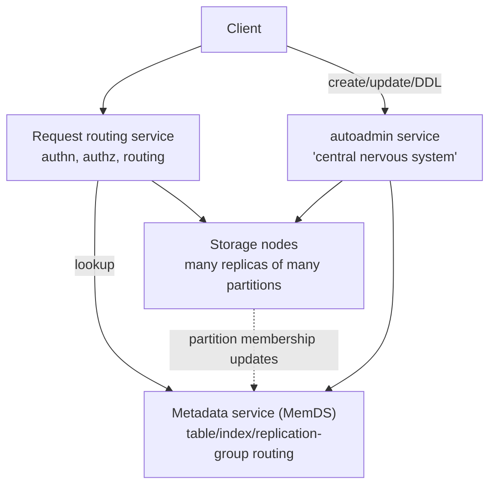

- **Metadata service:** routing information about tables, indexes, and replication groups for a
  table's or index's keys.
- **Request routing service:** authorizes, authenticates, and routes every request — reads and
  updates to storage nodes, resource creation/update/DDL to autoadmin.
- **Storage service:** stores customer data across a fleet of storage nodes, each hosting many
  replicas of different partitions.
- **autoadmin:** "the central nervous system." Owns fleet health, partition health, table scaling,
  and all control-plane requests. Continuously monitors partitions and **replaces any replica
  deemed unhealthy** (slow, unresponsive, or on bad hardware), and health-checks all core
  components, replacing failing hardware.

DynamoDB comprises **tens of microservices**; others (not diagrammed in the paper) support
point-in-time restore, on-demand backups, update streams, global admission control, global
tables, global secondary indexes, and transactions.

## The journey from provisioned to on-demand

### The original model and why it broke

Customers specified throughput as **read capacity units (RCU)** and **write capacity units
(WCU)**:

- **1 RCU** = one strongly consistent read per second for items up to **4 KB**.
- **1 WCU** = one standard write per second for items up to **1 KB**.

Admission control was **distributed and purely local**: each storage node enforced limits based
on the allocations of its own partitions. A cap on per-partition throughput plus the requirement
that a node's total allocated throughput not exceed its drives' physical capability provided
workload isolation.

Throughput was divided arithmetically:

| Event | Result |
| --- | --- |
| Split **for size** | Parent's allocated throughput divided **equally** among children |
| Split **for throughput** | New partitions allocated from the table's provisioned throughput |
| Table 3200 WCU, max 1000 WCU/partition | 4 partitions × 800 WCU |
| Increased to 3600 WCU | 4 partitions × 900 WCU |
| Increased to 6000 WCU | Split to 8 partitions × 750 WCU |
| Decreased to 5000 WCU | 8 partitions × 675 WCU |

**The flawed assumption:** that applications access keys uniformly and that splitting for size
splits performance proportionately. In reality access is non-uniform **both over time and over
key ranges**, so splitting a partition can leave its *hot* portion with **less** available
performance than before the split.

Two named failure modes:

- **Hot partitions** — traffic concentrated on a few items, either in a stable set of partitions
  or hopping between them over time.
- **Throughput dilution** — splitting for size divides throughput equally, so per-partition
  throughput falls.

Both produce **throttling**: rejected reads and writes even though the table's total provisioned
throughput was sufficient. From the customer's view this is unavailability, "even though the
service was behaving as expected." The workaround — over-provisioning — was a poor experience
because right-sizing was hard to estimate.

### Fix 1: Bursting (short spikes)

Observation: not all partitions on a node use their allocated throughput simultaneously.
DynamoDB **retains a partition's unused capacity for up to 300 seconds** as **burst capacity**,
usable on a best-effort basis when consumption exceeds provisioned capacity.

Isolation is preserved by requiring **node-level** headroom too. Capacity is managed with **token
buckets: two per partition (allocated and burst) plus one per node**:

- Tokens in the partition's **allocated** bucket → admit, deducting from partition and node
  buckets.
- Allocated exhausted → admit only if tokens exist in **both** the burst bucket **and** the node
  bucket.
- **Reads** are accepted on local buckets alone. **Writes using burst capacity require an
  additional check against the node-level buckets of the partition's other replicas** — the leader
  periodically collects each member's node-level capacity.

### Fix 2: Adaptive capacity (long spikes)

Actively monitors provisioned and consumed capacity of all tables. If a table throttles **while
its table-level throughput is not exceeded**, DynamoDB **boosts** the allocated throughput of its
partitions via a **proportional control algorithm**, and reduces it again if the table exceeds
its provisioned capacity. autoadmin relocates boosted partitions to nodes that can serve the
increase.

Still best-effort, but it **eliminated over 99.99% of throttling due to skewed access patterns**.

### Fix 3: Global admission control (GAC)

Both prior fixes had limits: **bursting only helps short spikes and depends on node headroom**;
**adaptive capacity is reactive — it engages only after throttling has already been observed**,
meaning the application already saw unavailability. The deeper problem was that **admission
control was coupled to partition-level capacity**.

GAC removes that coupling — **let the partition burst always, while preserving isolation**:

- The **GAC service centrally tracks total table consumption in tokens**.
- **Each request router maintains a local token bucket** and contacts GAC to replenish every few
  seconds. On each request the router deducts tokens; when it runs out (through consumption or
  expiry) it asks GAC for more.
- **GAC state is ephemeral**, computed on the fly from client requests, so **any GAC server can be
  stopped and restarted without impacting the service**. Each server tracks one or more
  independently configured buckets; all servers form an **independent hash ring**.
- Result: **non-uniform workloads hitting only a subset of items can run up to the maximum
  partition capacity.**
- **Partition-level token buckets are retained for defense in depth**, capped so that one
  application cannot consume all or a significant share of a storage node's resources.

### Balancing consumed capacity

Always-on bursting complicates colocation. Under the old static model, allocation was simple:
find a node that can accommodate the partition's allocated capacity; partitions never exceeded
it, so there were **no noisy neighbors**. But since nodes never used their full capacity at once,
the system **packs nodes with replicas totaling more than the node's provisioned capacity** —
which bursting can then overdraw.

Mitigation: **each storage node independently monitors total throughput and data size of its
replicas.** If throughput passes a threshold percentage of node maximum, it reports **candidate
partition replicas to move** to autoadmin, which finds a new node **in the same or another AZ that
does not already hold a replica of that partition**.

### Splitting for consumption

Even with GAC, skewed traffic to specific items can throttle. So DynamoDB **automatically splits
a partition once its consumed throughput crosses a threshold**, choosing the split point **from
the observed key distribution** — a proxy for the application's access pattern, and more effective
than splitting the key range in the middle. Splits complete **in minutes**.

**Two workload classes cannot benefit** and are detected so the split is skipped:

- a partition receiving high traffic to a **single item**;
- a partition whose key range is **accessed sequentially**.

### On-demand tables

Capacity units were a novel concept, and customers either over-provisioned (low utilization) or
under-provisioned (throttles). **On-demand tables** remove provisioning entirely: DynamoDB
observes read and write signals and **instantly accommodates up to double the previous peak
traffic**, allocating more automatically as traffic grows further so the workload does not
throttle. Scaling works by **splitting partitions for consumption**, driven by traffic. GAC
protects against any one application consuming all resources, and consumption-based balancing lets
on-demand partitions be placed so as not to hit node-level limits.

## Durability and correctness

### Hardware failures

Write-ahead logs live in **all three replicas** and are **periodically archived to S3** (designed
for 11 nines of durability). Each replica retains its most recent, not-yet-archived logs —
typically **a few hundred megabytes**.

When a node fails, its replication groups drop to two copies, and **healing a storage replica
takes several minutes** because the B-tree and WAL must be copied. So on detecting an unhealthy
storage replica, the leader **adds a log replica within seconds** — copying only recent WAL, no
B-tree — restoring durability for recent writes immediately.

### Silent data errors

Hardware can store *incorrect* data — storage media, CPU, or memory — and such errors are very
hard to detect and can occur anywhere. DynamoDB **maintains checksums within every log entry,
message, and log file**, validating integrity on every transfer between nodes. Checksums act as
**guardrails preventing errors from spreading**, since messages pass through several layers of
transformation before arriving.

Archival to S3 is heavily defended:

- Every archived log file has a **manifest** naming the table, partition, and start/end markers.
- Before upload the agent verifies **every log entry belongs to the correct table and partition**,
  verifies **checksums**, and verifies **there are no holes in the sequence numbers**.
- **Archival agents run on all three replicas.** If an agent finds the file already archived, it
  **downloads it and compares against its own local WAL**.
- Every log and manifest is uploaded **with a content checksum that S3 verifies as part of the
  put**, guarding against transit errors.

### Continuous verification

The **scrub** process targets errors that were *not* anticipated, such as bit rot. It verifies
two things:

1. **all three replicas in a replication group hold the same data**, and
2. **the live replicas match a replica built offline from the archived write-ahead logs** — i.e.
   from the table's entire log history since inception.

Verification compares the checksum of the live replica against a snapshot generated from the S3
log archive. A similar technique verifies global table replicas.

> "Over the years, we have learned that continuous verification of data-at-rest is the most
> reliable method of protecting against hardware failures, silent data corruption, and even
> software bugs."

### Software bugs

Complexity raises the probability of human error in design, code, and operations. DynamoDB uses
**formal methods extensively**:

- The **core replication protocol is specified in TLA+**, and **new features affecting it are
  added to the specification and model checked**. Model checking has caught subtle bugs that would
  have caused durability and correctness issues before reaching production.
- Formal methods have also verified the **control plane** and features such as **distributed
  transactions**.
- Complemented by **extensive failure injection testing and stress testing**.

### Backups and restores

Backups guard against **logical** corruption from application bugs, complementing physical
protections.

- Backups are built **from the write-ahead logs archived in S3**, so they **do not affect table
  performance or availability**.
- Backups are **full copies, consistent across multiple partitions up to the nearest second**,
  stored in S3, and restorable to a new table at any time.
- **Point-in-time restore** covers any moment in the **previous 35 days**, restoring into a
  different table in the same Region. DynamoDB takes **periodic partition snapshots** to S3, with
  **periodicity determined by how much WAL has accumulated** for that partition. Restore finds the
  closest snapshot per partition, applies logs to the requested timestamp, snapshots the table,
  and restores it.

## Availability

Resilience to node, rack, and AZ failure is tested regularly — including **power-off tests** where
a job scheduler powers off random nodes under realistic simulated traffic, after which test tools
verify the data is **logically valid and uncorrupted**.

### Write and consistent read availability

Write availability requires a healthy leader plus a healthy write quorum — **two of three replicas
from different AZs**. If a replica becomes unresponsive, the leader **adds a log replica**, the
fastest way to restore the quorum and minimize write disruption. The leader serves consistent
reads; on leader failure, peers detect it and elect a new one.

> "Introducing log replicas was a big change to the system, and the formally proven implementation
> of Paxos provided us the confidence to safely tweak and experiment with the system to achieve
> higher availability."

DynamoDB runs **millions of Paxos groups per Region** with log replicas.

### Failure detection and gray failures

A newly elected leader must **wait out the old leader's lease** — a couple of seconds during which
no writes or consistent reads are served. So **false-positive failure detection directly costs
availability**.

Simple detection works when *every* replica loses contact with the leader. **Gray network
failures** break that assumption: communication problems between one leader and one follower,
one-directional (inbound or outbound) node problems, or front-end routers unable to reach a leader
that its followers can reach fine. Either a false positive or a missed detection results.

**The fix:** a follower that wants to trigger failover **first asks the other replicas whether
they can still talk to the leader**. If any respond that the leader is healthy, the follower
**abandons the election attempt**. This "significantly minimized the number of false positives in
the system, and hence the number of spurious leader elections."

### Measuring availability

- Targets: **99.999% for global tables, 99.99% for Regional tables.** Availability is computed
  **per 5-minute interval** as the percentage of requests that succeed.
- Monitored continuously at **service and table level**, with **customer facing alarms (CFAs)**
  firing when customers see errors above threshold, so problems are mitigated automatically or by
  an operator.
- **Daily aggregation jobs** compute per-customer availability metrics, uploaded to S3 for trend
  analysis.
- **Client-side measurement** from two sources: (a) internal Amazon services using DynamoDB, which
  share the availability their own software observes; (b) **DynamoDB canary applications** run
  **from every AZ in the Region against every public endpoint**. Real application traffic is what
  catches **gray failures** and represents what customers actually experience.

### Deployments

Deployments happen at a regular cadence with **no maintenance windows** and no customer-visible
performance or availability impact. Hard-won lessons:

- **Rollback state ≠ initial state.** Testing typically covers start and end states but misses the
  rollback path. DynamoDB runs **component-level upgrade *and* downgrade tests before every
  deployment**, then **deliberately rolls back and runs functional tests**.
- **Distributed deployments are not atomic** — old and new code coexist, and new software may
  introduce message types or protocol changes old software cannot parse. The answer is
  **read-write deployment**: first deploy software that can *read* the new format; only once every
  node can handle it, deploy software that *sends* it. This ensures both message types coexist —
  **and that rollback remains safe**.
- **Deploy to a small set of nodes first.** Alarm thresholds on availability metrics trigger
  **automatic rollback** if error rates or latency exceed them during deployment.
- **Storage node deployments trigger deliberate leader failovers**: the leader **relinquishes
  leadership**, so the new leader does not have to wait out the old lease — turning a potential
  availability dip into a no-op.

### Dependencies on external services

Every service in DynamoDB's request path must be **more available than DynamoDB itself**, or
DynamoDB must keep working while it is impaired. The request path depends on **IAM** and **AWS
KMS** (for customer-key-encrypted tables) to authenticate every request.

The answer is a **statically stable design**: the system keeps working when a dependency is
impaired — it may not see *updated* information, but everything established before the impairment
continues to work. Concretely, **request routers cache IAM and KMS results and refresh them
asynchronously**; if IAM or KMS becomes unavailable, routers **keep using cached results for a
predetermined extended period**. Only clients reaching a router without a cached result are
affected, and in practice impact has been minimal. The cache also **removes an off-box call from
the request path**, which is most valuable exactly when the system is under high load.

### Metadata availability — the cache that hid its own load

The most important metadata is the mapping from a table's primary keys to storage nodes.
Originally this lived in DynamoDB itself: a router seeing a new table **downloaded the routing
information for the entire table** and cached it. Cache hit rate was ~**99.75%**.

**The failure mode is bimodality.** On a cold start with empty caches, *every* request causes a
metadata lookup, so the metadata service must scale to DynamoDB's full request rate. This was
observed in production: **adding capacity to the request router fleet occasionally spiked metadata
service traffic by up to 75%**, hurting performance and destabilizing the system. An ineffective
cache can also cause **cascading failure** as the backing store collapses under direct load.

Two changes:

**1. MemDS.** An in-memory distributed datastore holding all metadata in memory, replicated across
the fleet, **scaling horizontally to handle DynamoDB's entire incoming request rate**, with highly
compressed data. Each node encapsulates a **Perkle** structure — a hybrid of a **Patricia tree**
and a **Merkle tree** — supporting:

- insert and lookup by **full key or key prefix**;
- **range queries** (`lessThan`, `greaterThan`, `between`) since keys are stored sorted;
- two special operations: **`floor`** (the stored entry whose key is ≤ the given key) and
  **`ceiling`** (the entry whose key is ≥ the given key).

**2. A constant-load partition map cache.** In the new router cache, **a cache *hit* also triggers
an asynchronous refresh call to MemDS**. So MemDS serves **constant traffic regardless of hit
ratio**. This *increases* steady-state load on the metadata fleet compared with a conventional
cache, but it **eliminates the bimodality and prevents cascading failure when caches become
ineffective**.

Consistency: **storage nodes are the authoritative source of partition membership**, pushing
updates to MemDS, and each update propagates to all MemDS nodes. If MemDS returns stale
membership, the wrongly contacted storage node either **returns the latest membership if it knows
it, or returns an error code that triggers a fresh MemDS lookup**.

## Evaluation

**YCSB microbenchmarks** against **production DynamoDB in the North Virginia region**:

- **Workload A:** 50% reads / 50% updates. **Workload B:** 95% reads / 5% updates.
- Uniform key distribution, **900-byte items**.
- Scaled from **100 thousand to 1 million total operations per second**.

Results: **read latencies at p50 and p99 show very little variance and remain essentially
identical as throughput increases**, even though Workload B's read throughput is twice Workload
A's. **Write latencies likewise remain constant regardless of throughput**, and both workloads
have similar write latency profiles despite Workload A driving higher write throughput.

The point of the experiment is not peak numbers but **invariance**: scale does not change the
latency an application observes.

**Production evidence:** during the 66-hour Prime Day 2021 event, Amazon systems (Alexa, the
Amazon.com sites, fulfillment centers) made **trillions of API calls, peaking at 89.2 million
requests per second**, at high availability with single-digit millisecond performance.

## The four stated lessons

1. **Adapt the physical partitioning scheme to customers' traffic patterns** — splitting on
   observed key distribution rather than arithmetic midpoints improves customer experience.
2. **Continuous verification of data-at-rest is the reliable way to meet high durability goals**,
   protecting against hardware failure *and* software bugs.
3. **High availability through a system's evolution requires operational discipline and tooling** —
   formal proofs of complex algorithms, game days (chaos and load tests), upgrade/downgrade tests,
   and deployment safety together give "the freedom to safely adjust and experiment with the code
   without the fear of compromising correctness."
4. **Design for predictability over absolute efficiency.** Caches improve performance, but **do not
   let them hide the work that would be performed in their absence** — always provision the system
   to handle the unexpected. (The MemDS always-refresh cache is this lesson made concrete.)

## Limitations and questions

- **The paper is a retrospective, not a design specification.** Many mechanisms (transactions,
  global tables, secondary indexes, streams) are named but not described.
- **Best-effort mechanisms remain best-effort.** Bursting depends on node headroom; adaptive
  capacity was reactive; even with GAC, single-hot-item and sequential-key-range workloads are
  explicitly acknowledged as unsolvable by splitting.
- **Cost of the constant-load cache design** — deliberately higher steady-state metadata load in
  exchange for stability — is not quantified.
- **Evaluation is thin.** Two YCSB workloads with uniform keys and 900-byte items, run against
  production, demonstrate latency invariance but say nothing about skewed workloads, transactions,
  secondary indexes, or global tables.
- **No comparison to other systems**, and no absolute latency figures beyond "low single-digit
  milliseconds."
- **Multi-tenancy isolation is asserted rather than measured** — the paper describes the token
  bucket hierarchy but shows no noisy-neighbor experiments.

## Practical design checklist

Patterns worth stealing regardless of scale:

- **Don't statically divide a global budget among shards.** Central token accounting with local
  buckets replenished periodically (GAC) preserves isolation while letting any shard use the whole
  budget.
- **Split on observed access distribution**, not on the midpoint of a key range.
- **Add a cheap partial replica to restore quorum fast.** Log replicas restore durability in
  seconds where full replicas take minutes.
- **Verify data at rest continuously against an independent reconstruction** — the log archive is
  a second source of truth.
- **Checksum at every hop**, so a corruption is caught where it occurs rather than propagated.
- **Test the rollback, not just the upgrade**, and use read-then-write two-phase protocol
  deployment so both message versions always coexist safely.
- **Ask before you failover.** Requiring peer confirmation before triggering leader election kills
  most gray-failure false positives.
- **Make caches load-neutral.** Refresh on hit so the backend sees constant traffic and cold-start
  or eviction storms cannot cascade.
- **Design statically stable dependencies.** Cache authorization decisions and keep serving from
  them when the dependency is impaired.

## Takeaways

1. **Predictability is the product.** The design goal is not the lowest median latency but the
   absence of surprises — because latency spikes amplify up the application stack.
2. **The hardest problems were operational, not algorithmic.** Dynamo lost to SimpleDB internally
   despite better fit, purely because of management burden; DynamoDB's ten-year evolution is
   mostly about admission control, deployment safety, and failure detection.
3. **Static allocation is the enemy of multi-tenancy.** Every major capacity improvement — bursting,
   adaptive capacity, GAC, on-demand — moves further from statically binding capacity to a
   partition.
4. **Reactive is worse than proactive.** Adaptive capacity worked but only *after* the customer
   saw throttling; GAC's value is preventing the failure rather than repairing it.
5. **Formal methods buy the confidence to change things.** TLA+ verification of the replication
   protocol is what made introducing log replicas — a substantial change to a live system serving
   millions of Paxos groups — safe to attempt.
6. **Two sources of truth make silent corruption detectable.** Comparing live replicas against a
   replica rebuilt from the archived log history is what catches bit rot and unanticipated bugs.
7. **Caches are a liability unless their absence is provisioned for.** A 99.75% hit rate hid a
   metadata service sized for 0.25% of the load; making hits refresh asynchronously trades
   efficiency for a system that cannot fall off a cliff.

## Citation

```bibtex
@inproceedings{elhemali2022dynamodb,
  author = {Mostafa Elhemali and Niall Gallagher and Nicholas Gordon and Joseph Idziorek and
            Richard Krog and Colin Lazier and Erben Mo and Akhilesh Mritunjai and
            Somu Perianayagam and Tim Rath and Swami Sivasubramanian and
            James Christopher Sorenson III and Sroaj Sosothikul and Doug Terry and Akshat Vig},
  title = {Amazon {DynamoDB}: A Scalable, Predictably Performant, and Fully Managed {NoSQL}
           Database Service},
  booktitle = {2022 USENIX Annual Technical Conference (USENIX ATC 22)},
  pages = {1037--1048},
  year = {2022},
  publisher = {USENIX Association}
}
```

---

## Paper: FASTER: A Concurrent Key-Value Store with In-Place Updates

# FASTER: A Concurrent Key-Value Store with In-Place Updates

> SIGMOD 2018 — structured reading notes

Full paper content: [Markdown conversion](../original/faster-sigmod-2018.md)

## Paper information

- **Authors:** Badrish Chandramouli, Guna Prasaad, Donald Kossmann, Justin Levandoski,
  James Hunter, Mike Barnett
- **Affiliations:** Microsoft Research; University of Washington
- **Venue:** SIGMOD 2018, Houston, TX, USA, 16 pages
- **DOI:** [10.1145/3183713.3196898](https://doi.org/10.1145/3183713.3196898)

## One-sentence summary

FASTER pairs a cache-line-sized, latch-free, resizable hash index with **HybridLog** — a log whose
in-memory tail is updated *in place* while its older regions behave like a classic append-only
log — achieving up to **160M operations/second on one machine**, beating pure in-memory data
structures on in-memory workloads while still handling data larger than memory and adapting to a
drifting hot set with **no per-record or per-page caching statistics**.

## Problem: the shape of modern state management

Five characteristics of state in cloud/edge applications:

- **Large state.** Far exceeding main memory — e.g. a targeted-ads provider keeping per-user,
  per-ad, and clickthrough statistics for billions of users. Even when state *does* fit,
  **keeping infrequently accessed state on secondary storage is cheaper**.
- **Update intensity.** Not just reads and inserts — e.g. a monitoring application updating a
  per-device aggregate for each of millions of CPU readings per second.
- **Locality.** Billions of objects may be alive but only a small fraction is hot, **and the hot
  set drifts** (a search engine may have a billion users alive but a million actively surfing).
- **Point operations.** State is many independent objects; a hash-based point-operation store
  suffices. Infrequent range queries can be served by workarounds like indexing histograms of key
  ranges.
- **Analytics readiness.** Updates should be readily consumable by offline analytics.

### Why existing approaches fall short

| Approach | Problem |
| --- | --- |
| **Partition across machines + pure in-memory structures** (e.g. Intel TBB Hash Map) | Expensive and **severely under-utilizes each machine** — an ads platform may spread state over hundreds of machines, giving each a low request rate and idle compute. Pure in-memory structures also complicate failure recovery |
| **Key-value stores** (RocksDB and kin) | Handle larger-than-memory data and recovery, but are optimized for **blind updates, reads, and range scans**, not point operations and **read-modify-writes**. They do not scale beyond a few million updates/second even when the hot set fits in memory |
| **Caching systems** (Redis, Memcached) | Optimized for point operations but **slow, and dependent on an external database or KV store** for storage and recovery |

**The gap:** concurrency + in-place updates in memory + larger-than-memory capability, all at
once. No existing system provided all three.

FASTER's design philosophy: **make the common case fast** — (1) fast point access via a
cache-efficient latch-free hash index; (2) carefully choose *when and how* expensive or uncommon
activities (index resizing, checkpointing, eviction) happen; (3) let threads do **in-place updates
most of the time**.

## Architecture

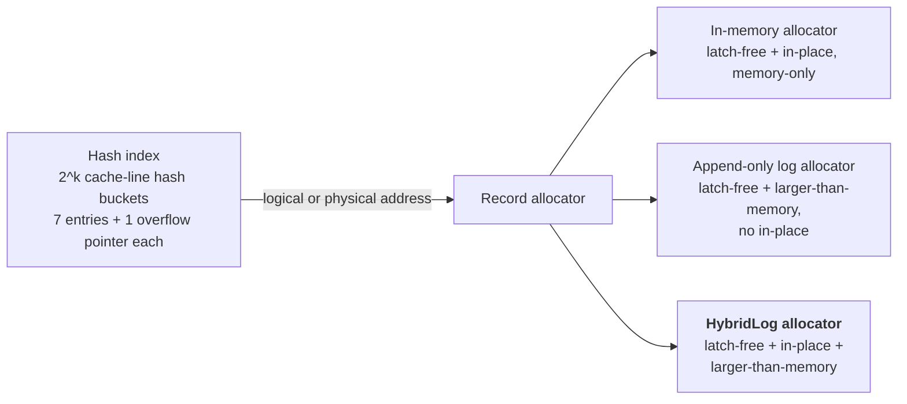

- Records with the same (offset, tag) form a **reverse singly-linked list**; the bucket entry
  points to the tail (most recent record), which points backwards.
- A record is a **64-bit header** (previous pointer plus `invalid` and `tombstone` bits), the key,
  and the value; keys and values may be fixed or variable size.

**Keys are not stored in the hash index** — unlike traditional designs. Two payoffs:

1. It **shrinks the index's memory footprint**, so the whole index stays in memory.
2. It **separates user data from index metadata**, letting the same index be mixed and matched
   with different record allocators.

### User interface

Update logic is supplied as user-defined delegates and inlined into the store by **dynamic code
generation**, so advanced updates are natively supported at full speed.

| Operation | Semantics |
| --- | --- |
| `Read` | Read the value for a key |
| `Upsert` | Replace the value **blindly**, regardless of the existing value; insert if absent |
| `RMW` | **Read-modify-write** — update based on existing value plus an optional input, using compile-time user logic. The user also supplies an initial value used when the key is absent. An RMW may be declared **mergeable (a CRDT)**, meaning it can be computed as partial values later merged (e.g. partial sums) |
| `Delete` | Delete a key |

Operations may go **PENDING** (e.g. waiting on I/O); threads periodically call
`CompletePending` to process their outstanding operations.

## Epoch protection framework

**Design principle: avoid expensive coordination between threads in the common fast access path.**
Threads operate independently almost all the time but must still agree on shared system state.
FASTER extends multi-threaded epoch protection into a **generic framework for lazy synchronization
over arbitrary global actions**. (Silo, Masstree, and Bw-Tree used epochs for specific purposes;
FASTER makes it a reusable building block.)

**Basics.** A shared atomic counter **E** (current epoch) can be incremented by any thread. Each
thread *T* has a thread-local `E_T` refreshed periodically, all stored in a shared **epoch table,
one cache line per thread**. An epoch *c* is **safe** if every thread has a strictly higher local
value. A global **E_s** tracks the maximal safe epoch, recomputed by scanning the table whenever a
thread refreshes. Invariant: `∀T: E_s < E_T ≤ E`.

**Trigger actions.** When bumping the epoch from *c* to *c+1*, a thread may attach an action to be
executed once epoch *c* becomes safe. Implemented as a **drain-list** of ⟨epoch, action⟩ pairs — a
small array scanned whenever **E_s** updates, with **compare-and-swap ensuring each action runs
exactly once**. For scalability, **E_s** is recomputed and the drain-list scanned **only when the
current epoch changes**.

**Four operations:**

| Operation | Effect |
| --- | --- |
| `Acquire` | Reserve an entry for *T*, set `E_T = E` |
| `Refresh` | Update `E_T` to **E**, recompute **E_s**, trigger ready drain-list actions |
| `BumpEpoch(Action)` | Increment **E** from *c* to *c+1*, add ⟨c, Action⟩ to the drain-list |
| `Release` | Remove *T*'s entry from the epoch table |

**The canonical pattern:** a thread atomically sets `status = active` and bumps the epoch with
`active-now` as the trigger. Other threads will not observe the change immediately, but **all are
guaranteed to have observed it once they refresh** (sequential consistency via memory fences), so
`active-now` runs only when every thread agrees — safely.

FASTER uses this for garbage collection, index resizing, circular buffer maintenance and page
flushing, shared log page boundary maintenance, and checkpointing — **while giving threads
unrestricted latch-free access to shared memory in short bursts**.

**Thread lifecycle:** `Acquire` → user operations, calling `Refresh` (e.g. every 256 operations)
and `CompletePending` (e.g. every 64K operations) → `Release`.

## The hash index

### Layout

A cache-aligned array of **2^k hash buckets, each one cache line**. A 64-byte bucket holds
**seven 8-byte entries plus one 8-byte overflow bucket pointer**; overflow buckets are also
cache-line sized and allocated on demand.

The 8-byte entry size is deliberate: it permits **latch-free operation via 64-bit
compare-and-swap**. Physical addresses use fewer than 64 bits (Intel uses 48-bit pointers), so
the remaining bits are stolen for index metadata. Each entry contains:

| Field | Width | Purpose |
| --- | --- | --- |
| **tag** | 15 bits | Raises effective hashing resolution from *k* to *k + 15* bits, reducing collisions |
| **tentative bit** | 1 bit | Used by the two-phase insert (below) |
| **address** | 48 bits | Logical or physical address from the record allocator |

An all-zero entry means empty. Tags may be smaller or removed entirely depending on address size.

### The insert problem and the two-phase solution

**Invariant: each (offset, tag) has a unique index entry.**

- Naïve approach — find any empty entry and CAS the tag — breaks it: two threads can insert the
  **same tag into two different empty slots**.
- "Always take the leftmost empty slot" also breaks it **in the presence of deletes**: `T1` scans
  and chooses slot 5 for tag `g5`; `T2` deletes tag `g3` from slot 3, then inserts a key with tag
  `g5` and, scanning left to right, chooses slot 3. In general, **any algorithm that
  independently chooses a slot then inserts directly is broken**, because between choosing and
  CAS-ing a thread may be descheduled and the state may change arbitrarily.

**FASTER's latch-free two-phase insert:**

1. Find an empty slot and insert the entry **with the tentative bit set**. Tentative entries are
   **invisible to concurrent reads and updates**.
2. **Re-scan the bucket** (already in cache) for another tentative entry with the same tag. If
   found, **back off and retry**.
3. Otherwise **clear the tentative bit**, finalizing the insert.

Because every thread follows this ordering, **no interleaving can produce duplicate non-tentative
tags**.

Finding an entry is a bucket scan for a matching tag; deleting is a CAS replacing the entry with
zero.

### Resizing and checkpointing

Resizing on the fly uses **epoch protection plus a state machine of phases**. Because all index
operations are latch-free CAS operations, **the index is always in a consistent state**, which
permits an **asynchronous fuzzy checkpoint without read locks** — greatly simplifying recovery.

## In-memory store (index + simple allocator)

Pairing the index with an allocator like jemalloc yields a pure in-memory KV store.

- **Reads:** find the tag entry, traverse the linked list for a matching key.
- **Updates/inserts:** find the bucket entry (two-phase insert the tag if absent), scan the list.
  If the record exists, **update in place** — safe because **a thread has guaranteed access to a
  record's memory location as long as it does not refresh its epoch**. If absent, CAS the new
  record onto the list tail.
- **Record-level concurrency is the user's responsibility**, handled inside the user's read/update
  logic: fetch-and-add for counters, a record-level lock, or latch-free updates exploiting
  application-level partitioning.
- **Deletes:** CAS the record out of the linked list (or zero the bucket entry for a singleton).
  A deleted record **cannot be freed immediately** because of concurrent access, so each thread
  keeps a **thread-local free-list of (epoch, address) pairs**, returned to the allocator once the
  epochs are safe.

## Append-only log allocator (the strawman)

A **48-bit global logical address space** spanning memory and storage. The index now stores
**logical** addresses.

- **Tail offset** points to the next free address. **Head offset** tracks the lowest logical
  address still in memory, maintained at approximately constant lag from the tail (equal to the
  memory available for the log) and **updated only when the tail crosses page boundaries** to
  minimize overhead.
- The region between head and tail lives in a **bounded in-memory circular buffer**: fixed-size
  page frames of 2^F bytes, each **sector-aligned to the storage device** so reads and writes can
  be unbuffered without extra memory copies. Logical address *L* maps to offset `L & (2^F − 1)` in
  page frame `L >> F`.
- **Allocation** uses the tail offset stored as page number + offset in one word: a thread does a
  **fetch-and-add on the offset**; if the allocation would not fit on the current page, it
  increments the page number and resets the offset. Threads seeing an offset beyond page size wait
  for it to become valid and retry.

### Circular buffer maintenance via epochs

Two status arrays: **flush-status** (has this page been flushed?) and **closed-status** (can this
page frame be reused?).

- **Flushing:** records are immutable once written, so when the tail enters page *p+1*, FASTER
  bumps the epoch with a trigger action that **asynchronously flushes page *p***. Because the
  action runs only when the epoch is safe, and threads refresh at operation boundaries, **all
  threads have finished writing to page *p*** — so the flush is safe.
- **Eviction:** rather than latching/pinning pages as a traditional buffer pool does, FASTER
  **increments the head offset and bumps the epoch with a trigger that marks the old page frame
  closed**. When that epoch is safe, every thread has seen the new head offset and cannot be
  accessing those addresses. The page must be **fully flushed before the head offset moves**, so
  threads needing those records can fetch them from storage.

### Operations, and why this is not enough

Blind updates append a new record and CAS the index; on failure the record is **marked invalid via
a header bit** and the operation retried. Deletes append a **tombstone** record and require log
garbage collection. Reads and RMWs check whether the logical address is above the head offset; if
not, an **asynchronous read for just the record** (not the whole page) is issued. Each operation
carries a **context** placed on a thread-local pending queue for continuation by
`CompletePending` — and continuations may issue further I/O (e.g. to follow the linked list).

The cost: **every update needs an atomic tail increment, a data copy, and an atomic index
replace**, and **an append-only log grows fast** under update-heavy workloads, quickly making disk
I/O the bottleneck. Measured ceiling: **no more than 20M ops/sec, not scaling with threads**.

### Why in-place updates matter

1. Frequently accessed records stay in higher cache levels.
2. Access paths for keys in different hash buckets **do not collide**.
3. Updating part of a large value avoids copying the whole record or maintaining **expensive delta
   chains that require compaction**.
4. **Most updates need not modify the hash index at all.**

## HybridLog

The logical address space is divided into three contiguous regions:

```text
  ┌──────────── stable ────────────┬─── read-only ───┬──── mutable ────┐
  │        (secondary storage)     │   (in memory)   │   (in memory)   │
  └────────────────────────────────┴─────────────────┴─────────────────┘
                            head offset      read-only offset      tail offset
```

- **Mutable region** — updated **in place**.
- **Read-only region** — immutable; updating a record here uses **read-copy-update**: create a new
  copy at the tail, then update it. Subsequent updates are in place while it remains mutable.
- **Stable region** — on storage.

| Record's logical address | Action |
| --- | --- |
| Invalid (key absent) | Make a new record at the tail |
| < HeadOffset | Issue async I/O request, then copy to tail |
| < ReadOnlyOffset | Make a mutable copy at the tail |
| < ∞ (i.e. in mutable region) | **Update in place** |

The read-only offset sits at constant lag from the tail and, like the head offset, moves **only at
page boundaries**. Since **no page below the read-only offset is being updated concurrently, those
pages are safe to flush** — so the read-only offset doubles as a lightweight "ready to flush"
indicator. This is exactly what traditional buffer pools need pinning for: **HybridLog gets
latch-free access to mutable records without pinning pages before update**.

The read-only region also acts as a **second-chance cache** before eviction.

### The lost-update anomaly and the safe read-only offset

The read-only offset is read and written atomically, but a thread can still act on a **stale**
value:

> `T1` and `T3` both read logical address *L* from the index. `T1` sees read-only offset `R1`,
> concludes *L* is mutable, and prepares an in-place update. `T2` shifts the offset to `R2`. `T3`
> now compares *L* against `R2`, decides *L* is read-only, and creates a new record at *L'* with
> value 5. `T1` then writes 5 in place at *L*. All future reads use *L'* — **`T1`'s update is
> lost.**

A read lock on the offset would prevent this but is expensive and would **delay shifting the
read-only offset**, which is integral to circular buffer maintenance. Instead FASTER introduces the
**safe read-only offset**, defined by the invariant:

> **safe read-only offset = the minimum read-only offset seen by any active FASTER thread.**

Maintained via epochs: **whenever the read-only offset moves, bump the epoch with a trigger action
that sets the safe read-only offset to the new value** — legal because every thread that crossed
that epoch must have seen the new value.

This creates a **fourth region — the fuzzy region**, between safe read-only and read-only offsets,
where *some* threads see addresses as read-only and others as mutable. Threads have **thread-local
views** of these markers, converging only on refresh; a recently refreshed thread has the highest
read-only offset, a stale thread the lowest, and the safe offset is at most that minimum. **Below
the safe read-only offset**, several threads may race to create a new record and only one wins the
index CAS.

### Handling the fuzzy region by update type

| Logical address | Read-modify-write | CRDT update | Blind update |
| --- | --- | --- | --- |
| Invalid | Create new record at tail | Create new record at tail | Create new record at tail |
| < HeadAddress | **Issue async I/O request** | Create new record at tail | Create new record at tail |
| < SafeReadOnlyAddress | **Add to pending list** | Create **delta record** at tail | Create new record at tail |
| < ReadOnlyAddress | Create an updated record at tail | Create an updated record at tail | Create an updated record at tail |
| < ∞ | Update in place concurrently | Update in place concurrently | Update in place concurrently |

- **Blind update** never reads the old value, so even while another thread updates a previous
  location in place, this thread can append a new record — the application's semantics must simply
  admit all serial orders. Bonus: **no disk retrieval needed** when the record is not in memory.
- **Read-modify-write** must read before writing and cannot be certain no one is concurrently
  updating, so creating a tail copy would reintroduce the lost update. It is therefore **deferred
  into the pending queue**, like a storage-resident record.
- **CRDT** is the middle ground: append a **delta record** computed against the initial (empty)
  value and link it. **A read reconciles all deltas** to obtain the converged value; deltas can be
  periodically collapsed to bound chain length.

### Caching behavior — the elegant part

Standard buffer-pool/VM protocols (FIFO, CLOCK, LRU, LRU-K) all except FIFO require **fine-grained
per-page or per-record statistics**. HybridLog gets good **per-record** caching behavior **for
free**, purely from the access pattern, closely resembling **Second-Chance FIFO**:

> A record fetched from disk for update is written at the tail. It stays in memory, updatable in
> place, until it drifts into the read-only region. If the key is hot, a subsequent request before
> eviction creates a new mutable record — **a second chance to stay cached**. Otherwise it is
> evicted, making space for hotter keys.

**Sizing the regions.** Lag = 0 gives an append-only store; lag = buffer size gives an in-memory
store. A **smaller read-only (larger mutable) region** gives better in-memory performance through
in-place updates, but a hot record may be evicted for a brief lull in access. A **larger read-only
region** makes updates append-only, grows the log faster, and **replicates records across the two
regions, effectively shrinking the cache**. In practice **a 90:10 mutable:read-only split performs
well**.

## Recovery and consistency

**Guarantee: monotonicity.** For two update requests *r1* and *r2* issued in that order by a
thread, the recovered state includes the effects of **none, only *r1*, or both** — never *r2*
without *r1*. This can be obtained conventionally with a **write-ahead log plus fuzzy checkpoints**
(a well-studied recovery problem).

**Eliminating the WAL.** A separate WAL would bottleneck update-intensive workloads, so FASTER
**treats HybridLog itself as the WAL** and **delays commit to allow in-place updates within a
limited time window**.

**Checkpointing.** The index could be rebuilt entirely from HybridLog, but checkpointing it speeds
recovery. Because all index operations are CAS-based, the checkpointing thread reads the index
**asynchronously with no read locks** — producing a *fuzzy* checkpoint not consistent with any
single log position. The fix:

1. Record the HybridLog tail offset **before (t1)** and **after (t2)** the fuzzy checkpoint.
2. All index updates during that interval correspond **only** to records between *t1* and *t2*,
   **because in-place updates do not modify the index**.
3. On recovery, **scan records between *t1* and *t2* in order** and update the recovered fuzzy
   index where needed. The result is a consistent index corresponding to HybridLog up to *t2*,
   since every index update after *t2* concerns only records after *t2*.
4. **Move the read-only offset to *t2***, and once the corresponding flush completes you have a
   checkpoint at log position *t2*.

Two properties: the algorithm runs **in the background without quiescing the database**, and every
checkpoint is **incremental** — only data modified since the last checkpoint is offloaded.
Incremental checkpointing normally needs a separate bitmap-like structure; **FASTER gets it purely
from how data is organized**.

**Known gap (acknowledged).** This scheme can violate monotonicity because of in-place updates:
*r1* may modify location `l1 ≥ t2` while a later *r2* modifies `l2 < t2`; a checkpoint at *t2*
includes *l2* but not *l1*. The authors sketch a fix — using epochs and triggers so threads
collaboratively switch to a new database version identified by a HybridLog location — and leave
the details to future work.

## Evaluation

### Setup

- **Implementation:** C#, an embedded component, using code generation to inline user functions.
  Log stored on SSD. Garbage collection assumed expiration-based and **excluded from results**;
  **checkpoint/recovery costs also excluded**. In-place-updatable region sized at **90%** of memory
  unless noted; index sized at **#keys/2 hash bucket entries** by default. **All experiments use
  HybridLog**, i.e. the complete larger-than-memory version.
- **Hardware:** two identical Dell PowerEdge R730s — one Windows Server (FASTER), one Ubuntu
  (other systems, which are Linux-optimized). 2.60 GHz Intel Xeon E5-2690 v4, **2 sockets × 14
  cores (28 hyperthreads) = 56 threads**, 256 GB RAM, **3.2 TB FusionIO NVMe SSD** for the log.
  Threads pinned to cores; two-socket experiments shard threads across sockets. 30-second runs
  (10 minutes for RocksDB).
- **Workload:** extended YCSB-A — **250 million distinct 8-byte keys**, values of 8 or 100 bytes.
  Notation `R:BU` = reads : blind updates. RMW updates increment by a value drawn from an 8-entry
  input array, modelling a per-key running sum. Distributions: uniform, Zipfian (θ = 0.99), and a
  new **hot set** distribution modelling keys moving cold → hot → cold (like search engine users).
- **Baselines:** **Masstree** (in-memory range index) and **Intel TBB concurrent hash map**
  (in-memory hash) for pure in-memory; **RocksDB** and **Redis** for larger-than-memory. RocksDB
  configured per its wiki with **WAL and checksums disabled** and direct I/O; TBB stored values
  inline.

### Headline results

| Measurement | Result |
| --- | --- |
| All 56 threads, uniform | up to **115M ops/sec** |
| All 56 threads, Zipfian | up to **165M ops/sec** |
| Append-only log allocator (same workload) | **≤ 20M ops/sec**, does not scale with threads |
| RocksDB, larger-than-memory YCSB | **~500K ops/sec at best** |
| Redis, single thread, localhost, 8-byte values, pipelined | ~1.1M sets/sec and 1.4M gets/sec over a 1M keyspace; **~700K sets/sec and 900K gets/sec over a 250M keyspace** — "significantly lower than single-threaded FASTER" |
| Sequential log write bandwidth (0:100, 80% read-only region, uniform) | **1.74 GB/sec**, against a theoretical SSD maximum of 2 GB/sec |

Other observations:

- **Single-threaded FASTER outperforms pure in-memory systems**, making it a good fit for embedded
  environments — despite also handling larger-than-memory data.
- **Intel TBB** does well on uniform but **hits contention under Zipfian and fails to scale**,
  falling over around 20 cores on two CPUs (locking contention). **Masstree** scales well but at
  much lower absolute throughput.
- **Scalability:** FASTER scales well on one and two CPUs for 100% RMW with 8-byte payloads. For
  0:100 blind upserts with **100-byte payloads**, scaling is linear to 48 threads then levels off
  because the workload **saturates cross-socket bandwidth**.
- **Tag size robustness:** with the 50:50 uniform workload on all threads, shrinking the tag to
  **4 bits costs <5%** and to **1 bit costs <14%** — confirming FASTER can handle larger address
  sizes.

### Larger-than-memory

27 GB dataset, 100-byte payloads, 14 threads on one socket, memory budget including 2 GB for the
index (sized at #keys/8 buckets here).

- **50:50 Zipfian:** throughput drops as memory shrinks (more random SSD reads) but **quickly
  reaches in-memory levels once the dataset fits**. The authors call the steep drop-off a target
  for future I/O path optimization.
- **0:100 blind updates:** slightly lower with ample memory, as expected — but **throughput
  degrades far less** as memory shrinks, because **bulk sequential log writes with no random reads
  are efficient**.

### Ablations

**Append-only vs. HybridLog** (YCSB-A 50:50; circular buffer of 2^15 pages × 4 MB): HybridLog
scales linearly; append-only is **significantly slower** due to new-entry creation and **tail
contention**. Notably the distributions behave oppositely: under HybridLog, **Zipfian beats
uniform** (skew improves TLB and cache behavior); under append-only, that benefit is **outweighed
by failed compare-and-swaps from conflicting updates**.

**IPU region size** (100% RMW, 56 threads), varying the *IPU Region Factor* (fraction of the
dataset in the in-place-update region): throughput **rises** and log growth rate **falls** as the
IPU region grows — both desirable. Under Zipfian, high throughput is reached at **lower** IPU
factors than uniform, and log growth declines faster — both effects of HybridLog's shaping. (Log
growth is reported for 8-byte keys and values, 24 bytes per record; larger payloads multiply it.)

**Fuzzy region cost** (100% RMW uniform, 56 threads, refresh every 256 operations): the percentage
of fuzzy updates **never exceeds 3%**, and exceeds 0.5% only in the artificial case where **less
than 70% of memory is mutable**. Holding the IPU factor at 0.8 and varying thread count, the fuzzy
percentage rises with threads but **stays below 1% at all 56 threads**.

### Caching simulation

Constant-size key buffer, evicting per protocol; HLOG modelled with a read-only marker at constant
lag from the tail, copying read-only keys to the tail as FASTER does. Three access patterns:
uniform, Zipfian (θ = 0.99), and **hot-set** (a shifting hot set of 1/5 the total size accessed
with 90% probability; the cold set uniformly with 10%).

- **Uniform:** HLOG matches the other protocols.
- **Zipfian and hot-set:** HLOG's miss rate is **higher than LRU-1, LRU-2, and CLOCK**, because
  **hot keys are replicated — one copy in the read-only region and one in the mutable region —
  reducing effective cache size**.
- **HLOG beats plain FIFO**, since it gives keys a second chance.
- Overall: **competitive with optimized algorithms without maintaining any statistics**, while
  keeping the latch-free fast path.

## Positioning against related work

- **Epochs** have been used by Silo, Masstree, and Bw-Tree for specific bottlenecks; FASTER adds
  **trigger actions** and generalizes them into a lazy-synchronization framework used in at least
  six places.
- **Log structuring** (from log-structured file systems onward) applies read-copy-update to an
  append-only log. **HybridLog combines log structuring with in-place updates** to get high
  performance for hot data *and* fast sequential logging.
- **In-memory caches/stores** — Redis, Memcached, MemC3, MICA — do not handle larger-than-memory
  data themselves. **Distributed stores** — RAMCloud, FaRM — scale out via partitioning, remote
  memory, or RDMA rather than exploiting storage for cold data, and report lower single-node
  performance.
- **Streaming state stores** (Spark State Store, Storm Trident) use a simple partitioned in-memory
  hash table with synchronous periodic checkpointing, **without concurrent access**, at low
  throughput. **Google Cloud Dataflow** keeps recent state in memory and offloads to BigTable,
  with potentially high overhead from the decoupling.
- **Range KV stores** — Cassandra, RocksDB, Bw-Tree — handle large state but their **key-ordered
  page format optimized for reads and range queries** adds complexity, and **read-copy-update is
  expensive for update-intensive workloads**. RocksDB does support in-place updates in level 0 but
  cannot exploit them for acceptable in-memory performance, generally achieving **under 1M
  ops/sec**, with an **expensive "merge" operation for RMW**.
- **Databases:** in-memory databases cannot spill to storage. **ERMIA** uses latch-free structures,
  epochs, and log structuring but is **append-only** and targets full serializability. Traditional
  databases use a buffer pool; **FASTER avoids both buffer pool and page latching**, using
  coarse-grained log regions instead. **H-Store** partitions to avoid concurrency, at the cost of
  shuffle overhead, load imbalance, and skew. **Deuteronomy** and **Hekaton** index with hashing
  but are read-copy-update based.

## Limitations and questions

- **Recovery is sketched, not delivered.** The WAL-free scheme is described at a high level, the
  monotonicity violation from in-place updates is acknowledged, and the fix is explicitly left to
  future work. **Checkpoint and recovery costs are excluded from all measurements.**
- **Garbage collection is assumed, not measured** — an expiration-based scheme whose cost is
  excluded.
- **RMWs in the fuzzy region go pending**, i.e. slow-path. Measured at under 3% of operations, but
  that depends on refresh frequency, thread count, and region sizing.
- **HybridLog caching is worse than LRU/CLOCK on skewed workloads** because hot keys are
  duplicated across the read-only and mutable regions. The trade is deliberate — no statistics, no
  latching — but it is a real miss-rate cost.
- **Record-level concurrency is the user's problem.** FASTER guarantees memory safety via epochs
  but leaves value-level correctness to user-supplied update logic.
- **Point operations only.** Range queries need workarounds; ordering is only approximate (the log
  is "record-oriented and approximately time-ordered").
- **Cross-platform comparison caveat:** FASTER runs on Windows Server while baselines run on Linux
  (where they are optimized), on identical hardware — a reasonable choice, but not an
  apples-to-apples environment.
- **The steep degradation as memory shrinks** is acknowledged as an unoptimized I/O path.

## Practical design checklist

FASTER's ideas apply when:

- the workload is **point reads and updates, especially read-modify-writes**, at very high rates;
- state exceeds memory but exhibits **strong, drifting temporal locality**;
- you can express updates as **user delegates** and, where possible, as **CRDTs**;
- range scans are rare enough to serve by other means.

Look elsewhere when:

- you need **range queries or ordered iteration** as a first-class operation;
- you need **serializable multi-key transactions**;
- you need **strict durability semantics** out of the box (recovery here is a sketch);
- your workload is read-only over cold data, where an LSM store's read path is better tuned.

## Takeaways

1. **In-place update is the whole point.** Every architectural decision — keys out of the index,
   epochs instead of latches, the mutable region — exists so that the common case avoids allocating,
   copying, and CAS-ing the index.
2. **Make synchronization lazy and generic.** Epoch protection with trigger actions turns "wait
   until every thread has seen this change" into a reusable primitive, used for GC, resizing,
   flushing, eviction, offset propagation, and checkpointing alike.
3. **Address ranges can replace pinning.** Comparing a record's logical address against moving
   offsets tells a thread whether mutation is safe — no page latch, no buffer pool.
4. **A stale view is fine if you bound it.** The safe read-only offset makes staleness explicit and
   confines it to a "fuzzy region," which measurements show is under 3% of operations.
5. **Classify updates by what they need to read.** Blind updates, CRDTs, and RMWs each admit a
   different, cheaper treatment in the ambiguous region — only true RMWs must go pending.
6. **Caching can be a byproduct of layout.** Second-chance FIFO behavior emerges from the log's
   geometry with **zero** per-record statistics; the cost is duplicated hot keys.
7. **Latch-free insert needs a publication protocol.** The tentative bit shows the general pattern:
   write invisibly, re-verify, then publish — because "choose a slot, then CAS" is unsound under
   concurrent deletes.
8. **The log can be the write-ahead log.** Treating HybridLog as both data and recovery log, with
   delayed commit, removes a whole bottleneck — and makes checkpoints incremental for free.

## Citation

```bibtex
@inproceedings{chandramouli2018faster,
  author = {Badrish Chandramouli and Guna Prasaad and Donald Kossmann and Justin Levandoski and
            James Hunter and Mike Barnett},
  title = {{FASTER}: A Concurrent Key-Value Store with In-Place Updates},
  booktitle = {Proceedings of the 2018 International Conference on Management of Data
               (SIGMOD '18)},
  year = {2018},
  doi = {10.1145/3183713.3196898}
}
```

---

## Paper: FoundationDB Record Layer: A Multi-Tenant Structured Datastore

# FoundationDB Record Layer: A Multi-Tenant Structured Datastore

> SIGMOD 2019 Industrial Track — structured reading notes

Full paper content: [Markdown conversion](../original/foundationdb-record-layer-sigmod-2019.md)

## Paper information

- **Authors:** Christos Chrysafis, Ben Collins, Scott Dugas, Jay Dunkelberger, Moussa Ehsan,
  Scott Gray, Alec Grieser, Ori Herrnstadt, Kfir Lev-Ari, Tao Lin, Mike McMahon, Nicholas
  Schiefer, Alexander Shraer
- **Affiliation:** Apple, Inc.
- **Venue:** SIGMOD 2019, Amsterdam, Netherlands, pages 1787–1802 (16 pages)
- **DOI:** [10.1145/3299869.3314039](https://doi.org/10.1145/3299869.3314039)
- **Code:** https://github.com/foundationdb/fdb-record-layer

## One-sentence summary

The Record Layer is a **stateless client library** that turns FoundationDB's ordered
transactional key-value store into a relational-like record store, and its **record store
abstraction** — one logical database confined to one contiguous key subspace — is what lets Apple's
CloudKit run **billions of independent databases sharing thousands of schemata** with transactional
secondary indexes.

## Problem

Four challenges any company offering stateful services must solve, and which are "notoriously
difficult to solve correctly":

1. **Horizontal scalability** — data volume, user count, and access rates demand smart
   partitioning and placement, with elastic scaling of both storage and computation.
2. **Availability and durability** — at scale, network, disk, and machine failures become everyday
   events.
3. **Transactions** — the usual scalability answers (eventual consistency) push immense complexity
   onto application developers.
4. **Multi-tenancy** — isolation, resource sharing, and elasticity. Most databases **intermingle
   tenant data at both compute and storage levels**, and retrofitting isolation is hard. Stateful
   services resist elastic scaling because **state cannot be partitioned arbitrarily**: data and
   indexes cannot live on separate storage clusters without sacrificing transactional updates,
   performance, or both.

FoundationDB solves 1–3 but its data model — an ordered mapping from binary keys to binary
values — is insufficient for most applications, which need structured storage, indexing, and
queries. Without a layer providing them, **developers reimplement common functionality, slowing
development and introducing bugs**.

### The workload that shaped the design

CloudKit's private record stores show a striking distribution: **the vast majority of databases
contain fewer than 1 kilobyte of record data**, yet **most of the total data lives in relatively
large databases** — and the sample excludes "public" databases shared across an application's
users, which can reach terabytes.

It is tempting to provision separate systems for "small data" and "big data," but that creates
operational burden *and* forces application developers to contend with varying semantics. The
Record Layer instead serves the whole range with one set of semantics.

## Background: what FoundationDB provides

- **Architecture:** a distributed, ordered key-value store on commodity servers, providing ACID
  transactions over arbitrary key sets with optimistic concurrency control. It follows the
  **virtual synchrony** paradigm: two logical clusters — one storing data and processing
  transactions, one coordination cluster running **Active Disk Paxos** for membership and
  configuration. This yields high availability with only **F+1 storage replicas to tolerate F
  failures**.
- **Deterministic simulation testing** — entire clusters simulated under varied failure conditions
  in a single thread with complete determinism. In the year before publication: **over 250 million
  simulations, equivalent to more than 1,870 years and 3.5 million CPU-hours**. This is what makes
  FoundationDB stable enough to ship features at an unusually rapid cadence for a
  strongly-consistent database.
- **Layers.** Rather than bundling storage engine + data model + query language (forcing users to
  take all three or none), FoundationDB provides a transactional storage engine with a minimal,
  carefully chosen feature set — no structured semantics, one logical keyspace it automatically
  partitions and replicates — and lets **layers** add data models on top.

### Transaction semantics

**Strictly-serializable isolation** via **MVCC for reads and optimistic concurrency for writes**;
neither reads nor writes block each other. Conflicting transactions **fail at commit and are
usually retried by the client**.

A client calls `getReadVersion` (GRV) to obtain the latest commit version and reads at that
version, seeing an instantaneous snapshot. A write transaction commits only if **none of the values
it read were modified since its read version**. Operations within a transaction execute in
parallel while preserving program order per key, and a read after a write to the same key returns
the written value.

**FoundationDB imposes a 5-second transaction time limit** — a constraint that drives much of the
Record Layer's design.

Two features the Record Layer leans on heavily:

- **Atomic read-modify-write operations on single keys** (addition, min/max, …). They occur within
  a transaction but **create no read conflicts**, so concurrent changes do not abort. Ideal for a
  counter incremented by many clients.
- **Tunable isolation.** **Snapshot reads** do not cause aborts even if the key was later
  overwritten — useful when, say, you only need to know whether a monotonically increasing value
  has crossed a threshold.

### Limits and conventions

| Limit | Value |
| --- | --- |
| Key size | 10 kB max (**32 B recommended**) |
| Value size | 100 kB max (**up to 10 kB recommended**) |
| Transaction size | 10 MB, including all written keys/values and all keys in read and write conflict ranges |
| **Observed in production** (CloudKit via Record Layer) | median transaction ≈ **7 kB**, p99 ≈ **36 kB** |

Keys live in a single global keyspace that applications must divide themselves, aided by:

- **Tuple layer** — encodes tuples into keys such that **binary key ordering preserves tuple
  ordering** and the natural ordering of typed elements. A common tuple prefix becomes a common
  byte prefix, defining a **subspace**: store `(state, city)`, later read with prefix `(state, *)`.
- **Directory layer** — maps long-but-meaningful binary strings to short ones to save key space,
  allocating values via a **sliding window algorithm** that concurrently allocates unique mappings
  while keeping the integers small.

Range reads follow binary key order; **range clear** operations wipe a range or prefix.

## Design principles

- **Statelessness.** All state lives in FoundationDB or is returned to the client. A cursor's
  position is not held in server memory — the context needed to advance it is **serialized and
  returned as a continuation**. Three benefits: (1) **request routing is trivial**, since any
  server can serve a "give me more results" request; (2) **operation at scale is simpler** — a
  troubled server can be restarted without transferring state; (3) **all state inherits the
  key-value store's ACID semantics**, so no separate integrity machinery is needed.
- **Streaming model for queries.** Semantics are deliberately limited to what can be implemented
  over **streams of records** — e.g. `ORDER BY` is supported only when an index provides the sort
  order. This supports concurrent workloads **without stateful memory pools in the server**, and
  reflects a preference for **fast, predictable transaction processing over OLAP-style analytics**.
- **Flexible schema.** The atomic unit is a **record**: a Protocol Buffer message. Unlike relational
  tuples these are **highly structured** — complex types, **nested record types within a field**, and
  **repeated fields** — so lists and maps live inside a single record. Because millions of databases
  share a schema, **metadata is stored separately from data** so it can be updated atomically for
  all stores using it.
- **Efficiency.** Implemented as a **library, not a client/server system**, so it can be embedded in
  the caller with few requirements on the server. Since FoundationDB performs best at high
  concurrency, nearly all operations are **asynchronous and pipelined**, making heavy use of
  FoundationDB-specific features like controllable isolation.
- **Extensibility.** Clients can define **new index types, index maintainers, and query planner
  rules**; record serialization supports **client-defined encryption and compression**. This is how
  features deliberately left out of the core — memory pool management, arbitrary sorting — get
  added. CloudKit uses all of it.

## Architecture

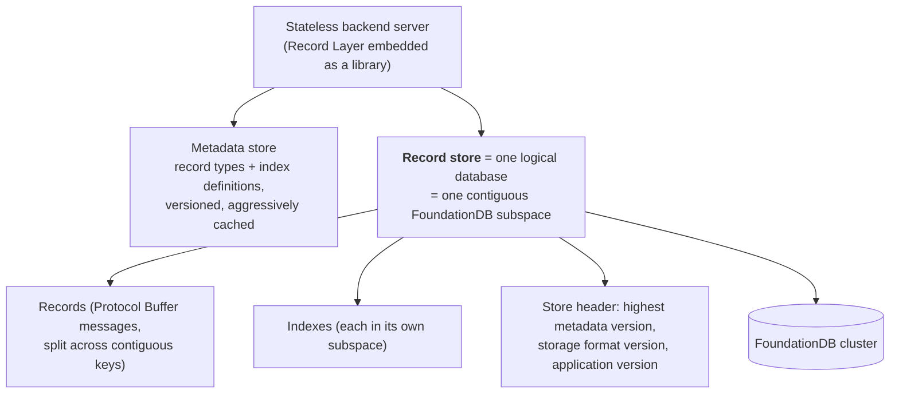

- A **record type** resembles a relational table in defining structure, **but all record types in a
  record store are interleaved within the same extent** — there is no per-table storage separation
  by default.
- **Isolation for multi-tenancy** works on two levels: **resource** (the layer tracks and enforces
  per-transaction resource limits, provides continuations to resume work, and can be coupled with
  external throttling) and **data** (each record store's keys begin with a unique binary prefix
  defining a **non-overlapping subspace**).
- **Key expressions** define primary keys and index keys: a logical path through a record that
  extracts field values and produces a tuple. They **may produce multiple tuples**, letting indexes
  "fan out" over nested and repeated fields. Because all types are interleaved, **queries and
  indexes may span all record types** in a store.
- **Record splitting.** To hide FoundationDB's key/value size limits, large records are split
  across contiguous keys and spliced back on read. A special split **immediately preceding each
  record holds the commit version of its last modification**, returned with the record on every
  read.

### Performance techniques worth noting

- **Record prefetching** — asynchronously preloads records into the FoundationDB client's
  read-your-write cache **without returning them to the application**, saving a context switch and
  deserialization when reading many records.
- **`causal-read-risky`** — makes `getReadVersion` faster at the risk of a slightly stale read
  version during the rare case of cluster reconfiguration (comparable to ZooKeeper's `sync`).
  **Transactions that modify state never return stale data**, because their reads are validated at
  commit.
- **Read version caching** — skip talking to FoundationDB entirely if a read version was fetched
  "recently." The application supplies an acceptable staleness and the last-seen commit version;
  the layer uses a cached version if it is recent enough **and not smaller than what the client
  already observed**. Most useful for **read-only transactions and low-concurrency workloads**;
  otherwise it may raise the abort rate.
- **KeySpace API** — exposes the keyspace as a filesystem-like directory tree; a path compiles into
  a tuple that becomes a row key. It guarantees directories are **logically isolated and
  non-overlapping** and uses the directory layer to shorten names.

## Metadata management and schema evolution

Metadata may live in a separate keyspace or **an entirely separate storage system**, and is
**aggressively cached by clients** so records can be interpreted without extra key-value reads —
enabling **low-overhead, per-request connections** to a database.

**What Protocol Buffers give for free:** new fields can be added and appear uninitialized in old
records; new record types can be added without disturbing old ones. Best practice: **never reuse
field numbers — deprecate rather than remove**.

**Versioning.** Metadata is versioned in a **single-stream, non-branching, monotonically increasing**
fashion. Each record store records the highest version it has been accessed with in a small header
(one key-value pair), read and compared on open:

| Comparison | Meaning |
| --- | --- |
| Versions equal | Typical case — nothing changed |
| Database version **newer** | The client used an **out-of-date cache** |
| Database version **older** | Changes must be applied |

Three version numbers are tracked in the same header:

- **Metadata version** — the application's schema.
- **Storage format version** — how the Record Layer itself encodes data, updated at the same time;
  may require reformatting small amounts of data or enabling a compatibility mode.
- **Application version** — client-owned, for data evolution the metadata does not capture (e.g.
  promoting a nested record type to a top-level type during renormalization). It can also act as a
  **counter tracking progress through a series of changes**, so checks happen at store-open rather
  than scattered through application code.

**Adding indexes.** An index on a *new* record type is enabled immediately. An index on an existing
type may require reindexing, and since all record types share a keyspace, **all records must be
scanned**. If there are few records the index is built in one transaction; otherwise it would
exceed the 5-second limit, so **the index is disabled and reindexing runs as a background job**.

## Index definition and maintenance

Record Layer indexes are durable structures **maintainable in a streaming fashion** — updatable
incrementally from the contents of the changed record alone. **Index maintenance occurs in the
same transaction as the record change**, so indexes are always consistent with the data; this is
only affordable because of FoundationDB's fast multi-key transactions.

- Index scans use FoundationDB's **range reads** over lexicographically ordered keys.
- Each index lives in a **dedicated subspace**, so dropping it is a cheap **range clear**.
- **Index filters** conditionally exclude records from maintenance, producing a **sparse index**
  that saves space and maintenance cost.

**Save path.** Check whether a record with the same primary key exists; if so, index maintainers
remove or update its entries and the old record is deleted **with a range clear** (necessary
because records may be split). Then insert the new record, then insert or update its index
entries. Optimization: **if the old and new records are the same type and an indexed field is
unchanged, that index is not updated**.

**Online index building.** Indexes start in a **write-only** state — maintained by writes but not
usable by queries. The builder scans the store, invoking the index maintainer for each record, then
marks the index **readable**. The build is **split across multiple transactions** to reduce conflicts
with concurrent mutations and stay within transaction size limits.

## Index types

Indexes **may span multiple record types**, provided every field referenced by the key expression
exists in all of them — enabling efficient searches across different record types with common
search criteria.

### VALUE

The default: a standard mapping from index entry (one field or a combination) to record primary
key. Satisfies common predicates like "all primary keys where field ≤ v."

### Atomic mutation indexes

Built on FoundationDB's atomic mutations, used for aggregate statistics. The `SUM` index stores a
field's sum over all records as a **single entry mapping the index subspace path to the value**;
with grouping fields in the key expression, one sum per group.

**Why atomic mutations matter:** a read-modify-write implementation "would not scale, as any two
concurrent record updates would necessarily conflict." Using the `ADD` mutation, updates **never
conflict**.

| Index type | Tracks |
| --- | --- |
| `COUNT` | Number of records |
| `COUNT UPDATES` | Number of times a field has been updated |
| `COUNT NON NULL` | Number of records where a field is not null |
| `SUM` | Summation of a field across all records |
| `MAX EVER` / `MIN EVER` | Max/min value ever assigned to a field since index creation |

**Trade-off:** tiny footprint (one key per grouping key, or one per record store) but **a small
number of hot keys updated on every write**, producing high CPU and I/O on the FoundationDB storage
servers holding them, and **increased read latency for clients reading from those servers**.

### VERSION

Like VALUE, but the key expression may include a special **version** field: a **12-byte value
representing the commit version of the record's last update**, unique and monotonically increasing
with time within a cluster. **The first 10 bytes are assigned by FoundationDB servers at commit;
the last 2 by the Record Layer** from a per-transaction counter — so every record in the cluster has
a unique version.

Because the version is only known at commit, it is **not** part of the record's Protocol Buffer
representation. Instead the layer writes a **primary key → version mapping in the keyspace adjacent
to the records**, so both come back in a single range read.

Version indexes **expose the total ordering of operations within a cluster**: a client can scan a
prefix of a version index and be certain that continuing from the same point will observe all newly
written data — which is exactly how CloudKit implements sync.

### RANK (Appendix B)

Provides access to records **by ordinal rank** and, conversely, the rank of a value. Use cases: a
leaderboard position; a scrollbar that jumps to the *k*-th result without linearly scanning with
continuations.

Implementation: a **probabilistic augmented skip-list persisted in FoundationDB, with each level in
a distinct subspace prefix**. Duplicate keys are avoided by reading each key before insertion. The
lowest level holds every entry; each higher level samples the level below. **Each entry stores the
number of entries greater-or-equal to it and less than the next entry at that level** (always 1 at
the lowest level) — i.e. the number skipped by following the "finger."

Elegant detail: **an explicit finger pointer is unnecessary** — FoundationDB's sort order serves the
same purpose far more efficiently.

- **Value → rank:** standard skip-list search from the top level, accumulating the skipped counts
  whenever a same-level finger is followed; the sum is the rank.
- **Rank → value:** maintain a cumulative sum, range-scanning each level until following a finger
  would exceed the target rank, then descend.

### TEXT (Appendix B)

Full-text queries on string fields: token matching, **token prefix matching, proximity search, and
phrase search**. A pluggable tokenizer produces tokens; the inverted index is logically an ordered
list of maps, one **postings list per token**, keyed by primary key, with values being **lists of
offsets** (token counts from the start of the field).

```text
(prefix, token1, pk1) → offsets1
(prefix, token1, pk2) → offsets2
(prefix, token2, pk3) → offsets3
```

Range-scanning by token prefix yields all matching primary keys; proximity and phrase filters
examine the offset lists.

**Bunching.** The subspace prefix repeats in every key — costly for TEXT indexes given their entry
count — so **neighboring keys are bunched** so one entry covers several primary keys:

```text
(prefix, token1, pk1) → [offsets1, pk2, offsets2]     # bunch size 2
(prefix, token3, pk4) → [offsets4, pk5, offsets5]
```

- **Insert (token t, key pk):** range-scan to find the largest key `L ≤ (prefix,t,pk)` and the
  smallest `R >` it. Place the entry in `L` unless that exceeds the maximum bunch size, in which
  case the bunch's largest primary key is evicted into a new index key — and if `R`'s bunch is
  under-full, it is **merged with the newly created one**.
- **Delete:** descending range scan from `(prefix,t,pk)`; the first key returned is guaranteed to
  hold the data. Delete the entry if `pk` is alone, else remove `pk` and its offsets and, if `pk`
  appeared in the key, rewrite the key with the next primary key in the bunch.
- **Cost:** insert reads two key-value pairs and writes at most two (usually one); delete reads and
  writes one. **This access locality gives index updates predictable latency and resource
  consumption** — the recurring theme of the whole system.

**Measured space saving** (Melville's *Moby Dick* split into 233 ~5 kB documents; whitespace
tokenization; ~431.8 unique tokens per document averaging ~7.8 characters and ~2.1 occurrences;
10-byte prefix, smaller than production):

| | No bunching | Bunch size 20 |
| --- | --- | --- |
| Key size | 22.8 B | 22.8 B |
| Value size | 3 B | 97 B (40 B offsets + 57 B primary keys) |
| Total per entry | 25.8 B | 119.8 B |
| Approx. entries per document | 431.8 | ≈ 21.6 |
| **Total per document** | **11.1 kB** | **2.6 kB** |

In practice the index needed **~4.9 kB per document** because bunches are not all full — the
**average bunch size was ~4.7**, since many words appear rarely (some only once). Further
optimization could bunch **across** tokens. Prefix compression in FoundationDB would help, but
per-key overhead exists in both the index and FoundationDB's internal B-tree, so **fewer keys
remains beneficial regardless**.

## Query planning (Appendix C)

- **Extensible query API:** a fluent Java API specifying record types, Boolean predicates, and a
  sort order given as a key expression. Filters and sorts may include **special functions** —
  aggregates, cardinal rank, and full-text operations like n-gram and phrase search. The API is
  effectively **an AST for a SQL-like language exposed directly in Java**; a higher layer could
  translate SQL into it.
- **Query plans are first-class objects.** The planner converts declarative queries into concrete
  operations (index scans, unions, filters) over record streams, and **exposes the plans through
  its API** so clients can cache or manipulate them — like SQL `PREPARE`, **plus** the ability to
  modify the plan. Plans may carry bound static arguments (SARGs). CloudKit uses this to implement
  its own planning behavior by **combining multiple Record Layer plans and binding one plan's
  output to another's argument**.
- **Cascades-style rule-based planner** (in progress at publication): a tree-structured
  intermediate representation of partially planned queries containing both **logical** expressions
  (e.g. a sort order needed to intersect two indexes) and **physical** ones (index scans, stream
  unions, filters). **Planner rules** match structures in the IR, optionally inspect properties, and
  produce equivalent expressions. Rules are auto-selected but organizable into **phases** (e.g.
  scanning part of an index beats filtering all records) and are **modular** — several behaviors
  emerge from multiple rules acting together.
  - The payoff is **client extensibility**: a client can implement a geospatial index, extend the
    query API with bounding-box functions, and add rules planning geospatial filters as scans of
    that index — reusing all the built-in rules.
- **Future:** the IR currently holds a single expression and is rewritten on each rule application;
  it could be replaced by the **Memo** structure, which groups logically equivalent expressions so
  optimization work is memoized across a huge plan space — **paving the way to a cost-based
  optimizer**.

## Use case: CloudKit

CloudKit is Apple's cloud backend service and application development framework, backing storage,
management, and synchronization across devices plus sharing and collaboration between users.

- An application is a logical **container** with a schema of record types, typed fields, and
  indexes. Clients store records in named **zones** — logical groups selectively synced to devices.
- **CloudKit assigns a unique FoundationDB subspace per user, with a record store per application
  within it** — so it maintains **(# users) × (# applications) logical databases**, numbering in the
  billions.
- Requests from devices are routed and load balanced across a pool of stateless CloudKit Service
  processes.
- CloudKit translates its application schema into Record Layer metadata, adding system fields for
  creation/modification time and the zone. **The zone name prefixes primary keys**, enabling
  efficient per-zone access. CloudKit also maintains **system indexes**, e.g. one tracking total
  record size by record type for **quota management**.

### What changed by moving from Cassandra to the Record Layer

| | Cassandra | Record Layer |
| --- | --- | --- |
| **Transactions** | Within zone | **Within cluster** |
| **Concurrency** | Zone level | **Record level** |
| **Zone size limit** | Cassandra partition size (GBs) | **FoundationDB cluster size** |
| **Index consistency** | Eventual | **Transactional** |
| **Indexes stored** | in Solr | **in FoundationDB** |

The Cassandra implementation serialized all zone updates using **compare-and-set on a dedicated
per-zone update counter**, which had two scalability limits: **no concurrency within a zone even for
disjoint records** (bad for collaborative applications), and **multi-record atomic operations scoped
to a single Cassandra partition**, which is size-limited and degrades as it grows. Application
designers had to carefully model data so that co-updated records shared a zone while keeping zones
small and concurrent updates rare.

Three concrete new capabilities:

**1. Interactive transactions.** Cluster-wide transactions let zones grow far larger and support
concurrent updates to different records in a zone. CloudKit now **exposes interactive transactions
to its clients** — specifically other backend services accessing it over gRPC — simplifying client
applications and enabling many new clients.

**2. Personalized full-text search.** Users expect instant access to emails, messages, and notes;
indexed text and other data are interleaved, so transactional semantics matter. The TEXT-index-based
system **serves millions of users with all updates performed transactionally and no background jobs
for index updates and deletes**. Beyond consistency, it **reduces operational cost by storing
everything in one system**. FoundationDB's key order supports **prefix matching with no additional
overhead** and **n-gram search requiring only n key entries instead of the usual O(n²)** needed to
index all substrings; proximity and phrase search are also supported.

**3. High-concurrency zones.** The per-zone update counter used to drive the "sync" index that
brings a device up to date — and it created conflicts between otherwise non-conflicting
transactions. The Record Layer version instead uses a **VERSION index mapping commit versions to
record identifiers**; a sync is simply a scan of that index.

*The migration problem, and an elegant fix.* Versions from different FoundationDB clusters are
uncorrelated, which breaks sync ordering when a user is **moved between clusters** for load
balancing or locality. CloudKit adds an application-level per-user **incarnation** counter, starting
at 1 and incremented on each move; the current incarnation is written into each record's header on
update and **is not modified during a move**. The sync index maps **(incarnation, version)** pairs to
records, sorting by incarnation first.

Then there was existing data with an update-counter value but no version. Rather than writing
business logic to combine old and new sync indexes, they used a **function key expression**: the
VERSION index maps a *function* of incarnation, version, and update counter — `(incarnation,
version)` for records written the new way and `(0, update counter)` otherwise. This **preserves the
old ordering, sorts all legacy records before new ones, and is transparent to the application and
free of legacy code**.

### Client resource isolation — measured overhead

| Operation | Median FoundationDB keys touched | Overhead |
| --- | --- | --- |
| **Query** (returns all matching records) | ~38.3 keys read, of which **~6.2 are not records or index entries** | **~15%** |
| **Single-record request** | ~13.3 keys read, of which **~7.7 are not record data** | Comparatively expensive — reflecting CloudKit's focus on higher-level services (queries, sync) over individual CRUD |
| **Save** | ~8.5 records and ~34.5 index-associated key writes per transaction | **~4 index writes per record** |

Write overhead is hard to estimate cleanly: it is dominated by index maintenance (depending on how
many indexes the type has), and FoundationDB's commit time has no simple relation to write count —
the client **buffers writes locally until commit**, then ships them with the transaction's conflict
ranges, so **performance depends substantially on the number of conflicts produced rather than the
number of writes**.

**No in-memory query operations** — no hash joins, grouping, aggregation, or sorts. Sorting and
joining must be **assisted by index definitions** (e.g. an index across multiple record types on
common field names enables efficient joins). This burdens the developer but **bounds the memory for
a request to little more than the records it accesses**. The cost is that a query may need
**potentially unbounded I/O** — which is why the layer enforces **limits on records or bytes read per
request**, serializing the operation state into a continuation when a limit is hit. Because the
resulting operations are small, **rate-based throttling works more effectively**, and together these
mechanisms "ensure that all clients make some progress even when the system comes under stress."

## Positioning against related work

- **Traditional relational databases** scale for reads but were not designed for transactional
  workloads on distributed data. Shared-nothing architectures make cross-shard transactions and
  indexes prohibitively expensive and demand careful partitioning; shared-disk architectures are
  harder to scale due to cache coherence and page contention protocols.
- **NoSQL stores** give excellent scalability and minimal semantics, forcing applications to
  reimplement relational features. **NewSQL** systems (Spanner, CockroachDB, Cosmos DB, MemSQL,
  VoltDB) fill the middle. **FoundationDB is unique in the NewSQL space** for providing ACID
  transactions and high scalability **with a plain key-value API and no built-in data model,
  indexing, or queries** — a choice that let it build a stable, performant engine without attempting
  a one-size-fits-all solution.
- Like **Google Percolator**, the Record Layer is **completely stateless**, keeping all metadata in
  the underlying store.
- **Salesforce's Force.com architecture** is similarly multi-tenancy-driven — data and metadata
  sharded by application, query optimization using per-application and per-user statistics. The
  Record Layer goes further via **built-in resource tracking and isolation, a fully stateless
  design, and the record store abstraction**. CloudKit faces a **dual multi-tenancy challenge**:
  many applications, each with a huge user base — solved by making each record store hold one user's
  data for one application, so scaling means **adding clusters and moving record stores**.
- **Full-text search** in most systems lives in a separate system (Solr) with eventual consistency;
  CloudKit's experience is that a separate system must be **separately provisioned, maintained, and
  made highly available in concert with the database** (e.g. coordinated failover decisions).
  MongoDB has built-in text search but its indexes are not guaranteed consistent, so **queries might
  not return all matching documents**.

## Lessons learned

### Building FoundationDB layers

- **Asynchronous processing to hide latency.** FoundationDB optimizes throughput, not individual
  operation latency, so effective use means **keeping as much work outstanding as possible**. But
  the FoundationDB client is single-threaded with one network thread; earlier Java bindings
  completed futures **in the network thread**, which the Record Layer used for its async work —
  creating a bottleneck. **Minimizing work in the network thread** gave substantially better
  performance and lower apparent latency on complex operations.
- **Conflict ranges are powerful and dangerous.** The API gives full control over read- and
  write-conflict sets. A useful pattern: do a **non-conflicting snapshot read of a range** that may
  contain distinguished keys, then **add individual conflicts only for those**, so the transaction
  depends only on what would actually invalidate its results (used for the RANK index's skip-list
  navigation). But **bugs from incorrect manual conflict ranges are very hard to find, especially
  mixed with business logic** — so **layers should encapsulate such patterns in abstractions like
  indexes rather than let applications relax isolation directly**.

### Using the Record Layer in practice

- **Do not build metadata from Protocol Buffer descriptors in code** (except in simple tests).
  Descriptors are tempting but **cannot be updated atomically across multiple Record Layer
  instances**: if a newer instance writes records with a newer descriptor and an older instance
  reads them, you need an authoritative metadata store (or inter-instance communication) to
  interpret the data. It also makes **checking schema evolution constraints harder**. Their practice
  is to use descriptors to *generate* metadata that is then persisted in the metadata store.
- **Relational similarity can surprise clients.** There is a **single extent for all record types**
  because CloudKit has untyped foreign-key references with no table association — so by default
  selecting all records of a type requires a full scan skipping other types, or a secondary index.
  For clients with a SQL-like table model, they added support for **emulating separate extents by
  adding a type-specific prefix to the primary key**.

### Designing for multi-tenancy

**Multi-tenancy is remarkably difficult to add to an existing system**, so the Record Layer was
built for it from the ground up — yielding easier shard rebalancing between clusters and elastic
scaling. The broader claim:

> "Multi-tenancy is more pervasive than one would initially think… many applications that do not
> explicitly host many different applications can reap the benefits of a multi-tenant architecture
> by partitioning data according to logical 'tenants' such as users, application functions, or some
> other entity."

## Limitations and future directions

- **No in-memory query operations.** No hash joins, grouping, aggregation, or general sorting;
  everything must be index-assisted. Some operations are possible within the streaming model — a
  priority-queue sort with a small limit, a limited-size hash join — but full in-memory operations
  with **spill to persistent storage** would require new resource tracking and, critically, would
  have to be **stateful for the query's duration**, breaking the statelessness principle.
- **No cost-based optimizer** at publication; the Cascades-style planner and Memo structure are in
  progress.
- **Hotspots.** As concurrent access to a record store grows, **checking the store header to confirm
  the metadata version may create a hot key**. General remedy: replicate data at different keyspace
  points so copies land on different storage nodes; for metadata specifically, cache it — but then
  caches must be **invalidated, detected as stale, or tolerated**.
- **Atomic mutation indexes concentrate write traffic** on very few keys, loading the storage servers
  that hold them and raising read latency for their other clients.
- **Bunched TEXT indexes are not compacted on delete** — clients must request compaction, and the
  measured average bunch size (4.7 vs. a maximum of 20) shows real space left on the table.
- **No materialized views.** Aggregating across multiple records at once would benefit join queries
  and would help the planner reason about index applicability.
- **Metadata caching correctness is on the client.** The version check catches staleness, but the
  cache itself is the client's responsibility.
- **No SQL.** A SQL layer is envisioned as a *further* layer on top, once the planner supports
  joins.

## Practical design checklist

The Record Layer's approach fits when:

- you have **many logically independent databases** (per user, per application, per feature) rather
  than one large one;
- you want relational features — schema, secondary indexes, declarative queries — **transactionally
  consistent with the data**;
- workloads are **transaction processing**, with queries answerable from indexes over record streams;
- you need to **move tenants between clusters** for load balancing or locality;
- you can accept the underlying store's transaction time and size limits and work through
  continuations.

Look elsewhere when:

- you need OLAP-style analytics with joins, grouping, and sorts that cannot be index-assisted;
- a single logical database dominates and multi-tenancy buys nothing;
- you require SQL compatibility today;
- your workload concentrates writes on a few aggregate keys that atomic-mutation indexes would turn
  into hotspots.

## Takeaways

1. **A contiguous key range is a tenant boundary.** Because everything needed to interpret and
   operate a record store — records, indexes, operational state — lives in its subspace, **moving a
   tenant is copying a key range**.
2. **Statelessness makes scale-out an operational non-event.** Continuations move cursor state to
   the client, so routing only has to consider **where data lives, not which server can serve it**,
   and a failed server can just be restarted.
3. **Choose semantics you can implement over streams.** Refusing to sort without an index is a
   restriction that buys **bounded memory per request** and predictable behavior under concurrency.
4. **Conflict-free primitives beat clever locking.** Atomic mutations turn aggregate indexes from a
   guaranteed conflict point into a non-conflicting write — at the cost of a hotspot.
5. **Expose the storage engine's ordering as a feature.** FoundationDB's key order gives the skip-list
   its fingers for free, gives TEXT indexes prefix matching for free, and gives VERSION indexes a
   total order that becomes a sync log.
6. **Version everything, in one header.** Metadata version, storage format version, and application
   version in a single key-value pair make schema evolution a check at store-open rather than logic
   scattered through the application.
7. **Function key expressions are a migration tool.** Encoding "old scheme or new scheme" as a
   function of record fields let CloudKit migrate its sync index with no legacy code and no
   application-visible change.
8. **Extensibility is what makes a general layer usable by a demanding client.** CloudKit needed
   custom index types, custom planner behavior, and custom schema management — and got all of them
   through published extension points rather than forks.
9. **Layering works.** The Record Layer validates FoundationDB's bet that a minimal, brutally
   well-tested storage engine plus client-side layers beats a monolith — "systems architects can
   choose the parts of the database that they need without working around abstractions that they do
   not."

## Citation

```bibtex
@inproceedings{chrysafis2019recordlayer,
  author = {Christos Chrysafis and Ben Collins and Scott Dugas and Jay Dunkelberger and
            Moussa Ehsan and Scott Gray and Alec Grieser and Ori Herrnstadt and Kfir Lev-Ari and
            Tao Lin and Mike McMahon and Nicholas Schiefer and Alexander Shraer},
  title = {{FoundationDB} Record Layer: A Multi-Tenant Structured Datastore},
  booktitle = {Proceedings of the 2019 International Conference on Management of Data
               (SIGMOD '19)},
  pages = {1787--1802},
  year = {2019},
  doi = {10.1145/3299869.3314039}
}
```

---

## Paper: Kora: A Cloud-Native Event Streaming Platform for Kafka

# Kora: A Cloud-Native Event Streaming Platform for Kafka

> VLDB 2023 — structured reading notes

Full paper content: [Markdown conversion](../original/kora-vldb-2023.md)

## Paper information

- **Authors:** Anna Povzner, Prince Mahajan, Jason Gustafson, Jun Rao, Ismael Juma, Feng Min,
  Shriram Sridharan, Nikhil Bhatia, Gopi Attaluri, Adithya Chandra, Stanislav Kozlovski, Rajini
  Sivaram, Lucas Bradstreet, Bob Barrett, Dhruvil Shah, David Jacot, David Arthur, Manveer
  Chawla, Ron Dagostino, Colin McCabe, Manikumar Reddy Obili, Kowshik Prakasam, Jose Garcia
  Sancio, Vikas Singh, Alok Nikhil, Kamal Gupta
- **Affiliation:** Confluent Inc.
- **Venue:** Proceedings of the VLDB Endowment, Volume 16, Number 12, 2023, pages 3822–3834
- **DOI:** [10.14778/3611540.3611567](https://doi.org/10.14778/3611540.3611567)
- **Scale at publication:** tens of thousands of clusters across AWS, GCP, and Azure in **73
  regions**, grown over six years

## One-sentence summary

Kora is Confluent Cloud's rebuild of Kafka for the cloud: **tiered storage** to decouple compute
from data volume, **KRaft metadata** to stabilize the controller, **CKU and cluster-load
abstractions** so users never reason about instance types, **cell-based multi-tenancy with dynamic
quotas** for isolation at thousands of tenants per cluster, and **automated degradation detection**
plus **continuous durability audits** to survive heterogeneous, frequently-misbehaving cloud
infrastructure.

## Problem

Kafka was built before cloud systems dominated, and its architecture assumes a much more static
environment. Concretely: a **single-tiered storage layer** made the system slow to adapt to
workload changes, because rebalancing load required **massive data movement**.

The challenge Confluent faced: **provide a highly available service with consistent performance at
low cost across three clouds with heterogeneous infrastructure.**

- "Consistent performance" spans latency and throughput, and depends on user workload requirements
  and scale that Confluent does not control.
- "Heterogeneous infrastructure" means **different categories and frequencies of failures**, all of
  which must be handled robustly.

The paper is explicit that Kora "is not based on a single key idea" but synthesizes well-known
techniques with lessons from operating at scale.

### Background terminology

Events are organized into **topics**, partitioned for throughput. A **topic partition** is a
persistent, replicated log; each copy is a **replica**. Each **record** gets a unique **offset**,
incremented after every write. **Producers** write to the end of the log; **consumers** read from
any offset and record their last processed offset **in a separate internal topic** so they can
resume after failure. **Consumer groups** distribute partitions for parallel processing. Kafka
relies on **file system caches** and is optimized for consumers reading at the end of the log — the
most common access pattern.

**End-to-end latency** is measured as elapsed time from event creation by a producer to delivery to
the consumer.

## Design goals

| Goal | Concrete commitment |
| --- | --- |
| **Availability and durability** | Uptime SLA **99.95% single-zone, 99.99% multi-zone**; "lapses in durability or availability lead to direct revenue loss and are completely unacceptable" |
| **Scalability** | Customers need confidence the backend will keep scaling, because changing infrastructure backends is risky and expensive |
| **Elasticity** | Clusters expand and shrink with workload; Kora also **adapts to changing workload patterns within a given cluster size** |
| **Performance** | Low latency at high throughput, with **all performance wins passed directly to users** — applications may simply get faster over time |
| **Low cost** | Design consistently leans toward better **price-performance ratio** |
| **Multi-tenancy** | The key enabler of low price and elastic pay-as-you-go |
| **Multi-cloud** | Unified experience across AWS, GCP, Azure while minimizing operational burden from their differences |

## Architecture

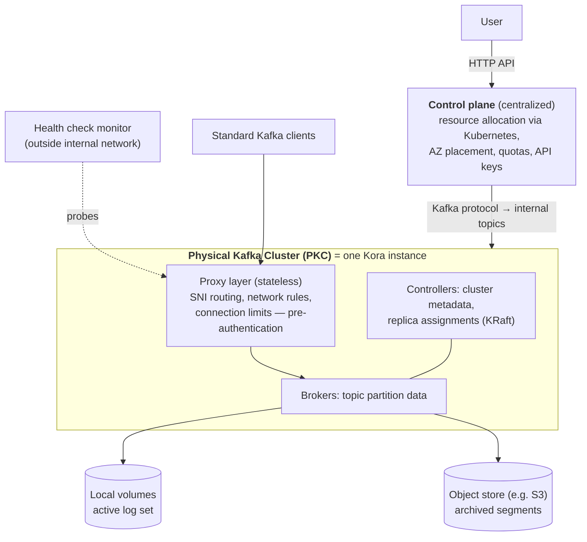

- The user-visible unit of provisioning is a **Logical Kafka Cluster (LKC)**. A PKC may host one or
  more LKCs: applications with strict isolation requirements get a **dedicated PKC**; others take
  the cost savings of multi-tenancy. **The LKC provides namespace isolation, and client APIs are
  unchanged either way.**
- The **proxy layer is stateless and scales separately from brokers**, routing via **SNI**. It
  avoids bottlenecks such as **port exhaustion** on large clusters and enforces network access rules
  and connection limits **before** authentication reaches the broker.
- Every component exposes telemetry. The **health check monitor sits outside the internal network**
  — critical for catching issues in the network stack (DNS resolution, anything in the proxy layer)
  that the controller would never see.

### Two departures from ten years of Kafka architecture

**1. Metadata moved from ZooKeeper into an internal topic (KRaft).**

The traditional controller managed cluster-wide metadata, tracked broker liveness via heartbeats,
and elected partition leaders. Its centralized view is ideal for balancing load — but historically
it could only balance **replica and leader counts**, with **no insight into per-topic ingress/egress
load**, so overall load could become extremely skewed. Kora adds a controller component that models
cluster load from **broker-reported telemetry**.

The controller was also **co-located with brokers**, any of which could win a ZooKeeper-facilitated
election. Two problems on large clusters: the controller's work is substantial (electing leaders
for thousands of partitions after a broker failure caused **noticeable performance degradation** on
that broker), and **rolling a cluster for an upgrade forced repeated controller changes** whose
expensive ZooKeeper loads destabilized the cluster.

**KRaft** stores metadata in an internal topic partition replicated by a **Raft-based consensus
protocol**; the controller is the leader of that partition and **replicas follow the log and build
metadata state so they can take over leadership immediately** after a failure. The controller also
became **a separate process** from the broker, so resources can be allocated and its workload
isolated independently — packed onto broker instances for small clusters to save cost, on a
dedicated instance for large ones. Crucially, **all broker processes can now be rolled while the
controller stays stable**.

**2. Storage became two tiers.**

Traditionally every replica held a complete copy of the log on local volumes with broker affinity.
For a cloud service this creates two problems:

- **Cost vs. performance.** Better performance needs more expensive disk types, but their cost is
  **proportional to volume size**, so it becomes prohibitive as data grows.
- **Predictable performance.** Rebalancing replica assignments requires **copying the full log** to
  the new replicas. More data means slower reaction — and **a higher risk that the workload changes
  again before the reassignment finishes**. Copying also **steals system resources from the user
  workload**.

Kora's tiered storage writes new data to local disks replicated by Kafka's own protocol as before —
most consumers read from this tier as soon as data is written — and **migrates aged data to a much
cheaper object store**, after which it is removed from each replica. Consequences:

- Local volumes shrink to the **active set**, allowing better-performing disk types.
- **Rebalancing only moves the small active set** — the key enabler of fast expansion.
- **No practical limit on retention** per partition; the old architecture was capped by the maximum
  single local volume size, now only by the object store.

The cost is complexity: metadata about archived segments is maintained in **another internal
topic**. As segments upload, their metadata is published there; **each replica watches the topic**
to know when local data can be removed and to build a reference table for serving reads. A consumer
requesting data outside the local volume causes the replica to load the segment from the object
store.

## Cloud-native building blocks

### Abstractions: CKU and cluster load

Abstractions matter because users should not reason about memory, CPU type, network bandwidth, or
IOPS. Expressing the contract in high-level constructs (**ingress and egress bandwidth**) frees
users **and simultaneously frees Confluent to change instance types and storage classes** whenever
it improves price or performance.

**Confluent Kafka Unit (CKU)** — the minimum cluster size that can be provisioned and the minimum
unit of expansion or shrink. Clusters with equivalent CKUs **perform comparably for the same
workload across all three clouds**. A CKU specifies maximum ingress and egress bandwidth, request
rate, and connection count and rate.

The catch: a CKU exposes the maximum on *each* dimension to avoid artificially limiting workloads,
but **hitting the maximum on one dimension usually requires using less of the others** (full
bandwidth requires good batching, fewer requests, fewer connections). So **a cluster can run out of
capacity before hitting any CKU limit.**

**Cluster load** fills that gap: the utilization of the backing physical cluster, approximated as
**the utilization of the most loaded broker**. This is a good approximation because well-balanced
clusters have similar per-broker utilization, while for imbalanced clusters **workloads experience
the most loaded broker in their p99 latency**. Utilization uses the traditional definition — the
proportion of time a server is busy — whose advantage is that **utilization grows linearly with
load while latency grows exponentially near saturation**, so users can reason about it.

Together, CKU gives a first-order estimate of needed cluster size and expected performance and cost
**without running any benchmarks**, and cluster load signals when to expand. An auto-scaling
framework driven by cluster load was in development.

### Measuring broker load: queueing theory instead of resource counters

The challenge: **direct use of CPU, IOPS/disk-throughput, or network bandwidth falls short when the
workload stresses a different dimension**, and directly measuring server load requires accurately
measuring request service time while excluding time in internal disk queues and other resources
Confluent does not control.

The solution uses queueing theory: **under heavy load, latency grows exponentially with
utilization**, and **queueing delay is a more robust signal that a workload needs more resources
than utilization of any specific resource**. But latency itself is hard for users to reason about
precisely because of that exponential relationship — hence the conversion back to utilization.

Concretely, the broker is modeled as a **single-server queueing system with arbitrary inter-arrival
and service time distributions (G/G/1)**, where a job is a network request or a connection creation
request, and the wait time *W* is time spent in broker or infrastructure queues **excluding waiting
for replication or for clients to send responses**.

- **High load:** **Kingman's approximation** of wait time under heavy load yields utilization.
  `E[W]` is computed as an **exponentially decaying 1-minute moving average** of measured *W*, using
  the Unix load-average approach; the formula's coefficients were **found empirically via
  benchmarks covering a range of workloads**.
- **Low utilization:** approximated by the utilization of the broker's **network and request
  threads**.

Validation: on a CPU-intensive workload with load increased by adding partitions, **broker load
tracks CPU usage** while **latency increases far more dramatically as the cluster overloads** —
demonstrating why latency is inappropriate as a direct load measure. Similar predictable trends
were observed for IO- and network-intensive workloads.

### Cluster organization for cost efficiency

Two design choices give freedom to change hardware without affecting users:

1. **High-level service constructs** (CKU) mean hardware can change without violating performance
   contracts. Contrast with **Bring-Your-Own-Account** models, which "punt the complexity of
   hardware selection and its associated tradeoffs to the users."
2. **Decoupled persistent block storage rather than ephemeral instance storage**, so VM instance
   type and block volume can be chosen **independently** while retaining strong durability.

**Core Kafka costs** — significant overall, dominant for low-throughput dedicated clusters. The
difficulty is **hardware heterogeneity within and across clouds**: one provider may support much
higher base IOPS; another may not scale IOPS/throughput independently of capacity; within one
provider, one volume type has fixed throughput/IOPS with bursting while another is fully
configurable; the same VM class may include **different architecture generations that perform
variably**; and newer architectures such as ARM may lack capacity in many regions. Pricing and
availability also **evolve continuously**.

Their evaluation process: establish **baseline resource lower bounds** (storage and network
bandwidth needed for target ingress/egress) to rule out most instance and volume types, run a
**set of performance tests**, then **staged fleet-wide rollout** if promising.

Two worked examples of how much tuning this takes:

- **GP2 → GP3 volumes on AWS.** GP2 provides 256 MB/s throughput and 750 IOPS (burstable to 3000);
  GP3 starts at 125 MB/s and 3000 IOPS and is cheaper. To get better performance from GP3 they
  **had to change how data is flushed to disk to avoid a large backlog of page-cache changes** —
  requiring "extensive probing and analysis using a diverse range of workloads and low-level kernel
  knobs."
- **Memory-optimized → CPU-optimized instances with half the memory**, after extensive analysis.

> "Changes like these yield significant cost savings while still improving fleet-wide performance
> but are very hard to do right. This is the key value proposition of using a cloud-native
> platform."

**Result:** continuous right-sizing improved **fleet-wide P99 latency by a factor of 3** over a few
months.

**Network costs.** The largest is **cross-AZ replication** in multi-AZ clusters, especially for
throughput-dominated workloads. Kora offers a **single-AZ option** for weaker guarantees, and a
**fetch-from-follower** model so client fetches can be served by a same-AZ follower replica if one
is available and sufficiently caught up.

**Microservice costs.** Observability, auditing, and billing services are **bin-packed alongside
Kafka brokers, reserving ~80% of VM resources for the broker**. This works because **storage and
network are typically the bottleneck in an IO-intensive system**. Some workloads are limited by
this, but the alternative — dedicated VMs for non-Kafka components — "would force the customers to
pay the cost for these additional nodes *all* the time whether or not their use cases benefit."

### Elasticity

Kafka is stateful: a specific request must be served by the broker holding the state. Tiered storage
helps immensely, but replicas still must move on expansion, shrink, or load change.

**Load balancing.** Managed by **Self-Balancing Clusters (SBC)**, a component inside the Kafka
Controller based on **Cruise Control**. It collects per-broker metrics, builds an internal cluster
model, and reassigns replicas by heuristics against a **prioritized list of goals** — each goal
proposes replica movements that **must be blessed by all higher-priority goals**, so higher-priority
goals are more likely to be satisfied. Cruise Control distinguishes **triggering goals** (which
start a rebalance round) from **balancing goals** (best-effort), so critical metrics like **disk
usage and network imbalance must be classified as triggering goals**.

Balancing uses a **blend of metrics** — ingress bytes, egress bytes, disk usage, and broker load.
The central tension: **a reassignment is disruptive to clients**, since it changes metadata and
forces clients to refresh and reconnect. "Too frequent balancing can be disruptive to clients and
induce wasted work whereas too infrequent balancing can leave the brokers imbalanced leading to
degraded performance."

Two practical difficulties:

- **Attributing broker load to replicas** (the unit of reassignment) is hard. Solution: distribute a
  broker's overall resource usage across its replicas by a **weighted combination of representative
  metrics** — ingress bandwidth, egress bandwidth, request rate.
- **Large clusters can have hundreds of thousands of replicas.** To scale, Kora **abstains from
  collecting replica-level metrics**, falling back to topic- or broker-level collection with
  heuristic attribution.

Production result: a previously large **latency skew converges rapidly to balance across nodes**,
with immediate improvement in the health check's latency outliers.

**Shrink and expand.** The customer initiates a scale-up in the UI, aided by real-time usage
information; new VMs are provisioned; **SBC is notified and automatically begins reassigning
replicas**, declaring completion when every new broker has a fair share of load.

**Speed matters asymmetrically:** shrinking usually happens under low pressure, but **expansion must
complete before the system becomes overloaded, while taking minimal resources from the user
workload**. Tiered storage is what makes this possible by shrinking the data to move. Additionally,
**SBC chooses replicas by their contribution to overall load, which follows a power law
distribution** — a minority of replicas cause the majority of load — so from the user's perspective
expansion completes as soon as the new replicas handle a fair share.

### Observability

**Client-centric end-to-end metrics.** Server-side metrics **omit the load balancer and proxy hops**,
so overload in those services or network connectivity issues would be **completely invisible**. The
**health check agent** sits outside the internal network and continuously probes brokers with
produce and consume requests **traversing the same path as client requests**. It **embeds a
producer and consumer so it measures end-to-end latency exactly as a user would**. Its latency and
success rate feed dashboards, alerting, automated mitigation, and SLO computation.

**Fleet-wide SLO.** Individual clusters are too noisy because workloads vary enormously, so
fleet-wide metrics abstract the whole fleet into a few numbers (latency, availability) to observe
trends and prioritize work. The methodology:

1. The HC agent sends **100 produce and 100 consume probes every minute per broker**, using
   **special internal partitions whose leadership and assignment are sticky to each broker** so the
   measurement genuinely reflects that broker.
2. Compute **p99 end-to-end latency for that minute for that broker** over successful probes.
3. Take **the worst end-to-end latency across all brokers** as the cluster's metric for that minute.
4. The **weekly latency SLO for a cluster** is the p99 over all that week's data points.
5. The **fleet-wide latency SLO** is the median, p90, and p99 of the weekly SLOs across all
   clusters.

Tracking this principled aggregate identified the most widespread issues and **improved fleet-wide
SLOs by several multiples over a year**. Availability follows the analogous methodology.

### Automated mitigation

Upholding a 99.99% SLA is hard when cloud providers do not offer the same guarantees — **"a majority
of our availability lapses have been caused by malfunctioning cloud infrastructure."** Two
categories:

- **Outright unavailability** of network or storage infrastructure.
- **Severely degraded infrastructure** persisting for days, contributing to high latency.

Why degradation is so damaging in Kafka specifically: **in-sync replicas (ISR)** are the replicas
actively replicating a partition, and produce requests are usually configured to wait for **all**
of them. **Latency is therefore determined by the slowest broker in the ISR** — and since client
requests batch data for many partitions, **one slow broker out of a large set degrades latency
across every partition in the batch**. Confluent has "frequently seen cases where the underlying
cloud SSD volume begins to exhibit chronically high latency for days unless a mitigating action to
replace it is taken."

The generic solution is a feedback loop with a **degradation detector** that collects cluster
metrics, decides whether a component is malfunctioning, and marks it with a **distinct broker health
state**, each with its own mitigation:

| Detected condition | Detection | Mitigation |
| --- | --- | --- |
| **Lost external network connectivity** | A **network health manager thread** per broker monitors both health-check probes and external client traffic; if **neither** arrives for an extended period, the broker has lost external connectivity | **Broker demotion** — the controller moves all partition leadership off the broker. Fast and effective because it **requires no data movement**, and Kafka serves traffic from the leader |
| **Storage not progressing** | A **storage health manager thread** monitors storage operation progress | **Restart the broker** — which naturally migrates leadership via the Kafka protocol and **fences the broker**, since it cannot rejoin the ISR until its storage issue resolves |
| **Performance degradation relative to peers** | Comparison against the cluster's global state | **Move the broker out of the ISR** for its partitions while **letting it continue replicating** — migrating leadership away and removing it from the request critical path so its latency cannot hurt clients |

As a fail-safe, if automatic mitigation fails the system **notifies a human operator**, with tooling
built to assist.

**Results:** analysis of several zonal outages involving storage unavailability confirmed automated
mitigation worked as designed and minimized unavailability. Over a **30-day interval, degradation
detection identified and automatically handled 12 cases of transient hardware degradation across 3
major cloud providers**. These improvements enabled raising the **multi-zone uptime SLA from 99.95%
to 99.99%**.

### Ensuring data durability

Replication, scrubbing, and a high-durability object store "fall short of fulfilling the guarantee
users demand: that their data will be safe despite regional outages, cloud-provider outages,
software bugs, disk corruption, memory corruption, misconfigurations, and even operator errors."
At Confluent's scale, **these issues are observed on a regular cadence**. Real incidents from test
and production:

| Incident | Description |
| --- | --- |
| **Storage corruption** | Corruption at the leader caused it to **trim the prefix of its log**, forcing followers to trim too — **data loss despite replication working correctly** |
| **Metadata divergence** | Divergence in tiered storage metadata between leaders and followers, triggered by a failure to persist an update to storage |
| **Configuration update bug** | A bug applying Kafka's dynamic configuration caused **spurious changes in retention time** for some topics |
| **Race condition updating `log-start-offset`** | `log-start-offset` tracks the start of the non-garbage-collected log; a race in updating it caused Kafka to **prematurely delete records** |

(Notably this list excludes operator errors where customers deleted their own data.)

Three protections:

**1. Cluster Linking (global replication).** Replicates **all data and all metadata** between two
independent Kafka clusters — different regions, different continents, or different cloud providers.
Because metadata is replicated too, **failover is just pointing clients at the new endpoint**: API
keys, offsets, and partition states are preserved, so consumers continue from their last committed
offset. The enabler is **reusing the native Kafka replication protocol**, which works for metadata
too since so much metadata is already stored as internal topics.

**2. Backup and restore.** Keeps a backup of all tiered data and metadata for a configurable number
of days, so accidental deletion can be recovered. Two honest limits: **the only knob exposed to
users is retention time, so users can only delete a prefix of the log**, and **only a prefix can be
recovered** — a lost suffix including non-tiered log cannot be recovered yet, because non-tiered
metadata state is more complex.

**3. Durability audits.** Every operation changing consistency-related metadata state (e.g.
`log-start-offset`) is logged as an **audit event** into a **durability audit database**. A batch
job — typically daily — validates all collected events for consistency; for example, checking that
`log-start-offset` increments **align with the user's retention policy of X days**, alerting if the
increment is larger.

The reasoning behind this design is worth quoting:

> "The Kafka broker is fairly complex and is constantly being evolved… In contrast, the audit
> engine is a very simple state machine that runs through a set of relatively static rules and
> policies. We use the static and robust audit state machine to catch invariant and policy
> violations in the Kafka code."

Because Kafka replicates data, **a timely alert can often save the data** — by demoting a corrupt
leader, letting a follower take over, or manually resetting the corrupted broker's state. Auditing
has caught critical bugs in staging and durability lapses in production before damage occurred.

### Upgrades

Before investment here, **upgrades were a major source of customer escalations** due to high latency
and transient unavailability. The process, driven by a **platform manager**:

- **Roll brokers in zonal order** — brokers from two different AZs are **never** rolled together,
  since partitions with replicas on both would go unavailable.
- **Within a zone, multiple brokers may roll together**, because placement guarantees **no partition
  has multiple replicas in the same AZ**. Capacity still limits the parallelism: **one at a time for
  small clusters, a few in parallel for large ones**, bounding end-to-end roll time when the cluster
  is under elevated load.
- **Heavy instrumentation confirms each rolled broker is fully online and functional from a
  replication perspective before proceeding**, so the desired number of offline brokers is never
  compromised.
- Because **risk of unavailability grows with upgrade duration**, substantial effort went into
  optimizing bottlenecks in the broker restart path — notably **log recovery**.

The payoff: frequent fleet upgrades enabling faster innovation and rapid patching of security
vulnerabilities and performance regressions — in contrast to self-hosted Kafka users who **run the
same version for months or years** because upgrading is so disruptive.

## Multi-tenancy

Multi-tenancy is what makes pay-as-you-go economical: **spare capacity for demand spikes is
affordable because its cost amortizes across many tenants**.

### The LKC as the unit of isolation

Each LKC is bounded by limits on partition count, ingress/egress bandwidth, CPU usage, and
connection rate; the underlying PKC also has **aggregate limits to prevent resource exhaustion**.

The elegance of the abstraction: **"a dedicated cluster is a multi-tenant cluster with just one
tenant"** — unifying both products in one user experience. It also isolates **internal** services:
the health check agent runs in its own LKC to bound its resource use and isolate its state, and
Kafka's own internal state (such as consumer offset storage) is protected the same way.

**Data isolation** comes from authentication (API keys), authorization, and encryption.
**Namespace isolation is not native to Kafka**, so Kora annotates every cluster resource — topics,
consumer groups, ACLs — with a **logical cluster ID**. To keep this transparent, **a broker
interceptor dynamically annotates requests** with the logical cluster ID associated with the
connection at authentication time. From the client's perspective topics are named exactly as in any
Kafka cluster, and the interceptor guarantees each request can only touch that tenant's resources.

### Performance isolation

Kora's multi-tenant clusters host **thousands of tenants**, any of which can spike transiently or
scale up permanently at any moment. Isolation comes from **tenant-level quotas** on ingress and
egress bandwidth, CPU usage, connection count and attempt rate, workload behaviors affecting memory,
and **partition creation/deletion rate** (to avoid overloading the controller). **CPU usage is
approximated as the time the broker spends processing that tenant's requests.**

A tenant's quota is **distributed among the brokers hosting it, each enforcing its portion
independently** — e.g. a 100 MB/s tenant quota split across brokers 1, 2, and 3. Two problems must
then be solved: **oversubscribed tenants can overload brokers**, and **workloads shift usage between
brokers over time**.

**Back pressure and auto-tuning.** Multi-tenant clusters are deliberately oversubscribed because
most tenants use far less than their maximum. When aggregate demand on a broker exceeds capacity,
**safe broker-wide limits** (ingress, egress, CPU, connection rate) trigger backpressure on requests
or connections **for all tenants**. This state is temporary — high broker usage normally triggers a
rebalance, or, when the whole cluster nears capacity, a cluster expansion.

Backpressure is implemented by **auto-tuning tenant quotas on the broker** so that combined usage
stays below the broker-wide limit, tuning **proportionally to each tenant's total quota allocation
on that broker** — which gives fair sharing during overload **and reuses the existing quota
enforcement mechanism**.

Broker-wide limits come from benchmarking brokers across clouds. **CPU is the exception**: there is
no easy way to measure and attribute CPU usage per tenant, so the quota is defined as **clock time
spent processing requests and connections**, the safe limit is variable, and **request backpressure
triggers when request queues reach a threshold**.

**Dynamic quota management.** The original approach **statically divided the tenant quota evenly
across brokers**, which worked on lightly subscribed clusters but degraded as clusters scaled —
especially for **imbalanced workloads with hot partitions that shift over time**, where each
broker's small share caused **excessive throttling even while overall cluster usage was below the
tenant quota**.

Kora replaced this with a **shared quota service**: brokers periodically publish **per-tenant and
per-broker bandwidth consumption plus throttling information** to a **quota coordinator**, which
aggregates, recalculates the quota for each broker-tenant pair, and distributes it at configurable
intervals. The result is still subject to the broker's auto-tuning, which may adjust downward.
**Multiple quota coordinators** are deployed, with each quota entity mapped to one by
**deterministic hashing**.

The drawback is **sensitivity to workload fluctuation**: rapidly varying partition throughput can
cause **frequent brief throttling events that degrade tail latency**. The mitigation is **lazy
throttling** — postponing the throttling decision until the tenant's **cluster-wide** usage exceeds
a threshold relative to its quota.

**Result:** switching from static to dynamic quota distribution raised the fraction of tenants
meeting the **99.95% bandwidth SLO (≤ 5 minutes of total throttled time per week) from 99% to over
99.9%**.

### Cells: isolation at scale

Kafka spreads a topic's replicas across **all** brokers to maximize topic throughput. With thousands
of small tenants sharing a cluster, this collocates most tenants on **every** broker, causing:

1. a **huge blast radius during failures**;
2. **manageability problems**, since failures are more common during cluster upgrades;
3. **less efficient resource use** — spreading tenants thinly means more connections and requests.

The fix: restrict each tenant to a **cell**, a subset of brokers **evenly distributed across
availability zones**. A tenant's topic partitions are distributed across the brokers of **its** cell
only. **Cell size is chosen so a cell can support the maximum bandwidth and other requirements of a
single logical cluster.**

- **Growth:** when a cell nears capacity, some tenants move to a less loaded cell; if none exists,
  the cluster expands to create a new cell. Cell load is the **maximum of average broker load,
  replica count utilization, and bandwidth utilization** across the cell's brokers.
- **Placement:** a new tenant is placed by **choosing two cells at random and assigning to the less
  loaded one** — the classic "power of two choices" result. Since tenant load is unknown at creation,
  this **favors low-load cells while avoiding the hotspot of always picking the single least-loaded
  cell**.
- **Operational payoff:** cells are **smaller, so cheaper to provision and benchmark continuously**,
  where clusters with thousands of tenants are not. And because **inter-broker replication traffic
  stays within a cell**, the system **scales almost linearly as cells and tenants are added**.

**Measured efficiency gain:** a 24-broker cluster with 6-broker cells, 4 tenants each with 2 topics
of 24 partitions and 2 topics of 240 partitions, one producer per topic generating 50k messages/sec
and one consumer. Without cells each broker would host at least one partition from every tenant and
clients would connect to every broker; with cells they connect only to their cell. **Cluster load
was 53% with cells versus 73% without.**

## Limitations and questions

- **No head-to-head comparison.** The paper reports production data and internal before/after
  improvements, but never compares Kora against another cloud Kafka service or self-hosted Kafka on
  a common benchmark.
- **Relative, not absolute, numbers.** "P99 improved 3×", "SLOs improved several multiples",
  "cluster load 53% vs 73%" — the baselines are internal and undisclosed.
- **Backup can only recover a prefix.** A lost suffix including non-tiered log data is
  unrecoverable, acknowledged as future work because non-tiered metadata state is harder to
  recover.
- **Durability audits are periodic (daily)**, so they bound the *time to detection*, not the
  occurrence, of a durability lapse — and their value depends on Kafka's replication still holding
  a good copy when the alert fires.
- **Broker load is an empirically fitted model.** Kingman's approximation with benchmark-derived
  coefficients and a separate low-utilization approximation is pragmatic, but its accuracy outside
  the benchmarked workload range is not characterized.
- **Load balancing trades disruption against imbalance** with heuristics, and replica-level metric
  attribution is itself heuristic on large clusters.
- **Bin-packing microservices onto broker VMs admittedly limits some workloads**, with the answer
  being "scale up your cluster."
- **Upgrade safety is still work in progress** — the authors state that making the Kafka protocol
  itself more robust to upgrades is ongoing.
- **CKU maxima are not simultaneously achievable**, which is why cluster load had to be introduced;
  users still need two mental models rather than one.

## Practical design checklist

Patterns generalizable well beyond Kafka:

- **Tier your storage to decouple rebalance cost from retention.** Once only the active set lives
  locally, elasticity, disk choice, and retention limits all improve at once.
- **Expose capacity as a workload-level unit, not hardware.** A CKU lets the provider swap instance
  types and volume classes underneath without renegotiating the contract.
- **Report a load metric users can reason about.** Utilization grows linearly; latency grows
  exponentially. Derive the former from the latter rather than exposing raw latency.
- **Measure from outside your own network.** A probe traversing the real load balancer and proxy
  path is the only thing that sees what clients see.
- **Aggregate SLOs deliberately.** Worst-broker-per-minute → p99-per-week-per-cluster →
  distribution-across-fleet gives a number that can actually drive investment.
- **Prefer mitigations that move no data.** Leadership demotion and ISR removal are fast precisely
  because they are metadata operations.
- **Audit invariants with a simple, static state machine** separate from the complex system it
  checks.
- **Bound the blast radius with cells**, and place new tenants by the power of two choices.
- **Make dedicated a special case of multi-tenant**, so one isolation mechanism serves both products
  and your own internal services.

## Takeaways

1. **Cloud-native is mostly about decoupling.** Storage from compute (tiering), controller from
   broker (KRaft), proxy from broker, capacity abstraction from hardware — each decoupling is what
   makes some previously painful operation cheap.
2. **The cloud is the unreliable component.** The majority of availability lapses came from
   malfunctioning cloud infrastructure, which is why degradation detection and automated mitigation —
   not just replication — were what moved the SLA from 99.95% to 99.99%.
3. **Chronic degradation is worse than failure.** A disk that is slow for days poisons every batched
   request through the ISR; the system must be able to route around "alive but bad."
4. **Replication does not imply durability.** A corrupt leader trimmed its log and the followers
   faithfully replicated the data loss — hence an independent audit engine checking invariants.
5. **Abstractions are a two-way contract.** CKU frees users from hardware decisions *and* frees the
   provider to change hardware — which is precisely what enabled the GP2→GP3 and memory→CPU instance
   migrations that produced the cost and latency wins.
6. **Static quota division fails at scale.** Splitting a tenant's quota evenly across brokers
   throttles hot-partition workloads far below their entitlement; a shared coordinator with lazy
   throttling was worth an order of magnitude in SLO attainment.
7. **Spreading everything everywhere is not free.** Cells reduced cluster load from 73% to 53% while
   also shrinking the blast radius — a rare case where isolation and efficiency point the same way.
8. **Make expansion fast, not just possible.** Expansion races against overload, so tiered storage
   plus power-law-aware replica selection matter more than raw rebalancing throughput.

## Citation

```bibtex
@article{povzner2023kora,
  author = {Anna Povzner and Prince Mahajan and Jason Gustafson and Jun Rao and Ismael Juma and
            Feng Min and Shriram Sridharan and Nikhil Bhatia and Gopi Attaluri and
            Adithya Chandra and Stanislav Kozlovski and Rajini Sivaram and Lucas Bradstreet and
            Bob Barrett and Dhruvil Shah and David Jacot and David Arthur and Manveer Chawla and
            Ron Dagostino and Colin McCabe and Manikumar Reddy Obili and Kowshik Prakasam and
            Jose Garcia Sancio and Vikas Singh and Alok Nikhil and Kamal Gupta},
  title = {Kora: A Cloud-Native Event Streaming Platform For Kafka},
  journal = {Proceedings of the VLDB Endowment},
  volume = {16},
  number = {12},
  pages = {3822--3834},
  year = {2023},
  doi = {10.14778/3611540.3611567}
}
```

---

## Paper: Masstree: Cache Craftiness for Fast Multicore Key-Value Storage

# Masstree: Cache Craftiness for Fast Multicore Key-Value Storage

> EuroSys 2012 — structured reading notes

Full paper content: [Markdown conversion](../original/masstree-eurosys-2012.md)

## Paper information

- **Authors:** Yandong Mao, Eddie Kohler (Harvard University), Robert Morris
- **Affiliations:** MIT CSAIL; Harvard University
- **Venue:** EuroSys '12, April 10–13, 2012, Bern, Switzerland
- **Keywords:** multicore; in-memory; key-value; persistent

## One-sentence summary

Masstree is an in-memory key-value store whose central structure is a **trie of B⁺-trees**, each
indexed by a fixed 8-byte slice of the key — giving efficient handling of arbitrary-length binary
keys with long shared prefixes — combined with **lock-free optimistic reads, node-local write
locks, and a node layout and fanout tuned so a whole node arrives in one DRAM latency**, reaching
**over six million queries per second on 16 cores with logging and networking enabled**.

## Problem and goals

Single-server storage performance matters even in large deployments: faster servers reduce cost
and reduce **load imbalance caused by partitioning data among servers**, and intermediate-sized
deployments may avoid multi-server complexity entirely.

Masstree targets key-value data that **fits in memory but must persist across restarts**, with a
deliberately flexible storage model:

- **Arbitrary variable-length keys**, including binary strings.
- **Range queries** — clients can traverse subsets or the whole database in sorted key order.
- **Good performance on keys with long shared prefixes.** The motivating example is Bigtable-style
  permuted URL keys such as `edu.harvard.seas.www/news-events`, which group a domain's pages
  together for interesting range queries but share long prefixes.
- **Efficiency with small values**, where disk and network throughput are not the limit.

The combination "could free performance-sensitive users to use richer data models than is common
for stores like memcached today."

Three design challenges shaped everything:

1. Efficiently support **many key distributions**, including variable-length binary keys with long
   common prefixes.
2. Allow **fine-grained concurrent access**, and **get operations must never dirty shared cache
   lines** by writing shared data structures.
3. The layout must **support prefetching and collocate important information on few cache lines**.

Properties 2 and 3 together are what the paper calls **cache craftiness**.

### System interface

Four operations, where `c` is an optional list of column numbers letting clients read or write
subsets of a value:

| Operation | Meaning |
| --- | --- |
| `get_c(k)` | Read (selected columns of) the value for key `k` |
| `put_c(k, v)` | Write (selected columns of) a value |
| `remove(k)` | Delete a key |
| `getrange_c(k, n)` | "Scan": return up to `n` key-value pairs starting at or after `k`, in lexicographic key order. **Not atomic with respect to inserts and updates** |

A single client message can carry many queries.

## The data structure

**A Masstree is a trie with fanout 2⁶⁴ where each trie node is a B⁺-tree.** The trie structure
handles long keys with shared prefixes; the B⁺-trees handle short keys, fine-grained concurrency,
and effective use of cache lines through medium fanout.

Equivalently, a Masstree is **one or more layers of B⁺-trees, each indexed by a different 8-byte
slice of the key**:

| Layer | Indexed by key bytes | Holds |
| --- | --- | --- |
| 0 (root tree) | 0–7 | all keys up to 8 bytes long |
| 1 | 8–15 | |
| 2 | 16–23 | |
| … | … | |

Each tree has at least one **border node** and zero or more **interior nodes**. Border nodes
resemble B⁺-tree leaves, but **can also store pointers to deeper trie layers**.

### Placement invariants

Keys are stored as close to the root as possible, subject to:

1. Keys shorter than `8h + 8` bytes are stored at layer ≤ *h*.
2. Any keys in the same layer-*h* tree share the same `8h`-byte prefix.
3. **When two keys share a prefix, they are stored at least as deep as the shared prefix** — if two
   keys longer than `8h` bytes share an `8h`-byte prefix, they are stored at layer ≥ *h*.

Layers are created lazily; insertion prefers existing trees and creates a new tree only when an
invariant would otherwise be violated. **Removal deletes completely empty trees but does not
otherwise rearrange keys.**

Worked example on an initially empty tree `t`:

1. `t.put("01234567AB")` stores the key in the root layer — slice `"01234567"` stored separately
   from the 2-byte suffix `"AB"`. A `get` searches for the slice, then compares the suffix.
2. `t.put("01234567XY")` shares an 8-byte prefix, so a new layer is created: both values go into a
   freshly allocated border node under slices `"AB"` and `"XY"`, and that node **replaces** the
   `"01234567AB"` entry in the root layer. **Concurrent gets observe either the old state or the
   new layer**, so `"01234567AB"` remains visible throughout.
3. `t.remove("01234567XY")` descends to the layer-1 tree and deletes `"XY"`; `"AB"` remains there.

### Balance and complexity

A Masstree's shape depends on the key distribution — 1000 keys sharing a 64-byte prefix generate
at least 8 layers, where without the prefix they would fit in one. Nevertheless:

| Structure | Cost |
| --- | --- |
| B-tree, *n* keys of max length *ℓ* | O(log n) node examinations, O(log n) key comparisons, each O(ℓ) → **O(ℓ log n)** total |
| Masstree | O(log n) comparisons in each of O(ℓ) layers, but each compares a **fixed-size slice** → **O(ℓ log n)** total — the same |
| Masstree, long common prefixes | **O(ℓ + log n)** — ℓ for the prefix plus log n for the suffix |

The trade-off: **Masstree's range queries have higher worst-case complexity than a B⁺-tree's**,
since they must traverse multiple layers.

Compared with **partial-key B-trees** (which avoid some key comparisons while preserving true
balance), Masstree **bounds the non-node memory references needed to find a key to at most one per
lookup**, and its 8-byte-slice comparisons are easy to code efficiently. Masstree can use more
memory on some distributions because its nodes are wide, but **outperformed the authors' pkB-tree
implementation by 20% or more** on several benchmarks.

## Node layout

```text
struct interior_node:            struct border_node:
  uint32_t version;                uint32_t version;
  uint8_t  nkeys;                  uint8_t  nremoved;
  uint64_t keyslice[15];           uint8_t  keylen[15];
  node*    child[16];              uint64_t permutation;
  interior_node* parent;           uint64_t keyslice[15];
                                   link_or_value lv[15];
union link_or_value:               border_node* next;
  node*   next_layer;              border_node* prev;
  [opaque] value;                  interior_node* parent;
                                   keysuffix_t keysuffixes;
```

At heart these are internal and leaf nodes of a **B⁺-tree of width 15**. Border nodes are
**doubly linked** to support `remove` and `getrange`.

Key details:

- **`keyslice` stores 8-byte slices as 64-bit integers, byte-swapped if necessary so native
  less-than comparison matches lexicographic string comparison.** This was "the most valuable of
  our coding tricks, improving performance by 13–19%." Short slices are zero-padded.
- **Key lengths** distinguish different keys with the same slice — necessary because null
  characters are valid in binary keys, so the 8-byte key `"ABCDEFG\0"` must be distinguished from
  the 7-byte `"ABCDEFG"`.
- **At most 10 keys can share a slice** in one tree: lengths 0 through 8, plus either one key of
  length > 8 **or** a link to a deeper layer. (Only one key longer than 8 bytes is possible,
  because a second would create the deeper layer.)
- **All keys with the same slice live in the same border node.** This slims interior nodes (they
  need no key lengths) and simplifies concurrency invariants, at the cost of extra checking during
  splits. Masstree is in this sense a restricted **prefix B-tree**.
- **Key suffixes** live in `keysuffixes` structures placed either inline or in separate memory
  blocks; **Masstree adaptively decides how much per-node suffix memory to allocate and whether to
  inline it**. Versus the simple approach of reserving fixed space for 15 suffixes per node, this
  **cuts memory by up to 16% for short-key workloads and improves performance by 3%**.
- **Values live in `link_or_value` unions**, distinguished from next-layer pointers by the
  `keylen` field. Users control all bits in `value` slots.

**Fanout choice.** Performance is dominated by DRAM latency for node fetches. Masstree
**prefetches all of a node's cache lines in parallel** before using it, so the whole node becomes
usable after a single DRAM latency. Up to a point, **larger nodes cost the same as smaller ones**
while giving wider fanout and lower tree height. On the paper's hardware, **four cache lines (256
bytes, fanout 15)** gave the highest total performance.

## Non-concurrent modification

Standard B⁺-tree algorithms form the baseline. Inserting into a full border node **splits** it: a
new node is allocated, old plus new keys distributed, and the new node inserted into the parent —
recursively splitting up the tree, terminating at a node with room or at the root, where a new
interior node is created.

Removal simply deletes from the border node; empty border nodes are freed and removed from their
parents, continuing up the tree. **Masstree does not redistribute keys on removal** — removal
without rebalancing has theoretical and practical advantages.

Two supporting mechanisms:

- **A per-tree doubly linked list among border nodes** speeds range queries in both directions.
  A singly linked list would suffice for forward-only queries, but **backlinks are required by
  concurrent remove anyway**.
- **Sequential-insert optimization:** sequential insertions are easy to detect (the item goes at
  the end of a node with no `next` sibling). If a sequential insert needs a split, **the old node's
  keys stay in place and the new item goes into an empty node**, improving memory utilization and
  performance for sequential workloads.

## Concurrency

**Fine-grained locking for writers, optimistic concurrency control for readers.** Readers acquire
**no locks whatsoever** and **never write to globally accessible shared memory** — because writes
to shared memory limit performance both by causing contention (e.g. readers contending for a
node's read lock) and by **wasting DRAM bandwidth on writebacks**.

The consequence: readers may observe intermediate states such as partially inserted keys. The
communication channel is a **per-node `version` counter**, which writers mark **dirty** before
creating intermediate states and **increment** when done. Readers snapshot `version` before
accessing a node and compare afterwards; **if it differs or is dirty, the reader must retry**.

**Correctness condition: no lost keys.** A `get(k)` must return a correct value for `k` regardless
of concurrent writers — when `get(k)` and `put(k, v)` run concurrently, either the old or the new
value is acceptable. **The biggest challenge is concurrent splits and removes, which can shift
responsibility for a key away from a subtree even as a reader traverses that subtree.**

### Version number layout

| Field | Purpose |
| --- | --- |
| `locked` | Claimed by update or insert |
| `inserting` | "Dirty" bit set during inserts |
| `splitting` | "Dirty" bit set during splits |
| `vinsert` | Counter incremented after each insert |
| `vsplit` | Counter incremented after each split |
| `isroot` | Whether this node is the root of some B⁺-tree |
| `isborder` | Interior or border |
| `unused` | Allows more efficient operations on the version word |

Separating **insert** and **split** counters is what lets readers **retry locally for inserts but
from the root only for splits**.

### Writer–writer coordination

Per-node **spinlocks**, stored as one bit in the version counter. Any modification of a node's keys
or values requires its lock, but **some data is protected by other nodes' locks**: a node's
`parent` pointer by its parent's lock, and a border node's `prev` pointer by its previous sibling's
lock. This **minimizes simultaneous locks during splits** — an interior node splitting can assign
its children's parent pointers **without locking them**.

Splits and deletions need multiple simultaneous locks: splitting node *n* requires holding *n*'s
lock, its new sibling's lock, **and its parent's lock** — preventing a concurrent split from moving
*n* (and hence its sibling) to a different parent before the new sibling is inserted. **Lock
ordering prevents deadlock: locks are always acquired up the tree.**

The authors evaluated alternatives including **lock-free algorithms based on compare-and-swap**,
and the locking protocol performed as well or better, because **on cache-coherent multicore
machines the major cost of locking — the cache coherence protocol — is also incurred by lock-free
CAS**, and Masstree never holds a lock long.

### Writer–reader coordination

The naïve correct algorithm — snapshot *every* node's version, track every examined node, re-check
all of them before returning — "would clearly perform terribly." Efficiency comes from
**eliminating unnecessary version changes, restricting which snapshots readers must track, and
limiting the scope over which readers retry.**

**Updates (changing an existing key's value).** Handled by **atomically updating values with
aligned write instructions**, which on modern machines have atomic effect — a concurrent reader
sees either the old or the new value. Therefore updates **need not increment the version and do not
force readers to retry**. Writers must not free old values until concurrent readers finish, solved
by **epoch-based reclamation**; all reader-accessible data is freed the same way.

**Border inserts and the permutation field.** A conventional B-tree leaf insert rearranges keys
into sorted order, creating invalid intermediate states. Masstree instead makes each insert visible
in **one atomic step**, eliminating the invalid state entirely.

The 64-bit `permutation` is 16 four-bit subfields: the lowest 4 bits are `nkeys` (0–15), the rest
form `keyindex[15]`, a permutation of 0–15. Entries `keyindex[0..nkeys-1]` hold the indexes of live
keys **in increasing key order**; the rest list unused slots. To insert, a writer locks the node,
loads the permutation, **rearranges it to shift an unused slot into the correct position and
increment `nkeys`**, writes the key and value into that previously unused slot, then **writes back
the new permutation and unlocks**. The key becomes visible only at that last write, so **readers see
either the old order without the key or the new order with the key in its proper place — no key
rearrangement and no version increment**.

A compiler fence, and on some architectures a machine fence, is required between writing the
key/value and writing the permutation.

**New layers.** When inserting `k1` into a border node holding conflicting key `k2`, Masstree
allocates a new empty border node `n'`, inserts `k2`'s value under the appropriate slice, and
replaces `k2`'s value in `n` with the `next_layer` pointer. Since only one key is affected, **no
version or permutation update is needed** — but readers must reliably distinguish values from
layer pointers, and the pointer and the marker are stored separately. The write sequence is:
**mark the key `UNSTABLE`** (readers seeing this retry), **write the `next_layer` pointer**, then
**mark the key `LAYER`**.

**Splits.** Unlike ordinary inserts, splits **remove active keys from a visible node and insert them
elsewhere**, so a concurrent `get` might report a shifting key as lost. Versions must therefore be
updated, and the hard part is doing so such that no change is missed.

The protocol is **hand-over-hand locking and marking in the writer, and hand-over-hand validation
in the opposite direction in the reader**:

```text
split(node n, key k):                 // precondition: n locked
  n' ← new border node
  n.version.splitting ← 1
  n'.version ← n.version              // n' is initially locked
  split keys among n and n', inserting k
ascend:
  p ← lockedparent(n)                 // hand-over-hand locking
  if p = NIL:                         // n was old root
      create new interior node p with children n, n'
      unlock(n); unlock(n'); return
  else if p is not full:
      p.version.inserting ← 1
      insert n' into p
      unlock(n); unlock(n'); unlock(p); return
  else:
      p.version.splitting ← 1
      unlock(n)
      p' ← new interior node; p'.version ← p.version
      split keys among p and p', inserting n'
      unlock(n'); n ← p; n' ← p'; goto ascend
```

```text
findborder(node root, key k):
retry:  n ← root; v ← stableversion(n)
        if v.isroot is false: root ← root.parent; goto retry
descend: if n is a border node: return ⟨n, v⟩
        n' ← child of n containing k
        v' ← stableversion(n')
        if n.version ⊕ v ≤ "locked":  // hand-over-hand validation
            n ← n'; v ← v'; goto descend
        v'' ← stableversion(n)
        if v''.vsplit ≠ v.vsplit: goto retry   // split → retry from root
        v ← v''; goto descend                  // otherwise retry from n
```

**Why this is correct.** Consider interior node B splitting into B′ with parent A, where child X
moves to B′. The split proceeds: (1) mark B and B′ `splitting`; (2) shift children including X to
B′; (3) lock A and mark it `inserting`; (4) insert B′ into A; (5) unlock all three, incrementing
A's `vinsert` and B/B′'s `vsplit`.

Now take a concurrent `findborder(X)` starting at A:

- If it traverses to **B′**, it finds X — because X moved in step 2 **before** the pointer to B′ was
  published in step 4.
- If it traverses to **B**, then because findborder loads the child's version **before**
  re-checking the parent's, it must have loaded B's version **before** A was marked `inserting`
  (step 3), hence **before step 1** (which would have made `stableversion` retry). Then either it
  completes before step 1 and finds X, or it is delayed past step 1 and **always detects the split
  and retries from the root** — the `B.version ⊕ v` check fails on the `splitting` flag, the
  following `stableversion(B)` blocks until the flag clears at step 5, and by then B's `vsplit` has
  changed.

**Measured rarity:** in an 8-thread insert test, **fewer than 1 insert in 10⁶ had to retry from the
root due to a concurrent split**, while **concurrent inserts were observed 15× more often** —
which is exactly why the two counters are separate and inserts retry only locally. Alternative
schemes such as backing up the tree step by step "were more complex to code but performed no
better."

**Border-node splits use links instead.** The key invariant is that **nodes split "to the right"**:
a splitting border node's *higher* keys move to its new sibling. Plus:

- The initial node of a B⁺-tree is a border node, **not deleted until the tree is completely empty,
  and always the leftmost node**.
- Every border node *n* is responsible for `[lowkey(n), highkey(n))`. Splits and deletes can change
  `highkey(n)`, but **`lowkey(n)` is constant over the node's lifetime**.

So `get` reliably finds the right border node by comparing the key against the next border node's
`lowkey`. Stale roots caused by concurrent splits are handled at the start of `findborder`: **the
layer-0 global root is updated immediately, but other roots (stored in border nodes' `next_layer`
pointers) are updated lazily** during later operations.

```text
get(node root, key k):
retry:   ⟨n, v⟩ ← findborder(root, k)
forward: if v.deleted: goto retry
         ⟨t, lv⟩ ← extract link_or_value for k in n
         if n.version ⊕ v > "locked":
             v ← stableversion(n); next ← n.next
             while !v.deleted and next ≠ NIL and k ≥ lowkey(next):
                 n ← next; v ← stableversion(n); next ← n.next
             goto forward
         else if t = NOTFOUND: return NOTFOUND
         else if t = VALUE:    return lv.value
         else if t = LAYER:    root ← lv.next_layer; advance k to next slice; goto retry
         else:                 goto forward     // t = UNSTABLE
```

### Removes — the subtle case

Masstree includes a **full implementation of concurrent remove**, unlike some prior work. Several
non-obvious consequences:

**Removes combined with inserts must sometimes force readers to retry.** Consider:

```text
get(n, k1):    locate k1 at position i
remove(n, k1):     remove k1 from position i
put(n, k2, v2):        insert k2, v2 at position j
get (cont.):   lv ← n.lv[i]; check n.version; return lv.value
```

The `get` may legitimately return `k1`'s removed value, since the operations overlapped — so
**`remove` must not clear the memory for the key or value; it only changes the permutation**. But
if the `put` happens to pick `j = i`, the `get` would return `v2`, which is **not** a valid value
for `k1`. Therefore **Masstree must increment `vinsert` when removed slots are reused.**

Other consequences:

- When a border node becomes empty it is removed, along with any resulting empty ancestors —
  requiring the **doubly** linked border list. A naïve implementation would break the list under
  concurrent splits and removes, so **compare-and-swap operations (some with flag bits) are needed
  in both split and remove**, slightly slowing split.
- Removed nodes are **marked `deleted` and reclaimed later**; **any operation encountering a
  `deleted` node retries from the root**.
- Interior-node manipulation resembles split, using hand-over-hand locking to find the key to
  remove; once removed the node becomes **completely unreferenced**.
- **Removes can empty whole layer-*h* trees (h ≥ 1)**, which are not cleaned up immediately —
  normal operations lock at most one layer at a time, but removing a full tree requires locking
  both the empty layer-*h* tree **and** the layer-(*h*−1) border node pointing to it. **Epoch-based
  reclamation tasks are scheduled to clean up empty and pathologically shaped layer trees.**

## Values

A value is a version number plus an array of variable-length strings called **columns**, addressed
by integer index. **Multi-column puts are atomic** — a concurrent `get` sees all or none of the
modifications.

The evaluated implementation (best for small values) allocates each value as **a single memory
block** and **never modifies in place**, since that would expose intermediate states: `put` creates
a new value object, copying unmodified columns. This uses cache well for small values but would
cause excessive copying for large ones, for which Masstree offers a design storing each column in a
separately allocated block.

## Discussion of micro-choices

- **More than 30% of lookup cost is computation, not DRAM waits** — mostly key search within nodes.
  **Linear search has worse complexity than binary search but better locality**, and the winner is
  architecture-dependent: on Intel, linear search was **up to 5% faster**; on AMD they tied.
- **PALM's parallel lookup** (overlapping DRAM fetches by looking up a batch of keys together) did
  **not** help on the 48-core AMD machine but raised throughput **up to 34% on a 24-core Intel
  machine**. The authors planned to restructure the network stack to exploit it.

## Networking and persistence

- **Per-core receive and transmit queues** reduce contention when short query packets arrive from
  many clients; per-core UDP ports can be bound to a single core's receive queue for short
  connections. The benchmarks instead use **long-lived TCP connections from few clients (or client
  aggregators)**, equally effective at avoiding network overhead.
- **Logging is per-core:** each query thread has its own log file and in-memory buffer, with a
  logging thread on the same core writing it out in the background — **logging proceeds in parallel
  on each core**. A `put` appends to the buffer and **responds to the client without forcing the
  buffer to storage**; logging threads batch for sequential throughput but **force to storage at
  least every 200 ms**. Different logs may live on different disks/SSDs.
- **Recovery** uses value version numbers and log record timestamps. Sequential updates to a value
  get distinct increasing version numbers, written into the log with the operation, and each record
  is timestamped. Masstree sorts logs by timestamp and computes the **recovery cutoff**
  `τ = min over logs of (max timestamp in that log)`, then **replays updates in parallel**, applying
  each value's updates in increasing version order and **dropping updates with timestamp ≥ τ**.
- **Checkpoints** contain all keys and values, speeding recovery and allowing log reclamation.
  Recovery loads the latest valid checkpoint completed before τ, then replays logs from the
  timestamp at which the checkpoint began.

**Measured (not deeply evaluated, included to show persistence need not limit performance):**
checkpointing **140 million key-value pairs (9.1 GB) takes 58 seconds**; **recovery from it takes 38
seconds**. The bottleneck for both is **imbalance in parallelization across cores**. Checkpoints run
concurrently with request processing; a put-only workload achieves **72% of ordinary throughput**
during a checkpoint, due to disk contention.

## Evaluation

### Setup

- 48-core server (eight 2.4 GHz six-core AMD Opteron 8431), Linux 3.1.5. Per core: 64 KB L1
  instruction and data, 512 KB L2; **6 MB L3 shared per six-core chip**; 64-byte cache lines; 8 GB
  DRAM per chip. **Tests use up to 16 cores on up to three chips**, with only those chips' DRAM, to
  mimic a machine more like those easily purchasable.
- Four SSDs (90–160 MB/s sequential write), all used for logs and checkpoints. 10 Gb NIC, 25 client
  machines over TCP, interrupts distributed across all cores. Results averaged over three runs.
- Keys mostly ≤ 10 bytes, values 1–10 bytes, uniformly distributed. **The key space is not
  partitioned**: a border node generally holds keys from different clients. The common distribution
  is **"1-to-10-byte decimal"** — decimal strings of random numbers in [0, 2³¹), of which **80% are
  9 or 10 bytes long, forcing layer-1 trees**.
- Get experiments start with a full store (80–140M keys), run 20 seconds. Put experiments start
  empty and run 140M puts (**~10% become updates** since clients occasionally collide). **Puts run
  ~30% slower than gets.**

### Factor analysis: from a binary tree to Masstree

140M-key 1-to-10-byte-decimal workloads, 16 cores, each server thread generating its own load (no
network or logging):

| Step | What changed | Effect |
| --- | --- | --- |
| **Binary** | Fast concurrent lock-free binary tree, 40-byte nodes (full key, value pointer, two child pointers), jemalloc | baseline |
| **+Flow** | Switch to Flow, their Streamflow implementation — memory allocation often bottlenecks multicore performance | — |
| **+Superpage** | 2 MB x86 superpages | **+27–37%** (fewer TLB misses, lower kernel allocation overhead) |
| **+IntCmp** | Integer key-slice comparison | **+15–24%** |
| **4-tree** | Fanout 4; **nearly halves depth**; two cache lines per node but **usually only the first must be fetched**, containing all four child pointers and the first 8 bytes of each key. All internal nodes full; lockless reads that never retry; lock-free CAS inserts | **+41–44%** |
| **B-tree** | Concurrent B⁺-tree, fanout 15, space for the first 16 bytes of each key, using the paper's concurrency scheme | **−12% on puts**, little get change — conventional inserts must rearrange keys (4-tree never does), and 5 cache lines for average fanout 11 is a worse ratio than 4-tree's |
| **+Prefetch** | Prefetch the wide nodes to overlap DRAM latency | **+9–31% over 4-tree** |
| **+Permuter** | Leaf-node permutations | **+4% on puts** |
| **Masstree** | Full trie-of-B⁺-trees | **+4–8%** |

The last result surprised the authors: with these keys, **33% of keys end up in layer-1 nodes but
the average layer-1 node holds just 2.3 keys** — worse node utilization than a true B-tree. Masstree
still wins, apparently because of efficiencies like **storing 8 bytes per key per interior node
rather than 16**.

### System relevance

With logging on and load over the network, Masstree provides **1.90× (gets) and 1.53× (puts)** the
throughput of "+IntCmp," the fastest binary tree — showing tree design matters in a full system.
Absolute figures: **8.03 Mreq/s gets (77% of the no-network value) and 5.78 Mreq/s puts (63%)**.

### What flexibility costs

| Feature | Comparison | Cost |
| --- | --- | --- |
| **Variable-length keys** | vs. a fixed-8-byte-key B-tree, 16 cores, 80M keys | Masstree 9.84 Mreq/s vs 9.93 — **0.8%**, essentially free, because the trie-of-trees "effectively has fixed-size keys in most tree nodes" |
| **Keys with common prefixes** | vs. "+Permuter," 80M decimal keys where only the final 8 bytes vary | Masstree gives **3.4× throughput for long keys** (+Permuter takes a cache miss for every key suffix compared) and **1.4× even at 16-byte keys** stored fully inline — because Masstree examines the first 8 bytes **once** instead of O(log₂ n) times |
| **Concurrency** | vs. a single-core Masstree with locking, versions, and interlocked instructions removed | Single-core version wins by only **13%** |
| **Range queries** | vs. a concurrent hash table in the same framework, 16 cores, 80M 8-byte keys | **The hash table has 2.5× the throughput** |

**Conclusion: of these features, only range queries appear inherently expensive.**

### Scalability

At 16 cores, Masstree reaches **12.7× (gets) and 12.5× (puts)** its one-core throughput. The limit
for gets is **increasing DRAM fetch cost**: computation stays at ~1000 cycles per operation
regardless of core count, while **average per-operation DRAM stall grows from 2050 cycles at one
core to 2800 at sixteen** — matching the observed throughput drop and consistent with contention for
DRAM or interconnect bandwidth.

### Partitioning versus sharing under skew

Comparison against **hard-partitioned Masstree** — 16 single-core instances each owning a static
equal-sized partition, allocating from local DRAM, with clients routing by key. Skewness δ means
15 partitions get equal request counts while the last gets δ× more (at δ = 9, one partition handles
40% of requests).

| Workload | Result |
| --- | --- |
| **Uniform (δ = 0)** | **Hard-partitioned wins by 1.5×**, mostly by avoiding remote DRAM access and interlocked instructions |
| **Skewed (δ = 9)** | **Masstree wins by 3.5×.** Hard-partitioned throughput falls with skew: the core serving the hot partition saturates at δ ≥ 1 and throttles the whole system, since other clients must wait to preserve skewness — **at δ = 9, 80% of total CPU time is idle** |

Masstree's throughput is **constant across skew**. The authors note the uniform-case disadvantage
may diminish on single-chip machines where all DRAM is local.

### System comparison

Against MongoDB 2.0, VoltDB 2.0, memcached 1.4.8, and Redis 2.4.5, each configured for its best
16-core performance (8 MongoDB processes + config server; 4 VoltDB processes × 4 sites; 16 Redis
processes; 16 memcached processes; Masstree 16 threads). The authors state plainly that **"the
comparisons in this section are not entirely fair"** — the other systems support features Masstree
does not, disabled where possible. Configuration notes: VoltDB replication off; MongoDB on an
in-memory filesystem with 300 MB chunks; Redis with per-process logs on all four SSDs and
checkpointing/log rewriting disabled (log rewriting costs >50% throughput). **In all cases Masstree
includes logging and network I/O.**

Databases initialized with 20M pairs. **MYCSB** is YCSB with a Zipfian key distribution, 10 columns
of 4 bytes, columns identified by number, and YCSB-E modified to return one column per key so the
network is not the bottleneck.

Throughput in millions of requests/second (and as % of Masstree):

| Workload | Masstree | MongoDB | VoltDB | Redis | memcached |
| --- | ---: | ---: | ---: | ---: | ---: |
| **get** (uniform, 1–10 B keys, one 8 B column) | 9.10 | 0.04 (0.5%) | 0.22 (2.4%) | 5.97 (65.6%) | **9.78 (107.4%)** |
| **put** | **5.84** | 0.04 (0.7%) | 0.22 (3.7%) | 2.97 (50.9%) | 1.21 (20.7%) |
| **1-core get** | **0.91** | 0.01 (1.1%) | 0.02 (2.6%) | 0.54 (59.4%) | 0.77 (84.3%) |
| **1-core put** | **0.60** | 0.04 (6.8%) | 0.02 (3.6%) | 0.28 (47.2%) | 0.11 (17.7%) |
| **MYCSB-A** (50% get / 50% put) | **6.05** | 0.05 (0.9%) | 0.20 (3.4%) | 2.13 (35.2%) | N/A |
| **MYCSB-B** (95% get / 5% put) | **8.90** | 0.04 (0.5%) | 0.20 (2.3%) | 2.69 (30.2%) | N/A |
| **MYCSB-C** (all get) | **9.86** | 0.05 (0.5%) | 0.21 (2.1%) | 2.70 (27.4%) | 5.28 (53.6%) |
| **MYCSB-E** (95% getrange / 5% put) | **0.91** | 0.00 (0.1%) | 0.00 (0.1%) | N/A | N/A |

Systems are omitted where unsupported: the hash-table stores cannot run MYCSB-E (range queries),
and memcached cannot run MYCSB-A/B (individual-column update).

Conclusions the authors draw:

- **The one loss is memcached's 7.4% edge on uniform 16-core gets**, explained by partitioning
  avoiding remote DRAM access — **on a single core Masstree slightly exceeds memcached**.
- **Batched query support is vital** on these benchmarks; memcached's update performance is far
  worse than its get performance because its client library cannot batch puts.
- **VoltDB's range query support lags its pure-get support.**
- **Partitioned stores do better on uniform than skewed workloads** — compare Redis and memcached on
  the uniform get workload versus Zipfian MYCSB-C.

## Positioning against related work

- **OLFIT** is a B^link-tree with optimistic concurrency control using per-node version numbers.
  Masstree adopts the idea but, like **Bronson et al.**, **splits the version into two parts**
  (insert and split counters) plus other improvements, leading to **less frequent retries**.
- **PALM** is a lock-free concurrent B⁺-tree with twice OLFIT's throughput, using SIMD and
  **batched, sorted, partitioned lookups** — clever for cache use, but it **requires fixed-length
  keys and its batching raises latency**. Many of its techniques are complementary.
- **Bohannon et al.** and **AlphaSort** store partial keys in nodes to cut DRAM fetches; Masstree
  achieves the same goal with a **trie**.
- **Rao et al.** store children contiguously (CSB⁺-trees) for cache efficiency, wasting memory on
  nonexistent nodes; **Cha et al. report a fast B⁺-tree outperforms a CSB⁺-tree**, and Masstree
  uses more local techniques.
- **H-Store/VoltDB** partition data among cores to avoid concurrency and locking costs; **Masstree
  shares data among all cores** to avoid partitioned load imbalance, using lock-free lookups and
  locally locked inserts.
- **Shore-MT** identified lock contention as the multicore bottleneck and removed locks
  incrementally; **Masstree provides high concurrency from the start**.

## Limitations and questions

- **Range queries are the expensive feature** — a hash table gives 2.5× the throughput, and
  Masstree's range queries have worse worst-case complexity than a plain B⁺-tree because they cross
  layers.
- **`getrange` is not atomic** with respect to concurrent inserts and updates.
- **Shape depends on key distribution.** Long shared prefixes force many layers, and the measured
  layer-1 nodes averaged only 2.3 keys — memory efficiency suffers even when speed does not.
- **Partitioning still wins on uniform workloads** (1.5×), because sharing pays for remote DRAM
  access and interlocked instructions; sharing only wins under skew.
- **Scaling is DRAM-bound, not lock-bound** — per-operation stall grew 37% from 1 to 16 cores, so
  the ceiling is memory bandwidth, not the concurrency design.
- **The version counter could wrap** if a reader blocked mid-computation for 2²² inserts; a 64-bit
  counter would never overflow in practice.
- **Checkpointing is acknowledged as not deeply evaluated**, is bottlenecked by cross-core
  imbalance, and costs 28% of put throughput while running.
- **The system comparison is explicitly not apples-to-apples** — competitors were configured for
  best performance with features disabled, but still carry capabilities Masstree lacks
  (transactions in VoltDB, secondary indexes in MongoDB).
- **No cluster story.** The design targets multicore, not distribution, "though in principle one
  could operate a cluster of Masstree servers."

## Practical design checklist

Masstree's techniques transfer whenever an in-memory ordered index must serve many cores:

- **Make readers write nothing.** Optimistic version validation avoids both lock contention and
  wasted DRAM write bandwidth — and read locks are writes.
- **Split your version counter by event type** so common events (inserts) retry locally and rare
  ones (splits) retry globally.
- **Publish state changes with a single aligned write.** The permutation field converts a
  multi-step key rearrangement into one atomic publication, eliminating an entire class of
  intermediate states.
- **Choose fanout from DRAM latency, not from theory.** If you prefetch a whole node in parallel, a
  wider node costs the same as a narrow one — measure to find the knee (here, 4 cache lines).
- **Compare fixed-size slices as integers.** Byte-swapping 8-byte slices so integer comparison
  matches lexicographic order was worth 13–19% by itself.
- **Order lock acquisition consistently** (here, up the tree) and **protect a field with its
  neighbor's lock** when that reduces the number of simultaneously held locks.
- **Reclaim by epoch, not immediately** — anything a reader might still be looking at.
- **Share the index when load is skewed; partition it when load is uniform.** Neither is universally
  right, and the skew crossover is sharp.

## Takeaways

1. **The bottleneck is DRAM, so design for fetch count and fetch overlap.** Fanout, prefetching,
   cache-line layout, and slice comparison are all in service of "one DRAM latency per node."
2. **A trie of B⁺-trees gets both properties you want:** prefix sharing handled structurally by the
   trie, short keys and concurrency handled well by the B⁺-trees, and **every comparison inside a
   tree is a fixed-size integer compare**.
3. **Optimistic reads are cheap only if you engineer away the retries.** Separate counters, atomic
   value writes, permutation-based inserts, and layer-local retries all exist to make the common
   case never re-run.
4. **Concurrency is nearly free; range queries are not.** 13% for the whole concurrency apparatus
   versus 2.5× for supporting ordered scans.
5. **Sharing beats partitioning under skew by a wide margin** — 3.5× at δ = 9, where the partitioned
   design left 80% of CPU idle. Partitioning converts skew into hard throughput loss.
6. **Remove is the operation that breaks the invariants.** Slot reuse forcing version increments,
   doubly linked lists requiring CAS, deleted-node retries, and layer cleanup are all consequences
   of implementing concurrent delete properly.
7. **Persistence does not have to cost performance.** Per-core logs, batched background flushes with
   a 200 ms bound, and version-ordered parallel replay keep >6M queries/second with logging on.

## Citation

```bibtex
@inproceedings{mao2012masstree,
  author = {Yandong Mao and Eddie Kohler and Robert Morris},
  title = {Cache Craftiness for Fast Multicore Key-Value Storage},
  booktitle = {Proceedings of the 7th ACM European Conference on Computer Systems (EuroSys '12)},
  pages = {183--196},
  year = {2012},
  publisher = {ACM},
  doi = {10.1145/2168836.2168855}
}
```

---

## Paper: MICA: A Holistic Approach to Fast In-Memory Key-Value Storage

# MICA: A Holistic Approach to Fast In-Memory Key-Value Storage

> NSDI 2014 — structured reading notes

Full paper content: [Markdown conversion](../original/mica-nsdi-2014.md)

## Paper information

- **Authors:** Hyeontaek Lim (Carnegie Mellon University), Dongsu Han (KAIST), David G. Andersen
  (Carnegie Mellon University), Michael Kaminsky (Intel Labs)
- **Venue:** 11th USENIX Symposium on Networked Systems Design and Implementation (NSDI '14),
  April 2–4, 2014, Seattle, WA, pages 429–444
- **Paper page:** https://www.usenix.org/conference/nsdi14/technical-sessions/presentation/lim
- **Name:** MICA = **M**emory-store with **I**ntelligent **C**oncurrent **A**ccess

## One-sentence summary

MICA reaches **65.6–76.9 million key-value operations per second on one commodity server —
4–13.5× the next fastest system** — by making an unconventional choice in each of three layers at
once: **exclusive-access partitioned data**, a **kernel-bypass network stack where clients encode
the target core into the UDP port so the NIC delivers each request to the right core**, and
**circular logs plus lossy hash indexes** that make writes as cheap as reads.

## Goals and non-goals

**Non-goals** (stated first, deliberately):

- **No change to cluster architecture** — sharding, load balancing, replication, and failure
  recovery across nodes are unaffected.
- **No large items spanning multiple packets.** Most items fit in one packet; a client can store a
  large item elsewhere and put a pointer in MICA, since **one extra round trip costs less than
  transferring a multi-packet item**.
- **No durability.** All data is in DRAM; log-based mechanisms like RAMCloud's would be needed to
  survive power failure.

**Goals:**

| Goal | Reasoning |
| --- | --- |
| **High single-node throughput** | Sites like Facebook replicate nodes purely to handle load. Fewer, faster nodes reduce cost, replication and invalidation overhead, and handle spikes and hot spots better. Critically, **a single user request can create more than 500 key-value requests**; fewer nodes reduce fan-out and thus tail-driven job completion time |
| **Low end-to-end latency** | Matters most when a client sends dependent back-to-back requests. Minimize both local processing latency and round-trip count |
| **Consistent performance across workloads** | Real workloads are Zipf-distributed, and modern uses demand **write-intensive** performance too |
| **Small, variable-length items** | Most items are small; the target is packet-processing speed — **40–80 Gbps, like software routers**. Variable length requires careful memory management to limit fragmentation |
| **Standard KV interface and semantics** | `GET`/`PUT`/`DELETE`. **Cache mode** may evict at its discretion (e.g. LRU); **store mode** must never remove an item without client permission while keeping good memory utilization |
| **Commodity hardware** | Cheaper to develop, buy, and operate; today's servers match specialized FPGA/RDMA hardware for high-speed I/O |

**Why prior work falls short:** some systems support only small fixed-length keys; many rely on
**client-side request batching** to amortize network I/O, which is less effective in large
installations because it is hard to accumulate multiple requests for the same server; some use
specialized hardware (FPGAs, RDMA NICs), often with multiple round-trips or no item eviction; many
lack evaluation on skewed workloads, and some are **slower for writes than reads**. Software
routers set the bar for how fast a system *might* go, but do not teach how to apply their
techniques to higher-level key-value processing.

## The three unconventional choices

### 1. Parallel data access: partition and access exclusively

| Model | How | Problem |
| --- | --- | --- |
| **Concurrent access** (most KV systems) | Multiple cores share data, protected by mutexes, optimistic locking, or lock-free structures | **Concurrent writes scale poorly** — frequent cache line transfers, since only one core can hold a line for writing at a time |
| **Exclusive access** (rarer) | Partition ("shard") data so each core owns its partition, with no inter-core communication | Prior work found partitioning gives the best throughput **but loses badly under imbalanced load**, i.e. skewed key popularity. It also requires **request direction** to get each request to the right core |

**MICA's choice:** partition and use **mainly exclusive access**, then attack the skew weakness
directly — exploiting CPU caches and packet burst I/O to **disproportionately speed up the more
loaded partitions**. MICA can fall back to **concurrent reads** under extreme skew but **never uses
concurrent writes**, which are always slower than exclusive writes.

### 2. Network stack: bypass the kernel, and let clients steer packets

**Network I/O.** TCP processing alone can consume **70% of CPU time** on a many-core optimized
key-value store. Socket I/O is portable but has high per-`read()` overhead, which is why systems
batch requests into larger packets. **Direct NIC access** (as in software routers) bypasses the
kernel, delivers packets in bursts to use CPU cycles and the PCIe bus efficiently — but gives up
TCP retransmission, flow control, and congestion control. **MICA takes direct NIC access**,
arguing that small items need fewer transport features and **clients are responsible for
retransmission**.

**Request direction.**

| Mechanism | How | Limitation |
| --- | --- | --- |
| **Flow-level core affinity** — RSS (hash the 5-tuple) or Flow Director (flexible header fields + a user table) | Reduces **transport-layer** contention | Does **not** reduce application-level contention, because one flow can contain requests for any object; even for datagrams the benefit is small due to lack of locality across datagrams |
| **Object-level core affinity** | Requests for the same key all go to the core owning that key's partition | **Commodity NICs cannot parse application-level semantics**, and software redirection (message passing) reintroduces the inter-core communication exclusive access exists to avoid |

**MICA's choice:** use **Flow Director**, but have **clients encode object-level affinity
information in a form Flow Director understands** — with servers telling clients the
object-to-partition mapping.

### 3. Data structures: exploit cache semantics

**Memory allocator.**

- **Dynamic object allocator** (Memcached's slab approach): size classes with segregated pools and
  a global manager rebalancing large blocks between them. The problem is **fragmentation** — some
  classes have no free blocks while others' blocks sit partly empty after deletions. Defragmenting
  requires **expensive memory copies**, made worse if rebalancing runs concurrently with readers
  and writers.
- **Append-only log**: new items go at the tail; updates append an overriding item. Sequential
  access means **fewer cache and TLB misses**. Common in flash stores, rare in in-memory ones. The
  problem is **garbage collection** — reclaiming space by copying live items to a new log is costly,
  trading memory efficiency against request processing speed.

**MICA's choice:** separate allocators per mode. **Cache mode** uses a log structure with
**inexpensive garbage collection and in-place update support**, exploiting cache semantics to
**eliminate log GC entirely** and drastically simplify defragmentation. **Store mode** uses
**segregated fits over a unified memory space**, avoiding size-class rebalancing.

**Indexing.**

- **Read-oriented** (hash tables, trees) are much slower for writes: hash tables examine many slots
  to find space; trees need multiple operations to maintain invariants.
- **Write-friendly chaining** inserts cheaply but faces a time-space tradeoff — long chains mean
  multiple **random dependent memory accesses** per lookup, short chains mean high pointer overhead.
- **Lossy structures** are unusual in software key-value stores but are **the standard design in
  hardware indexes such as CPU caches**.

**MICA's choice:** in cache mode, a **lossy index that evicts an old item on hash collision**
instead of spending resources resolving it — making insert speed comparable to lookup speed. In
store mode, **bulk chaining** allocates a cache-line-aligned spare bucket per chain segment,
keeping chains short and space efficiency high.

## Design in detail

### Keyhash-based partitioning

A **keyhash** is the 64-bit hash of the key, **computed by the client** and used throughout
processing. Its **high-order bits select the partition**.

Why hashing tames skew: in a Zipf(0.99) population of 192 Mi keys (the YCSB distribution), **the
most popular key is 9.3 × 10⁶ times more frequently accessed than average — but after partitioning
into 16 partitions, the most popular partition receives only 53% more requests than average.**

MICA then handles the residual partition-level skew by processing hot partitions **more
efficiently**, for two reasons:

1. **A partition is popular *because* it holds hot items**, so it has high data locality and fewer
   CPU cache misses.
2. **Skew makes packet I/O more efficient for popular partitions** — a busier core does I/O less
   frequently, so its bursts are larger and its **per-packet I/O cost falls**.

Result: **throughput on the Zipf workload is 86% of the uniform workload.**

### Operation modes

| Mode | Reads | Writes | Purpose |
| --- | --- | --- | --- |
| **EREW** (Exclusive Read Exclusive Write) | One core per partition | Same core | No synchronization or inter-core communication → **linear scaling with cores** |
| **CREW** (Concurrent Read Exclusive Write) | Any core | One core | All cores serve reads under heavy skew, while exclusive writes still avoid cache line transfer; read-write conflicts handled by **efficient optimistic locking** |
| **CRCW** (Concurrent Read Concurrent Write) | Any core | Any core | **Provided only as a baseline** modelling non-partitioned systems |

**The CREW cache-semantics problem:** a `GET` may need to update cache management state (e.g. LRU
bookkeeping), causing conflicts and cache-line bouncing — defeating the point of exclusive writes.
**MICA's approximate answer: count reads only from the exclusive-write core.** Since clients
round-robin CREW reads across cores in a NUMA domain, this is effectively **sampling-based
approximate LRU**.

### Network stack

Requests and responses use **UDP**, with **sequence numbers in packets** and reliance on **the
idempotency of GET and PUT** for stateless, application-driven loss recovery — justified because
some queries are useless past a deadline, and well-provisioned networks make retransmission rare
and congestion control less crucial.

- **Direct NIC access via Intel DPDK.** NUMA-aware allocation ensures **each CPU and NIC touches
  only packet buffers in its own NUMA domain**. NIC multi-queue support gives **each core a
  dedicated RX and TX queue**, accessed without synchronization, mirroring EREW.
- **Burst packet I/O** (up to 32 packets per transfer) reduces the per-packet cost of queue access
  while adding only trivial delay. **Crucially it is what makes skew benign:** a core on a popular
  partition spends longer processing, does I/O less often, therefore gets **larger bursts and lower
  per-packet cost**, freeing more CPU for key-value work — while an unpopular partition's core pays
  a higher per-packet cost but handles fewer requests.
- **Zero-copy processing.** MTU-sized RX buffers regardless of request size; on receipt, MICA
  **reuses the request packet to build the response** — flipping source/destination addresses and
  ports and updating only the differing payload bytes. No allocation, no copy.

**Client-assisted hardware request direction.** The client caches a server directory describing
operation mode, core count, NUMA domains, NICs, and partition count. Then:

- For **exclusive** access (EREW read/write, CREW write) the client computes the **partition index
  from the keyhash**.
- For a request any core can serve (a **CREW read**) it picks a **core index round-robin across
  requests, within the same NUMA domain**.
- It **encodes that partition or core index as the UDP destination port** (different port ranges
  distinguish the two).
- The server programs **Flow Director with a "perfect match filter" on the UDP destination port,
  without hashing**, indexing a table that maps ports to RX queues.

The client-side cost is small: with a fast string hash (CityHash), **one dual-6-core client machine
generates over 40 M requests/second including key hashing**. Clients also **include the keyhash in
the request**, so servers reuse the offloaded computation.

### Circular log (cache mode)

Items are appended at the **tail**; **in-place update** is allowed as long as the new key+value
does not exceed the size at first insertion. The log size is **fixed**, so adding to a full log
**evicts the oldest items at the head**. Each entry holds key and value lengths, key, value, the
**initial item size** (to locate the next item and support resizing), the **keyhash** (for fast
lookup), and a client-set **expire time**.

**Garbage collection and defragmentation disappear.** Deleted items are automatically collected
when new items enter the log, and **almost all free space stays contiguous between tail and head**.

**Eviction of live items is a feature.** Items evicted at the head are **not reinserted even if
unexpired** — valid under cache semantics. This gives eviction policies for free:

- **Natural policy: FIFO.**
- **True LRU:** reinsert any requested item at the tail, since only the least recently used items
  are evicted at the head.
- **Approximate LRU:** reinsert **selectively**, ignoring items already close to the tail — same
  effect without frequent reinserts, because recently accessed items stay far from the head.

**Low-level memory management:** **hugepages** (2 MiB) cut TLB misses substantially, and allocation
is NUMA-local. A neat trick avoids range checking: MICA **maps the virtual addresses right after
the end of the log to the same physical pages as the log's start**, so the log appears locally
contiguous and an entry near the end can be read without an invalid access or segfault.

### Lossy concurrent hash index (cache mode)

A **set-associative cache, like a CPU cache**: multiple buckets (count configurable per workload),
each with a fixed number of index entries (**15 in the prototype, occupying exactly two cache
lines**). Part of the keyhash selects the bucket; the item may occupy any entry in it.

Each entry holds a **tag** (another portion of the keyhash, used to filter non-matching lookups
without touching the log) and the **item offset in the log**. **A zero tag value is avoided** —
zero marks an empty entry — and deletion writes zeros, after which the log entry is garbage
collected automatically. The keyhash bits used for partition index, bucket number, and tag **do not
overlap**; 64-bit keyhashes provide enough bits.

**Lossiness:** inserting into a full bucket **evicts an entry chosen by age** — the entry whose item
offset is furthest behind the log tail, i.e. the oldest (or least recently used, if the log uses
LRU). This **avoids the expensive hash collision resolution that lossless indexes need**, making
**insert speed comparable to lookup speed**.

**Dangling pointers.** When the log evicts an item, MICA does *not* delete the index entry —
storing back pointers would require a random memory write and locking. Instead it uses **wider
offsets than needed**: 48-bit offsets for a 16 GiB (34-bit) log. A pointer is detected as dangling
if `(Tail − ItemOffset + 2⁴⁸) mod 2⁴⁸ > LogSize`. Since the tail eventually wraps the 48-bit space
and could make a stale pointer look valid, MICA **scans the index incrementally**, needing only to
complete a cycle before the tail wraps. The overhead is negligible: **at 2³⁰ bytes/second of writes
the tail wraps every 2¹⁸ seconds, so with 2²⁴ buckets MICA scans just 2⁶ buckets per second.**

**Concurrent access.** Each bucket has a **32-bit version number**. Readers proceed
**optimistically, generating no memory writes**: check the version is even before, re-read after
fetching from index and log, and retry on mismatch. Writers **increment before and after**. In
CRCW mode a writer additionally **spins with compare-and-swap until the version is even**. The
prototype optimizes further: **CREW uses plain instructions exploiting x86 memory ordering** (one
writer only), and **EREW ignores version numbers entirely** — which is why the prototype cannot
switch modes at runtime.

**Multi-stage prefetching.** Request parsing, index lookup, and log retrieval all cause random
memory access that stalls cores on cache and TLB misses. MICA **interleaves computation and memory
access in a software pipeline**: on a burst of 8 packets it fetches packets 0–1 while prefetching
2–3; decodes 0–1 and prefetches the index buckets they will touch while prefetching payloads 4–5;
then prefetches the log entries for 0–1 while prefetching index buckets for 2–3 and payloads 6–7 —
continuing until all requests are processed.

### Store mode

**Segregated fits** over a unified space: size classes incrementing by 8 bytes, each with a
freelist. Insert picks the smallest class large enough with free space, stores the item, and
**returns the unused remainder to the matching freelist**; delete **coalesces adjacent free regions
using boundary tags**.

The contrast with Memcached's SLAB allocator is the point: **Memcached's simple segregated storage
dynamically assigns blocks to size classes, effectively partitioning memory by class and requiring
rebalancing.** MICA's unified space needs no rebalancing, and since **MICA has already partitioned
by keyhash**, adding a second partitioning by size class would waste memory by allocating whole
blocks for few items.

**Bulk chaining** converts the lossy index into a lossless one: the lossy index becomes the **main
buckets**, with a smaller number of **spare buckets** allocated separately. On overflow, an unused
spare bucket is chained onto the full bucket; **if no spare buckets remain, MICA rejects the item
with an out-of-space error**.

Two properties make this work:

- **Main buckets store about 95% of items**, so index lookups need **close to 1 random memory
  read** — versus **1.5 expected** for the cuckoo hashing used in improved Memcached systems.
- **Spare buckets need only be 10% of the main buckets** to hold the entire 192 Mi-item dataset.

## Evaluation

### Setup

- **Server:** dual 8-core Intel Xeon E5-2680 @ 2.70 GHz (Hyper-Threading disabled), 20 MiB L3 per
  CPU, 64 GiB RAM (32 GiB per NUMA domain over quad-channel DDR3-1600), **eight 10 GbE ports (four
  Intel X520-T2)**, two NICs directly attached to each socket via PCIe gen2, QuickPath between
  sockets. Half the memory reserved for hugepages. **16 partitions**, one per core; cache mode uses
  approximate LRU.
- **Clients:** two machines, dual 6-core Xeon L5640, two X520-T2 each, directly connected to the
  server (no switch), each connected to NICs in both NUMA domains.
- **MICA:** 12K lines of C on x86-64 Linux, DPDK 1.4.1.
- **Compared systems:** Memcached, MemC3, Masstree, RAMCloud — **all modified to use MICA's
  lightweight network stack**, so the comparison isolates data structures and parallelism rather
  than socket overhead. **No client-side request batching in any experiment.** RAMCloud's statistics
  collection was disabled after it was found to cause lock contention.
- **Datasets:**

  | Dataset | Key size | Value size | Count |
  | --- | ---: | ---: | ---: |
  | Tiny | 8 B | 8 B | 192 Mi |
  | Small | 16 B | 64 B | 128 Mi |
  | Large | 128 B | 1024 B | 8 Mi |

- **Workloads:** uniform vs. **Zipf skewness 0.99** (YCSB's); **50% GET (write-intensive, YCSB-A)**
  and **95% GET (read-intensive, YCSB-B)**.
- **Methodology note:** the request rate is tuned to allow only **marginal packet loss (<1% at any
  NIC port)** rather than flooding for best-effort processing — which could boost measured
  throughput by more than 10% but "real deployments would not tolerate excessive packet losses, and
  such flooding can distort the intended skew by causing biased packet losses at different cores."

### Throughput

**Tiny items:**

| Configuration | MICA |
| --- | --- |
| Uniform | **75.5–76.9 Mops** |
| Skewed | **65.6–70.5 Mops** — at most a **14% penalty** from skew |

At that rate MICA uses **54.9–66.4 Gbps**, very close to the **66.6 Gbps its network stack can
handle doing packet I/O alone**. The next best system is **Masstree at 16.5 Mops**; the others are
below 6.1 Mops. **All systems except MICA suffer noticeably under write-intensive 50% GET.**

**Small items** show similar results, but the gap narrows because **MICA becomes network
bottlenecked** while the others never saturate the network.

**Large items** exacerbate the network bottleneck: MICA achieves **12.6–14.6 Mops at 50% GET and
8.6–9.4 Mops at 95% GET**. Note the inversion — **MICA is faster at lower GET ratios** because
responses can omit key and value, using less bandwidth, whereas **every other system is faster at
95% GET because they are locally bottlenecked, not network bottlenecked.**

Cache and store modes differ only marginally.

**Skew resistance, quantified.** Under skew, several cores process *more* requests than under
uniform load, because:

- the most loaded core's **RX burst size grows from 10.2 to 17.3 packets per I/O**, cutting its
  per-packet I/O cost, and
- **average cache hit ratio across all cores rises from 67.8% to 77.8%.**

A local benchmark without networking confirms skewed workloads give better local key-value
throughput purely from data locality.

### Latency

Against original Memcached with the kernel network stack, uniform 50% GET on tiny items:
**MICA's end-to-end latency is 24–52 µs**, varying with offered throughput, while Memcached's is
nearly flat up to its ceiling. **At a comparable ~40 µs latency, MICA delivers 69 Mops — more than
two orders of magnitude more than Memcached.** Because MICA uses **a single round trip per
request**, unlike RDMA-based systems, the authors claim best-in-class low-latency key-value
operations.

### Scalability

- **CPU cores** (skewed tiny-item workloads, hardest case for partitioned stores): **only MICA and
  Masstree improve with more cores**. Memcached, MemC3, and RAMCloud **peak at 2 cores** for 50%
  GET. Interesting note: MemC3 reaches **5.7 Mops at 4 cores** here versus 4.4 Mops at 16 cores in
  its own paper — because the faster network stack **exposes a different bottleneck** and changes
  the optimal core count.
- **NIC ports:** MICA scales with available bandwidth because **it can use almost all of it for
  request processing**, and the GET ratio barely matters. Masstree matches MICA at 2 ports under 95%
  GET but **neither it nor the others scale with more ports**.

### Why the holistic approach is necessary

**Parallel data access modes** (end-to-end, tiny items): EREW is consistently good; **CREW is
slightly better at high GET ratios on skewed workloads**, since despite version-management overhead
it can use multiple cores for popular items without excessive inter-core communication. **CRCW
offers no benefit over either** — though it still beats every other system — "this suggests that we
should avoid CRCW."

**Network stack.** Simply moving Masstree onto MICA's stack raised it from **8.9 Mops with request
batching (its own paper) to 16.5 Mops without batching**. But hardware request direction matters
independently: a software-only alternative — clients round-robin to any core, server cores forward
via DPDK inter-core queues — achieves **only 40.0–44.1% of MICA's throughput** due to inter-core
communication overhead. **"MICA's request direction is crucial for realizing the benefit of
exclusive access."**

**Data structures.** Partitioning an existing structure is not enough: a **"partitioned Masstree"**
(one instance per core, concurrency disabled, same partitioning and request direction as MICA)
achieves **only 8.2–27.3% of MICA's performance under skew** — and its **50% GET throughput is even
lower than non-partitioned Masstree**:

| System | 50% GET | 95% GET |
| --- | ---: | ---: |
| Partitioned Masstree | 5.8 Mops | 17.9 Mops |
| **MICA** | **70.4 Mops** | **65.6 Mops** |

**Conclusion: "the holistic approach is essential; any missing component significantly degrades
performance."**

## Positioning against related work

- **Non-partitioned DRAM stores** — Memcached, RAMCloud, MemC3, Masstree, Silo — use one partition
  per node. Masstree and Silo show partitioning can be efficient on some workloads but slow under
  skew and cross-partition transactions. **MICA can partition successfully because the simple
  key-value requests it targets never cross partitions**, and because burst I/O and locality make
  loaded partitions run faster.
- **Partitioned systems** — Memcached on Tilera, CPHash, Chronos — exclusively access partitioned
  hash tables like MICA's EREW, but **lack anything like CREW** for read-intensive skewed workloads.
- **H-Store and VoltDB** use single-threaded per-partition execution engines and therefore need
  careful data partitioning (even using machine learning) and dynamic load balancing. **MICA gets
  similar throughput on uniform and skewed workloads without that effort**, because keyhash
  partitioning mitigates skew and burst I/O plus cache-friendly access absorbs the rest.
- **Low-latency systems:** RAMCloud achieves 4.9–15.3 µs and Chronos ~10 µs average / 30 µs p99 on
  **InfiniBand and Myrinet**; Pilaf serves reads with one-sided RDMA. MICA's 10 GbE has a much
  higher base latency, and evaluation on a low-latency network was left as future work.
- **Affinity-Accept** also uses Flow Director on commodity NICs, but to load balance TCP
  connections. **Chronos directs requests using client-supplied information like MICA, but classifies
  in software**, which is far slower for small requests.
- **Eviction cost:** MemC3 replaced Memcached's LRU with a CLOCK approximation to avoid list-
  management contention. **MICA's lossy log and index support common eviction schemes at low cost by
  construction**, and bulk chaining extends the same index to lossless operation.

## Limitations and questions

- **No durability at all.** Everything is in DRAM; persistence is explicitly out of scope.
- **No multi-packet items**, no range queries, no multi-key transactions. The design's key
  assumption — **requests never cross partitions** — is what makes exclusive access viable, and it
  fails for richer semantics. The authors flag applying MICA's techniques to durable, range-query,
  or transactional systems as future work whose difficulty is exactly this.
- **UDP with client-side recovery.** No retransmission, flow control, or congestion control;
  correctness relies on GET/PUT idempotency and a well-provisioned network.
- **Client-server co-design required.** Clients must hash keys, cache a server directory, and
  encode routing in the UDP port — MICA is not a drop-in server for existing clients.
- **Mode switching is not supported at runtime** because EREW/CREW synchronization is hard-coded
  for speed.
- **Cache mode silently drops data.** The log evicts unexpired live items and the index evicts
  entries on collision — correct under cache semantics, unacceptable under store semantics without
  the segregated-fits/bulk-chaining variant.
- **Store mode can reject writes** with an out-of-space error when spare buckets are exhausted.
- **Approximate LRU in CREW** counts reads only from the exclusive-write core — a sampling
  approximation, not true LRU.
- **Comparisons carry caveats the authors state:** Masstree supports range queries and RAMCloud
  targets InfiniBand, while neither supports automatic item eviction; the evaluation deliberately
  compares only common single-key operations.
- **The client-side workload generator samples responses** to work around a PCIe RX issue, so not
  every response is received (the server does full packet RX).

## Practical design checklist

MICA's approach fits when:

- requests are **independent single-key operations on small items**;
- the deployment can **co-design clients**, or clients are a library you control;
- you can **bypass the kernel** and program the NIC's flow steering;
- durability and range queries are provided elsewhere (or not needed);
- **skewed key popularity** is expected — MICA's answer is better than either naïve partitioning or
  full sharing.

Look elsewhere when:

- operations cross partitions (transactions, scans, secondary indexes);
- you need durability, TCP semantics, or standard client compatibility;
- items are large enough that network bandwidth, not CPU, is the binding constraint — MICA's
  advantage shrinks exactly there.

## Takeaways

1. **Optimizing one layer just moves the bottleneck.** Every component was necessary: software
   request direction cost 56–60%, partitioning Masstree without MICA's data structures cost 73–92%,
   and even the best data structures need the kernel-bypass stack to be visible.
2. **Hash the key, then partition — skew mostly evaporates.** A 9.3-million-fold key skew becomes a
   53% partition skew, which is a tractable engineering problem rather than a fundamental one.
3. **Make the hot partition faster, not the load flatter.** Larger RX bursts (10.2 → 17.3 packets)
   and better cache locality (67.8% → 77.8% hit rate) mean a busier core is a **more efficient**
   core — turning partitioning's classic weakness into a mild 14% penalty.
4. **Let the client do the routing.** Encoding the target partition in the UDP destination port
   turns application-level affinity into something a commodity NIC's exact-match filter can
   execute — no software redirection, no inter-core messaging.
5. **A bounded circular log makes garbage collection disappear.** Eviction at the head *is* the
   collector, free space stays contiguous, and FIFO/LRU/approximate-LRU all fall out of reinsertion
   policy.
6. **Losing data on collision is a legitimate design choice** — it is what CPU caches do. It makes
   insert as fast as lookup, and bulk chaining converts the same structure to lossless when store
   semantics are required.
7. **Wide pointers substitute for back pointers.** 48-bit offsets over a 34-bit log make dangling
   references detectable by arithmetic, with a background scan whose cost is 2⁶ buckets per second.
8. **Pipeline the memory accesses, not just the packets.** Multi-stage prefetching across parse →
   index → log for a burst of packets is what keeps cores from stalling on the three unavoidable
   random accesses per request.

## Citation

```bibtex
@inproceedings{lim2014mica,
  author = {Hyeontaek Lim and Dongsu Han and David G. Andersen and Michael Kaminsky},
  title = {{MICA}: A Holistic Approach to Fast In-Memory Key-Value Storage},
  booktitle = {11th USENIX Symposium on Networked Systems Design and Implementation (NSDI 14)},
  pages = {429--444},
  year = {2014},
  publisher = {USENIX Association}
}
```

---

## Paper: Beyond Legacy NoSQL: 7 Design Principles Behind ScyllaDB

# Beyond Legacy NoSQL: 7 Design Principles Behind ScyllaDB

> **Vendor whitepaper, not a peer-reviewed paper** — structured reading notes

Full content: [Markdown conversion](../original/scylladb-seven-design-principles.md)

## Document information

- **Publisher:** ScyllaDB Inc. (copyright 2022)
- **Type:** Corporate whitepaper — no venue, no peer review, no reproducible methodology
- **Read it as:** a clear statement of an engineering philosophy and a set of architectural
  decisions, **not** as evidence. Performance claims here are vendor-authored and mostly
  unquantified; treat every number as a marketing figure until independently verified.
- **Related primary sources referenced in the text:** the [Seastar framework](https://seastar.io),
  ScyllaDB's control-theory and instructions-per-cycle engineering blog posts

## One-sentence summary

ScyllaDB is a C++ rewrite of Apache Cassandra that keeps the cluster architecture and the API but
replaces the node architecture with a **shared-nothing, shard-per-core, fully asynchronous design
on the Seastar framework**, adding a **unified row cache** that bypasses the Linux page cache, an
**I/O scheduler** that prioritizes foreground over background work, and **control-theoretic
self-tuning** — all aimed at eliminating node sprawl, GC pauses, and manual tuning.

## Problem: what Cassandra got right and what it got wrong

**Cassandra's cluster architecture is the part worth keeping:**

- **Masterless replication** — no masters, slaves, or elected leaders; all nodes symmetric, serving
  all reads and writes, no single point of failure.
- **Global distribution** across data centers, regions, and public/private clouds.
- **Linear scale** — add nodes without downtime.
- **Tunable consistency** per read and write, plus tunable replica count.
- **A simple data model** with dynamic control over layout and format.

**Cassandra's node architecture is the part that fails:**

| Problem | Consequence |
| --- | --- |
| **Team intensive** | Operating at scale requires dedicated full-time experts with a scarce and expensive skill set |
| **JVM challenges** | Garbage collection produces **unpredictable and unbounded latency** |
| **Inefficient utilization** | Cannot exploit multi-core CPUs and high-density storage servers |
| **Manual tuning** | Intricate, unpredictable tuning while "combating compactions and garbage collection storms" |
| **Dev tweaking** | Application developers need knowledge of database internals to scale |

The stated consequence is a forced choice **between availability, simplicity, and performance** —
teams put a Redis cache in front of Cassandra (losing simplicity and consistency), avoid parts of
the feature set (complexity and stability), or move to a managed service like DynamoDB and, the
paper claims, **triple their TCO**.

The framing throughout: **database software architecture has not kept pace with hardware.** The
ScyllaDB team came from KVM hypervisor development and found that neither Cassandra nor any other
database on the market translated the full power of modern multi-core CPUs and fast I/O devices
into user-visible performance.

**Original goal:** scale-up performance of **1,000,000 IOPS per node**, scale-out to hundreds of
nodes, and **p99 latency under 1 millisecond** — without sacrificing Cassandra's functionality,
tooling, or ecosystem.

## Design decision #1: C++ instead of Java

The argument is about **control**, not raw language speed:

- A modern database needs to use large amounts of memory and have **precise control over what the
  server is doing at any moment**. Java provides neither.
- Cassandra's JVM dependence makes it susceptible to **garbage collection latency**. The usual
  workaround — off-heap data structures — **fragments memory and defeats the purpose of managed
  memory entirely**.
- C++ runs as native machine code with complete control over low-level operations, while offering
  abstractions that keep complex code manageable.

Concrete consequences claimed: ScyllaDB contributed a **kernel-level API enhancement** (linked to
an LWN article) that "would be difficult at best and definitely non-idiomatic in Java," and
developers **routinely inspect generated assembly** to verify efficiency down to the
microarchitectural level (instructions-per-cycle research).

**Result: garbage collection problems eliminated altogether.**

Customer quote used as evidence (Expedia): no more stop-the-world GC pauses, **more data stored per
node and more throughput per node**, saving money.

## Design decision #2: Cassandra compatibility

The reasoning is about the value of accumulated institutional knowledge: a decade of community
investment in drivers, query language, and ecosystem is worth more than a cleaner new design.
Rather than build new drivers or invent another query language, ScyllaDB leverages what exists.
The same logic later drove an **Amazon DynamoDB-compatible API**.

Compatibility spans five layers:

| Layer | What is compatible |
| --- | --- |
| **Wire protocol** | Thrift, CQL, and the full polyglot of client drivers — striving for full CQL compliance including lists, maps, counters, UDTs, secondary indexes, and **lightweight transactions (LWT)** |
| **Monitoring** | JMX, via a **JVM-proxy daemon that transparently translates JMX into ScyllaDB's RESTful API**, so existing Cassandra dashboards work; plus a Prometheus API and direct REST |
| **File format and algorithms** | Cassandra's **SSTable** format and **all Cassandra compaction strategies**; auxiliary tools for SSTable loading, backup/restore, and repair |
| **Configuration** | Consumes `cassandra.yaml` directly. JVM options and Cassandra-derived limitations (e.g. parallel compactor configuration) are **ignored — ScyllaDB always uses maximum parallelism** |
| **CLI** | The same `nodetool`, with identical processes from backup to repair |

The payoff: organizations migrate **without rewriting applications**. Customer quote (SAS
Institute): "We did not change our application one bit — the same drivers, the same commands…
worked with ScyllaDB with absolutely no changes."

## Design decision #3: All things async

The premise: modern servers can perform millions of IOPS, and software must be asynchronous to
drive both I/O and CPU in a way that **scales linearly with core count**.

The specific observation that motivates going all the way:

> As storage technology improves, **the cost of dispatching one I/O operation approaches the cost of
> a thread context switch.** As core count increases, context switches also appear as a result of
> locking.

Therefore ScyllaDB decided **not to synchronously wait for either I/O completion or neighboring
CPUs, even for nanoseconds** — using thread pools to avoid waiting on slow HDDs is no longer
enough when the device is NVMe.

The cost is admitted: building an asynchronous framework meant **more upfront work**. The payoff is
that **the number of concurrent queries is constrained only by system resources, not by the
framework**, and traditional concurrency problems are eliminated.

The engine is **Seastar**, accessing disk with async I/O and direct memory access (DMA) through the
Linux API.

## Design decision #4: Shard per core

The historical framing: Moore's law and Dennard scaling doubled single-threaded performance every
18 months until frequency limits forced the shift to multicore in the late 2000s — **and the typical
threaded programming model virtually guarantees scalability problems as cores multiply.**

Four costs of the threaded model:

1. **Lock contention.** Locks block other threads. **Even busy waiting must lock the CPU bus and
   invalidate caches, adding overhead even when uncontended.** Application-level locks are worse —
   the contended thread sleeps and context switches. **As core count grows, so does the chance of
   contention**, capping scalability.
2. **Cache contention** from shared data.
3. **NUMA unfriendliness.** With multiple sockets, memory access may cross sockets, and **remote
   access costs twice as much as local**. Threaded applications are usually agnostic about memory
   location and can migrate between sockets, **doubling response times**.
4. **I/O device mismatch.** Modern NICs and storage have **multi-queue modes where every CPU can
   drive I/O**, but the standard model lacks enough handlers or requires context switches to
   service I/O.

**ScyllaDB's answer is two levels of sharding:**

```text
Level 1 (same as Cassandra):  cluster dataset  →  sharded across nodes
Level 2 (transparent to users): node's token range  →  sharded across CPU cores/hyperthreads
```

Each **shard-per-core process is an independent unit fully responsible for its own dataset**:

- one thread of execution — **a single OS-level thread pinned to that core** — plus a subset of RAM;
- **thread and RAM pinned NUMA-friendly** to that core and its matching local socket memory;
- since a shard is the only entity touching its data structures, **no locks are required and the
  entire execution path is lock-free**;
- **each shard issues its own I/O**, to disk or NIC directly, and **administrative tasks —
  compaction, repair, streaming — are managed independently by each shard**.

Two details showing how far the lock-free commitment went:

- They wrote **their own memory allocation library** so each thread has its own pool with **no
  hidden OS-level locking**.
- They **optimized GCC's exception handling**, because the GCC library acquired a spinlock that
  created contention on exceptional paths.

**Inter-shard communication** uses **shared memory queues**: a request needing data from several
shards is parsed by the receiving shard, then distributed **scatter/gather** to target shards, each
computing independently with no locking and no contention.

**Task scheduling:** each shard runs one OS thread with an internal task scheduler that interleaves
network exchange, disk I/O, compaction, and foreground reads and writes. Tasks are **low-overhead
lambda functions called continuations**, reducing both switching overhead and memory footprint —
enabling **each CPU core to execute a million continuation tasks per second**.

## Design decision #5: Unified cache

**Why bypass the Linux page cache:**

- Linux treats files as **4 KB chunks by default**. Many database operations touch less than that,
  so the 4 KB minimum causes **high read amplification** — and with poor spatial locality, the extra
  data is **rarely useful for subsequent queries; it is just wasted bandwidth**.
- The page cache **performs synchronous blocking operations under the hood**, hurting both
  performance and predictability.

**The failure mode in Cassandra, spelled out:** Cassandra does not know whether a requested object
is resident. Accessing a non-resident page causes Linux to **issue a page fault and context switch
to read from disk**, then **context switch again to another thread**. The original thread is
**paused with its locks still held**. When the data is ready (**another interrupt context switch**),
the kernel schedules the original thread back in.

Cassandra's partial remedies — a **key cache** and a **row cache** — add complexity rather than
remove it: the operator must allocate memory to each cache, **different ratios give different
performance for different workloads**, and the operator must also split memory between the JVM heap
and off-heap structures. Since **allocations happen at boot time, "it's practically impossible to
get it right, especially for dynamic workloads."**

**ScyllaDB's unified row-level cache:**

- **Bypasses the Linux page cache**, so it does not suffer the 4 KB read amplification.
- **Dynamically tunes itself to the current workload**, removing the need to hand-tune multiple
  caches.
- ScyllaDB caches objects itself, so it **always controls their eviction and memory footprint**, and
  can **dynamically balance the different cache types**.
- Controllers exist for the **memtable, compaction, and cache**, adjusting their sizes dynamically.
- On a miss, ScyllaDB **generates a continuation task to read asynchronously via DMA**; Seastar
  executes it in microseconds (a million tasks per core per second) and moves to the next task.
  **No blocking, no heavyweight context switch, no tuning.**

**Consequence for users:** higher disk-to-RAM ratios **and** better RAM utilization, so **each node
serves more data — smaller clusters with larger disks**.

## Design decision #6: I/O scheduler

**The problem:** I/O producers compete for bandwidth, and if too much is submitted at once it queues
in the device. **The filesystem and disk are ignorant of the content and purpose of the data** and
cannot tell whether blocks came from a latency-sensitive real-time workload or a batch background
task.

Cassandra's approach — **capping background operations** (compaction, streaming, repair) — requires
careful tuning and detailed knowledge of internals, and with spiky workloads is a daunting
challenge with failure modes in both directions:

- **Cap too high** → spiky latency, foreground operations starved of compute and I/O.
- **Cap too low** → streaming terabytes between nodes "might take days — rendering autoscaling a
  nightmare."

**The LSM context:** both databases use **log-structured merge trees**. Immutable files created with
sequential I/O give great initial write throughput, but penalize future reads that must consult
multiple SSTables; **compaction** merges them back down. **Issues arise when these background
operations compete with user queries.**

**ScyllaDB's answer:**

- At install time, **`scylla_io_setup`** runs a benchmark that **automatically determines the maximum
  useful disk concurrency** — defined as the point where **maximum throughput is achieved while
  latency is good and no data is queued by the disk or filesystem**.
- All I/O passes through a scheduler where requests are **tagged by the origin of the operation**
  (foreground vs. background classes), then **metered and prioritized** per class.
- The result claimed: **no queues in the filesystem or device**, the disk kept "in its sweet spot"
  so latency stays low while bandwidth is maximized, and **no tuning required**.
- Operational payoff: commissioning and decommissioning nodes becomes "simply instruct ScyllaDB to
  perform the operation" — the I/O scheduler runs it **at the fastest speed that won't impact system
  throughput**.

Customer quote (Comcast): "We've reduced our P99, three 9 and four 9 latencies by 95%."

## Design decision #7: Autonomous capabilities

The motivation is stated as user feedback: Cassandra users **waste significant time both tuning the
database and dealing with the fallout of complex tuning mechanisms**, and the only prior solutions
were to become an expert in internals or hire expensive consultants.

**The mechanism is control theory** — the same discipline used in industrial plants and automotive
cruise control. The pattern: **set a level for a user-visible property that the system must
maintain, and leave tuning of the component parts to the control algorithm.** Applied in:

- **Compaction** — ensuring the uncompacted backlog never grows out of control (a **compaction
  backlog monitor** adjusting priority);
- **Caches** — automatically moving memory to where it is needed (a **memory monitor** adjusting
  priority between commitlog, memtable, and query paths);
- and "many other parts of the system."

The claimed benefit beyond reduced administrative burden: **operators can achieve 100% resource
utilization while maintaining SLAs**, optimizing infrastructure budgets at the same time.

## How the seven decisions reinforce each other

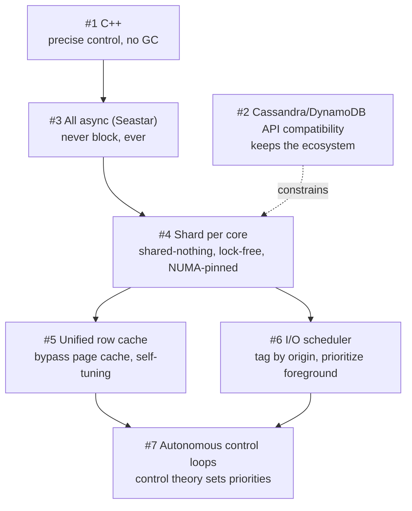

The dependency chain is real: **you cannot bypass the page cache unless you are asynchronous**
(otherwise a miss blocks a thread); **you cannot be lock-free unless data is sharded per core**;
**you cannot shard per core without precise control over memory placement and threading**, which is
the C++ argument; and **the I/O scheduler and unified cache are what give the control loops
something to actuate**.

## Claims made, and what would be needed to verify them

| Claim | Evidence offered |
| --- | --- |
| **1,000,000 operations/second on a single node** | Stated as goal and as achieved; no configuration, workload, or measurement methodology given |
| **p99 latency under 1 ms** | Stated as a design goal |
| **Linear scaling with core count** | A figure (ops/sec vs. cores) referenced but not reproduced in the text conversion |
| **A million continuation tasks per core per second** | Stated |
| **95% reduction in p99/p999/p9999 latency** | Customer quote (Comcast) |
| **More data and more throughput per node than Cassandra** | Customer quote (Expedia) |
| **Significantly smaller datacenter footprint than Cassandra clusters** | Asserted from production deployments |
| **Tripled TCO on DynamoDB** | Asserted |

**None of these are accompanied by a reproducible benchmark, hardware specification, workload
definition, or comparison methodology.** For genuine evidence on the underlying techniques, the
peer-reviewed literature on shared-nothing per-core designs, kernel-bypass I/O, and LSM compaction
scheduling is the place to look — several such papers sit alongside this one in this collection
(MICA for exclusive per-core access and burst I/O; Masstree for the cost of shared vs. partitioned
designs under skew; Kora for I/O scheduling and self-balancing in a cloud service).

## Limitations and open questions

- **This is marketing material.** Every performance figure is vendor-authored, and the comparison
  target (Cassandra) is chosen and configured by the vendor.
- **Shard-per-core has known costs the paper does not discuss.** Static per-core partitioning is
  vulnerable to **hot shards under skewed key popularity** — the exact weakness MICA had to engineer
  around with keyhash partitioning and burst I/O, and which Masstree measured at 3.5× throughput
  loss for hard-partitioned designs at δ = 9. ScyllaDB inherits Cassandra's token-based
  partitioning, so how it handles a hot partition within a node is unaddressed here.
- **Cross-shard requests are described as scatter/gather over shared memory queues**, but their cost
  is not quantified — and multi-partition queries, secondary indexes, and lightweight transactions
  all cross shards.
- **"Always uses maximum parallelism"** is presented as a virtue, but ignoring a configuration knob
  is only correct if the automatic policy is always right; the paper's own I/O scheduler section
  argues that unconstrained background I/O is precisely the failure mode.
- **Control-theoretic tuning is asserted to work** but no stability analysis, setpoint definitions,
  or failure behavior under sudden workload shifts is given. Kora's paper, by contrast, documents
  the concrete oscillation problem (frequent brief throttling degrading tail latency) that feedback
  loops cause, and its lazy-throttling mitigation.
- **Bypassing the page cache moves responsibility, not work.** ScyllaDB must now implement eviction,
  memory pressure handling, and read-ahead itself; the whitepaper claims this is strictly better
  without discussing what the kernel's implementation buys you.
- **API compatibility constrains the architecture.** Adopting SSTables, Cassandra's compaction
  strategies, and CQL semantics limits how much of the storage layer can actually be redesigned.
- **No discussion of correctness, consistency implementation, or failure recovery** — the whitepaper
  is entirely about performance and operability.

## Practical design checklist

The architecture fits when:

- you already run Cassandra (or DynamoDB) and want the same API with fewer, larger nodes;
- **latency predictability matters more than peak throughput**, and GC pauses are a known problem;
- your hardware is modern multi-core with NVMe, and current utilization is poor;
- operational headcount for database tuning is the real cost you are trying to cut.

Look elsewhere, or dig deeper, when:

- your workload is dominated by **cross-partition queries or transactions**, where shared-nothing
  per-core sharding stops helping;
- key popularity is **extremely skewed within a node**, where static per-core sharding can create a
  hot shard;
- you need features outside Cassandra's data model;
- you require published, independently reproducible performance evidence before committing.

## Takeaways

1. **The cluster was fine; the node was the problem.** ScyllaDB's entire thesis is that Cassandra's
   masterless, globally distributed, tunable-consistency design was right, and that everything
   wrong with it lives inside a single node.
2. **Managed runtimes and databases pull in opposite directions.** The C++ argument is not "C++ is
   faster" but "a database needs to know exactly where its memory is and exactly what the CPU is
   doing" — and off-heap workarounds concede the point.
3. **Asynchrony becomes mandatory once I/O gets fast.** When dispatching an I/O costs about what a
   context switch costs, blocking anywhere — even for nanoseconds — is a design error.
4. **Shared-nothing per core turns concurrency control into a non-problem.** No locks, no cache-line
   bouncing, NUMA-local by construction — but it demands owning the allocator, the scheduler, and
   even exception handling.
5. **General-purpose OS facilities are a poor fit for a database that knows more than the OS
   does.** The 4 KB page cache granularity, its synchronous faults, and its indifference to which
   thread is latency-sensitive are all cases where the database has information the kernel lacks.
6. **Tag I/O by origin, then schedule it.** The filesystem and disk cannot distinguish a user query
   from a compaction read; only the database can, so only the database can prioritize correctly.
7. **Replace tuning knobs with control loops.** Every knob is a request for the operator to predict
   the future; a controller that maintains a user-visible property is the more honest interface —
   provided it is stable, which this document asserts rather than demonstrates.

## Citation

```text
ScyllaDB Inc. "Beyond Legacy NoSQL: 7 Design Principles Behind ScyllaDB."
ScyllaDB Whitepaper, 2022. https://www.scylladb.com/
```

---

## Paper: Silo: Speedy Transactions in Multicore In-Memory Databases

# Silo: Speedy Transactions in Multicore In-Memory Databases

> SOSP 2013 — structured reading notes

Full paper content: [Markdown conversion](../original/silo-sosp-2013.md)

## Paper information

- **Authors:** Stephen Tu, Wenting Zheng, Eddie Kohler (Harvard University), Barbara Liskov,
  Samuel Madden
- **Affiliations:** MIT CSAIL; Harvard University
- **Venue:** SOSP '13, November 3–6, 2013, Farmington, Pennsylvania, USA
- **DOI:** [10.1145/2517349.2522713](https://doi.org/10.1145/2517349.2522713)

## One-sentence summary

Silo is a serializable in-memory database whose commit protocol **avoids all shared-memory writes
for records that were only read** — no read locks, no centralized transaction ID counter, no
posting of read sets — and recovers the serial order after a crash by tying the protocol to
**periodically advanced epochs**, achieving **~700,000 TPC-C transactions/second on 32 cores** with
near-linear scaling.

## Problem

Modern servers have terabytes of RAM and 80+ cores, enough to hold datasets that used to span
many machines. But **even a single point of contention, such as a compare-and-swap on one shared
word, can limit scalability.**

**Why OCC is the right starting point.** An OCC transaction tracks reads and writes in
thread-local storage, and at commit validates that no concurrent transaction's writes overlapped
its read set before installing all writes at once. Two scalability benefits:

1. **Shared memory is written only at commit time**, after the compute phase — a short contention
   window.
2. **Read-set records need not be locked**, which matters because **the memory writes required for
   read locks themselves induce contention**.

**Why previous OCC implementations still don't scale: anti-dependencies.** Consider `t1` that
reads a record and concurrent `t2` that overwrites the value `t1` saw. A serializable system must
order `t1` before `t2` **even after a crash and recovery from logs**. Most systems achieve this by
making `t1` communicate with `t2` — posting read sets to shared memory, or taking a
**centrally-assigned monotonically increasing transaction ID**. Non-serializable systems can avoid
the communication, but then admit anomalies like snapshot isolation's **write skew**.

**Silo's answer:** provide serializability while avoiding all shared-memory writes for read
transactions, using **memory fences to produce results consistent with a serial order**, and solve
recovery with **epoch-based group commit**. Time is divided into short epochs; transaction results
always agree with *a* serial order, but **the system does not explicitly know that order except
across epoch boundaries** — if `t1`'s epoch precedes `t2`'s, then `t1` precedes `t2` serially.
Logging happens in units of whole epochs, and results are released to clients at epoch boundaries.

**Model assumption:** Silo assumes **one-shot requests** — all parameters available at the start,
completing without further client interaction. This suits OLTP; if high-latency client
communication were inside a transaction, **abort probability from concurrent updates would grow**.

## Architecture

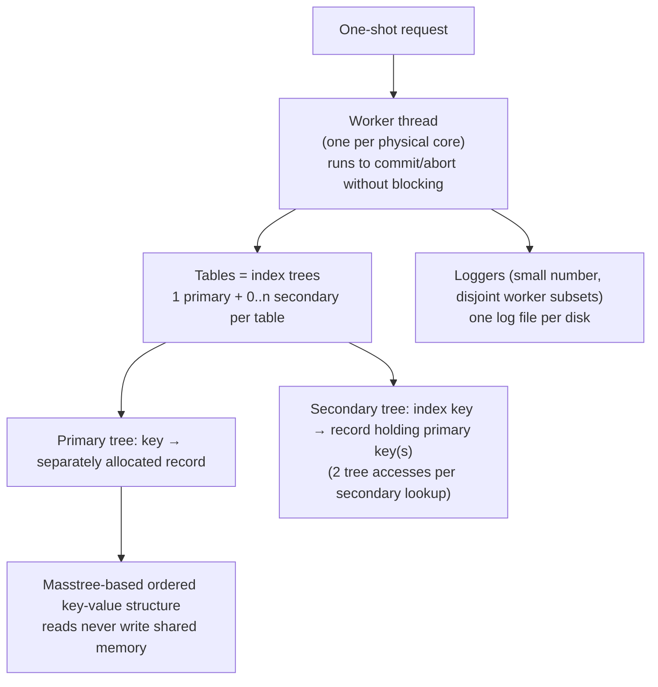

- **Shared-memory store:** any worker can access the entire database. This is a deliberate choice
  against **data partitioning**, where workers own data subsets — partitioning shrinks table sizes
  and avoids fine-grained locks but **works best only when the query load matches the
  partitioning**.
- **Records** live in separately allocated memory chunks pointed to by the primary tree. Primary
  keys must be unique; **Silo invents one if the table has no natural unique key**. All keys are
  strings.
- **Index trees** are Masstree-based: readers **never write to shared memory**, coordinating with
  writers via version numbers and fence-based synchronization. The commit protocol is **easily
  adaptable to other index structures such as hash tables**.
- **Durability** is by logging to stable storage; **results are not returned to users until
  durable**.
- **Read-only transactions may optionally run on a recent consistent snapshot**, returning slightly
  stale results but **never aborting due to concurrent modification**.

## Epochs

Epochs serve **four** purposes: serializable recovery, garbage collection, read-only snapshots, and
defining the boundaries at which the serial order becomes explicit.

- A **global epoch number `E`** is visible to all threads, advanced by a designated thread. The
  tension: `E` should advance frequently because **the epoch period affects transaction latency**,
  but epoch change should be **rare relative to transaction duration so that `E` stays cached**.
  The implementation updates `E` **once every 40 ms**. **No locking is required for `E`.**
- Each worker `w` keeps a **local epoch `e_w`**, which may lag while computing, and is used to
  decide when garbage may be collected. The invariant is **`E − e_w ≤ 1` for all w** — if a worker
  falls behind, **the epoch-advancing thread delays its update**. Workers running very long
  transactions must periodically refresh `e_w` so the system makes progress.

## Transaction IDs

TIDs identify transactions and record versions, **serve as locks**, and detect conflicts. Each
record holds the TID of the transaction that most recently modified it.

A 64-bit TID word contains:

| Bits | Contents |
| --- | --- |
| High | **Epoch number** = the global epoch at commit time |
| Middle | Distinguishes transactions within the same epoch |
| Low 3 | **Status bits**: `lock`, `latest-version`, `absent` |

**TIDs are assigned in a decentralized fashion.** A worker chooses a TID **only after verifying the
transaction can commit**, picking the smallest number that is:

(a) larger than the TID of any record **read or written** by the transaction,
(b) larger than the worker's most recently chosen TID, and
(c) in the current global epoch.

**TID order often reflects serial order, but not always.** If `t1` wrote a tuple `t2` observed,
then `t2`'s TID exceeds `t1`'s by rule (a). **But TIDs do not reflect anti-dependencies:** if `t1`
merely *read* a tuple that `t2` later overwrote, `t1`'s TID may be greater *or* less than `t2`'s.
What *is* guaranteed:

- TIDs chosen by a **single worker** increase monotonically and agree with the serial order;
- TIDs assigned to a **particular record** increase monotonically and agree with the serial order;
- the ordering of TIDs **with different epochs** agrees with the serial order.

**The status bits** are logically separate from the TID but sharing the word is what lets Silo
**update a record's version and unlock it in one atomic step**:

- **`lock`** — protects record memory from concurrent update; in database terms a **latch**.
- **`latest-version`** — 1 when the record holds the latest data for its key; turned off when
  superseded (e.g. when an obsolete version is retained for snapshots).
- **`absent`** — marks the record as equivalent to a nonexistent key; used by insert and remove.

## Data layout

A record contains:

- **a TID word**;
- **a previous-version pointer** (null if none), used for snapshot transactions;
- **the record data** — stored **in the same cache line as the header when possible**, avoiding an
  extra memory fetch.

**Excluding data, records are 32 bytes.** Committed transactions **usually modify record data in
place**, which speeds up short writes mainly by avoiding memory allocation — at the cost of
requiring readers to use a **version validation protocol** to ensure they read a consistent
version.

## The commit protocol

During execution a worker maintains a **read-set** (records read, plus the TID at access time), a
**write-set** (new state of modified records, **but not the previous TID**), and a **node-set** (for
range queries). Records both read and modified appear in both sets; **normally the write-set is a
subset of the read-set**.

```text
Data: read set R, write set W, node set N, global epoch number E

// Phase 1
for record, new-value in sorted(W) do
    lock(record)
compiler-fence()
e ← E                                    // SERIALIZATION POINT
compiler-fence()

// Phase 2
for record, read-tid in R do
    if record.tid ≠ read-tid
       or not record.latest
       or (record.locked and record ∉ W)
    then abort()
for node, version in N do
    if node.version ≠ version then abort()
commit-tid ← generate-tid(R, W, e)

// Phase 3
for record, new-value in W do
    write(record, new-value, commit-tid)
    unlock(record)
```

- **Phase 1** locks every write-set record, **in a global order to avoid deadlock** — any
  deterministic order works; Silo uses **record pointer addresses**. Then it snapshots `E` **in a
  single memory access**. The surrounding fences must ensure the read goes to main memory rather
  than a stale cache and is ordered against all prior and subsequent accesses — **on x86 and other
  TSO machines these are compiler fences only, generating no instructions**; they merely stop the
  compiler from reordering. **This snapshot is the serialization point.**
- **Phase 2** validates every read-set record: abort if its **TID changed**, if it is **no longer
  the latest version**, or if it is **locked by a different transaction**. Then validate node-set
  versions, then generate the commit TID.
- **Phase 3** writes modified records with the new TID. **Each lock can be released immediately
  after its record is written**, and since TID and lock share a word they are written atomically —
  so the new TID is visible exactly when the lock releases.

### Why it is serializable

Three properties: (1) it **locks all written records before validating read TIDs**; (2) it
**treats locked records as dirty and aborts on them**; (3) the **fences closing Phase 1 ensure TID
validation sees all concurrent updates**.

The argument is a reduction to **strict two-phase locking**: if OCC validation commits, S2PL would
have committed too. For a read-set record, Phase 2 verifies the TID is unchanged and the record is
unlocked by others — meaning **S2PL could have held a read lock on it through commit**. For written
records, S2PL upgrades shared read locks to exclusive at commit; Silo takes the exclusive lock in
Phase 1 and then **verifies in Phase 2 that this is equivalent to a read lock held since first
access and then upgraded**.

**Epoch boundaries agree with the serial order**: committed transactions in earlier epochs never
transitively depend on transactions in later epochs. This holds because the fences make every
worker load the latest `E` **after write locking and before read validation** — placing it before
read validation ensures read-sets and node-sets never contain data from later epochs; placing it
after write locking ensures later-epoch transactions **observe at least the lock bits acquired in
Phase 1**. Thus **epochs obey both dependencies and anti-dependencies**.

**Worked example.** With `x = y = 0`, thread 1 does `t1 ← read(x); write(y ← t1+1)` and thread 2
does `t2 ← read(y); write(x ← t2+1)`. The state `x = y = 1` is not serializable, and Silo cannot
produce it: if thread 1 reads `x = 0` and commits, its Phase 2 verified `x` was unlocked and
unchanged; since thread 2 locks `x` in its Phase 1, **thread 2's serialization point must follow
thread 1's**, so thread 2 will observe either thread 1's lock on `y` or a new version number for
`y` — and will set `y ← 2` or abort.

## Database operations

**Reads and writes.** Overwrite in place when possible; otherwise allocate new storage, **mark the
old record as no longer latest**, and repoint the tree. In-place modification means concurrent
readers may see inconsistent data, handled by version validation:

- **Writer (Phase 3, holding the lock):** (a) update the record, (b) **memory fence**, (c) store
  the TID and release the lock. The requirement is that **a reader seeing a released lock must see
  both the new data and the new TID** — step (b) makes the data visible first (a compiler fence on
  TSO), step (c) exposes TID and unlock atomically because they share a word.
- **Reader (during execution):** (a) read the TID word, **spinning until the lock is clear**,
  (b) check it is the latest version, (c) read the data, (d) **memory fence**, (e) re-read the TID
  word. Retry or abort if not latest at (b) or if the TID word changed between (a) and (e).

**Deletes.** Because snapshot transactions need linked older versions to stay reachable, a delete
**marks its record absent** and registers it for later garbage collection. Clients see absent
records as missing keys, but **internally they behave like present records that must be validated
on read**. Since most absent records await collection, **Silo writes do not overwrite absent record
data**.

**Inserts.** Phase 2 handles write-write conflicts by locking, but **a nonexistent record cannot be
locked** — so the record is inserted **before** the commit protocol starts. On key `k`: if `k`
already maps to a non-absent record the insert fails and the transaction aborts; otherwise a new
record `r` is created **absent with TID 0**, added via an **`insert-if-absent` primitive** (which
guarantees at most one record per key), and placed in both the read-set and write-set as if a
regular put occurred. **Read-set validation then ensures no other transaction superseded the
placeholder.** On success the record is overwritten with its real value and the commit TID; on
failure it is registered for garbage collection.

## Range queries and phantoms

The **phantom problem**: if a scan tracked only records present at scan time, **membership in the
range could change undetected**, violating serializability. The usual answer, **next-key locking,
requires locking for reads — against Silo's whole philosophy.**

Silo instead exploits **the underlying B⁺-tree's per-leaf version number**, which the tree
guarantees changes on any structural modification to a node. A scan over `[a, b)`:

1. registers all records in the interval in the **read-set**, and
2. adds the **leaf nodes overlapping `[a, b)` to the node-set**, with the versions observed.

**Phase 2 checks those node versions are unchanged**, proving no keys were added or removed in the
examined ranges. **Failed lookups and deletes also create phantoms** — the transaction may commit
only if the key is still absent at commit — so **the node that would contain the missing key is
added to the node-set**.

**The subtlety with inserts:** an insert can itself trigger structural modification, and Silo must
distinguish *concurrent* modifications (must abort) from *its own* (must not). Since insert tree
modifications happen **before** commit time, for each affected node `n` (more than one if splits
occur) with version `v_old` before and `v_new` after: **if `n` is in the node-set with `v_old`, it
is updated to `v_new`; otherwise the transaction aborts.** Only other transactions' modifications
cause aborts.

## Secondary indexes

To the commit protocol, secondary indexes are **just additional tables** mapping secondary keys to
records containing primary keys. Modifications are made through **extra explicit accesses in the
transaction's own code**, and cause aborts in the usual way — a transaction that used a secondary
index aborts if the record it accessed there changed.

## Garbage collection

Rather than reference counting (which would force all accesses to write shared memory), Silo uses
**epoch-based, RCU-style reclamation**. Two garbage sources: **B⁺-tree nodes** and **database
records**.

A worker generating garbage registers the object and its **reclamation epoch** in a **per-core list
per object type**; once that epoch is reached the object can be freed. **Reclamation runs in the
workers between requests**, which reduces helper threads and **avoids unnecessary data movement
between cores**.

For tree nodes: a node freed during a transaction gets reclamation epoch `e_w`. Since no thread
will ever access nodes freed during an epoch `e ≤ min(e_w) − 1`, the epoch-advancing thread
periodically sets a global **tree reclamation epoch to `min(e_w) − 1`**.

## Snapshot transactions

Read-only transactions can run on a **consistent recent-past snapshot** containing all
modifications up to a point in the serial order and none after it. Two hard parts: keeping the
snapshot consistent and complete, and reclaiming its memory.

- **Snapshot epochs** align with epoch boundaries — hence consistent points in the serial order —
  but **advance more slowly, because snapshots are not free**. For epoch `e`, `snap(e) = k·⌊e/k⌋`
  with **k = 25**, so **a new snapshot is taken about once a second**.
- The epoch-advancing thread computes a global **`SE ← snap(E − k)`**; each worker sets
  **`se_w ← SE` at transaction start**. For record `r`, the relevant version is **the most recent
  one with epoch ≤ `se_w`**. A snapshot transaction **commits without checking and never aborts**.
- **Read/write transactions must not destroy versions a snapshot needs.** Committing in epoch `E`
  and modifying record `r`, a transaction compares `snap(epoch(r.tid))` with `snap(E)`: **equal →
  safe to overwrite**; **different → install a new record whose previous-version pointer links to
  the old one**. (When possible Silo copies the *old* version into new memory linked from the
  existing record, **to avoid dirtying tree-node cache lines**.)
- **Reclamation:** memory allocated for a snapshot version in epoch `E` is registered with epoch
  `snap(E)`; the epoch-advancing thread computes a **snapshot reclamation epoch = `min(se_w) − 1`**.
  **No previous-version pointers need adjusting** — the dangling pointer is never traversed because
  any future snapshot transaction prefers the newer version.
- **Deletions need special handling.** Deleted records cannot be unhooked immediately, so commit
  creates an **absent record whose data space instead stores the key**, registered for cleanup at
  `snap(E)`. When the snapshot reclamation epoch reaches that value, cleanup **removes the tree
  reference (which needs the key)** and then registers the record for reclamation under the *tree*
  reclamation epoch — it cannot be freed at once because a concurrent transaction might be reading
  it. **If the absent record was itself superseded by a later insert, cleanup checks it is still
  the latest version and simply ignores it otherwise**, since the inserting transaction already
  marked it for reclamation.

## Durability

**Durability is transitive**: a transaction is durable if its modifications are on durable storage
**and all transactions serialized before it are durable**. So recovery must restore **a prefix of
the serial order** — and epochs are exactly what makes such a prefix identifiable. Silo therefore
**treats whole epochs as the durability commit unit**: results of transactions in epoch `e` are not
released to clients until all transactions with epochs ≤ `e` are durable.

The recovery rule: find the **durable epoch `D`**, the latest epoch whose transactions were all
successfully logged, and **recover all transactions with epochs ≤ D and no more**. Not recovering
more is crucial — **the serial order *within* an epoch is not recoverable from the logged
information**, so replaying a subset of an epoch's transactions could produce an inconsistent
state. **This is also why the epoch period directly sets average commit latency.**

**Mechanism:**

1. A **small number of logger threads**, each responsible for a disjoint subset of workers, each
   writing to a log file on a separate disk.
2. On commit, a worker creates a log record of the **TID plus table/key/value for all modified
   records**, buffered locally **in disk format**. When the buffer fills or a new epoch begins, it
   **publishes the buffer to its logger via a per-worker queue** and publishes its last committed
   TID to a global `ctid_w`.
3. A logger loops: compute `t = min(ctid_w)` over its workers, derive a **local durable epoch
   `d = epoch(t) − 1`** (all its workers have published everything through `d`), append all buffers
   **plus a final record containing `d`** to the log file, wait for the writes, publish `d` to a
   per-logger `d_l`, and return the buffers for recycling. **It never needs to examine the buffer
   memory.**
4. A thread periodically publishes the **global durable epoch `D = min(d_l)`**; workers may then
   respond to clients whose transactions were in epochs ≤ `D`.

**Silo uses record-level redo logging exclusively** — no undo logging (unnecessary because logging
happens after commit) and no operation logging (record level **simplifies recovery**). Recovery
reads the most recent `d_l` per logger, computes `D`, and replays logs while **ignoring entries
with TIDs from epochs after `D`**. Log records for the same record must be applied in TID order,
but **replay is otherwise concurrent**.

**Not implemented:** full checkpointing and recovery. Checkpoints (which could exploit snapshots to
avoid interfering with read/write transactions) would be needed for log truncation.

## Evaluation

### Setup

- Four 8-core Intel Xeon E7-4830 @ 2.1 GHz = **32 physical cores**; 32 KB L1 and 256 KB L2 private
  per core, **24 MB L3 shared per socket**; **256 GB DRAM, 64 GB per socket**; 64-bit Linux 3.2.0.
  **Hyperthreading disabled** (slightly worse results with it on).
- B⁺-tree internal and leaf nodes sized to **roughly four cache lines**, with software prefetching —
  following Masstree.
- **Custom NUMA-aware memory allocator** using **2 MB superpages**; threads pinned so allocated
  memory is on the thread's NUMA node; **memory pools pre-faulted** so Linux virtual-memory
  scalability bottlenecks do not distort results.
- Persistence experiments use **four logger threads**, each with a file on a separate device: three
  **Fusion IO ioDrive2** devices and one **six-disk 7200 RPM SATA RAID-5** — collectively enough
  bandwidth that **writing to disk is not the bottleneck**.
- **No networked clients** — each thread combines worker and workload generator in one process.
  The authors note **Masstree lost 23% throughput to networking**, so real numbers would be lower.
- 60-second runs; each point is the median of three, with min/max error bars. **`MemSilo`** =
  Silo with logging disabled.

### Overhead of small transactions

Against **`Key-Value`** — the bare concurrent B⁺-tree beneath Silo, with no read/write tracking —
on a modified YCSB-A: 80/20 read/write, **writes are read-modify-writes** (a real transaction
generating read-write conflicts), **100-byte records**, 160M keys, uniform sampling. The
modifications exist to stop uninteresting costs (allocator, `memcpy`) from masking Silo's own
overhead.

**`Key-Value` outperforms `MemSilo` by at most 1.07×** — read/write set tracking is nearly free.

**The global-TID experiment is the striking result.** `MemSilo+GlobalTID` follows the identical
protocol but draws TIDs **from a single shared counter** (as in Larson et al.'s critical section).
It shows **scalability collapse after 24 workers**, with `Key-Value` beating it by **1.80× at 32
workers** — demonstrating **the necessity of avoiding even a single global atomic instruction during
commit**.

### Scalability and persistence (TPC-C)

All clients with the same local warehouse are assigned to the same thread — modelling client
affinity so **memory accessed by a transaction usually resides on the worker's NUMA node**. The
number of warehouses equals the number of workers, **so the database grows with the workers**,
fixing the contention ratio. No client think time; standard five-transaction mix.

- **`MemSilo` scales close to linearly to 32 workers**: per-core throughput at 32 workers is **81%
  of one worker and 98% of eight workers**. The drop comes from growing database size, **L3 sharing
  (especially from 1 to 8 threads)**, and real contention.
- **Headline: ~700,000 transactions/second on 32 cores ≈ 22,000 per core.** For context, the
  literature cites per-core TPC-C throughput **several times lower**, and a commercial main-memory
  database on the same hardware managed **at most 3,000 transactions per second per core**.
- **`Silo` (with logging) is only 1.16× slower at most** than `MemSilo`, with scalability degrading
  past 28 workers as **worker and logger threads contend for cores**.
- **Logging to tmpfs instead of real storage gained at most 1.03×** — proving the cost is **moving
  log records from workers to loggers, not writing to hardware** (given sufficient bandwidth).
- **Latency spikes around 28 workers** for both configurations, more pronounced with real storage —
  "latency is more sensitive to real hardware than throughput is."

### Silo versus a partitioned store

**`Partitioned-Store`** is modelled on H-Store/VoltDB: data physically partitioned by warehouse,
separate B⁺-trees per partition, one worker per partition, all in the same process to avoid IPC. A
**global partition lock** per partition; **every transaction acquires all its partition locks in
sorted order** and then runs single-threaded with **no further validation**, assuming perfect
knowledge of which locks are needed. Locks are spinlocks **allocated on separate cache lines to
prevent false sharing**, and are cheap when cached locally. It has **no snapshot transactions, no
per-record concurrency control, no B⁺-tree concurrency control, and no durability** — i.e. it is
given every advantage.

**Varying cross-partition transactions** (28 warehouses, 28 workers, 100% new-order; the x-axis is
the probability a transaction touches **at least one** remote warehouse, given 5–15 items each):

| Cross-partition rate | Result |
| --- | --- |
| 0% | **`Partitioned-Store` wins by 1.54×** — no concurrency control needed, plus better cache locality from smaller partitioned trees |
| ~20% | **Crossover** — `Partitioned-Store` drops below `MemSilo` |
| ~60% | **`MemSilo` wins by 2.98×**, while its throughput stayed relatively steady across the whole sweep |

The reading: **the tradeoff between coarse and fine-grained locking**. Silo's OCC pays a
non-trivial tracking overhead at low contention that **pays off as contention rises**. Decomposing
the low-contention gap further, `MemSilo+Split` (Silo with tables physically split the same way)
gains **13%**, so **the remaining difference is purely the absence of fine-grained concurrency
control**.

**Varying skew** (100% new-order, database fixed at four warehouses in one partition, varying
worker count to simulate hotspots):

- **`Partitioned-Store` throughput stays flat** — multiple workers cannot run in parallel on one
  partition; they serialize on the partition lock.
- **`MemSilo` increases but not linearly**, because of genuine workload contention: a **counter
  record per (warehouse-id, district-id)** generates new-order IDs, and more workers mean more
  read-write conflicts on that counter and more aborts. **This is not OCC-specific** — under 2PL,
  workers would serialize on write locks on the same counter.
- **`MemSilo` beats `Partitioned-Store` by up to 8.20× at 24 workers.**
- **`MemSilo+FastIds`** removes the contention by generating IDs **outside** the new-order
  transaction (two transactions: one to get an ID, one to use it), **sacrificing the invariant that
  the new-order ID space is contiguous**, since counters do not roll back on abort. It scales
  cleanly to 28 workers and beats `Partitioned-Store` by **up to 17.21× at 32 workers**.

### Snapshot transactions

Snapshots are not free, and **for workloads with few large read-only transactions — including
standard TPC-C — the benefit does not outweigh the overhead.** The test that shows the benefit: 8
warehouses, 16 workers, a **50% new-order / 50% stock-level** mix, where **stock-level touches
several hundred records in tables the new-order transaction frequently updates**, performing a
nested-loop join between order-line and stock.

| Configuration | Transactions/sec | Aborts/sec |
| --- | ---: | ---: |
| `MemSilo` (stock-level as a snapshot transaction ~1 s in the past) | **200,252** | **2,570** |
| `MemSilo+NoSS` (stock-level in the present) | 168,062 | 15,756 |

**1.19× throughput**, entirely attributable to **the abort reduction** — snapshot transactions never
abort.

**Space overhead:** a YCSB variant where every transaction is a read-modify-write on a single
record over 160M keys — chosen because **almost every transaction generates a new version**,
stressing the garbage collector at every snapshot epoch boundary. Records initially occupied
**19.5 GB**; over the full run this grew by **at most 672.3 MB — a 3.4% increase**.

### Factor analysis (TPC-C, 28 warehouses, 28 workers, cumulative changes)

**Regular group:** `Simple` (no NUMA-aware allocator, new record allocated per write) →
`+Allocator` → `+Overwrites` (in-place writes, = `MemSilo`) → `+NoSnapshots` → `+NoGC`.

> **Takeaways: in-place updates are an important optimization, and the combined overhead of
> maintaining snapshots plus garbage collection is low.**

**Persistence group:** `MemSilo` (no logging) → `+SmallRecs` (log **only 8-byte TID-only records**,
an upper bound on any logging scheme) → `+FullRecs` (= `Silo`) → `+Compress` (LZ4 on log records).

> **Takeaways: spending CPU cycles to reduce bytes written surprisingly does not pay off for this
> TPC-C workload, and the overhead of copying record modifications into logger buffers and then to
> storage is low.**

## Positioning against related work

- **Masstree** is the direct ancestor of Silo's index — extremely scalable, using version validation
  instead of read locks — but supports only **non-serializable single-key transactions**. Silo's
  contribution is the multi-key serializable commit protocol on top.
- **PALM** achieves very high B⁺-tree throughput via batching, prefetching, and intra-core SIMD;
  **its techniques could speed up Silo's tree operations**.
- **Bw-tree** installs versions with delta records and CAS on a mapping table with no locks or
  overwrites — but **Silo found both locks and overwrites helpful for performance**, and Bw-tree
  targets flash. Both use RCU-style epochs for GC; **Silo's epochs additionally support scalable
  serializable logging and snapshots**. **LLAMA adds transactional logging but its logger is
  centralized.**
- **Larson et al. / Hekaton** also avoid installing writes until commit and remove many classic OCC
  critical sections, but **have a global critical section when assigning timestamps**, and **reads
  must perform non-local memory writes to update other transactions' dependency sets**. Their
  design performs **~50% worse than a single-copy locking system on simple key-value workloads even
  at low contention**, whereas **Silo is within a few percent of a key-value system**.
- **Partitioning-based systems:** **DORA** partitions data and locks among cores, gaining only
  ~20% over a locking system and sometimes performing *worse* when transactions touch many
  partitions. **PLP** physically partitions into per-thread trees but needs a **centralized routing
  table** and **rendezvous points** that are themselves contention sources, showing only modest
  gains over 2PL. **H-Store/VoltDB** treat each partition as a separate logical database — single-
  partition transactions run with no locking at all, but multi-partition transactions take
  **whole-partition locks**.
- **Multimed** runs multiple replicated database instances on separate cores, but **only enforces
  snapshot isolation**, achieves read scalability at the cost of multiple data copies, and
  **bottlenecks on the master for write-heavy workloads**.
- **VLL** also co-locates locks with records, but is not focused on multicore performance.
- **Porobic et al.** concluded shared-nothing configurations are preferable on a single multicore
  machine because of NUMA effects. **"Our results argue otherwise."**
- **Software transactional memory** shares the OCC structure and some implementation techniques
  (read validation, collocating lock bits with versions), but **STM would be an inappropriate
  implementation technique for Silo**: Silo's transactions touch many shared words with **no
  transactionally relevant meaning**, such as interior tree nodes, and **Silo can distinguish
  relevant from irrelevant modifications — which is critical for avoiding unnecessary aborts**.
  The authors add: "we know of no STM that beats efficient locking-based code."

## Limitations and questions

- **Checkpointing and recovery are not implemented** — only common-case logging is evaluated. Log
  truncation therefore has no mechanism.
- **No networked clients.** The authors state the results are higher than a full system would
  observe, citing Masstree's 23% loss.
- **One-shot requests only.** Interactive transactions with client round-trips would raise abort
  rates; there is no SQL front end (the paper notes one-shot requests *could* be written in SQL, but
  it was not implemented).
- **Epoch period sets a latency floor.** With 40 ms epochs and epoch-granular group commit, average
  commit latency is bounded below by the epoch period — an explicit throughput-for-latency trade.
- **Recovery cannot use partial epochs**, so a crash loses up to a full epoch of committed-but-
  unreleased work.
- **Snapshots are only worth it for specific workloads** — the authors are explicit that standard
  TPC-C does not benefit.
- **Contention that is inherent to the workload remains** — the new-order counter hotspot required
  changing application semantics (`FastIds`, sacrificing contiguous IDs) rather than a system fix.
- **Partitioning still wins by 1.54× on perfectly partitionable workloads**, so the shared-memory
  choice is a judgment about expected cross-partition rates, not a universal win.
- **The commit protocol relies on TSO memory ordering** for its cheapest form; on weaker memory
  models the "compiler fences" become real fence instructions with real cost.

## Practical design checklist

Silo's approach fits when:

- transactions are **short, one-shot, and OLTP-shaped**;
- the working set is **in memory on a single multicore machine**;
- **cross-partition access is common enough** that static partitioning would hurt;
- you can tolerate **epoch-granularity commit latency** in exchange for contention-free reads;
- large read-only queries can accept **~1-second-stale snapshots**.

Look elsewhere when:

- transactions are interactive or long-running;
- the workload partitions perfectly and stays that way;
- you need sub-epoch commit latency;
- contention is concentrated on a few hot records — that is a workload problem no concurrency
  control scheme fixes.

## Takeaways

1. **One global atomic instruction is enough to break scalability.** The `GlobalTID` variant —
   identical except for a shared counter — collapsed after 24 cores. Decentralized TID assignment
   is not an optimization; it is the point.
2. **Read locks are writes, and writes to shared memory are the enemy.** Silo's defining property
   is that a transaction that only reads a record writes nothing shared, anywhere.
3. **Epochs give you back the serial order you gave up.** The protocol deliberately does not know
   the global order — but epoch boundaries do, and that is exactly enough for recovery, garbage
   collection, and snapshots. One mechanism, four uses.
4. **Anti-dependencies are the hard part of serializable OCC.** TIDs capture dependencies but not
   write-after-read conflicts; the fences around the epoch read are what make epochs respect both.
5. **Put the lock in the version word.** Sharing a word lets Silo publish a new version and release
   its latch in one atomic store — the small layout decision that makes the reader protocol work.
6. **Validate structure, not just data, to kill phantoms.** Tracking B⁺-tree leaf versions in a
   node-set gives phantom protection without a single read lock — and the insert case shows the care
   required to distinguish your own structural changes from everyone else's.
7. **Partitioning is a bet on your workload.** It wins by 1.54× when perfect and loses by 2.98× at
   60% cross-partition, and it converts skew into flat throughput while a shared design keeps
   scaling (up to 17.21× better in the skewed test).
8. **Group commit at epoch granularity makes durability nearly free.** Logging cost at most 1.16×
   throughput, and tmpfs experiments proved the residual cost was buffer handoff, not the disks.

## Citation

```bibtex
@inproceedings{tu2013silo,
  author = {Stephen Tu and Wenting Zheng and Eddie Kohler and Barbara Liskov and Samuel Madden},
  title = {Speedy Transactions in Multicore In-Memory Databases},
  booktitle = {Proceedings of the Twenty-Fourth ACM Symposium on Operating Systems Principles
               (SOSP '13)},
  pages = {18--32},
  year = {2013},
  publisher = {ACM},
  doi = {10.1145/2517349.2522713}
}
```

---

## Paper: Ursa: A Lakehouse-Native Data Streaming Engine for Kafka

# Ursa: A Lakehouse-Native Data Streaming Engine for Kafka

> VLDB 2025 Best Industry Paper — structured reading notes

Full paper content: [Markdown conversion](../original/ursa-vldb-2025.md)

## Paper information

- **Authors:** Matteo Merli, Sijie Guo, Penghui Li, Hang Chen, and Neng Lu
- **Affiliation:** StreamNative, Inc.
- **Venue:** Proceedings of the VLDB Endowment, Volume 18, Number 12, 2025
- **Pages:** 5184–5196
- **Award:** VLDB 2025 Best Industry Paper
- **DOI:** [10.14778/3750601.3750636](https://doi.org/10.14778/3750601.3750636)
- **Paper page:** [PVLDB Volume 18](https://vldb.org/pvldb/volumes/18/paper/Ursa%3A%20A%20Lakehouse-Native%20Data%20Streaming%20Engine%20for%20Kafka)
- **PDF:** [Official paper](https://www.vldb.org/pvldb/vol18/p5184-guo.pdf)
- **Award source:** [VLDB 2025 Conference Awards](https://vldb.org/2025/?conference-awards=)

## One-sentence summary

Ursa implements the Kafka protocol over stateless brokers, external write-ahead-log storage,
centralized metadata, and open lakehouse tables, exchanging Kafka's very low latency for much
lower cloud infrastructure cost when a workload can tolerate roughly sub-second latency.

## Problem

A common real-time analytics pipeline operates two separate systems:

```text
producer -> Kafka brokers -> connector or ETL -> object storage -> lakehouse table
```

This architecture provides low-latency streaming, but it creates five cost drivers:

1. Partition leaders and replicas send data between availability zones.
2. Brokers retain multiple disk copies of each record.
3. Coupled compute and storage cause overprovisioning and partition rebalancing.
4. Connectors consume resources and add another operational failure domain.
5. The same logical data exists in Kafka, staging areas, and lakehouse files.

Lakehouse ingestion often needs 200–500 ms rather than sub-50 ms latency. Ursa asks whether a
system can spend that latency budget to remove the duplicated infrastructure.

## Design goals

- **Cost efficiency:** avoid cross-zone payload replication and broker-local disks.
- **Lakehouse-native storage:** write open formats without a separate connector.
- **Elasticity:** add or remove brokers without moving partitions.
- **Stream–table duality:** serve ordered Kafka reads and analytical table scans from one
  durable dataset.
- **Kafka compatibility:** preserve existing producer and consumer APIs.
- **Correctness:** retain monotonic offsets, linearizable appends, read-your-writes, and
  exactly-once compaction.

## Cost–availability–performance trade-off

The paper describes a cloud-streaming variant of CAP:

- **Cost:** dollars per unit of throughput.
- **Availability:** survival of availability-zone failures.
- **Performance tolerance:** the latency an application will accept.

Very low latency plus multi-zone availability generally requires expensive synchronous
replication. A workload that accepts higher latency can use object storage and reduce those
costs. This is an engineering trade-off, not a replacement for the traditional consistency,
availability, and partition-tolerance theorem.

## Architecture

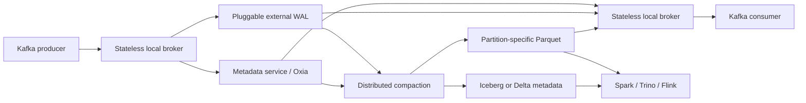

### Stateless brokers

Brokers terminate Kafka connections and execute produce and fetch requests, but own neither
partitions nor local logs. Any broker can serve a partition after consulting metadata. Brokers
therefore scale without leader election, partition reassignment, or data migration.

Zone-aware discovery directs a client to a broker in the same availability zone. Payload data
stays local on the broker path; only small metadata operations need cross-zone coordination.

### Metadata service

The implementation uses StreamNative Oxia as the authoritative store for:

- stream and partition metadata;
- monotonically increasing offset assignment;
- the logical-offset-to-physical-object index;
- broker membership and discovery;
- transaction state and compaction state.

The interface is pluggable; the paper names etcd and Spanner as possible alternatives. Brokers
are leaderless, but the overall design still depends on a strongly consistent metadata system.

### Stream storage

Each Kafka topic-partition is an append-only **stream**. Its data transitions between two
physical forms:

- A **WAL object** batches records from multiple streams in a row-oriented format optimized for
  append throughput.
- A **compacted object** contains one stream's records in a larger Parquet file optimized for
  sequential catch-up reads and analytical scans.

The WAL implementation determines the operating point:

| WAL option | Goal | Reported latency class |
| --- | --- | --- |
| Replicated Apache BookKeeper | Latency optimized | Single-digit to low-hundreds of milliseconds |
| Cloud object storage | Cost optimized | Sub-second |

Acknowledgement occurs only after the WAL object and its metadata reference are durable.

### Offset index

Each stream has an ordered index in the metadata service. A key contains:

```text
(StreamID, OffsetEnd, CumulativeSize)
```

The value identifies the physical object, object type, record counts, byte position, and local
entry offsets. To fetch logical offset `x`, a broker finds the first entry whose exclusive
`OffsetEnd` is greater than `x`, then range-reads the referenced WAL or Parquet object.

The indirection is the key abstraction: compaction can replace physical files while the Kafka
offset space remains stable.

## Write path

1. The broker buffers records and sorts a batch by stream ID.
2. It writes the batch durably as one external WAL object.
3. A metadata transaction assigns consecutive offsets and adds index entries.
4. The broker acknowledges the producer after both data and index are durable.
5. Background compaction later rewrites the records to Parquet.

The data write precedes metadata publication. A crash between the two can leave an unreferenced
object, which cleanup can reclaim; it does not expose a committed offset without durable data.

## Read path

1. The consumer uses the normal Kafka fetch API.
2. A local broker resolves the requested offset through the metadata index.
3. Recent records are range-read from WAL objects.
4. Older records are read sequentially from partition-specific Parquet files.
5. Zonal caches reduce repeated object-store reads for consumers and compactors.

Recent tail reads favor append-friendly WAL data; backlog reads favor compacted Parquet. The
offset index presents both as one logical log.

## Distributed compaction

Interleaving many partitions in WAL objects is efficient for writes but causes read
amplification for lagging consumers. Ursa uses a MapReduce-like process:

1. **Task generation:** a leader divides stream offset ranges into adaptive windows and
   checkpoints progress in Oxia.
2. **Distributed conversion:** workers read WAL ranges, decode each record with its schema,
   and write partition-specific Zstandard-compressed Parquet.
3. **Atomic commit:** the leader batches file metadata, replaces offset-index references, and
   commits the files to the lakehouse catalog.
4. **Cleanup:** WAL and orphaned objects are deleted only after the new state is committed.

Workers scale independently from brokers, so historical conversion does not consume the live
ingestion tier. Previous metadata versions allow rollback after a partial failure.

### Stream-backed and external tables

- A **Stream-Backed Table (SBT)** lets the Kafka stream index and Iceberg or Delta metadata
  reference the same Parquet objects. Analytical engines read the table without copying data.
- **Stream-Delivered-to-Table (SDT)** writes a separate optimized copy for an external catalog,
  such as Databricks Unity Catalog or Snowflake. This is more flexible but gives up the
  single-copy advantage.

## Schema evolution

Producers attach Schema Registry IDs to records. Compaction decodes each record with its writer
schema and starts a new Parquet file when the schema ID changes. The table schema is a union of
historical versions:

- added fields become nullable;
- compatible types may be promoted;
- renamed fields follow the table format's rules;
- deleted columns remain physically available for compatibility;
- primary-key fields remain required.

A malformed record is sent to a dead-letter topic. Its offset is still represented so the main
stream keeps a gap-free logical order.

## Kafka-compatible behavior

The broker layer supports Kafka clients and implements producer and consumer flows on top of
Ursa primitives. The paper also describes:

- transactional writes and exactly-once behavior;
- consumer group coordination;
- read-your-writes across broker failure;
- Kafka-style keyed topic compaction.

For keyed compaction, a worker retains the highest offset seen for each key, writes a new
Parquet object, and atomically swaps the index only after the replacement is durable. Normally
one topic compactor runs per partition, simplifying concurrency control.

## Evaluation

### Benchmark environment

- AWS across three availability zones.
- Cost-optimized, object-storage WAL backed by Amazon S3.
- OpenMessaging Benchmark workloads.
- Six `m6i.8xlarge` producer nodes and six consumer nodes.
- Twelve additional `m6i.8xlarge` nodes for Ursa brokers and Oxia.

### Performance results reported by the authors

- Produce and consume throughput stayed near **5 GB/s** across tested partition counts.
- Throughput stayed near **5 GB/s** for 1 KiB, 4 KiB, and 64 KiB messages.
- P99 publish latency remained below **1 second** under 1:1, 1:3, and 1:5 write-to-read ratios.
- Backlog draining continued while ingesting up to **2 GB/s**, with spikes mainly at p99.9.
- CPU utilization was generally **30–60%**; network bandwidth was the main bottleneck.

### Production evidence reported by the authors

At publication time, Ursa had run for two years on StreamNative Cloud across AWS, GCP, and
Azure. The authors report hundreds of clusters, sub-second end-to-end latency, and one customer
deployment that reduced infrastructure cost by 10× relative to its previous multi-AZ Kafka
deployment.

### Cost experiment

The experiment produced ten billion records, or 180 GB after LZ4 compression, over two hours.
Compaction created 2,597 Parquet files totaling 55 GB. The paper applies seven-day Kafka
retention and one-month lakehouse retention.

| Two-hour modeled cost | Ursa | Kafka with disk | Kafka with tiered storage |
| --- | ---: | ---: | ---: |
| Server EC2 | $1.04 | $0.52 | $0.52 |
| Connector EC2 | $0.00 | $0.52 | $0.52 |
| Inter-zone network | $0.00 | $6.00 | $6.00 |
| Storage | $1.27 | $28.27 | $4.94 |
| S3 requests | $0.40 | $0.00 | $0.00 |
| **Total** | **$2.71** | **$35.31** | **$11.98** |

Under those assumptions, Ursa is 92% cheaper than disk-backed Kafka and 78% cheaper than the
tiered-storage configuration.

## What is genuinely novel

No individual ingredient is unprecedented: stateless compute, remote logs, object storage,
Parquet, consistent metadata stores, and lakehouse catalogs all exist independently. Ursa's
contribution is their composition behind the Kafka protocol, especially the offset index that
lets one logical stream move safely from append-oriented WAL objects to query-oriented Parquet
files.

The strongest systems lesson is to design around the latency a workload actually needs. If an
ingestion pipeline can accept hundreds of milliseconds, preserving a sub-50 ms architecture
may waste money on replicas, disks, and cross-zone traffic.

## Limitations and questions

- **Latency is intentionally higher.** Object-store WAL mode does not replace Kafka for
  workloads that require consistently low tens-of-milliseconds latency.
- **The metadata service is critical.** Brokers have no partition leaders, but ordering and
  publication depend on a strongly consistent centralized service. Its scaling and failure
  limits deserve careful capacity testing.
- **Availability depends on configuration.** Lower cross-zone cost comes from moving some
  durability and availability responsibility to the selected WAL and object store.
- **Benchmarks are vendor-authored.** The authors built and operate Ursa. Independent,
  reproducible comparisons would strengthen the results.
- **Cost results are assumption-sensitive.** Region, cloud prices, retention, compression,
  traffic shape, connector sizing, and Kafka replication policy can change the outcome.
- **The comparison omits some modern alternatives.** A detailed benchmark against other
  zero-disk Kafka-compatible products would better isolate Ursa's open-table advantage.
- **SBT and SDT have different economics.** External catalogs may require the second Parquet
  copy that the headline single-copy architecture seeks to avoid.
- **Compaction debt matters.** Sustained overload of compactors can increase WAL retention,
  catch-up read amplification, storage requests, and time until data becomes analytics-ready.

## Practical design checklist

Ursa's architecture is a good candidate when:

- existing applications require the Kafka API;
- the primary destination is Iceberg or Delta Lake;
- p99 latency below roughly one second is acceptable;
- cross-zone network and replicated broker storage dominate cost;
- workloads benefit from independent broker and compactor scaling.

Traditional Kafka or a latency-optimized WAL remains attractive when:

- tens-of-milliseconds tail latency is a hard requirement;
- consumers mostly read the live tail and lakehouse integration is secondary;
- object-store availability or request latency cannot satisfy the workload;
- the organization already operates Kafka efficiently and connector cost is small.

## Takeaways

1. Separate the logical log from its physical representation with a durable offset index.
2. Use row-oriented batches for the hot write path and columnar files for cold reads and
   analytics.
3. Make brokers disposable by moving durable state and sequencing behind explicit interfaces.
4. Route data within an availability zone and replicate only what the availability target
   requires.
5. Commit replacement files atomically before deleting old objects.
6. Treat compaction as an independently scalable data plane, not broker background work.
7. Compare systems using total pipeline cost, including connectors, duplicate data, network,
   and operational capacity—not broker instance cost alone.

## Citation

```bibtex
@article{merli2025ursa,
  author = {Matteo Merli and Sijie Guo and Penghui Li and Hang Chen and Neng Lu},
  title = {Ursa: A Lakehouse-Native Data Streaming Engine for Kafka},
  journal = {Proceedings of the VLDB Endowment},
  volume = {18},
  number = {12},
  pages = {5184--5196},
  year = {2025},
  doi = {10.14778/3750601.3750636}
}
```

---

## Paper: Velox: Meta's Unified Execution Engine

# Velox: Meta's Unified Execution Engine

> VLDB 2022 — structured reading notes

Full paper content: [Markdown conversion](../original/velox-vldb-2022.md)

## Paper information

- **Authors:** Pedro Pedreira, Orri Erling, Masha Basmanova, Kevin Wilfong, Laith Sakka, Krishna
  Pai, Wei He, Biswapesh Chattopadhyay
- **Affiliation:** Meta Platforms Inc.
- **Venue:** Proceedings of the VLDB Endowment, Volume 15, Number 12, 2022, pages 3372–3384
- **DOI:** [10.14778/3554821.3554829](https://doi.org/10.14778/3554821.3554829)
- **Code:** https://github.com/facebookincubator/velox

## One-sentence summary

Velox is a C++ library of reusable, dialect-agnostic **data-plane** components — type system,
Arrow-extended vectors, vectorized expression evaluation, operators, I/O, serializers, and
resource management — that Meta has integrated into **more than a dozen systems** (Presto, Spark,
PyTorch, stream processing, message bus, ingestion, feature engineering) to replace duplicated
execution engines, delivering **~6–7× average speedup on real Presto workloads and the same
throughput on 3× fewer servers**.

## Problem: a siloed data landscape

Workload diversity plus dataset growth produced a proliferation of specialized engines — batch and
interactive analytics, ETL and bulk movement, stream processing, log and timeseries monitoring,
and now AI/ML preprocessing and feature engineering. The result:

- Engines built with **different frameworks, languages, and teams**, sharing nothing.
- **Evolving them per-engine is cost prohibitive** — extending each one for new hardware
  (cache-coherent accelerators, NVRAM), new features (tensor types for ML), or new research results
  is impractical, and **invariably yields engines with disparate optimizations**.
- **Users pay the price**, since finishing one task usually means interacting with several engines
  whose types, functions, aggregates, null handling, and casting behave differently.

The paper's memorable data point: **an informal survey at Meta found at least 12 different
implementations of the simple string function `substr()`** — differing in parameter semantics
(0- vs. 1-based indices), null handling, and exception behavior. A second survey found **about 14
libraries used for ML data preprocessing**.

**The key observation licensing the whole project:** specialized engines genuinely differ in the
**language frontend** (SQL, dataframes, DSLs), the **optimizer**, the **runtime** (how tasks are
distributed), and the **I/O layer** — but **the execution engines at their core are all rather
similar.** Every engine needs a type system, an in-memory (usually columnar) representation, an
expression evaluator, operators (join, aggregation, sort), plus storage and network serialization,
encoding formats, and resource management.

**Velox's three-part value proposition:**

- **Efficiency** — democratize optimizations previously implemented in individual engines: full
  SIMD, lazy evaluation, adaptive predicate reordering and pushdown, common subexpression
  elimination, execution over encoded data, code generation.
- **Consistency** — engines sharing the library expose the exact same data types and
  scalar/aggregate function packages.
- **Engineering efficiency** — every feature and optimization is built and maintained **once**.

**Scope boundary, stated firmly:** Velox takes a **fully optimized query plan** as input and
executes it with local-node resources. It provides **no SQL parser, no dataframe layer, no DSL, and
no global query optimizer**, and is **not meant to be used directly by data users**. In other
words, **Velox is the data plane; individual engines own the control plane.**

## Library components

| Component | What it provides |
| --- | --- |
| **Type** | Generic type system for scalar, complex, and nested types — structs, maps, arrays, tensors — plus an **opaque type** wrapping arbitrary C++ structures. **Extensible** so engines add their own types (Presto's HyperLogLog, `timestamp with timezone`) without modifying the library |
| **Vector** | **Arrow-compatible** columnar memory layout supporting Flat, Dictionary, Constant, Sequence/RLE, and Bias (frame-of-reference) encodings, plus **lazy materialization** and **out-of-order result buffer population** |
| **Expression Eval** | Fully vectorized evaluation over Vector-encoded data, using common subexpression elimination, constant folding, efficient null propagation, **encoding-aware evaluation**, and **dictionary memoization** |
| **Functions** | APIs for custom scalar functions in both **simple (row-by-row)** and **vectorized (batch-by-batch)** style, plus aggregate function APIs. Dialect-compatible packages ship for **Presto and Spark** |
| **Operators** | TableScan, Project, Filter, Aggregation, Exchange/Merge, OrderBy, HashJoin, MergeJoin, Unnest, and more |
| **I/O** | Generic connector interface for pluggable file format codecs and storage adapters; **ORC, Parquet, S3, HDFS** included |
| **Serializers** | Wire protocol interface; **PrestoPage** and **Spark UnsafeRow** supported |
| **Resource Management** | Memory arenas and buffer management, tasks, drivers, CPU thread pools, **spilling, and caching** |

Engines pick only what they need: a system with simple data representation might use Type, Vector,
and Serializer alone, while a full SQL engine uses everything.

**The inclusion rule for plugins is genericity:** if used by multiple engines (Parquet/ORC codecs,
Aggregate, OrderBy, HashJoin) it lives in the main library; otherwise it lives in the client
engine's codebase (ML-specific functions, stream processing operators).

## Use cases at Meta

### Presto → Prestissimo

Presto has a **coordinator** (query receipt, SQL parsing, metadata, global optimization, resource
management) and **workers** (executing plan fragments), both Java, communicating over HTTP REST.
Because all data processing and shuffling happens in or between workers, there is typically a
**100–1000 : 1 ratio of workers to coordinators**, so **the vast majority of CPU time is on
workers**.

**Prestissimo** ("from music theory: the fastest possible tempo; faster than Presto") replaces Java
workers with a C++ process built on Velox — implementing Presto's HTTP REST interface including
worker-to-worker exchange protocol, coordinator orchestration, and status endpoints, so it is a
**drop-in replacement**. The flow: receive a Presto plan fragment from the Java coordinator,
translate to a Velox plan, execute. **No Java, no JVM, and no garbage collection on worker nodes —
which "used to be a source of operational issues."**

Prestissimo uses the entire library, and because it was the first end-to-end implementation, **many
components built for it — the Presto wire protocol, the Presto function and aggregate packages —
became core Velox and are now reused by the realtime infrastructure, stream processing, and ML
platforms.**

### Spark → Spruce

Spark is used at Meta for **batch and ETL SQL** because of its fault-tolerance for long-running
applications. **Spruce** offloads execution by reusing Spark's existing **script transform**
interface (which runs arbitrary binaries): the executor serializes a plan fragment and forwards it
to an external **SparkCpp** process, which deserializes it, converts it to a Velox plan, and
executes.

SparkCpp uses Velox's extensibility APIs to add operators and functions **making the C++ code fully
compatible with the existing Scala engine**, and adds an **UnsafeRow serializer** (Spark's shuffle
and client-return format). Note the honest observation: **Velox is customized differently for
Presto and Spark to preserve backwards compatibility**, but a shared engine **paves the way to
semantic equivalence later** while delivering efficiency now.

### Realtime data infrastructure

- **XStream (stream processing).** Applications read continuously from Scribe, apply business
  logic, and write to Scribe or other sinks. Although the abstraction is one row at a time,
  **reads and writes are batched for I/O** — production batches are **up to 500 kB buffered over at
  most 20 seconds** — so they benefit from vectorized execution. Most operations map directly to
  Velox operators (projections, filters, and lookup joins in progress), and XStream **exposes the
  same function package as Presto**. **Temporal-window aggregations (tumbling, hopping, session)
  are implemented as an XStream extension**, with plans to move them into core Velox and expose
  them to Presto and Spark users — "only possible without substantial duplication of effort due to
  the unified execution engine."
- **Scribe (message bus).** Data is written row-by-row and was traditionally read the same way. The
  Scribe Read Service now uses Velox's wire serialization formats — **more efficient due to
  column-oriented encoding**, and directly deserializable to Vectors. Critically, consumers can
  **push projections and filters down close to storage**, reducing data read and **in many cases
  reducing cross-datacenter traffic** — with **the same semantics as in other engines**.
- **FBETL (ingestion).** For **warehouse ingestion** (Scribe → ORC/DWRF files), Velox lets users
  specify **transformations, UDFs, and filtering at ingestion time**, freeing them from building a
  whole stream processing application — which would cost writing to a new Scribe pipe and reading it
  again. Users can **reuse any Presto function**. For **database ingestion** (scraping operational
  DB logs into warehouse snapshots), Velox aids snapshotting: read the previous snapshot, apply
  modifications from redo logs (**an operation similar to a merge-join**), write a new partition.

### Machine learning

Data preprocessing sits between analytics (large joins, aggregations, filters) and neural networks
(tensor operations), and is usually **row-wise transformations** — normalization, embedding lookups,
image cropping — expressible with expression evaluation and UDFs. Despite the similarity, **Data
Analytics and ML infrastructure evolved independently at Meta**, producing ~14 preprocessing
libraries with incomplete type support, incompatible memory representations, and inconsistent
functions. And this is not a small tail: **preprocessing can consume up to 50% of the resources
used for ML workloads.**

- **TorchArrow** provides a Pandas-like Python dataframe layer inside PyTorch that **translates to
  a Velox plan and delegates execution** — consolidating execution engine code between analytics
  and ML ("DI for AI") and giving ML users consistent behavior across the several engines they
  already touch.
- **F3 (feature engineering)** lets users define features in a DSL (e.g. birthdate → age), from
  which F3 generates **offline data via Spark, realtime data via XStream, and online serving values
  during inference** — using one definition for consistency between training and serving. Since
  Spark and XStream already use Velox, offline and realtime pipelines run natively. **The online
  serving path is the interesting challenge:** very high QPS, low latency, **often a single record
  per call**, where **Velox's vectorized engine is not the optimal fit due to interpretation
  overhead** — motivating the codegen work, since the DAG itself is mostly static.

## Deep dive

### Type system

Primitive types (integers and floats of various precision, varchar and varbinary strings, dates,
timestamps, **functions/lambdas**) plus complex types (**arrays, fixed-size arrays used to
implement ML tensors, maps, rows/structs**), arbitrarily nestable with serialization methods, plus
an **opaque type** for wrapping arbitrary C++ structures. Extensible per engine.

### Vectors

The base layout extends Apache Arrow: a **size**, a **type**, and an **optional nullability
bitmap**, plus methods to copy, resize, hash, compare, and print.

- Vectors hold fixed-size or variable-size elements, nest arbitrarily, and carry an encoding — but
  **the component generating a Vector chooses the encoding**.
- Data lives in **Buffers** — contiguous memory from a memory pool, subclassable for different
  ownership modes. **Vectors and Buffers are reference counted, one Buffer may back several
  Vectors, only singly-referenced data is mutable, and anything can be made writable via
  copy-on-write.**
- **Lazy Vectors** populate only on first use. This matters for cardinality-reducing operations
  (joins, conditionals in projections): depending on selectivity you can **avoid materialization
  entirely or scope it to surviving rows**, and when reading from remote storage it can **optimize
  away entire I/O operations for sparsely accessed columns**. They also support **running a callback
  over loaded data**, allowing computation pushdown (e.g. aggregations) with no intermediate Vector.
- **Decoded Vectors** solve the developer-burden problem: a function or operator generally cannot
  control how its input was encoded. Encoding awareness is an optimization opportunity (evaluate
  only over distinct values of a dictionary) but a cognitive burden. A Decoded Vector transforms an
  arbitrarily encoded Vector into **a flat vector plus indices**, exposing a consistent API —
  **zero-copy for flat, constant, and single-level dictionary inputs** (the common cases), only
  materializing new indices for **nested dictionaries/RLE**.

#### Three deliberate divergences from Apache Arrow

**1. Strings — StringView instead of offsets/lengths.**

```cpp
struct StringView {
    uint32_t size_;
    char prefix_[4];
    union {
        char inlined[8];
        const char* data;
    } value_;
}
```

String vectors have a **metadata buffer of 16 bytes per element** plus a data buffer. Three
payoffs: **a 4-byte prefix is always inline, short-circuiting failed comparisons** to speed up
filtering and ordering; **strings up to 12 bytes are fully inlined**, needing no secondary buffer
access; and operations like `trim()` and `substr()` become **zero-copy, updating only metadata
pointers**.

**2. Out-of-order write support**, to execute conditionals efficiently. For IF/SWITCH, the
condition is evaluated first to produce a **bitmask of which branch each row takes**, then each
branch is processed in a vectorized manner writing into the single output vector. Primitive types
can always be written out of order (constant element size), and **strings can too because
StringView metadata is a constant 16 bytes**. For remaining variable-size types (arrays, maps),
Velox **maintains both lengths and offsets buffers**. Beyond conditionals, this gives the engine
**flexibility to slice and rearrange elements without copying**, since each array's length and
offset update independently — and even **permits arrays/maps with overlapping elements**.

**3. More encodings** — **RLE** and **constant** (all values identical, used for literals and
partition keys), both common in warehouse workloads.

A **conversion API** preserves Arrow interoperability, zero-copy where possible. These extensions
were proposed back to the Arrow community, which was receptive, though incorporation was still
under discussion at publication.

### Expression evaluation

Used in three places: **the FilterProject operator**, **TableScan/IO connectors for consistent
predicate pushdown**, and **standalone** for engines needing only expressions (realtime
infrastructure, most ML preprocessing).

Input is an **expression tree** whose nodes are: a column reference, a constant, a function call
(also used for **AND/OR conjunctions, IF/SWITCH conditionals, and try expressions**), a CAST, or a
lambda. Nodes carry metadata on **determinism** and **null propagation** — the two properties that
gate most optimizations.

**Compilation** produces an executable expression, applying:

- **Common subexpression elimination.** In
  `strpos(upper(a),'FOO') > 0 OR strpos(upper(a),'BAR') > 0`, `upper(a)` is computed once.
  **FilterProject builds a single compiled expression for all filter and project expressions**, so
  subexpressions are shared between them.
- **Constant folding** — `upper(a) = upper('Foo')` becomes `upper(a) = 'FOO'`.
- **Adaptive conjunct reordering.** The engine **tracks the runtime performance of individual
  conjuncts** and evaluates the most effective first, scoring by **`time / (1 + n_in − n_out)`** —
  lowest score wins, i.e. drop the most values in the least time. To maximize the effect,
  compilation **flattens adjacent AND/OR nodes**: `AND(AND(AND(a,b),c),AND(d,e))` becomes
  `AND(a,b,c,d,e)`.

**Evaluation** is a recursive descent passing down a **row mask** of active (non-null, not masked
out) elements. Work is skipped when the node is an already-computed common subexpression, or when
**the expression propagates nulls and any input is null** — implemented by **combining input
nullability bitmasks with SIMD** and updating the active-rows mask.

- **Peeling.** For dictionary-encoded inputs, deterministic expressions need only consider distinct
  values: verify all inputs share the same dictionary wrapping, **peel it off, evaluate on the inner
  vectors, and re-wrap the results with the original indices**. Example: a 1000-row `color` column
  dictionary-encoded over `[red, green, blue]` — `upper(color)` runs on **3 values, not 1000**.
- **Memoization.** Across batches read from TableScan, it is common for many batches to be
  dictionary-encoded over **the same base vector with different indices**. The engine **remembers
  the results computed over the inner vector and re-wraps them for subsequent batches**.

The authors are candid about where this pays: these techniques "might not present considerable
improvements for simple arithmetic operations over primitive types, but they do provide substantial
speed up for complex expressions such as string operations, regular expressions, array/map
manipulation, and other operations over nested data types" — **a conscious decision driven by
empirical data showing those operations are the top CPU consumers**, while keeping fast paths for
base cases.

**Code generation (experimental).** The whole expression tree is rewritten as C++ source, compiled
with gcc/clang into a shared library, dynamically linked, and used instead of the interpreted path.
**Compilation takes up to 10 seconds**, so it is unsuitable for short or interactive queries —
targeting instead **large ETL queries running hours to days** and **fixed expression trees** like
the F3 feature engineering case. Open questions the authors name: when codegen's benefit outweighs
compilation delay, **decreased developer productivity, and debuggability**; codegen versus
JIT/LLVM; and runtime adaptivity between the two paths.

### Functions

**Vectorized scalar functions** receive Vectors, nullability buffers, and an active-rows bitmap.
Some become **constant time** by exploiting the columnar layout: `is_null()` returns the internal
nullability buffer; `cardinality()` uses the internal lengths buffer; `map_keys()`/`map_values()`
return the MapVector's internal buffers.

But for everything else, requiring developers to iterate rows manually, handle nullability, cope
with arbitrary input and output encodings and nested types, and manage output buffers **"turned out
to be too cumbersome (and error-prone)"** — particularly as the number of contributors grows and
because **scalar functions quickly became the largest portion of Velox's codebase** (advanced string
and JSON processing, date/time conversion, array/map/struct manipulation, regular expressions,
mathematical functions for data science).

**The simple function API** hides the engine and data layout while keeping vectorized performance:

```cpp
class MultiplyFunction {
    void call(int64_t& result, const int64_t& a, const int64_t& b) {
        result = a * b;
    }
};
registerFunction<MultiplyFunction, int64_t, int64_t, int64_t>({"multiply"});
```

- The first parameter is the **return value by reference**; inputs are const references. Returning
  `bool` denotes nullability (true = not null); returning `void` signals the function never produces
  nulls.
- **Default null behavior** is assumed — any null input yields null output **without calling the
  function**. Functions needing otherwise provide `callNullable()` taking pointers instead.
- The framework uses **DecodedVectors** to hide encoding and **C++ template metaprogramming to
  apply the method across batches without per-row dispatch cost**, with compiler hints ensuring the
  loop body is **inlined** — so much so that **clang and gcc automatically generate SIMD for
  arithmetic functions from the definition above**.
- Non-primitive types use **proxy objects** (e.g. `ArrayReader`/`ArrayWriter` mirroring
  `std::vector`) that **operate directly on Vector data with no extra allocation or copies**,
  avoiding materialization into `std::string`/`std::vector`.

**The surprising measured result:** comparing three functions written both ways, `plus()` on
primitives showed the simple API costs **nothing** despite the productivity gain — but for the
complex-type functions the **simple implementation was actually *faster***. The cause was **missed
optimization opportunities in the hand-written vectorized versions** — flat-encoding and null-free
fast paths that the simple framework applies automatically. The gap is fixable by hand, but **the
framework takes the burden off developers**.

Functions declare **determinism** and **null behavior** to enable or disable evaluation
optimizations. **The vast majority qualify for the full set**, with few exceptions such as `rand()`
and `shuffle()`.

**Advanced string processing.** Most string functions must handle UTF-8, imposing unnecessary
overhead on ASCII-only input — and **the vast majority of strings in Meta's warehouse tables are
ASCII**. So a function may provide a specialized **`callAscii()`** automatically invoked for
ASCII-only inputs, and may declare its **ASCII behavior** — whether ASCII-only inputs guarantee
ASCII-only outputs — letting the engine **skip ASCII detection on data it produced**. Separately,
functions like `substr()`, `trim()`, and tokenizers can produce **zero-copy results referencing the
input string buffers** by setting a flag, and the same applies to functions producing arrays of
strings such as `split()`. Micro-benchmarks compare `substr()` with no optimizations, ASCII-only,
and ASCII-only plus buffer reuse.

**Aggregate functions** are computed in up to four steps: **partial** (raw input → intermediate),
**final** (intermediate → result), **single** (data already partitioned on grouping keys, so no
shuffle or intermediates), and **intermediate** (combining partials, e.g. from parallel threads, to
reduce data sent to the final stage).

Accumulators are **fixed-size** (`count`, `sum`, `avg`, `min`, `max`) or **variable-size**
(`distinct`, `pct`, and approximate counterparts). Since aggregation stores one row per group,
**fixed-size accumulators are stored inline in the row; variable-size ones live in a separate
buffer with a pointer in the row.**

### Operators and the execution model

Plan nodes convert to Operators nearly one-to-one, with exceptions: **Filter followed by Project
merges into one FilterProject operator**, and nodes with multiple children become multiple
operators (**HashJoin → HashProbe + HashBuild**).

```text
Task  = unit of function shipping in distributed execution
        = a query plan fragment + its Operator tree
        starts at a TableScan or Exchange, ends in an Exchange
  └── Pipelines = linear sub-trees of the Operator tree
                  (HashProbe and HashBuild are one Pipeline each)
        └── Drivers = threads of execution, each with its own state
                      may be on-thread or off-thread
```

A Driver goes **off-thread** when its consumer has not consumed data, its source exchange has not
produced data, or a scan is waiting on files. The paper's justification is architectural: **this
model is more convenient for going on and off thread than the traditional Volcano iterator tree,
because state is resumable without constructing control flow on the stack.** Tasks can also be
**cancelled or paused by other Velox actors at any time** — useful for enforcing priorities,
checkpointing, **forcing another Task to spill**, or other coordination.

All operators share a base API: add a batch of vectors as input, get a batch as output, check
readiness for more input, and **signal no-more-data** — the last used to tell a blocking sort or
aggregation to flush and start producing.

**Table scans, filter, project.** Scans are **column-by-column with filter pushdown**: columns
carrying filters are processed first, producing hit row numbers plus optionally the value. **Filters
are adaptively ordered at runtime by the same score as conjunct reordering:
`time / (1 + values_in − values_out)`.**

- Simple filters evaluate **multiple values at a time with SIMD**, processing **roughly one integer
  hit per CPU clock using AVX2**.
- **Filter results for dictionary-encoded data are cached**, and SIMD checks cache hits via
  **gather + compare + mask lookup + permute** to write out passing rows — **more than one hit per
  CPU clock on average**.
- An efficient **large IN filter** implementation (used for hash join pushdown) **triggers 4 cache
  misses at a time**.
- FilterProject uses **one expression evaluation context for filters and projections**, evaluates
  the filter on all rows first, runs projections **only on survivors**, and **skips projections
  entirely if nothing passed**.

**Aggregations and hash joins** share **one carefully designed hash table**, which both promotes
reuse and **unifies the adaptivity across both cases**. Keys are processed columnar through a
**VectorHasher**, which recognizes key ranges and cardinality and, where applicable, **translates
keys into a smaller integer domain**:

- if all keys map to a handful of integers → **direct mapping to a flat array**;
- multiple keys → **combined into a single 64-bit normalized key** if possible, then used to index a
  flat array or as a single hash key depending on range;
- **an inefficient multipart hash key is used only when none of the above applies**.

The layout is **decided adaptively and may change as new batches arrive**. And because VectorHashers
are effectively **a digest of distinct values per key, they can be pushed down to TableScans as
efficient IN filters** when scan and join are colocated.

The table layout resembles Meta's **F14**: **memory accesses between lookups of different keys are
interleaved** to maximize in-flight cache misses and shorten pipeline stalls from data dependency,
and **values are stored row-wise** because joins and aggregations typically access all dependent
data together.

### Memory management, spilling, and caching

**Memory pools** track Task memory. Small objects (query plans, expression trees, control
structures) come from the C++ heap, but **large objects — data cache entries, hash tables, assorted
buffers — use a custom allocator offering zero fragmentation via `mmap`/`madvise`**. All pool
allocations are **tracked hierarchically and subject to limit enforcement**, and consumers can
**reserve memory to guarantee budget for a specific operation** such as processing a batch of
group-by keys.

**Recovery on allocation failure:** consumers may be **asynchronously paused** — acknowledging by
going off-thread and **returning a continuation future** so execution can resume later. While
paused a task may be **instructed to spill** or **cancelled to make room**, per prioritization
policy.

The default action on exceeding a limit is to invoke a **process-wide memory arbiter** with
visibility into all running tasks, their usage, and their **reclaimable memory** (how much they
could release by spilling). **The policy deciding who spills or dies is pluggable**, so engines
implement their own behavior.

Spilling requires operators to implement an interface reporting **how much could be released** and
**how to spill**. Without it, an operator facing a failed allocation can only **continue without the
allocation or fail**. Operators may also **monitor overall memory pressure and react** — e.g.
Exchange reducing its buffer size when memory is scarce.

**Caching** (for disaggregated storage) exists at **memory and SSD** levels. Memory cache is a
special consumer allowed to use **all memory not otherwise allocated**; **all I/O buffers are
allocated directly from it with arbitrary sizes** matching the columnar layout — **unlike operating
system caches allocated in fixed-size pages** — mixing sizes without fragmentation via
`mmap`/`madvise`.

- Cached columns are read from S3/HDFS, held in RAM on first use, and **eventually persisted to
  local SSD**.
- **Nearby column reads are coalesced** when the gap is small enough — **about 20 KB for SSD and
  500 KB for disaggregated storage** — serving neighboring reads in as few I/O operations as
  possible. This exploits temporal locality so **correlated columns end up cached together on SSD**.
- Since all remote columnar formats share an access pattern (read file metadata for buffer
  boundaries, then read parts of those buffers), **reads can be prefetched to interleave I/O stalls
  with CPU work**. Velox **tracks per-query column access frequencies and adaptively prefetches hot
  columns**.
- The combined effect: **many interactive analytical workloads over small-to-mid tables are served
  effectively from memory, taking I/O stalls off the critical path** so they do not contribute to
  query latency.

**Measured storage hierarchy throughput** (read latency plus decoding and decompression; simple
filter or aggregation on scalar columns; 26-core server, 64 GB RAM, 2×2 TB SSD):

| | RAM | SSD | Disaggregated |
| --- | ---: | ---: | ---: |
| **Read rate** | **8 GB/s** | 2–3 GB/s | 700 MB/s |

That is **~3× RAM over local SSD and ~4× local SSD over remote storage.**

## Evaluation

### TPC-H: Prestissimo vs. Presto Java

Cluster of **80 nodes, 64 GB RAM, 2×2 TB SSD**, both systems with local caching **from a warm
cache**. Dataset is **3 TB TPC-H in ORC with no zstd compression**, with `lineitem` and `orders`
co-partitioned. **Query formulations are hand-written** to give the right join tree shape with
selective joins on the build side; joins are hash joins.

| Query | Wall C++ | Wall Java | Wall speedup | CPU C++ | CPU Java | CPU speedup |
| --- | ---: | ---: | ---: | ---: | ---: | ---: |
| **Q1** (CPU-bound) | 5 s | 42 s | **8.4×** | 2211 s | 14435 s | 6.5× |
| **Q6** (CPU-bound) | 1 s | 9 s | **9×** | 538 s | 2018 s | 3.7× |
| **Q13** (shuffle/IO) | 15 s | 31 s | 2× | 5647 s | 12322 s | 2.1× |
| **Q19** (shuffle/IO) | 6 s | 13 s | 2.1× | 1362 s | 3483 s | 2.5× |

**The bottleneck moved.** For CPU-bound Q1 and Q6, Prestissimo approaches an order of magnitude and
is **now bottlenecked on the coordinator's speed to dispatch work**. For shuffling Q13 and Q19,
**the new bottleneck is shuffle latency**. Named remedies: better coordinator metadata handling,
better shuffle timing and message sizes, and **lightweight encoding to cut shuffle volume**.

### Real production workloads

Acknowledging that **"TPC-H does not provide a comprehensive representation of modern workloads,"**
the authors replayed **production traffic from a variety of interactive analytical tools** against
two identically specified clusters, one Prestissimo and one Presto Java. The result distribution
shows an **average speedup of about 6–7×, with many queries exceeding an order of magnitude**.

### Capacity impact

The question that matters at hyperscale is servers, hence datacenter power. Two clusters shadowed
the same production workloads while the Prestissimo cluster was progressively shrunk: it sustained
the workload with **equal or better user-perceived performance using 3× fewer servers (20 vs. 60)**.

## Positioning against related work

- **DuckDB** shares many design decisions (embeddable C++ library, vectorized engine) but **focuses
  on a full-stack RDBMS with SQL as its main user-facing API**, deeply integrated with Python and R.
  **Velox instead provides modular, language-agnostic building blocks** for integration into
  existing large-scale engines including stream processing, realtime infrastructure, and ML.
- **Arrow Compute** offers scalar, vectorized, and aggregate kernels over Arrow data with an API
  similar in principle to Velox's function APIs, but has **considerably narrower scope — no SQL
  operators, no resource management**. **Gandiva** adds an LLVM-based execution environment for
  kernels; despite the interpreted-vs-JIT difference, both are **restricted to function/kernel
  execution**.
- **Photon** (Databricks) is a C++ vectorized engine transparently integrated into Spark — the
  runtime takes a second pass over the optimized plan to decide what Photon can run, loading the
  library into the JVM and using JNI with off-heap pointers. It shares design decisions with Velox
  but is **Spark-only and proprietary**.
- **Optimized Analytics Package (OAP) / Gazelle** (Intel) similarly targets Spark with
  SIMD-optimized kernels and an LLVM expression engine over Arrow via JNI — again **Spark-focused,
  not engine-agnostic**.

## Future directions the paper argues for

Two trends the authors see as disruptive as cloud/storage disaggregation was: **(a) the rise of AI
as the principal consumer of data management**, and **(b) componentization and specialization of
compute — GPUs, FPGAs, tensor accelerators, and cache-coherent interconnects like CXL**.

The vision: instead of monolithic engines with their own frontend, execution, and storage,
**specialized processing kernels plug into a "data management function bus" such as Velox**, which
executes plans from multiple frontends and fully exploits the hardware. The trend is already
visible in **Apache Arrow** for memory format and **Substrait** for interoperable plan
representation.

Also named: continued convergence of AI and data management stacks; integration with monitoring,
observability, graph, and **operational workloads** — the latter still posing **substantial open
challenges around vectorization, small batch sizes, and low latency**; and **less reliance on an
omniscient query optimizer in favor of local intelligence and adaptivity at every level**, with
systems that are **autonomous, auto-configurable, and self-driven**.

## Limitations and questions

- **Velox is only the data plane.** Every integration must still supply parsing, optimization,
  distribution, and fault tolerance — the paper documents the wins but not the integration cost
  (Prestissimo had to reimplement Presto's entire REST and exchange protocol in C++).
- **Consistency is a goal, not yet an achievement.** Velox is **deliberately customized differently
  for Presto and Spark** to preserve backwards compatibility; semantic equivalence is described as
  future work that a shared engine merely "paves the way" for.
- **Vectorization is a poor fit for single-row, high-QPS serving** — explicitly acknowledged in the
  F3 online path — and the proposed answer, codegen, is **experimental with up to 10-second
  compilation times and unresolved productivity and debuggability costs**.
- **Benchmarks are vendor-authored and favorably configured:** TPC-H queries are **hand-written for
  the right join tree shape**, co-partitioned, warm-cache, uncompressed. The production replay is
  more convincing but is a distribution with no absolute numbers or workload characterization.
- **The comparison baseline is Java Presto**, so a large share of the speedup is attributable to
  removing the JVM rather than to Velox's specific techniques — the paper does not separate these.
- **Arrow divergence has a cost.** StringView, dual lengths+offsets buffers, and extra encodings
  mean **format conversion is only zero-copy "when possible"**, and adoption upstream was
  unresolved.
- **Spilling and memory recovery depend on operator cooperation** — operators that do not implement
  the interface can only proceed without the allocation or fail.
- **No fault tolerance, transactions, or durability** — those remain the embedding engine's problem,
  which is why Spark is still used at Meta for long-running jobs.

## Practical design checklist

Velox fits when:

- you are **building or maintaining an execution engine**, not using one;
- multiple systems in your organization **duplicate type systems, function libraries, and
  operators** with inconsistent semantics;
- workloads are **batch-shaped enough to vectorize** (even stream processing qualifies once reads
  and writes are batched);
- data lives in **disaggregated storage** where caching and prefetching pay;
- **complex types — strings, arrays, maps, structs, tensors — dominate CPU time**, which is where
  Velox's optimizations concentrate.

Look elsewhere when:

- you need a complete database (parser, optimizer, storage, transactions) — DuckDB is the closer
  fit;
- your path is **single-record, latency-critical serving**, where interpretation overhead dominates;
- you cannot afford the integration work of adopting a data plane into an existing engine.

## Takeaways

1. **The parts engines differ in are not the parts they spend CPU on.** Frontend, optimizer,
   runtime, and I/O genuinely differ; type systems, vectors, expressions, and operators do not — and
   that asymmetry is the entire thesis.
2. **Twelve `substr()` implementations is a correctness problem, not just a cost problem.** Sharing
   an execution library is the only mechanism that makes null handling and indexing semantics agree
   across engines.
3. **Encoding-aware evaluation is where the wins are.** Peeling dictionaries to evaluate over
   distinct values, memoizing across batches sharing a base vector, and caching filter results turn
   1000-row work into 3-row work.
4. **Adaptivity replaces the optimizer at the data plane.** Conjunct reordering, filter reordering,
   adaptive hash layouts, and adaptive prefetching all use the same idea: measure at runtime, since
   the plan-time optimizer already did its job and left.
5. **A good API is a performance feature.** The simple function framework was *faster* than
   hand-written vectorized code because it applies the fast paths developers forget — the productivity
   argument and the performance argument turned out to be the same argument.
6. **Extend the standard where the standard costs you.** StringView's inline prefix and inline short
   strings, and dual lengths+offsets buffers for out-of-order writes, are targeted deviations from
   Arrow with a stated purpose and a conversion path back.
7. **Drivers that can go off-thread beat a Volcano stack.** Resumable state without stack-based
   control flow is what makes pausing, spilling, and priority enforcement possible at all.
8. **Report the number that matters.** "6–7× on real traffic" and "3× fewer servers" say more than
   any TPC-H table — and both bottleneck disclosures (coordinator dispatch, shuffle latency) are more
   informative than the speedups themselves.

## Citation

```bibtex
@article{pedreira2022velox,
  author = {Pedro Pedreira and Orri Erling and Masha Basmanova and Kevin Wilfong and
            Laith Sakka and Krishna Pai and Wei He and Biswapesh Chattopadhyay},
  title = {Velox: Meta's Unified Execution Engine},
  journal = {Proceedings of the VLDB Endowment},
  volume = {15},
  number = {12},
  pages = {3372--3384},
  year = {2022},
  doi = {10.14778/3554821.3554829}
}
```

---

## Paper: VLL: A Lock Manager Redesign for Main Memory Database Systems

# VLL: A Lock Manager Redesign for Main Memory Database Systems

> VLDB Journal 24(5), 2015 (Special Issue Paper) — structured reading notes

Full paper content: [Markdown conversion](../original/vll-vldb-journal-2015.md)

## Paper information

- **Authors:** Kun Ren (Yale University), Alexander Thomson (Google), Daniel J. Abadi (Yale
  University)
- **Venue:** The VLDB Journal, Volume 24, Number 5, 2015, pages 681–705
- **DOI:** [10.1007/s00778-014-0377-7](https://doi.org/10.1007/s00778-014-0377-7)
- **Keywords:** lightweight locking, main memory, lock manager, deterministic, contention,
  scalability

## One-sentence summary

VLL replaces the classic lock manager — a hash table of per-record linked lists of lock requests —
with **two integers stored next to each record** plus **one global queue ordering transactions by
when they requested locks**, cutting locking overhead from ~22% to ~1.5%; the information lost by
this compression is reconstructed **only when the CPU would otherwise sit idle**, by an
optimization called **selective contention analysis (SCA)**.

## Problem

As main memory grows cheap, OLTP datasets live in RAM and disk I/O stops being the bottleneck.
**As a rule, when one bottleneck is removed, others appear** — and for main memory databases with
pessimistic concurrency control, the lock manager is the next one.

Prior measurements: **16–25% of transaction time is spent interacting with the lock manager** in a
main memory DBMS — and that study ran on a **single core with no physical contention for the lock
data structures**. Other studies show substantially larger overheads once transactions on multiple
cores compete for lock manager access. As cores per machine grow, this only gets worse.

### What a traditional lock manager actually does

The near-universal design (from System R onward) is:

```text
hash table:  primary key ──► lock head ──► request₁ ──► request₂ ──► request₃ ...
                             (mutex +          (linked list of lock requests)
                              lock state)
```

Every lock acquisition and release requires:

- a **hash table lookup**,
- a **mutex acquisition** on the lock head, since adding or removing list elements must happen in a
  critical section,
- and on every release, **a traversal of the linked list** to decide which request inherits the
  lock.

On disk-based systems these are negligible next to an I/O. In main memory, **"the additional memory
accesses, cache misses, CPU cycles, and critical sections invoked by lock manager operations can
approach or exceed the costs of executing the actual transaction logic."** Worse, as concurrency
rises the **per-lock request lists grow longer**, so the traversal cost on each release grows too —
exactly when you can least afford it.

### Why this matters *now* (the Calvin connection)

In partitioned distributed systems, the **distributed commit protocol (2PC) is normally the primary
bottleneck**, not the lock manager. But recent deterministic systems such as **Calvin** eliminate
2PC for distributed transactions, improving throughput by up to an order of magnitude — and
**thereby reintroducing the lock manager as the dominant bottleneck**.

Conveniently, Calvin **locks all data for a transaction at the very start of execution**, which
happens to be exactly VLL's precondition. The fit is not accidental — it is why the paper's
strongest results come from VLL inside Calvin.

## The two design changes

1. **Move lock information out of a central structure and colocate it with the data.** A tuple gets
   hidden attributes holding its row-level lock state, so **a single memory access retrieves both
   the data and its lock information in one cache line**.
2. **Remove all information about *which* transactions hold or want each lock.** Instead of a linked
   list of requests, keep **a pair of semaphores counting outstanding requests** — one for shared,
   one for exclusive.

Change 2 creates the central difficulty: **with no request list, how do you know which transaction
should inherit a lock when it is released?** The paper's key contribution is the answer: **force
every transaction to request all its locks at once, and order transactions by when they requested
them.** That global order tells you what to unblock.

## The VLL algorithm

### State

- Per record: an integer pair **`(Cₓ, Cₛ)`** stored **immediately preceding the record's value**,
  counting transactions requesting exclusive and shared locks. When nothing is accessing the record,
  both are 0.
- Per partition: a global **`TxnQueue`** tracking all active transactions **in the order they
  requested their locks**.

### Requesting locks

A transaction arriving at a partition attempts to lock **every record at that partition it will
ever access**. Each request simply **increments `Cₓ` or `Cₛ`**. Grant rules:

| Lock type | Granted if, after incrementing… | Because |
| --- | --- | --- |
| **Exclusive** | `Cₓ = 1` and `Cₛ = 0` | No other shared or exclusive lock is held |
| **Shared** | `Cₓ = 0` | No exclusive lock is held |

Requesting the locks **and** adding the transaction to the `TxnQueue` happen inside **the same
critical section**, so only one transaction per partition passes through this step at a time. To
keep that critical section short, **the transaction determines its full read and write set before
entering it** — which is not always trivial (see below).

### Free vs. blocked

On leaving the critical section, VLL classifies the transaction two ways: **local vs. distributed**
(does its read/write set span partitions?), and **free vs. blocked**:

- **Free** — acquired all locks immediately. **Executes right away.** On completion it decrements
  every counter it incremented and removes itself from the `TxnQueue`. A *distributed* free
  transaction may still have to wait for remote reads.
- **Blocked** — failed to acquire at least one lock. Tagged blocked in the `TxnQueue`, **not allowed
  to begin executing** until VLL explicitly unblocks it.

Note the queue is not strictly a queue: **a transaction need not be at the front when it is
removed.**

### The unblocking theorem — and why VLL is deadlock-free

The obvious approach — have a background thread scan blocked transactions and check whether their
counters have dropped to grantable values — **has a fatal flaw**: if another transaction entered the
queue and also incremented `Cₓ` for the same record, **both are blocked forever, because `Cₓ` will
always be at least 2.**

The resolution is a single observation:

> **A blocked transaction that reaches the front of the `TxnQueue` can always be unblocked and
> executed — no matter how large `Cₓ` and `Cₛ` are for the records it accesses.**

Why: because every transaction requests all its locks *and* enters the queue in one critical
section, **a transaction at the front implies every transaction that requested locks before it has
completed.** And every transaction that requested locks after it will be blocked if their sets
conflict.

Two consequences:

1. **Every transaction in the queue eventually becomes unblockable** — the front can always run, so
   the queue always drains.
2. **There is no deadlock within a partition, ever**, regardless of workload. This is a structural
   property of the lock acquisition order, not something detected and repaired.

A blocked transaction therefore has **two paths to unblocking**: reach the front of the queue, or
become the only remaining transaction in the queue that requested locks on each of its keys.

### Bounding the queue

As the `TxnQueue` grows, **the probability that a new transaction acquires all its locks
immediately falls**, since it must avoid conflicting with *every* transaction in the entire queue.
So VLL caps queue occupancy: past a threshold the system **stops accepting new transactions and
redirects processing resources to finding transactions it can unblock**.

The threshold needs to be tuned by contention level — high-contention workloads need a smaller
queue, low-contention workloads tolerate a longer one. The elegant fix: **set the threshold by the
number of *blocked* transactions rather than the total queue size**, since high-contention workloads
reach that count sooner automatically. The parameter tunes itself.

## Three implementation variants

### Colocated vs. arrayed VLL

**Colocated** (the default) stores `Cₓ` and `Cₛ` inside the record. Because they are **simple
integers rather than linked lists, they are easy to embed**, and one memory request brings both
record and lock state into cache.

The disadvantage: **it spreads lock information across the entire dataset.** For code that touches
*only* lock information, that is exactly wrong. The motivating case is **Calvin, which sometimes
runs its lock manager in a dedicated thread that never touches raw data** — that core's cache should
hold lock data, not be polluted with records.

**Arrayed VLL** therefore stores all `Cₓ` values in one vector and all `Cₛ` values in another, with
element *i* corresponding to record *i*. Slightly more overhead in the general case (two separate
requests for data and lock state), but **preferable when the lock manager runs in its own thread**,
especially when the record count is small or access is skewed.

### Single-threaded VLL

For H-Store-style deployments where **data is partitioned across cores with one thread per
partition**, running the general algorithm with one thread would degrade into **serial execution** —
and worse, the thread would sit **asleep waiting for remote reads** during distributed transactions,
making no progress at all.

VLL adds a **third state: "waiting"** — a transaction that began executing but cannot finish without
an outstanding remote read result. On entering it, the thread **sets the transaction aside and looks
for another one to execute**; when hunting for work it considers the front of the `TxnQueue`, new
requests, **and any waiting transaction whose remote results have arrived**.

So one thread now works on multiple transactions at once, switching instead of sleeping — while
**retaining H-Store's advantage of needing no latches or critical sections** around lock
acquisition.

## Two impediments to acquiring all locks at once

VLL's deadlock-freedom depends on acquiring all locks together in a critical section. Two things
make that hard:

**1. The read/write set may be unknown before running the transaction** — e.g. a transaction that
updates a tuple found through a secondary index lookup.

*Solution:* before entering the critical section, let the transaction **perform whatever reads it
needs at no isolation** to discover what it will access (do the index lookups). Then enter the
critical section and request the locks it expects to need. If during execution it discovers it
lacks a lock it needs — say the secondary index changed right after the exploratory read — **the
transaction aborts, releases its locks, and resubmits itself as a completely new transaction.**

**2. Different partitions may order transactions differently**, since each has its own `TxnQueue`
and its own local critical section. This permits **distributed deadlock**: one partition grants all
locks and activates a transaction while that same transaction sits blocked in another partition's
queue.

Two candidate solutions, both implemented and measured:

| Approach | Verdict |
| --- | --- |
| **Allow distributed deadlock, detect and abort** | **Problematic under high contention** — "the overhead of handling and detecting distributed deadlock completely negates the VLL advantage of reducing the overhead of lock management" |
| **Coordinate across partitions so multi-partition transactions enter every `TxnQueue` in the same order** | Adds nontrivial coordination overhead, but **still yields improved performance** |

For low-contention workloads either works. The paper uses the second, and observes that
**deterministic systems like Calvin already establish a global transaction order *before* execution
begins** — so the coordination cost is already paid. Hence "the integration of VLL and deterministic
database systems seems to be a particularly good match."

## The trade-off: what VLL gives up

VLL "compresses a standard lock manager's linked list of lock requests into two integers." The
price is **lost concurrency information**. A traditional manager inspects request queues to decide
whether a lock can be granted; VLL can only test two far weaker predicates:

- (a) is this the **only** lock in the queue, or
- (b) is it **so old** that no other transaction could possibly precede it in any lock queue?

So transactions frequently **cannot run even though they "should" be able to**. The paper's worked
example:

| Transaction | Write set |
| --- | --- |
| A | x |
| B | y |
| C | x, z |
| D | z |

With A and B executing, C conflicts with A on `x` and D conflicts with C on `z`, so both are queued
blocked:

```text
     VLL                            Standard
 key  Cx  Cs                    key  request queue
  x    2   0                     x   A, C
  y    1   0                     y   B
  z    2   0                     z   C, D
 TxnQueue: A, B, C, D
```

Now **A completes and releases its locks**:

```text
     VLL                            Standard
 key  Cx  Cs                    key  request queue
  x    1   0                     x   C
  y    1   0                     y   B
  z    2   0                     z   C, D
 TxnQueue: B, C, D
```

**A standard lock manager sees C at the head of all its request queues and knows C can run. VLL
cannot tell.** At low contention this costs little; under high contention — and especially with
distributed transactions — **VLL's CPU utilization suffers badly**.

## Selective contention analysis (SCA)

SCA **simulates the standard lock manager's ability to detect which transactions should inherit
released locks** — but spends the work **only when CPUs would otherwise be idle** (the queue is full
and no obviously unblockable transaction exists). So **VLL selectively increases its lock management
overhead when, and only when, it is beneficial.**

The insight that makes it cheap: any blocked transaction conflicted with something ahead of it *at
the time it was queued* — but those transactions may since have completed. **The i-th transaction in
the queue can now conflict with at most (i−1) prior transactions**, whereas when it was queued it
had to contend with up to `TxnQueueSizeLimit` of them. So **transactions near the front are much
less likely to be *actually* blocked.**

The algorithm scans from the front, maintaining two bit arrays **`Dₓ` and `Dₛ`, each 100 kB — chosen
so both fit inside a 256 kB L2 cache** — initialized to zero, with the invariant after scanning the
first *i* transactions:

- `Dₓ[j] = 1` iff some scanned transaction's **write** set hashes to *j*
- `Dₛ[k] = 1` iff some scanned transaction's **read** set hashes to *k*

Then the next transaction `T_next` can safely run if:

- `Dₓ[hash(key)] = 0` for all keys in its **read** set,
- `Dₓ[hash(key)] = 0` for all keys in its **write** set,
- `Dₛ[hash(key)] = 0` for all keys in its **write** set.

**Hashing into a 100 kB bitstring can produce false negatives** — a genuinely runnable transaction
still seen as blocked — **but never false positives**, so correctness holds.

SCA is "selective" in **two distinct senses**:

1. It **only activates when needed**, unlike a traditional lock manager which always pays to track
   contention even when the information is never used.
2. It **avoids all-to-all conflict analysis**, limiting itself to the transactions **most likely to
   be runnable and cheapest to check**.

**Implementation optimization:** re-hashing every key on every pass is expensive, so **hash results
are cached in the transaction's state** the first time SCA encounters it; later passes reuse the
saved offsets.

## VLLR: locking ranges

Range locks matter for workloads that read, write, or delete many consecutive rows in one
transaction — they **avoid phantoms**, and handle the common case of deleting an entity whose rows
share a primary key prefix. **Spanner uses range locks exclusively** in place of point locks.

**VLLR locks bitstring prefixes.** A key range is expressed as a range `R` of lexicographically
sorted bitstrings, then converted into a **prefix set `P`** such that every key in `R` has some
element of `P` as a prefix. The simplest construction takes the **longest common prefix of the
minimum and maximum** of `R`.

That construction is conservative, sometimes badly so. The paper's example: in an 8-bit key space,
locking `R = [00111100, 01000010]` yields the prefix `0xxxxxxx` — **half the key space instead of
the necessary 7/256.** Finer decompositions exist (`001111xx`, `0100000x`, `01000010` locks exactly
`R`), and the right choice is workload-dependent: **coarse prefixes are cheaper to lock but risk
expensive false contention.**

Mechanically VLLR resembles **hierarchical locking**, where intention locks are acquired coarse to
fine before the target lock. It keeps **four counters per key: `Cₓ`, `Cₛ`, `Iₓ`, `Iₛ`.** Requesting a
lock on prefix `p` increments `Cₓ[p]` or `Cₛ[p]`, and **for each nonempty strict prefix `pⱼ` of `p`
increments `Iₓ[pⱼ]` or `Iₛ[pⱼ]`**; each incremented counter is checked against its conflicting
counters to determine whether the lock is granted.

Two properties worth noting:

- **Overhead is bounded to one increment/decrement per bit** across the union of the transaction's
  prefix sets.
- **Overlapping lock ranges cost nothing extra** — unlike traditional range locking, where
  overlapping ranges must be **split**.

SCA extends to VLLR by **adding two more bitmaps** for `Iₓ` and `Iₛ` (though it must set more bits
per transaction, given the extra prefixes).

## Evaluation

### Setup

- **Nine systems implemented** in C++ across three families: single-machine, distributed
  partition-per-machine, and distributed partition-per-core.
- **Hardware:** Amazon EC2 `m3.2xlarge` (30 GB memory, eight virtual cores), a shared-nothing
  cluster of **eight instances** unless noted.
- **Core allocation:** three of eight cores per machine are devoted to components independent of the
  locking scheme (load generation, monitoring, intra-process communication, input logging), leaving
  **five cores for worker and lock management threads**. Worker pool sizes were hand-tuned per
  technique.
- For **Calvin-based deadlock-free schemes, one core is dedicated entirely to the lock manager
  thread**, leaving four for workers — a detail that matters in the TPC-C results below.
- **Deadlock detection:** the authors tried timeouts (used in an earlier version of this work) but
  found **waits-for graphs perform better in practice**, and additionally tuned a blocked-transaction
  threshold to limit deadlock. This **substantially improved the baselines** relative to their prior
  paper.

**Benchmarks:**

| Workload | Description |
| --- | --- |
| **"Short" microbenchmark** | Each transaction reads 10 records and updates a value at each. One record from a small **hot** set, nine from a large **cold** set. **Contention index** = probability any two transactions conflict, tuned by hot-set size (1,000 hot records → 0.001; one hot record → 1). ~50 ms per transaction; **a high fraction of time is spent acquiring locks** |
| **"Long" microbenchmark** | Same, plus **10 ms of CPU work per data item**; ~150 ms per transaction, comparable to TPC-C New Order. Closer to real-world workloads |
| **TPC-C** | Full benchmark: New Order 45%, Payment 43%, Order Status 4%, Stock Level 4%, Delivery 4%. Complex logic and high contention, so most similar to "long" under high contention |

A **"no locking" baseline** (all locking removed, isolation forgone) makes the pure overhead of each
scheme visible.

### Single-server, multi-core

Compared against standard 2PL (with deadlock detection) and a **deadlock-free 2PL** variant that
also places all lock requests in one atomic step — isolating the effect of the *data structure* from
the effect of the *protocol*.

**Locking overhead at low contention** (difference from the no-locking baseline):

| Scheme | "Long" transactions | "Short" transactions |
| --- | ---: | ---: |
| **Standard 2PL** | **22%** | **43%** |
| **VLL** | **1.5%** | **10.2%** |

The 22% figure is consistent with prior published measurements of main-memory locking overhead. The
short-transaction numbers are higher for both because a greater share of transaction time is lock
acquisition.

Other findings:

- **VLL's remaining short-transaction overhead comes from the critical section**, which the
  multi-threaded version still needs around lock acquisition.
- **Deadlock-free 2PL performed extremely poorly on short transactions** — consistently bad and
  *unaffected by contention index* — because its critical section does the same job using **the
  much heavier traditional hash-based lock manager**, making it the sole bottleneck.
- **SCA improves VLL by up to 41% on "long" transactions**, but only modestly on "short" ones,
  because short transactions execute so fast that removing a transaction from the queue slightly
  earlier than it would have reached the front buys little.
- **SCA's benefit is a bubble.** At low contention there is nothing to unblock; at *extremely* high
  contention nearly every transaction conflicts with every other, so **SCA cannot find anything to
  unblock either**. Gains appear at medium-to-high contention.
- As contention rises, VLL and 2PL converge, since the extra information 2PL maintains becomes
  increasingly useful. **But VLL+SCA stays comparable even there**, "since SCA can quickly construct
  the relevant part of transactional data dependencies on the fly."
- **Deadlock changes the picture in VLL's favor.** With only one hot item per transaction deadlock
  is essentially impossible, which *hides* a real 2PL disadvantage. Raising the number of contested
  records per transaction degrades the 2PL implementations at high contention while **VLL is
  completely unaffected — it is deadlock-free by construction.**

### Distributed: partition-per-core

40 partitions across 8 machines. Low contention = 10,000 hot of 1,000,000 records per partition
(index 0.0001); high contention = 100 hot (index 0.01). The percentage of multi-partition
transactions is swept from 0 to 100%.

- **SCA becomes essential**, not merely helpful: **up to ~100% improvement on "long" transactions
  and ~130% on "short"** under high contention. The reason is structural — in the single-machine
  case the head of the `TxnQueue` **can always run**, so progress is always available. In the
  distributed case **the head can be stalled waiting for a remote message**, and without SCA *the
  entire queue waits behind it*. SCA finds other transactions to run meanwhile.
- **Under low contention with >60% multi-partition transactions, SCA slightly hurts.** Three
  compounding reasons: fewer blocked transactions to unblock; the queue is longer (more
  multi-partition transactions waiting on remote reads) so **each SCA pass costs more**; and blocked
  transactions are more likely stuck behind a multi-partition transaction, **which SCA cannot
  accelerate**. The penalty stays small because **SCA only runs when the CPU would otherwise be
  idle** — it costs something only if the CPU would have woken before the pass finished.
- **Colocated vs. arrayed:** colocated wins when transactions are mostly local — arrayed's extra
  memory access is **~10% of a "short" transaction and ~3–4% of a "long" one**. As distributed
  transactions are added, cross-partition coordination dominates and the difference **becomes much
  less visible**.
- **VLL vs. a per-core traditional lock manager:** **10–30% better with few distributed
  transactions**, narrowing as more are added. Since both allow a thread to work on other
  transactions while awaiting remote messages, **the only difference is locking overhead** — which is
  a smaller share of longer or distributed transactions.
- **H-Store (serial execution) degrades severely** as multi-partition percentage rises, because a
  partition has no intra-partition concurrency and **must sit idle awaiting remote reads**. The
  telling result is at the left edge: **even at 0% multi-partition transactions, H-Store cannot
  significantly outperform VLL — despite acquiring no locks at all.** That is the strongest single
  statement of how cheap VLL is.
- **At very high contention the per-core lock manager eventually slightly beats VLL+SCA.** This
  inflection point is where **fully tracking contention at all times finally outweighs the cost of
  maintaining lock queues** — past it, the lock manager's information unblocks transactions faster
  than VLL can reconstruct it.
- **H-Store is unaffected by contention entirely**, since it processes transactions serially.

### Distributed: partition-per-machine

Four systems: **2PL + 2PC** (System-R* design with distributed deadlock detection),
**nondeterministic VLL+SCA + 2PC**, **Calvin**, and **Calvin + VLL**.

The headline: **Calvin is significantly outperformed by traditional 2PL+2PC because of its lock
manager bottleneck — and VLL completely removes that bottleneck, enabling Calvin to outperform the
nondeterministic system at almost every data point.** And separately: **VLL improves the
nondeterministic design too**, and even at high contention is not beaten by hash-based lock
management, thanks to SCA.

### TPC-C

Partition-per-core: 40 × 10-warehouse partitions, contention index ≈ 0.02. Partition-per-machine:
8 × 20-warehouse partitions, ≈ 0.01. Distributed transaction percentage swept 0–100% (**the actual
TPC-C spec produces under 10%**).

- **SCA improves over plain VLL by 40–145%** when many transactions are multi-partition — again
  because it finds work while the queue head awaits a remote message.
- **VLL+SCA and the traditional per-core lock manager are close on TPC-C**, because TPC-C
  transactions are long and, at high contention with many distributed transactions, **the lock
  manager is not the bottleneck** — so replacing it changes little (and *without* SCA, hurts a lot).
- **But at the real TPC-C distributed-transaction rate (<10%), VLL+SCA beats the hash-based scheme
  by 8%.** The authors are explicit that one should not read the high-distributed portion of the
  graph as a verdict on TPC-C.
- **Throughput drops less with distributed percentage than in the microbenchmark**, because
  microbenchmark distributed transactions touch **one hot key per partition** while TPC-C's touch
  **one hot key total** — so **the contention index actually decreases** as distribution rises.
- **At 0% distributed transactions, 2PL+2PC beats the deterministic systems.** Reason: TPC-C
  transactions are long, so the lock request rate is low, so **dedicating an entire core to lock
  acquisition wastes it** — while 2PL+2PC uses all CPU resources. As distributed transactions
  increase, 2PC and distributed deadlock costs take over and the deterministic systems win.

### Scalability

2 → 48 machines, 20% multi-partition, "long" transactions.

- **VLL scales as linearly as Calvin**, maintaining and extending its advantage at scale.
- **Neither achieves perfect linear scaling under high contention**, due to **execution progress
  skew**: machines occasionally fall briefly behind from workload variation or RPC latency
  fluctuation, slowing others; **the more machines, the more likely at least one is lagging at any
  moment**, and higher contention plus more distributed transactions increases sensitivity to it.
- **2PL+2PC scales comparably under low contention but degrades much more steeply under high
  contention** — it suffers execution progress skew *plus* **an increase in distributed deadlocks**,
  which further increase contention.
- **H-Store scales poorly**, since all distributed transactions execute serially.

### VLLR (range locking)

Compared against two baselines in a single-machine, single-threaded harness with **artificial delays
simulating remote reads** (100 µs and 500 µs), each transaction locking one range:

- **Standard Range Lock Manager** — explicitly maps key ranges to request queues, **fragmenting
  ranges when new ones partially overlap**, backed by `std::map` (a red-black tree) since ranges must
  stay sorted.
- **Hierarchical Lock Manager** — a hash-table lock manager doing the **same bitwise-prefix
  hierarchical locking as VLLR**, acquiring intention locks for every nonempty prefix.

Contention was varied by choosing ranges whose endpoints share prefixes of ~15 bits (low) or ~6 bits
(high). Because VLLR and the hierarchical manager lock **conservative prefixes rather than exact
ranges**, they observe **higher contention (0.0002 / 0.0178) than the standard manager (0.0001 /
0.0125)** — but require **significantly fewer intention locks under high contention**, so lower CPU
overhead.

Findings:

- **SCA is as critical to VLLR as to VLL** under high contention with distributed delays: it costs
  little and throughput drops significantly without it. With short or infrequent stalls it adds
  little.
- **The Standard Range Lock Manager pays higher CPU** (red-black tree operations plus range
  splitting) **but degrades more gracefully** under simulated delays, precisely because it locks
  exact ranges and therefore experiences less contention.
- **The Hierarchical Lock Manager is crippled by CPU overhead** from enqueuing and dequeuing vast
  numbers of intention lock requests — **it remains the sole throughput bottleneck in nearly every
  configuration, even when 100% of transactions incur delays.** Only under *both* high contention and
  frequent long delays does contention rather than CPU become the limit.

The comparison isolates the paper's real claim: **the prefix scheme and the counter scheme are
separable, and it is the counters — not the prefixes — that buy the performance.** VLLR and the
hierarchical manager use the same prefix strategy; only the data structure differs.

## Positioning against related work

- **System R's lock manager** is the design almost all databases adopted. Prior work reduced the
  *number* of lock calls, which **"does not address the root cause of high lock manager overhead —
  the size and complexity of the data structure used to store lock requests."**
- **Lightweight Intent Lock (LIL)** also maintains lightweight counters, but **in a global lock
  table rather than colocated with data**, and **a transaction that cannot acquire all its locks
  blocks waiting for a message from another transaction's thread**. VLL instead uses the **global
  transaction order** to decide what to unblock.
- **Colocating lock state with records was proposed ~two decades earlier** (Gottemukkala & Lehman,
  1992), but with a **linked list of "Lock Request Blocks" per record**, which complicates the record
  structures. **VLL's contribution is the compression to two integers**, not the colocation itself.
- **Shore-MT, Horikawa, Jung et al.** improve multicore scalability by carefully optimizing the lock
  manager and removing latches — **but keep the basic two-phase locking design**. VLL instead changes
  *what* lock information is tracked and *where*. **DORA** partitions the lock manager across cores.
- **Serial execution without concurrency control** (H-Store and kin) buys throughput but **only works
  when the workload partitions cleanly with few multi-partition transactions**. VLL gets much of the
  low-overhead benefit **across a far wider range of workloads.**
- **OCC and MVCC** (HANA's MVCC, Hekaton's optimistic MVCC, Google F1's OCC) eliminate locking
  overhead but introduce their own: **optimistic schemes pay for aborts when the optimistic
  assumption fails, plus data access tracking; multi-version schemes pay expensive memory for
  multiple copies.**
- **Key range locking** was pioneered by Lomet; not all systems implement it, but **Spanner uses it
  exclusively.**

## Limitations and questions

- **The whole design rests on knowing the read/write set up front.** The exploratory-read workaround
  runs **at no isolation** and can force a full abort-and-restart if the set turns out to be wrong —
  a cost that grows with how dynamic the workload is.
- **Distributed deadlock is not eliminated, only avoided by coordination.** The alternative (detect
  and abort) was measured to **negate VLL's entire advantage** under high contention. So VLL's
  benefits in a distributed setting are partly contingent on adopting a deterministic ordering layer
  like Calvin.
- **VLL loses to a traditional lock manager past an inflection point** at very high contention, where
  always-on contention tracking pays for itself.
- **SCA's bit arrays admit false negatives** from hashing, and SCA's cost scales with queue length —
  hurting exactly the low-contention/high-distribution corner.
- **The multi-threaded variant still needs a critical section** around lock acquisition, which is
  visible as ~10% overhead on short transactions.
- **VLLR's prefix construction can lock dramatically more than requested** (half the key space in the
  paper's own example), and the finer decompositions that fix this are not automated.
- **The paper targets in-place update systems only** — multi-versioned VLL and integrated
  hierarchical locking are named as future work.
- **Baselines are self-implemented**, though the authors went to unusual lengths to strengthen them
  (waits-for graphs over timeouts, tuned blocked-transaction thresholds, deadlock-free 2PL as a
  separate control).

## Practical design checklist

VLL's approach fits when:

- the database is **main memory resident** and lock manager overhead is measurable;
- transactions are **short and their read/write sets are determinable up front** (or cheaply
  discoverable);
- the system already establishes a **global transaction order** — deterministic systems get VLL
  nearly for free;
- workloads are **not cleanly partitionable**, ruling out H-Store-style serial execution;
- **contention is low to moderate**, or SCA is enabled to cover the high-contention range.

Look elsewhere when:

- read/write sets genuinely cannot be predicted without executing the transaction;
- contention is extreme and sustained, where full contention tracking wins;
- you need multi-versioning or long-running read-only transactions;
- the workload partitions perfectly, where serial per-partition execution avoids locking entirely.

## Takeaways

1. **When you remove one bottleneck, profile again.** Eliminating disk I/O promoted the lock manager
   from negligible to 22% of transaction time — the same pattern the paper opens with and the
   evaluation keeps confirming.
2. **The data structure is the overhead, not the protocol.** Deadlock-free 2PL performed terribly
   despite using VLL's acquisition discipline, because it kept the hash table and linked lists.
3. **Ordering is information.** Replacing per-lock request queues with one global order is a
   compression: you lose per-record detail but gain a total order that answers "who runs next" — and
   **makes deadlock structurally impossible** rather than something to detect.
4. **Colocate state with the data it describes.** Two integers next to the record turn a lock check
   into part of a cache line you were already fetching.
5. **Pay for information only when it would change your decision.** SCA is the paper's most
   transferable idea: reconstruct expensive bookkeeping **lazily, and only when the CPU is otherwise
   idle** — inverting the traditional design that always pays whether or not the data is used.
6. **Let the tuning parameter tune itself.** Thresholding on *blocked* transactions rather than total
   queue size makes the limit contention-adaptive with no knob.
7. **Know where your optimization stops winning.** The paper is unusually forthright about the
   inflection point where a traditional lock manager wins, and about SCA's low-contention penalty.
8. **Deterministic execution and lightweight locking compose.** Calvin needed a global order anyway;
   VLL needed one to exist. Together they remove both 2PC and the lock manager — the two bottlenecks
   that each system alone leaves standing.

## Citation

```bibtex
@article{ren2015vll,
  author = {Kun Ren and Alexander Thomson and Daniel J. Abadi},
  title = {{VLL}: a lock manager redesign for main memory database systems},
  journal = {The VLDB Journal},
  volume = {24},
  number = {5},
  pages = {681--705},
  year = {2015},
  doi = {10.1007/s00778-014-0377-7}
}
```

---

## Paper: vLLM: Efficient Memory Management for Large Language Model Serving with PagedAttention

# vLLM: Efficient Memory Management for Large Language Model Serving with PagedAttention

> SOSP 2023 — structured reading notes

Full paper content: [Markdown conversion](../original/vllm-sosp-2023.md)

## Paper information

- **Authors:** Woosuk Kwon\*, Zhuohan Li\* (UC Berkeley), Siyuan Zhuang (UC Berkeley), Ying Sheng
  (UC Berkeley / Stanford), Lianmin Zheng (UC Berkeley), Cody Hao Yu (independent), Joseph E.
  Gonzalez (UC Berkeley), Hao Zhang (UC San Diego), Ion Stoica (UC Berkeley) — \*equal contribution
- **Venue:** SOSP '23, October 23–26, 2023, Koblenz, Germany
- **DOI:** [10.1145/3600006.3613165](https://doi.org/10.1145/3600006.3613165)
- **Code:** https://github.com/vllm-project/vllm

## One-sentence summary

LLM serving throughput is bounded by how many requests fit in GPU memory, and existing systems
waste **60–80% of KV cache memory** by pre-allocating contiguous buffers sized for the maximum
possible sequence length; **PagedAttention** borrows OS virtual memory and paging — fixed-size
blocks, a page table, reference counting, copy-on-write — to cut that waste to near zero and enable
sharing, giving **2–4× throughput at the same latency**.

## Problem

An autoregressive Transformer generates tokens **one at a time**, each depending on the key and
value vectors of every previous token — the **KV cache**. This sequential process is
**memory-bound**, underutilizing GPU compute and limiting throughput. Batching is the fix, but
batch size is bounded by memory.

**Memory layout for a 13B model on a 40 GB A100:**

| Region | Share | Behavior |
| --- | --- | --- |
| Model weights | ~65% | Static throughout serving |
| **KV cache** | ~30% | **Allocated and freed per request; grows dynamically** |
| Activations | small | Ephemeral |

Since weights are constant and activations are small, **KV cache management determines maximum
batch size, and therefore throughput.**

### Why the KV cache is hard

**It is enormous.** For OPT-13B, one token's KV cache needs **800 KB** — 2 (key and value) × 5120
(hidden size) × 40 (layers) × 2 (bytes, FP16). At a 2048-token maximum, **one request can need
1.6 GB**. Even dedicating all GPU memory to KV cache admits only a few tens of requests. And the
trend is worsening: **from A100 to H100, FLOPS more than doubled while memory stayed at 80 GB**.

**Its lifetime and length are unknown a priori** — unlike ordinary deep learning tensors, it grows
and shrinks as generation proceeds.

**Decoding algorithms create sharing opportunities.** Parallel sampling generates several outputs
from one prompt, so **the prompt's KV cache could be shared** (12% of total KV memory in their
experiments). Beam search allows **much larger sharing (up to 55%)**, with **patterns that change
as decoding advances**.

### What existing systems do wrong

Because most deep learning operators require **contiguous tensors**, prior systems (FasterTransformer,
Orca) store each request's KV cache contiguously — and since output length is unpredictable, they
**pre-allocate a chunk sized to the maximum possible sequence length**. Three distinct wastes
follow:

| Waste type | Cause | When it is known |
| --- | --- | --- |
| **Internal fragmentation** | Over-provisioning for the maximum length — a request capped at 2048 that produces 10 tokens wastes 2038 slots | Only after the request finishes |
| **Reserved** | Slots that *will* eventually be used but are held for the request's whole lifetime, unusable by others | — |
| **External fragmentation** | Different pre-allocation sizes per request, from an allocator like buddy allocation | **Before serving even begins** — it will never be used |

Measured result: **only 20.4%–38.2% of KV cache memory holds actual token state.**

Two further points close off the obvious escapes. **Compaction is impractical** in a
performance-sensitive serving system given the size of the KV cache. And even *with* compaction,
**pre-allocated per-request chunks still prevent the sharing that decoding algorithms want.**

## PagedAttention

The insight: this is the **memory fragmentation and sharing problem that operating systems solved
with virtual memory and paging**. The mapping is direct:

```text
OS                     vLLM
────────────────────   ──────────────────────
page              ←→   KV block (fixed number of tokens)
byte              ←→   token
process           ←→   request
page table        ←→   block table
```

PagedAttention **partitions each sequence's KV cache into KV blocks** of a fixed **block size B**,
which **need not be contiguous in physical memory**. Writing the key block
`K_j = (k_{(j−1)B+1}, …, k_{jB})` and value block `V_j` similarly, attention becomes a **blockwise
computation**: the kernel fetches each block separately, multiplies the query vector by that
block's keys to get the partial attention scores `A_ij`, then multiplies `A_ij` by the block's
values to accumulate the output.

Three consequences follow directly from the OS analogy:

1. **Internal fragmentation is bounded to one block per sequence**, since blocks are small and
   allocated on demand.
2. **External fragmentation is eliminated entirely**, because all blocks are the same size.
3. **Sharing becomes possible at block granularity** — across sequences within one request, or even
   across different requests.

*(Implementation note: all key/value vectors across layers and heads could share one block table,
or each head/layer could have its own. The paper reports **no performance difference** and chose
the latter for implementation simplicity.)*

## vLLM architecture

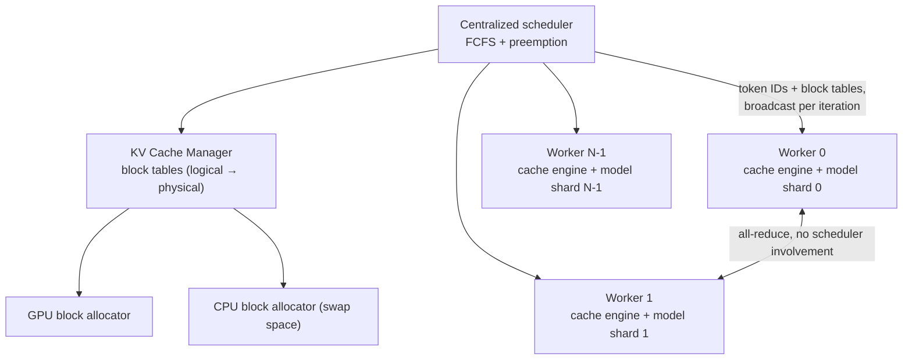

**The KV cache manager** is the virtual memory system. A request's KV cache is a series of
**logical KV blocks**, filled left to right as tokens are generated, with the last block's unfilled
positions reserved for future generation. On each GPU worker a **block engine** allocates a
contiguous chunk of GPU DRAM and divides it into **physical KV blocks** (the same is done on CPU
RAM for swapping). **Block tables** map logical to physical blocks per request, each entry
recording the physical block and **the number of filled positions**.

**Separating logical from physical blocks is what removes the waste** — the cache can grow
dynamically without reserving anything for positions that may never be used.

### Decoding walkthrough

For a 7-token prompt with block size 4:

1. **Prefill.** vLLM reserves only the blocks needed for the prompt — 2 logical blocks mapped to
   physical blocks 7 and 1. Prompt KV cache and the first output token are computed with a
   **conventional attention kernel**; 4 tokens go in logical block 0, 3 in logical block 1, and
   **one slot remains free**.
2. **First decode step.** PagedAttention runs over physical blocks 7 and 1. The new token's KV cache
   fills the free slot; the block table's `#filled` is updated. **No allocation.**
3. **Second decode step.** The last logical block is now full, so vLLM **allocates a new physical
   block (3)** and records the mapping.

Per iteration globally: select candidate sequences for the batch, allocate physical blocks for
newly needed logical blocks, **concatenate all input tokens across requests into one sequence**
(all prompt tokens for prefill requests, the latest token for generation requests), run the model,
and write new KV cache into physical blocks.

**Why block size > 1 matters:** storing multiple tokens per block lets the kernel **process more
positions in parallel**, raising hardware utilization and cutting latency — but **larger blocks
increase fragmentation**. This is the central tuning knob (see ablations).

Because blocks fill left to right and a new one is allocated only when the previous is full,
**all memory waste for a request is confined to a single block.**

## Applying it to decoding algorithms

### Parallel sampling — reference counting and copy-on-write

Multiple samples from one prompt can **share the prompt's KV cache**. vLLM maps both sequences'
logical prompt blocks to the **same physical blocks**, tracked by a **reference count** per physical
block.

At generation the samples diverge, so vLLM applies **copy-on-write at block granularity**, exactly
as an OS does on `fork`: when sample A1 writes to a shared block whose refcount > 1, vLLM allocates
a new physical block, **copies the contents**, and decrements the refcount. When A2 later writes,
the refcount is already 1, so it **writes in place**.

Net effect: **the entire prompt is shared except the final logical block** — a large saving
**especially for long prompts**.

### Beam search — where the OS analogy pays most

Beam search keeps the top-*k* candidates each step, expanding each and retaining the *k* most
probable of *k·|V|* candidates. Unlike parallel sampling, it shares **not only prompt blocks but
blocks among candidates, with patterns that change dynamically** — "similar to the process tree in
the OS created by compound forks."

The paper's *k*=4 example: all candidates share block 0 (the prompt); candidate 3 diverges at the
second block; candidates 0–2 share three blocks and diverge at the fourth. When the next top-4 all
descend from candidates 1 and 2, **candidates 0 and 3's logical blocks are freed, refcounts drop,
and vLLM frees every physical block whose count hits 0**, then allocates new ones for the new
candidates.

The contrast with prior systems is stark: **they require frequent large memory copies of KV cache
between beam candidates** — in this example candidate 3 would have to copy most of candidate 2's
cache to continue. In vLLM, **most blocks are simply shared, and copy-on-write fires only when a
new token lands inside an old shared block — copying exactly one block.**

### Shared prefix — the shared library analogy

System prompts (instructions plus few-shot examples) are prepended to many requests. vLLM lets the
service provider **reserve physical blocks for predefined shared prefixes, exactly as an OS handles
a shared library across processes**. A request with that prefix simply **maps its logical blocks to
the cached physical blocks** (last block marked copy-on-write), and **the prefill computation only
runs on the user's task input**.

### Mixed decoding methods

Requests using *different* decoding algorithms can be batched together — something existing systems
**cannot** do efficiently. The reason is architectural: **the block table is a mapping layer that
hides all sharing**, so "the LLM and its execution kernel only see a list of physical block IDs for
each sequence and do not need to handle sharing patterns across sequences." That widens batching
opportunities and raises overall throughput.

## Scheduling and preemption

Policy is **first-come-first-serve** for fairness and starvation avoidance; when preemption is
needed, **the latest-arrived requests are preempted first**.

Two classic questions arise, and vLLM answers both with LLM-specific knowledge:

**Which blocks to evict?** Generic policies guess which block will be used furthest in the future.
vLLM doesn't need to guess: **all blocks of a sequence are always accessed together**, so it uses
**all-or-nothing eviction** — evict every block of a sequence or none. Further, sequences within
one request (e.g. beam candidates) form a **sequence group** that is **gang-scheduled**, always
preempted and rescheduled together, because they may share memory.

**How to recover evicted blocks?** Two mechanisms:

- **Swapping** — copy evicted blocks to CPU RAM, managed by the CPU block allocator. Once vLLM
  preempts a sequence it **stops accepting new requests until all preempted sequences complete**;
  as requests finish, preempted blocks are brought back. A neat property: **the number of blocks
  swapped out never exceeds the total physical GPU blocks**, so **CPU swap space is bounded by the
  GPU KV cache size**.
- **Recomputation** — simply recompute the KV cache on reschedule. Crucially, **this is much cheaper
  than the original generation**, because the tokens generated so far can be **concatenated with the
  original prompt and processed as one prefill iteration** rather than one token at a time. (The
  paper notes this option **is not available to an OS** — a case where application semantics beat
  the generic mechanism.)

## Distributed execution

vLLM supports **Megatron-LM style tensor model parallelism** with an SPMD schedule: linear layers do
block-wise matrix multiplication, GPUs synchronize via **all-reduce**, and **attention is split
along the attention-head dimension** so each process handles a subset of heads.

The key observation: **every model shard processes the same input tokens and therefore needs KV
cache for the same positions.** So vLLM keeps **a single KV cache manager in the centralized
scheduler**, shared by all workers along with one logical→physical mapping. **Workers share physical
block IDs but each stores only the KV cache for its own attention heads.**

Per step: the scheduler prepares input token IDs and block tables per request, **broadcasts this
control message**, workers execute and read KV cache per the block table, **synchronize intermediate
results by all-reduce without scheduler involvement**, and return sampled tokens. The result is
that **workers never synchronize on memory management** — they receive everything they need at the
start of each iteration.

## Implementation

**8.5K lines of Python and 2K lines of C++/CUDA**, with a FastAPI frontend extending the OpenAI API
so users set per-request sampling parameters. Control components (scheduler, block manager) are
Python; custom CUDA kernels handle the hot paths. Models (GPT, OPT, LLaMA) use PyTorch and
Transformers; NCCL handles tensor communication.

**Three kernel-level optimizations**, all addressing overheads that paging introduces:

1. **Fused reshape and block write** — new KV cache must be split into blocks, reshaped for
   block-optimized reads, and written at block-table positions; fusing avoids multiple kernel
   launches.
2. **Fused block read and attention** — an adapted FasterTransformer attention kernel reads KV cache
   per the block table and attends on the fly, **assigning a GPU warp per block to keep memory
   access coalesced**, with support for variable sequence lengths in a batch.
3. **Fused block copy** — copy-on-write may touch many discontinuous blocks; batching them into one
   kernel launch avoids many small `cudaMemcpyAsync` calls.

**Decoding algorithms are expressed with just three primitives** — `fork`, `append`, `free` —
which is how parallel sampling, beam search, and prefix sharing are all implemented, and how the
authors expect future algorithms to be supported.

## Evaluation

### Setup

- **Models:** OPT-13B/66B/175B and LLaMA-13B, on NVIDIA A100s (GCP A2 instances).

  | Model | 13B | 66B | 175B |
  | --- | --- | --- | --- |
  | GPUs | A100 | 4×A100 | 8×A100-80GB |
  | Total GPU memory | 40 GB | 160 GB | 640 GB |
  | Parameter size | 26 GB | 132 GB | 346 GB |
  | **Memory for KV cache** | **12 GB** | **21 GB** | **264 GB** |
  | Max KV cache slots | 15.7K | 9.7K | 60.1K |

- **Workloads:** synthesized from **ShareGPT** (real ChatGPT conversations) and **Alpaca**
  (GPT-3.5-generated instructions). **ShareGPT has 8.4× longer prompts and 5.8× longer outputs on
  average, with higher variance.** Arrival times generated by a Poisson process at varying rates.
- **Metric:** **normalized latency** — mean end-to-end latency divided by output length (following
  Orca). A good system keeps this low as request rate rises. 1-hour traces (15 minutes for OPT-175B,
  for cost).
- **Baselines:**
  - **FasterTransformer** — latency-optimized; has no scheduler, so the authors added dynamic
    batching similar to Triton, taking up to *B* earliest requests.
  - **Orca** — the throughput-optimized state of the art, not publicly available, so
    **reimplemented** with buddy allocation, in **three variants** bracketing its behavior:
    **Oracle** (knows true output lengths — an unachievable upper bound), **Pow2** (over-reserves by
    at most 2×), and **Max** (always reserves the model maximum, 2048 tokens).

### Basic sampling

| Comparison | ShareGPT |
| --- | --- |
| vs. **Orca (Oracle)** | **1.7×–2.7×** higher sustainable request rate |
| vs. **Orca (Max)** | **2.7×–8×** |
| vs. **FasterTransformer** | **up to 22×** |

The mechanism is visible directly in batch size: for OPT-13B, vLLM processes **2.2× more requests
concurrently than Orca (Oracle) and 4.3× more than Orca (Max)**.

The latency curves all show the same shape — gradual increase, then a sudden explosion once the
request rate exceeds capacity and the queue grows without bound.

**The one place vLLM's advantage narrows** is OPT-175B on Alpaca: that configuration has **264 GB
for KV cache** while Alpaca sequences are short, so even wasteful allocators batch plenty of
requests — **the system becomes compute-bound rather than memory-bound**. This is the honest boundary
of the technique.

### Parallel sampling and beam search

Sharing pays more as sharing opportunities grow. On OPT-13B/Alpaca, the advantage over Orca (Oracle)
rises **from 1.3× in basic sampling to 2.3× in beam search with width 6**.

**Measured memory saved by sharing** (blocks saved ÷ blocks without sharing):

| Workload | Parallel sampling | Beam search |
| --- | --- | --- |
| Alpaca | 6.1%–9.8% | **37.6%–55.2%** |
| ShareGPT | 16.2%–30.5% | **44.3%–66.3%** |

Longer prompts share more — exactly as the design predicts.

### Shared prefix

LLaMA-13B on WMT16 English→German translation, with a synthesized instruction prefix:

- **One-shot prefix (80 tokens): 1.67× higher throughput** than Orca (Oracle).
- **Five-shot prefix (341 tokens): 3.58×.**

### Chatbot

Chat history plus the latest query concatenated into a prompt, from ShareGPT, truncated to the last
1024 tokens with up to 1024 generated. **vLLM sustains 2× the request rate of all three Orca
baselines** — and notably **all three Orca variants behave identically here**, because with
1024-token prompts buddy allocation reserves 1024 output slots regardless of how well it predicts
output length.

## Ablations

**Kernel overhead.** PagedAttention's block table access, extra branches, and variable-length
handling cost **20–26% higher attention kernel latency** than FasterTransformer's highly optimized
kernel. The authors argue this is acceptable because **it affects only the attention operator, not
Linear layers or others** — and end-to-end vLLM still dominates.

**Block size.** Too small underutilizes GPU parallelism; too large increases internal fragmentation
and reduces sharing probability.

- **ShareGPT:** block sizes **16–128** all perform well.
- **Alpaca:** **16 and 32** work; larger sizes **significantly degrade** performance because
  sequences become shorter than the block.
- **vLLM's default is 16** — "large enough to efficiently utilize the GPU and small enough to avoid
  significant internal fragmentation in most workloads."

**Recomputation vs. swapping.**

- **Swapping degrades badly at small block sizes**, because many small CPU↔GPU transfers **cannot
  saturate PCIe bandwidth**.
- **Recomputation cost is constant across block sizes**, since it doesn't touch KV blocks at all.
- So **recomputation wins for small blocks, swapping for large ones**, and **recomputation overhead
  never exceeds 20% of swapping's latency**.
- **For medium blocks (16–64) the two are comparable end to end.**

## Discussion: where this generalizes, and where it doesn't

The authors are unusually explicit about scope. Virtual memory and paging work here because the
workload **needs dynamic allocation (output length unknown) and is bound by GPU memory capacity**.
Neither holds generally:

- **DNN training** has static tensor shapes, so allocation can be optimized ahead of time.
- **Serving non-LLM DNNs** is typically **compute-bound**, so better memory efficiency buys nothing —
  and vLLM's techniques would **degrade performance** through memory indirection and non-contiguous
  access.

They also enumerate the **LLM-specific augmentations to the OS idea**, which is where the paper's
craft lies:

- **All-or-nothing swap-out**, exploiting the fact that a request needs all its token states
  resident;
- **Recomputation as a recovery mechanism**, which "is not feasible in OS";
- **Fusing the memory-access kernels with attention** to mitigate indirection overhead.

## Positioning against related work

- **General model serving systems** — Clipper, TensorFlow Serving, Nexus, InferLine, Clockwork, and
  more recently DVABatch (multi-entry multi-exit batching), REEF and Shepherd (preemption),
  AlpaServe (model parallelism for statistical multiplexing) — all **fail to account for the
  autoregressive property and token state of LLM inference**, missing these optimizations entirely.
- **Orca is complementary, not competing.** "Orca achieves it by scheduling and interleaving the
  requests so that more requests can be processed in parallel, while vLLM is doing so by increasing
  memory utilization so that the working sets of more requests fit into memory." Better still,
  **fine-grained interleaving makes memory management harder, which makes vLLM's techniques more
  necessary, not less.**
- **Memory optimizations elsewhere:** swapping and recomputation are standard for reducing peak
  training memory. **FlexGen** swaps weights and token states for LLM inference under limited GPU
  memory but **does not target online serving**. **OLLA** optimizes tensor lifetime and location to
  reduce fragmentation but does **no fine-grained block-level management or online serving**.
  **FlashAttention** uses tiling and kernel optimizations to reduce attention's peak memory and I/O.
  The novel contribution here is **block-level memory management in the context of online serving.**

## Limitations and questions

- **Attention kernel is 20–26% slower** than the best contiguous-memory implementation. The bet is
  that batch size gains dominate — true when memory-bound, false otherwise.
- **The advantage vanishes when the workload is compute-bound**, demonstrated by the authors
  themselves on OPT-175B with short Alpaca sequences.
- **Orca is reimplemented, not measured.** The three variants (Oracle/Pow2/Max) are a fair attempt to
  bracket real behavior, but **Oracle is explicitly infeasible in practice**, so the honest headline
  comparison is against a baseline stronger than anything deployable.
- **Preemption is coarse and conservative:** once vLLM preempts, it **stops admitting new requests
  until all preempted sequences complete** — simple and starvation-free, but a throughput cliff under
  sustained overload.
- **FCFS only.** No priority, no SLO awareness, no fairness across tenants.
- **Block size is a single global constant** (16), though the ablation shows the optimum is
  workload-dependent (ShareGPT tolerates up to 128, Alpaca degrades past 32).
- **Sharing is limited to identical prefixes at block granularity** — a prefix that diverges mid-block
  cannot share that block, and the shared-prefix feature requires the operator to **pre-register**
  prefixes rather than discovering them.
- **Swap space is CPU RAM only**, and swapping is bandwidth-limited at small block sizes.
- **No accuracy impact**, which the paper states clearly — this is a pure systems result.

## Practical design checklist

The technique applies when:

- the workload allocates memory **dynamically with unpredictable lifetimes**;
- performance is **memory-capacity-bound**, not compute-bound;
- multiple consumers have **substantial shareable state** (common prompts, beam candidates, system
  prompts);
- you control the kernel and can **fuse indirection into existing memory operations**.

It does not apply when:

- shapes are static and allocation can be planned ahead (training);
- the workload is compute-bound, where indirection is pure overhead;
- there is nothing to share, and fragmentation is already low.

## Takeaways

1. **The bottleneck was allocation policy, not the model or the kernel.** 60–80% of KV cache memory
   was being wasted; recovering it was worth 2–4× throughput without touching model quality.
2. **Old OS ideas transfer when the problem shape matches.** Dynamic, unpredictable lifetimes plus a
   hard capacity limit is exactly what virtual memory was invented for — and paging, page tables,
   reference counting, and copy-on-write all mapped over essentially unchanged.
3. **Fixed-size blocks kill external fragmentation by construction** and bound internal
   fragmentation to one block per sequence. The whole waste taxonomy collapses to a single small
   remainder.
4. **Indirection buys sharing, and sharing is the second-order win.** Reference-counted blocks turn
   beam search from a memory-copy-heavy algorithm into a pointer-manipulation one — 37–66% memory
   saved.
5. **A mapping layer decouples policy from mechanism.** Because the kernel only ever sees physical
   block IDs, vLLM can batch requests using *different* decoding algorithms together — a capability
   competitors structurally cannot offer.
6. **Adapt the generic mechanism with application semantics.** All-or-nothing eviction (you know
   access patterns), gang scheduling of sequence groups (you know the sharing), and recomputation as
   a swap alternative (you can regenerate state) are all things an OS cannot do — and all three
   matter.
7. **Pay a local cost for a global win, and measure both.** A 20–26% slower attention kernel is
   worth it when it lets you batch 2–4× more requests — but the paper is careful to show the regime
   (compute-bound) where that trade stops paying.
8. **Complementary beats competitive.** vLLM's clearest framing is that it and Orca solve different
   halves of the same utilization problem — and that solving one makes the other more valuable.

## Citation

```bibtex
@inproceedings{kwon2023vllm,
  author = {Woosuk Kwon and Zhuohan Li and Siyuan Zhuang and Ying Sheng and Lianmin Zheng and
            Cody Hao Yu and Joseph E. Gonzalez and Hao Zhang and Ion Stoica},
  title = {Efficient Memory Management for Large Language Model Serving with {PagedAttention}},
  booktitle = {Proceedings of the 29th Symposium on Operating Systems Principles (SOSP '23)},
  year = {2023},
  doi = {10.1145/3600006.3613165}
}
```
