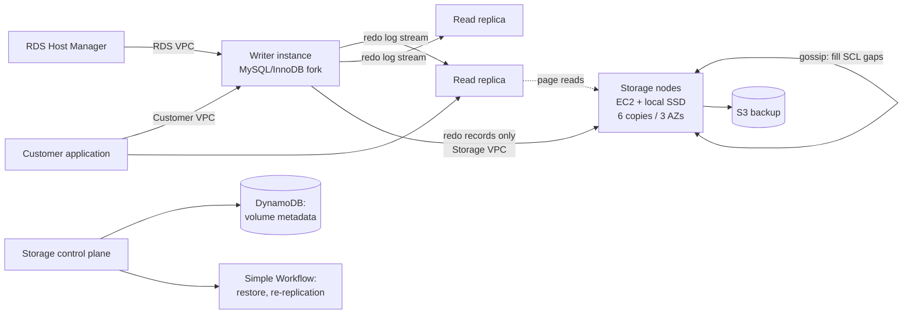

# Amazon Aurora: Design Considerations for High Throughput Cloud-Native Relational Databases

> SIGMOD 2017 Industrial Track — structured reading notes

Full paper content: [Markdown conversion](../original/aurora-sigmod-2017.md)

## Paper information

- **Authors:** Alexandre Verbitski, Anurag Gupta, Debanjan Saha, Murali Brahmadesam, Kamal
  Gupta, Raman Mittal, Sailesh Krishnamurthy, Sandor Maurice, Tengiz Kharatishvili, Xiaofeng Bao
- **Affiliation:** Amazon Web Services
- **Venue:** SIGMOD 2017, Chicago, IL, USA, pages 1041–1052
- **DOI:** [10.1145/3035918.3056101](https://doi.org/10.1145/3035918.3056101)
- **Keywords:** databases, distributed systems, log processing, quorum models, replication,
  recovery, performance, OLTP

## One-sentence summary

Aurora moves the "lower quarter" of a MySQL/InnoDB kernel — redo logging, durable storage,
crash recovery, and backup — into a multi-tenant scale-out storage service, so that the only
data crossing the network is the redo log, which cuts network IOPS by roughly an order of
magnitude and makes recovery, backup, and replication nearly free side effects.

## Problem

Once compute and storage are decoupled in the cloud, the bottleneck is no longer the disk. I/Os
spread across a large multi-tenant fleet, so no individual disk or node is hot. The bottleneck
moves to **the network between the database tier and the storage tier**, measured in both
packets per second (PPS) and bandwidth. Three effects make this worse:

1. **Write amplification.** A performant database issues writes to the storage fleet in
   parallel; replication multiplies them further.
2. **Outlier domination.** The slowest storage node, disk, or network path determines response
   time (the "tail at scale" effect).
3. **Synchronous stalls.** Buffer-cache misses block the reading thread; a miss may also force
   eviction and flush of a dirty page. Checkpointing and dirty-page writing reduce the penalty
   but cause their own stalls, context switches, and contention.

Transaction commits add another source of interference. Multi-phase protocols such as 2PC are
intolerant of failure and high-latency, which is a bad fit for a cloud-scale system with a
continual "background noise" of hard and soft failures.

### What a mirrored MySQL actually writes

The paper's baseline is an active-standby MySQL across two AZs, each on EBS with an AZ-local
mirror. Per user write, the engine must write:

- the redo log,
- the binary (statement) log archived to S3 for point-in-time restore,
- the modified data pages,
- a second temporary copy of the data page (the **double-write buffer**, to prevent torn pages),
- the metadata (FRM) files.

The I/O flow is: (1,2) write to primary EBS, which mirrors AZ-locally and acknowledges when
both are done; (3) synchronous block-level mirroring to the standby instance; (4,5) write to
standby EBS and its mirror. Steps 1, 3, and 5 are **sequential and synchronous**, so latency is
additive and jitter is amplified. From a distributed-systems view this is effectively a **4/4
write quorum** — maximally vulnerable to any single slow or failed participant.

## Durability at scale

### Why 2/3 quorums are inadequate

Standard quorum rules (Gifford): with `V` votes, a read quorum `Vr` and write quorum `Vw` must
satisfy `Vr + Vw > V` (reads intersect the latest write) and `Vw > V/2` (writes are aware of the
most recent write). The common configuration is `V = 3`, `Vw = 2`, `Vr = 2`, one replica per AZ.

The flaw: individual node/disk failures are *uncorrelated* across AZs, but an **AZ failure is a
correlated failure of every node in that AZ**. In a large fleet there is always some background
noise of failures under repair. If AZ C is lost while a replica in AZ A or B is concurrently
failed, two of three copies are gone and the system cannot tell whether the survivor is current.
Quorums must therefore tolerate an AZ failure *plus* concurrent background failures.

### Aurora's 6-way quorum

Design point: tolerate (a) losing an entire AZ **and one additional node** (AZ+1) without losing
data, and (b) losing an entire AZ without losing write availability.

| Parameter | Value |
| --- | --- |
| Replicas (V) | 6, across 3 AZs, 2 per AZ |
| Write quorum (Vw) | 4/6 |
| Read quorum (Vr) | 3/6 |

- Lose an AZ + 1 node (3 nodes) → still have read availability.
- Lose any 2 nodes (including a whole AZ) → still have write availability.
- Retaining read quorum is what allows rebuilding write quorum by adding replica copies.

### Segmented storage: attacking MTTR, not MTTF

Sufficient durability requires the probability of an uncorrelated double fault within the repair
window to be low. Past a point you cannot reduce MTTF, so Aurora reduces **MTTR**:

- The volume is partitioned into fixed-size **segments**, currently **10 GB**.
- Each segment is replicated 6 ways into a **Protection Group (PG)**: six 10 GB segments, two
  in each of three AZs.
- A storage volume is a concatenated set of PGs, allocated as the volume grows; volumes scale
  to **64 TB** unreplicated.
- Storage nodes are EC2 VMs with attached SSDs.

A 10 GB segment repairs in **~10 seconds** on a 10 Gbps link. Losing quorum requires two
independent failures within the same 10-second window *plus* an AZ failure not containing
either — sufficiently unlikely at the observed failure rates.

### Operational payoff

A system resilient to long failures is automatically resilient to short ones, which converts
availability engineering into routine operations:

- **Heat management:** mark a segment on a hot disk/node bad; quorum repair migrates it to a
  colder node.
- **OS and security patching:** just a brief unavailability event for that storage node.
- **Software upgrades:** rolled out one AZ at a time, never more than one PG member at once —
  enabling agile, rapid deployment of the storage fleet.

## The log is the database

### Offloading redo processing

In Aurora, **the only writes that cross the network are redo log records**. No pages are ever
written from the database tier — not for background writes, not for checkpointing, not for
cache eviction. The log applicator is pushed down to the storage tier, which generates pages in
the background or on demand.

Key framing: *the log is the database*, and materialized pages are merely a **cache of log
applications**. Background materialization is optional for correctness. Note the contrast with
checkpointing:

| | Governed by |
| --- | --- |
| Traditional checkpointing | Length of the **entire** redo log chain |
| Aurora page materialization | Length of the chain **for that one page** |

Only pages with long modification chains need rematerialization.

### Write flow

The primary writes log records to storage and streams the same log records plus metadata
updates to read replicas. Fully ordered log records are **batched by common destination** (a
logical segment, i.e. a PG) and delivered to all 6 replicas; the engine waits for **4 of 6**
acknowledgements before considering the records durable (*hardened*). Replicas use the redo
records to update their own buffer caches.

### Measured network savings

SysBench write-only, 100 GB data set, 30 minutes, r3.8xlarge:

| Configuration | Transactions | IOs/Transaction |
| --- | ---: | ---: |
| Mirrored MySQL | 780,000 | 7.4 |
| Aurora with replicas | 27,378,000 | 0.95 |

Aurora sustained **35× more transactions** with **7.7× fewer I/Os per transaction** at the
database node — despite 6× replication amplification, and without counting EBS chain replication
or MySQL's cross-AZ writes. Each storage node sees unamplified writes (it is one of six copies),
so the storage tier processes **46× fewer I/Os**.

### Storage node work: only two steps are foreground

Per storage node, the activities are:

1. Receive log record, add to an in-memory queue.
2. **Persist record on disk and acknowledge.**
3. Organize records and identify gaps (some batches may be lost).
4. Gossip with PG peers to fill gaps.
5. Coalesce log records into new data pages.
6. Periodically stage log and new pages to S3.
7. Periodically garbage collect old versions.
8. Periodically validate page CRCs.

Only steps **1 and 2** are in the foreground latency path. Everything else is asynchronous.

The design tenet is to minimize foreground write latency and trade CPU for disk. Because peak
foreground demand exceeds average, there is ample slack for background work. Critically,
background processing has **negative correlation** with foreground load in Aurora (e.g. GC only
runs when not busy, unless the disk nears capacity), versus **positive correlation** in a
traditional database where checkpointing and page flushing intensify exactly when load is high.
If a backlog builds, foreground activity is throttled. Because segments are placed with high
entropy across nodes, one throttled node simply looks slow and is absorbed by the 4/6 quorum.

## The log marches forward: consistency without 2PC

### LSNs and the consistency points

Every log record carries a monotonically increasing **LSN** allocated by the database. Instead
of 2PC, Aurora maintains and continually advances points of consistency and durability as
storage acknowledgements arrive.

| Term | Meaning |
| --- | --- |
| **LSN** | Log Sequence Number, monotonically increasing, allocated by the database |
| **SCL** — Segment Complete LSN | Greatest LSN below which a segment has received **all** PG log records |
| **VCL** — Volume Complete LSN | Highest LSN for which storage can guarantee availability of all prior records |
| **CPL** — Consistency Point LSN | A log record the database tags as a legal truncation point |
| **VDL** — Volume Durable LSN | Highest CPL ≤ VCL; everything above VDL is truncated on recovery |
| **LAL** — LSN Allocation Limit | Max distance (currently **10 million**) LSN allocation may run ahead of VDL |
| **PGMRPL** — PG Min Read Point LSN | Low-water mark below which a PG's log records are unnecessary |

**Completeness ≠ durability.** If storage has complete data through LSN 1007 but the database
declared CPLs only at 900, 1000, and 1100, truncation happens at 1000. The volume is *complete*
to 1007 but only *durable* to 1000.

CPLs come from InnoDB's mini-transaction structure:

1. Each database transaction is split into ordered **mini-transactions (MTRs)** that must be
   applied atomically.
2. Each MTR is multiple contiguous log records.
3. The **final log record of an MTR is a CPL**.

A client with no need for this distinction can simply mark every record as a CPL.

### Gap filling via backlinks

Each segment of a PG sees only the subset of log records affecting its pages. Each log record
carries a **backlink** to the previous record for that PG. Following backlinks establishes the
SCL, and storage nodes gossip SCLs with each other to find and exchange missing records. This
replaces a chatty recovery protocol with continuous background repair.

### Writes

As acknowledgements establish write quorum for each batch, the database advances VDL. LSN
allocation is constrained to `LSN ≤ VDL + LAL`, which prevents the database from running too far
ahead of storage and provides **back-pressure** that throttles incoming writes when storage or
network cannot keep up.

### Commits

Commits are fully **asynchronous**. The thread handling a commit records the transaction's
*commit LSN* on a waiting list and moves on to other work. The WAL-equivalent rule is: **a
commit completes if and only if VDL ≥ the transaction's commit LSN.** As VDL advances, a
dedicated thread acknowledges the qualifying waiters. Worker threads never pause for commit.

### Reads

- Pages come from the buffer cache; a miss triggers a storage read.
- Aurora never writes pages on eviction, but preserves the invariant that a cached page is
  always the latest version: **a page may only be evicted if its page LSN ≥ VDL.** This ensures
  (a) all changes in the page are hardened in the log, and (b) on a miss, requesting the page as
  of the current VDL yields the latest durable version.
- **No read quorum is needed in normal operation.** The database sets a *read-point* = VDL at
  request time, and since it tracks each segment's SCL, it knows which single segment is
  complete with respect to that read point and reads directly from it.
- The database computes a per-PG **Minimum Read Point LSN**, gossiping with read replicas to get
  the cluster-wide **PGMRPL**. Storage nodes use PGMRPL to coalesce older log records into
  materialized pages and safely garbage collect them.

Concurrency control runs entirely in the engine, exactly as if pages and undo segments were on
local disk.

### Replicas

- One writer + up to **15 read replicas** mount the same shared storage volume, so replicas add
  **no storage cost and no extra disk writes**.
- The writer's log stream is sent to replicas as well as storage. A replica applies a record if
  the page is in its buffer cache and discards it otherwise.
- Two rules: (a) only records with **LSN ≤ VDL** are applied; (b) records of a single MTR are
  applied **atomically** so the replica sees a consistent view.
- Replicas consume asynchronously; the writer acknowledges commits independently. Typical lag is
  **≤ 20 ms**.

### Recovery

Traditional ARIES-style recovery replays the redo log from the last checkpoint while the
database is offline; shrinking the checkpoint interval trades foreground interference for
recovery time. Aurora needs no such trade-off, because **the same log applicator runs
continuously, in parallel, in the background on storage nodes**.

On restart, before the database may access the volume, the storage service performs its own
recovery focused on presenting a uniform view of storage:

1. For each PG, contact a **read quorum** of segments — enough to guarantee discovery of any
   data that could have reached write quorum.
2. Recalculate VDL.
3. Generate a **truncation range** annulling every record above the new VDL, up to an end LSN
   provably at least as high as any outstanding record (provable because the database allocates
   LSNs and bounds allocation by VDL + 10 million).
4. Truncation ranges are **versioned with epoch numbers** and written durably, so an interrupted
   and restarted recovery has no ambiguity.

**Undo recovery** (unwinding in-flight transactions) still belongs to the engine, but happens
**while the database is online**, after the in-flight list is rebuilt from undo segments.

Reported result: recovery generally **under 10 seconds**, even after crashing at over 100,000
write statements per second.

## Putting it together



- **Engine:** a fork of community MySQL/InnoDB, diverging primarily in how InnoDB reads and
  writes to disk. Redo records for each MTR are batched, **sharded by PG**, and written to
  storage; the last record of each MTR is tagged as a consistency point.
- **Isolation:** exactly the same levels as community MySQL in the writer — the standard ANSI
  levels plus snapshot isolation / consistent reads. Read replicas receive continuous
  transaction start/commit information and use it to support snapshot isolation for local
  read-only transactions. Concurrency control never touches the storage service, which simply
  presents a view logically identical to local InnoDB storage.
- **Control plane:** Amazon RDS, including a **Host Manager (HM)** agent on the instance that
  monitors cluster health and decides on failover or instance replacement.
- **Network isolation:** three VPCs — **customer VPC** (application ↔ engine), **RDS VPC**
  (engine ↔ control plane), **storage VPC** (engine ↔ storage).
- **Storage control plane:** DynamoDB for cluster/volume configuration, volume metadata, and S3
  backup descriptions; Amazon Simple Workflow Service for long-running operations such as volume
  restore or re-replication after a node failure.

## Evaluation

Baseline: MySQL on instances with an EBS volume at **30K provisioned IOPS**; unless stated,
r3.8xlarge (32 vCPU, 244 GB RAM, Intel Xeon E5-2670 v2 Ivy Bridge), buffer cache 170 GB. Aurora
is based on the MySQL 5.6 code base. GA since July 2015.

### Scaling with instance size

SysBench read-only and write-only, 1 GB (250 tables), across r3.large → r3.8xlarge (each size
has half the vCPUs and memory of the next). Aurora's performance **doubles with each instance
size**. At r3.8xlarge: **121,000 writes/sec and 600,000 reads/sec**, ~5× MySQL 5.7 (which tops
out at 125,000 writes/sec and 20,000 reads/sec as reported in the paper's text).

### Throughput with varying data size (SysBench write-only, writes/sec)

| DB size | Aurora | MySQL |
| --- | ---: | ---: |
| 1 GB | 107,000 | 8,400 |
| 10 GB | 107,000 | 2,400 |
| 100 GB | 101,000 | 1,500 |
| 1 TB | 41,000 | 1,200 |

Up to **67× faster** at 100 GB; still **34× faster** at 1 TB with an out-of-cache working set.

### Scaling with user connections (SysBench OLTP, writes/sec)

| Connections | Aurora | MySQL |
| --- | ---: | ---: |
| 50 | 40,000 | 10,000 |
| 500 | 71,000 | 21,000 |
| 5,000 | 110,000 | 13,000 |

MySQL peaks near 500 connections and then **degrades sharply**; Aurora keeps scaling.

### Replica lag (SysBench write-only, milliseconds)

| Writes/sec | Aurora | MySQL |
| --- | ---: | ---: |
| 1,000 | 2.62 | < 1,000 |
| 2,000 | 3.42 | 1,000 |
| 5,000 | 3.94 | 60,000 |
| 10,000 | 5.38 | 300,000 |

Lag is measured as time until a committed transaction is visible on the replica.

### Hot row contention (Percona TPC-C variant, tpmC)

| Connections / size / warehouses | Aurora | MySQL 5.6 | MySQL 5.7 |
| --- | ---: | ---: | ---: |
| 500 / 10 GB / 100 | 73,955 | 6,093 | 25,289 |
| 5,000 / 10 GB / 100 | 42,181 | 1,671 | 2,592 |
| 500 / 100 GB / 1,000 | 70,663 | 3,231 | 11,868 |
| 5,000 / 100 GB / 1,000 | 30,221 | 5,575 | 13,005 |

*(The original table's column layout is ambiguous in the text conversion; the paper states
Aurora sustains 2.3×–16.3× the throughput of MySQL 5.7 across these points.)*

### Customer-reported results

- **Internet gaming company** (r3.4xlarge): average web transaction response time improved from
  **15 ms to 5.5 ms** (3×).
- **Education technology company:** before migration, P95 latencies of 40–80 ms versus P50 of
  ~1 ms — classic outlier behavior. After migration, P95 approximated P50 for both SELECT and
  per-record INSERT.
- **Replica lag at the same company:** spiked to **12 minutes** on MySQL, impacting application
  correctness so the replica was only usable as a standby. On Aurora, max lag across 4 replicas
  **never exceeded 20 ms**, letting them serve real traffic from replicas.

## Lessons learned (what cloud customers actually demand)

- **Multi-tenancy and consolidation.** SaaS customers who cannot change their application use
  schema-per-tenant consolidation (some have 50,000+ of their own customers), producing instances
  with **over 150,000 tables** — pressure on the dictionary cache and other metadata components.
  They need high throughput with many connections, pay-as-you-use storage provisioning, and low
  jitter so one tenant's spike does not harm others.
- **Highly concurrent auto-scaling workloads.** Traffic spikes (one customer had a national TV
  appearance) require handling many concurrent connections; several customers run at **over
  8,000 connections per second**.
- **Schema evolution.** ORM-driven frameworks like Rails generate frequent "DB migrations" —
  DBAs report "a few dozen migrations a week" — and MySQL implements most changes with a full
  table copy. Aurora implements online DDL that (a) **versions schemas per page** and decodes
  pages on demand using their schema history, and (b) **lazily upgrades pages** with a
  modify-on-write primitive.
- **Availability and software upgrades.** Even 30 seconds of planned downtime every ~6 weeks is
  unacceptable to many customers. **Zero-Downtime Patching (ZDP)** finds an instant with no
  active transactions, spools application state to local ephemeral storage, patches the engine,
  and reloads the state — in-flight connections and user sessions survive, unaware the engine
  changed.

## Positioning against related work

- **Decoupling storage from compute.** Deuteronomy (Transaction Component / Data Component over
  LLAMA), Sinfonia, Hyder, and Yesquel all split the kernel. **Aurora decouples at a lower
  level:** query processing, transactions, concurrency, buffer cache, and access methods stay in
  the engine; only logging, storage, and recovery become a scale-out service.
- **Distributed systems.** Aurora sidesteps the HAT impossibility results (serializability,
  snapshot isolation, and repeatable read are not highly-available-transaction compliant) by a
  **simplifying assumption: at any time a single writer generates log updates with LSNs from one
  ordered domain.** Contrast with Spanner, which achieves external consistency at global scale
  but relies on 2PC and 2PL for read/write transactions.
- **Log-structured storage.** Like Deuteronomy/LLAMA/Bw-Tree, Aurora writes deltas rather than
  whole pages and uses **pure redo logging** with a highest-stable-LSN commit rule.
- **Recovery.** Unlike Deuteronomy — which avoids redo recovery by delaying transactions so only
  committed updates reach durable storage, at the cost of constraining transaction size — Aurora
  keeps undo in the engine and distributes redo application across the fleet.

## Limitations and questions

- **Single writer.** The clean asynchronous consensus depends on one writer allocating LSNs from
  a single ordered domain. Multi-writer is outside this paper's design.
- **Undo is still centralized.** Only redo is offloaded; undo recovery and concurrency control
  remain in the engine, so long-running in-flight transactions still matter at failover.
- **The storage service is purpose-built and proprietary.** The reported gains are inseparable
  from AWS's AZ structure, EC2/EBS/S3/DynamoDB substrate, and internal failure statistics.
- **Benchmarks are vendor-authored.** Aurora is compared against community MySQL on EBS, which
  the authors also operate; the MySQL configuration choices (30K provisioned IOPS, buffer cache
  sizing) materially affect the ratios.
- **MTTR argument depends on fleet-specific failure rates.** "Two failures in a 10-second
  window plus an AZ failure" is unlikely at Amazon's observed rates; the same reasoning does not
  automatically transfer to a smaller or differently structured fleet.
- **Read replica staleness is real but small.** Replicas apply only up to VDL and lag ~20 ms;
  applications needing read-your-writes must account for this.

## Practical design checklist

Aurora's approach fits when:

- the workload is OLTP with a single writer and read-heavy scale-out needs;
- network I/O, not disk, is the binding constraint;
- recovery time and checkpoint interference are operational pain points;
- durability must survive correlated (whole-AZ) failures, not just independent node loss.

The approach is less applicable when:

- multiple concurrent writers are required;
- the storage layer cannot be co-designed with the engine (the log applicator must understand
  page formats);
- the deployment lacks the fleet scale that makes segment-level repair fast and quorum entropy
  effective.

## Takeaways

1. **Write only the log over the network.** Pages are derivable; log records are not. This is
   the single highest-leverage decision in the design.
2. **Make replication cheap enough to over-replicate.** Saving network bytes funds 6-way
   replication and parallel requests that hide jitter.
3. **Design quorums against correlated failure domains, not just node counts.** 4/6 across 3 AZs
   beats 2/3 because it survives an AZ loss plus background noise.
4. **Reduce MTTR instead of chasing MTTF.** Small (10 GB) segments make repair a 10-second
   operation, which shrinks the double-fault vulnerability window.
5. **Replace synchronous consensus with monotone progress points.** VCL/VDL/SCL advancing on
   acknowledgements, plus peer gossip to fill gaps, achieves the same guarantee as 2PC without
   its latency or failure intolerance.
6. **Separate completeness from durability.** CPLs let the storage system truncate only at
   points the engine declares atomic, which is what makes MTR semantics survive a crash.
7. **Push background work into the anti-correlated slack.** Aurora's GC and coalescing back off
   when foreground load is high — the opposite of checkpointing's behavior.
8. **A resilient design is an operational tool.** Once quorum repair is routine, heat management,
   patching, and rolling upgrades all become the same mechanism.

## Citation

```bibtex
@inproceedings{verbitski2017aurora,
  author = {Alexandre Verbitski and Anurag Gupta and Debanjan Saha and Murali Brahmadesam and
            Kamal Gupta and Raman Mittal and Sailesh Krishnamurthy and Sandor Maurice and
            Tengiz Kharatishvili and Xiaofeng Bao},
  title = {Amazon Aurora: Design Considerations for High Throughput Cloud-Native Relational
           Databases},
  booktitle = {Proceedings of the 2017 ACM International Conference on Management of Data
               (SIGMOD '17)},
  pages = {1041--1052},
  year = {2017},
  doi = {10.1145/3035918.3056101}
}
```
