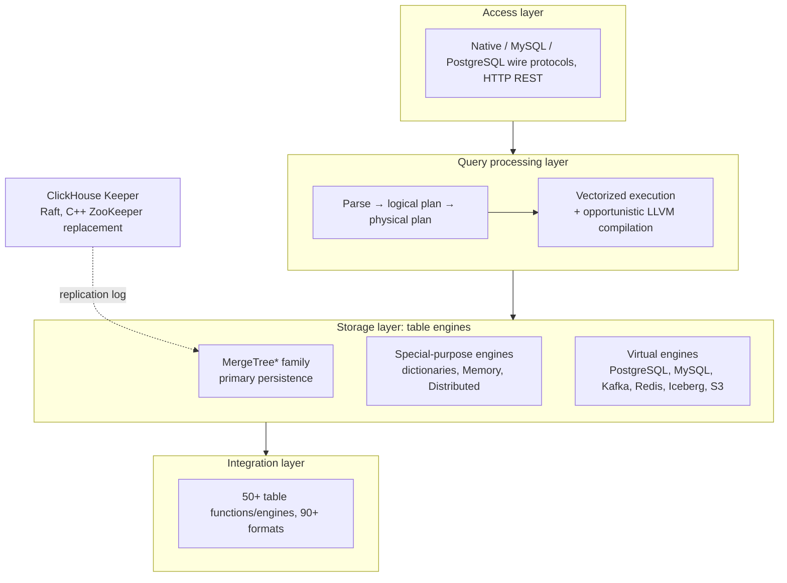

# ClickHouse: Lightning Fast Analytics for Everyone

> VLDB 2024 — structured reading notes

Full paper content: [Markdown conversion](../original/clickhouse-vldb-2024.md)

## Paper information

- **Authors:** Robert Schulze, Tom Schreiber, Ilya Yatsishin, Ryadh Dahimene, Alexey Milovidov
- **Affiliation:** ClickHouse Inc.
- **Venue:** Proceedings of the VLDB Endowment, Volume 17, Number 12, 2024, pages 3731–3744
- **DOI:** [10.14778/3685800.3685802](https://doi.org/10.14778/3685800.3685802)
- **History:** started 2009 as a filter/aggregation operator for web-scale log data; open sourced
  2016

## One-sentence summary

ClickHouse is a columnar OLAP database built as a single dependency-free C++ binary that pairs
an LSM-inspired but flat "parts" storage layer — where background merges also *transform* data
(replace, aggregate, age out) — with a vectorized, optionally LLVM-compiled execution engine and
extremely aggressive pruning, so that petabyte-scale tables answer queries in real time.

## The five challenges it targets

1. **Huge data sets with high ingestion rates.** Needs efficient indexing, compression, and
   scale-out (single servers cap at a few dozen TB), plus the ability to continuously
   "deprioritize" (aggregate, archive) historical data without slowing concurrent reporting.
2. **Many simultaneous queries with low-latency expectations.** Ad-hoc queries need good
   optimization; recurring queries invite adapting the physical layout. Resource access (CPU,
   memory, disk and network I/O) must be prioritizable across many concurrent queries.
3. **Diverse landscapes of data stores, locations, and formats.** Must read and write external
   data in essentially any system or format.
4. **Convenient query language with performance introspection.** An expressive SQL dialect with
   nested types and rich function libraries, plus tooling to introspect system and query
   performance.
5. **Industry-grade robustness and versatile deployment.** Replication against node failure; run
   on anything from an old laptop to a big server; deployed as a **native binary** to avoid JVM
   garbage-collection overhead and enable bare-metal SIMD.

## Architecture



Orthogonal components handle threading, caching, role-based access control, backups, and
continuous monitoring. Query languages: a feature-rich SQL dialect, PRQL, or Kusto's KQL.

### Table engine categories

| Category | Purpose | Examples |
| --- | --- | --- |
| **MergeTree\*** | Primary persistence format; LSM-inspired sorted parts merged in the background; variants differ in *how* the merge combines rows | MergeTree, ReplacingMergeTree, AggregatingMergeTree, ReplicatedMergeTree\* |
| **Special-purpose** | Speed up or distribute execution | **Dictionaries** (in-memory key-value caches of a periodically re-executed query — big latency win where staleness is tolerable), Memory engine for temp tables, **Distributed** engine for transparent sharding |
| **Virtual** | Bidirectional exchange with external systems | PostgreSQL, MySQL, Kafka, RabbitMQ, Redis, Iceberg, Delta Lake, Hudi, S3, GCS |

### Sharding and replication

- **Sharding** partitions a table by a sharding expression into mutually independent tables
  typically on different nodes. Clients may address shards directly or use the **Distributed**
  engine for a global view. Purpose: exceed single-node capacity (a few dozen TB) and balance
  read/write load.
- **Replication** is orthogonal: each MergeTree\* engine has a **ReplicatedMergeTree\***
  counterpart using **multi-master coordination over Raft**, implemented by **Keeper** — a
  drop-in ZooKeeper replacement written in C++.

### Deployment modes

| Mode | Description |
| --- | --- |
| **On-premise** | Single server or multi-node cluster with sharding/replication (the paper's focus) |
| **Cloud** | ClickHouse Cloud, a fully managed autoscaling DBaaS (architecture deferred to a follow-up paper) |
| **Standalone** | CLI utility for analyzing/transforming files — a SQL alternative to `cat`/`grep`, no configuration, single server only |
| **In-process (chDB)** | DuckDB-inspired embedding into a host process (Jupyter + Pandas), passing source and result data without copying since they share an address space |

## Storage layer

### On-disk format

- A table is a collection of **immutable parts**. Every INSERT creates a part. Parts are
  **self-contained**: they carry all metadata needed to interpret their contents, with no
  central catalog lookup.
- A background merge job combines smaller parts into larger ones until a configurable size cap
  (**150 GB** by default). Because parts are sorted by primary key, merging is **k-way merge
  sort**. Source parts are marked inactive and deleted once their reference count reaches zero.
- **Critical divergence from classic LSM trees:** ClickHouse treats **all parts as equal**
  instead of arranging them in levels. Merges are not confined to a level. This also forgoes the
  implicit chronological ordering of parts, which is why updates and deletes cannot use
  tombstones (see below). ClickHouse also **writes inserts directly to disk** rather than through
  a write-ahead log.

**Insert modes:**

| Mode | Behavior |
| --- | --- |
| **Synchronous** | Each INSERT creates a part; clients are encouraged to batch (e.g. 20,000 rows) to keep merge overhead low |
| **Asynchronous** | The server buffers rows from multiple INSERTs into the same table and creates a part only when the buffer exceeds a threshold or a timeout expires — for observability workloads with thousands of agents sending tiny payloads |

**Physical layout hierarchy:**

| Unit | Size | Role |
| --- | --- | --- |
| **Part** | directory, one file per column (small parts < 10 MB store columns consecutively in one file for spatial locality) | Unit of insert, merge, mutation |
| **Granule** | **8192 rows** | Smallest indivisible unit processed by scan and index-lookup operators |
| **Block** | configurable byte size, **1 MB** default; variable number of granules | Unit of I/O and compression |

- Blocks are compressed (default **LZ4**; specialized codecs like **Gorilla** or **FPC** for
  floating-point). Codecs **chain**: e.g. delta coding to remove logical redundancy, then
  heavyweight compression, then AES encryption.
- To keep random granule access fast despite compression, each column stores a mapping from
  granule id → (offset of its compressed block in the column file, offset of the granule within
  the uncompressed block).
- **Wrapper types:** `LowCardinality(T)` dictionary-encodes values to integer ids;
  `Nullable(T)` adds an internal null bitmap.
- Tables can be **range, hash, or round-robin partitioned** by arbitrary expressions. Min/max of
  the partitioning expression is stored per partition to enable partition pruning. Optional
  advanced statistics (**HyperLogLog**, **t-digest**) give cardinality estimates.

### Three data pruning techniques

**1. Primary key index (sparse, locally clustered).** Primary key columns determine the sort
order *within each part*. Per part, ClickHouse stores a mapping from the primary key values of
**each granule's first row** to the granule id — so the index is sparse and typically fits fully
in memory: **1,000 entries index 8.1 million rows**. Equality and range predicates are answered
by binary search instead of a sequential scan. The local sort order is also exploited for merges
and for plan optimization (removing sort operators, enabling sort-based aggregation).

**2. Projections.** Alternative versions of the table containing the same rows sorted by a
*different* primary key. They accelerate filters on non-primary-key columns at the cost of
insert, merge, and space overhead. By default they are populated **lazily** from newly inserted
parts only, unless materialized in full. The optimizer chooses main table vs. projection by
estimated I/O cost, and falls back to the main table part where no projection exists.

**3. Skipping indices.** Lightweight metadata over groups of consecutive granules (configurable
granularity), on arbitrary index expressions:

| Type | Stores | Best for | Limitation |
| --- | --- | --- | --- |
| **Min-max** | min and max of the index expression per block | Locally clustered data with small absolute ranges (loosely sorted) | — |
| **Set** | a configurable number of unique values per block | Small local cardinality ("clumped together" values) | — |
| **Bloom filter** | row, token, or n-gram bloom filters with configurable false-positive rate | Text search | **Cannot** serve range or negative predicates |

### Merge-time data transformation

Merges are not just compaction — they are the mechanism for continuously reducing historical
data volume without touching INSERT performance. The trade-off is that a table can transiently
contain unwanted (outdated, non-aggregated) values; specifying `FINAL` in a SELECT applies the
transformation at query time instead.

- **Replacing merges** keep only the most recent version of a tuple, judged by the containing
  part's creation timestamp (or an explicit *version column*). Tuples are equivalent if their
  primary key values match. Used as a merge-time update mechanism, or as an alternative to
  insert-time deduplication.
- **Aggregating merges** collapse rows with equal primary key values into an aggregated row.
  Non-key columns must hold **partial aggregation states** (e.g. sum + count for `avg()`), which
  merges combine pairwise. Mostly used with **materialized views**: unlike other databases,
  ClickHouse never periodically refreshes a view from the whole source table — the view is
  updated **incrementally** with the transformation query's result whenever a new part is
  inserted into the source. `-State` suffixed aggregate functions produce partial states;
  `-Merge` consolidates them at read time.
- **TTL merges** provide data aging and, unlike the others, process **one part at a time**. A
  rule pairs a *trigger* (an expression producing a timestamp per row, compared against merge
  time) with an *action*. Although the trigger is row-granular, in practice checking that **all**
  rows satisfy the condition and acting on the whole part proved sufficient. Actions:
  1. move the part to another volume (cheaper/slower storage),
  2. re-compress the part with a heavier codec,
  3. delete the part,
  4. roll up — aggregate rows by a grouping key.

```sql
CREATE TABLE tab(ts DateTime, msg String)
ENGINE MergeTree PRIMARY KEY ts
TTL (ts + INTERVAL 1 WEEK) TO VOLUME 's3'
```

### Updates and deletes

The engine favors append-only workloads, but two mechanisms exist, **neither of which blocks
parallel inserts**:

| Mechanism | How | Cost |
| --- | --- | --- |
| **Mutations** | Rewrite all parts of a table in place. Deliberately **non-atomic** (parallel SELECTs may see mutated and non-mutated parts) so the table/column does not temporarily double in size. Guarantees the data is physically changed when done. | Expensive — delete mutations rewrite *all columns in all parts* |
| **Lightweight deletes** | Update an internal bitmap column; SELECTs get an added filter on the bitmap. Rows are physically removed only by a later regular merge, at an unspecified time. | Much faster than mutations when there are many columns, at the cost of slower SELECTs |

Updates and deletes on the same table are expected to be rare and are serialized to avoid
logical conflicts.

### Idempotent inserts

The classic problem: after a connection timeout, the client cannot tell whether its data was
inserted. Traditional solutions re-send and rely on primary key/unique constraints backed by
per-tuple index structures (B-trees, radix trees, hash tables) — whose space and update overhead
is prohibitive at ClickHouse's data sizes and ingest rates.

ClickHouse instead exploits the fact that **each insert eventually creates a part**: the server
keeps hashes of the **last N inserted parts (e.g. N = 100)** and ignores re-inserts of a known
hash. Hashes live locally for non-replicated tables and in Keeper for replicated ones. Clients
can supply an explicit **insert token** acting as the part hash for finer control. Hashing new
rows costs something; storing and comparing the hashes is negligible.

### Data replication

Replication is defined over **table states** = the set of parts plus table metadata (column
names, types). Three operations advance a state:

1. **Inserts** add a part.
2. **Merges** add a part and delete existing parts.
3. **Mutations and DDL** add/delete parts and/or change metadata.

Operations execute locally on one node and are recorded as state transitions in a global
**replication log** maintained by a Keeper ensemble (typically three processes) over Raft. All
nodes start at the same log position and replay the log **asynchronously**, so replicated tables
are **eventually consistent** — nodes may temporarily serve older states. Most operations can
alternatively run synchronously until a quorum (majority or all) adopts the new state.

Three synchronization optimizations:

1. **New nodes do not replay from scratch** — they copy the state of the node that wrote the
   last log entry.
2. **Merges may be replayed locally or fetched** as a result part from another node —
   configurable, trading CPU against network I/O. Cross-datacenter replication typically prefers
   local merges to minimize cost.
3. **Mutually independent log entries replay in parallel** (e.g. fetches of consecutively
   inserted parts, or operations on different tables).

### ACID compliance (deliberately partial)

ClickHouse avoids latching wherever possible. Each query runs against a **snapshot of all parts
in all involved tables** taken at query start, so parts created by concurrent INSERTs or merges
never participate; reference counts on processed parts prevent modification or removal for the
query's duration. Formally this is **snapshot isolation via an MVCC variant over versioned
parts**.

Consequences, stated plainly by the authors:

- Statements are **generally not ACID-compliant**, except in the rare case where concurrent
  writes at snapshot time each affect only a single part.
- Newly inserted parts are **not fsync'd by default**, letting the kernel batch writes — trading
  atomicity for throughput, on the basis that write-heavy decision-making use cases tolerate a
  small risk of losing recent data in a power outage.

## Query processing layer

Parallelism happens at three granularities: **data elements** (SIMD), **data chunks** (threads
on one node), and **table shards** (nodes).

### SIMD parallelization

Hot code is compiled into multiple **compute kernels** — e.g. a non-vectorized kernel, an
auto-vectorized AVX2 kernel, and a hand-written AVX-512 kernel. The fastest available is chosen
at runtime via `cpuid`. Minimum requirement is SSE 4.2, so ClickHouse runs on 15-year-old
hardware while still exploiting modern CPUs.

### Multi-core parallelization

The physical operator plan is unfolded at compile time into independent **execution lanes**,
based on a configurable max worker-thread count (default: number of cores) and source table
size. Lanes decompose data into non-overlapping ranges and are **merged as late as possible**.

Worked example (an OLAP query grouping page impressions by region and sorting by average
latency):

1. **Stage 1:** three disjoint source ranges are filtered simultaneously. A **Repartition**
   exchange operator dynamically routes chunks into stage 2 to keep threads evenly loaded — lanes
   become imbalanced when scanned ranges have very different selectivities.
2. **Stage 2:** surviving rows are grouped by `RegionID`. **Aggregate** operators maintain local
   groups holding partial aggregation states (per-group sum and count for `avg()`). A
   **GroupStateMerge** operator merges them into a global result; it is a **pipeline breaker**,
   so stage 3 cannot begin until aggregation completes.
3. **Stage 3:** a **Distribute** exchange operator splits result groups into three equal disjoint
   partitions, then sorting proceeds in three steps — **ChunkSort** (sort individual chunks),
   **StreamSort** (maintain a local sorted result, 2-way merging incoming sorted chunks),
   **MergeSort** (k-way merge of local results).

**Operators are state machines** connected by input/output ports with three states:

| State | Transition |
| --- | --- |
| `need-chunk` → `ready` | A chunk is placed in the input port |
| `ready` → `done` | Operator processes input, generates output chunk |
| `done` → `need-chunk` | Output chunk removed from the output port |

The first and third transitions between two connected operators happen as one combined step.
Source operators only have `ready`/`done`; sink operators only `need-chunk`/`done`.

Worker threads continuously traverse the plan performing transitions. The plan carries **hints
that the same thread should process consecutive operators in a lane**, keeping CPU caches hot.
Parallelism is both **horizontal** (concurrent Aggregate operators within a stage) and
**vertical** (Filter and Aggregate in the same lane running simultaneously across stages not
separated by a pipeline breaker). The degree of parallelism can change **mid-query** between one
and the query's maximum, to avoid over/undersubscription as queries start and finish.

Two runtime adaptations: operators can **create and connect new operators** (mainly to switch to
external aggregation/sort/join algorithms rather than cancel a query that exceeds a memory
threshold), and can **request that worker threads move to an asynchronous queue** while waiting
for remote data.

**Versus morsel-driven parallelism:** similar in that lanes run on different cores/NUMA sockets,
threads can steal work, and there is no central scheduler (threads pick tasks by traversing the
plan). Different in that ClickHouse **bakes the maximum degree of parallelism into the plan** and
uses **much larger ranges** than the typical ~100,000-row morsel. This can stall when lane filter
runtimes differ vastly, but liberal use of exchange operators like `Repartition` keeps
imbalances from accumulating across stages.

### Multi-node parallelization

The **initiator node** (the one receiving the query) pushes as much work as possible to shard
nodes. Remote nodes may:

1. stream raw source columns to the initiator,
2. filter and send only surviving rows,
3. execute filter + aggregation and send local groups with partial aggregation states, or
4. run the entire query including filter, aggregation, and sorting.

### Holistic performance optimizations

**Query optimization.** On the semantic representation from the AST: constant folding
(`concat(lower('a'),upper('b'))` → `'aB'`), scalar extraction from aggregates (`sum(a*2)` →
`2 * sum(a)`), common subexpression elimination, disjunction-to-IN-list rewriting (`x=c OR x=d`
→ `x IN (c,d)`). On the logical plan: filter pushdown, reordering function evaluation versus
sorting by estimated cost. On the physical plan, exploiting table-engine specifics: if `ORDER BY`
columns form a **prefix of the primary key**, data is read in disk order and sort operators are
removed; if grouping columns form a prefix, **sort aggregation** replaces hash aggregation —
significantly less memory-intensive, and each aggregate value can be passed downstream as soon
as its run completes.

**Query compilation (LLVM).** Adjacent operators are fused — `a * b + c + 1` becomes one operator
instead of three. Also used for evaluating multiple aggregate functions at once (`GROUP BY`) and
for multi-key sorting. Benefits: fewer virtual calls, data kept in registers/caches, easier
branch prediction, plus compiler-grade logical and peephole optimizations and access to the
fastest locally available instructions. Compilation triggers only after the same expression has
been executed more than a configurable number of times across queries; compiled operators are
**cached and reused**.

**Primary key index evaluation.** Used when a subset of the CNF filter clauses forms a prefix of
the primary key columns. The index is analyzed left-to-right over lexicographically sorted key
ranges, evaluating clauses with **ternary logic** — all true, all false, or mixed; mixed ranges
are split into sub-ranges and analyzed recursively. Two function-aware optimizations:

- **Monotonicity traits.** Functions declare monotonicity (e.g. `toDayOfMonth(date)` is piecewise
  monotonic within a month), letting the optimizer infer that a function yields sorted output on
  sorted key ranges.
- **Preimage computation.** Comparisons against function results are rewritten as comparisons on
  the raw key: `toYear(k) = 2024` becomes `k >= 2024-01-01 && k < 2025-01-01`.

**Data skipping at runtime.** Filters on different columns are evaluated **sequentially in order
of descending estimated selectivity** (heuristics plus optional column statistics); only chunks
containing at least one matching row are passed to the next predicate, so the data volume and
computation shrink from predicate to predicate. Applied **only when at least one highly selective
predicate exists** — otherwise latency would be worse than evaluating all predicates in parallel.
(This technique is credited with the significant benchmark improvement in August 2022.)

**Hash tables.** Over **30 hash table types** as of March 2024, instantiated from a generic
template with hash function, allocator, cell type, and resize policy as variation points; the
fastest is selected per operator based on grouping-column data type, estimated cardinality, and
other factors. Specific optimizations:

- two-level layout with **256 sub-tables** keyed on the first byte of the hash, for huge key sets;
- **string hash tables** with four sub-tables and different hash functions per string length;
- **lookup tables** using the key directly as bucket index (no hashing) when there are few keys;
- **values with embedded hashes** for faster collision resolution when comparison is expensive
  (strings, ASTs);
- **size prediction from runtime statistics** to avoid resizes;
- allocating multiple small hash tables with the same lifecycle on a **single memory slab**;
- **instant clearing for reuse** via per-map and per-cell version counters;
- `__builtin_prefetch` to speed value retrieval after hashing.

**Joins.** ClickHouse originally supported joins only rudimentarily, so many use cases used
denormalized tables. Today it offers all SQL join types (inner, left/right/full outer, cross,
as-of) and multiple algorithms: hash join (naïve and grace), sort-merge join, and index join for
engines with fast key-value lookup (usually dictionaries).

The parallel hash join uses the **non-blocking, shared-partition algorithm** of Blanas et al.:
the build phase is split into lanes over disjoint source ranges, and instead of one global hash
table, a **partitioned** hash table is used. Worker threads compute `hash mod partitions` to pick
the target partition for each build row; access to partitions is synchronized via **Gather**
exchange operators. The probe phase locates partitions the same way. The extra two hash
computations per tuple buy a large reduction in latch contention during build.

### Workload isolation

Three mechanisms let users bind queries into workload classes with bounded shared-resource use:

- **Concurrency control:** worker threads per query are adjusted dynamically as a specified ratio
  of available cores, preventing thread oversubscription under high concurrency.
- **Memory limits:** allocation byte sizes are tracked at server, user, and query level.
  **Memory overcommit** lets a query use free memory beyond its guarantee while still assuring
  other queries' limits. Aggregation, sort, and join memory can be capped individually, causing
  fallback to external algorithms.
- **I/O scheduling:** local and remote disk access limited per workload class by maximum
  bandwidth, in-flight requests, and policy (FIFO, SFC).

## Integration layer

**Push-based** integration (ETL tools moving data into the database) is more versatile and common
but adds architectural footprint and a scalability bottleneck. ClickHouse emphasizes
**pull-based** integration — the database connects out — which enables joins between local and
remote data and shortens time to insight. The idea is not new (SQL/MED foreign data wrappers,
standardized 2001, in PostgreSQL since 2011), but ClickHouse claims the most built-in options of
any analytical database as of March 2024: **50+ integration table functions and engines**
covering ODBC, MySQL, PostgreSQL, SQLite, Kafka, Hive, MongoDB, Redis, S3/GCP/Azure object
stores, and data lakes.

| Access type | Mechanism | Behavior |
| --- | --- | --- |
| **Temporary** | Integration **table functions** in a `FROM` clause; `INSERT INTO TABLE FUNCTION` to write out | Ad-hoc exploration |
| **Persisted** | Integration **table engines** — a remote source presented as a persistent local table (custom schema or schema inference) | **Passive:** forward queries to the remote system and populate a local proxy table. **Active:** periodically pull, or subscribe to remote changes (e.g. PostgreSQL logical replication), keeping a full local copy |
| **Persisted** | Integration **database engines** — map all tables of a remote schema into ClickHouse | Generally requires a relational remote store; limited DDL support |
| **Persisted** | **Dictionaries** populated by arbitrary queries against nearly any source | Always active — pulled at constant intervals |

**Data formats:** 90+ formats besides the native one, including CSV, JSON, Parquet, Avro, ORC,
Arrow, and Protobuf, each usable as input, output, or both. Analytics-oriented formats such as
Parquet are integrated with query processing — the optimizer exploits embedded statistics and
filters are evaluated directly on compressed data.

**Compatibility interfaces:** besides its native binary protocol and HTTP, ClickHouse speaks the
MySQL and PostgreSQL wire protocols, enabling access from proprietary BI tools without native
connectors.

## Performance introspection

All tools are exposed through a uniform **system tables** interface:

- **Server and query metrics** — active part count, network throughput, cache hit rates; per
  query, blocks read and index usage. Computed synchronously on request or asynchronously at
  configurable intervals.
- **Sampling profiler** over server thread callstacks, exportable to flamegraph visualizers.
- **OpenTelemetry integration** — generate spans at configurable granularity for all query
  processing steps, and collect/analyze spans from other systems.
- **EXPLAIN** for AST, logical and physical plans, and execution-time behavior.

## Evaluation

### ClickBench (denormalized tables — the historical primary use case)

- 43 queries over a table of **100 million anonymized page hits** from one of the web's largest
  analytics platforms, simulating ad-hoc and periodic clickstream/traffic reporting; exercises
  sequential and index scan access paths and routinely exposes CPU-, I/O-, and memory-bound
  operators.
- Hardware: single-node AWS EC2 **c6a.4xlarge** (16 vCPU, 32 GB RAM, 5000 IOPS / 1000 MiB/s
  disk). Comparable sizes for **Redshift ra3.4xlarge** (12 vCPU, 96 GB) and **Snowflake warehouse
  size S** (2×8 vCPU, 2×16 GB).
- Physical design tuned only lightly — primary keys specified, but no per-column compression
  tuning, projections, or skipping indexes; Linux page cache flushed before each cold run; no
  database or OS knob tuning.
- Scoring: per query, the fastest runtime across databases is the baseline; relative runtime is
  `(t_q + 10 ms) / (t_baseline + 10 ms)`; a database's total is the **geometric mean** of its
  per-query ratios.
- **Result:** the research system **Umbra** achieves the best overall hot runtime; **ClickHouse
  outperforms all other production-grade databases** for both hot and cold runtimes (compared
  against MySQL, PostgreSQL, Druid, Redshift, Pinot, Snowflake). *(The per-system numeric values
  in Figure 10 are garbled in the text conversion; consult the PDF or the live dashboard at
  benchmark.clickhouse.com for exact figures.)*

### VersionsBench (regression tracking over time)

Run once per month on each new release to detect performance-degrading code changes. It combines
four benchmarks: **ClickBench**, **15 MgBench queries**, **13 queries on a denormalized Star
Schema Benchmark fact table with 600 million rows**, and **4 queries on NYC Taxi Rides with 3.4
billion rows**. Runtimes are normalized by a geometric mean weighted by each query's ratio to its
minimum runtime across all versions.

Across **77 versions from March 2018 to March 2024**, performance improved by **1.72×**.
Performance deteriorated temporarily in some periods, but LTS releases were generally comparable
to or better than the previous LTS. The large jump in **August 2022** came from the
column-by-column (selectivity-ordered) filter evaluation technique.

### TPC-H (normalized tables — an emerging use case)

- Scale factor 100, single-node AWS EC2 **c6i.16xlarge** (64 vCPU, 128 GB RAM, 5000 IOPS /
  1000 MiB/s disk), fastest of five runs, using the parallel hash join. Reference measurements on
  **Snowflake warehouse size L** (8×8 vCPU, 8×16 GB).
- **Eleven queries excluded:** Q2, Q4, Q13, Q17, Q20–Q22 use **correlated subqueries** unsupported
  as of ClickHouse v24.6; Q7–Q9 and Q19 need **join reordering and join predicate pushdown**,
  both missing as of v24.6, to reach viable runtimes.
- Of the remaining 11 queries, **5 were faster in ClickHouse and 6 in Snowflake**. Automatic
  subquery decorrelation and better optimizer support for joins were planned for 2024.

## Positioning against related work

- **Druid and Pinot** are the closest in goals — real-time analytics with high ingestion, tables
  split into horizontal segments. Differences: ClickHouse **continuously merges** parts and can
  reduce data volume via merge-time transformation, whereas Druid/Pinot parts stay **immutable
  forever**; Druid and Pinot need **specialized node types** to create, mutate, and search tables,
  whereas ClickHouse uses a **single monolithic binary** for everything.
- **Snowflake** — shared-disk cloud warehouse; micro-partitions resemble parts, and optional
  clustered indexes resemble primary keys. But Snowflake persists **hybrid PAX pages** while
  ClickHouse is **strictly columnar**.
- **Photon and Velox** — embeddable execution kernels fed query plans, over Parquet and Arrow
  respectively. They do not optimize plans (Velox does basic expression optimization) but use
  runtime adaptivity such as switching kernels by data characteristics; ClickHouse's runtime
  adaptivity is operator creation (switching to external algorithms under memory pressure). The
  Photon paper argues code-generating designs are harder to develop and debug than interpreted
  vectorized ones; Velox's experimental codegen builds and links a shared library from generated
  C++, while ClickHouse talks directly to **LLVM's on-request compilation API**.
- **DuckDB** — also embeddable, but adds query optimization and **serializable transactions**
  (Hyper's MVCC scheme), targeting OLAP mixed with occasional OLTP, hence the **DataBlocks**
  format with lightweight compression (order-preserving dictionaries, frame-of-reference).
  ClickHouse instead assumes append-only workloads, uses **heavyweight compression** (LZ4) on the
  assumption that users prune aggressively and that I/O dwarfs decompression cost, and offers only
  **snapshot isolation**.

## Limitations and questions

- **Not ACID.** Snapshot isolation only, no user transactions (planned), and no fsync on insert by
  default — an explicit durability/throughput trade that not every workload can accept.
- **Eventually consistent replication** by default; strong consistency requires opting into
  synchronous quorum operations.
- **Merge-time transformation is best-effort.** Between merges a table can hold outdated or
  un-aggregated rows; correctness-sensitive readers must pay for `FINAL`.
- **Join and optimizer maturity.** As of v24.6, no correlated subquery support, no join
  reordering, no join predicate pushdown — which is why 11 of 22 TPC-H queries were excluded.
  The design's historical answer to joins was denormalization.
- **Updates and deletes are second-class.** Mutations rewrite everything and are deliberately
  non-atomic; lightweight deletes trade SELECT speed and defer physical removal indefinitely.
- **Vendor-authored benchmarks.** ClickBench is defined and hosted by ClickHouse Inc., though
  results are contributed independently and the data set and queries are public.
- **Parallelism is planned, not adaptive.** Baking the max degree of parallelism into the plan
  with large ranges can stall when lane runtimes diverge — the authors acknowledge this and
  mitigate with exchange operators rather than smaller morsels.

## Practical design checklist

ClickHouse fits when:

- workloads are append-heavy with rare updates/deletes;
- queries filter and aggregate over wide denormalized tables;
- ingestion is continuous and high-rate, and historical data can be aggregated or aged out;
- sub-second latency matters more than transactional guarantees;
- integration with many external stores and formats is required.

Look elsewhere when:

- you need serializable transactions, or ACID guarantees per statement;
- the workload is join-heavy over a normalized star/snowflake schema requiring a mature
  cost-based join optimizer;
- frequent point updates/deletes dominate;
- strict read-your-writes consistency across replicas is required without synchronous quorums.

## Takeaways

1. **Make the background merge do useful work.** Compaction is unavoidable in an LSM-shaped
   store; ClickHouse turns it into the aggregation, deduplication, re-compression, and tiering
   mechanism, so data reduction costs nothing extra on the insert path.
2. **Flat parts beat leveled LSM for analytics** — merges are unconstrained by level, at the cost
   of losing chronological ordering (hence no tombstones, hence mutations and bitmap deletes).
3. **Sparse indexes are enough when data is sorted.** Indexing one key per 8192-row granule keeps
   the index in memory (1,000 entries for 8.1M rows) and turns range predicates into binary
   search.
4. **Layer pruning: primary key → projections → skipping indices → runtime selectivity
   ordering.** Each layer catches what the previous cannot, and none require indexing every tuple.
5. **Idempotency can be cheap if you pick the right unit.** Hashing the last 100 *parts* replaces
   a per-tuple uniqueness index entirely.
6. **Specialize aggressively where it is measurable.** 30+ hash table variants, multiple SIMD
   kernels chosen by `cpuid`, and JIT compilation triggered only after repeated execution.
7. **State the consistency trade explicitly.** Not fsync-ing inserts and shipping only snapshot
   isolation are choices matched to the target workload, documented rather than hidden.
8. **Pull-based integration keeps the architecture small.** Connecting the database outward
   avoids an entire ETL tier and enables local-remote joins.

## Citation

```bibtex
@article{schulze2024clickhouse,
  author = {Robert Schulze and Tom Schreiber and Ilya Yatsishin and Ryadh Dahimene and
            Alexey Milovidov},
  title = {ClickHouse - Lightning Fast Analytics for Everyone},
  journal = {Proceedings of the VLDB Endowment},
  volume = {17},
  number = {12},
  pages = {3731--3744},
  year = {2024},
  doi = {10.14778/3685800.3685802}
}
```
