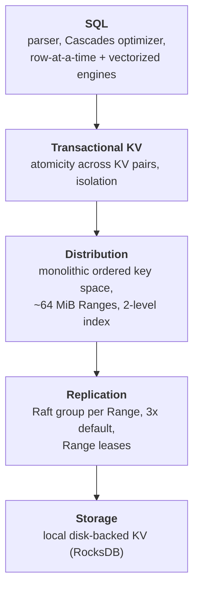

# CockroachDB: The Resilient Geo-Distributed SQL Database

> SIGMOD 2020 Industrial Track — structured reading notes

Full paper content: [Markdown conversion](../original/cockroachdb-sigmod-2020.md)

## Paper information

- **Authors:** Rebecca Taft, Irfan Sharif, Andrei Matei, Nathan VanBenschoten, Jordan Lewis,
  Tobias Grieger, Kai Niemi, Andy Woods, Anne Birzin, Raphael Poss, Paul Bardea, Amruta Ranade,
  Ben Darnell, Bram Gruneir, Justin Jaffray, Lucy Zhang, Peter Mattis
- **Affiliation:** Cockroach Labs, Inc.
- **Venue:** SIGMOD 2020, Portland, OR, USA, pages 1493–1509 (17 pages)
- **DOI:** [10.1145/3318464.3386134](https://doi.org/10.1145/3318464.3386134)
- **License:** source-available under a Business Source License that converts to Apache 2.0 after
  three years; source on GitHub

## One-sentence summary

CockroachDB (CRDB) delivers serializable, geo-distributed SQL on commodity hardware by combining
Raft-replicated ~64 MiB Ranges, hybrid-logical clocks with an uncertainty interval instead of
Spanner's commit-wait, and an optimistic MVCC transaction protocol whose *read refresh* mechanism
lets a transaction move its timestamp forward without losing serializability.

## Problem

A global company with users in Europe, Australia, and a fast-growing US base needs all of the
following at once:

- **Regulatory domiciling** — GDPR requires European personal data to stay in the EU.
- **Locality for latency** — data should reside near the users who access it most, and follow
  them when they travel (within regulatory limits).
- **"Always on"** — survive a full regional failure.
- **SQL with serializable transactions** — to avoid anomalies and simplify application code.

Legacy DBMSs cannot do this; systems with reduced isolation permit anomalies that can surface as
security vulnerabilities. CRDB's philosophy is to **eliminate the anomalies rather than expect
developers to handle them**.

Three headline features address these requirements:

1. **Fault tolerance and high availability** — at least three replicas of every partition across
   diverse geographic zones, with automatic recovery.
2. **Geo-distributed partitioning and replica placement** — horizontally scalable with automatic
   capacity growth and data migration, default heuristics for placement, plus fine-grained user
   control for performance tuning or data domiciling.
3. **High-performance transactions** — serializable isolation **with no specialized hardware**;
   standard NTP-class clock synchronization suffices, so CRDB runs on off-the-shelf servers in
   any public or private cloud. CRDB is also **cloud-neutral**: one cluster can span arbitrary
   public and private clouds, mitigating vendor lock-in.

## Architecture

Shared-nothing: every node does both storage and computation; clients can connect to any node.
Within a node the design is layered:



| Layer | Responsibility | Notes |
| --- | --- | --- |
| **SQL** | User interface: parser, optimizer, execution | Generally unaware of partitioning — the layers below present a single monolithic KV store (deliberately broken for distributed execution) |
| **Transactional KV** | Atomicity of multi-key changes; isolation guarantees | The heart of the paper |
| **Distribution** | One logical key space, ordered by key, covering system and user data | **Range-partitioned into ~64 MiB contiguous chunks ("Ranges")**; ordering maintained in a two-level index inside system Ranges, aggressively cached |
| **Replication** | Durability via consensus | Each Range replicated 3 ways by default on distinct nodes |
| **Storage** | Local KV store with efficient writes and range scans | RocksDB, treated as a black box in the paper |

**Why ~64 MiB?** Small enough to move quickly between nodes, large enough to hold a contiguous
set of data likely accessed together. Ranges start empty, grow, **split** when too large,
**merge** when too small, and also **split based on load** to relieve CPU hotspots.

### Replication using Raft

- Replicas of a Range form a **Raft group** — one long-lived leader plus followers. The unit of
  replication is a **command**: a sequence of low-level edits to the storage engine. Raft
  maintains a consistent ordered log; each replica applies commands as Raft commits them.
- **Range-level leases:** a single replica (usually the Raft leader) is the **leaseholder** — the
  only replica allowed to serve authoritative up-to-date reads or propose writes. Because all
  writes go through it, **reads bypass Raft round trips without sacrificing consistency**.
- **Liveness:** user-Range leases are tied to node liveness; nodes heartbeat a special record in
  a system Range every **4.5 seconds**. System Ranges use expiration-based leases renewed every
  **9 seconds**. A replica that detects a dead leaseholder tries to acquire the lease.
- **Lease acquisition piggybacks on Raft** — the acquiring replica commits a special lease
  acquisition log entry, and the request includes a copy of the lease it believed valid, so that
  leases cannot overlap in time. **Lease disjointness is essential to CRDB's isolation
  guarantees.**

### Membership changes and rebalancing

Node addition, removal, and temporary or permanent failure are all treated the same way: load is
redistributed.

- **Short-term failures:** Raft continues as long as a majority of replicas survive, electing a
  new leader if needed. A returning replica catches up either by (1) a full Range snapshot or
  (2) the missing Raft log entries — chosen based on how many writes it missed.
- **Long-term failures:** CRDB automatically creates new replicas of under-replicated Ranges
  from the surviving ones. Node liveness data and cluster metrics driving these decisions
  propagate via a **peer-to-peer gossip protocol**.

### Replica placement

- **Manual:** nodes are configured with attributes describing capability (hardware, RAM, disk
  type) and locality (country, region, AZ). Table schemas carry placement constraints and
  preferences; e.g. a `region` column can define the table's partitioning and map partitions to
  geographic regions.
- **Automatic:** CRDB spreads replicas across failure domains (disk, rack, datacenter, region)
  within the specified constraints, and uses heuristics to balance load and disk utilization.

### Data placement policies

| Policy | Reads | Writes | Survives | Cost |
| --- | --- | --- | --- | --- |
| **Geo-Partitioned Replicas** | Fast intra-region | Fast intra-region | AZ failure only — region failure makes that region's data unavailable | Best latency; also the primary tool for **data domiciling** |
| **Geo-Partitioned Leaseholders** | Fast intra-region (leaseholder pinned to access region) | Slower cross-region | **Regional failure** | Cross-region write latency |
| **Duplicated Indexes** | Fast local reads from a per-region index copy, each with a locally pinned leaseholder | Slower cross-region, higher write amplification | Regional failure | Best for infrequently updated data, or data that cannot be tied to a geography |

## Transactions

CRDB uses an MVCC variant to provide **serializable isolation**; transactions can span the whole
key space.

### The coordinator

A SQL transaction starts at the **gateway node** for the connection, which acts as the
**transaction coordinator**. Applications typically connect to a geographically close gateway.

```text
Algorithm 1 — Transaction Coordinator
 1  inflightOps ← ∅ ; txnTimestamp ← now()
 2  for op ← KV operation from SQL layer
 3      op.ts ← txnTimestamp
 4      if op.commit
 5          op.deps ← inflightOps                       # commit depends on everything
 6      else
 7          op.deps ← { x ∈ inflightOps | x.key = op.key }   # only same-key deps
 8      inflightOps ← (inflightOps − op.deps) ∪ { op }
 9      resp ← SendToLeaseholder(op)
10      if resp.ts > op.ts                              # a reader pushed us forward
11          if op.key unchanged over (txnTimestamp, resp.ts]
12              txnTimestamp ← resp.ts                  # read refresh succeeded
13          else
14              return transaction failed
15      send resp to SQL layer
16      if op.commit
17          asynchronously notify leaseholder to commit
```

SQL requires a response to each operation before the next is issued, so the coordinator uses two
optimizations to avoid stalling on replication. **Together they let many multi-statement SQL
transactions complete with the latency of just one round of replication.**

**Write Pipelining.** A non-committing operation executes immediately if it does not overlap an
earlier in-flight operation, so operations on different keys pipeline. An operation depending on
an earlier in-flight operation must wait for that operation to replicate — a **pipeline stall**.

**Parallel Commits.** Naïvely, committing requires knowing all writes have replicated — at least
two sequential rounds of consensus. Instead a **staging** transaction status makes the true
status *conditional on whether all writes have been replicated*. The coordinator replicates the
staging status **in parallel** with the outstanding writes; if both succeed it immediately
acknowledges the commit to SQL, and only afterwards asynchronously records the status as
explicitly committed (a performance optimization).

- **Formally verified in TLA+:** atomicity (every staging transaction eventually becomes
  explicitly committed or aborted regardless of coordinator failure, with no client told
  otherwise) and durability (committed transactions stay committed). Verification code is on
  GitHub.
- **Measured:** microbenchmark on three servers across three regions, single-row writes to a
  ten-column table with a varying number of secondary indexes. Parallel Commits improves
  throughput by **up to 72%** and reduces p50 latency by **up to 47%** when the table has one or
  more secondary indexes (index updates require multi-Range transactions). Latency profiles stay
  constant even as transactions require cross-Range coordination.

### The leaseholder

```text
Algorithm 2 — Leaseholder.Handle(op)
 1  verify lease
 2  wait for latches on keys of {op} ∪ op.deps          # mutual exclusion
 3  verify writes in op.deps are replicated
 4  if op is not read-only
 5      push op.ts past highest read timestamp for op.key
 6  command, response ← evaluate op                     # compute changes, don't apply
 7  response.ts ← op.ts
 8  if not op.commit: send response to coordinator      # respond before replication
 9  if op is not read-only: replicate and apply command
10  release latches
11  if op.commit: send response to coordinator
```

Note the separation of **evaluation** (determine what storage modifications are needed, producing
a low-level command plus a client response) from **application** (each replica applies the
command after consensus). This ordering matters — see the version-upgrade lesson below.

### Atomicity: write intents and the transaction record

- All writes are provisional until commit. A **write intent** is a regular MVCC KV pair preceded
  by metadata pointing to a **transaction record**.
- The transaction record is a unique key per transaction holding its disposition —
  **pending, staging, committed, aborted** — durably stored in the **same Range as the
  transaction's first write**. It atomically changes the visibility of all intents at once.
- For long-running transactions the coordinator periodically **heartbeats** the record in
  `pending` to assure contenders it is still progressing.

Reader behavior on encountering an intent:

| Transaction record state | Reader action |
| --- | --- |
| **committed** | Treat the intent as a regular value; delete the intent metadata |
| **aborted** | Ignore the intent; clean it up |
| **pending** | Block, waiting for finalization. If the coordinator node failed, contenders eventually see the record expire and mark it aborted |
| **staging** | The transaction is either committed or aborted but the reader cannot tell. The reader tries to **abort it by preventing one of its writes from replicating**; if all writes already replicated, the transaction *is* committed and the record is updated to say so |

### Concurrency control

Each transaction reads and writes at its commit timestamp, producing a total order — a
serializable execution. Conflicts may force the commit timestamp forward, after which the
transaction usually tries to prove its prior reads remain valid (read refresh) and continues.

| Conflict | Resolution |
| --- | --- |
| **Write-read** | A read hitting an uncommitted intent with a **lower** timestamp waits (via in-memory queues) for the writer to finalize. An intent with a **higher** timestamp is ignored — no waiting |
| **Read-write** | A write at `t_a` cannot proceed if the key was already read at `t_b ≥ t_a`; the writer must **advance its commit timestamp past `t_b`** |
| **Write-write** | Hitting an uncommitted intent with a lower timestamp → wait. Hitting a committed value with a higher timestamp → advance past it. Different intent orderings across transactions can **deadlock**, resolved by a distributed deadlock-detection algorithm that aborts one transaction in the cycle |

### Read refreshes

To keep serializability when the commit timestamp advances from `t_a` to `t_b`, the **read
timestamp must advance too** — which is legal only if nothing the transaction read at `t_a`
changed in `(t_a, t_b]`.

- CRDB tracks the transaction's **read set** (up to a memory budget). A **read refresh** request
  re-scans the read set and checks whether any MVCC value falls in the interval.
- This is equivalent to detecting the **rw-antidependencies** PostgreSQL tracks for SSI, and like
  PostgreSQL it permits **false positives** (aborting when not strictly necessary) to avoid
  maintaining a full dependency graph.
- If the refresh fails, the transaction restarts. If no results have reached the client, CRDB
  retries **internally**; otherwise the client is told to discard results and restart. A
  restarted transaction is more likely to succeed because CRDB **defers the restart** so the
  original attempt can first place write intents (acting as write locks) on its intended keys.
- Read refreshes are also used when a scan hits an **uncertain value** (see clock section) — a
  successful refresh lets the value be returned.

### Follower reads

Non-leaseholder replicas can serve read-only queries sufficiently far in the past, via the
`AS OF SYSTEM TIME` modifier. Two safety conditions for a follower read at timestamp `T`:

1. The **leaseholder must no longer accept writes at timestamps `T' ≤ T`**.
2. The follower must have **applied the prefix of the Raft log** affecting the MVCC snapshot
   at `T`.

Mechanism: each leaseholder tracks incoming request timestamps and periodically emits a **closed
timestamp** — the timestamp below which no further writes will be accepted. Closed timestamps,
together with the Raft log indexes at that moment, are exchanged periodically between replicas;
followers use this state to decide whether they can serve a read. **For efficiency, closed
timestamps and log indexes are generated at node level, not Range level.**

Every node records its latency to every other node. A read at a sufficiently old timestamp
(closed timestamps typically trail current time by **~2 seconds**) is forwarded to the *closest*
node holding a replica.

## Clock synchronization

No specialized hardware — NTP or Amazon Time Sync Service suffices.

### Hybrid-logical clocks (HLC)

Each node keeps an HLC combining a coarsely-synchronized physical clock with a Lamport logical
component. The maximum allowable offset between HLC physical components defaults to a
conservative **500 ms**. Three properties matter:

1. **Causality tracking.** HLC timestamps ride on every message; receiving a message forwards the
   local clock. This enforces the **lease disjointness invariant** (as in Spanner): each Range's
   lease intervals are pairwise disjoint. On *cooperative* lease handoff this comes from the
   causality transfer through the HLC; on *non-cooperative* acquisition it comes from a **delay
   equal to the maximum clock offset** between lease intervals.
2. **Strict monotonicity** within and across process restarts on a node. Across restarts this is
   enforced by **waiting out the maximum clock offset at startup** before serving requests, so
   two causally dependent transactions from the same node get timestamps reflecting their real
   ordering.
3. **Self-stabilization.** Because nodes forward their HLC on message receipt, sufficient
   intra-cluster communication makes HLCs converge even when physical clocks diverge. No strong
   guarantee, but it masks synchronization errors in practice.

### Uncertainty intervals

**Consistency level:** under normal conditions CRDB provides **single-key linearizability** for
reads and writes — every operation on a given key appears atomic and totally ordered consistently
with real time, so **stale reads are impossible** while clocks stay within max offset.

**CRDB does not provide strict serializability:** transactions touching *disjoint* key sets are
not guaranteed to be ordered by real time. The authors argue this is unproblematic unless clients
have an external low-latency communication channel that affects DBMS activity.

Mechanism: a transaction gets a provisional `commit_ts` from its coordinator's HLC and an
**uncertainty interval `[commit_ts, commit_ts + max_offset]`**.

- Values **below** `commit_ts`: read normally; writes overwrite at a higher timestamp.
- Values **above** `commit_ts` but **inside** the uncertainty interval: the transaction performs
  an **uncertainty restart**, moving `commit_ts` above the uncertain value while **keeping the
  upper bound of the uncertainty interval fixed**.

This effectively treats every value in the uncertainty window as a past write, so per-key
operation order matches real-time order — the needed property, without a globally synchronized
clock.

### Behavior under clock skew beyond the bound

**Isolation survives arbitrary skew; linearizability does not.**

Raft has no clock dependency, so single-Range ordering stays linearizable. The risk comes from
leases letting reads bypass Raft: under enough skew, two nodes could both believe they hold a
Range's lease. Two safeguards:

1. **Leases carry start and end timestamps.** A leaseholder cannot serve reads for MVCC
   timestamps above its lease interval, nor writes for timestamps outside it. Combined with lease
   disjointness, an incoming leaseholder cannot serve a write that invalidates a read served by
   the outgoing one.
2. **Every Raft log write carries the sequence number of the lease it was proposed under**, and
   is rejected if that does not match the currently active lease on application. Since lease
   changes are themselves Raft log entries, only one leaseholder can ever mutate a Range — even
   if several believe they hold a valid lease. This prevents an outgoing leaseholder from
   invalidating an incoming one's read or write.

What *can* break: if two causally dependent transactions go through different gateways whose
clocks are skewed beyond `max_offset`, the second may get a `commit_ts` more than `max_offset`
below the first's timestamp, putting the first transaction's writes **outside** its uncertainty
interval — producing a **stale read**, a single-key linearizability violation.

Mitigation: nodes periodically measure their offset against others; **any node exceeding 80% of
the configured maximum offset relative to a majority of peers self-terminates.**

## SQL layer

CRDB supports much of the PostgreSQL dialect of ANSI SQL plus geo-distribution extensions.

### Data model

Every table and index lives in one or more Ranges. All user data lives in ordered indexes, one
designated **primary** (keyed on the primary key, other columns in the value; a primary key is
auto-generated if unspecified). Secondary indexes are keyed on the index key and store the
primary key columns plus any additional stored columns. **Hash indexes** distribute load across
Ranges to avoid hotspots.

### Query optimizer

A **Cascades-style optimizer with over 200 transformation rules**.

- **Optgen**, a DSL for transformations, compiles to Go (all of CRDB except the storage layer is
  Go). A rule pairs a match pattern with a logically equivalent replace pattern:

  ```text
  [EliminateNot, Normalize]
  (Not (Not $input: *)) => $input
  ```

  Relational rules are more complex and may call arbitrary Go methods. **Normalization**
  (rewrite) rules replace the source expression; **Exploration** rules (join reordering,
  algorithm selection) keep both so the optimizer can cost them. Per Cascades, normalization and
  exploration are interleaved in a unified search, and generated code minimizes allocation for an
  operator until all applicable normalization rules have run.
- **Distribution-aware rules.** Partitioning information can be used to infer extra filters and
  enable more selective index scans. With `idx(region, id)` on a table partitioned into `east`
  and `west`, `SELECT * FROM t WHERE id = 5` is rewritten to
  `SELECT * FROM t WHERE id = 5 AND (region = 'east' OR region = 'west')`, enabling the index.
  Similar to Oracle's index skip scan, except **filters are derived statically from the schema
  rather than from histograms**.
- **Cost model includes data distribution:** each index replica is costed by its proximity to the
  query's gateway node, minimizing cross-region shuffling (this is what makes the Duplicated
  Indexes policy pay off).

### Planning and execution

Two modes: **gateway-only** (the planning node does all SQL processing) and **distributed** (other
nodes participate; at the time of writing, **read-only queries only**). Because the Distribution
layer presents a single key space, SQL operators behave identically in either mode.

The distribute/don't-distribute decision is a heuristic on estimated network bytes — small-row
queries stay on the gateway. Physical planning turns the optimizer's plan into a **DAG of
physical SQL operators**, splitting logical scans into one **TableReader per node holding a
scanned Range**, then scheduling the remaining operators on those same nodes to push filters,
joins, and aggregations as close to the data as possible. (`EXPLAIN(distsql)` renders this plan.)

Example: a distributed hash join across the primary indexes of tables `a` and `b` on 3 nodes,
where node 2 holds `b`'s Ranges and `a`'s Ranges split between nodes 1 and 3 — scanned data is
hash-shuffled to all scanning nodes, joined by node-local hash joins, and returned to the gateway
which unions the results.

| Engine | Model | Coverage |
| --- | --- | --- |
| **Row-at-a-time** | Volcano iterator, one row at a time | **Every** supported SQL feature — joins, aggregations, sorts, window functions |
| **Vectorized** | MonetDB/X100-inspired, column-oriented batches | A **subset** of queries |

Vectorized details: data is transposed row→column as it is read from the KV layer and column→row
before returning to the user, with minimal overhead. Operators are **monomorphized on all
supported SQL data types** to kill interpreter overhead — implemented via **templated code
generation**, since Go lacks generics with specialization. All vectorized operators handle a
**selection vector** (a tightly packed array of surviving row indices) so filtering never
physically removes data; complex operators like merge joins generate separate inner loops for the
selection-vector-present and absent cases. Result: **over two orders of magnitude speedup for
individual operators, and up to 4× on TPC-H queries**.

### Schema changes

CRDB follows **F1's protocol**: decompose each schema change into a sequence of incremental
changes so tables stay online (serving reads and writes) and nodes can transition asynchronously.
Adding a secondary index needs **two intermediate schema versions** to guarantee the index is
being updated by writes cluster-wide before it becomes readable. The invariant that **at most two
successive schema versions are in use at any time** keeps the database consistent throughout.

## Evaluation

Unless noted, CRDB v19.2.2.

### Vertical and horizontal scalability

Two Sysbench OLTP benchmarks (embarrassingly parallel). **Throughput per vCPU stays nearly
constant** for both reads and writes as vCPUs increase.

- *Vertical:* three-node clusters on c5d.large → c5d.9xlarge (2, 4, 8, 16, 36 vCPUs).
- *Horizontal:* c5d.9xlarge instances, cluster size 3 → 48 nodes.
- All clusters span three AZs in us-east-1; each point averages three runs; 4 tables per node,
  1,000,000 rows per table (~38 GB on the 48-node cluster).

### Scalability with cross-node coordination

TPC-C with a variable percentage of **remote warehouses** in New Order transactions, and varying
replication factor, on n1-standard-4 GCP machines (4 vCPUs). Largest runs: 10,000 warehouses =
800 GB.

- Replication overhead reduces throughput by up to **48% (3 replicas)** or **57% (5 replicas)**.
- Distributed transactions reduce throughput by up to a further **46%**.
- **Despite these overheads, all workloads scale linearly with cluster size.**

### TPC-C scale and the Aurora comparison

CRDB v19.2.0 runs TPC-C at 1,000, 10,000, and 100,000 warehouses — **100,000 warehouses = 50
billion rows and 8 TB** — at near-maximum efficiency, fully compliant with the spec (wait times,
foreign keys). By contrast, **single-master Amazon Aurora achieves only 7.3% efficiency at 10,000
warehouses**; AWS had published no TPC-C numbers for multi-master Aurora.

### Multi-region availability under failure

TPC-C 1,000 on 9 n1-standard-4 GCP machines across three US regions, with per-region workload
generators, while inducing an AZ failure/recovery then a region-wide failure/recovery. Tables and
indexes partitioned by warehouse; for the duplicated-indexes policy the read-only `items` table
is replicated to every region.

- **All four policies tolerate AZ failure**; the slight degradation comes from the remaining AZs
  being overloaded.
- **Only geo-partitioned leaseholders tolerates a region-wide failure**, sustaining higher
  throughput during it — but paying **higher p90 latency during stable operation and recovery**
  than the geo-partitioned replicas variants. Its slower recovery is the primary region catching
  up on missed writes.
- Degradation during region failure is attributable either to blocked remote-warehouse
  transactions or to clients crossing region boundaries to issue queries.
- **Under stable conditions, duplicated indexes gives the lowest p90 latencies.**

### Versus Cloud Spanner (YCSB A–F)

Spanner is a managed service and does not disclose hardware, so CRDB is run at 4, 8, and 16 vCPUs
per node; for reference, three n2-standard-8 GCP VMs with local storage cost within **0.2%** of a
one-"node" Spanner instance (three replicas). All replicas span three AZs in one region.

- **CRDB shows significantly higher throughput on most YCSB workloads**; both systems scale
  horizontally.
- **Exception: Workload A** (update-heavy, zipfian keys) — CRDB scales poorly due to the high
  contention profile. (The authors expected significant improvement from optional read locking in
  the 20.1 release.)
- Under light load, **CRDB shows significantly lower latency at all percentiles**, attributed in
  part to **Spanner's commit-wait**. Heavy-load latency is noisy but trends the same.

### Case studies

- **US telecom virtual customer support agent.** Session metadata for a 24/7 virtual agent. Chose
  CRDB for strong consistency, regional failure tolerance, and geo-distributed performance.
  Deployed as a **hybrid cluster spanning their own datacenter and AWS regions** — enabled by
  CRDB's hybrid deployment support. Chose **geo-partitioned leaseholders**: writes cross regions
  to reach quorum, reads stay local.
- **Online gaming company, 30–40 million financial transactions per day.** Core users in Europe
  and Australia, growing US base; strict compliance, consistency, performance, and availability
  requirements; needed isolated failure domains and user data pinned to localities.

## Lessons learned

### Raft made live

- **Reducing the chatter.** A large deployment may run **hundreds of thousands of consensus
  groups** (one per Range), making Raft heartbeats expensive. Two changes: **coalesce heartbeats
  into one message per node** (saving per-RPC overhead), and **pause Raft groups with no recent
  write activity**.
- **Joint Consensus.** Default Raft membership change allows only one addition or removal at a
  time. In a three-region deployment constrained to one replica per region, rebalancing then
  requires either temporarily dropping to two replicas or growing to four with two in one
  region — **both intermediate configurations lose availability under a single region outage**.
  Joint Consensus keeps an intermediate configuration requiring a quorum of **both** the old and
  new majorities, so unavailability requires one of the two majorities to fail. The authors found
  it **"not significantly more complex" than the default and recommend all production-grade Raft
  systems use it.**

### Removal of snapshot isolation

CRDB originally offered `SNAPSHOT` and `SERIALIZABLE`, defaulting to serializable because
developers should not have to reason about write skew and the weaker level's performance
advantage was small in their implementation. They expected removing the write-skew check would
suffice for snapshot isolation, but: **the only safe way to enforce strong consistency under
snapshot isolation is pessimistic locking** (`FOR SHARE`, `FOR UPDATE`). Guaranteeing strong
consistency across *mixed* isolation levels would then require pessimistic locking for **all**
row updates, including in serializable transactions. Rather than pessimize the common path, they
made `SNAPSHOT` an **alias for `SERIALIZABLE`**.

### PostgreSQL compatibility

Adopting the PostgreSQL dialect and wire protocol captured the client-driver ecosystem and
boosted adoption. But CRDB differs in ways requiring client-side intervention — clients must
**perform transaction retries after MVCC conflicts** and **configure result paging**. Reusing
PostgreSQL drivers as-is means teaching developers to deploy CRDB-specific code at a higher level
in *every* application: "a recurring source of friction which we had not anticipated." They were
therefore considering gradually introducing **CRDB-specific client drivers**.

### Pitfalls of version upgrades

Upgrades are a rolling restart into the new binary, so mixed-version clusters are unavoidable.
Early CRDB replicated the **request** received via the KV API and evaluated it locally on each
peer: (1) propose to Raft on the leaseholder, (2) evaluate on each replica, (3) apply on each
replica. Any code change in (2) or (3) could make replicas of different versions **diverge**,
violating the requirement that a Range's replicas hold identical data. The fix: **move evaluation
first and propose the *effect* of an evaluated request rather than the request itself.**

### Follow the workload

A mechanism to automatically move leaseholders closer to the users accessing the data, designed
for shifting access localities — **rarely used in practice**. Manual replica placement controls
proved sufficient for most operators. The authors' conclusion: **adaptive techniques are hard to
get right in a general-purpose system, being either too aggressive or too slow; operators favor
predictable performance, and the unpredictability hindered adoption.**

## Positioning against related work

- **Spanner** achieves strict serializability by taking read locks in all read-write transactions
  and **waiting out the clock uncertainty window on every commit**. CRDB uses pessimistic write
  locks but is otherwise **optimistic**, using read refresh to push the commit timestamp past
  conflicting writes inside the uncertainty window. This gives serializable isolation at **lower
  latency than Spanner for low-contention workloads**, at the cost of **more retries under high
  contention** (motivating future pessimistic read locks). Crucially, **Spanner's protocol is
  only practical with specialized hardware** bounding uncertainty to a few milliseconds; CRDB's
  works in any cloud.
- **Calvin, FaunaDB, SLOG** give strict serializability but their deterministic execution needs
  read/write sets up front, so they **cannot support conversational SQL**.
- **H-Store, VoltDB** — main-memory, serializable, optimized for partitionable workloads, but
  poor on cross-partition transactions (single-threaded distributed transaction processing).
  **L-Store, G-Store** commit everything locally but must relocate data on the fly when it is not
  colocated.
- **Commit latency:** like much recent geo-distributed work, CRDB commits in one cross-datacenter
  round trip in the common case. Unlike systems requiring global consensus or a single master
  region for ordering multi-partition transactions, **CRDB needs consensus only from the
  partitions actually written**.
- **Data placement:** prior work minimizes latency or cost under SLOs; CRDB instead **gives users
  explicit policy control**. Versus **Slicer** (range-partitions *hashed* keys), CRDB
  range-partitions the **original** keys — better range-scan locality, more hotspot exposure,
  mitigated by optional hash partitioning. Like Slicer, it splits, merges, and moves Ranges to
  balance load.
- **Other commercial systems:** Aurora replicates by writing the redo log to shared storage,
  keeps six replicas across three AZs, but (until recently) a single failure could make writes
  temporarily unavailable and it runs **only on AWS**. **F1** inspired CRDB's distributed
  execution and online schema change infrastructure but is Google-internal. **TiDB** targets HTAP
  over the MySQL wire protocol; **NuoDB** scales storage independently from transactions and
  caching — but neither is optimized for geo-distribution and both **support only snapshot
  isolation**. **FoundationDB** provides strictly serializable KV, with the Record Layer adding a
  SQL subset.

## Limitations and questions

- **Not strictly serializable.** Transactions on disjoint key sets may be ordered inconsistently
  with real time; only single-key linearizability is guaranteed, and only within clock bounds.
- **Stale reads under extreme clock skew.** Isolation survives, but linearizability between
  causally dependent transactions through differently-skewed gateways does not. The 80%-offset
  self-termination rule reduces but does not eliminate the risk.
- **Optimistic protocol punishes contention.** YCSB Workload A exposed this directly; the
  answer — pessimistic read locks — was still future work at publication.
- **Distributed execution is read-only** at the time of writing; write-heavy queries are confined
  to the gateway.
- **Vectorized engine covers only a subset** of SQL; the row-at-a-time engine remains the
  complete implementation.
- **PostgreSQL compatibility is partial by construction**, and the retry/paging differences leak
  into every application.
- **Vendor-authored benchmarks**, including the Aurora efficiency figure and the Spanner
  comparison against an undisclosed hardware configuration.

## Practical design checklist

CRDB fits when:

- you need serializable SQL across regions on commodity/cloud hardware with no TrueTime-class
  clock;
- data domiciling or per-region latency control is a hard requirement;
- surviving whole-region failure matters and you can pay cross-region write latency;
- contention is low to moderate and transactions are conversational.

Look elsewhere when:

- you need strict serializability (external consistency) across disjoint keys;
- workloads are highly contended on a small hot key set;
- the workload is analytic rather than OLTP;
- you need full PostgreSQL semantics without client-side retry handling.

## Takeaways

1. **Range-level leases turn consensus into a read-path optimization.** Because all writes flow
   through one leaseholder, reads skip Raft entirely — and lease *disjointness* becomes the
   invariant everything else rests on.
2. **Uncertainty intervals are the cheap alternative to commit-wait.** Rather than waiting out
   clock uncertainty on every commit, treat values inside the window as past writes and restart
   only when one is actually encountered.
3. **Read refresh makes optimistic timestamps viable.** Advancing a transaction's timestamp is
   safe if you can prove the read set is unchanged — equivalent to SSI's rw-antidependency
   tracking, and cheaper with deliberate false positives.
4. **Overlap the commit with the writes.** A conditional "staging" status collapses two rounds of
   consensus into one, worth up to 72% throughput on index-heavy writes.
5. **Verify the tricky protocol.** Parallel Commits was proven in TLA+ for atomicity and
   durability under coordinator failure — the kind of protocol where testing is not enough.
6. **Propose effects, not requests.** Replicating evaluated commands instead of raw requests is
   what makes mixed-version rolling upgrades safe.
7. **Isolation should degrade gracefully under clock skew, and say so.** Lease intervals plus
   lease-sequence checks on every Raft write preserve serializability even when the clock
   assumption is violated; linearizability is the thing that breaks, and the paper says exactly
   when.
8. **Operators prefer predictable to optimal.** "Follow the workload" was technically sound and
   commercially unused — manual placement policies won because their behavior is legible.

## Citation

```bibtex
@inproceedings{taft2020cockroachdb,
  author = {Rebecca Taft and Irfan Sharif and Andrei Matei and Nathan VanBenschoten and
            Jordan Lewis and Tobias Grieger and Kai Niemi and Andy Woods and Anne Birzin and
            Raphael Poss and Paul Bardea and Amruta Ranade and Ben Darnell and Bram Gruneir and
            Justin Jaffray and Lucy Zhang and Peter Mattis},
  title = {CockroachDB: The Resilient Geo-Distributed SQL Database},
  booktitle = {Proceedings of the 2020 ACM SIGMOD International Conference on Management of
               Data (SIGMOD '20)},
  pages = {1493--1509},
  year = {2020},
  doi = {10.1145/3318464.3386134}
}
```
