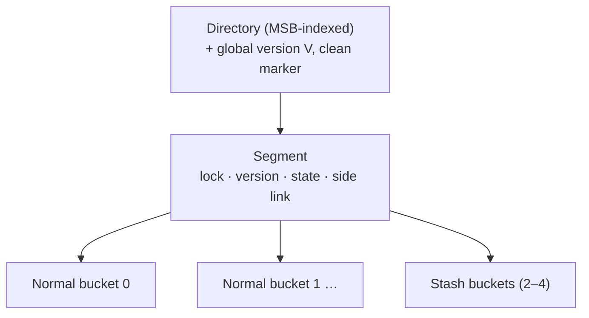

# Dash: Scalable Hashing on Persistent Memory

> VLDB 2020 — structured reading notes

Full paper content: [Markdown conversion](../original/dash-vldb-2020.md)

## Paper information

- **Authors:** Baotong Lu, Xiangpeng Hao, Tianzheng Wang, Eric Lo
- **Affiliations:** The Chinese University of Hong Kong; Simon Fraser University
- **Venue:** Proceedings of the VLDB Endowment, Volume 13, Number 8, 2020, pages 1147–1161
- **DOI:** [10.14778/3389133.3389134](https://doi.org/10.14778/3389133.3389134)
- **Code:** https://github.com/baotonglu/dash

## One-sentence summary

Dash is a set of composable techniques — fingerprinting, optimistic bucket-level locking,
balanced insert + displacement + stashing, and lazy version-based recovery — that together let
extendible and linear hashing run on *real* Intel Optane DCPMM with near-linear scalability,
>90% load factor, and a constant **57 ms** recovery time regardless of data size.

## Problem: hashing on PM is not what prior work assumed

A generation of PM hash tables was designed on **DRAM emulation**, before real hardware shipped.
Their focus was minimizing cacheline flushes and PM writes. On real Optane DCPMM the authors
find two state-of-the-art designs (**CCEH** and **level hashing**) **fail to scale for inserts —
and fail to scale even for read-only searches** as core count grows to 24.

The root cause is DCPMM's limited bandwidth, **~3–14× lower than DRAM**. Even with all six
channels populated, excessive PM accesses saturate the system. Three specific problems:

### 1. Excessive PM reads (the overlooked half)

Prior work optimized writes, often **buying write reductions with more reads**. But at the
device level PM reads are faster than writes, while **end-to-end** the reverse holds:

- **Writes** commit once data reaches the **ADR domain** at the memory controller (write buffers
  + write pending queue, persistent across power failure) — they never wait for the media.
- **Reads** almost always touch the actual media, because hash tables are inherently random and
  the data is rarely cache-resident.

Existence checks during record probing are the dominant source: to determine whether a key
exists, one or several buckets must be scanned, incurring cache misses and PM reads on every
key comparison.

### 2. Heavyweight concurrency control

Bucket-level locking is standard, but **acquiring and releasing a read lock is itself a PM
write**, pushing bandwidth toward the limit even for read-only workloads. Lock-free designs avoid
this but are notoriously hard to get right — more so on PM where safe persistence is added.

Neither probing nor locking prevents scaling on DRAM. On PM both exhaust bandwidth.

### 3. Missing functionality traded away for performance

- **Load factor.** Indexes can occupy >50% of memory capacity, so records-stored / capacity
  matters. Prior designs use large segments to shrink the directory (fewer cache misses), but a
  segment must split when *any* bucket in it fills — causing **pre-mature splits** and *more* PM
  accesses.
- **Variable-length keys** are ubiquitous but rarely discussed.
- **Instant recovery** — PM's signature advantage — is usually omitted; recovery requires a
  linear metadata scan whose cost scales with data size.
- **PM programming issues** (especially allocation) are handled ad hoc, hurting scalability and
  adoptability.

### DCPMM performance characteristics worth memorizing

| Property | Value |
| --- | --- |
| Capacity | 128/256/512 GB per DIMM, cheaper than DRAM |
| Modes | **Memory** (DRAM as hardware-managed cache, volatile) and **AppDirect** (explicit DRAM/PM, real persistence) — Dash uses AppDirect |
| Read latency | ~300 ns, ~4× DRAM |
| Sequential / random **read** bandwidth vs DRAM | ~3× / ~8× slower |
| Sequential / random **write** bandwidth vs DRAM | ~11× / ~14× slower |
| Small random stores | Severely limited and **non-scalable** — exactly the hash table access pattern |
| Atomicity | 8-byte atomic writes; internally 256-byte blocks (an internal parameter software should not hardcode) |
| Persistence instructions | `CLFLUSH`, `CLFLUSHOPT` (both evict the line), `CLWB` (does not evict — better performance); fences required against reordering |

## Background: the two dynamic hashing schemes

### Extendible hashing

- A **directory** indexes buckets so they can be added/removed at runtime. The **global depth**
  is the number of hash bits used to index the directory, which has at most 2^global_depth
  entries. Each bucket also has a **local depth**.
- On a full bucket, split it into two and redistribute keys. **The directory always grows by
  doubling.**
- The depths decide whether doubling is needed: splitting a bucket whose **local depth = global
  depth** forces a directory doubling; if **local depth < global depth**, there are already
  2^(global−local) directory entries pointing at that bucket, and one can be repointed to the new
  bucket instead.

### Linear hashing

- Also a directory of buckets, but the bucket to split is chosen **linearly**: a `Next` pointer
  designates the next bucket to split and advances after each split. **The split bucket is not
  necessarily the full one** — a full bucket instead chains **overflow buckets** until its turn
  comes.
- Addressing uses a family of hash functions `h_1 … h_n` where `h_n` covers twice the range of
  `h_{n−1}`: already-split buckets use `h_n`, unsplit buckets use `h_{n−1}`. After a full
  **round**, capacity doubles and `Next` resets.
- When to split is typically driven by keeping the load factor bounded.

### CCEH and the segmentation trade-off

CCEH groups buckets into **segments**; each directory entry points to a segment whose internal
buckets are indexed by extra hash bits. A smaller directory is more likely to be fully cached,
reducing PM access — but **splits now happen at segment granularity**, triggered as soon as *any*
bucket in the segment fills, even if the rest have free slots. Linear probing partially
compensates (CCEH probes at most four cachelines), but at the cost of more cache misses; the
evaluation shows linear probing alone cannot deliver high load factor.

Failure atomicity for a split is a three-step process: (1) allocate a new segment in PM,
(2) rehash records into it, (3) register it in the directory and update local depth. **CCEH
addressed only step 3**, leaving a crash during steps 1–2 able to **permanently leak PM**.

## Design principles

- **Avoid both unnecessary PM reads and writes.** Probing affects every operation, not just
  search.
- **Lightweight concurrency.** Scale on multicore with persistence, without PM writes for reads,
  and ideally easy to implement correctly.
- **Full functionality.** Near-instant recovery, variable-length keys, and high space utilization
  are non-negotiable.

## Dash for extendible hashing (Dash-EH)



### Bucket layout (256 bytes = the DCPMM block size)

| Bytes | Contents |
| --- | --- |
| 0–31 | **Metadata** |
| 32–255 | **14 record slots × 16 bytes** — first 8 bytes key (or pointer if > 8 bytes), last 8 bytes opaque payload (inline value or pointer) |

The 32-byte metadata contains:

- **4-byte version lock** for optimistic concurrency.
- **4-bit `counter`** — records stored in the bucket.
- **`allocation` bitmap** — one bit per slot, marks valid records.
- **`membership` bitmap** — marks records that were *not* originally hashed here (placed by
  balanced insert or displacement); used to accelerate displacement.
- **18 fingerprints** — 14 for the bucket's own slots, **4 reserved for overflow records** living
  in stash buckets but originally hashed here.
- **4-bit `overflow fingerprint` bitmap**, an **`overflow bit`**, a **2-bit `stash bucket index`
  per overflow record**, an **`overflow membership` bitmap**, and an **`overflow count`**.

### Fingerprinting

A **fingerprint is a one-byte hash of the key** (the least significant byte of the key's hash).
Probing first scans the compact fingerprint area and only touches slots whose fingerprint
matches; **no match means the key is definitely absent**. SIMD instructions accelerate the scan.

Why it matters:

- **Negative search and insert uniqueness checks** become nearly free — they never touch keys.
- It lets Dash use **large (256-byte) buckets** to tolerate more collisions and raise load factor
  without paying in cache misses — the opposite of prior designs that shrink buckets to 1–2
  cachelines and sacrifice load factor.
- For **variable-length keys** (stored as pointers), it removes most pointer dereferences; the
  amortized number of key loads for a positive search is **one**.

### Bucket load balancing (the load-factor story)

The insight: segments split prematurely because **a key maps to exactly one bucket**. Dash uses
three escalating techniques, in order.

**1. Balanced insert.** For `hash(key) = b`, probe **both bucket `b` and `b+1`** and insert into
the **less full** one. At most two buckets are touched. Compared with linear probing (which may
walk `b … b+n`), this bounds PM reads and needs no tuning of probe distance.

**2. Displacement.** If both `b` and `b+1` are full, try to move an existing record to make room:

- First look in `b+1` for a record whose `hash(key) = b+1` and move it to `b+2` (legal because
  `b+2` is that record's own probing bucket) if `b+2` has a free slot.
- Otherwise look in `b` for a record with `hash(key) = b−1` and move it to `b−1`.

The **`membership` bitmap makes this cheap**: a set bit means the record was not originally
hashed here. Scanning the bitmap picks a movable record **without examining any actual keys** —
especially valuable for pointer-stored variable-length keys.

**3. Stashing.** As a last resort before splitting, the record goes into one of a tunable number
of **stash buckets** per segment (same layout as normal buckets). The danger is that negative
searches and insert uniqueness checks would then have to probe every stash bucket. Dash prevents
that by **keeping the metadata in the normal bucket and only the record in the stash**: the
overflow record's fingerprint goes into one of the four reserved overflow fingerprint slots, the
overflow bitmap and 2-bit stash index record where it lives, and the `overflow membership` bitmap
says whether the fingerprint belongs to this bucket or its probing partner. Only when no overflow
fingerprint slot is available does `overflow count` become positive — and only then must a prober
scan the stash area.

**Measured effect:** 2–4 stash buckets per segment push load factor **over 90%** without
significant overhead.

```text
Algorithm 1 — Dash-EH insert
  h = hash(key); retry:
    [target_seg] = get_segment(h)
    [target_bucket, probing_bucket] = target_seg.bk(h)
    lock target_bucket and probing_bucket
    [verify_seg] = get_segment(h)                  # re-read directory
    if verify_seg ≠ target_seg: unlock; goto retry
    if key exists in either bucket or the stash: return KeyExists
    if target or probing bucket not full:
        insert into whichever has the lower count   # balanced insert
    else:
        bucket = displace(target_bucket, probing_bucket)
        if bucket ≠ NULL: bucket.insert(...)
        elif stash_bucket.insert(...): target.overflow = true; set overflow FP + bitmap
        else: split_segment(h); goto retry
    unlock; return Inserted
```

### Optimistic concurrency

The lock word is **one lock bit + a version number** (distinct from the per-segment recovery
version).

- **Writers** acquire bucket-level locks by CAS-ing the lock bit on the target and probing
  buckets. On release they **reset the bit and increment the version in a single atomic write**.
- **Readers take no locks at all** (hence no PM writes). A reader snapshots the lock word, waits
  if the lock bit is set, reads the bucket, then **re-reads the lock word and retries if the
  version changed**.
- Lock-free reads require that a segment be deallocated (on merge) only after no reader is or
  will be using it — handled by **epoch-based reclamation**.
- **No segment-level locks.** SMOs lock all buckets in the segment instead. Directory
  doubling/halving takes the directory lock; ordinary directory updates (repointing an entry) do
  not, because isolation is guaranteed at bucket level. Probing threads therefore **re-read the
  directory to verify they entered the right segment**, aborting and retrying on mismatch.

### Record operations and crash consistency

**Insert (bucket level).**

1. Write the record into a free slot and **persist it first** (`CLWB` + fence).
2. Set the fingerprint, then update `allocation` bitmap, `membership` bitmap, and `counter` —
   **all in one word, one atomic store**.
3. One `CLWB` + fence persists all metadata (same cacheline, no x86 reordering).

The record becomes visible exactly when its allocation bit is persisted; a crash before that
makes it invalid. **This is what lets Dash avoid logging for inserts.**

**Displacement** is insert-into-new-bucket followed by clearing the allocation bit in the old
one — no data movement. A crash in between leaves the record **in both buckets**, requiring
duplicate detection at recovery (amortized, see below).

**Overflow metadata is deliberately not crash-consistent.** It cannot be updated atomically with
the 8-byte write, and it is only an optimization — records remain findable without it — so Dash
skips persisting it and rebuilds it lazily during recovery.

**Search** checks bucket `b`, then `b+1` (each with a version re-check after `bucket::search`
returns), then decides about the stash: if `overflow_count == 0`, only a matching overflow
fingerprint sends it to the stash; if `overflow_count > 0`, the stash must be scanned.

**Delete** resets the allocation bit, decrements the counter, and persists. Deleting from a stash
bucket additionally clears the corresponding overflow fingerprint in the originating bucket, or
decrements that bucket's overflow counter if no fingerprint was recorded.

### Structural modification operations

Split of segment `S`: (1) allocate new segment `N`, (2) rehash and redistribute, (3) attach `N`
to the directory and set local depths.

- **Segments are chained by side links** to the right neighbor, and each carries a **`state`**
  variable (0 = not in an SMO, `SPLITTING`, `NEW`) — this is what makes a crashed split
  recoverable.
- **Dash-EH indexes the directory by the MSBs of the hash**, not the LSBs of textbook extendible
  hashing. LSB addressing was a disk-era optimization (double the directory by copying and
  appending to the file); on PM you must allocate and persist a contiguous double-sized directory
  anyway, so the benefit vanishes. MSB addressing additionally **co-locates directory entries
  pointing at the same segment**, reducing cacheline flushes during splits.
- Procedure: mark `S` as `SPLITTING`; allocate `N` (via **PMDK**, which guarantees the block is
  owned by either Dash or the allocator after a crash — **no permanent leak**), store its address
  in `S`'s side link, give `N` `S`'s old side link and local depth + 1, mark `N` as `NEW`;
  redistribute records (deleting from `S` after inserting into `N`); then update the directory
  entry and `S`'s local depth in an **atomic PMDK transaction**.
- **Rehashing need not be atomic** — recovery redoes it with a uniqueness check.
- Notably, Dash **can afford logging-based PMDK transactions** precisely because bucket load
  balancing makes splits rare; systems with frequent premature splits avoid logging for
  performance and pay in complexity.

### Instant recovery

State: a **global version number `V`**, a **`clean` marker**, and a **per-segment version
number**.

- **Clean shutdown:** set `clean = true` and persist. On restart, if `clean` is true, set it
  false and start serving.
- **Crash:** on restart `clean` is false, so **increment `V` by one** and start serving.

Either way, "recovery" is **reading one byte and possibly writing one byte** — constant work,
independent of data size.

The real work is **amortized over segment accesses**: on touching a segment whose version ≠ `V`,
a thread first repairs the segment, then sets its version to `V` so future accesses skip the
pass. A **segment-level lock used only for recovery** serializes concurrent repairers, and is
acquired only when the version mismatches. One-byte version numbers can wrap; on wrap-around `V`
resets to zero and all segment versions are set to one (crashes are rare enough that this is
acceptable).

**Repairing a segment has four steps:**

1. **Clear bucket locks** — some may have been held at crash time.
2. **Remove duplicate records** left by an interrupted displacement — detected by comparing
   fingerprints in neighboring buckets, so real key comparison happens only on a fingerprint
   match.
3. **Rebuild overflow metadata** from the stash bucket contents (it was never persisted).
4. **Continue the ongoing SMO:** if the segment is `SPLITTING`, follow the side link; if the
   neighbor is `NEW`, restart rehash/redistribution and finish the split; otherwise **reset
   `state`, effectively rolling the split back**.

## Dash for linear hashing (Dash-LH)

Same building blocks (balanced insert, displacement, fingerprinting, optimistic concurrency),
with three linear-hashing-specific decisions:

- **Stash buckets replace overflow chains.** Classic linear hashing chains overflow buckets per
  bucket, and long chains mean pointer chasing and cache misses — a severe penalty on PM.
  Dash-LH keeps a fixed number of stash buckets per segment (e.g. 2) **plus a linked list of
  stash buckets**, and **triggers a segment split whenever a stash bucket has to be allocated**.
  The larger split unit (segment) and larger chaining unit (stash bucket rather than individual
  record) shorten chains dramatically.
- **Hybrid expansion.** Pure *double expansion* (each new segment doubles the table's buckets)
  makes the directory tiny — often L1-resident — but **halves the load factor on every
  allocation**. Dash-LH instead expands by several fixed-size segments first, a count called the
  **`stride`**, before triggering a doubling. A directory entry points to an *array* of segments:
  with stride 4, the first four entries point to 1-segment arrays, the next four to 2-segment
  arrays, and so on. With 16 KB segments and stride 4, a **directory under 1 KB indexes TB-scale
  data**.
- **Parallel splits.** Splits are naturally serialized by the `Next` pointer. Following **LHlf**,
  expansion only **atomically advances `Next`**; the actual split is performed later by whichever
  thread next accesses a segment marked as needing a split — so **multiple splits proceed in
  parallel**. Before advancing `Next`, the thread checks whether the new segment array exists and
  allocates it if not, which makes **PM allocator performance directly visible in throughput**.
  `N` (number of base-table buckets, 32-bit) and `Next` (32-bit) live in **one 64-bit word** so
  they update atomically.

## Evaluation

### Setup

- Intel Xeon Gold 6252 @ 2.1 GHz, **24 cores / 48 hyperthreads**, 35.75 MB L3.
- **768 GB Optane DCPMM** (6 × 128 GB, all six channels) in AppDirect mode + 192 GB DRAM.
- Arch Linux kernel 5.5.3, PMDK 1.7, GCC 9.2, threads pinned to physical cores.
- **Parameters:** level hashing 128-byte buckets; CCEH 16 KB segments, 64-byte buckets, probe
  length 4; **Dash-EH/LH 256-byte buckets, 16 KB segments, 2 stash buckets, 4 overflow
  fingerprint slots per bucket**; Dash-LH stride 8, first segment array 64 segments.
- **Workload:** preload 10 M records, then 190 M inserts, then 190 M positive search / negative
  search / delete on the 200 M-record table. Hash function is GCC's `std::_Hash_bytes` (Murmur).
  Uniform random keys; Zipfian skew was also tested and performed *better* (higher cache hit
  ratio, and contention is rare because hash values are still uniform).
- Fixed-length: 8-byte keys and values. Variable-length: pointers to 16-byte keys, 8-byte values.

### Implementation fixes made to the baselines (a contribution in itself)

- **Crash consistency:** found and fixed a bug in CCEH where **power failure during a segment
  split leaks PM**, using a PMDK transaction. Adapted CCEH and level hashing to PMDK
  reader-writer locks that auto-unlock on recovery.
- **Persistent pointers:** CCEH and level hashing assume 8-byte pointers (a DRAM-emulation
  assumption); real PM systems sometimes need 16-byte pointers, which break layouts and atomic
  instructions. The authors extended PMDK to **map PM at the same virtual address range across
  runs** (`MAP_FIXED_NOREPLACE` plus `mmap_min_addr`) so 8-byte pointers stay valid.
- **Garbage collection:** CCEH's open-source implementation lets threads read the directory
  without any lock, permitting **access to freed memory** after doubling/halving; fixed with the
  same epoch-based reclamation Dash uses.

### Single-thread performance

| Operation | Dash-EH vs CCEH / level hashing (fixed keys) | vs CCEH / level hashing (variable keys) |
| --- | --- | --- |
| Positive search | 1.9× / 2.6× | 2× / 5× |
| Negative search | 2.4× / 4.4× | **5× / 15×** |
| Insert | ≈ CCEH, ~2.5× level hashing | 2.0× / 3.7× |
| Delete | 1.2× / 1.9× | 1.2× / 2.9× |

Dash-LH performs similarly to Dash-EH because they share building blocks. On inserts CCEH pays
one fewer cacheline flush, but Dash's load balancing reduces splits enough to compensate — and
CCEH's lack of an allocation bitmap forces it to **reserve a sentinel value (e.g. `0`) to mark
empty slots**, a restriction imposed on the application that Dash avoids via metadata. Level
hashing suffers from more PM reads, frequent lock/unlock, and **full-table rehashing**.

### Scalability (24 threads, mixed workload = 20% insert / 80% search, 60 M preload)

- **Search: near-linear scalability for Dash-EH/LH.** CCEH falls behind because pessimistic
  locking writes to PM even for read-only work. Level hashing uses similar locking but **lock
  striping** keeps the locks cache-resident, so despite worse single-thread performance it
  matches CCEH under concurrency.
- **Insert:** neither Dash variant scales linearly (inserts are inherently random PM writes), but
  Dash is the most scalable — **up to 1.3× CCEH and 8.9× level hashing**. Level hashing is worst
  because full-table rehashing is slow on PM and blocks concurrent operations.
- **Delete** at 24 threads improves over single-thread by **8.4× (Dash-EH), 9.8× (Dash-LH),
  6.1× (CCEH), 14.7× (level hashing)**.
- **Mixed workload at 24 threads: Dash outperforms CCEH by 2.7× and level hashing by 9.0×.**

### Ablations

**Fingerprinting** (24 threads, insert / positive search / negative search / delete):

| Keys | Speedup from fingerprinting |
| --- | --- |
| Fixed-length | 1.04× / 1.19× / **1.72×** / 1.02× |
| Variable-length | 1.88× / 3.13× / **7.04×** / 1.52× |

**Overflow metadata** (24 threads, 2 stash buckets): **1.07× / 1.29× / 1.70× / 1.16×** over no
metadata. More importantly, adding stash buckets **drops search performance ~25% without** the
metadata, while **with** it performance stays flat, because negative searches early-stop.

**Load factor of a single segment**, added technique by technique:

| Design | Behavior as segment size grows 1 KB → 128 KB |
| --- | --- |
| Bucketized (plain segmentation) | 80% at 1 KB, degrading to ~40% at 128 KB |
| + one bucket probing | +~20% at 128 KB |
| + balanced insert and displacement | another +~20% |
| + stashing | **close to 100% for 1–16 KB segments** |

Overall Dash achieves **more than twice** the load factor of vanilla segmentation with large
segments.

**Load factor over an insert sequence:** CCEH oscillates between **35% and 43%**, because it
probes only four cachelines before splitting — short probing causes premature splits, long
probing costs performance. Dash-EH/LH with **2 stash buckets reach ~80%**; **Dash-EH with 4 stash
buckets reaches 90%**, matching level hashing. Dips in the curve mark splits/rehashing.

**Concurrency control:** replacing Dash-EH's optimistic locking with reader-writer spinlocks
**destroys scalability** on search workloads because of the PM writes needed to manipulate read
locks. Repeating the identical experiment **on DRAM shows both scaling fine** — a finding that
emulation-based studies structurally could not surface.

### Recovery time (ms) versus indexed records

| Hash table | 40 M | 80 M | 160 M | 320 M | 640 M | 1280 M |
| --- | ---: | ---: | ---: | ---: | ---: | ---: |
| **Dash-EH** | 57 | 57 | 57 | 57 | 57 | 57 |
| **Dash-LH** | 57 | 57 | 57 | 57 | 57 | 57 |
| **CCEH** | 113 | 165 | 262 | 463 | 870 | **1673** |
| **Level hashing** | 53 | 53 | 53 | 53 | 53 | (53)* |

\* At 1280 M records level hashing needs an allocation larger than PMDK's maximum (15.998 GB);
its recovery is still constant work (opening the PM pool), so 53 ms is expected to hold.

**CCEH's recovery is linear in data size** because it scans the entire directory on restart.

**Cost of lazy recovery at runtime:** after killing a 40 M-record table mid-insert and restarting
with a positive-search workload, throughput starts low (0.1–0.3 Mops/s single-threaded, 0.6
Mops/s at 24 threads) and **returns to normal in 0.2 s at 24 threads versus 0.9 s single-
threaded** — more threads help because they repair different segments in parallel.

### Impact of PM software infrastructure

Comparing PMDK against a custom pre-faulting allocator on kernels 5.2.11 and 5.5.3:

- **Dash-EH is insensitive** to allocator performance — its allocation size is a fixed, modest
  16 KB segment.
- **Dash-LH collapsed to ~25% of its 5.5.3 throughput on kernel 5.2.11.** Cause: a kernel bug
  making large PM allocations fall back to **4 KB pages instead of PMDK's default 2 MB huge
  pages**, producing many more page faults and scheduler activity. Linear hashing is hit hardest
  because multiple threads contend for PM allocation during splits, and slow allocation blocks
  concurrent requests.
- The same page-fault storm made **CCEH's recovery ~10× slower** at 160 M records on the older
  kernel.

The conclusion the authors draw: **PM programming support is immature and evolving; designs must
be tested against both the userspace allocator and OS support**, not just the data structure.

## Positioning against related work

- **Cuckoo hashing** achieves high memory efficiency by displacement across two hash functions,
  evicting a random record when both buckets are full. **MemC3** adds single-writer/multi-reader
  optimistic concurrency with version counters and a global lock, plus a **tagging** technique
  very similar to fingerprinting; **FASTER** stores the tag in the unused high-order 16 bits of
  each pointer; **libcuckoo** extends MemC3 to multiple writers. The problem on PM: consecutive
  cuckoo displacements cause many memory writes. Dash bounds probing and uses optimistic locking
  instead.
- **Static PM hashing.** **PFHT** (two-level, one displacement allowed, linked-list stash),
  **path hashing** (stash as an inverted complete binary tree), **level hashing** (two-level,
  search bounded to four buckets; on resize the bottom level is rehashed to 4× the top level and
  the old top becomes the new bottom). Dash also uses stashes, but **most searches touch only two
  buckets** thanks to overflow metadata.
- **Dynamic PM hashing.** **CCEH** avoids full-table rehashing but its four-cacheline probe bound
  yields low load factor and frequent splits, and its recovery requires a directory scan.
  **NVC-hashmap** is lock-free over split-ordered lists — fewer PM writes, but hard to implement
  and cache-miss-prone.
- **Range indexes.** PM B+-trees and tries reduce writes with unsorted leaves (at the cost of
  linear scans). **FP-tree** introduced fingerprints in leaf nodes — the technique Dash borrows.
  Some designs place inner nodes in **DRAM** for speed, but that **forfeits instant recovery**
  since the DRAM part must be rebuilt; the same trade-off appears in hash tables that put the
  directory in DRAM. **Because bucket load balancing lets Dash use large segments, it can keep
  the directory in PM and avoid the trade-off entirely.**
- **PM programming.** PMDK is the dominant library; the shared solution to permanent leaks is an
  **allocate-activate** protocol so a crashed allocation is owned by either the application or
  the allocator. At OS level, DAX file systems (ext4, XFS, and PM-specific designs) allow
  pointer-based access bypassing caches.

## Limitations and questions

- **Hardware-specific.** Every quantitative conclusion is tied to first-generation Optane DCPMM
  — a product line since discontinued. The *methodology* (measure end-to-end read cost, don't
  trust emulation) generalizes; the constants do not.
- **Overflow metadata is intentionally not crash-consistent**, so every crashed segment pays a
  rebuild on first touch. This is cheap but not free, and the recovery-time table measures only
  time-to-first-request, not time-to-steady-state (measured separately: 0.2–0.9 s).
- **Displacement can leave duplicates** across a crash; correctness depends on recovery's
  duplicate detection running before those buckets are trusted.
- **Insert scalability is still sublinear** — inherent to random PM writes; Dash reduces but does
  not eliminate the wall.
- **Load factor versus segment size remains a tuning problem**: stashing keeps 1–16 KB segments
  near 100%, but larger segments still degrade.
- **PM allocator is on the critical path for Dash-LH**, making performance sensitive to library
  and kernel versions outside the design's control.
- **Only two dynamic schemes evaluated** (extendible and linear hashing); applicability to other
  schemes is claimed but deferred.

## Practical design checklist

The Dash techniques transfer to any index on a medium with **asymmetric, bandwidth-limited,
random-access-hostile** characteristics:

- Use a **compact summary (fingerprint/tag) co-located with the slot array** so negative lookups
  never touch keys or follow pointers.
- Use **optimistic version-validated reads** so read-mostly workloads issue **zero writes** to
  the persistent medium.
- Prefer **bounded multi-bucket placement (balanced insert + displacement + stash)** over
  unbounded linear probing: better load factor with a hard cap on accesses.
- Make recovery **constant-work at startup and lazy per-unit at runtime**, using a global version
  counter compared against per-unit versions.
- Persist **data before metadata**, and pack the metadata that makes a record visible into a
  single atomic word — this eliminates logging on the common path.
- Reserve logging/transactions for **rare** operations (splits), which is only affordable if the
  design makes them rare.
- **Never leak the medium:** use an allocate-activate allocator so a crash mid-allocation leaves
  ownership unambiguous.

## Takeaways

1. **Emulation lies.** Two published, peer-reviewed PM hash tables failed to scale on real
   hardware — including on read-only workloads. Measure the real device.
2. **Reads can be the expensive direction.** Writes retire into the ADR domain; reads hit the
   media. Optimizing writes alone is optimizing half the problem.
3. **Read locks are writes.** On a bandwidth-limited persistent medium, pessimistic locking taxes
   read-only workloads; optimistic version validation removes the tax without lock-free
   complexity.
4. **A one-byte hash is a remarkably good filter.** Fingerprints deliver up to 7× on negative
   search with variable-length keys and simultaneously *permit* larger buckets, which is what
   makes high load factor affordable.
5. **Load factor and performance are not opposed if you bound the search.** Balanced insert,
   displacement, and stashing more than double the load factor of plain segmentation while
   touching at most two buckets plus metadata.
6. **Make recovery a constant, and amortize the rest.** Bumping one global version and repairing
   segments on first touch turns recovery time from O(data) into O(1) — 57 ms at any size versus
   CCEH's 1.67 s at 1.28 B records.
7. **Rare operations may be expensive.** Because load balancing makes splits rare, Dash can
   afford logging-based PMDK transactions and the simplicity they buy.
8. **The systems stack below you is part of your design.** A kernel huge-page regression cost
   Dash-LH 75% of its throughput; PM data structure work must be validated against allocator and
   OS versions.

## Citation

```bibtex
@article{lu2020dash,
  author = {Baotong Lu and Xiangpeng Hao and Tianzheng Wang and Eric Lo},
  title = {Dash: Scalable Hashing on Persistent Memory},
  journal = {Proceedings of the VLDB Endowment},
  volume = {13},
  number = {8},
  pages = {1147--1161},
  year = {2020},
  doi = {10.14778/3389133.3389134}
}
```
