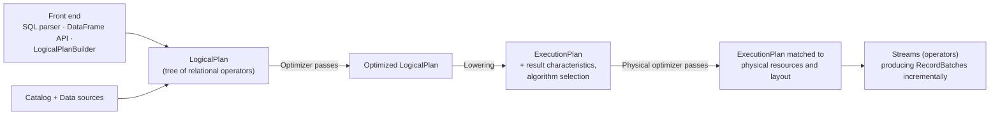

# Apache Arrow DataFusion: A Fast, Embeddable, Modular Analytic Query Engine

> SIGMOD 2024 Industrial Track — structured reading notes

Full paper content: [Markdown conversion](../original/datafusion-sigmod-2024.md)

## Paper information

- **Authors:** Andrew Lamb (InfluxData), Yijie Shen (Space and Time), Daniël Heres (Coralogix),
  Jayjeet Chakraborty (InfluxData), Mehmet Ozan Kabak (Synnada), Chao Sun (Apple), Liang-Chi
  Hsieh (Apple)
- **Venue:** SIGMOD 2024, Santiago, Chile, 14 pages
- **DOI:** [10.1145/3626246.3653368](https://doi.org/10.1145/3626246.3653368)
- **Governance:** Apache Software Foundation project; at writing, **4,600+ pull requests from
  300+ contributors**

## One-sentence summary

DataFusion is an embeddable OLAP query engine written in Rust with Apache Arrow as its in-memory
model and extension points at every layer, and it demonstrates empirically that a **modular,
open-standards engine can match a tightly integrated one (DuckDB)** — the gap being engineering
investment, not architecture.

## Problem and thesis

High-performance analytic engines have traditionally been **tightly integrated** — Vertica,
Spark, DuckDB — because optimizing the interfaces between file format, in-memory layout, and
processing engine was necessary for peak performance. Building such systems is expensive and
needs substantial commercial or research funding.

DataFusion's claim: the community now knows where to draw subsystem boundaries (file format,
catalog, language front-end, execution engine), so an end-to-end system can be **assembled from
reusable open components**. Its competitive performance is the evidence that a modern OLAP engine
**need not** have a tight-knit architecture; its existence as a permissively licensed Apache
project is the evidence that an **open governance model** can create and sustain this level of
technology.

Five contributions, in the paper's own framing:

1. describe the foundational ecosystem powering DataFusion;
2. describe the kinds of systems built on it;
3. describe its architecture, feature set, and optimizations — quantifying the breadth required
   of a modern analytic engine;
4. define the extension APIs, i.e. **the key module boundaries of an analytic stack**;
5. evaluate performance against a state-of-the-art integrated engine.

## Foundational ecosystem

DataFusion is possible only because of three lower-level technologies; without them the authors
doubt they could have built it with their modest resources. A side benefit is that systems built
on DataFusion **share files and in-memory streams with the wider ecosystem without format
conversion**.

### Apache Arrow

Arrow "simply standardizes industrial best practices for representing data in memory using
cache-efficient columnar layouts" — validity/null representation, endianness, variable-length
byte and character data, lists, nested structures. The insight: it likely does not matter whether
NULL is a 0 or 1 in the bitmask, **but it matters enormously that everyone agrees**. Originally an
interchange format, Arrow has grown compute-focused features (`StringView`) and high-performance
compute kernels, so users skip re-implementing well-understood but time-consuming machinery.

### Apache Parquet

Column-oriented file format from the Hadoop ecosystem, inspired by academic columnar storage
work. Provides compression and encoding schemes, structured types via **record shredding**,
embedded self-describing schema, **zone-map-like index structures**, and **Bloom filters**.

Contrast with Arrow: **Arrow optimizes fast random access and in-memory processing; Parquet
optimizes space-efficient storage.** Parquet's structure enables advanced projection and filter
pushdown including **late materialization** applied directly on files, yielding performance
competitive with specialized formats.

### Rust

Low-level yet memory-safe, C-like performance, an ownership model that mitigates memory and
thread-safety hazards. Crucially for an *embeddable* engine: **no language runtime, C ABI
compatible**. Zero-cost abstractions, performance-centric libraries, good docs and diagnostics —
and unlike C/C++ build systems, **Cargo makes adding DataFusion to a project a single
configuration line**.

## Use cases

Projects using DataFusion "spend most of their time innovating value-adding features rather than
replicating existing analytic engine technologies":

1. **Tailored database systems** — time-series databases (InfluxDB 3.0, Coralogix) and streaming
   SQL platforms (Synnada, Arroyo).
2. **Execution runtimes for other front-ends** — Apache Spark, the Vega visualization language,
   the InfluxQL query language.
3. **SQL analysis tools** — dask-sql, SDF — using the SQL parser, planner, and plan
   representation to *analyze* queries.
4. **Table formats** — the Rust implementations of Delta Lake and Lance — using DataFusion
   expressions and plans to fetch and decode remote data, implement predicate-based delete
   tombstones, push predicates into specialized secondary indexes, and compact files while
   retaining sort orders.

All inherit Arrow-native behavior and integrate with Python via pyarrow. Lance, for example,
exposes APIs where user Python functions operate on `RecordBatch`es **directly, without
conversion**.

### Accelerating Apache Spark

Spark's JVM implementation carries well-known overheads, but its design permits replacing **just
the execution engine** (as Velox and Photon do). Several Spark native runtimes use DataFusion —
including **Blaze** — keeping Spark's front-end, parsing, analysis, and optimization intact while
converting execution plans into DataFusion `ExecutionPlan`s executed through JNI, with
**zero-copy data exchange via Arrow**. Where Spark's semantics diverge from DataFusion's (e.g.
decimal operations that deviate from ANSI SQL), the extension APIs let projects override
expressions and operators.

## The deconstructed database argument

The trend is away from monolithic "one size fits all" systems toward "fit for purpose"
specialized ones — feasible at scale only when they can be assembled from reusable high-quality
components (the **Deconstructed Database**).

Two cited failures of reuse:

- **pandas / data science tooling.** The community innovated genuinely new APIs (DataFrame vs.
  SQL) and a different deployment model (local files vs. networked servers), but initially
  performed poorly because it lacked query planning/optimization and parallel vectorized
  execution. *Apache Arrow was born out of the desire to bring these database techniques to the
  data science ecosystem.*
- **MapReduce/Hadoop.** Database researchers pointed out technical inferiority, but the absence
  of open, standard, reusable components made re-implementation of similar low-level analytical
  techniques inevitable.

### The LLVM parallel

| Stage | Compilers | Databases |
| --- | --- | --- |
| **Tightly integrated** | Hardware-specific compilers shipped as part of IBM System/390, Solaris, AIX, HP-UX | Oracle, SQL Server, DB2 — directly managing storage hardware, connections, SQL functions, execution, and on-disk/in-memory formats |
| **Open source, internally integrated** | gcc — cross-platform, widely adopted | MySQL, PostgreSQL |
| **Open source and modular** | Rust, Swift, Zig, Julia all share **LLVM** | InfluxDB 3.0, GreptimeDB, Coralogix all share **DataFusion** |

Just as LLVM let language authors focus on language-specific features while reusing IRs, standard
optimizations, code generation, and auto-vectorization, DataFusion lets database designers build
domain-specific features instead of re-implementing SQL front-ends, plan representations,
optimizations, storage formats, and operators.

## Architecture



Every stage is an extension point.

### Catalog and data sources

- **Catalog** supplies metadata: which tables exist, columns and types, statistics, storage
  details. DataFusion ships a simple in-memory catalog and a **Hive-like partitioned
  file/directory catalog**, but acknowledges no general-purpose catalog suits everyone — most
  systems supply their own (e.g. reading a Hive metastore directly).
- **Five built-in `TableProvider`s** — Parquet, Avro, JSON, CSV, Arrow IPC — all implemented via
  **the same API any custom source would use**. The Parquet reader uses Arrow-Rust and features
  predicate pushdown, late materialization, Bloom filters, and nested types. CSV and JSON readers
  infer schema; the JSON reader fully supports structs and lists.

### Front ends

- **Data types** come straight from Arrow: integers and floats of various widths, fixed-precision
  decimals, variable-length character and binary strings, dates, times, timestamps, intervals,
  durations, nested structs and lists. Operators exchange **Arrow Arrays or scalar values**.
- **SQL planner** built on `sqlparser-rs`, producing a `LogicalPlan`. Supported subset: `WHERE`,
  `GROUP BY`, `ORDER BY`, `LIMIT`, `DISTINCT`, `WINDOW`/`OVER`, `UNION`/`INTERSECT`,
  `GROUPING SETS`, `FULL`/`INNER`/`OUTER JOIN`, plus `ROWS`/`VALUES` `PRECEDING`, `FOLLOWING`,
  `UNBOUNDED` window bounds and `GROUP BY` with per-aggregate `FILTER` and `ORDER BY`. (The
  authors note no SQL implementation should claim completeness against an ever-expanding spec.)
- **DataFrame API** modeled on pandas produces the *same* `LogicalPlan`, optimized and executed
  identically. **`LogicalPlanBuilder`** offers a Rust builder interface for constructing plans
  directly — the entry point for custom query languages.

### Plan representations and analysis

The API includes:

1. Structures for trees of expressions and relational operators at both **logical** (`Expr`,
   `LogicalPlan`) and **physical** (`PhysicalExpr`, `ExecutionPlan`) levels, with ergonomic
   manipulation routines.
2. **(De)serialization** to bytes for network transport, via **Protocol Buffers and Substrait**.
3. **Statistics** known at planning time — row counts, min/max values.

**Expression analysis** libraries provide simplification, **interval analysis**, and range
propagation. Combined with statistics these yield predicate cardinality/selectivity estimates and
**plan-time partition elimination** (e.g. Parquet row group pruning). They are usable directly by
client systems as well as internally.

**Function library:** a large set of built-in scalar, window, and aggregate functions — string
operations, timestamp/date/time manipulation, interval arithmetic, list/struct/map operations —
**implemented through the same API as user-defined functions**, manipulating Arrow Arrays, and
callable from both SQL and DataFrame APIs.

**Rewrites:** an extensible framework of `LogicalPlan` and `ExecutionPlan` transformations,
handling both mundane requirements (automatic type coercion to match operator/function
signatures; inserting necessary sorts and redistributions) and optimizations — **the same
framework for both**.

### Execution engine

**Pull-based streaming execution**, parallelized across cores via Volcano-style exchange operators
(`RepartitionExec`).

- **Streaming.** Operators produce output incrementally as Arrow Arrays grouped into
  `RecordBatch`es, **default 8192 rows**. Pipeline breakers (full sort, final aggregation, hash
  join) buffer and **spill to disk** as needed. Data flows between operators as Arrow Arrays,
  which is what makes user-defined operators first-class. *Within* an operator, non-Arrow
  representations such as the **RowFormat** are used where they are faster.
- **Operator interface.** Each `Stream` implements Rust's `Stream` trait; control flow uses Rust's
  built-in `await` continuation generation, which **automatically marshals state before
  yielding**:

  ```rust
  impl Stream for MyOperator {
      // Pull next input (may yield at await)
      while let Some(batch) = stream.next().await {
          if Some(output) = self.process(&batch)? {
              tx.send(batch).await   // "Return" RecordBatch to output
          }
      }
  }
  ```

- **Multi-core.** Each `ExecutionPlan` generates one or more `Stream`s running in parallel; the
  count is the plan's **partitioning**, fixed at plan time. Most Streams coordinate only with
  their inputs; exceptions are `HashJoinExec` (building a shared hash table) and `RepartitionExec`
  (redistributing data).
- **Thread scheduling.** Streams are Rust `async` functions running on a **Tokio** runtime — a
  library originally designed for async network I/O, chosen for CPU-bound work because of its
  efficient **work-stealing scheduler**, first-class compiler support for continuation
  generation, and performance. The authors acknowledge published concerns about the Volcano model
  on NUMA architectures but report comparable scalability in practice.
- **Memory management.** A **`MemoryPool`** shared across concurrent queries; Streams
  *cooperatively* report usage. The approach is pragmatic: **track the largest consumers
  accurately** (e.g. hash table contents in a hash aggregate) and **ignore small ephemeral
  allocations** (e.g. the current output batch). Two built-in pools: **`GreedyPool`** (per-process
  limits, no fairness) and **`FairPool`** (distribute evenly among pipeline-breaking operators).
  Systems built on DataFusion typically implement domain-specific policies via the same API.

## Optimizations

The authors are explicit that **none of these techniques is novel** — each is extensively studied
and repeatedly implemented. The contribution is that a well-tested, extensible implementation
exists so new systems need not re-implement them again.

| Area | What DataFusion does |
| --- | --- |
| **Logical rewrites** | Projection pushdown, filter pushdown, limit pushdown, expression simplification, common subexpression elimination, join predicate extraction, **correlated subquery flattening**, outer→inner join conversion |
| **Physical rewrites** | Eliminating unnecessary sorts, maximizing parallel execution, selecting specific algorithms (hash vs. merge join) |
| **Sorting** | Tree-of-losers, **RowFormat** normalized keys, spill to temporary disk files, specialized "Top K" implementation for `LIMIT` |
| **Grouping/aggregation** | **Two-phase parallel partitioned hash grouping**, vectorized, spill-capable, with special handling for no group keys, partially ordered, and fully ordered group keys |
| **Joins** | Automatic equi-join predicate identification, heuristic join reordering from statistics, predicate pushdown through joins (respecting OUTER restrictions), transitive join predicate introduction, physical algorithm selection. Implementations: parallel in-memory hash join, merge join, **symmetric hash join**, nested loops, cross join — all supporting Inner/Left/Right/Full/LeftSemi/RightSemi/LeftAnti/RightAnti. Hash join uses **MonetDB-style vectorized hashing and collision checking**. Future work: dynamically applying join filters during scans (sideways information passing) |
| **Window functions** | Minimizes resorting by reusing existing sort orders, sorting only when `PARTITION BY`/`ORDER BY` demand it; evaluates **incrementally**, emitting output once the required window is present. Deliberately has *not* implemented Physical Segment Trees — window queries are typically dominated by sorting anyway |

### RowFormat (normalized sort keys)

Columnar engines excel where operations vectorize, but query processing also needs **fundamentally
row-based** operations — multi-column sorting, multi-column equality for grouping and joins —
where per-row overhead cannot be amortized by vectorization. Inside those operators DataFusion
uses a **RowFormat**, a normalized key that:

1. permits **byte-wise comparison with `memcmp`**, and
2. offers **predictable memory access patterns**.

It is densely packed column after column with per-type encodings, optionally adjusted for SQL
sort options (`ASC`/`DESC`, NULL placement). Signed and unsigned integers use big-endian
representation; **floats are converted to a signed integer representation that folds in the sign
bit**.

### Leveraging sort order

The optimizer **tracks multiple sort orders simultaneously** (e.g. data sorted by (A, B) *and*
(A, C) after an order-preserving join on B=C) and includes Streams optimized for sorted or
partially sorted input — merge join, partially ordered (streaming) hash aggregation. Two reasons
this matters:

1. **Physical clustering.** Secondary indexes are often too expensive to build and maintain at
   high ingest rates, so **the sort order of primary storage is the only available physical
   clustering optimization**.
2. **Memory usage and streaming.** Sort order defines how data flowing through Streams is
   partitioned *in time*, which determines where values can change and therefore **where
   intermediate results can be emitted** rather than buffered.

### Pushdown and late materialization

Three things are pushed toward the data source: **projection** (elide unneeded columns),
**LIMIT/OFFSET** (stop early), and **predicates** (filter closer to, or inside, the source).

Worked example for `A > 35 AND B = "F"` in the Parquet reader:

1. **Prune Row Groups** using metadata: skip any where `A_max <= 35`, or `B_max < 'F'`, or
   `B_min > 'F'`.
2. **Decode only column B**, evaluate `B = "F"`, capture surviving rows as a `RowSelection`
   (e.g. row indexes [100–244]).
3. **Decode only the pages of column A containing those rows** (using the Page Index), evaluate
   `A > 35`, refining the `RowSelection` (e.g. to [100–150]).
4. **Decode the remaining selected columns** (e.g. C) only for the surviving rows.

Most effective when predicate columns cluster together — for instance when they appear early in
a sorted file's sort order.

## Extension APIs — "a blueprint for future modular query engines"

All extension APIs represent data as **Arrow Arrays**, so extensions have **the same performance
as built-ins** and can reuse existing libraries and optimized compute kernels.

| Extension point | What it enables | Why it's hard elsewhere |
| --- | --- | --- |
| **Scalar / Aggregate / Window functions** | Registered dynamically at runtime; take and return Arrow Arrays. Real examples: derivative window functions, calendar bucketing for time series, custom binary manipulation for cryptography | Other engines' UDF APIs are usually slower and less capable than built-ins, and must bind tightly to internal data representation — especially painful for columnar engines |
| **Catalog** | `TableProvider` (a table) → `SchemaProvider` (a collection of tables) → `CatalogProvider` (a collection of schemas). **All async Rust functions**, so remote catalogs are straightforward. Delta Lake's Rust implementation uses this plus expression evaluation to skip Parquet files by predicate | — |
| **Data sources** | Query in-memory Arrow buffers, stream from remote servers (e.g. Arrow Flight), or read custom formats. `TableProvider` supports **partitioned inputs, projection/filter/limit pushdown, parallel concurrent reads, and communicating pre-existing sort orders** | A custom source must produce the engine's native format, interact with its expression representation for pushdown, and handle async I/O for streaming output |
| **Execution environment** | `MemoryPool` (allocation control), `DiskManager` (temporary files), `CacheManager` (directory contents, per-file metadata) — because environments differ: fast local NVMe versus Kubernetes without persistent local disk; concurrent queries sharing resources opportunistically versus predefined budgets | — |
| **Query/language front ends** | Rewrite the AST before the SQL planner for small extensions; implement a custom parser/planner emitting `LogicalPlan`s for entirely different languages (PromQL, Vega) | — |
| **Optimizer passes** | Implement `OptimizerRule` and `PhysicalOptimizerRule` using **the same APIs as built-in rewrites**, and control the order in which all rules apply | — |
| **Relational operators** | Implement the `ExecutionPlan` trait — **exactly** as built-in join, filter, group-by, and window nodes do. **DataFusion does not distinguish user-defined from built-in plans** when optimizing or executing. Real examples: InfluxDB IOx's time-series gap filling, schema pivoting, insert-order resolution | Other systems expose user-defined *table functions*, which restrict syntax and plan placement and rarely match built-in performance |

## Evaluation

**Question:** what performance penalty does modularity and open standards impose? **Baseline:**
DuckDB, chosen as an exemplar of a state-of-the-art tightly integrated engine.

- **Versions:** DataFusion 32.0.0 vs DuckDB 0.9.1, via their Python bindings. Scripts published.
- **All benchmarks run directly on raw source files** — no load into a per-database format. The
  authors argue loading is increasingly impractical as data flows become fluid and multi-tool.
- Core count controlled via DataFusion's `target_partitions` and DuckDB's `threads` PRAGMA.

| Benchmark | Models | Data |
| --- | --- | --- |
| **ClickBench** | Large-scale web analytics — filter and aggregate a large denormalized dataset | Unmodified 14 GB `athena_partitioned` dataset: **100 Parquet files, ~140 MB each** |
| **TPC-H** | Classic warehouse analytics, 22 join-heavy queries | Scale Factor 10, each of 8 CSVs converted to one Parquet file with row groups capped at 1M records; **2.5 GB total** |
| **H2O-G** | Data science group-by operations | `G1_1e7_1e2_5_0.csv` — a single **488 MB CSV with 10M records** |

### Single-core efficiency

Hardware: GCP `e2-standard-8`, Intel Broadwell, 32 GB RAM, 8 vCPU, Ubuntu 22.04.3, kernel
6.2.0-1013-gcp.

**ClickBench (seconds, single core):**

| Query | DataFusion | DuckDB | Delta |
| ---: | ---: | ---: | --- |
| 1 | 1.22 | 0.18 | 6.74× slower |
| 2 | 0.36 | 0.81 | 2.25× faster |
| 3 | 1.11 | 1.78 | 1.6× faster |
| 4 | 1.09 | 1.5 | 1.38× faster |
| 5 | 20.74 | 8.34 | 2.49× slower |
| 6 | 17.81 | 11.98 | 1.49× slower |
| 7 | 0.3 | 2.08 | 6.91× faster |
| 8 | 0.37 | 0.83 | 2.24× faster |
| 9 | 27.91 | 10.83 | 2.58× slower |
| 10 | 25.84 | 14.11 | 1.83× slower |
| 11 | 4.29 | 3.22 | 1.33× slower |
| 12 | 4.67 | 8.69 | 1.86× faster |
| 13 | 11.38 | 10.27 | 1.11× slower |
| 14 | 26.96 | 14.61 | 1.84× slower |
| 15 | 12.7 | 11.15 | 1.14× slower |
| 16 | 13.31 | 9.12 | 1.46× slower |
| 17 | 29.6 | 21.97 | 1.35× slower |
| 18 | 29.09 | 21.23 | 1.37× slower |
| 19 | 92.31 | 39.1 | 2.36× slower |
| 20 | 0.8 | 1.33 | 1.65× faster |
| 25 | 6.01 | 8.44 | 1.4× faster |
| 26 | 5.02 | 6.11 | 1.22× faster |
| 27 | 6.59 | 8.4 | 1.28× faster |
| 28 | 23.62 | 23.85 | 1.01× faster |
| 29 | 107.41 | 62.99 | 1.71× slower |
| 30 | 5.91 | 69.08 | **11.7× faster** |
| 31 | 12.59 | 12.95 | 1.03× faster |
| 32 | 14.85 | 15.93 | 1.07× faster |
| 33 | 92.17 | 57.2 | 1.61× slower |
| 36 | 27.89 | 11.48 | 2.43× slower |
| 37 | 0.67 | 0.52 | 1.31× slower |
| 38 | 0.34 | 0.38 | 1.12× faster |
| 39 | 0.34 | 0.42 | 1.24× faster |
| 40 | 2.05 | 0.83 | 2.46× slower |
| 41 | 0.2 | 0.25 | 1.28× faster |
| 42 | 0.17 | 0.24 | 1.43× faster |
| 43 | 0.19 | 0.27 | 1.44× faster |

The pattern the authors read out of it:

- **DataFusion wins on highly selective predicates** (Q2, Q8, Q20) — predicate pushdown into the
  Parquet scan skips whole row groups.
- **DataFusion wins on single-group queries** (Q4, Q7, Q30) — vectorized aggregate updates.
- **Roughly equal** at medium selectivity and medium group cardinality (Q15, Q31, Q32, Q41, Q42).
- **DuckDB wins at high group cardinality** (≥10M groups: Q18, Q19, Q36) — its highly optimized
  parallel group-by aggregation.

**TPC-H:** DataFusion is faster on highly selective queries (Q4, Q9), roughly equal on Q3, Q6,
Q14, and **well over 2× slower on Q11, Q17, Q18, Q21**. Crucially, **most of the largest gaps are
due to a suboptimal join order; forcing a better order makes the two systems similar.**

**H2O-G:** DataFusion is slightly better on most queries but **significantly worse on Q9** because
of an inefficient `corr` aggregate implementation. Runtime is dominated by CSV parsing, where
DataFusion benefits from Arrow-Rust's highly optimized parser. The single-core restriction may
**unfairly penalize DuckDB**, which appears to optimize multi-threaded parsing.

**The authors' conclusion:** both engines perform similarly per core with different strengths;
**nothing about open standards fundamentally limits performance — the determining factor is
available engineering investment.** They name concrete in-flight work on both sides: DataFusion
improving join ordering and high-cardinality grouping, DuckDB expected to improve low-cardinality
grouping, Parquet predicate pushdown, and CSV parsing.

### Scalability

Hardware: GCP `c3-highcpu-176`, Intel Sapphire Rapids, **176 vCPU, 352 GB RAM**, Ubuntu 22.04,
kernel 6.2.0-1016-gcp. Each ClickBench query run 5 times at 1–192 cores; the final 3 runs plotted
to remove caching/warm-up effects.

- **Read absolute values, not ratios.** Q10 takes seconds while Q1 takes under a second, so an
  apparently large relative gap in Q1–Q4 or Q37–Q42 is hundreds of milliseconds, while the gap in
  Q19, Q32, Q33 is an order of magnitude larger in absolute terms.
- **Up to 32 cores:** both engines show excellent, near-linear improvement.
- **64/128/192 cores:** mixed. Q28 and Q29 keep improving close to the ideal curve (low ~6,000
  and medium ~3M cardinality grouping with CPU-heavy `LIKE` matching). **Q11, Q14, Q32 actually
  slow down** for *both* engines as cores increase — as per-core work shrinks, coordination
  overhead dominates. The high-core slowdown is more pronounced for DataFusion on Q41–Q43 (partly
  a poorly tuned hash table flushing strategy for high cardinalities) and more pronounced for
  DuckDB on Q25–Q26.
- **Conclusion:** curves are similar in shape for both engines, so **the modular design and
  pull-based scheduler do not preclude state-of-the-art multi-core performance**; the differences
  are implementation details, not design.

## Positioning against related work

- **Velox and Apache Calcite** also provide components for assembling analytic systems, but
  building an end-to-end system requires substantial integration (bridging JVM and native code
  and build systems) whereas **DataFusion needs one configuration line**. **Photon** and
  **Gluten** (Velox-based) show the modular payoff by replacing only Spark's execution engine.
- **DuckDB** is likewise an open-source serverless SQL system, but the target users differ:
  **DuckDB targets people who run SQL; DataFusion targets people building systems** (which may run
  SQL among other processing). DuckDB has a more limited extension API and **its own** in-memory
  representation, storage format, Parquet implementation, and thread scheduler.
- The composable-architecture theme dates to at least 2000; "Deconstructed Database" was
  popularized in 2018.
- **Future research** the authors call for: modular components for **transaction processing and
  distributed key/value stores**, and first-class support (bindings or reimplementations) for
  **C/C++ and Swift**.

## Limitations and questions

- **Known performance gaps at publication:** high-cardinality grouping, join ordering (the cause
  of the worst TPC-H results), the `corr` aggregate, and a poorly tuned hash table flushing
  strategy at high core counts. The paper argues these are investment gaps, not design limits —
  a claim the benchmarks support but do not prove.
- **The join order problem is real today.** "Manually forcing a better join order makes them
  similar" is an honest disclosure, but end users do not hand-tune join order.
- **Benchmark caveats acknowledged by the authors:** benchmarking is hard, target use cases
  differ, and both engines change quickly. Both are compared through Python bindings.
- **Single-core H2O-G likely penalizes DuckDB**, which the authors state explicitly.
- **No transactions, no storage layer of its own.** DataFusion is a query engine; durability,
  concurrency control, and catalog persistence are the embedder's problem.
- **Volcano-model/NUMA concerns are set aside empirically** rather than addressed in design.
- **Modularity's cost is not measured** — the paper measures the *performance* cost (≈ none) but
  not the integration effort, versioning, or API-stability burden borne by embedders.

## Practical design checklist

Reach for DataFusion when:

- you are **building a data system**, not just running SQL — a time-series DB, a streaming SQL
  platform, a table format, a query front-end for a domain language;
- you need domain-specific operators, functions, or optimizer rules that must run at **built-in
  speed**;
- your data lives in **open formats** (Parquet, Arrow, CSV, JSON, Avro) and interoperates with
  other tools;
- you want to embed an engine with **no runtime and C ABI compatibility**.

Reach for something else when:

- you need an out-of-the-box interactive SQL tool for end users (DuckDB is the closer fit);
- your workload is dominated by very high cardinality grouping or complex join reordering, at
  least as of the versions benchmarked;
- you need built-in transactions, storage management, or a persistent catalog.

## Takeaways

1. **The modularity penalty is measurable and it is roughly zero.** Across three benchmarks
   DataFusion trades wins with DuckDB and scales with the same curve shape; the differences track
   implementation effort, not architecture.
2. **Standardization matters more than the choice standardized.** Arrow's value is that everyone
   agrees on null representation and endianness, not that any particular convention is best.
3. **Make the extension API the internal API.** DataFusion's built-in file formats, functions, and
   operators use exactly the APIs users get — which is precisely why extensions are as fast as
   built-ins, and why the optimizer treats them identically.
4. **Choose your module boundaries deliberately.** The extension list (catalog, data source,
   functions, execution environment, front-end, optimizer rules, relational operators) doubles as
   a specification of where an analytic stack should be cut.
5. **Columnar engines still need row-oriented internals.** The RowFormat exists because
   multi-column sort and equality cannot be vectorized; `memcmp`-able normalized keys are the
   answer.
6. **Sort order is an optimizer asset, not an execution detail.** Tracking multiple orders enables
   merge joins, streaming aggregation, and — where secondary indexes are unaffordable at high
   ingest rates — is the *only* physical clustering available.
7. **Push work into the scan.** Row group pruning, Bloom filters, and column-by-column late
   materialization mean the engine often decodes only one column before eliminating most rows.
8. **Track big memory, ignore small.** Pragmatic memory accounting — accurate for hash tables,
   approximate for output batches — is enough to make spilling work without pervasive overhead.

## Citation

```bibtex
@inproceedings{lamb2024datafusion,
  author = {Andrew Lamb and Yijie Shen and Dani\"{e}l Heres and Jayjeet Chakraborty and
            Mehmet Ozan Kabak and Chao Sun and Liang-Chi Hsieh},
  title = {Apache Arrow DataFusion: A Fast, Embeddable, Modular Analytic Query Engine},
  booktitle = {Companion of the 2024 International Conference on Management of Data
               (SIGMOD/PODS '24)},
  year = {2024},
  doi = {10.1145/3626246.3653368}
}
```
