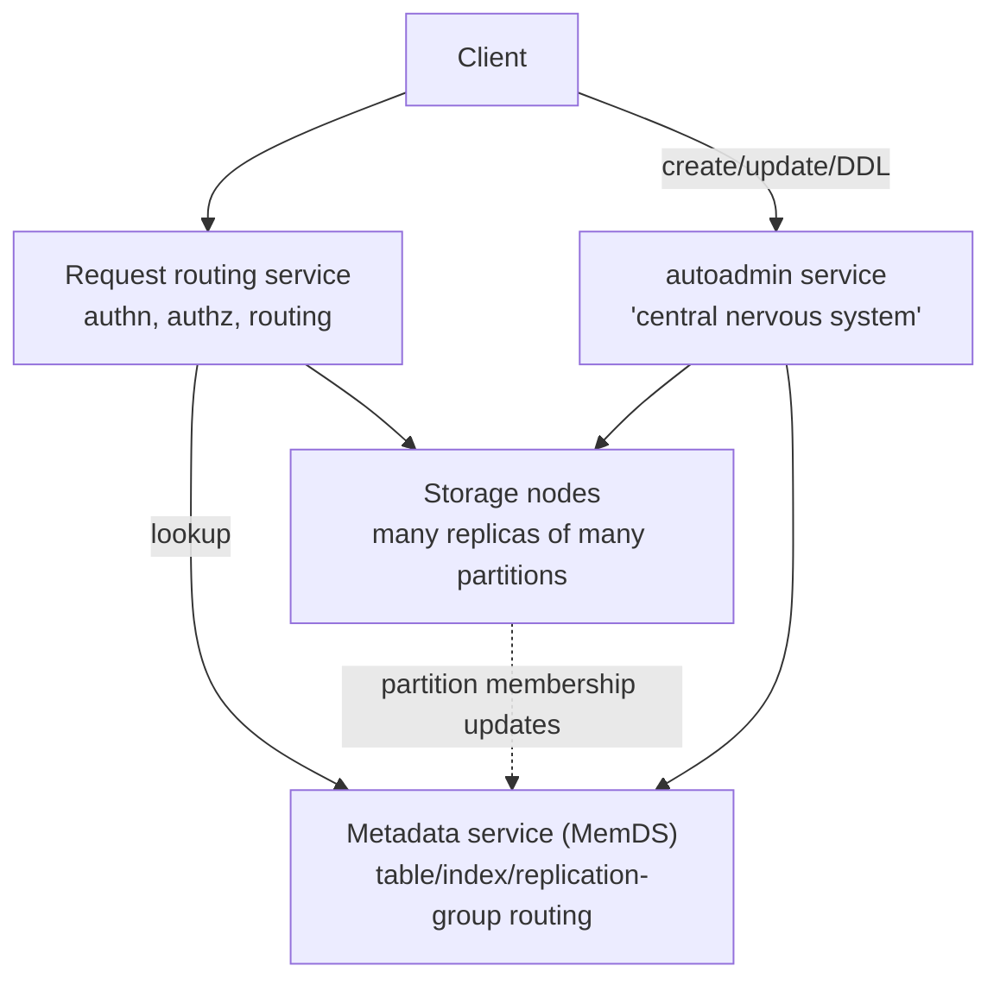

# Amazon DynamoDB: A Scalable, Predictably Performant, and Fully Managed NoSQL Database Service

> USENIX ATC 2022 — structured reading notes

Full paper content: [Markdown conversion](../original/dynamodb-atc-2022.md)

## Paper information

- **Authors:** Mostafa Elhemali, Niall Gallagher, Nicholas Gordon, Joseph Idziorek, Richard Krog,
  Colin Lazier, Erben Mo, Akhilesh Mritunjai, Somu Perianayagam, Tim Rath, Swami
  Sivasubramanian, James Christopher Sorenson III, Sroaj Sosothikul, Doug Terry, Akshat Vig
- **Affiliation:** Amazon Web Services
- **Venue:** 2022 USENIX Annual Technical Conference, July 11–13, 2022, Carlsbad, CA, pages
  1037–1048
- **Paper page:** https://www.usenix.org/conference/atc22/presentation/vig

## One-sentence summary

This is a ten-year operational retrospective: how DynamoDB evolved from statically provisioned
per-partition capacity to global admission control and on-demand tables, how it achieves
durability through continuous verification and formal methods, and how it defends availability
against gray failures, deployment hazards, and its own caches — while serving a **peak of 89.2
million requests per second** during Prime Day 2021 at single-digit millisecond latency.

## Six fundamental properties

1. **Fully managed cloud service.** Applications create tables and read/write data without regard
   for where tables are stored or how they are managed. DynamoDB handles provisioning, failure
   recovery, encryption, software upgrades, backups, patching.
2. **Multi-tenant architecture.** Data from different customers shares physical machines for high
   utilization, with savings passed to customers. Isolation comes from **resource reservations,
   tight provisioning, and monitored usage**.
3. **Boundless scale for tables.** No predefined data limits; a table's resources scale from
   several servers to many thousands as storage and throughput demand grow.
4. **Predictable performance.** A simple `GetItem`/`PutItem` API enables consistent low latency —
   **low single-digit milliseconds for a 1 KB item** in-Region. Critically, **latency stays stable
   as tables grow from megabytes to hundreds of terabytes**, through automatic partitioning and
   re-partitioning.
5. **Highly available.** Replication across Availability Zones with automatic re-replication after
   disk or node failure. **SLA: 99.99% for regular tables, 99.999% for global (multi-Region)
   tables.**
6. **Flexible use cases.** No fixed schema — each item may carry any number of attributes of
   varying types, including multi-valued ones. Key-value or document model. Reads can request
   **strong or eventual consistency**.

The framing that drives everything: **consistent performance at any scale matters more than
median service time**, because an unexpectedly slow request amplifies through the layers of
applications above DynamoDB.

## History: why DynamoDB is not Dynamo

- **Dynamo** (2007) was Amazon's first NoSQL system, built for shopping cart data after learning
  that giving applications direct access to enterprise database instances caused scaling
  bottlenecks — connection management, interference between concurrent workloads, and operational
  pain like schema upgrades. The answer was a service-oriented architecture encapsulating data
  behind APIs.
- **Dynamo's flaw was operational, not technical.** It was **single-tenant**; every team ran its
  own installation and had to become an expert in the database. That operational complexity became
  a barrier to adoption.
- **SimpleDB** was Amazon's first database-as-a-service: fully managed, elastic, multi-datacenter
  replication, high availability and durability, no setup or patching. Engineers preferred it to
  Dynamo *even when Dynamo fit their needs better*. But it had two limits: **tables capped at
  10 GB** and limited request throughput, and **unpredictable query and write latency** because
  *all* attributes were indexed and every write updated the index. Developers had to split data
  across tables — a new operational burden.
- **DynamoDB (2012)** combined the best of both: Dynamo's **incremental scalability and
  predictable high performance** with SimpleDB's **ease of administration, consistency, and a
  table-based data model richer than pure key-value**. It shares most of the name with Dynamo and
  little of the architecture.

## Architecture

### Data model and API

- A **table** is a collection of **items**; each item is a collection of **attributes**, uniquely
  identified by a **primary key** whose schema is fixed at table creation.
- The primary key is either a **partition key** or a **composite (partition key + sort key)**. The
  partition key value always feeds an internal hash function; the hash output plus the sort key
  determines placement. Many items may share a partition key value but must differ in sort key.
- **Secondary indexes** allow querying by an alternate key; a table may have one or more.

| Operation | Description |
| --- | --- |
| `PutItem` | Insert a new item, or replace an old item with a new one |
| `UpdateItem` | Update an existing item, or add it if absent |
| `DeleteItem` | Delete a single item by primary key |
| `GetItem` | Return a set of attributes for the item with a given primary key |

Any insert/update/delete can carry a **condition** that must hold for the operation to succeed.
DynamoDB also supports **ACID transactions** across items "without compromising the scalability,
availability, and performance characteristics" of tables.

### Partitions and replication

A table is divided into **partitions**, each hosting a **disjoint and contiguous** part of the
key range. Each partition has multiple replicas across different AZs, forming a **replication
group** that uses **Multi-Paxos** for leader election and consensus.

- **Any replica can trigger an election.** Once elected, a leader keeps leadership by
  **periodically renewing a lease**.
- **Only the leader serves writes and strongly consistent reads.** On a write, the leader
  generates a write-ahead log record and sends it to peers; the write is acknowledged once a
  **quorum of peers persists the record to their local WALs**.
- **Any replica can serve eventually consistent reads.**
- If peers failure-detect the leader, one can propose a new election — but **the new leader serves
  no writes or consistent reads until the previous leader's lease expires**.

Two replica types:

| Replica type | Contains | Purpose |
| --- | --- | --- |
| **Storage replica** | Write-ahead logs **and** the B-tree holding key-value data | Full participant; serves reads |
| **Log replica** | Only recent write-ahead log entries — no B-tree, no key-value data | "Akin to acceptors in Paxos." Can be added in **seconds** (only recent WAL must be copied), versus **minutes** to heal a full storage replica (B-tree + logs) |

### Services



- **Metadata service:** routing information about tables, indexes, and replication groups for a
  table's or index's keys.
- **Request routing service:** authorizes, authenticates, and routes every request — reads and
  updates to storage nodes, resource creation/update/DDL to autoadmin.
- **Storage service:** stores customer data across a fleet of storage nodes, each hosting many
  replicas of different partitions.
- **autoadmin:** "the central nervous system." Owns fleet health, partition health, table scaling,
  and all control-plane requests. Continuously monitors partitions and **replaces any replica
  deemed unhealthy** (slow, unresponsive, or on bad hardware), and health-checks all core
  components, replacing failing hardware.

DynamoDB comprises **tens of microservices**; others (not diagrammed in the paper) support
point-in-time restore, on-demand backups, update streams, global admission control, global
tables, global secondary indexes, and transactions.

## The journey from provisioned to on-demand

### The original model and why it broke

Customers specified throughput as **read capacity units (RCU)** and **write capacity units
(WCU)**:

- **1 RCU** = one strongly consistent read per second for items up to **4 KB**.
- **1 WCU** = one standard write per second for items up to **1 KB**.

Admission control was **distributed and purely local**: each storage node enforced limits based
on the allocations of its own partitions. A cap on per-partition throughput plus the requirement
that a node's total allocated throughput not exceed its drives' physical capability provided
workload isolation.

Throughput was divided arithmetically:

| Event | Result |
| --- | --- |
| Split **for size** | Parent's allocated throughput divided **equally** among children |
| Split **for throughput** | New partitions allocated from the table's provisioned throughput |
| Table 3200 WCU, max 1000 WCU/partition | 4 partitions × 800 WCU |
| Increased to 3600 WCU | 4 partitions × 900 WCU |
| Increased to 6000 WCU | Split to 8 partitions × 750 WCU |
| Decreased to 5000 WCU | 8 partitions × 675 WCU |

**The flawed assumption:** that applications access keys uniformly and that splitting for size
splits performance proportionately. In reality access is non-uniform **both over time and over
key ranges**, so splitting a partition can leave its *hot* portion with **less** available
performance than before the split.

Two named failure modes:

- **Hot partitions** — traffic concentrated on a few items, either in a stable set of partitions
  or hopping between them over time.
- **Throughput dilution** — splitting for size divides throughput equally, so per-partition
  throughput falls.

Both produce **throttling**: rejected reads and writes even though the table's total provisioned
throughput was sufficient. From the customer's view this is unavailability, "even though the
service was behaving as expected." The workaround — over-provisioning — was a poor experience
because right-sizing was hard to estimate.

### Fix 1: Bursting (short spikes)

Observation: not all partitions on a node use their allocated throughput simultaneously.
DynamoDB **retains a partition's unused capacity for up to 300 seconds** as **burst capacity**,
usable on a best-effort basis when consumption exceeds provisioned capacity.

Isolation is preserved by requiring **node-level** headroom too. Capacity is managed with **token
buckets: two per partition (allocated and burst) plus one per node**:

- Tokens in the partition's **allocated** bucket → admit, deducting from partition and node
  buckets.
- Allocated exhausted → admit only if tokens exist in **both** the burst bucket **and** the node
  bucket.
- **Reads** are accepted on local buckets alone. **Writes using burst capacity require an
  additional check against the node-level buckets of the partition's other replicas** — the leader
  periodically collects each member's node-level capacity.

### Fix 2: Adaptive capacity (long spikes)

Actively monitors provisioned and consumed capacity of all tables. If a table throttles **while
its table-level throughput is not exceeded**, DynamoDB **boosts** the allocated throughput of its
partitions via a **proportional control algorithm**, and reduces it again if the table exceeds
its provisioned capacity. autoadmin relocates boosted partitions to nodes that can serve the
increase.

Still best-effort, but it **eliminated over 99.99% of throttling due to skewed access patterns**.

### Fix 3: Global admission control (GAC)

Both prior fixes had limits: **bursting only helps short spikes and depends on node headroom**;
**adaptive capacity is reactive — it engages only after throttling has already been observed**,
meaning the application already saw unavailability. The deeper problem was that **admission
control was coupled to partition-level capacity**.

GAC removes that coupling — **let the partition burst always, while preserving isolation**:

- The **GAC service centrally tracks total table consumption in tokens**.
- **Each request router maintains a local token bucket** and contacts GAC to replenish every few
  seconds. On each request the router deducts tokens; when it runs out (through consumption or
  expiry) it asks GAC for more.
- **GAC state is ephemeral**, computed on the fly from client requests, so **any GAC server can be
  stopped and restarted without impacting the service**. Each server tracks one or more
  independently configured buckets; all servers form an **independent hash ring**.
- Result: **non-uniform workloads hitting only a subset of items can run up to the maximum
  partition capacity.**
- **Partition-level token buckets are retained for defense in depth**, capped so that one
  application cannot consume all or a significant share of a storage node's resources.

### Balancing consumed capacity

Always-on bursting complicates colocation. Under the old static model, allocation was simple:
find a node that can accommodate the partition's allocated capacity; partitions never exceeded
it, so there were **no noisy neighbors**. But since nodes never used their full capacity at once,
the system **packs nodes with replicas totaling more than the node's provisioned capacity** —
which bursting can then overdraw.

Mitigation: **each storage node independently monitors total throughput and data size of its
replicas.** If throughput passes a threshold percentage of node maximum, it reports **candidate
partition replicas to move** to autoadmin, which finds a new node **in the same or another AZ that
does not already hold a replica of that partition**.

### Splitting for consumption

Even with GAC, skewed traffic to specific items can throttle. So DynamoDB **automatically splits
a partition once its consumed throughput crosses a threshold**, choosing the split point **from
the observed key distribution** — a proxy for the application's access pattern, and more effective
than splitting the key range in the middle. Splits complete **in minutes**.

**Two workload classes cannot benefit** and are detected so the split is skipped:

- a partition receiving high traffic to a **single item**;
- a partition whose key range is **accessed sequentially**.

### On-demand tables

Capacity units were a novel concept, and customers either over-provisioned (low utilization) or
under-provisioned (throttles). **On-demand tables** remove provisioning entirely: DynamoDB
observes read and write signals and **instantly accommodates up to double the previous peak
traffic**, allocating more automatically as traffic grows further so the workload does not
throttle. Scaling works by **splitting partitions for consumption**, driven by traffic. GAC
protects against any one application consuming all resources, and consumption-based balancing lets
on-demand partitions be placed so as not to hit node-level limits.

## Durability and correctness

### Hardware failures

Write-ahead logs live in **all three replicas** and are **periodically archived to S3** (designed
for 11 nines of durability). Each replica retains its most recent, not-yet-archived logs —
typically **a few hundred megabytes**.

When a node fails, its replication groups drop to two copies, and **healing a storage replica
takes several minutes** because the B-tree and WAL must be copied. So on detecting an unhealthy
storage replica, the leader **adds a log replica within seconds** — copying only recent WAL, no
B-tree — restoring durability for recent writes immediately.

### Silent data errors

Hardware can store *incorrect* data — storage media, CPU, or memory — and such errors are very
hard to detect and can occur anywhere. DynamoDB **maintains checksums within every log entry,
message, and log file**, validating integrity on every transfer between nodes. Checksums act as
**guardrails preventing errors from spreading**, since messages pass through several layers of
transformation before arriving.

Archival to S3 is heavily defended:

- Every archived log file has a **manifest** naming the table, partition, and start/end markers.
- Before upload the agent verifies **every log entry belongs to the correct table and partition**,
  verifies **checksums**, and verifies **there are no holes in the sequence numbers**.
- **Archival agents run on all three replicas.** If an agent finds the file already archived, it
  **downloads it and compares against its own local WAL**.
- Every log and manifest is uploaded **with a content checksum that S3 verifies as part of the
  put**, guarding against transit errors.

### Continuous verification

The **scrub** process targets errors that were *not* anticipated, such as bit rot. It verifies
two things:

1. **all three replicas in a replication group hold the same data**, and
2. **the live replicas match a replica built offline from the archived write-ahead logs** — i.e.
   from the table's entire log history since inception.

Verification compares the checksum of the live replica against a snapshot generated from the S3
log archive. A similar technique verifies global table replicas.

> "Over the years, we have learned that continuous verification of data-at-rest is the most
> reliable method of protecting against hardware failures, silent data corruption, and even
> software bugs."

### Software bugs

Complexity raises the probability of human error in design, code, and operations. DynamoDB uses
**formal methods extensively**:

- The **core replication protocol is specified in TLA+**, and **new features affecting it are
  added to the specification and model checked**. Model checking has caught subtle bugs that would
  have caused durability and correctness issues before reaching production.
- Formal methods have also verified the **control plane** and features such as **distributed
  transactions**.
- Complemented by **extensive failure injection testing and stress testing**.

### Backups and restores

Backups guard against **logical** corruption from application bugs, complementing physical
protections.

- Backups are built **from the write-ahead logs archived in S3**, so they **do not affect table
  performance or availability**.
- Backups are **full copies, consistent across multiple partitions up to the nearest second**,
  stored in S3, and restorable to a new table at any time.
- **Point-in-time restore** covers any moment in the **previous 35 days**, restoring into a
  different table in the same Region. DynamoDB takes **periodic partition snapshots** to S3, with
  **periodicity determined by how much WAL has accumulated** for that partition. Restore finds the
  closest snapshot per partition, applies logs to the requested timestamp, snapshots the table,
  and restores it.

## Availability

Resilience to node, rack, and AZ failure is tested regularly — including **power-off tests** where
a job scheduler powers off random nodes under realistic simulated traffic, after which test tools
verify the data is **logically valid and uncorrupted**.

### Write and consistent read availability

Write availability requires a healthy leader plus a healthy write quorum — **two of three replicas
from different AZs**. If a replica becomes unresponsive, the leader **adds a log replica**, the
fastest way to restore the quorum and minimize write disruption. The leader serves consistent
reads; on leader failure, peers detect it and elect a new one.

> "Introducing log replicas was a big change to the system, and the formally proven implementation
> of Paxos provided us the confidence to safely tweak and experiment with the system to achieve
> higher availability."

DynamoDB runs **millions of Paxos groups per Region** with log replicas.

### Failure detection and gray failures

A newly elected leader must **wait out the old leader's lease** — a couple of seconds during which
no writes or consistent reads are served. So **false-positive failure detection directly costs
availability**.

Simple detection works when *every* replica loses contact with the leader. **Gray network
failures** break that assumption: communication problems between one leader and one follower,
one-directional (inbound or outbound) node problems, or front-end routers unable to reach a leader
that its followers can reach fine. Either a false positive or a missed detection results.

**The fix:** a follower that wants to trigger failover **first asks the other replicas whether
they can still talk to the leader**. If any respond that the leader is healthy, the follower
**abandons the election attempt**. This "significantly minimized the number of false positives in
the system, and hence the number of spurious leader elections."

### Measuring availability

- Targets: **99.999% for global tables, 99.99% for Regional tables.** Availability is computed
  **per 5-minute interval** as the percentage of requests that succeed.
- Monitored continuously at **service and table level**, with **customer facing alarms (CFAs)**
  firing when customers see errors above threshold, so problems are mitigated automatically or by
  an operator.
- **Daily aggregation jobs** compute per-customer availability metrics, uploaded to S3 for trend
  analysis.
- **Client-side measurement** from two sources: (a) internal Amazon services using DynamoDB, which
  share the availability their own software observes; (b) **DynamoDB canary applications** run
  **from every AZ in the Region against every public endpoint**. Real application traffic is what
  catches **gray failures** and represents what customers actually experience.

### Deployments

Deployments happen at a regular cadence with **no maintenance windows** and no customer-visible
performance or availability impact. Hard-won lessons:

- **Rollback state ≠ initial state.** Testing typically covers start and end states but misses the
  rollback path. DynamoDB runs **component-level upgrade *and* downgrade tests before every
  deployment**, then **deliberately rolls back and runs functional tests**.
- **Distributed deployments are not atomic** — old and new code coexist, and new software may
  introduce message types or protocol changes old software cannot parse. The answer is
  **read-write deployment**: first deploy software that can *read* the new format; only once every
  node can handle it, deploy software that *sends* it. This ensures both message types coexist —
  **and that rollback remains safe**.
- **Deploy to a small set of nodes first.** Alarm thresholds on availability metrics trigger
  **automatic rollback** if error rates or latency exceed them during deployment.
- **Storage node deployments trigger deliberate leader failovers**: the leader **relinquishes
  leadership**, so the new leader does not have to wait out the old lease — turning a potential
  availability dip into a no-op.

### Dependencies on external services

Every service in DynamoDB's request path must be **more available than DynamoDB itself**, or
DynamoDB must keep working while it is impaired. The request path depends on **IAM** and **AWS
KMS** (for customer-key-encrypted tables) to authenticate every request.

The answer is a **statically stable design**: the system keeps working when a dependency is
impaired — it may not see *updated* information, but everything established before the impairment
continues to work. Concretely, **request routers cache IAM and KMS results and refresh them
asynchronously**; if IAM or KMS becomes unavailable, routers **keep using cached results for a
predetermined extended period**. Only clients reaching a router without a cached result are
affected, and in practice impact has been minimal. The cache also **removes an off-box call from
the request path**, which is most valuable exactly when the system is under high load.

### Metadata availability — the cache that hid its own load

The most important metadata is the mapping from a table's primary keys to storage nodes.
Originally this lived in DynamoDB itself: a router seeing a new table **downloaded the routing
information for the entire table** and cached it. Cache hit rate was ~**99.75%**.

**The failure mode is bimodality.** On a cold start with empty caches, *every* request causes a
metadata lookup, so the metadata service must scale to DynamoDB's full request rate. This was
observed in production: **adding capacity to the request router fleet occasionally spiked metadata
service traffic by up to 75%**, hurting performance and destabilizing the system. An ineffective
cache can also cause **cascading failure** as the backing store collapses under direct load.

Two changes:

**1. MemDS.** An in-memory distributed datastore holding all metadata in memory, replicated across
the fleet, **scaling horizontally to handle DynamoDB's entire incoming request rate**, with highly
compressed data. Each node encapsulates a **Perkle** structure — a hybrid of a **Patricia tree**
and a **Merkle tree** — supporting:

- insert and lookup by **full key or key prefix**;
- **range queries** (`lessThan`, `greaterThan`, `between`) since keys are stored sorted;
- two special operations: **`floor`** (the stored entry whose key is ≤ the given key) and
  **`ceiling`** (the entry whose key is ≥ the given key).

**2. A constant-load partition map cache.** In the new router cache, **a cache *hit* also triggers
an asynchronous refresh call to MemDS**. So MemDS serves **constant traffic regardless of hit
ratio**. This *increases* steady-state load on the metadata fleet compared with a conventional
cache, but it **eliminates the bimodality and prevents cascading failure when caches become
ineffective**.

Consistency: **storage nodes are the authoritative source of partition membership**, pushing
updates to MemDS, and each update propagates to all MemDS nodes. If MemDS returns stale
membership, the wrongly contacted storage node either **returns the latest membership if it knows
it, or returns an error code that triggers a fresh MemDS lookup**.

## Evaluation

**YCSB microbenchmarks** against **production DynamoDB in the North Virginia region**:

- **Workload A:** 50% reads / 50% updates. **Workload B:** 95% reads / 5% updates.
- Uniform key distribution, **900-byte items**.
- Scaled from **100 thousand to 1 million total operations per second**.

Results: **read latencies at p50 and p99 show very little variance and remain essentially
identical as throughput increases**, even though Workload B's read throughput is twice Workload
A's. **Write latencies likewise remain constant regardless of throughput**, and both workloads
have similar write latency profiles despite Workload A driving higher write throughput.

The point of the experiment is not peak numbers but **invariance**: scale does not change the
latency an application observes.

**Production evidence:** during the 66-hour Prime Day 2021 event, Amazon systems (Alexa, the
Amazon.com sites, fulfillment centers) made **trillions of API calls, peaking at 89.2 million
requests per second**, at high availability with single-digit millisecond performance.

## The four stated lessons

1. **Adapt the physical partitioning scheme to customers' traffic patterns** — splitting on
   observed key distribution rather than arithmetic midpoints improves customer experience.
2. **Continuous verification of data-at-rest is the reliable way to meet high durability goals**,
   protecting against hardware failure *and* software bugs.
3. **High availability through a system's evolution requires operational discipline and tooling** —
   formal proofs of complex algorithms, game days (chaos and load tests), upgrade/downgrade tests,
   and deployment safety together give "the freedom to safely adjust and experiment with the code
   without the fear of compromising correctness."
4. **Design for predictability over absolute efficiency.** Caches improve performance, but **do not
   let them hide the work that would be performed in their absence** — always provision the system
   to handle the unexpected. (The MemDS always-refresh cache is this lesson made concrete.)

## Limitations and questions

- **The paper is a retrospective, not a design specification.** Many mechanisms (transactions,
  global tables, secondary indexes, streams) are named but not described.
- **Best-effort mechanisms remain best-effort.** Bursting depends on node headroom; adaptive
  capacity was reactive; even with GAC, single-hot-item and sequential-key-range workloads are
  explicitly acknowledged as unsolvable by splitting.
- **Cost of the constant-load cache design** — deliberately higher steady-state metadata load in
  exchange for stability — is not quantified.
- **Evaluation is thin.** Two YCSB workloads with uniform keys and 900-byte items, run against
  production, demonstrate latency invariance but say nothing about skewed workloads, transactions,
  secondary indexes, or global tables.
- **No comparison to other systems**, and no absolute latency figures beyond "low single-digit
  milliseconds."
- **Multi-tenancy isolation is asserted rather than measured** — the paper describes the token
  bucket hierarchy but shows no noisy-neighbor experiments.

## Practical design checklist

Patterns worth stealing regardless of scale:

- **Don't statically divide a global budget among shards.** Central token accounting with local
  buckets replenished periodically (GAC) preserves isolation while letting any shard use the whole
  budget.
- **Split on observed access distribution**, not on the midpoint of a key range.
- **Add a cheap partial replica to restore quorum fast.** Log replicas restore durability in
  seconds where full replicas take minutes.
- **Verify data at rest continuously against an independent reconstruction** — the log archive is
  a second source of truth.
- **Checksum at every hop**, so a corruption is caught where it occurs rather than propagated.
- **Test the rollback, not just the upgrade**, and use read-then-write two-phase protocol
  deployment so both message versions always coexist safely.
- **Ask before you failover.** Requiring peer confirmation before triggering leader election kills
  most gray-failure false positives.
- **Make caches load-neutral.** Refresh on hit so the backend sees constant traffic and cold-start
  or eviction storms cannot cascade.
- **Design statically stable dependencies.** Cache authorization decisions and keep serving from
  them when the dependency is impaired.

## Takeaways

1. **Predictability is the product.** The design goal is not the lowest median latency but the
   absence of surprises — because latency spikes amplify up the application stack.
2. **The hardest problems were operational, not algorithmic.** Dynamo lost to SimpleDB internally
   despite better fit, purely because of management burden; DynamoDB's ten-year evolution is
   mostly about admission control, deployment safety, and failure detection.
3. **Static allocation is the enemy of multi-tenancy.** Every major capacity improvement — bursting,
   adaptive capacity, GAC, on-demand — moves further from statically binding capacity to a
   partition.
4. **Reactive is worse than proactive.** Adaptive capacity worked but only *after* the customer
   saw throttling; GAC's value is preventing the failure rather than repairing it.
5. **Formal methods buy the confidence to change things.** TLA+ verification of the replication
   protocol is what made introducing log replicas — a substantial change to a live system serving
   millions of Paxos groups — safe to attempt.
6. **Two sources of truth make silent corruption detectable.** Comparing live replicas against a
   replica rebuilt from the archived log history is what catches bit rot and unanticipated bugs.
7. **Caches are a liability unless their absence is provisioned for.** A 99.75% hit rate hid a
   metadata service sized for 0.25% of the load; making hits refresh asynchronously trades
   efficiency for a system that cannot fall off a cliff.

## Citation

```bibtex
@inproceedings{elhemali2022dynamodb,
  author = {Mostafa Elhemali and Niall Gallagher and Nicholas Gordon and Joseph Idziorek and
            Richard Krog and Colin Lazier and Erben Mo and Akhilesh Mritunjai and
            Somu Perianayagam and Tim Rath and Swami Sivasubramanian and
            James Christopher Sorenson III and Sroaj Sosothikul and Doug Terry and Akshat Vig},
  title = {Amazon {DynamoDB}: A Scalable, Predictably Performant, and Fully Managed {NoSQL}
           Database Service},
  booktitle = {2022 USENIX Annual Technical Conference (USENIX ATC 22)},
  pages = {1037--1048},
  year = {2022},
  publisher = {USENIX Association}
}
```
