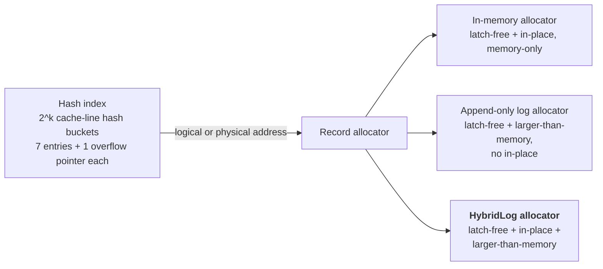

# FASTER: A Concurrent Key-Value Store with In-Place Updates

> SIGMOD 2018 — structured reading notes

Full paper content: [Markdown conversion](../original/faster-sigmod-2018.md)

## Paper information

- **Authors:** Badrish Chandramouli, Guna Prasaad, Donald Kossmann, Justin Levandoski,
  James Hunter, Mike Barnett
- **Affiliations:** Microsoft Research; University of Washington
- **Venue:** SIGMOD 2018, Houston, TX, USA, 16 pages
- **DOI:** [10.1145/3183713.3196898](https://doi.org/10.1145/3183713.3196898)

## One-sentence summary

FASTER pairs a cache-line-sized, latch-free, resizable hash index with **HybridLog** — a log whose
in-memory tail is updated *in place* while its older regions behave like a classic append-only
log — achieving up to **160M operations/second on one machine**, beating pure in-memory data
structures on in-memory workloads while still handling data larger than memory and adapting to a
drifting hot set with **no per-record or per-page caching statistics**.

## Problem: the shape of modern state management

Five characteristics of state in cloud/edge applications:

- **Large state.** Far exceeding main memory — e.g. a targeted-ads provider keeping per-user,
  per-ad, and clickthrough statistics for billions of users. Even when state *does* fit,
  **keeping infrequently accessed state on secondary storage is cheaper**.
- **Update intensity.** Not just reads and inserts — e.g. a monitoring application updating a
  per-device aggregate for each of millions of CPU readings per second.
- **Locality.** Billions of objects may be alive but only a small fraction is hot, **and the hot
  set drifts** (a search engine may have a billion users alive but a million actively surfing).
- **Point operations.** State is many independent objects; a hash-based point-operation store
  suffices. Infrequent range queries can be served by workarounds like indexing histograms of key
  ranges.
- **Analytics readiness.** Updates should be readily consumable by offline analytics.

### Why existing approaches fall short

| Approach | Problem |
| --- | --- |
| **Partition across machines + pure in-memory structures** (e.g. Intel TBB Hash Map) | Expensive and **severely under-utilizes each machine** — an ads platform may spread state over hundreds of machines, giving each a low request rate and idle compute. Pure in-memory structures also complicate failure recovery |
| **Key-value stores** (RocksDB and kin) | Handle larger-than-memory data and recovery, but are optimized for **blind updates, reads, and range scans**, not point operations and **read-modify-writes**. They do not scale beyond a few million updates/second even when the hot set fits in memory |
| **Caching systems** (Redis, Memcached) | Optimized for point operations but **slow, and dependent on an external database or KV store** for storage and recovery |

**The gap:** concurrency + in-place updates in memory + larger-than-memory capability, all at
once. No existing system provided all three.

FASTER's design philosophy: **make the common case fast** — (1) fast point access via a
cache-efficient latch-free hash index; (2) carefully choose *when and how* expensive or uncommon
activities (index resizing, checkpointing, eviction) happen; (3) let threads do **in-place updates
most of the time**.

## Architecture



- Records with the same (offset, tag) form a **reverse singly-linked list**; the bucket entry
  points to the tail (most recent record), which points backwards.
- A record is a **64-bit header** (previous pointer plus `invalid` and `tombstone` bits), the key,
  and the value; keys and values may be fixed or variable size.

**Keys are not stored in the hash index** — unlike traditional designs. Two payoffs:

1. It **shrinks the index's memory footprint**, so the whole index stays in memory.
2. It **separates user data from index metadata**, letting the same index be mixed and matched
   with different record allocators.

### User interface

Update logic is supplied as user-defined delegates and inlined into the store by **dynamic code
generation**, so advanced updates are natively supported at full speed.

| Operation | Semantics |
| --- | --- |
| `Read` | Read the value for a key |
| `Upsert` | Replace the value **blindly**, regardless of the existing value; insert if absent |
| `RMW` | **Read-modify-write** — update based on existing value plus an optional input, using compile-time user logic. The user also supplies an initial value used when the key is absent. An RMW may be declared **mergeable (a CRDT)**, meaning it can be computed as partial values later merged (e.g. partial sums) |
| `Delete` | Delete a key |

Operations may go **PENDING** (e.g. waiting on I/O); threads periodically call
`CompletePending` to process their outstanding operations.

## Epoch protection framework

**Design principle: avoid expensive coordination between threads in the common fast access path.**
Threads operate independently almost all the time but must still agree on shared system state.
FASTER extends multi-threaded epoch protection into a **generic framework for lazy synchronization
over arbitrary global actions**. (Silo, Masstree, and Bw-Tree used epochs for specific purposes;
FASTER makes it a reusable building block.)

**Basics.** A shared atomic counter **E** (current epoch) can be incremented by any thread. Each
thread *T* has a thread-local `E_T` refreshed periodically, all stored in a shared **epoch table,
one cache line per thread**. An epoch *c* is **safe** if every thread has a strictly higher local
value. A global **E_s** tracks the maximal safe epoch, recomputed by scanning the table whenever a
thread refreshes. Invariant: `∀T: E_s < E_T ≤ E`.

**Trigger actions.** When bumping the epoch from *c* to *c+1*, a thread may attach an action to be
executed once epoch *c* becomes safe. Implemented as a **drain-list** of ⟨epoch, action⟩ pairs — a
small array scanned whenever **E_s** updates, with **compare-and-swap ensuring each action runs
exactly once**. For scalability, **E_s** is recomputed and the drain-list scanned **only when the
current epoch changes**.

**Four operations:**

| Operation | Effect |
| --- | --- |
| `Acquire` | Reserve an entry for *T*, set `E_T = E` |
| `Refresh` | Update `E_T` to **E**, recompute **E_s**, trigger ready drain-list actions |
| `BumpEpoch(Action)` | Increment **E** from *c* to *c+1*, add ⟨c, Action⟩ to the drain-list |
| `Release` | Remove *T*'s entry from the epoch table |

**The canonical pattern:** a thread atomically sets `status = active` and bumps the epoch with
`active-now` as the trigger. Other threads will not observe the change immediately, but **all are
guaranteed to have observed it once they refresh** (sequential consistency via memory fences), so
`active-now` runs only when every thread agrees — safely.

FASTER uses this for garbage collection, index resizing, circular buffer maintenance and page
flushing, shared log page boundary maintenance, and checkpointing — **while giving threads
unrestricted latch-free access to shared memory in short bursts**.

**Thread lifecycle:** `Acquire` → user operations, calling `Refresh` (e.g. every 256 operations)
and `CompletePending` (e.g. every 64K operations) → `Release`.

## The hash index

### Layout

A cache-aligned array of **2^k hash buckets, each one cache line**. A 64-byte bucket holds
**seven 8-byte entries plus one 8-byte overflow bucket pointer**; overflow buckets are also
cache-line sized and allocated on demand.

The 8-byte entry size is deliberate: it permits **latch-free operation via 64-bit
compare-and-swap**. Physical addresses use fewer than 64 bits (Intel uses 48-bit pointers), so
the remaining bits are stolen for index metadata. Each entry contains:

| Field | Width | Purpose |
| --- | --- | --- |
| **tag** | 15 bits | Raises effective hashing resolution from *k* to *k + 15* bits, reducing collisions |
| **tentative bit** | 1 bit | Used by the two-phase insert (below) |
| **address** | 48 bits | Logical or physical address from the record allocator |

An all-zero entry means empty. Tags may be smaller or removed entirely depending on address size.

### The insert problem and the two-phase solution

**Invariant: each (offset, tag) has a unique index entry.**

- Naïve approach — find any empty entry and CAS the tag — breaks it: two threads can insert the
  **same tag into two different empty slots**.
- "Always take the leftmost empty slot" also breaks it **in the presence of deletes**: `T1` scans
  and chooses slot 5 for tag `g5`; `T2` deletes tag `g3` from slot 3, then inserts a key with tag
  `g5` and, scanning left to right, chooses slot 3. In general, **any algorithm that
  independently chooses a slot then inserts directly is broken**, because between choosing and
  CAS-ing a thread may be descheduled and the state may change arbitrarily.

**FASTER's latch-free two-phase insert:**

1. Find an empty slot and insert the entry **with the tentative bit set**. Tentative entries are
   **invisible to concurrent reads and updates**.
2. **Re-scan the bucket** (already in cache) for another tentative entry with the same tag. If
   found, **back off and retry**.
3. Otherwise **clear the tentative bit**, finalizing the insert.

Because every thread follows this ordering, **no interleaving can produce duplicate non-tentative
tags**.

Finding an entry is a bucket scan for a matching tag; deleting is a CAS replacing the entry with
zero.

### Resizing and checkpointing

Resizing on the fly uses **epoch protection plus a state machine of phases**. Because all index
operations are latch-free CAS operations, **the index is always in a consistent state**, which
permits an **asynchronous fuzzy checkpoint without read locks** — greatly simplifying recovery.

## In-memory store (index + simple allocator)

Pairing the index with an allocator like jemalloc yields a pure in-memory KV store.

- **Reads:** find the tag entry, traverse the linked list for a matching key.
- **Updates/inserts:** find the bucket entry (two-phase insert the tag if absent), scan the list.
  If the record exists, **update in place** — safe because **a thread has guaranteed access to a
  record's memory location as long as it does not refresh its epoch**. If absent, CAS the new
  record onto the list tail.
- **Record-level concurrency is the user's responsibility**, handled inside the user's read/update
  logic: fetch-and-add for counters, a record-level lock, or latch-free updates exploiting
  application-level partitioning.
- **Deletes:** CAS the record out of the linked list (or zero the bucket entry for a singleton).
  A deleted record **cannot be freed immediately** because of concurrent access, so each thread
  keeps a **thread-local free-list of (epoch, address) pairs**, returned to the allocator once the
  epochs are safe.

## Append-only log allocator (the strawman)

A **48-bit global logical address space** spanning memory and storage. The index now stores
**logical** addresses.

- **Tail offset** points to the next free address. **Head offset** tracks the lowest logical
  address still in memory, maintained at approximately constant lag from the tail (equal to the
  memory available for the log) and **updated only when the tail crosses page boundaries** to
  minimize overhead.
- The region between head and tail lives in a **bounded in-memory circular buffer**: fixed-size
  page frames of 2^F bytes, each **sector-aligned to the storage device** so reads and writes can
  be unbuffered without extra memory copies. Logical address *L* maps to offset `L & (2^F − 1)` in
  page frame `L >> F`.
- **Allocation** uses the tail offset stored as page number + offset in one word: a thread does a
  **fetch-and-add on the offset**; if the allocation would not fit on the current page, it
  increments the page number and resets the offset. Threads seeing an offset beyond page size wait
  for it to become valid and retry.

### Circular buffer maintenance via epochs

Two status arrays: **flush-status** (has this page been flushed?) and **closed-status** (can this
page frame be reused?).

- **Flushing:** records are immutable once written, so when the tail enters page *p+1*, FASTER
  bumps the epoch with a trigger action that **asynchronously flushes page *p***. Because the
  action runs only when the epoch is safe, and threads refresh at operation boundaries, **all
  threads have finished writing to page *p*** — so the flush is safe.
- **Eviction:** rather than latching/pinning pages as a traditional buffer pool does, FASTER
  **increments the head offset and bumps the epoch with a trigger that marks the old page frame
  closed**. When that epoch is safe, every thread has seen the new head offset and cannot be
  accessing those addresses. The page must be **fully flushed before the head offset moves**, so
  threads needing those records can fetch them from storage.

### Operations, and why this is not enough

Blind updates append a new record and CAS the index; on failure the record is **marked invalid via
a header bit** and the operation retried. Deletes append a **tombstone** record and require log
garbage collection. Reads and RMWs check whether the logical address is above the head offset; if
not, an **asynchronous read for just the record** (not the whole page) is issued. Each operation
carries a **context** placed on a thread-local pending queue for continuation by
`CompletePending` — and continuations may issue further I/O (e.g. to follow the linked list).

The cost: **every update needs an atomic tail increment, a data copy, and an atomic index
replace**, and **an append-only log grows fast** under update-heavy workloads, quickly making disk
I/O the bottleneck. Measured ceiling: **no more than 20M ops/sec, not scaling with threads**.

### Why in-place updates matter

1. Frequently accessed records stay in higher cache levels.
2. Access paths for keys in different hash buckets **do not collide**.
3. Updating part of a large value avoids copying the whole record or maintaining **expensive delta
   chains that require compaction**.
4. **Most updates need not modify the hash index at all.**

## HybridLog

The logical address space is divided into three contiguous regions:

```text
  ┌──────────── stable ────────────┬─── read-only ───┬──── mutable ────┐
  │        (secondary storage)     │   (in memory)   │   (in memory)   │
  └────────────────────────────────┴─────────────────┴─────────────────┘
                            head offset      read-only offset      tail offset
```

- **Mutable region** — updated **in place**.
- **Read-only region** — immutable; updating a record here uses **read-copy-update**: create a new
  copy at the tail, then update it. Subsequent updates are in place while it remains mutable.
- **Stable region** — on storage.

| Record's logical address | Action |
| --- | --- |
| Invalid (key absent) | Make a new record at the tail |
| < HeadOffset | Issue async I/O request, then copy to tail |
| < ReadOnlyOffset | Make a mutable copy at the tail |
| < ∞ (i.e. in mutable region) | **Update in place** |

The read-only offset sits at constant lag from the tail and, like the head offset, moves **only at
page boundaries**. Since **no page below the read-only offset is being updated concurrently, those
pages are safe to flush** — so the read-only offset doubles as a lightweight "ready to flush"
indicator. This is exactly what traditional buffer pools need pinning for: **HybridLog gets
latch-free access to mutable records without pinning pages before update**.

The read-only region also acts as a **second-chance cache** before eviction.

### The lost-update anomaly and the safe read-only offset

The read-only offset is read and written atomically, but a thread can still act on a **stale**
value:

> `T1` and `T3` both read logical address *L* from the index. `T1` sees read-only offset `R1`,
> concludes *L* is mutable, and prepares an in-place update. `T2` shifts the offset to `R2`. `T3`
> now compares *L* against `R2`, decides *L* is read-only, and creates a new record at *L'* with
> value 5. `T1` then writes 5 in place at *L*. All future reads use *L'* — **`T1`'s update is
> lost.**

A read lock on the offset would prevent this but is expensive and would **delay shifting the
read-only offset**, which is integral to circular buffer maintenance. Instead FASTER introduces the
**safe read-only offset**, defined by the invariant:

> **safe read-only offset = the minimum read-only offset seen by any active FASTER thread.**

Maintained via epochs: **whenever the read-only offset moves, bump the epoch with a trigger action
that sets the safe read-only offset to the new value** — legal because every thread that crossed
that epoch must have seen the new value.

This creates a **fourth region — the fuzzy region**, between safe read-only and read-only offsets,
where *some* threads see addresses as read-only and others as mutable. Threads have **thread-local
views** of these markers, converging only on refresh; a recently refreshed thread has the highest
read-only offset, a stale thread the lowest, and the safe offset is at most that minimum. **Below
the safe read-only offset**, several threads may race to create a new record and only one wins the
index CAS.

### Handling the fuzzy region by update type

| Logical address | Read-modify-write | CRDT update | Blind update |
| --- | --- | --- | --- |
| Invalid | Create new record at tail | Create new record at tail | Create new record at tail |
| < HeadAddress | **Issue async I/O request** | Create new record at tail | Create new record at tail |
| < SafeReadOnlyAddress | **Add to pending list** | Create **delta record** at tail | Create new record at tail |
| < ReadOnlyAddress | Create an updated record at tail | Create an updated record at tail | Create an updated record at tail |
| < ∞ | Update in place concurrently | Update in place concurrently | Update in place concurrently |

- **Blind update** never reads the old value, so even while another thread updates a previous
  location in place, this thread can append a new record — the application's semantics must simply
  admit all serial orders. Bonus: **no disk retrieval needed** when the record is not in memory.
- **Read-modify-write** must read before writing and cannot be certain no one is concurrently
  updating, so creating a tail copy would reintroduce the lost update. It is therefore **deferred
  into the pending queue**, like a storage-resident record.
- **CRDT** is the middle ground: append a **delta record** computed against the initial (empty)
  value and link it. **A read reconciles all deltas** to obtain the converged value; deltas can be
  periodically collapsed to bound chain length.

### Caching behavior — the elegant part

Standard buffer-pool/VM protocols (FIFO, CLOCK, LRU, LRU-K) all except FIFO require **fine-grained
per-page or per-record statistics**. HybridLog gets good **per-record** caching behavior **for
free**, purely from the access pattern, closely resembling **Second-Chance FIFO**:

> A record fetched from disk for update is written at the tail. It stays in memory, updatable in
> place, until it drifts into the read-only region. If the key is hot, a subsequent request before
> eviction creates a new mutable record — **a second chance to stay cached**. Otherwise it is
> evicted, making space for hotter keys.

**Sizing the regions.** Lag = 0 gives an append-only store; lag = buffer size gives an in-memory
store. A **smaller read-only (larger mutable) region** gives better in-memory performance through
in-place updates, but a hot record may be evicted for a brief lull in access. A **larger read-only
region** makes updates append-only, grows the log faster, and **replicates records across the two
regions, effectively shrinking the cache**. In practice **a 90:10 mutable:read-only split performs
well**.

## Recovery and consistency

**Guarantee: monotonicity.** For two update requests *r1* and *r2* issued in that order by a
thread, the recovered state includes the effects of **none, only *r1*, or both** — never *r2*
without *r1*. This can be obtained conventionally with a **write-ahead log plus fuzzy checkpoints**
(a well-studied recovery problem).

**Eliminating the WAL.** A separate WAL would bottleneck update-intensive workloads, so FASTER
**treats HybridLog itself as the WAL** and **delays commit to allow in-place updates within a
limited time window**.

**Checkpointing.** The index could be rebuilt entirely from HybridLog, but checkpointing it speeds
recovery. Because all index operations are CAS-based, the checkpointing thread reads the index
**asynchronously with no read locks** — producing a *fuzzy* checkpoint not consistent with any
single log position. The fix:

1. Record the HybridLog tail offset **before (t1)** and **after (t2)** the fuzzy checkpoint.
2. All index updates during that interval correspond **only** to records between *t1* and *t2*,
   **because in-place updates do not modify the index**.
3. On recovery, **scan records between *t1* and *t2* in order** and update the recovered fuzzy
   index where needed. The result is a consistent index corresponding to HybridLog up to *t2*,
   since every index update after *t2* concerns only records after *t2*.
4. **Move the read-only offset to *t2***, and once the corresponding flush completes you have a
   checkpoint at log position *t2*.

Two properties: the algorithm runs **in the background without quiescing the database**, and every
checkpoint is **incremental** — only data modified since the last checkpoint is offloaded.
Incremental checkpointing normally needs a separate bitmap-like structure; **FASTER gets it purely
from how data is organized**.

**Known gap (acknowledged).** This scheme can violate monotonicity because of in-place updates:
*r1* may modify location `l1 ≥ t2` while a later *r2* modifies `l2 < t2`; a checkpoint at *t2*
includes *l2* but not *l1*. The authors sketch a fix — using epochs and triggers so threads
collaboratively switch to a new database version identified by a HybridLog location — and leave
the details to future work.

## Evaluation

### Setup

- **Implementation:** C#, an embedded component, using code generation to inline user functions.
  Log stored on SSD. Garbage collection assumed expiration-based and **excluded from results**;
  **checkpoint/recovery costs also excluded**. In-place-updatable region sized at **90%** of memory
  unless noted; index sized at **#keys/2 hash bucket entries** by default. **All experiments use
  HybridLog**, i.e. the complete larger-than-memory version.
- **Hardware:** two identical Dell PowerEdge R730s — one Windows Server (FASTER), one Ubuntu
  (other systems, which are Linux-optimized). 2.60 GHz Intel Xeon E5-2690 v4, **2 sockets × 14
  cores (28 hyperthreads) = 56 threads**, 256 GB RAM, **3.2 TB FusionIO NVMe SSD** for the log.
  Threads pinned to cores; two-socket experiments shard threads across sockets. 30-second runs
  (10 minutes for RocksDB).
- **Workload:** extended YCSB-A — **250 million distinct 8-byte keys**, values of 8 or 100 bytes.
  Notation `R:BU` = reads : blind updates. RMW updates increment by a value drawn from an 8-entry
  input array, modelling a per-key running sum. Distributions: uniform, Zipfian (θ = 0.99), and a
  new **hot set** distribution modelling keys moving cold → hot → cold (like search engine users).
- **Baselines:** **Masstree** (in-memory range index) and **Intel TBB concurrent hash map**
  (in-memory hash) for pure in-memory; **RocksDB** and **Redis** for larger-than-memory. RocksDB
  configured per its wiki with **WAL and checksums disabled** and direct I/O; TBB stored values
  inline.

### Headline results

| Measurement | Result |
| --- | --- |
| All 56 threads, uniform | up to **115M ops/sec** |
| All 56 threads, Zipfian | up to **165M ops/sec** |
| Append-only log allocator (same workload) | **≤ 20M ops/sec**, does not scale with threads |
| RocksDB, larger-than-memory YCSB | **~500K ops/sec at best** |
| Redis, single thread, localhost, 8-byte values, pipelined | ~1.1M sets/sec and 1.4M gets/sec over a 1M keyspace; **~700K sets/sec and 900K gets/sec over a 250M keyspace** — "significantly lower than single-threaded FASTER" |
| Sequential log write bandwidth (0:100, 80% read-only region, uniform) | **1.74 GB/sec**, against a theoretical SSD maximum of 2 GB/sec |

Other observations:

- **Single-threaded FASTER outperforms pure in-memory systems**, making it a good fit for embedded
  environments — despite also handling larger-than-memory data.
- **Intel TBB** does well on uniform but **hits contention under Zipfian and fails to scale**,
  falling over around 20 cores on two CPUs (locking contention). **Masstree** scales well but at
  much lower absolute throughput.
- **Scalability:** FASTER scales well on one and two CPUs for 100% RMW with 8-byte payloads. For
  0:100 blind upserts with **100-byte payloads**, scaling is linear to 48 threads then levels off
  because the workload **saturates cross-socket bandwidth**.
- **Tag size robustness:** with the 50:50 uniform workload on all threads, shrinking the tag to
  **4 bits costs <5%** and to **1 bit costs <14%** — confirming FASTER can handle larger address
  sizes.

### Larger-than-memory

27 GB dataset, 100-byte payloads, 14 threads on one socket, memory budget including 2 GB for the
index (sized at #keys/8 buckets here).

- **50:50 Zipfian:** throughput drops as memory shrinks (more random SSD reads) but **quickly
  reaches in-memory levels once the dataset fits**. The authors call the steep drop-off a target
  for future I/O path optimization.
- **0:100 blind updates:** slightly lower with ample memory, as expected — but **throughput
  degrades far less** as memory shrinks, because **bulk sequential log writes with no random reads
  are efficient**.

### Ablations

**Append-only vs. HybridLog** (YCSB-A 50:50; circular buffer of 2^15 pages × 4 MB): HybridLog
scales linearly; append-only is **significantly slower** due to new-entry creation and **tail
contention**. Notably the distributions behave oppositely: under HybridLog, **Zipfian beats
uniform** (skew improves TLB and cache behavior); under append-only, that benefit is **outweighed
by failed compare-and-swaps from conflicting updates**.

**IPU region size** (100% RMW, 56 threads), varying the *IPU Region Factor* (fraction of the
dataset in the in-place-update region): throughput **rises** and log growth rate **falls** as the
IPU region grows — both desirable. Under Zipfian, high throughput is reached at **lower** IPU
factors than uniform, and log growth declines faster — both effects of HybridLog's shaping. (Log
growth is reported for 8-byte keys and values, 24 bytes per record; larger payloads multiply it.)

**Fuzzy region cost** (100% RMW uniform, 56 threads, refresh every 256 operations): the percentage
of fuzzy updates **never exceeds 3%**, and exceeds 0.5% only in the artificial case where **less
than 70% of memory is mutable**. Holding the IPU factor at 0.8 and varying thread count, the fuzzy
percentage rises with threads but **stays below 1% at all 56 threads**.

### Caching simulation

Constant-size key buffer, evicting per protocol; HLOG modelled with a read-only marker at constant
lag from the tail, copying read-only keys to the tail as FASTER does. Three access patterns:
uniform, Zipfian (θ = 0.99), and **hot-set** (a shifting hot set of 1/5 the total size accessed
with 90% probability; the cold set uniformly with 10%).

- **Uniform:** HLOG matches the other protocols.
- **Zipfian and hot-set:** HLOG's miss rate is **higher than LRU-1, LRU-2, and CLOCK**, because
  **hot keys are replicated — one copy in the read-only region and one in the mutable region —
  reducing effective cache size**.
- **HLOG beats plain FIFO**, since it gives keys a second chance.
- Overall: **competitive with optimized algorithms without maintaining any statistics**, while
  keeping the latch-free fast path.

## Positioning against related work

- **Epochs** have been used by Silo, Masstree, and Bw-Tree for specific bottlenecks; FASTER adds
  **trigger actions** and generalizes them into a lazy-synchronization framework used in at least
  six places.
- **Log structuring** (from log-structured file systems onward) applies read-copy-update to an
  append-only log. **HybridLog combines log structuring with in-place updates** to get high
  performance for hot data *and* fast sequential logging.
- **In-memory caches/stores** — Redis, Memcached, MemC3, MICA — do not handle larger-than-memory
  data themselves. **Distributed stores** — RAMCloud, FaRM — scale out via partitioning, remote
  memory, or RDMA rather than exploiting storage for cold data, and report lower single-node
  performance.
- **Streaming state stores** (Spark State Store, Storm Trident) use a simple partitioned in-memory
  hash table with synchronous periodic checkpointing, **without concurrent access**, at low
  throughput. **Google Cloud Dataflow** keeps recent state in memory and offloads to BigTable,
  with potentially high overhead from the decoupling.
- **Range KV stores** — Cassandra, RocksDB, Bw-Tree — handle large state but their **key-ordered
  page format optimized for reads and range queries** adds complexity, and **read-copy-update is
  expensive for update-intensive workloads**. RocksDB does support in-place updates in level 0 but
  cannot exploit them for acceptable in-memory performance, generally achieving **under 1M
  ops/sec**, with an **expensive "merge" operation for RMW**.
- **Databases:** in-memory databases cannot spill to storage. **ERMIA** uses latch-free structures,
  epochs, and log structuring but is **append-only** and targets full serializability. Traditional
  databases use a buffer pool; **FASTER avoids both buffer pool and page latching**, using
  coarse-grained log regions instead. **H-Store** partitions to avoid concurrency, at the cost of
  shuffle overhead, load imbalance, and skew. **Deuteronomy** and **Hekaton** index with hashing
  but are read-copy-update based.

## Limitations and questions

- **Recovery is sketched, not delivered.** The WAL-free scheme is described at a high level, the
  monotonicity violation from in-place updates is acknowledged, and the fix is explicitly left to
  future work. **Checkpoint and recovery costs are excluded from all measurements.**
- **Garbage collection is assumed, not measured** — an expiration-based scheme whose cost is
  excluded.
- **RMWs in the fuzzy region go pending**, i.e. slow-path. Measured at under 3% of operations, but
  that depends on refresh frequency, thread count, and region sizing.
- **HybridLog caching is worse than LRU/CLOCK on skewed workloads** because hot keys are
  duplicated across the read-only and mutable regions. The trade is deliberate — no statistics, no
  latching — but it is a real miss-rate cost.
- **Record-level concurrency is the user's problem.** FASTER guarantees memory safety via epochs
  but leaves value-level correctness to user-supplied update logic.
- **Point operations only.** Range queries need workarounds; ordering is only approximate (the log
  is "record-oriented and approximately time-ordered").
- **Cross-platform comparison caveat:** FASTER runs on Windows Server while baselines run on Linux
  (where they are optimized), on identical hardware — a reasonable choice, but not an
  apples-to-apples environment.
- **The steep degradation as memory shrinks** is acknowledged as an unoptimized I/O path.

## Practical design checklist

FASTER's ideas apply when:

- the workload is **point reads and updates, especially read-modify-writes**, at very high rates;
- state exceeds memory but exhibits **strong, drifting temporal locality**;
- you can express updates as **user delegates** and, where possible, as **CRDTs**;
- range scans are rare enough to serve by other means.

Look elsewhere when:

- you need **range queries or ordered iteration** as a first-class operation;
- you need **serializable multi-key transactions**;
- you need **strict durability semantics** out of the box (recovery here is a sketch);
- your workload is read-only over cold data, where an LSM store's read path is better tuned.

## Takeaways

1. **In-place update is the whole point.** Every architectural decision — keys out of the index,
   epochs instead of latches, the mutable region — exists so that the common case avoids allocating,
   copying, and CAS-ing the index.
2. **Make synchronization lazy and generic.** Epoch protection with trigger actions turns "wait
   until every thread has seen this change" into a reusable primitive, used for GC, resizing,
   flushing, eviction, offset propagation, and checkpointing alike.
3. **Address ranges can replace pinning.** Comparing a record's logical address against moving
   offsets tells a thread whether mutation is safe — no page latch, no buffer pool.
4. **A stale view is fine if you bound it.** The safe read-only offset makes staleness explicit and
   confines it to a "fuzzy region," which measurements show is under 3% of operations.
5. **Classify updates by what they need to read.** Blind updates, CRDTs, and RMWs each admit a
   different, cheaper treatment in the ambiguous region — only true RMWs must go pending.
6. **Caching can be a byproduct of layout.** Second-chance FIFO behavior emerges from the log's
   geometry with **zero** per-record statistics; the cost is duplicated hot keys.
7. **Latch-free insert needs a publication protocol.** The tentative bit shows the general pattern:
   write invisibly, re-verify, then publish — because "choose a slot, then CAS" is unsound under
   concurrent deletes.
8. **The log can be the write-ahead log.** Treating HybridLog as both data and recovery log, with
   delayed commit, removes a whole bottleneck — and makes checkpoints incremental for free.

## Citation

```bibtex
@inproceedings{chandramouli2018faster,
  author = {Badrish Chandramouli and Guna Prasaad and Donald Kossmann and Justin Levandoski and
            James Hunter and Mike Barnett},
  title = {{FASTER}: A Concurrent Key-Value Store with In-Place Updates},
  booktitle = {Proceedings of the 2018 International Conference on Management of Data
               (SIGMOD '18)},
  year = {2018},
  doi = {10.1145/3183713.3196898}
}
```
