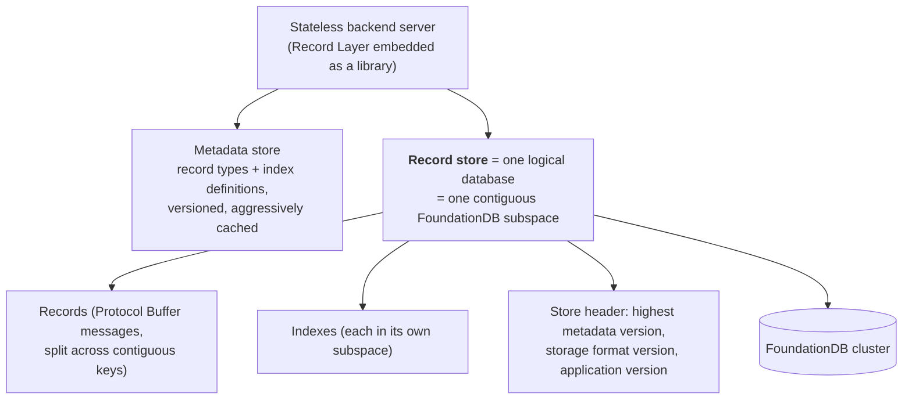

# FoundationDB Record Layer: A Multi-Tenant Structured Datastore

> SIGMOD 2019 Industrial Track — structured reading notes

Full paper content: [Markdown conversion](../original/foundationdb-record-layer-sigmod-2019.md)

## Paper information

- **Authors:** Christos Chrysafis, Ben Collins, Scott Dugas, Jay Dunkelberger, Moussa Ehsan,
  Scott Gray, Alec Grieser, Ori Herrnstadt, Kfir Lev-Ari, Tao Lin, Mike McMahon, Nicholas
  Schiefer, Alexander Shraer
- **Affiliation:** Apple, Inc.
- **Venue:** SIGMOD 2019, Amsterdam, Netherlands, pages 1787–1802 (16 pages)
- **DOI:** [10.1145/3299869.3314039](https://doi.org/10.1145/3299869.3314039)
- **Code:** https://github.com/foundationdb/fdb-record-layer

## One-sentence summary

The Record Layer is a **stateless client library** that turns FoundationDB's ordered
transactional key-value store into a relational-like record store, and its **record store
abstraction** — one logical database confined to one contiguous key subspace — is what lets Apple's
CloudKit run **billions of independent databases sharing thousands of schemata** with transactional
secondary indexes.

## Problem

Four challenges any company offering stateful services must solve, and which are "notoriously
difficult to solve correctly":

1. **Horizontal scalability** — data volume, user count, and access rates demand smart
   partitioning and placement, with elastic scaling of both storage and computation.
2. **Availability and durability** — at scale, network, disk, and machine failures become everyday
   events.
3. **Transactions** — the usual scalability answers (eventual consistency) push immense complexity
   onto application developers.
4. **Multi-tenancy** — isolation, resource sharing, and elasticity. Most databases **intermingle
   tenant data at both compute and storage levels**, and retrofitting isolation is hard. Stateful
   services resist elastic scaling because **state cannot be partitioned arbitrarily**: data and
   indexes cannot live on separate storage clusters without sacrificing transactional updates,
   performance, or both.

FoundationDB solves 1–3 but its data model — an ordered mapping from binary keys to binary
values — is insufficient for most applications, which need structured storage, indexing, and
queries. Without a layer providing them, **developers reimplement common functionality, slowing
development and introducing bugs**.

### The workload that shaped the design

CloudKit's private record stores show a striking distribution: **the vast majority of databases
contain fewer than 1 kilobyte of record data**, yet **most of the total data lives in relatively
large databases** — and the sample excludes "public" databases shared across an application's
users, which can reach terabytes.

It is tempting to provision separate systems for "small data" and "big data," but that creates
operational burden *and* forces application developers to contend with varying semantics. The
Record Layer instead serves the whole range with one set of semantics.

## Background: what FoundationDB provides

- **Architecture:** a distributed, ordered key-value store on commodity servers, providing ACID
  transactions over arbitrary key sets with optimistic concurrency control. It follows the
  **virtual synchrony** paradigm: two logical clusters — one storing data and processing
  transactions, one coordination cluster running **Active Disk Paxos** for membership and
  configuration. This yields high availability with only **F+1 storage replicas to tolerate F
  failures**.
- **Deterministic simulation testing** — entire clusters simulated under varied failure conditions
  in a single thread with complete determinism. In the year before publication: **over 250 million
  simulations, equivalent to more than 1,870 years and 3.5 million CPU-hours**. This is what makes
  FoundationDB stable enough to ship features at an unusually rapid cadence for a
  strongly-consistent database.
- **Layers.** Rather than bundling storage engine + data model + query language (forcing users to
  take all three or none), FoundationDB provides a transactional storage engine with a minimal,
  carefully chosen feature set — no structured semantics, one logical keyspace it automatically
  partitions and replicates — and lets **layers** add data models on top.

### Transaction semantics

**Strictly-serializable isolation** via **MVCC for reads and optimistic concurrency for writes**;
neither reads nor writes block each other. Conflicting transactions **fail at commit and are
usually retried by the client**.

A client calls `getReadVersion` (GRV) to obtain the latest commit version and reads at that
version, seeing an instantaneous snapshot. A write transaction commits only if **none of the values
it read were modified since its read version**. Operations within a transaction execute in
parallel while preserving program order per key, and a read after a write to the same key returns
the written value.

**FoundationDB imposes a 5-second transaction time limit** — a constraint that drives much of the
Record Layer's design.

Two features the Record Layer leans on heavily:

- **Atomic read-modify-write operations on single keys** (addition, min/max, …). They occur within
  a transaction but **create no read conflicts**, so concurrent changes do not abort. Ideal for a
  counter incremented by many clients.
- **Tunable isolation.** **Snapshot reads** do not cause aborts even if the key was later
  overwritten — useful when, say, you only need to know whether a monotonically increasing value
  has crossed a threshold.

### Limits and conventions

| Limit | Value |
| --- | --- |
| Key size | 10 kB max (**32 B recommended**) |
| Value size | 100 kB max (**up to 10 kB recommended**) |
| Transaction size | 10 MB, including all written keys/values and all keys in read and write conflict ranges |
| **Observed in production** (CloudKit via Record Layer) | median transaction ≈ **7 kB**, p99 ≈ **36 kB** |

Keys live in a single global keyspace that applications must divide themselves, aided by:

- **Tuple layer** — encodes tuples into keys such that **binary key ordering preserves tuple
  ordering** and the natural ordering of typed elements. A common tuple prefix becomes a common
  byte prefix, defining a **subspace**: store `(state, city)`, later read with prefix `(state, *)`.
- **Directory layer** — maps long-but-meaningful binary strings to short ones to save key space,
  allocating values via a **sliding window algorithm** that concurrently allocates unique mappings
  while keeping the integers small.

Range reads follow binary key order; **range clear** operations wipe a range or prefix.

## Design principles

- **Statelessness.** All state lives in FoundationDB or is returned to the client. A cursor's
  position is not held in server memory — the context needed to advance it is **serialized and
  returned as a continuation**. Three benefits: (1) **request routing is trivial**, since any
  server can serve a "give me more results" request; (2) **operation at scale is simpler** — a
  troubled server can be restarted without transferring state; (3) **all state inherits the
  key-value store's ACID semantics**, so no separate integrity machinery is needed.
- **Streaming model for queries.** Semantics are deliberately limited to what can be implemented
  over **streams of records** — e.g. `ORDER BY` is supported only when an index provides the sort
  order. This supports concurrent workloads **without stateful memory pools in the server**, and
  reflects a preference for **fast, predictable transaction processing over OLAP-style analytics**.
- **Flexible schema.** The atomic unit is a **record**: a Protocol Buffer message. Unlike relational
  tuples these are **highly structured** — complex types, **nested record types within a field**, and
  **repeated fields** — so lists and maps live inside a single record. Because millions of databases
  share a schema, **metadata is stored separately from data** so it can be updated atomically for
  all stores using it.
- **Efficiency.** Implemented as a **library, not a client/server system**, so it can be embedded in
  the caller with few requirements on the server. Since FoundationDB performs best at high
  concurrency, nearly all operations are **asynchronous and pipelined**, making heavy use of
  FoundationDB-specific features like controllable isolation.
- **Extensibility.** Clients can define **new index types, index maintainers, and query planner
  rules**; record serialization supports **client-defined encryption and compression**. This is how
  features deliberately left out of the core — memory pool management, arbitrary sorting — get
  added. CloudKit uses all of it.

## Architecture



- A **record type** resembles a relational table in defining structure, **but all record types in a
  record store are interleaved within the same extent** — there is no per-table storage separation
  by default.
- **Isolation for multi-tenancy** works on two levels: **resource** (the layer tracks and enforces
  per-transaction resource limits, provides continuations to resume work, and can be coupled with
  external throttling) and **data** (each record store's keys begin with a unique binary prefix
  defining a **non-overlapping subspace**).
- **Key expressions** define primary keys and index keys: a logical path through a record that
  extracts field values and produces a tuple. They **may produce multiple tuples**, letting indexes
  "fan out" over nested and repeated fields. Because all types are interleaved, **queries and
  indexes may span all record types** in a store.
- **Record splitting.** To hide FoundationDB's key/value size limits, large records are split
  across contiguous keys and spliced back on read. A special split **immediately preceding each
  record holds the commit version of its last modification**, returned with the record on every
  read.

### Performance techniques worth noting

- **Record prefetching** — asynchronously preloads records into the FoundationDB client's
  read-your-write cache **without returning them to the application**, saving a context switch and
  deserialization when reading many records.
- **`causal-read-risky`** — makes `getReadVersion` faster at the risk of a slightly stale read
  version during the rare case of cluster reconfiguration (comparable to ZooKeeper's `sync`).
  **Transactions that modify state never return stale data**, because their reads are validated at
  commit.
- **Read version caching** — skip talking to FoundationDB entirely if a read version was fetched
  "recently." The application supplies an acceptable staleness and the last-seen commit version;
  the layer uses a cached version if it is recent enough **and not smaller than what the client
  already observed**. Most useful for **read-only transactions and low-concurrency workloads**;
  otherwise it may raise the abort rate.
- **KeySpace API** — exposes the keyspace as a filesystem-like directory tree; a path compiles into
  a tuple that becomes a row key. It guarantees directories are **logically isolated and
  non-overlapping** and uses the directory layer to shorten names.

## Metadata management and schema evolution

Metadata may live in a separate keyspace or **an entirely separate storage system**, and is
**aggressively cached by clients** so records can be interpreted without extra key-value reads —
enabling **low-overhead, per-request connections** to a database.

**What Protocol Buffers give for free:** new fields can be added and appear uninitialized in old
records; new record types can be added without disturbing old ones. Best practice: **never reuse
field numbers — deprecate rather than remove**.

**Versioning.** Metadata is versioned in a **single-stream, non-branching, monotonically increasing**
fashion. Each record store records the highest version it has been accessed with in a small header
(one key-value pair), read and compared on open:

| Comparison | Meaning |
| --- | --- |
| Versions equal | Typical case — nothing changed |
| Database version **newer** | The client used an **out-of-date cache** |
| Database version **older** | Changes must be applied |

Three version numbers are tracked in the same header:

- **Metadata version** — the application's schema.
- **Storage format version** — how the Record Layer itself encodes data, updated at the same time;
  may require reformatting small amounts of data or enabling a compatibility mode.
- **Application version** — client-owned, for data evolution the metadata does not capture (e.g.
  promoting a nested record type to a top-level type during renormalization). It can also act as a
  **counter tracking progress through a series of changes**, so checks happen at store-open rather
  than scattered through application code.

**Adding indexes.** An index on a *new* record type is enabled immediately. An index on an existing
type may require reindexing, and since all record types share a keyspace, **all records must be
scanned**. If there are few records the index is built in one transaction; otherwise it would
exceed the 5-second limit, so **the index is disabled and reindexing runs as a background job**.

## Index definition and maintenance

Record Layer indexes are durable structures **maintainable in a streaming fashion** — updatable
incrementally from the contents of the changed record alone. **Index maintenance occurs in the
same transaction as the record change**, so indexes are always consistent with the data; this is
only affordable because of FoundationDB's fast multi-key transactions.

- Index scans use FoundationDB's **range reads** over lexicographically ordered keys.
- Each index lives in a **dedicated subspace**, so dropping it is a cheap **range clear**.
- **Index filters** conditionally exclude records from maintenance, producing a **sparse index**
  that saves space and maintenance cost.

**Save path.** Check whether a record with the same primary key exists; if so, index maintainers
remove or update its entries and the old record is deleted **with a range clear** (necessary
because records may be split). Then insert the new record, then insert or update its index
entries. Optimization: **if the old and new records are the same type and an indexed field is
unchanged, that index is not updated**.

**Online index building.** Indexes start in a **write-only** state — maintained by writes but not
usable by queries. The builder scans the store, invoking the index maintainer for each record, then
marks the index **readable**. The build is **split across multiple transactions** to reduce conflicts
with concurrent mutations and stay within transaction size limits.

## Index types

Indexes **may span multiple record types**, provided every field referenced by the key expression
exists in all of them — enabling efficient searches across different record types with common
search criteria.

### VALUE

The default: a standard mapping from index entry (one field or a combination) to record primary
key. Satisfies common predicates like "all primary keys where field ≤ v."

### Atomic mutation indexes

Built on FoundationDB's atomic mutations, used for aggregate statistics. The `SUM` index stores a
field's sum over all records as a **single entry mapping the index subspace path to the value**;
with grouping fields in the key expression, one sum per group.

**Why atomic mutations matter:** a read-modify-write implementation "would not scale, as any two
concurrent record updates would necessarily conflict." Using the `ADD` mutation, updates **never
conflict**.

| Index type | Tracks |
| --- | --- |
| `COUNT` | Number of records |
| `COUNT UPDATES` | Number of times a field has been updated |
| `COUNT NON NULL` | Number of records where a field is not null |
| `SUM` | Summation of a field across all records |
| `MAX EVER` / `MIN EVER` | Max/min value ever assigned to a field since index creation |

**Trade-off:** tiny footprint (one key per grouping key, or one per record store) but **a small
number of hot keys updated on every write**, producing high CPU and I/O on the FoundationDB storage
servers holding them, and **increased read latency for clients reading from those servers**.

### VERSION

Like VALUE, but the key expression may include a special **version** field: a **12-byte value
representing the commit version of the record's last update**, unique and monotonically increasing
with time within a cluster. **The first 10 bytes are assigned by FoundationDB servers at commit;
the last 2 by the Record Layer** from a per-transaction counter — so every record in the cluster has
a unique version.

Because the version is only known at commit, it is **not** part of the record's Protocol Buffer
representation. Instead the layer writes a **primary key → version mapping in the keyspace adjacent
to the records**, so both come back in a single range read.

Version indexes **expose the total ordering of operations within a cluster**: a client can scan a
prefix of a version index and be certain that continuing from the same point will observe all newly
written data — which is exactly how CloudKit implements sync.

### RANK (Appendix B)

Provides access to records **by ordinal rank** and, conversely, the rank of a value. Use cases: a
leaderboard position; a scrollbar that jumps to the *k*-th result without linearly scanning with
continuations.

Implementation: a **probabilistic augmented skip-list persisted in FoundationDB, with each level in
a distinct subspace prefix**. Duplicate keys are avoided by reading each key before insertion. The
lowest level holds every entry; each higher level samples the level below. **Each entry stores the
number of entries greater-or-equal to it and less than the next entry at that level** (always 1 at
the lowest level) — i.e. the number skipped by following the "finger."

Elegant detail: **an explicit finger pointer is unnecessary** — FoundationDB's sort order serves the
same purpose far more efficiently.

- **Value → rank:** standard skip-list search from the top level, accumulating the skipped counts
  whenever a same-level finger is followed; the sum is the rank.
- **Rank → value:** maintain a cumulative sum, range-scanning each level until following a finger
  would exceed the target rank, then descend.

### TEXT (Appendix B)

Full-text queries on string fields: token matching, **token prefix matching, proximity search, and
phrase search**. A pluggable tokenizer produces tokens; the inverted index is logically an ordered
list of maps, one **postings list per token**, keyed by primary key, with values being **lists of
offsets** (token counts from the start of the field).

```text
(prefix, token1, pk1) → offsets1
(prefix, token1, pk2) → offsets2
(prefix, token2, pk3) → offsets3
```

Range-scanning by token prefix yields all matching primary keys; proximity and phrase filters
examine the offset lists.

**Bunching.** The subspace prefix repeats in every key — costly for TEXT indexes given their entry
count — so **neighboring keys are bunched** so one entry covers several primary keys:

```text
(prefix, token1, pk1) → [offsets1, pk2, offsets2]     # bunch size 2
(prefix, token3, pk4) → [offsets4, pk5, offsets5]
```

- **Insert (token t, key pk):** range-scan to find the largest key `L ≤ (prefix,t,pk)` and the
  smallest `R >` it. Place the entry in `L` unless that exceeds the maximum bunch size, in which
  case the bunch's largest primary key is evicted into a new index key — and if `R`'s bunch is
  under-full, it is **merged with the newly created one**.
- **Delete:** descending range scan from `(prefix,t,pk)`; the first key returned is guaranteed to
  hold the data. Delete the entry if `pk` is alone, else remove `pk` and its offsets and, if `pk`
  appeared in the key, rewrite the key with the next primary key in the bunch.
- **Cost:** insert reads two key-value pairs and writes at most two (usually one); delete reads and
  writes one. **This access locality gives index updates predictable latency and resource
  consumption** — the recurring theme of the whole system.

**Measured space saving** (Melville's *Moby Dick* split into 233 ~5 kB documents; whitespace
tokenization; ~431.8 unique tokens per document averaging ~7.8 characters and ~2.1 occurrences;
10-byte prefix, smaller than production):

| | No bunching | Bunch size 20 |
| --- | --- | --- |
| Key size | 22.8 B | 22.8 B |
| Value size | 3 B | 97 B (40 B offsets + 57 B primary keys) |
| Total per entry | 25.8 B | 119.8 B |
| Approx. entries per document | 431.8 | ≈ 21.6 |
| **Total per document** | **11.1 kB** | **2.6 kB** |

In practice the index needed **~4.9 kB per document** because bunches are not all full — the
**average bunch size was ~4.7**, since many words appear rarely (some only once). Further
optimization could bunch **across** tokens. Prefix compression in FoundationDB would help, but
per-key overhead exists in both the index and FoundationDB's internal B-tree, so **fewer keys
remains beneficial regardless**.

## Query planning (Appendix C)

- **Extensible query API:** a fluent Java API specifying record types, Boolean predicates, and a
  sort order given as a key expression. Filters and sorts may include **special functions** —
  aggregates, cardinal rank, and full-text operations like n-gram and phrase search. The API is
  effectively **an AST for a SQL-like language exposed directly in Java**; a higher layer could
  translate SQL into it.
- **Query plans are first-class objects.** The planner converts declarative queries into concrete
  operations (index scans, unions, filters) over record streams, and **exposes the plans through
  its API** so clients can cache or manipulate them — like SQL `PREPARE`, **plus** the ability to
  modify the plan. Plans may carry bound static arguments (SARGs). CloudKit uses this to implement
  its own planning behavior by **combining multiple Record Layer plans and binding one plan's
  output to another's argument**.
- **Cascades-style rule-based planner** (in progress at publication): a tree-structured
  intermediate representation of partially planned queries containing both **logical** expressions
  (e.g. a sort order needed to intersect two indexes) and **physical** ones (index scans, stream
  unions, filters). **Planner rules** match structures in the IR, optionally inspect properties, and
  produce equivalent expressions. Rules are auto-selected but organizable into **phases** (e.g.
  scanning part of an index beats filtering all records) and are **modular** — several behaviors
  emerge from multiple rules acting together.
  - The payoff is **client extensibility**: a client can implement a geospatial index, extend the
    query API with bounding-box functions, and add rules planning geospatial filters as scans of
    that index — reusing all the built-in rules.
- **Future:** the IR currently holds a single expression and is rewritten on each rule application;
  it could be replaced by the **Memo** structure, which groups logically equivalent expressions so
  optimization work is memoized across a huge plan space — **paving the way to a cost-based
  optimizer**.

## Use case: CloudKit

CloudKit is Apple's cloud backend service and application development framework, backing storage,
management, and synchronization across devices plus sharing and collaboration between users.

- An application is a logical **container** with a schema of record types, typed fields, and
  indexes. Clients store records in named **zones** — logical groups selectively synced to devices.
- **CloudKit assigns a unique FoundationDB subspace per user, with a record store per application
  within it** — so it maintains **(# users) × (# applications) logical databases**, numbering in the
  billions.
- Requests from devices are routed and load balanced across a pool of stateless CloudKit Service
  processes.
- CloudKit translates its application schema into Record Layer metadata, adding system fields for
  creation/modification time and the zone. **The zone name prefixes primary keys**, enabling
  efficient per-zone access. CloudKit also maintains **system indexes**, e.g. one tracking total
  record size by record type for **quota management**.

### What changed by moving from Cassandra to the Record Layer

| | Cassandra | Record Layer |
| --- | --- | --- |
| **Transactions** | Within zone | **Within cluster** |
| **Concurrency** | Zone level | **Record level** |
| **Zone size limit** | Cassandra partition size (GBs) | **FoundationDB cluster size** |
| **Index consistency** | Eventual | **Transactional** |
| **Indexes stored** | in Solr | **in FoundationDB** |

The Cassandra implementation serialized all zone updates using **compare-and-set on a dedicated
per-zone update counter**, which had two scalability limits: **no concurrency within a zone even for
disjoint records** (bad for collaborative applications), and **multi-record atomic operations scoped
to a single Cassandra partition**, which is size-limited and degrades as it grows. Application
designers had to carefully model data so that co-updated records shared a zone while keeping zones
small and concurrent updates rare.

Three concrete new capabilities:

**1. Interactive transactions.** Cluster-wide transactions let zones grow far larger and support
concurrent updates to different records in a zone. CloudKit now **exposes interactive transactions
to its clients** — specifically other backend services accessing it over gRPC — simplifying client
applications and enabling many new clients.

**2. Personalized full-text search.** Users expect instant access to emails, messages, and notes;
indexed text and other data are interleaved, so transactional semantics matter. The TEXT-index-based
system **serves millions of users with all updates performed transactionally and no background jobs
for index updates and deletes**. Beyond consistency, it **reduces operational cost by storing
everything in one system**. FoundationDB's key order supports **prefix matching with no additional
overhead** and **n-gram search requiring only n key entries instead of the usual O(n²)** needed to
index all substrings; proximity and phrase search are also supported.

**3. High-concurrency zones.** The per-zone update counter used to drive the "sync" index that
brings a device up to date — and it created conflicts between otherwise non-conflicting
transactions. The Record Layer version instead uses a **VERSION index mapping commit versions to
record identifiers**; a sync is simply a scan of that index.

*The migration problem, and an elegant fix.* Versions from different FoundationDB clusters are
uncorrelated, which breaks sync ordering when a user is **moved between clusters** for load
balancing or locality. CloudKit adds an application-level per-user **incarnation** counter, starting
at 1 and incremented on each move; the current incarnation is written into each record's header on
update and **is not modified during a move**. The sync index maps **(incarnation, version)** pairs to
records, sorting by incarnation first.

Then there was existing data with an update-counter value but no version. Rather than writing
business logic to combine old and new sync indexes, they used a **function key expression**: the
VERSION index maps a *function* of incarnation, version, and update counter — `(incarnation,
version)` for records written the new way and `(0, update counter)` otherwise. This **preserves the
old ordering, sorts all legacy records before new ones, and is transparent to the application and
free of legacy code**.

### Client resource isolation — measured overhead

| Operation | Median FoundationDB keys touched | Overhead |
| --- | --- | --- |
| **Query** (returns all matching records) | ~38.3 keys read, of which **~6.2 are not records or index entries** | **~15%** |
| **Single-record request** | ~13.3 keys read, of which **~7.7 are not record data** | Comparatively expensive — reflecting CloudKit's focus on higher-level services (queries, sync) over individual CRUD |
| **Save** | ~8.5 records and ~34.5 index-associated key writes per transaction | **~4 index writes per record** |

Write overhead is hard to estimate cleanly: it is dominated by index maintenance (depending on how
many indexes the type has), and FoundationDB's commit time has no simple relation to write count —
the client **buffers writes locally until commit**, then ships them with the transaction's conflict
ranges, so **performance depends substantially on the number of conflicts produced rather than the
number of writes**.

**No in-memory query operations** — no hash joins, grouping, aggregation, or sorts. Sorting and
joining must be **assisted by index definitions** (e.g. an index across multiple record types on
common field names enables efficient joins). This burdens the developer but **bounds the memory for
a request to little more than the records it accesses**. The cost is that a query may need
**potentially unbounded I/O** — which is why the layer enforces **limits on records or bytes read per
request**, serializing the operation state into a continuation when a limit is hit. Because the
resulting operations are small, **rate-based throttling works more effectively**, and together these
mechanisms "ensure that all clients make some progress even when the system comes under stress."

## Positioning against related work

- **Traditional relational databases** scale for reads but were not designed for transactional
  workloads on distributed data. Shared-nothing architectures make cross-shard transactions and
  indexes prohibitively expensive and demand careful partitioning; shared-disk architectures are
  harder to scale due to cache coherence and page contention protocols.
- **NoSQL stores** give excellent scalability and minimal semantics, forcing applications to
  reimplement relational features. **NewSQL** systems (Spanner, CockroachDB, Cosmos DB, MemSQL,
  VoltDB) fill the middle. **FoundationDB is unique in the NewSQL space** for providing ACID
  transactions and high scalability **with a plain key-value API and no built-in data model,
  indexing, or queries** — a choice that let it build a stable, performant engine without attempting
  a one-size-fits-all solution.
- Like **Google Percolator**, the Record Layer is **completely stateless**, keeping all metadata in
  the underlying store.
- **Salesforce's Force.com architecture** is similarly multi-tenancy-driven — data and metadata
  sharded by application, query optimization using per-application and per-user statistics. The
  Record Layer goes further via **built-in resource tracking and isolation, a fully stateless
  design, and the record store abstraction**. CloudKit faces a **dual multi-tenancy challenge**:
  many applications, each with a huge user base — solved by making each record store hold one user's
  data for one application, so scaling means **adding clusters and moving record stores**.
- **Full-text search** in most systems lives in a separate system (Solr) with eventual consistency;
  CloudKit's experience is that a separate system must be **separately provisioned, maintained, and
  made highly available in concert with the database** (e.g. coordinated failover decisions).
  MongoDB has built-in text search but its indexes are not guaranteed consistent, so **queries might
  not return all matching documents**.

## Lessons learned

### Building FoundationDB layers

- **Asynchronous processing to hide latency.** FoundationDB optimizes throughput, not individual
  operation latency, so effective use means **keeping as much work outstanding as possible**. But
  the FoundationDB client is single-threaded with one network thread; earlier Java bindings
  completed futures **in the network thread**, which the Record Layer used for its async work —
  creating a bottleneck. **Minimizing work in the network thread** gave substantially better
  performance and lower apparent latency on complex operations.
- **Conflict ranges are powerful and dangerous.** The API gives full control over read- and
  write-conflict sets. A useful pattern: do a **non-conflicting snapshot read of a range** that may
  contain distinguished keys, then **add individual conflicts only for those**, so the transaction
  depends only on what would actually invalidate its results (used for the RANK index's skip-list
  navigation). But **bugs from incorrect manual conflict ranges are very hard to find, especially
  mixed with business logic** — so **layers should encapsulate such patterns in abstractions like
  indexes rather than let applications relax isolation directly**.

### Using the Record Layer in practice

- **Do not build metadata from Protocol Buffer descriptors in code** (except in simple tests).
  Descriptors are tempting but **cannot be updated atomically across multiple Record Layer
  instances**: if a newer instance writes records with a newer descriptor and an older instance
  reads them, you need an authoritative metadata store (or inter-instance communication) to
  interpret the data. It also makes **checking schema evolution constraints harder**. Their practice
  is to use descriptors to *generate* metadata that is then persisted in the metadata store.
- **Relational similarity can surprise clients.** There is a **single extent for all record types**
  because CloudKit has untyped foreign-key references with no table association — so by default
  selecting all records of a type requires a full scan skipping other types, or a secondary index.
  For clients with a SQL-like table model, they added support for **emulating separate extents by
  adding a type-specific prefix to the primary key**.

### Designing for multi-tenancy

**Multi-tenancy is remarkably difficult to add to an existing system**, so the Record Layer was
built for it from the ground up — yielding easier shard rebalancing between clusters and elastic
scaling. The broader claim:

> "Multi-tenancy is more pervasive than one would initially think… many applications that do not
> explicitly host many different applications can reap the benefits of a multi-tenant architecture
> by partitioning data according to logical 'tenants' such as users, application functions, or some
> other entity."

## Limitations and future directions

- **No in-memory query operations.** No hash joins, grouping, aggregation, or general sorting;
  everything must be index-assisted. Some operations are possible within the streaming model — a
  priority-queue sort with a small limit, a limited-size hash join — but full in-memory operations
  with **spill to persistent storage** would require new resource tracking and, critically, would
  have to be **stateful for the query's duration**, breaking the statelessness principle.
- **No cost-based optimizer** at publication; the Cascades-style planner and Memo structure are in
  progress.
- **Hotspots.** As concurrent access to a record store grows, **checking the store header to confirm
  the metadata version may create a hot key**. General remedy: replicate data at different keyspace
  points so copies land on different storage nodes; for metadata specifically, cache it — but then
  caches must be **invalidated, detected as stale, or tolerated**.
- **Atomic mutation indexes concentrate write traffic** on very few keys, loading the storage servers
  that hold them and raising read latency for their other clients.
- **Bunched TEXT indexes are not compacted on delete** — clients must request compaction, and the
  measured average bunch size (4.7 vs. a maximum of 20) shows real space left on the table.
- **No materialized views.** Aggregating across multiple records at once would benefit join queries
  and would help the planner reason about index applicability.
- **Metadata caching correctness is on the client.** The version check catches staleness, but the
  cache itself is the client's responsibility.
- **No SQL.** A SQL layer is envisioned as a *further* layer on top, once the planner supports
  joins.

## Practical design checklist

The Record Layer's approach fits when:

- you have **many logically independent databases** (per user, per application, per feature) rather
  than one large one;
- you want relational features — schema, secondary indexes, declarative queries — **transactionally
  consistent with the data**;
- workloads are **transaction processing**, with queries answerable from indexes over record streams;
- you need to **move tenants between clusters** for load balancing or locality;
- you can accept the underlying store's transaction time and size limits and work through
  continuations.

Look elsewhere when:

- you need OLAP-style analytics with joins, grouping, and sorts that cannot be index-assisted;
- a single logical database dominates and multi-tenancy buys nothing;
- you require SQL compatibility today;
- your workload concentrates writes on a few aggregate keys that atomic-mutation indexes would turn
  into hotspots.

## Takeaways

1. **A contiguous key range is a tenant boundary.** Because everything needed to interpret and
   operate a record store — records, indexes, operational state — lives in its subspace, **moving a
   tenant is copying a key range**.
2. **Statelessness makes scale-out an operational non-event.** Continuations move cursor state to
   the client, so routing only has to consider **where data lives, not which server can serve it**,
   and a failed server can just be restarted.
3. **Choose semantics you can implement over streams.** Refusing to sort without an index is a
   restriction that buys **bounded memory per request** and predictable behavior under concurrency.
4. **Conflict-free primitives beat clever locking.** Atomic mutations turn aggregate indexes from a
   guaranteed conflict point into a non-conflicting write — at the cost of a hotspot.
5. **Expose the storage engine's ordering as a feature.** FoundationDB's key order gives the skip-list
   its fingers for free, gives TEXT indexes prefix matching for free, and gives VERSION indexes a
   total order that becomes a sync log.
6. **Version everything, in one header.** Metadata version, storage format version, and application
   version in a single key-value pair make schema evolution a check at store-open rather than logic
   scattered through the application.
7. **Function key expressions are a migration tool.** Encoding "old scheme or new scheme" as a
   function of record fields let CloudKit migrate its sync index with no legacy code and no
   application-visible change.
8. **Extensibility is what makes a general layer usable by a demanding client.** CloudKit needed
   custom index types, custom planner behavior, and custom schema management — and got all of them
   through published extension points rather than forks.
9. **Layering works.** The Record Layer validates FoundationDB's bet that a minimal, brutally
   well-tested storage engine plus client-side layers beats a monolith — "systems architects can
   choose the parts of the database that they need without working around abstractions that they do
   not."

## Citation

```bibtex
@inproceedings{chrysafis2019recordlayer,
  author = {Christos Chrysafis and Ben Collins and Scott Dugas and Jay Dunkelberger and
            Moussa Ehsan and Scott Gray and Alec Grieser and Ori Herrnstadt and Kfir Lev-Ari and
            Tao Lin and Mike McMahon and Nicholas Schiefer and Alexander Shraer},
  title = {{FoundationDB} Record Layer: A Multi-Tenant Structured Datastore},
  booktitle = {Proceedings of the 2019 International Conference on Management of Data
               (SIGMOD '19)},
  pages = {1787--1802},
  year = {2019},
  doi = {10.1145/3299869.3314039}
}
```
