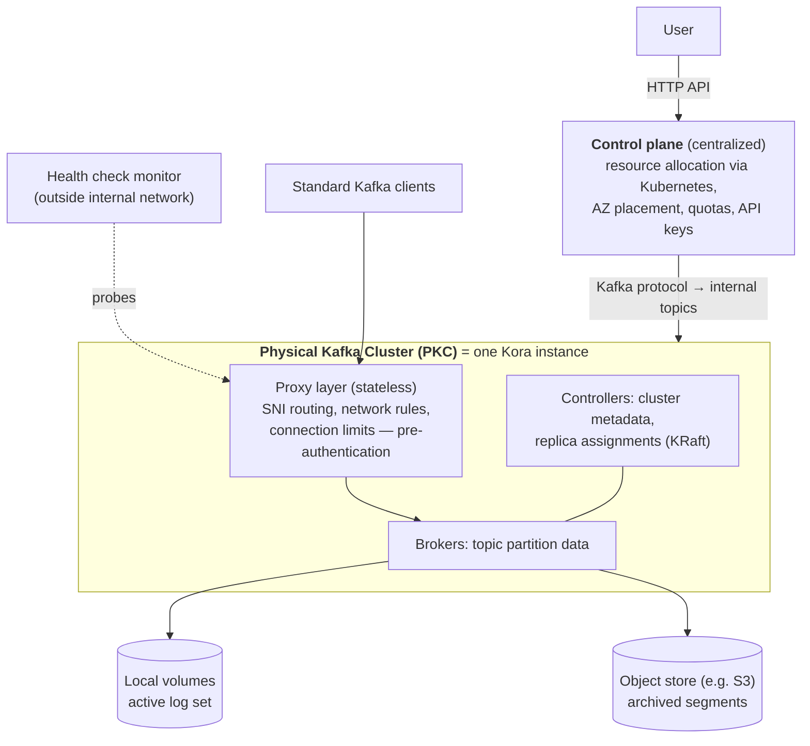

# Kora: A Cloud-Native Event Streaming Platform for Kafka

> VLDB 2023 — structured reading notes

Full paper content: [Markdown conversion](../original/kora-vldb-2023.md)

## Paper information

- **Authors:** Anna Povzner, Prince Mahajan, Jason Gustafson, Jun Rao, Ismael Juma, Feng Min,
  Shriram Sridharan, Nikhil Bhatia, Gopi Attaluri, Adithya Chandra, Stanislav Kozlovski, Rajini
  Sivaram, Lucas Bradstreet, Bob Barrett, Dhruvil Shah, David Jacot, David Arthur, Manveer
  Chawla, Ron Dagostino, Colin McCabe, Manikumar Reddy Obili, Kowshik Prakasam, Jose Garcia
  Sancio, Vikas Singh, Alok Nikhil, Kamal Gupta
- **Affiliation:** Confluent Inc.
- **Venue:** Proceedings of the VLDB Endowment, Volume 16, Number 12, 2023, pages 3822–3834
- **DOI:** [10.14778/3611540.3611567](https://doi.org/10.14778/3611540.3611567)
- **Scale at publication:** tens of thousands of clusters across AWS, GCP, and Azure in **73
  regions**, grown over six years

## One-sentence summary

Kora is Confluent Cloud's rebuild of Kafka for the cloud: **tiered storage** to decouple compute
from data volume, **KRaft metadata** to stabilize the controller, **CKU and cluster-load
abstractions** so users never reason about instance types, **cell-based multi-tenancy with dynamic
quotas** for isolation at thousands of tenants per cluster, and **automated degradation detection**
plus **continuous durability audits** to survive heterogeneous, frequently-misbehaving cloud
infrastructure.

## Problem

Kafka was built before cloud systems dominated, and its architecture assumes a much more static
environment. Concretely: a **single-tiered storage layer** made the system slow to adapt to
workload changes, because rebalancing load required **massive data movement**.

The challenge Confluent faced: **provide a highly available service with consistent performance at
low cost across three clouds with heterogeneous infrastructure.**

- "Consistent performance" spans latency and throughput, and depends on user workload requirements
  and scale that Confluent does not control.
- "Heterogeneous infrastructure" means **different categories and frequencies of failures**, all of
  which must be handled robustly.

The paper is explicit that Kora "is not based on a single key idea" but synthesizes well-known
techniques with lessons from operating at scale.

### Background terminology

Events are organized into **topics**, partitioned for throughput. A **topic partition** is a
persistent, replicated log; each copy is a **replica**. Each **record** gets a unique **offset**,
incremented after every write. **Producers** write to the end of the log; **consumers** read from
any offset and record their last processed offset **in a separate internal topic** so they can
resume after failure. **Consumer groups** distribute partitions for parallel processing. Kafka
relies on **file system caches** and is optimized for consumers reading at the end of the log — the
most common access pattern.

**End-to-end latency** is measured as elapsed time from event creation by a producer to delivery to
the consumer.

## Design goals

| Goal | Concrete commitment |
| --- | --- |
| **Availability and durability** | Uptime SLA **99.95% single-zone, 99.99% multi-zone**; "lapses in durability or availability lead to direct revenue loss and are completely unacceptable" |
| **Scalability** | Customers need confidence the backend will keep scaling, because changing infrastructure backends is risky and expensive |
| **Elasticity** | Clusters expand and shrink with workload; Kora also **adapts to changing workload patterns within a given cluster size** |
| **Performance** | Low latency at high throughput, with **all performance wins passed directly to users** — applications may simply get faster over time |
| **Low cost** | Design consistently leans toward better **price-performance ratio** |
| **Multi-tenancy** | The key enabler of low price and elastic pay-as-you-go |
| **Multi-cloud** | Unified experience across AWS, GCP, Azure while minimizing operational burden from their differences |

## Architecture



- The user-visible unit of provisioning is a **Logical Kafka Cluster (LKC)**. A PKC may host one or
  more LKCs: applications with strict isolation requirements get a **dedicated PKC**; others take
  the cost savings of multi-tenancy. **The LKC provides namespace isolation, and client APIs are
  unchanged either way.**
- The **proxy layer is stateless and scales separately from brokers**, routing via **SNI**. It
  avoids bottlenecks such as **port exhaustion** on large clusters and enforces network access rules
  and connection limits **before** authentication reaches the broker.
- Every component exposes telemetry. The **health check monitor sits outside the internal network**
  — critical for catching issues in the network stack (DNS resolution, anything in the proxy layer)
  that the controller would never see.

### Two departures from ten years of Kafka architecture

**1. Metadata moved from ZooKeeper into an internal topic (KRaft).**

The traditional controller managed cluster-wide metadata, tracked broker liveness via heartbeats,
and elected partition leaders. Its centralized view is ideal for balancing load — but historically
it could only balance **replica and leader counts**, with **no insight into per-topic ingress/egress
load**, so overall load could become extremely skewed. Kora adds a controller component that models
cluster load from **broker-reported telemetry**.

The controller was also **co-located with brokers**, any of which could win a ZooKeeper-facilitated
election. Two problems on large clusters: the controller's work is substantial (electing leaders
for thousands of partitions after a broker failure caused **noticeable performance degradation** on
that broker), and **rolling a cluster for an upgrade forced repeated controller changes** whose
expensive ZooKeeper loads destabilized the cluster.

**KRaft** stores metadata in an internal topic partition replicated by a **Raft-based consensus
protocol**; the controller is the leader of that partition and **replicas follow the log and build
metadata state so they can take over leadership immediately** after a failure. The controller also
became **a separate process** from the broker, so resources can be allocated and its workload
isolated independently — packed onto broker instances for small clusters to save cost, on a
dedicated instance for large ones. Crucially, **all broker processes can now be rolled while the
controller stays stable**.

**2. Storage became two tiers.**

Traditionally every replica held a complete copy of the log on local volumes with broker affinity.
For a cloud service this creates two problems:

- **Cost vs. performance.** Better performance needs more expensive disk types, but their cost is
  **proportional to volume size**, so it becomes prohibitive as data grows.
- **Predictable performance.** Rebalancing replica assignments requires **copying the full log** to
  the new replicas. More data means slower reaction — and **a higher risk that the workload changes
  again before the reassignment finishes**. Copying also **steals system resources from the user
  workload**.

Kora's tiered storage writes new data to local disks replicated by Kafka's own protocol as before —
most consumers read from this tier as soon as data is written — and **migrates aged data to a much
cheaper object store**, after which it is removed from each replica. Consequences:

- Local volumes shrink to the **active set**, allowing better-performing disk types.
- **Rebalancing only moves the small active set** — the key enabler of fast expansion.
- **No practical limit on retention** per partition; the old architecture was capped by the maximum
  single local volume size, now only by the object store.

The cost is complexity: metadata about archived segments is maintained in **another internal
topic**. As segments upload, their metadata is published there; **each replica watches the topic**
to know when local data can be removed and to build a reference table for serving reads. A consumer
requesting data outside the local volume causes the replica to load the segment from the object
store.

## Cloud-native building blocks

### Abstractions: CKU and cluster load

Abstractions matter because users should not reason about memory, CPU type, network bandwidth, or
IOPS. Expressing the contract in high-level constructs (**ingress and egress bandwidth**) frees
users **and simultaneously frees Confluent to change instance types and storage classes** whenever
it improves price or performance.

**Confluent Kafka Unit (CKU)** — the minimum cluster size that can be provisioned and the minimum
unit of expansion or shrink. Clusters with equivalent CKUs **perform comparably for the same
workload across all three clouds**. A CKU specifies maximum ingress and egress bandwidth, request
rate, and connection count and rate.

The catch: a CKU exposes the maximum on *each* dimension to avoid artificially limiting workloads,
but **hitting the maximum on one dimension usually requires using less of the others** (full
bandwidth requires good batching, fewer requests, fewer connections). So **a cluster can run out of
capacity before hitting any CKU limit.**

**Cluster load** fills that gap: the utilization of the backing physical cluster, approximated as
**the utilization of the most loaded broker**. This is a good approximation because well-balanced
clusters have similar per-broker utilization, while for imbalanced clusters **workloads experience
the most loaded broker in their p99 latency**. Utilization uses the traditional definition — the
proportion of time a server is busy — whose advantage is that **utilization grows linearly with
load while latency grows exponentially near saturation**, so users can reason about it.

Together, CKU gives a first-order estimate of needed cluster size and expected performance and cost
**without running any benchmarks**, and cluster load signals when to expand. An auto-scaling
framework driven by cluster load was in development.

### Measuring broker load: queueing theory instead of resource counters

The challenge: **direct use of CPU, IOPS/disk-throughput, or network bandwidth falls short when the
workload stresses a different dimension**, and directly measuring server load requires accurately
measuring request service time while excluding time in internal disk queues and other resources
Confluent does not control.

The solution uses queueing theory: **under heavy load, latency grows exponentially with
utilization**, and **queueing delay is a more robust signal that a workload needs more resources
than utilization of any specific resource**. But latency itself is hard for users to reason about
precisely because of that exponential relationship — hence the conversion back to utilization.

Concretely, the broker is modeled as a **single-server queueing system with arbitrary inter-arrival
and service time distributions (G/G/1)**, where a job is a network request or a connection creation
request, and the wait time *W* is time spent in broker or infrastructure queues **excluding waiting
for replication or for clients to send responses**.

- **High load:** **Kingman's approximation** of wait time under heavy load yields utilization.
  `E[W]` is computed as an **exponentially decaying 1-minute moving average** of measured *W*, using
  the Unix load-average approach; the formula's coefficients were **found empirically via
  benchmarks covering a range of workloads**.
- **Low utilization:** approximated by the utilization of the broker's **network and request
  threads**.

Validation: on a CPU-intensive workload with load increased by adding partitions, **broker load
tracks CPU usage** while **latency increases far more dramatically as the cluster overloads** —
demonstrating why latency is inappropriate as a direct load measure. Similar predictable trends
were observed for IO- and network-intensive workloads.

### Cluster organization for cost efficiency

Two design choices give freedom to change hardware without affecting users:

1. **High-level service constructs** (CKU) mean hardware can change without violating performance
   contracts. Contrast with **Bring-Your-Own-Account** models, which "punt the complexity of
   hardware selection and its associated tradeoffs to the users."
2. **Decoupled persistent block storage rather than ephemeral instance storage**, so VM instance
   type and block volume can be chosen **independently** while retaining strong durability.

**Core Kafka costs** — significant overall, dominant for low-throughput dedicated clusters. The
difficulty is **hardware heterogeneity within and across clouds**: one provider may support much
higher base IOPS; another may not scale IOPS/throughput independently of capacity; within one
provider, one volume type has fixed throughput/IOPS with bursting while another is fully
configurable; the same VM class may include **different architecture generations that perform
variably**; and newer architectures such as ARM may lack capacity in many regions. Pricing and
availability also **evolve continuously**.

Their evaluation process: establish **baseline resource lower bounds** (storage and network
bandwidth needed for target ingress/egress) to rule out most instance and volume types, run a
**set of performance tests**, then **staged fleet-wide rollout** if promising.

Two worked examples of how much tuning this takes:

- **GP2 → GP3 volumes on AWS.** GP2 provides 256 MB/s throughput and 750 IOPS (burstable to 3000);
  GP3 starts at 125 MB/s and 3000 IOPS and is cheaper. To get better performance from GP3 they
  **had to change how data is flushed to disk to avoid a large backlog of page-cache changes** —
  requiring "extensive probing and analysis using a diverse range of workloads and low-level kernel
  knobs."
- **Memory-optimized → CPU-optimized instances with half the memory**, after extensive analysis.

> "Changes like these yield significant cost savings while still improving fleet-wide performance
> but are very hard to do right. This is the key value proposition of using a cloud-native
> platform."

**Result:** continuous right-sizing improved **fleet-wide P99 latency by a factor of 3** over a few
months.

**Network costs.** The largest is **cross-AZ replication** in multi-AZ clusters, especially for
throughput-dominated workloads. Kora offers a **single-AZ option** for weaker guarantees, and a
**fetch-from-follower** model so client fetches can be served by a same-AZ follower replica if one
is available and sufficiently caught up.

**Microservice costs.** Observability, auditing, and billing services are **bin-packed alongside
Kafka brokers, reserving ~80% of VM resources for the broker**. This works because **storage and
network are typically the bottleneck in an IO-intensive system**. Some workloads are limited by
this, but the alternative — dedicated VMs for non-Kafka components — "would force the customers to
pay the cost for these additional nodes *all* the time whether or not their use cases benefit."

### Elasticity

Kafka is stateful: a specific request must be served by the broker holding the state. Tiered storage
helps immensely, but replicas still must move on expansion, shrink, or load change.

**Load balancing.** Managed by **Self-Balancing Clusters (SBC)**, a component inside the Kafka
Controller based on **Cruise Control**. It collects per-broker metrics, builds an internal cluster
model, and reassigns replicas by heuristics against a **prioritized list of goals** — each goal
proposes replica movements that **must be blessed by all higher-priority goals**, so higher-priority
goals are more likely to be satisfied. Cruise Control distinguishes **triggering goals** (which
start a rebalance round) from **balancing goals** (best-effort), so critical metrics like **disk
usage and network imbalance must be classified as triggering goals**.

Balancing uses a **blend of metrics** — ingress bytes, egress bytes, disk usage, and broker load.
The central tension: **a reassignment is disruptive to clients**, since it changes metadata and
forces clients to refresh and reconnect. "Too frequent balancing can be disruptive to clients and
induce wasted work whereas too infrequent balancing can leave the brokers imbalanced leading to
degraded performance."

Two practical difficulties:

- **Attributing broker load to replicas** (the unit of reassignment) is hard. Solution: distribute a
  broker's overall resource usage across its replicas by a **weighted combination of representative
  metrics** — ingress bandwidth, egress bandwidth, request rate.
- **Large clusters can have hundreds of thousands of replicas.** To scale, Kora **abstains from
  collecting replica-level metrics**, falling back to topic- or broker-level collection with
  heuristic attribution.

Production result: a previously large **latency skew converges rapidly to balance across nodes**,
with immediate improvement in the health check's latency outliers.

**Shrink and expand.** The customer initiates a scale-up in the UI, aided by real-time usage
information; new VMs are provisioned; **SBC is notified and automatically begins reassigning
replicas**, declaring completion when every new broker has a fair share of load.

**Speed matters asymmetrically:** shrinking usually happens under low pressure, but **expansion must
complete before the system becomes overloaded, while taking minimal resources from the user
workload**. Tiered storage is what makes this possible by shrinking the data to move. Additionally,
**SBC chooses replicas by their contribution to overall load, which follows a power law
distribution** — a minority of replicas cause the majority of load — so from the user's perspective
expansion completes as soon as the new replicas handle a fair share.

### Observability

**Client-centric end-to-end metrics.** Server-side metrics **omit the load balancer and proxy hops**,
so overload in those services or network connectivity issues would be **completely invisible**. The
**health check agent** sits outside the internal network and continuously probes brokers with
produce and consume requests **traversing the same path as client requests**. It **embeds a
producer and consumer so it measures end-to-end latency exactly as a user would**. Its latency and
success rate feed dashboards, alerting, automated mitigation, and SLO computation.

**Fleet-wide SLO.** Individual clusters are too noisy because workloads vary enormously, so
fleet-wide metrics abstract the whole fleet into a few numbers (latency, availability) to observe
trends and prioritize work. The methodology:

1. The HC agent sends **100 produce and 100 consume probes every minute per broker**, using
   **special internal partitions whose leadership and assignment are sticky to each broker** so the
   measurement genuinely reflects that broker.
2. Compute **p99 end-to-end latency for that minute for that broker** over successful probes.
3. Take **the worst end-to-end latency across all brokers** as the cluster's metric for that minute.
4. The **weekly latency SLO for a cluster** is the p99 over all that week's data points.
5. The **fleet-wide latency SLO** is the median, p90, and p99 of the weekly SLOs across all
   clusters.

Tracking this principled aggregate identified the most widespread issues and **improved fleet-wide
SLOs by several multiples over a year**. Availability follows the analogous methodology.

### Automated mitigation

Upholding a 99.99% SLA is hard when cloud providers do not offer the same guarantees — **"a majority
of our availability lapses have been caused by malfunctioning cloud infrastructure."** Two
categories:

- **Outright unavailability** of network or storage infrastructure.
- **Severely degraded infrastructure** persisting for days, contributing to high latency.

Why degradation is so damaging in Kafka specifically: **in-sync replicas (ISR)** are the replicas
actively replicating a partition, and produce requests are usually configured to wait for **all**
of them. **Latency is therefore determined by the slowest broker in the ISR** — and since client
requests batch data for many partitions, **one slow broker out of a large set degrades latency
across every partition in the batch**. Confluent has "frequently seen cases where the underlying
cloud SSD volume begins to exhibit chronically high latency for days unless a mitigating action to
replace it is taken."

The generic solution is a feedback loop with a **degradation detector** that collects cluster
metrics, decides whether a component is malfunctioning, and marks it with a **distinct broker health
state**, each with its own mitigation:

| Detected condition | Detection | Mitigation |
| --- | --- | --- |
| **Lost external network connectivity** | A **network health manager thread** per broker monitors both health-check probes and external client traffic; if **neither** arrives for an extended period, the broker has lost external connectivity | **Broker demotion** — the controller moves all partition leadership off the broker. Fast and effective because it **requires no data movement**, and Kafka serves traffic from the leader |
| **Storage not progressing** | A **storage health manager thread** monitors storage operation progress | **Restart the broker** — which naturally migrates leadership via the Kafka protocol and **fences the broker**, since it cannot rejoin the ISR until its storage issue resolves |
| **Performance degradation relative to peers** | Comparison against the cluster's global state | **Move the broker out of the ISR** for its partitions while **letting it continue replicating** — migrating leadership away and removing it from the request critical path so its latency cannot hurt clients |

As a fail-safe, if automatic mitigation fails the system **notifies a human operator**, with tooling
built to assist.

**Results:** analysis of several zonal outages involving storage unavailability confirmed automated
mitigation worked as designed and minimized unavailability. Over a **30-day interval, degradation
detection identified and automatically handled 12 cases of transient hardware degradation across 3
major cloud providers**. These improvements enabled raising the **multi-zone uptime SLA from 99.95%
to 99.99%**.

### Ensuring data durability

Replication, scrubbing, and a high-durability object store "fall short of fulfilling the guarantee
users demand: that their data will be safe despite regional outages, cloud-provider outages,
software bugs, disk corruption, memory corruption, misconfigurations, and even operator errors."
At Confluent's scale, **these issues are observed on a regular cadence**. Real incidents from test
and production:

| Incident | Description |
| --- | --- |
| **Storage corruption** | Corruption at the leader caused it to **trim the prefix of its log**, forcing followers to trim too — **data loss despite replication working correctly** |
| **Metadata divergence** | Divergence in tiered storage metadata between leaders and followers, triggered by a failure to persist an update to storage |
| **Configuration update bug** | A bug applying Kafka's dynamic configuration caused **spurious changes in retention time** for some topics |
| **Race condition updating `log-start-offset`** | `log-start-offset` tracks the start of the non-garbage-collected log; a race in updating it caused Kafka to **prematurely delete records** |

(Notably this list excludes operator errors where customers deleted their own data.)

Three protections:

**1. Cluster Linking (global replication).** Replicates **all data and all metadata** between two
independent Kafka clusters — different regions, different continents, or different cloud providers.
Because metadata is replicated too, **failover is just pointing clients at the new endpoint**: API
keys, offsets, and partition states are preserved, so consumers continue from their last committed
offset. The enabler is **reusing the native Kafka replication protocol**, which works for metadata
too since so much metadata is already stored as internal topics.

**2. Backup and restore.** Keeps a backup of all tiered data and metadata for a configurable number
of days, so accidental deletion can be recovered. Two honest limits: **the only knob exposed to
users is retention time, so users can only delete a prefix of the log**, and **only a prefix can be
recovered** — a lost suffix including non-tiered log cannot be recovered yet, because non-tiered
metadata state is more complex.

**3. Durability audits.** Every operation changing consistency-related metadata state (e.g.
`log-start-offset`) is logged as an **audit event** into a **durability audit database**. A batch
job — typically daily — validates all collected events for consistency; for example, checking that
`log-start-offset` increments **align with the user's retention policy of X days**, alerting if the
increment is larger.

The reasoning behind this design is worth quoting:

> "The Kafka broker is fairly complex and is constantly being evolved… In contrast, the audit
> engine is a very simple state machine that runs through a set of relatively static rules and
> policies. We use the static and robust audit state machine to catch invariant and policy
> violations in the Kafka code."

Because Kafka replicates data, **a timely alert can often save the data** — by demoting a corrupt
leader, letting a follower take over, or manually resetting the corrupted broker's state. Auditing
has caught critical bugs in staging and durability lapses in production before damage occurred.

### Upgrades

Before investment here, **upgrades were a major source of customer escalations** due to high latency
and transient unavailability. The process, driven by a **platform manager**:

- **Roll brokers in zonal order** — brokers from two different AZs are **never** rolled together,
  since partitions with replicas on both would go unavailable.
- **Within a zone, multiple brokers may roll together**, because placement guarantees **no partition
  has multiple replicas in the same AZ**. Capacity still limits the parallelism: **one at a time for
  small clusters, a few in parallel for large ones**, bounding end-to-end roll time when the cluster
  is under elevated load.
- **Heavy instrumentation confirms each rolled broker is fully online and functional from a
  replication perspective before proceeding**, so the desired number of offline brokers is never
  compromised.
- Because **risk of unavailability grows with upgrade duration**, substantial effort went into
  optimizing bottlenecks in the broker restart path — notably **log recovery**.

The payoff: frequent fleet upgrades enabling faster innovation and rapid patching of security
vulnerabilities and performance regressions — in contrast to self-hosted Kafka users who **run the
same version for months or years** because upgrading is so disruptive.

## Multi-tenancy

Multi-tenancy is what makes pay-as-you-go economical: **spare capacity for demand spikes is
affordable because its cost amortizes across many tenants**.

### The LKC as the unit of isolation

Each LKC is bounded by limits on partition count, ingress/egress bandwidth, CPU usage, and
connection rate; the underlying PKC also has **aggregate limits to prevent resource exhaustion**.

The elegance of the abstraction: **"a dedicated cluster is a multi-tenant cluster with just one
tenant"** — unifying both products in one user experience. It also isolates **internal** services:
the health check agent runs in its own LKC to bound its resource use and isolate its state, and
Kafka's own internal state (such as consumer offset storage) is protected the same way.

**Data isolation** comes from authentication (API keys), authorization, and encryption.
**Namespace isolation is not native to Kafka**, so Kora annotates every cluster resource — topics,
consumer groups, ACLs — with a **logical cluster ID**. To keep this transparent, **a broker
interceptor dynamically annotates requests** with the logical cluster ID associated with the
connection at authentication time. From the client's perspective topics are named exactly as in any
Kafka cluster, and the interceptor guarantees each request can only touch that tenant's resources.

### Performance isolation

Kora's multi-tenant clusters host **thousands of tenants**, any of which can spike transiently or
scale up permanently at any moment. Isolation comes from **tenant-level quotas** on ingress and
egress bandwidth, CPU usage, connection count and attempt rate, workload behaviors affecting memory,
and **partition creation/deletion rate** (to avoid overloading the controller). **CPU usage is
approximated as the time the broker spends processing that tenant's requests.**

A tenant's quota is **distributed among the brokers hosting it, each enforcing its portion
independently** — e.g. a 100 MB/s tenant quota split across brokers 1, 2, and 3. Two problems must
then be solved: **oversubscribed tenants can overload brokers**, and **workloads shift usage between
brokers over time**.

**Back pressure and auto-tuning.** Multi-tenant clusters are deliberately oversubscribed because
most tenants use far less than their maximum. When aggregate demand on a broker exceeds capacity,
**safe broker-wide limits** (ingress, egress, CPU, connection rate) trigger backpressure on requests
or connections **for all tenants**. This state is temporary — high broker usage normally triggers a
rebalance, or, when the whole cluster nears capacity, a cluster expansion.

Backpressure is implemented by **auto-tuning tenant quotas on the broker** so that combined usage
stays below the broker-wide limit, tuning **proportionally to each tenant's total quota allocation
on that broker** — which gives fair sharing during overload **and reuses the existing quota
enforcement mechanism**.

Broker-wide limits come from benchmarking brokers across clouds. **CPU is the exception**: there is
no easy way to measure and attribute CPU usage per tenant, so the quota is defined as **clock time
spent processing requests and connections**, the safe limit is variable, and **request backpressure
triggers when request queues reach a threshold**.

**Dynamic quota management.** The original approach **statically divided the tenant quota evenly
across brokers**, which worked on lightly subscribed clusters but degraded as clusters scaled —
especially for **imbalanced workloads with hot partitions that shift over time**, where each
broker's small share caused **excessive throttling even while overall cluster usage was below the
tenant quota**.

Kora replaced this with a **shared quota service**: brokers periodically publish **per-tenant and
per-broker bandwidth consumption plus throttling information** to a **quota coordinator**, which
aggregates, recalculates the quota for each broker-tenant pair, and distributes it at configurable
intervals. The result is still subject to the broker's auto-tuning, which may adjust downward.
**Multiple quota coordinators** are deployed, with each quota entity mapped to one by
**deterministic hashing**.

The drawback is **sensitivity to workload fluctuation**: rapidly varying partition throughput can
cause **frequent brief throttling events that degrade tail latency**. The mitigation is **lazy
throttling** — postponing the throttling decision until the tenant's **cluster-wide** usage exceeds
a threshold relative to its quota.

**Result:** switching from static to dynamic quota distribution raised the fraction of tenants
meeting the **99.95% bandwidth SLO (≤ 5 minutes of total throttled time per week) from 99% to over
99.9%**.

### Cells: isolation at scale

Kafka spreads a topic's replicas across **all** brokers to maximize topic throughput. With thousands
of small tenants sharing a cluster, this collocates most tenants on **every** broker, causing:

1. a **huge blast radius during failures**;
2. **manageability problems**, since failures are more common during cluster upgrades;
3. **less efficient resource use** — spreading tenants thinly means more connections and requests.

The fix: restrict each tenant to a **cell**, a subset of brokers **evenly distributed across
availability zones**. A tenant's topic partitions are distributed across the brokers of **its** cell
only. **Cell size is chosen so a cell can support the maximum bandwidth and other requirements of a
single logical cluster.**

- **Growth:** when a cell nears capacity, some tenants move to a less loaded cell; if none exists,
  the cluster expands to create a new cell. Cell load is the **maximum of average broker load,
  replica count utilization, and bandwidth utilization** across the cell's brokers.
- **Placement:** a new tenant is placed by **choosing two cells at random and assigning to the less
  loaded one** — the classic "power of two choices" result. Since tenant load is unknown at creation,
  this **favors low-load cells while avoiding the hotspot of always picking the single least-loaded
  cell**.
- **Operational payoff:** cells are **smaller, so cheaper to provision and benchmark continuously**,
  where clusters with thousands of tenants are not. And because **inter-broker replication traffic
  stays within a cell**, the system **scales almost linearly as cells and tenants are added**.

**Measured efficiency gain:** a 24-broker cluster with 6-broker cells, 4 tenants each with 2 topics
of 24 partitions and 2 topics of 240 partitions, one producer per topic generating 50k messages/sec
and one consumer. Without cells each broker would host at least one partition from every tenant and
clients would connect to every broker; with cells they connect only to their cell. **Cluster load
was 53% with cells versus 73% without.**

## Limitations and questions

- **No head-to-head comparison.** The paper reports production data and internal before/after
  improvements, but never compares Kora against another cloud Kafka service or self-hosted Kafka on
  a common benchmark.
- **Relative, not absolute, numbers.** "P99 improved 3×", "SLOs improved several multiples",
  "cluster load 53% vs 73%" — the baselines are internal and undisclosed.
- **Backup can only recover a prefix.** A lost suffix including non-tiered log data is
  unrecoverable, acknowledged as future work because non-tiered metadata state is harder to
  recover.
- **Durability audits are periodic (daily)**, so they bound the *time to detection*, not the
  occurrence, of a durability lapse — and their value depends on Kafka's replication still holding
  a good copy when the alert fires.
- **Broker load is an empirically fitted model.** Kingman's approximation with benchmark-derived
  coefficients and a separate low-utilization approximation is pragmatic, but its accuracy outside
  the benchmarked workload range is not characterized.
- **Load balancing trades disruption against imbalance** with heuristics, and replica-level metric
  attribution is itself heuristic on large clusters.
- **Bin-packing microservices onto broker VMs admittedly limits some workloads**, with the answer
  being "scale up your cluster."
- **Upgrade safety is still work in progress** — the authors state that making the Kafka protocol
  itself more robust to upgrades is ongoing.
- **CKU maxima are not simultaneously achievable**, which is why cluster load had to be introduced;
  users still need two mental models rather than one.

## Practical design checklist

Patterns generalizable well beyond Kafka:

- **Tier your storage to decouple rebalance cost from retention.** Once only the active set lives
  locally, elasticity, disk choice, and retention limits all improve at once.
- **Expose capacity as a workload-level unit, not hardware.** A CKU lets the provider swap instance
  types and volume classes underneath without renegotiating the contract.
- **Report a load metric users can reason about.** Utilization grows linearly; latency grows
  exponentially. Derive the former from the latter rather than exposing raw latency.
- **Measure from outside your own network.** A probe traversing the real load balancer and proxy
  path is the only thing that sees what clients see.
- **Aggregate SLOs deliberately.** Worst-broker-per-minute → p99-per-week-per-cluster →
  distribution-across-fleet gives a number that can actually drive investment.
- **Prefer mitigations that move no data.** Leadership demotion and ISR removal are fast precisely
  because they are metadata operations.
- **Audit invariants with a simple, static state machine** separate from the complex system it
  checks.
- **Bound the blast radius with cells**, and place new tenants by the power of two choices.
- **Make dedicated a special case of multi-tenant**, so one isolation mechanism serves both products
  and your own internal services.

## Takeaways

1. **Cloud-native is mostly about decoupling.** Storage from compute (tiering), controller from
   broker (KRaft), proxy from broker, capacity abstraction from hardware — each decoupling is what
   makes some previously painful operation cheap.
2. **The cloud is the unreliable component.** The majority of availability lapses came from
   malfunctioning cloud infrastructure, which is why degradation detection and automated mitigation —
   not just replication — were what moved the SLA from 99.95% to 99.99%.
3. **Chronic degradation is worse than failure.** A disk that is slow for days poisons every batched
   request through the ISR; the system must be able to route around "alive but bad."
4. **Replication does not imply durability.** A corrupt leader trimmed its log and the followers
   faithfully replicated the data loss — hence an independent audit engine checking invariants.
5. **Abstractions are a two-way contract.** CKU frees users from hardware decisions *and* frees the
   provider to change hardware — which is precisely what enabled the GP2→GP3 and memory→CPU instance
   migrations that produced the cost and latency wins.
6. **Static quota division fails at scale.** Splitting a tenant's quota evenly across brokers
   throttles hot-partition workloads far below their entitlement; a shared coordinator with lazy
   throttling was worth an order of magnitude in SLO attainment.
7. **Spreading everything everywhere is not free.** Cells reduced cluster load from 73% to 53% while
   also shrinking the blast radius — a rare case where isolation and efficiency point the same way.
8. **Make expansion fast, not just possible.** Expansion races against overload, so tiered storage
   plus power-law-aware replica selection matter more than raw rebalancing throughput.

## Citation

```bibtex
@article{povzner2023kora,
  author = {Anna Povzner and Prince Mahajan and Jason Gustafson and Jun Rao and Ismael Juma and
            Feng Min and Shriram Sridharan and Nikhil Bhatia and Gopi Attaluri and
            Adithya Chandra and Stanislav Kozlovski and Rajini Sivaram and Lucas Bradstreet and
            Bob Barrett and Dhruvil Shah and David Jacot and David Arthur and Manveer Chawla and
            Ron Dagostino and Colin McCabe and Manikumar Reddy Obili and Kowshik Prakasam and
            Jose Garcia Sancio and Vikas Singh and Alok Nikhil and Kamal Gupta},
  title = {Kora: A Cloud-Native Event Streaming Platform For Kafka},
  journal = {Proceedings of the VLDB Endowment},
  volume = {16},
  number = {12},
  pages = {3822--3834},
  year = {2023},
  doi = {10.14778/3611540.3611567}
}
```
