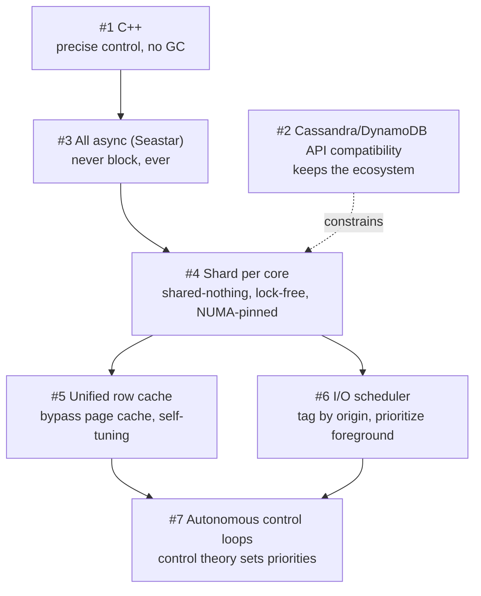

# Beyond Legacy NoSQL: 7 Design Principles Behind ScyllaDB

> **Vendor whitepaper, not a peer-reviewed paper** — structured reading notes

Full content: [Markdown conversion](../original/scylladb-seven-design-principles.md)

## Document information

- **Publisher:** ScyllaDB Inc. (copyright 2022)
- **Type:** Corporate whitepaper — no venue, no peer review, no reproducible methodology
- **Read it as:** a clear statement of an engineering philosophy and a set of architectural
  decisions, **not** as evidence. Performance claims here are vendor-authored and mostly
  unquantified; treat every number as a marketing figure until independently verified.
- **Related primary sources referenced in the text:** the [Seastar framework](https://seastar.io),
  ScyllaDB's control-theory and instructions-per-cycle engineering blog posts

## One-sentence summary

ScyllaDB is a C++ rewrite of Apache Cassandra that keeps the cluster architecture and the API but
replaces the node architecture with a **shared-nothing, shard-per-core, fully asynchronous design
on the Seastar framework**, adding a **unified row cache** that bypasses the Linux page cache, an
**I/O scheduler** that prioritizes foreground over background work, and **control-theoretic
self-tuning** — all aimed at eliminating node sprawl, GC pauses, and manual tuning.

## Problem: what Cassandra got right and what it got wrong

**Cassandra's cluster architecture is the part worth keeping:**

- **Masterless replication** — no masters, slaves, or elected leaders; all nodes symmetric, serving
  all reads and writes, no single point of failure.
- **Global distribution** across data centers, regions, and public/private clouds.
- **Linear scale** — add nodes without downtime.
- **Tunable consistency** per read and write, plus tunable replica count.
- **A simple data model** with dynamic control over layout and format.

**Cassandra's node architecture is the part that fails:**

| Problem | Consequence |
| --- | --- |
| **Team intensive** | Operating at scale requires dedicated full-time experts with a scarce and expensive skill set |
| **JVM challenges** | Garbage collection produces **unpredictable and unbounded latency** |
| **Inefficient utilization** | Cannot exploit multi-core CPUs and high-density storage servers |
| **Manual tuning** | Intricate, unpredictable tuning while "combating compactions and garbage collection storms" |
| **Dev tweaking** | Application developers need knowledge of database internals to scale |

The stated consequence is a forced choice **between availability, simplicity, and performance** —
teams put a Redis cache in front of Cassandra (losing simplicity and consistency), avoid parts of
the feature set (complexity and stability), or move to a managed service like DynamoDB and, the
paper claims, **triple their TCO**.

The framing throughout: **database software architecture has not kept pace with hardware.** The
ScyllaDB team came from KVM hypervisor development and found that neither Cassandra nor any other
database on the market translated the full power of modern multi-core CPUs and fast I/O devices
into user-visible performance.

**Original goal:** scale-up performance of **1,000,000 IOPS per node**, scale-out to hundreds of
nodes, and **p99 latency under 1 millisecond** — without sacrificing Cassandra's functionality,
tooling, or ecosystem.

## Design decision #1: C++ instead of Java

The argument is about **control**, not raw language speed:

- A modern database needs to use large amounts of memory and have **precise control over what the
  server is doing at any moment**. Java provides neither.
- Cassandra's JVM dependence makes it susceptible to **garbage collection latency**. The usual
  workaround — off-heap data structures — **fragments memory and defeats the purpose of managed
  memory entirely**.
- C++ runs as native machine code with complete control over low-level operations, while offering
  abstractions that keep complex code manageable.

Concrete consequences claimed: ScyllaDB contributed a **kernel-level API enhancement** (linked to
an LWN article) that "would be difficult at best and definitely non-idiomatic in Java," and
developers **routinely inspect generated assembly** to verify efficiency down to the
microarchitectural level (instructions-per-cycle research).

**Result: garbage collection problems eliminated altogether.**

Customer quote used as evidence (Expedia): no more stop-the-world GC pauses, **more data stored per
node and more throughput per node**, saving money.

## Design decision #2: Cassandra compatibility

The reasoning is about the value of accumulated institutional knowledge: a decade of community
investment in drivers, query language, and ecosystem is worth more than a cleaner new design.
Rather than build new drivers or invent another query language, ScyllaDB leverages what exists.
The same logic later drove an **Amazon DynamoDB-compatible API**.

Compatibility spans five layers:

| Layer | What is compatible |
| --- | --- |
| **Wire protocol** | Thrift, CQL, and the full polyglot of client drivers — striving for full CQL compliance including lists, maps, counters, UDTs, secondary indexes, and **lightweight transactions (LWT)** |
| **Monitoring** | JMX, via a **JVM-proxy daemon that transparently translates JMX into ScyllaDB's RESTful API**, so existing Cassandra dashboards work; plus a Prometheus API and direct REST |
| **File format and algorithms** | Cassandra's **SSTable** format and **all Cassandra compaction strategies**; auxiliary tools for SSTable loading, backup/restore, and repair |
| **Configuration** | Consumes `cassandra.yaml` directly. JVM options and Cassandra-derived limitations (e.g. parallel compactor configuration) are **ignored — ScyllaDB always uses maximum parallelism** |
| **CLI** | The same `nodetool`, with identical processes from backup to repair |

The payoff: organizations migrate **without rewriting applications**. Customer quote (SAS
Institute): "We did not change our application one bit — the same drivers, the same commands…
worked with ScyllaDB with absolutely no changes."

## Design decision #3: All things async

The premise: modern servers can perform millions of IOPS, and software must be asynchronous to
drive both I/O and CPU in a way that **scales linearly with core count**.

The specific observation that motivates going all the way:

> As storage technology improves, **the cost of dispatching one I/O operation approaches the cost of
> a thread context switch.** As core count increases, context switches also appear as a result of
> locking.

Therefore ScyllaDB decided **not to synchronously wait for either I/O completion or neighboring
CPUs, even for nanoseconds** — using thread pools to avoid waiting on slow HDDs is no longer
enough when the device is NVMe.

The cost is admitted: building an asynchronous framework meant **more upfront work**. The payoff is
that **the number of concurrent queries is constrained only by system resources, not by the
framework**, and traditional concurrency problems are eliminated.

The engine is **Seastar**, accessing disk with async I/O and direct memory access (DMA) through the
Linux API.

## Design decision #4: Shard per core

The historical framing: Moore's law and Dennard scaling doubled single-threaded performance every
18 months until frequency limits forced the shift to multicore in the late 2000s — **and the typical
threaded programming model virtually guarantees scalability problems as cores multiply.**

Four costs of the threaded model:

1. **Lock contention.** Locks block other threads. **Even busy waiting must lock the CPU bus and
   invalidate caches, adding overhead even when uncontended.** Application-level locks are worse —
   the contended thread sleeps and context switches. **As core count grows, so does the chance of
   contention**, capping scalability.
2. **Cache contention** from shared data.
3. **NUMA unfriendliness.** With multiple sockets, memory access may cross sockets, and **remote
   access costs twice as much as local**. Threaded applications are usually agnostic about memory
   location and can migrate between sockets, **doubling response times**.
4. **I/O device mismatch.** Modern NICs and storage have **multi-queue modes where every CPU can
   drive I/O**, but the standard model lacks enough handlers or requires context switches to
   service I/O.

**ScyllaDB's answer is two levels of sharding:**

```text
Level 1 (same as Cassandra):  cluster dataset  →  sharded across nodes
Level 2 (transparent to users): node's token range  →  sharded across CPU cores/hyperthreads
```

Each **shard-per-core process is an independent unit fully responsible for its own dataset**:

- one thread of execution — **a single OS-level thread pinned to that core** — plus a subset of RAM;
- **thread and RAM pinned NUMA-friendly** to that core and its matching local socket memory;
- since a shard is the only entity touching its data structures, **no locks are required and the
  entire execution path is lock-free**;
- **each shard issues its own I/O**, to disk or NIC directly, and **administrative tasks —
  compaction, repair, streaming — are managed independently by each shard**.

Two details showing how far the lock-free commitment went:

- They wrote **their own memory allocation library** so each thread has its own pool with **no
  hidden OS-level locking**.
- They **optimized GCC's exception handling**, because the GCC library acquired a spinlock that
  created contention on exceptional paths.

**Inter-shard communication** uses **shared memory queues**: a request needing data from several
shards is parsed by the receiving shard, then distributed **scatter/gather** to target shards, each
computing independently with no locking and no contention.

**Task scheduling:** each shard runs one OS thread with an internal task scheduler that interleaves
network exchange, disk I/O, compaction, and foreground reads and writes. Tasks are **low-overhead
lambda functions called continuations**, reducing both switching overhead and memory footprint —
enabling **each CPU core to execute a million continuation tasks per second**.

## Design decision #5: Unified cache

**Why bypass the Linux page cache:**

- Linux treats files as **4 KB chunks by default**. Many database operations touch less than that,
  so the 4 KB minimum causes **high read amplification** — and with poor spatial locality, the extra
  data is **rarely useful for subsequent queries; it is just wasted bandwidth**.
- The page cache **performs synchronous blocking operations under the hood**, hurting both
  performance and predictability.

**The failure mode in Cassandra, spelled out:** Cassandra does not know whether a requested object
is resident. Accessing a non-resident page causes Linux to **issue a page fault and context switch
to read from disk**, then **context switch again to another thread**. The original thread is
**paused with its locks still held**. When the data is ready (**another interrupt context switch**),
the kernel schedules the original thread back in.

Cassandra's partial remedies — a **key cache** and a **row cache** — add complexity rather than
remove it: the operator must allocate memory to each cache, **different ratios give different
performance for different workloads**, and the operator must also split memory between the JVM heap
and off-heap structures. Since **allocations happen at boot time, "it's practically impossible to
get it right, especially for dynamic workloads."**

**ScyllaDB's unified row-level cache:**

- **Bypasses the Linux page cache**, so it does not suffer the 4 KB read amplification.
- **Dynamically tunes itself to the current workload**, removing the need to hand-tune multiple
  caches.
- ScyllaDB caches objects itself, so it **always controls their eviction and memory footprint**, and
  can **dynamically balance the different cache types**.
- Controllers exist for the **memtable, compaction, and cache**, adjusting their sizes dynamically.
- On a miss, ScyllaDB **generates a continuation task to read asynchronously via DMA**; Seastar
  executes it in microseconds (a million tasks per core per second) and moves to the next task.
  **No blocking, no heavyweight context switch, no tuning.**

**Consequence for users:** higher disk-to-RAM ratios **and** better RAM utilization, so **each node
serves more data — smaller clusters with larger disks**.

## Design decision #6: I/O scheduler

**The problem:** I/O producers compete for bandwidth, and if too much is submitted at once it queues
in the device. **The filesystem and disk are ignorant of the content and purpose of the data** and
cannot tell whether blocks came from a latency-sensitive real-time workload or a batch background
task.

Cassandra's approach — **capping background operations** (compaction, streaming, repair) — requires
careful tuning and detailed knowledge of internals, and with spiky workloads is a daunting
challenge with failure modes in both directions:

- **Cap too high** → spiky latency, foreground operations starved of compute and I/O.
- **Cap too low** → streaming terabytes between nodes "might take days — rendering autoscaling a
  nightmare."

**The LSM context:** both databases use **log-structured merge trees**. Immutable files created with
sequential I/O give great initial write throughput, but penalize future reads that must consult
multiple SSTables; **compaction** merges them back down. **Issues arise when these background
operations compete with user queries.**

**ScyllaDB's answer:**

- At install time, **`scylla_io_setup`** runs a benchmark that **automatically determines the maximum
  useful disk concurrency** — defined as the point where **maximum throughput is achieved while
  latency is good and no data is queued by the disk or filesystem**.
- All I/O passes through a scheduler where requests are **tagged by the origin of the operation**
  (foreground vs. background classes), then **metered and prioritized** per class.
- The result claimed: **no queues in the filesystem or device**, the disk kept "in its sweet spot"
  so latency stays low while bandwidth is maximized, and **no tuning required**.
- Operational payoff: commissioning and decommissioning nodes becomes "simply instruct ScyllaDB to
  perform the operation" — the I/O scheduler runs it **at the fastest speed that won't impact system
  throughput**.

Customer quote (Comcast): "We've reduced our P99, three 9 and four 9 latencies by 95%."

## Design decision #7: Autonomous capabilities

The motivation is stated as user feedback: Cassandra users **waste significant time both tuning the
database and dealing with the fallout of complex tuning mechanisms**, and the only prior solutions
were to become an expert in internals or hire expensive consultants.

**The mechanism is control theory** — the same discipline used in industrial plants and automotive
cruise control. The pattern: **set a level for a user-visible property that the system must
maintain, and leave tuning of the component parts to the control algorithm.** Applied in:

- **Compaction** — ensuring the uncompacted backlog never grows out of control (a **compaction
  backlog monitor** adjusting priority);
- **Caches** — automatically moving memory to where it is needed (a **memory monitor** adjusting
  priority between commitlog, memtable, and query paths);
- and "many other parts of the system."

The claimed benefit beyond reduced administrative burden: **operators can achieve 100% resource
utilization while maintaining SLAs**, optimizing infrastructure budgets at the same time.

## How the seven decisions reinforce each other



The dependency chain is real: **you cannot bypass the page cache unless you are asynchronous**
(otherwise a miss blocks a thread); **you cannot be lock-free unless data is sharded per core**;
**you cannot shard per core without precise control over memory placement and threading**, which is
the C++ argument; and **the I/O scheduler and unified cache are what give the control loops
something to actuate**.

## Claims made, and what would be needed to verify them

| Claim | Evidence offered |
| --- | --- |
| **1,000,000 operations/second on a single node** | Stated as goal and as achieved; no configuration, workload, or measurement methodology given |
| **p99 latency under 1 ms** | Stated as a design goal |
| **Linear scaling with core count** | A figure (ops/sec vs. cores) referenced but not reproduced in the text conversion |
| **A million continuation tasks per core per second** | Stated |
| **95% reduction in p99/p999/p9999 latency** | Customer quote (Comcast) |
| **More data and more throughput per node than Cassandra** | Customer quote (Expedia) |
| **Significantly smaller datacenter footprint than Cassandra clusters** | Asserted from production deployments |
| **Tripled TCO on DynamoDB** | Asserted |

**None of these are accompanied by a reproducible benchmark, hardware specification, workload
definition, or comparison methodology.** For genuine evidence on the underlying techniques, the
peer-reviewed literature on shared-nothing per-core designs, kernel-bypass I/O, and LSM compaction
scheduling is the place to look — several such papers sit alongside this one in this collection
(MICA for exclusive per-core access and burst I/O; Masstree for the cost of shared vs. partitioned
designs under skew; Kora for I/O scheduling and self-balancing in a cloud service).

## Limitations and open questions

- **This is marketing material.** Every performance figure is vendor-authored, and the comparison
  target (Cassandra) is chosen and configured by the vendor.
- **Shard-per-core has known costs the paper does not discuss.** Static per-core partitioning is
  vulnerable to **hot shards under skewed key popularity** — the exact weakness MICA had to engineer
  around with keyhash partitioning and burst I/O, and which Masstree measured at 3.5× throughput
  loss for hard-partitioned designs at δ = 9. ScyllaDB inherits Cassandra's token-based
  partitioning, so how it handles a hot partition within a node is unaddressed here.
- **Cross-shard requests are described as scatter/gather over shared memory queues**, but their cost
  is not quantified — and multi-partition queries, secondary indexes, and lightweight transactions
  all cross shards.
- **"Always uses maximum parallelism"** is presented as a virtue, but ignoring a configuration knob
  is only correct if the automatic policy is always right; the paper's own I/O scheduler section
  argues that unconstrained background I/O is precisely the failure mode.
- **Control-theoretic tuning is asserted to work** but no stability analysis, setpoint definitions,
  or failure behavior under sudden workload shifts is given. Kora's paper, by contrast, documents
  the concrete oscillation problem (frequent brief throttling degrading tail latency) that feedback
  loops cause, and its lazy-throttling mitigation.
- **Bypassing the page cache moves responsibility, not work.** ScyllaDB must now implement eviction,
  memory pressure handling, and read-ahead itself; the whitepaper claims this is strictly better
  without discussing what the kernel's implementation buys you.
- **API compatibility constrains the architecture.** Adopting SSTables, Cassandra's compaction
  strategies, and CQL semantics limits how much of the storage layer can actually be redesigned.
- **No discussion of correctness, consistency implementation, or failure recovery** — the whitepaper
  is entirely about performance and operability.

## Practical design checklist

The architecture fits when:

- you already run Cassandra (or DynamoDB) and want the same API with fewer, larger nodes;
- **latency predictability matters more than peak throughput**, and GC pauses are a known problem;
- your hardware is modern multi-core with NVMe, and current utilization is poor;
- operational headcount for database tuning is the real cost you are trying to cut.

Look elsewhere, or dig deeper, when:

- your workload is dominated by **cross-partition queries or transactions**, where shared-nothing
  per-core sharding stops helping;
- key popularity is **extremely skewed within a node**, where static per-core sharding can create a
  hot shard;
- you need features outside Cassandra's data model;
- you require published, independently reproducible performance evidence before committing.

## Takeaways

1. **The cluster was fine; the node was the problem.** ScyllaDB's entire thesis is that Cassandra's
   masterless, globally distributed, tunable-consistency design was right, and that everything
   wrong with it lives inside a single node.
2. **Managed runtimes and databases pull in opposite directions.** The C++ argument is not "C++ is
   faster" but "a database needs to know exactly where its memory is and exactly what the CPU is
   doing" — and off-heap workarounds concede the point.
3. **Asynchrony becomes mandatory once I/O gets fast.** When dispatching an I/O costs about what a
   context switch costs, blocking anywhere — even for nanoseconds — is a design error.
4. **Shared-nothing per core turns concurrency control into a non-problem.** No locks, no cache-line
   bouncing, NUMA-local by construction — but it demands owning the allocator, the scheduler, and
   even exception handling.
5. **General-purpose OS facilities are a poor fit for a database that knows more than the OS
   does.** The 4 KB page cache granularity, its synchronous faults, and its indifference to which
   thread is latency-sensitive are all cases where the database has information the kernel lacks.
6. **Tag I/O by origin, then schedule it.** The filesystem and disk cannot distinguish a user query
   from a compaction read; only the database can, so only the database can prioritize correctly.
7. **Replace tuning knobs with control loops.** Every knob is a request for the operator to predict
   the future; a controller that maintains a user-visible property is the more honest interface —
   provided it is stable, which this document asserts rather than demonstrates.

## Citation

```text
ScyllaDB Inc. "Beyond Legacy NoSQL: 7 Design Principles Behind ScyllaDB."
ScyllaDB Whitepaper, 2022. https://www.scylladb.com/
```
