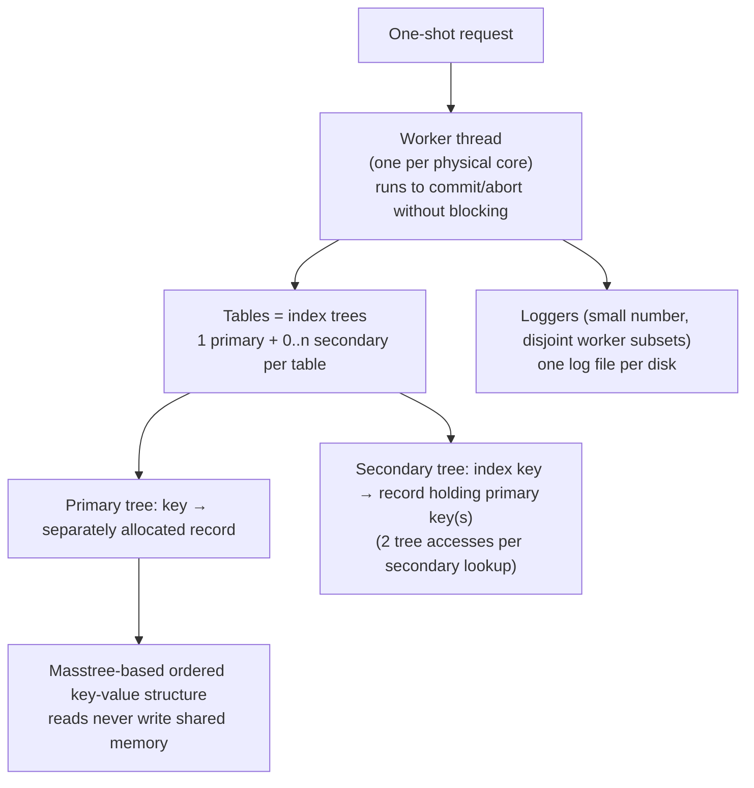

# Silo: Speedy Transactions in Multicore In-Memory Databases

> SOSP 2013 — structured reading notes

Full paper content: [Markdown conversion](../original/silo-sosp-2013.md)

## Paper information

- **Authors:** Stephen Tu, Wenting Zheng, Eddie Kohler (Harvard University), Barbara Liskov,
  Samuel Madden
- **Affiliations:** MIT CSAIL; Harvard University
- **Venue:** SOSP '13, November 3–6, 2013, Farmington, Pennsylvania, USA
- **DOI:** [10.1145/2517349.2522713](https://doi.org/10.1145/2517349.2522713)

## One-sentence summary

Silo is a serializable in-memory database whose commit protocol **avoids all shared-memory writes
for records that were only read** — no read locks, no centralized transaction ID counter, no
posting of read sets — and recovers the serial order after a crash by tying the protocol to
**periodically advanced epochs**, achieving **~700,000 TPC-C transactions/second on 32 cores** with
near-linear scaling.

## Problem

Modern servers have terabytes of RAM and 80+ cores, enough to hold datasets that used to span
many machines. But **even a single point of contention, such as a compare-and-swap on one shared
word, can limit scalability.**

**Why OCC is the right starting point.** An OCC transaction tracks reads and writes in
thread-local storage, and at commit validates that no concurrent transaction's writes overlapped
its read set before installing all writes at once. Two scalability benefits:

1. **Shared memory is written only at commit time**, after the compute phase — a short contention
   window.
2. **Read-set records need not be locked**, which matters because **the memory writes required for
   read locks themselves induce contention**.

**Why previous OCC implementations still don't scale: anti-dependencies.** Consider `t1` that
reads a record and concurrent `t2` that overwrites the value `t1` saw. A serializable system must
order `t1` before `t2` **even after a crash and recovery from logs**. Most systems achieve this by
making `t1` communicate with `t2` — posting read sets to shared memory, or taking a
**centrally-assigned monotonically increasing transaction ID**. Non-serializable systems can avoid
the communication, but then admit anomalies like snapshot isolation's **write skew**.

**Silo's answer:** provide serializability while avoiding all shared-memory writes for read
transactions, using **memory fences to produce results consistent with a serial order**, and solve
recovery with **epoch-based group commit**. Time is divided into short epochs; transaction results
always agree with *a* serial order, but **the system does not explicitly know that order except
across epoch boundaries** — if `t1`'s epoch precedes `t2`'s, then `t1` precedes `t2` serially.
Logging happens in units of whole epochs, and results are released to clients at epoch boundaries.

**Model assumption:** Silo assumes **one-shot requests** — all parameters available at the start,
completing without further client interaction. This suits OLTP; if high-latency client
communication were inside a transaction, **abort probability from concurrent updates would grow**.

## Architecture



- **Shared-memory store:** any worker can access the entire database. This is a deliberate choice
  against **data partitioning**, where workers own data subsets — partitioning shrinks table sizes
  and avoids fine-grained locks but **works best only when the query load matches the
  partitioning**.
- **Records** live in separately allocated memory chunks pointed to by the primary tree. Primary
  keys must be unique; **Silo invents one if the table has no natural unique key**. All keys are
  strings.
- **Index trees** are Masstree-based: readers **never write to shared memory**, coordinating with
  writers via version numbers and fence-based synchronization. The commit protocol is **easily
  adaptable to other index structures such as hash tables**.
- **Durability** is by logging to stable storage; **results are not returned to users until
  durable**.
- **Read-only transactions may optionally run on a recent consistent snapshot**, returning slightly
  stale results but **never aborting due to concurrent modification**.

## Epochs

Epochs serve **four** purposes: serializable recovery, garbage collection, read-only snapshots, and
defining the boundaries at which the serial order becomes explicit.

- A **global epoch number `E`** is visible to all threads, advanced by a designated thread. The
  tension: `E` should advance frequently because **the epoch period affects transaction latency**,
  but epoch change should be **rare relative to transaction duration so that `E` stays cached**.
  The implementation updates `E` **once every 40 ms**. **No locking is required for `E`.**
- Each worker `w` keeps a **local epoch `e_w`**, which may lag while computing, and is used to
  decide when garbage may be collected. The invariant is **`E − e_w ≤ 1` for all w** — if a worker
  falls behind, **the epoch-advancing thread delays its update**. Workers running very long
  transactions must periodically refresh `e_w` so the system makes progress.

## Transaction IDs

TIDs identify transactions and record versions, **serve as locks**, and detect conflicts. Each
record holds the TID of the transaction that most recently modified it.

A 64-bit TID word contains:

| Bits | Contents |
| --- | --- |
| High | **Epoch number** = the global epoch at commit time |
| Middle | Distinguishes transactions within the same epoch |
| Low 3 | **Status bits**: `lock`, `latest-version`, `absent` |

**TIDs are assigned in a decentralized fashion.** A worker chooses a TID **only after verifying the
transaction can commit**, picking the smallest number that is:

(a) larger than the TID of any record **read or written** by the transaction,
(b) larger than the worker's most recently chosen TID, and
(c) in the current global epoch.

**TID order often reflects serial order, but not always.** If `t1` wrote a tuple `t2` observed,
then `t2`'s TID exceeds `t1`'s by rule (a). **But TIDs do not reflect anti-dependencies:** if `t1`
merely *read* a tuple that `t2` later overwrote, `t1`'s TID may be greater *or* less than `t2`'s.
What *is* guaranteed:

- TIDs chosen by a **single worker** increase monotonically and agree with the serial order;
- TIDs assigned to a **particular record** increase monotonically and agree with the serial order;
- the ordering of TIDs **with different epochs** agrees with the serial order.

**The status bits** are logically separate from the TID but sharing the word is what lets Silo
**update a record's version and unlock it in one atomic step**:

- **`lock`** — protects record memory from concurrent update; in database terms a **latch**.
- **`latest-version`** — 1 when the record holds the latest data for its key; turned off when
  superseded (e.g. when an obsolete version is retained for snapshots).
- **`absent`** — marks the record as equivalent to a nonexistent key; used by insert and remove.

## Data layout

A record contains:

- **a TID word**;
- **a previous-version pointer** (null if none), used for snapshot transactions;
- **the record data** — stored **in the same cache line as the header when possible**, avoiding an
  extra memory fetch.

**Excluding data, records are 32 bytes.** Committed transactions **usually modify record data in
place**, which speeds up short writes mainly by avoiding memory allocation — at the cost of
requiring readers to use a **version validation protocol** to ensure they read a consistent
version.

## The commit protocol

During execution a worker maintains a **read-set** (records read, plus the TID at access time), a
**write-set** (new state of modified records, **but not the previous TID**), and a **node-set** (for
range queries). Records both read and modified appear in both sets; **normally the write-set is a
subset of the read-set**.

```text
Data: read set R, write set W, node set N, global epoch number E

// Phase 1
for record, new-value in sorted(W) do
    lock(record)
compiler-fence()
e ← E                                    // SERIALIZATION POINT
compiler-fence()

// Phase 2
for record, read-tid in R do
    if record.tid ≠ read-tid
       or not record.latest
       or (record.locked and record ∉ W)
    then abort()
for node, version in N do
    if node.version ≠ version then abort()
commit-tid ← generate-tid(R, W, e)

// Phase 3
for record, new-value in W do
    write(record, new-value, commit-tid)
    unlock(record)
```

- **Phase 1** locks every write-set record, **in a global order to avoid deadlock** — any
  deterministic order works; Silo uses **record pointer addresses**. Then it snapshots `E` **in a
  single memory access**. The surrounding fences must ensure the read goes to main memory rather
  than a stale cache and is ordered against all prior and subsequent accesses — **on x86 and other
  TSO machines these are compiler fences only, generating no instructions**; they merely stop the
  compiler from reordering. **This snapshot is the serialization point.**
- **Phase 2** validates every read-set record: abort if its **TID changed**, if it is **no longer
  the latest version**, or if it is **locked by a different transaction**. Then validate node-set
  versions, then generate the commit TID.
- **Phase 3** writes modified records with the new TID. **Each lock can be released immediately
  after its record is written**, and since TID and lock share a word they are written atomically —
  so the new TID is visible exactly when the lock releases.

### Why it is serializable

Three properties: (1) it **locks all written records before validating read TIDs**; (2) it
**treats locked records as dirty and aborts on them**; (3) the **fences closing Phase 1 ensure TID
validation sees all concurrent updates**.

The argument is a reduction to **strict two-phase locking**: if OCC validation commits, S2PL would
have committed too. For a read-set record, Phase 2 verifies the TID is unchanged and the record is
unlocked by others — meaning **S2PL could have held a read lock on it through commit**. For written
records, S2PL upgrades shared read locks to exclusive at commit; Silo takes the exclusive lock in
Phase 1 and then **verifies in Phase 2 that this is equivalent to a read lock held since first
access and then upgraded**.

**Epoch boundaries agree with the serial order**: committed transactions in earlier epochs never
transitively depend on transactions in later epochs. This holds because the fences make every
worker load the latest `E` **after write locking and before read validation** — placing it before
read validation ensures read-sets and node-sets never contain data from later epochs; placing it
after write locking ensures later-epoch transactions **observe at least the lock bits acquired in
Phase 1**. Thus **epochs obey both dependencies and anti-dependencies**.

**Worked example.** With `x = y = 0`, thread 1 does `t1 ← read(x); write(y ← t1+1)` and thread 2
does `t2 ← read(y); write(x ← t2+1)`. The state `x = y = 1` is not serializable, and Silo cannot
produce it: if thread 1 reads `x = 0` and commits, its Phase 2 verified `x` was unlocked and
unchanged; since thread 2 locks `x` in its Phase 1, **thread 2's serialization point must follow
thread 1's**, so thread 2 will observe either thread 1's lock on `y` or a new version number for
`y` — and will set `y ← 2` or abort.

## Database operations

**Reads and writes.** Overwrite in place when possible; otherwise allocate new storage, **mark the
old record as no longer latest**, and repoint the tree. In-place modification means concurrent
readers may see inconsistent data, handled by version validation:

- **Writer (Phase 3, holding the lock):** (a) update the record, (b) **memory fence**, (c) store
  the TID and release the lock. The requirement is that **a reader seeing a released lock must see
  both the new data and the new TID** — step (b) makes the data visible first (a compiler fence on
  TSO), step (c) exposes TID and unlock atomically because they share a word.
- **Reader (during execution):** (a) read the TID word, **spinning until the lock is clear**,
  (b) check it is the latest version, (c) read the data, (d) **memory fence**, (e) re-read the TID
  word. Retry or abort if not latest at (b) or if the TID word changed between (a) and (e).

**Deletes.** Because snapshot transactions need linked older versions to stay reachable, a delete
**marks its record absent** and registers it for later garbage collection. Clients see absent
records as missing keys, but **internally they behave like present records that must be validated
on read**. Since most absent records await collection, **Silo writes do not overwrite absent record
data**.

**Inserts.** Phase 2 handles write-write conflicts by locking, but **a nonexistent record cannot be
locked** — so the record is inserted **before** the commit protocol starts. On key `k`: if `k`
already maps to a non-absent record the insert fails and the transaction aborts; otherwise a new
record `r` is created **absent with TID 0**, added via an **`insert-if-absent` primitive** (which
guarantees at most one record per key), and placed in both the read-set and write-set as if a
regular put occurred. **Read-set validation then ensures no other transaction superseded the
placeholder.** On success the record is overwritten with its real value and the commit TID; on
failure it is registered for garbage collection.

## Range queries and phantoms

The **phantom problem**: if a scan tracked only records present at scan time, **membership in the
range could change undetected**, violating serializability. The usual answer, **next-key locking,
requires locking for reads — against Silo's whole philosophy.**

Silo instead exploits **the underlying B⁺-tree's per-leaf version number**, which the tree
guarantees changes on any structural modification to a node. A scan over `[a, b)`:

1. registers all records in the interval in the **read-set**, and
2. adds the **leaf nodes overlapping `[a, b)` to the node-set**, with the versions observed.

**Phase 2 checks those node versions are unchanged**, proving no keys were added or removed in the
examined ranges. **Failed lookups and deletes also create phantoms** — the transaction may commit
only if the key is still absent at commit — so **the node that would contain the missing key is
added to the node-set**.

**The subtlety with inserts:** an insert can itself trigger structural modification, and Silo must
distinguish *concurrent* modifications (must abort) from *its own* (must not). Since insert tree
modifications happen **before** commit time, for each affected node `n` (more than one if splits
occur) with version `v_old` before and `v_new` after: **if `n` is in the node-set with `v_old`, it
is updated to `v_new`; otherwise the transaction aborts.** Only other transactions' modifications
cause aborts.

## Secondary indexes

To the commit protocol, secondary indexes are **just additional tables** mapping secondary keys to
records containing primary keys. Modifications are made through **extra explicit accesses in the
transaction's own code**, and cause aborts in the usual way — a transaction that used a secondary
index aborts if the record it accessed there changed.

## Garbage collection

Rather than reference counting (which would force all accesses to write shared memory), Silo uses
**epoch-based, RCU-style reclamation**. Two garbage sources: **B⁺-tree nodes** and **database
records**.

A worker generating garbage registers the object and its **reclamation epoch** in a **per-core list
per object type**; once that epoch is reached the object can be freed. **Reclamation runs in the
workers between requests**, which reduces helper threads and **avoids unnecessary data movement
between cores**.

For tree nodes: a node freed during a transaction gets reclamation epoch `e_w`. Since no thread
will ever access nodes freed during an epoch `e ≤ min(e_w) − 1`, the epoch-advancing thread
periodically sets a global **tree reclamation epoch to `min(e_w) − 1`**.

## Snapshot transactions

Read-only transactions can run on a **consistent recent-past snapshot** containing all
modifications up to a point in the serial order and none after it. Two hard parts: keeping the
snapshot consistent and complete, and reclaiming its memory.

- **Snapshot epochs** align with epoch boundaries — hence consistent points in the serial order —
  but **advance more slowly, because snapshots are not free**. For epoch `e`, `snap(e) = k·⌊e/k⌋`
  with **k = 25**, so **a new snapshot is taken about once a second**.
- The epoch-advancing thread computes a global **`SE ← snap(E − k)`**; each worker sets
  **`se_w ← SE` at transaction start**. For record `r`, the relevant version is **the most recent
  one with epoch ≤ `se_w`**. A snapshot transaction **commits without checking and never aborts**.
- **Read/write transactions must not destroy versions a snapshot needs.** Committing in epoch `E`
  and modifying record `r`, a transaction compares `snap(epoch(r.tid))` with `snap(E)`: **equal →
  safe to overwrite**; **different → install a new record whose previous-version pointer links to
  the old one**. (When possible Silo copies the *old* version into new memory linked from the
  existing record, **to avoid dirtying tree-node cache lines**.)
- **Reclamation:** memory allocated for a snapshot version in epoch `E` is registered with epoch
  `snap(E)`; the epoch-advancing thread computes a **snapshot reclamation epoch = `min(se_w) − 1`**.
  **No previous-version pointers need adjusting** — the dangling pointer is never traversed because
  any future snapshot transaction prefers the newer version.
- **Deletions need special handling.** Deleted records cannot be unhooked immediately, so commit
  creates an **absent record whose data space instead stores the key**, registered for cleanup at
  `snap(E)`. When the snapshot reclamation epoch reaches that value, cleanup **removes the tree
  reference (which needs the key)** and then registers the record for reclamation under the *tree*
  reclamation epoch — it cannot be freed at once because a concurrent transaction might be reading
  it. **If the absent record was itself superseded by a later insert, cleanup checks it is still
  the latest version and simply ignores it otherwise**, since the inserting transaction already
  marked it for reclamation.

## Durability

**Durability is transitive**: a transaction is durable if its modifications are on durable storage
**and all transactions serialized before it are durable**. So recovery must restore **a prefix of
the serial order** — and epochs are exactly what makes such a prefix identifiable. Silo therefore
**treats whole epochs as the durability commit unit**: results of transactions in epoch `e` are not
released to clients until all transactions with epochs ≤ `e` are durable.

The recovery rule: find the **durable epoch `D`**, the latest epoch whose transactions were all
successfully logged, and **recover all transactions with epochs ≤ D and no more**. Not recovering
more is crucial — **the serial order *within* an epoch is not recoverable from the logged
information**, so replaying a subset of an epoch's transactions could produce an inconsistent
state. **This is also why the epoch period directly sets average commit latency.**

**Mechanism:**

1. A **small number of logger threads**, each responsible for a disjoint subset of workers, each
   writing to a log file on a separate disk.
2. On commit, a worker creates a log record of the **TID plus table/key/value for all modified
   records**, buffered locally **in disk format**. When the buffer fills or a new epoch begins, it
   **publishes the buffer to its logger via a per-worker queue** and publishes its last committed
   TID to a global `ctid_w`.
3. A logger loops: compute `t = min(ctid_w)` over its workers, derive a **local durable epoch
   `d = epoch(t) − 1`** (all its workers have published everything through `d`), append all buffers
   **plus a final record containing `d`** to the log file, wait for the writes, publish `d` to a
   per-logger `d_l`, and return the buffers for recycling. **It never needs to examine the buffer
   memory.**
4. A thread periodically publishes the **global durable epoch `D = min(d_l)`**; workers may then
   respond to clients whose transactions were in epochs ≤ `D`.

**Silo uses record-level redo logging exclusively** — no undo logging (unnecessary because logging
happens after commit) and no operation logging (record level **simplifies recovery**). Recovery
reads the most recent `d_l` per logger, computes `D`, and replays logs while **ignoring entries
with TIDs from epochs after `D`**. Log records for the same record must be applied in TID order,
but **replay is otherwise concurrent**.

**Not implemented:** full checkpointing and recovery. Checkpoints (which could exploit snapshots to
avoid interfering with read/write transactions) would be needed for log truncation.

## Evaluation

### Setup

- Four 8-core Intel Xeon E7-4830 @ 2.1 GHz = **32 physical cores**; 32 KB L1 and 256 KB L2 private
  per core, **24 MB L3 shared per socket**; **256 GB DRAM, 64 GB per socket**; 64-bit Linux 3.2.0.
  **Hyperthreading disabled** (slightly worse results with it on).
- B⁺-tree internal and leaf nodes sized to **roughly four cache lines**, with software prefetching —
  following Masstree.
- **Custom NUMA-aware memory allocator** using **2 MB superpages**; threads pinned so allocated
  memory is on the thread's NUMA node; **memory pools pre-faulted** so Linux virtual-memory
  scalability bottlenecks do not distort results.
- Persistence experiments use **four logger threads**, each with a file on a separate device: three
  **Fusion IO ioDrive2** devices and one **six-disk 7200 RPM SATA RAID-5** — collectively enough
  bandwidth that **writing to disk is not the bottleneck**.
- **No networked clients** — each thread combines worker and workload generator in one process.
  The authors note **Masstree lost 23% throughput to networking**, so real numbers would be lower.
- 60-second runs; each point is the median of three, with min/max error bars. **`MemSilo`** =
  Silo with logging disabled.

### Overhead of small transactions

Against **`Key-Value`** — the bare concurrent B⁺-tree beneath Silo, with no read/write tracking —
on a modified YCSB-A: 80/20 read/write, **writes are read-modify-writes** (a real transaction
generating read-write conflicts), **100-byte records**, 160M keys, uniform sampling. The
modifications exist to stop uninteresting costs (allocator, `memcpy`) from masking Silo's own
overhead.

**`Key-Value` outperforms `MemSilo` by at most 1.07×** — read/write set tracking is nearly free.

**The global-TID experiment is the striking result.** `MemSilo+GlobalTID` follows the identical
protocol but draws TIDs **from a single shared counter** (as in Larson et al.'s critical section).
It shows **scalability collapse after 24 workers**, with `Key-Value` beating it by **1.80× at 32
workers** — demonstrating **the necessity of avoiding even a single global atomic instruction during
commit**.

### Scalability and persistence (TPC-C)

All clients with the same local warehouse are assigned to the same thread — modelling client
affinity so **memory accessed by a transaction usually resides on the worker's NUMA node**. The
number of warehouses equals the number of workers, **so the database grows with the workers**,
fixing the contention ratio. No client think time; standard five-transaction mix.

- **`MemSilo` scales close to linearly to 32 workers**: per-core throughput at 32 workers is **81%
  of one worker and 98% of eight workers**. The drop comes from growing database size, **L3 sharing
  (especially from 1 to 8 threads)**, and real contention.
- **Headline: ~700,000 transactions/second on 32 cores ≈ 22,000 per core.** For context, the
  literature cites per-core TPC-C throughput **several times lower**, and a commercial main-memory
  database on the same hardware managed **at most 3,000 transactions per second per core**.
- **`Silo` (with logging) is only 1.16× slower at most** than `MemSilo`, with scalability degrading
  past 28 workers as **worker and logger threads contend for cores**.
- **Logging to tmpfs instead of real storage gained at most 1.03×** — proving the cost is **moving
  log records from workers to loggers, not writing to hardware** (given sufficient bandwidth).
- **Latency spikes around 28 workers** for both configurations, more pronounced with real storage —
  "latency is more sensitive to real hardware than throughput is."

### Silo versus a partitioned store

**`Partitioned-Store`** is modelled on H-Store/VoltDB: data physically partitioned by warehouse,
separate B⁺-trees per partition, one worker per partition, all in the same process to avoid IPC. A
**global partition lock** per partition; **every transaction acquires all its partition locks in
sorted order** and then runs single-threaded with **no further validation**, assuming perfect
knowledge of which locks are needed. Locks are spinlocks **allocated on separate cache lines to
prevent false sharing**, and are cheap when cached locally. It has **no snapshot transactions, no
per-record concurrency control, no B⁺-tree concurrency control, and no durability** — i.e. it is
given every advantage.

**Varying cross-partition transactions** (28 warehouses, 28 workers, 100% new-order; the x-axis is
the probability a transaction touches **at least one** remote warehouse, given 5–15 items each):

| Cross-partition rate | Result |
| --- | --- |
| 0% | **`Partitioned-Store` wins by 1.54×** — no concurrency control needed, plus better cache locality from smaller partitioned trees |
| ~20% | **Crossover** — `Partitioned-Store` drops below `MemSilo` |
| ~60% | **`MemSilo` wins by 2.98×**, while its throughput stayed relatively steady across the whole sweep |

The reading: **the tradeoff between coarse and fine-grained locking**. Silo's OCC pays a
non-trivial tracking overhead at low contention that **pays off as contention rises**. Decomposing
the low-contention gap further, `MemSilo+Split` (Silo with tables physically split the same way)
gains **13%**, so **the remaining difference is purely the absence of fine-grained concurrency
control**.

**Varying skew** (100% new-order, database fixed at four warehouses in one partition, varying
worker count to simulate hotspots):

- **`Partitioned-Store` throughput stays flat** — multiple workers cannot run in parallel on one
  partition; they serialize on the partition lock.
- **`MemSilo` increases but not linearly**, because of genuine workload contention: a **counter
  record per (warehouse-id, district-id)** generates new-order IDs, and more workers mean more
  read-write conflicts on that counter and more aborts. **This is not OCC-specific** — under 2PL,
  workers would serialize on write locks on the same counter.
- **`MemSilo` beats `Partitioned-Store` by up to 8.20× at 24 workers.**
- **`MemSilo+FastIds`** removes the contention by generating IDs **outside** the new-order
  transaction (two transactions: one to get an ID, one to use it), **sacrificing the invariant that
  the new-order ID space is contiguous**, since counters do not roll back on abort. It scales
  cleanly to 28 workers and beats `Partitioned-Store` by **up to 17.21× at 32 workers**.

### Snapshot transactions

Snapshots are not free, and **for workloads with few large read-only transactions — including
standard TPC-C — the benefit does not outweigh the overhead.** The test that shows the benefit: 8
warehouses, 16 workers, a **50% new-order / 50% stock-level** mix, where **stock-level touches
several hundred records in tables the new-order transaction frequently updates**, performing a
nested-loop join between order-line and stock.

| Configuration | Transactions/sec | Aborts/sec |
| --- | ---: | ---: |
| `MemSilo` (stock-level as a snapshot transaction ~1 s in the past) | **200,252** | **2,570** |
| `MemSilo+NoSS` (stock-level in the present) | 168,062 | 15,756 |

**1.19× throughput**, entirely attributable to **the abort reduction** — snapshot transactions never
abort.

**Space overhead:** a YCSB variant where every transaction is a read-modify-write on a single
record over 160M keys — chosen because **almost every transaction generates a new version**,
stressing the garbage collector at every snapshot epoch boundary. Records initially occupied
**19.5 GB**; over the full run this grew by **at most 672.3 MB — a 3.4% increase**.

### Factor analysis (TPC-C, 28 warehouses, 28 workers, cumulative changes)

**Regular group:** `Simple` (no NUMA-aware allocator, new record allocated per write) →
`+Allocator` → `+Overwrites` (in-place writes, = `MemSilo`) → `+NoSnapshots` → `+NoGC`.

> **Takeaways: in-place updates are an important optimization, and the combined overhead of
> maintaining snapshots plus garbage collection is low.**

**Persistence group:** `MemSilo` (no logging) → `+SmallRecs` (log **only 8-byte TID-only records**,
an upper bound on any logging scheme) → `+FullRecs` (= `Silo`) → `+Compress` (LZ4 on log records).

> **Takeaways: spending CPU cycles to reduce bytes written surprisingly does not pay off for this
> TPC-C workload, and the overhead of copying record modifications into logger buffers and then to
> storage is low.**

## Positioning against related work

- **Masstree** is the direct ancestor of Silo's index — extremely scalable, using version validation
  instead of read locks — but supports only **non-serializable single-key transactions**. Silo's
  contribution is the multi-key serializable commit protocol on top.
- **PALM** achieves very high B⁺-tree throughput via batching, prefetching, and intra-core SIMD;
  **its techniques could speed up Silo's tree operations**.
- **Bw-tree** installs versions with delta records and CAS on a mapping table with no locks or
  overwrites — but **Silo found both locks and overwrites helpful for performance**, and Bw-tree
  targets flash. Both use RCU-style epochs for GC; **Silo's epochs additionally support scalable
  serializable logging and snapshots**. **LLAMA adds transactional logging but its logger is
  centralized.**
- **Larson et al. / Hekaton** also avoid installing writes until commit and remove many classic OCC
  critical sections, but **have a global critical section when assigning timestamps**, and **reads
  must perform non-local memory writes to update other transactions' dependency sets**. Their
  design performs **~50% worse than a single-copy locking system on simple key-value workloads even
  at low contention**, whereas **Silo is within a few percent of a key-value system**.
- **Partitioning-based systems:** **DORA** partitions data and locks among cores, gaining only
  ~20% over a locking system and sometimes performing *worse* when transactions touch many
  partitions. **PLP** physically partitions into per-thread trees but needs a **centralized routing
  table** and **rendezvous points** that are themselves contention sources, showing only modest
  gains over 2PL. **H-Store/VoltDB** treat each partition as a separate logical database — single-
  partition transactions run with no locking at all, but multi-partition transactions take
  **whole-partition locks**.
- **Multimed** runs multiple replicated database instances on separate cores, but **only enforces
  snapshot isolation**, achieves read scalability at the cost of multiple data copies, and
  **bottlenecks on the master for write-heavy workloads**.
- **VLL** also co-locates locks with records, but is not focused on multicore performance.
- **Porobic et al.** concluded shared-nothing configurations are preferable on a single multicore
  machine because of NUMA effects. **"Our results argue otherwise."**
- **Software transactional memory** shares the OCC structure and some implementation techniques
  (read validation, collocating lock bits with versions), but **STM would be an inappropriate
  implementation technique for Silo**: Silo's transactions touch many shared words with **no
  transactionally relevant meaning**, such as interior tree nodes, and **Silo can distinguish
  relevant from irrelevant modifications — which is critical for avoiding unnecessary aborts**.
  The authors add: "we know of no STM that beats efficient locking-based code."

## Limitations and questions

- **Checkpointing and recovery are not implemented** — only common-case logging is evaluated. Log
  truncation therefore has no mechanism.
- **No networked clients.** The authors state the results are higher than a full system would
  observe, citing Masstree's 23% loss.
- **One-shot requests only.** Interactive transactions with client round-trips would raise abort
  rates; there is no SQL front end (the paper notes one-shot requests *could* be written in SQL, but
  it was not implemented).
- **Epoch period sets a latency floor.** With 40 ms epochs and epoch-granular group commit, average
  commit latency is bounded below by the epoch period — an explicit throughput-for-latency trade.
- **Recovery cannot use partial epochs**, so a crash loses up to a full epoch of committed-but-
  unreleased work.
- **Snapshots are only worth it for specific workloads** — the authors are explicit that standard
  TPC-C does not benefit.
- **Contention that is inherent to the workload remains** — the new-order counter hotspot required
  changing application semantics (`FastIds`, sacrificing contiguous IDs) rather than a system fix.
- **Partitioning still wins by 1.54× on perfectly partitionable workloads**, so the shared-memory
  choice is a judgment about expected cross-partition rates, not a universal win.
- **The commit protocol relies on TSO memory ordering** for its cheapest form; on weaker memory
  models the "compiler fences" become real fence instructions with real cost.

## Practical design checklist

Silo's approach fits when:

- transactions are **short, one-shot, and OLTP-shaped**;
- the working set is **in memory on a single multicore machine**;
- **cross-partition access is common enough** that static partitioning would hurt;
- you can tolerate **epoch-granularity commit latency** in exchange for contention-free reads;
- large read-only queries can accept **~1-second-stale snapshots**.

Look elsewhere when:

- transactions are interactive or long-running;
- the workload partitions perfectly and stays that way;
- you need sub-epoch commit latency;
- contention is concentrated on a few hot records — that is a workload problem no concurrency
  control scheme fixes.

## Takeaways

1. **One global atomic instruction is enough to break scalability.** The `GlobalTID` variant —
   identical except for a shared counter — collapsed after 24 cores. Decentralized TID assignment
   is not an optimization; it is the point.
2. **Read locks are writes, and writes to shared memory are the enemy.** Silo's defining property
   is that a transaction that only reads a record writes nothing shared, anywhere.
3. **Epochs give you back the serial order you gave up.** The protocol deliberately does not know
   the global order — but epoch boundaries do, and that is exactly enough for recovery, garbage
   collection, and snapshots. One mechanism, four uses.
4. **Anti-dependencies are the hard part of serializable OCC.** TIDs capture dependencies but not
   write-after-read conflicts; the fences around the epoch read are what make epochs respect both.
5. **Put the lock in the version word.** Sharing a word lets Silo publish a new version and release
   its latch in one atomic store — the small layout decision that makes the reader protocol work.
6. **Validate structure, not just data, to kill phantoms.** Tracking B⁺-tree leaf versions in a
   node-set gives phantom protection without a single read lock — and the insert case shows the care
   required to distinguish your own structural changes from everyone else's.
7. **Partitioning is a bet on your workload.** It wins by 1.54× when perfect and loses by 2.98× at
   60% cross-partition, and it converts skew into flat throughput while a shared design keeps
   scaling (up to 17.21× better in the skewed test).
8. **Group commit at epoch granularity makes durability nearly free.** Logging cost at most 1.16×
   throughput, and tmpfs experiments proved the residual cost was buffer handoff, not the disks.

## Citation

```bibtex
@inproceedings{tu2013silo,
  author = {Stephen Tu and Wenting Zheng and Eddie Kohler and Barbara Liskov and Samuel Madden},
  title = {Speedy Transactions in Multicore In-Memory Databases},
  booktitle = {Proceedings of the Twenty-Fourth ACM Symposium on Operating Systems Principles
               (SOSP '13)},
  pages = {18--32},
  year = {2013},
  publisher = {ACM},
  doi = {10.1145/2517349.2522713}
}
```
