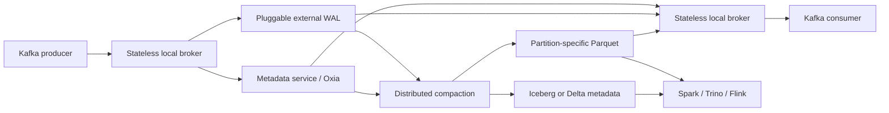

# Ursa: A Lakehouse-Native Data Streaming Engine for Kafka

> VLDB 2025 Best Industry Paper — structured reading notes

Full paper content: [Markdown conversion](../original/ursa-vldb-2025.md)

## Paper information

- **Authors:** Matteo Merli, Sijie Guo, Penghui Li, Hang Chen, and Neng Lu
- **Affiliation:** StreamNative, Inc.
- **Venue:** Proceedings of the VLDB Endowment, Volume 18, Number 12, 2025
- **Pages:** 5184–5196
- **Award:** VLDB 2025 Best Industry Paper
- **DOI:** [10.14778/3750601.3750636](https://doi.org/10.14778/3750601.3750636)
- **Paper page:** [PVLDB Volume 18](https://vldb.org/pvldb/volumes/18/paper/Ursa%3A%20A%20Lakehouse-Native%20Data%20Streaming%20Engine%20for%20Kafka)
- **PDF:** [Official paper](https://www.vldb.org/pvldb/vol18/p5184-guo.pdf)
- **Award source:** [VLDB 2025 Conference Awards](https://vldb.org/2025/?conference-awards=)

## One-sentence summary

Ursa implements the Kafka protocol over stateless brokers, external write-ahead-log storage,
centralized metadata, and open lakehouse tables, exchanging Kafka's very low latency for much
lower cloud infrastructure cost when a workload can tolerate roughly sub-second latency.

## Problem

A common real-time analytics pipeline operates two separate systems:

```text
producer -> Kafka brokers -> connector or ETL -> object storage -> lakehouse table
```

This architecture provides low-latency streaming, but it creates five cost drivers:

1. Partition leaders and replicas send data between availability zones.
2. Brokers retain multiple disk copies of each record.
3. Coupled compute and storage cause overprovisioning and partition rebalancing.
4. Connectors consume resources and add another operational failure domain.
5. The same logical data exists in Kafka, staging areas, and lakehouse files.

Lakehouse ingestion often needs 200–500 ms rather than sub-50 ms latency. Ursa asks whether a
system can spend that latency budget to remove the duplicated infrastructure.

## Design goals

- **Cost efficiency:** avoid cross-zone payload replication and broker-local disks.
- **Lakehouse-native storage:** write open formats without a separate connector.
- **Elasticity:** add or remove brokers without moving partitions.
- **Stream–table duality:** serve ordered Kafka reads and analytical table scans from one
  durable dataset.
- **Kafka compatibility:** preserve existing producer and consumer APIs.
- **Correctness:** retain monotonic offsets, linearizable appends, read-your-writes, and
  exactly-once compaction.

## Cost–availability–performance trade-off

The paper describes a cloud-streaming variant of CAP:

- **Cost:** dollars per unit of throughput.
- **Availability:** survival of availability-zone failures.
- **Performance tolerance:** the latency an application will accept.

Very low latency plus multi-zone availability generally requires expensive synchronous
replication. A workload that accepts higher latency can use object storage and reduce those
costs. This is an engineering trade-off, not a replacement for the traditional consistency,
availability, and partition-tolerance theorem.

## Architecture



### Stateless brokers

Brokers terminate Kafka connections and execute produce and fetch requests, but own neither
partitions nor local logs. Any broker can serve a partition after consulting metadata. Brokers
therefore scale without leader election, partition reassignment, or data migration.

Zone-aware discovery directs a client to a broker in the same availability zone. Payload data
stays local on the broker path; only small metadata operations need cross-zone coordination.

### Metadata service

The implementation uses StreamNative Oxia as the authoritative store for:

- stream and partition metadata;
- monotonically increasing offset assignment;
- the logical-offset-to-physical-object index;
- broker membership and discovery;
- transaction state and compaction state.

The interface is pluggable; the paper names etcd and Spanner as possible alternatives. Brokers
are leaderless, but the overall design still depends on a strongly consistent metadata system.

### Stream storage

Each Kafka topic-partition is an append-only **stream**. Its data transitions between two
physical forms:

- A **WAL object** batches records from multiple streams in a row-oriented format optimized for
  append throughput.
- A **compacted object** contains one stream's records in a larger Parquet file optimized for
  sequential catch-up reads and analytical scans.

The WAL implementation determines the operating point:

| WAL option | Goal | Reported latency class |
| --- | --- | --- |
| Replicated Apache BookKeeper | Latency optimized | Single-digit to low-hundreds of milliseconds |
| Cloud object storage | Cost optimized | Sub-second |

Acknowledgement occurs only after the WAL object and its metadata reference are durable.

### Offset index

Each stream has an ordered index in the metadata service. A key contains:

```text
(StreamID, OffsetEnd, CumulativeSize)
```

The value identifies the physical object, object type, record counts, byte position, and local
entry offsets. To fetch logical offset `x`, a broker finds the first entry whose exclusive
`OffsetEnd` is greater than `x`, then range-reads the referenced WAL or Parquet object.

The indirection is the key abstraction: compaction can replace physical files while the Kafka
offset space remains stable.

## Write path

1. The broker buffers records and sorts a batch by stream ID.
2. It writes the batch durably as one external WAL object.
3. A metadata transaction assigns consecutive offsets and adds index entries.
4. The broker acknowledges the producer after both data and index are durable.
5. Background compaction later rewrites the records to Parquet.

The data write precedes metadata publication. A crash between the two can leave an unreferenced
object, which cleanup can reclaim; it does not expose a committed offset without durable data.

## Read path

1. The consumer uses the normal Kafka fetch API.
2. A local broker resolves the requested offset through the metadata index.
3. Recent records are range-read from WAL objects.
4. Older records are read sequentially from partition-specific Parquet files.
5. Zonal caches reduce repeated object-store reads for consumers and compactors.

Recent tail reads favor append-friendly WAL data; backlog reads favor compacted Parquet. The
offset index presents both as one logical log.

## Distributed compaction

Interleaving many partitions in WAL objects is efficient for writes but causes read
amplification for lagging consumers. Ursa uses a MapReduce-like process:

1. **Task generation:** a leader divides stream offset ranges into adaptive windows and
   checkpoints progress in Oxia.
2. **Distributed conversion:** workers read WAL ranges, decode each record with its schema,
   and write partition-specific Zstandard-compressed Parquet.
3. **Atomic commit:** the leader batches file metadata, replaces offset-index references, and
   commits the files to the lakehouse catalog.
4. **Cleanup:** WAL and orphaned objects are deleted only after the new state is committed.

Workers scale independently from brokers, so historical conversion does not consume the live
ingestion tier. Previous metadata versions allow rollback after a partial failure.

### Stream-backed and external tables

- A **Stream-Backed Table (SBT)** lets the Kafka stream index and Iceberg or Delta metadata
  reference the same Parquet objects. Analytical engines read the table without copying data.
- **Stream-Delivered-to-Table (SDT)** writes a separate optimized copy for an external catalog,
  such as Databricks Unity Catalog or Snowflake. This is more flexible but gives up the
  single-copy advantage.

## Schema evolution

Producers attach Schema Registry IDs to records. Compaction decodes each record with its writer
schema and starts a new Parquet file when the schema ID changes. The table schema is a union of
historical versions:

- added fields become nullable;
- compatible types may be promoted;
- renamed fields follow the table format's rules;
- deleted columns remain physically available for compatibility;
- primary-key fields remain required.

A malformed record is sent to a dead-letter topic. Its offset is still represented so the main
stream keeps a gap-free logical order.

## Kafka-compatible behavior

The broker layer supports Kafka clients and implements producer and consumer flows on top of
Ursa primitives. The paper also describes:

- transactional writes and exactly-once behavior;
- consumer group coordination;
- read-your-writes across broker failure;
- Kafka-style keyed topic compaction.

For keyed compaction, a worker retains the highest offset seen for each key, writes a new
Parquet object, and atomically swaps the index only after the replacement is durable. Normally
one topic compactor runs per partition, simplifying concurrency control.

## Evaluation

### Benchmark environment

- AWS across three availability zones.
- Cost-optimized, object-storage WAL backed by Amazon S3.
- OpenMessaging Benchmark workloads.
- Six `m6i.8xlarge` producer nodes and six consumer nodes.
- Twelve additional `m6i.8xlarge` nodes for Ursa brokers and Oxia.

### Performance results reported by the authors

- Produce and consume throughput stayed near **5 GB/s** across tested partition counts.
- Throughput stayed near **5 GB/s** for 1 KiB, 4 KiB, and 64 KiB messages.
- P99 publish latency remained below **1 second** under 1:1, 1:3, and 1:5 write-to-read ratios.
- Backlog draining continued while ingesting up to **2 GB/s**, with spikes mainly at p99.9.
- CPU utilization was generally **30–60%**; network bandwidth was the main bottleneck.

### Production evidence reported by the authors

At publication time, Ursa had run for two years on StreamNative Cloud across AWS, GCP, and
Azure. The authors report hundreds of clusters, sub-second end-to-end latency, and one customer
deployment that reduced infrastructure cost by 10× relative to its previous multi-AZ Kafka
deployment.

### Cost experiment

The experiment produced ten billion records, or 180 GB after LZ4 compression, over two hours.
Compaction created 2,597 Parquet files totaling 55 GB. The paper applies seven-day Kafka
retention and one-month lakehouse retention.

| Two-hour modeled cost | Ursa | Kafka with disk | Kafka with tiered storage |
| --- | ---: | ---: | ---: |
| Server EC2 | $1.04 | $0.52 | $0.52 |
| Connector EC2 | $0.00 | $0.52 | $0.52 |
| Inter-zone network | $0.00 | $6.00 | $6.00 |
| Storage | $1.27 | $28.27 | $4.94 |
| S3 requests | $0.40 | $0.00 | $0.00 |
| **Total** | **$2.71** | **$35.31** | **$11.98** |

Under those assumptions, Ursa is 92% cheaper than disk-backed Kafka and 78% cheaper than the
tiered-storage configuration.

## What is genuinely novel

No individual ingredient is unprecedented: stateless compute, remote logs, object storage,
Parquet, consistent metadata stores, and lakehouse catalogs all exist independently. Ursa's
contribution is their composition behind the Kafka protocol, especially the offset index that
lets one logical stream move safely from append-oriented WAL objects to query-oriented Parquet
files.

The strongest systems lesson is to design around the latency a workload actually needs. If an
ingestion pipeline can accept hundreds of milliseconds, preserving a sub-50 ms architecture
may waste money on replicas, disks, and cross-zone traffic.

## Limitations and questions

- **Latency is intentionally higher.** Object-store WAL mode does not replace Kafka for
  workloads that require consistently low tens-of-milliseconds latency.
- **The metadata service is critical.** Brokers have no partition leaders, but ordering and
  publication depend on a strongly consistent centralized service. Its scaling and failure
  limits deserve careful capacity testing.
- **Availability depends on configuration.** Lower cross-zone cost comes from moving some
  durability and availability responsibility to the selected WAL and object store.
- **Benchmarks are vendor-authored.** The authors built and operate Ursa. Independent,
  reproducible comparisons would strengthen the results.
- **Cost results are assumption-sensitive.** Region, cloud prices, retention, compression,
  traffic shape, connector sizing, and Kafka replication policy can change the outcome.
- **The comparison omits some modern alternatives.** A detailed benchmark against other
  zero-disk Kafka-compatible products would better isolate Ursa's open-table advantage.
- **SBT and SDT have different economics.** External catalogs may require the second Parquet
  copy that the headline single-copy architecture seeks to avoid.
- **Compaction debt matters.** Sustained overload of compactors can increase WAL retention,
  catch-up read amplification, storage requests, and time until data becomes analytics-ready.

## Practical design checklist

Ursa's architecture is a good candidate when:

- existing applications require the Kafka API;
- the primary destination is Iceberg or Delta Lake;
- p99 latency below roughly one second is acceptable;
- cross-zone network and replicated broker storage dominate cost;
- workloads benefit from independent broker and compactor scaling.

Traditional Kafka or a latency-optimized WAL remains attractive when:

- tens-of-milliseconds tail latency is a hard requirement;
- consumers mostly read the live tail and lakehouse integration is secondary;
- object-store availability or request latency cannot satisfy the workload;
- the organization already operates Kafka efficiently and connector cost is small.

## Takeaways

1. Separate the logical log from its physical representation with a durable offset index.
2. Use row-oriented batches for the hot write path and columnar files for cold reads and
   analytics.
3. Make brokers disposable by moving durable state and sequencing behind explicit interfaces.
4. Route data within an availability zone and replicate only what the availability target
   requires.
5. Commit replacement files atomically before deleting old objects.
6. Treat compaction as an independently scalable data plane, not broker background work.
7. Compare systems using total pipeline cost, including connectors, duplicate data, network,
   and operational capacity—not broker instance cost alone.

## Citation

```bibtex
@article{merli2025ursa,
  author = {Matteo Merli and Sijie Guo and Penghui Li and Hang Chen and Neng Lu},
  title = {Ursa: A Lakehouse-Native Data Streaming Engine for Kafka},
  journal = {Proceedings of the VLDB Endowment},
  volume = {18},
  number = {12},
  pages = {5184--5196},
  year = {2025},
  doi = {10.14778/3750601.3750636}
}
```
