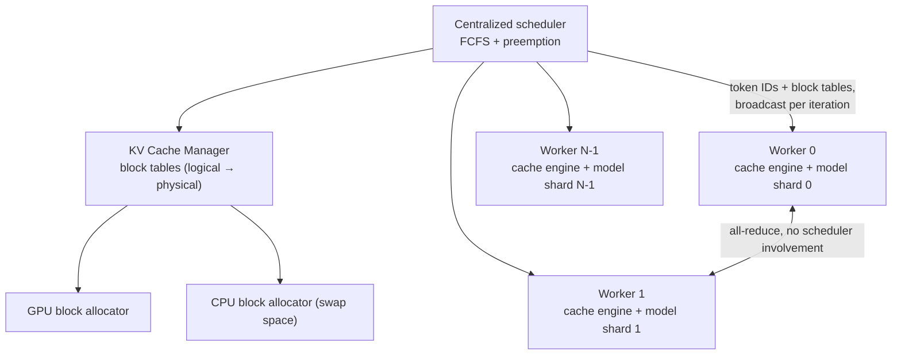

# vLLM: Efficient Memory Management for Large Language Model Serving with PagedAttention

> SOSP 2023 — structured reading notes

Full paper content: [Markdown conversion](../original/vllm-sosp-2023.md)

## Paper information

- **Authors:** Woosuk Kwon\*, Zhuohan Li\* (UC Berkeley), Siyuan Zhuang (UC Berkeley), Ying Sheng
  (UC Berkeley / Stanford), Lianmin Zheng (UC Berkeley), Cody Hao Yu (independent), Joseph E.
  Gonzalez (UC Berkeley), Hao Zhang (UC San Diego), Ion Stoica (UC Berkeley) — \*equal contribution
- **Venue:** SOSP '23, October 23–26, 2023, Koblenz, Germany
- **DOI:** [10.1145/3600006.3613165](https://doi.org/10.1145/3600006.3613165)
- **Code:** https://github.com/vllm-project/vllm

## One-sentence summary

LLM serving throughput is bounded by how many requests fit in GPU memory, and existing systems
waste **60–80% of KV cache memory** by pre-allocating contiguous buffers sized for the maximum
possible sequence length; **PagedAttention** borrows OS virtual memory and paging — fixed-size
blocks, a page table, reference counting, copy-on-write — to cut that waste to near zero and enable
sharing, giving **2–4× throughput at the same latency**.

## Problem

An autoregressive Transformer generates tokens **one at a time**, each depending on the key and
value vectors of every previous token — the **KV cache**. This sequential process is
**memory-bound**, underutilizing GPU compute and limiting throughput. Batching is the fix, but
batch size is bounded by memory.

**Memory layout for a 13B model on a 40 GB A100:**

| Region | Share | Behavior |
| --- | --- | --- |
| Model weights | ~65% | Static throughout serving |
| **KV cache** | ~30% | **Allocated and freed per request; grows dynamically** |
| Activations | small | Ephemeral |

Since weights are constant and activations are small, **KV cache management determines maximum
batch size, and therefore throughput.**

### Why the KV cache is hard

**It is enormous.** For OPT-13B, one token's KV cache needs **800 KB** — 2 (key and value) × 5120
(hidden size) × 40 (layers) × 2 (bytes, FP16). At a 2048-token maximum, **one request can need
1.6 GB**. Even dedicating all GPU memory to KV cache admits only a few tens of requests. And the
trend is worsening: **from A100 to H100, FLOPS more than doubled while memory stayed at 80 GB**.

**Its lifetime and length are unknown a priori** — unlike ordinary deep learning tensors, it grows
and shrinks as generation proceeds.

**Decoding algorithms create sharing opportunities.** Parallel sampling generates several outputs
from one prompt, so **the prompt's KV cache could be shared** (12% of total KV memory in their
experiments). Beam search allows **much larger sharing (up to 55%)**, with **patterns that change
as decoding advances**.

### What existing systems do wrong

Because most deep learning operators require **contiguous tensors**, prior systems (FasterTransformer,
Orca) store each request's KV cache contiguously — and since output length is unpredictable, they
**pre-allocate a chunk sized to the maximum possible sequence length**. Three distinct wastes
follow:

| Waste type | Cause | When it is known |
| --- | --- | --- |
| **Internal fragmentation** | Over-provisioning for the maximum length — a request capped at 2048 that produces 10 tokens wastes 2038 slots | Only after the request finishes |
| **Reserved** | Slots that *will* eventually be used but are held for the request's whole lifetime, unusable by others | — |
| **External fragmentation** | Different pre-allocation sizes per request, from an allocator like buddy allocation | **Before serving even begins** — it will never be used |

Measured result: **only 20.4%–38.2% of KV cache memory holds actual token state.**

Two further points close off the obvious escapes. **Compaction is impractical** in a
performance-sensitive serving system given the size of the KV cache. And even *with* compaction,
**pre-allocated per-request chunks still prevent the sharing that decoding algorithms want.**

## PagedAttention

The insight: this is the **memory fragmentation and sharing problem that operating systems solved
with virtual memory and paging**. The mapping is direct:

```text
OS                     vLLM
────────────────────   ──────────────────────
page              ←→   KV block (fixed number of tokens)
byte              ←→   token
process           ←→   request
page table        ←→   block table
```

PagedAttention **partitions each sequence's KV cache into KV blocks** of a fixed **block size B**,
which **need not be contiguous in physical memory**. Writing the key block
`K_j = (k_{(j−1)B+1}, …, k_{jB})` and value block `V_j` similarly, attention becomes a **blockwise
computation**: the kernel fetches each block separately, multiplies the query vector by that
block's keys to get the partial attention scores `A_ij`, then multiplies `A_ij` by the block's
values to accumulate the output.

Three consequences follow directly from the OS analogy:

1. **Internal fragmentation is bounded to one block per sequence**, since blocks are small and
   allocated on demand.
2. **External fragmentation is eliminated entirely**, because all blocks are the same size.
3. **Sharing becomes possible at block granularity** — across sequences within one request, or even
   across different requests.

*(Implementation note: all key/value vectors across layers and heads could share one block table,
or each head/layer could have its own. The paper reports **no performance difference** and chose
the latter for implementation simplicity.)*

## vLLM architecture



**The KV cache manager** is the virtual memory system. A request's KV cache is a series of
**logical KV blocks**, filled left to right as tokens are generated, with the last block's unfilled
positions reserved for future generation. On each GPU worker a **block engine** allocates a
contiguous chunk of GPU DRAM and divides it into **physical KV blocks** (the same is done on CPU
RAM for swapping). **Block tables** map logical to physical blocks per request, each entry
recording the physical block and **the number of filled positions**.

**Separating logical from physical blocks is what removes the waste** — the cache can grow
dynamically without reserving anything for positions that may never be used.

### Decoding walkthrough

For a 7-token prompt with block size 4:

1. **Prefill.** vLLM reserves only the blocks needed for the prompt — 2 logical blocks mapped to
   physical blocks 7 and 1. Prompt KV cache and the first output token are computed with a
   **conventional attention kernel**; 4 tokens go in logical block 0, 3 in logical block 1, and
   **one slot remains free**.
2. **First decode step.** PagedAttention runs over physical blocks 7 and 1. The new token's KV cache
   fills the free slot; the block table's `#filled` is updated. **No allocation.**
3. **Second decode step.** The last logical block is now full, so vLLM **allocates a new physical
   block (3)** and records the mapping.

Per iteration globally: select candidate sequences for the batch, allocate physical blocks for
newly needed logical blocks, **concatenate all input tokens across requests into one sequence**
(all prompt tokens for prefill requests, the latest token for generation requests), run the model,
and write new KV cache into physical blocks.

**Why block size > 1 matters:** storing multiple tokens per block lets the kernel **process more
positions in parallel**, raising hardware utilization and cutting latency — but **larger blocks
increase fragmentation**. This is the central tuning knob (see ablations).

Because blocks fill left to right and a new one is allocated only when the previous is full,
**all memory waste for a request is confined to a single block.**

## Applying it to decoding algorithms

### Parallel sampling — reference counting and copy-on-write

Multiple samples from one prompt can **share the prompt's KV cache**. vLLM maps both sequences'
logical prompt blocks to the **same physical blocks**, tracked by a **reference count** per physical
block.

At generation the samples diverge, so vLLM applies **copy-on-write at block granularity**, exactly
as an OS does on `fork`: when sample A1 writes to a shared block whose refcount > 1, vLLM allocates
a new physical block, **copies the contents**, and decrements the refcount. When A2 later writes,
the refcount is already 1, so it **writes in place**.

Net effect: **the entire prompt is shared except the final logical block** — a large saving
**especially for long prompts**.

### Beam search — where the OS analogy pays most

Beam search keeps the top-*k* candidates each step, expanding each and retaining the *k* most
probable of *k·|V|* candidates. Unlike parallel sampling, it shares **not only prompt blocks but
blocks among candidates, with patterns that change dynamically** — "similar to the process tree in
the OS created by compound forks."

The paper's *k*=4 example: all candidates share block 0 (the prompt); candidate 3 diverges at the
second block; candidates 0–2 share three blocks and diverge at the fourth. When the next top-4 all
descend from candidates 1 and 2, **candidates 0 and 3's logical blocks are freed, refcounts drop,
and vLLM frees every physical block whose count hits 0**, then allocates new ones for the new
candidates.

The contrast with prior systems is stark: **they require frequent large memory copies of KV cache
between beam candidates** — in this example candidate 3 would have to copy most of candidate 2's
cache to continue. In vLLM, **most blocks are simply shared, and copy-on-write fires only when a
new token lands inside an old shared block — copying exactly one block.**

### Shared prefix — the shared library analogy

System prompts (instructions plus few-shot examples) are prepended to many requests. vLLM lets the
service provider **reserve physical blocks for predefined shared prefixes, exactly as an OS handles
a shared library across processes**. A request with that prefix simply **maps its logical blocks to
the cached physical blocks** (last block marked copy-on-write), and **the prefill computation only
runs on the user's task input**.

### Mixed decoding methods

Requests using *different* decoding algorithms can be batched together — something existing systems
**cannot** do efficiently. The reason is architectural: **the block table is a mapping layer that
hides all sharing**, so "the LLM and its execution kernel only see a list of physical block IDs for
each sequence and do not need to handle sharing patterns across sequences." That widens batching
opportunities and raises overall throughput.

## Scheduling and preemption

Policy is **first-come-first-serve** for fairness and starvation avoidance; when preemption is
needed, **the latest-arrived requests are preempted first**.

Two classic questions arise, and vLLM answers both with LLM-specific knowledge:

**Which blocks to evict?** Generic policies guess which block will be used furthest in the future.
vLLM doesn't need to guess: **all blocks of a sequence are always accessed together**, so it uses
**all-or-nothing eviction** — evict every block of a sequence or none. Further, sequences within
one request (e.g. beam candidates) form a **sequence group** that is **gang-scheduled**, always
preempted and rescheduled together, because they may share memory.

**How to recover evicted blocks?** Two mechanisms:

- **Swapping** — copy evicted blocks to CPU RAM, managed by the CPU block allocator. Once vLLM
  preempts a sequence it **stops accepting new requests until all preempted sequences complete**;
  as requests finish, preempted blocks are brought back. A neat property: **the number of blocks
  swapped out never exceeds the total physical GPU blocks**, so **CPU swap space is bounded by the
  GPU KV cache size**.
- **Recomputation** — simply recompute the KV cache on reschedule. Crucially, **this is much cheaper
  than the original generation**, because the tokens generated so far can be **concatenated with the
  original prompt and processed as one prefill iteration** rather than one token at a time. (The
  paper notes this option **is not available to an OS** — a case where application semantics beat
  the generic mechanism.)

## Distributed execution

vLLM supports **Megatron-LM style tensor model parallelism** with an SPMD schedule: linear layers do
block-wise matrix multiplication, GPUs synchronize via **all-reduce**, and **attention is split
along the attention-head dimension** so each process handles a subset of heads.

The key observation: **every model shard processes the same input tokens and therefore needs KV
cache for the same positions.** So vLLM keeps **a single KV cache manager in the centralized
scheduler**, shared by all workers along with one logical→physical mapping. **Workers share physical
block IDs but each stores only the KV cache for its own attention heads.**

Per step: the scheduler prepares input token IDs and block tables per request, **broadcasts this
control message**, workers execute and read KV cache per the block table, **synchronize intermediate
results by all-reduce without scheduler involvement**, and return sampled tokens. The result is
that **workers never synchronize on memory management** — they receive everything they need at the
start of each iteration.

## Implementation

**8.5K lines of Python and 2K lines of C++/CUDA**, with a FastAPI frontend extending the OpenAI API
so users set per-request sampling parameters. Control components (scheduler, block manager) are
Python; custom CUDA kernels handle the hot paths. Models (GPT, OPT, LLaMA) use PyTorch and
Transformers; NCCL handles tensor communication.

**Three kernel-level optimizations**, all addressing overheads that paging introduces:

1. **Fused reshape and block write** — new KV cache must be split into blocks, reshaped for
   block-optimized reads, and written at block-table positions; fusing avoids multiple kernel
   launches.
2. **Fused block read and attention** — an adapted FasterTransformer attention kernel reads KV cache
   per the block table and attends on the fly, **assigning a GPU warp per block to keep memory
   access coalesced**, with support for variable sequence lengths in a batch.
3. **Fused block copy** — copy-on-write may touch many discontinuous blocks; batching them into one
   kernel launch avoids many small `cudaMemcpyAsync` calls.

**Decoding algorithms are expressed with just three primitives** — `fork`, `append`, `free` —
which is how parallel sampling, beam search, and prefix sharing are all implemented, and how the
authors expect future algorithms to be supported.

## Evaluation

### Setup

- **Models:** OPT-13B/66B/175B and LLaMA-13B, on NVIDIA A100s (GCP A2 instances).

  | Model | 13B | 66B | 175B |
  | --- | --- | --- | --- |
  | GPUs | A100 | 4×A100 | 8×A100-80GB |
  | Total GPU memory | 40 GB | 160 GB | 640 GB |
  | Parameter size | 26 GB | 132 GB | 346 GB |
  | **Memory for KV cache** | **12 GB** | **21 GB** | **264 GB** |
  | Max KV cache slots | 15.7K | 9.7K | 60.1K |

- **Workloads:** synthesized from **ShareGPT** (real ChatGPT conversations) and **Alpaca**
  (GPT-3.5-generated instructions). **ShareGPT has 8.4× longer prompts and 5.8× longer outputs on
  average, with higher variance.** Arrival times generated by a Poisson process at varying rates.
- **Metric:** **normalized latency** — mean end-to-end latency divided by output length (following
  Orca). A good system keeps this low as request rate rises. 1-hour traces (15 minutes for OPT-175B,
  for cost).
- **Baselines:**
  - **FasterTransformer** — latency-optimized; has no scheduler, so the authors added dynamic
    batching similar to Triton, taking up to *B* earliest requests.
  - **Orca** — the throughput-optimized state of the art, not publicly available, so
    **reimplemented** with buddy allocation, in **three variants** bracketing its behavior:
    **Oracle** (knows true output lengths — an unachievable upper bound), **Pow2** (over-reserves by
    at most 2×), and **Max** (always reserves the model maximum, 2048 tokens).

### Basic sampling

| Comparison | ShareGPT |
| --- | --- |
| vs. **Orca (Oracle)** | **1.7×–2.7×** higher sustainable request rate |
| vs. **Orca (Max)** | **2.7×–8×** |
| vs. **FasterTransformer** | **up to 22×** |

The mechanism is visible directly in batch size: for OPT-13B, vLLM processes **2.2× more requests
concurrently than Orca (Oracle) and 4.3× more than Orca (Max)**.

The latency curves all show the same shape — gradual increase, then a sudden explosion once the
request rate exceeds capacity and the queue grows without bound.

**The one place vLLM's advantage narrows** is OPT-175B on Alpaca: that configuration has **264 GB
for KV cache** while Alpaca sequences are short, so even wasteful allocators batch plenty of
requests — **the system becomes compute-bound rather than memory-bound**. This is the honest boundary
of the technique.

### Parallel sampling and beam search

Sharing pays more as sharing opportunities grow. On OPT-13B/Alpaca, the advantage over Orca (Oracle)
rises **from 1.3× in basic sampling to 2.3× in beam search with width 6**.

**Measured memory saved by sharing** (blocks saved ÷ blocks without sharing):

| Workload | Parallel sampling | Beam search |
| --- | --- | --- |
| Alpaca | 6.1%–9.8% | **37.6%–55.2%** |
| ShareGPT | 16.2%–30.5% | **44.3%–66.3%** |

Longer prompts share more — exactly as the design predicts.

### Shared prefix

LLaMA-13B on WMT16 English→German translation, with a synthesized instruction prefix:

- **One-shot prefix (80 tokens): 1.67× higher throughput** than Orca (Oracle).
- **Five-shot prefix (341 tokens): 3.58×.**

### Chatbot

Chat history plus the latest query concatenated into a prompt, from ShareGPT, truncated to the last
1024 tokens with up to 1024 generated. **vLLM sustains 2× the request rate of all three Orca
baselines** — and notably **all three Orca variants behave identically here**, because with
1024-token prompts buddy allocation reserves 1024 output slots regardless of how well it predicts
output length.

## Ablations

**Kernel overhead.** PagedAttention's block table access, extra branches, and variable-length
handling cost **20–26% higher attention kernel latency** than FasterTransformer's highly optimized
kernel. The authors argue this is acceptable because **it affects only the attention operator, not
Linear layers or others** — and end-to-end vLLM still dominates.

**Block size.** Too small underutilizes GPU parallelism; too large increases internal fragmentation
and reduces sharing probability.

- **ShareGPT:** block sizes **16–128** all perform well.
- **Alpaca:** **16 and 32** work; larger sizes **significantly degrade** performance because
  sequences become shorter than the block.
- **vLLM's default is 16** — "large enough to efficiently utilize the GPU and small enough to avoid
  significant internal fragmentation in most workloads."

**Recomputation vs. swapping.**

- **Swapping degrades badly at small block sizes**, because many small CPU↔GPU transfers **cannot
  saturate PCIe bandwidth**.
- **Recomputation cost is constant across block sizes**, since it doesn't touch KV blocks at all.
- So **recomputation wins for small blocks, swapping for large ones**, and **recomputation overhead
  never exceeds 20% of swapping's latency**.
- **For medium blocks (16–64) the two are comparable end to end.**

## Discussion: where this generalizes, and where it doesn't

The authors are unusually explicit about scope. Virtual memory and paging work here because the
workload **needs dynamic allocation (output length unknown) and is bound by GPU memory capacity**.
Neither holds generally:

- **DNN training** has static tensor shapes, so allocation can be optimized ahead of time.
- **Serving non-LLM DNNs** is typically **compute-bound**, so better memory efficiency buys nothing —
  and vLLM's techniques would **degrade performance** through memory indirection and non-contiguous
  access.

They also enumerate the **LLM-specific augmentations to the OS idea**, which is where the paper's
craft lies:

- **All-or-nothing swap-out**, exploiting the fact that a request needs all its token states
  resident;
- **Recomputation as a recovery mechanism**, which "is not feasible in OS";
- **Fusing the memory-access kernels with attention** to mitigate indirection overhead.

## Positioning against related work

- **General model serving systems** — Clipper, TensorFlow Serving, Nexus, InferLine, Clockwork, and
  more recently DVABatch (multi-entry multi-exit batching), REEF and Shepherd (preemption),
  AlpaServe (model parallelism for statistical multiplexing) — all **fail to account for the
  autoregressive property and token state of LLM inference**, missing these optimizations entirely.
- **Orca is complementary, not competing.** "Orca achieves it by scheduling and interleaving the
  requests so that more requests can be processed in parallel, while vLLM is doing so by increasing
  memory utilization so that the working sets of more requests fit into memory." Better still,
  **fine-grained interleaving makes memory management harder, which makes vLLM's techniques more
  necessary, not less.**
- **Memory optimizations elsewhere:** swapping and recomputation are standard for reducing peak
  training memory. **FlexGen** swaps weights and token states for LLM inference under limited GPU
  memory but **does not target online serving**. **OLLA** optimizes tensor lifetime and location to
  reduce fragmentation but does **no fine-grained block-level management or online serving**.
  **FlashAttention** uses tiling and kernel optimizations to reduce attention's peak memory and I/O.
  The novel contribution here is **block-level memory management in the context of online serving.**

## Limitations and questions

- **Attention kernel is 20–26% slower** than the best contiguous-memory implementation. The bet is
  that batch size gains dominate — true when memory-bound, false otherwise.
- **The advantage vanishes when the workload is compute-bound**, demonstrated by the authors
  themselves on OPT-175B with short Alpaca sequences.
- **Orca is reimplemented, not measured.** The three variants (Oracle/Pow2/Max) are a fair attempt to
  bracket real behavior, but **Oracle is explicitly infeasible in practice**, so the honest headline
  comparison is against a baseline stronger than anything deployable.
- **Preemption is coarse and conservative:** once vLLM preempts, it **stops admitting new requests
  until all preempted sequences complete** — simple and starvation-free, but a throughput cliff under
  sustained overload.
- **FCFS only.** No priority, no SLO awareness, no fairness across tenants.
- **Block size is a single global constant** (16), though the ablation shows the optimum is
  workload-dependent (ShareGPT tolerates up to 128, Alpaca degrades past 32).
- **Sharing is limited to identical prefixes at block granularity** — a prefix that diverges mid-block
  cannot share that block, and the shared-prefix feature requires the operator to **pre-register**
  prefixes rather than discovering them.
- **Swap space is CPU RAM only**, and swapping is bandwidth-limited at small block sizes.
- **No accuracy impact**, which the paper states clearly — this is a pure systems result.

## Practical design checklist

The technique applies when:

- the workload allocates memory **dynamically with unpredictable lifetimes**;
- performance is **memory-capacity-bound**, not compute-bound;
- multiple consumers have **substantial shareable state** (common prompts, beam candidates, system
  prompts);
- you control the kernel and can **fuse indirection into existing memory operations**.

It does not apply when:

- shapes are static and allocation can be planned ahead (training);
- the workload is compute-bound, where indirection is pure overhead;
- there is nothing to share, and fragmentation is already low.

## Takeaways

1. **The bottleneck was allocation policy, not the model or the kernel.** 60–80% of KV cache memory
   was being wasted; recovering it was worth 2–4× throughput without touching model quality.
2. **Old OS ideas transfer when the problem shape matches.** Dynamic, unpredictable lifetimes plus a
   hard capacity limit is exactly what virtual memory was invented for — and paging, page tables,
   reference counting, and copy-on-write all mapped over essentially unchanged.
3. **Fixed-size blocks kill external fragmentation by construction** and bound internal
   fragmentation to one block per sequence. The whole waste taxonomy collapses to a single small
   remainder.
4. **Indirection buys sharing, and sharing is the second-order win.** Reference-counted blocks turn
   beam search from a memory-copy-heavy algorithm into a pointer-manipulation one — 37–66% memory
   saved.
5. **A mapping layer decouples policy from mechanism.** Because the kernel only ever sees physical
   block IDs, vLLM can batch requests using *different* decoding algorithms together — a capability
   competitors structurally cannot offer.
6. **Adapt the generic mechanism with application semantics.** All-or-nothing eviction (you know
   access patterns), gang scheduling of sequence groups (you know the sharing), and recomputation as
   a swap alternative (you can regenerate state) are all things an OS cannot do — and all three
   matter.
7. **Pay a local cost for a global win, and measure both.** A 20–26% slower attention kernel is
   worth it when it lets you batch 2–4× more requests — but the paper is careful to show the regime
   (compute-bound) where that trade stops paying.
8. **Complementary beats competitive.** vLLM's clearest framing is that it and Orca solve different
   halves of the same utilization problem — and that solving one makes the other more valuable.

## Citation

```bibtex
@inproceedings{kwon2023vllm,
  author = {Woosuk Kwon and Zhuohan Li and Siyuan Zhuang and Ying Sheng and Lianmin Zheng and
            Cody Hao Yu and Joseph E. Gonzalez and Hao Zhang and Ion Stoica},
  title = {Efficient Memory Management for Large Language Model Serving with {PagedAttention}},
  booktitle = {Proceedings of the 29th Symposium on Operating Systems Principles (SOSP '23)},
  year = {2023},
  doi = {10.1145/3600006.3613165}
}
```
